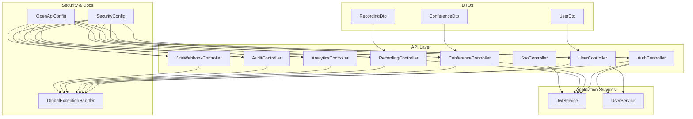
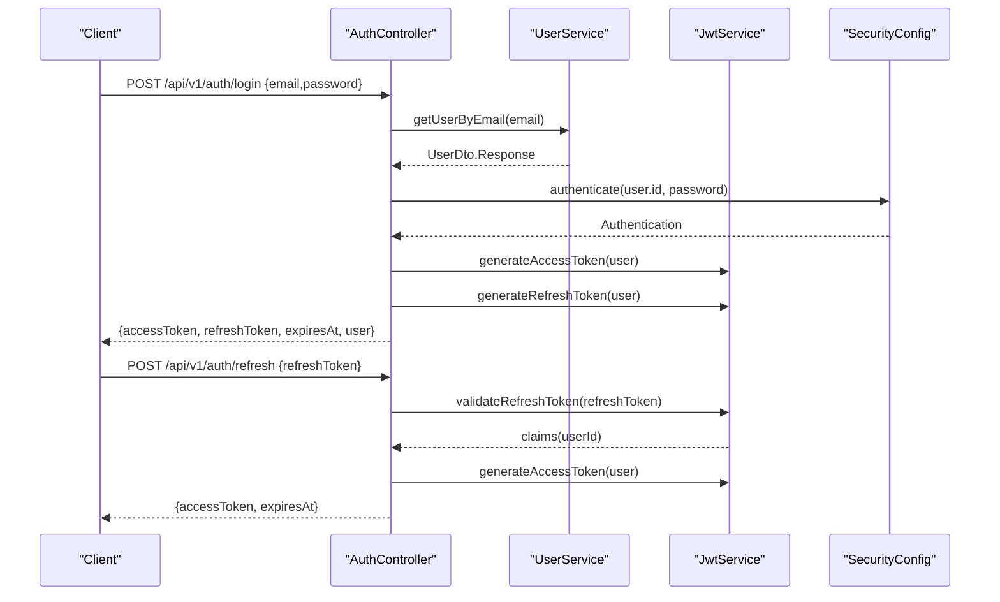
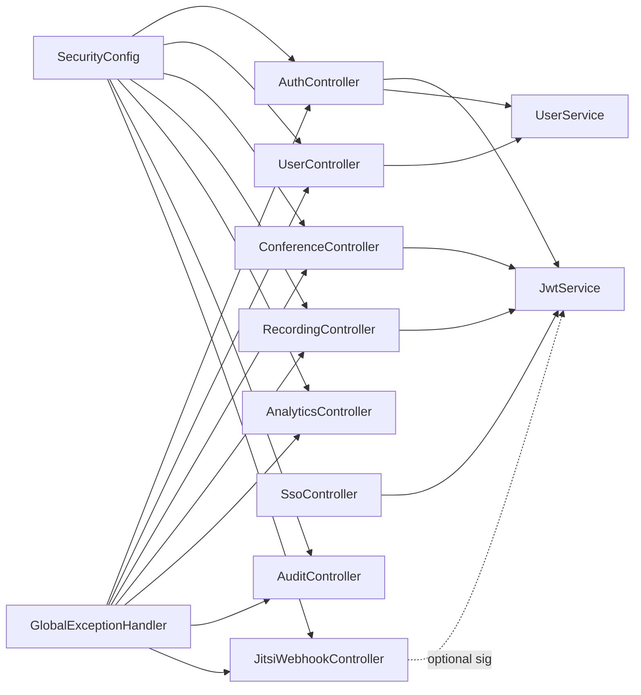

# API Documentation

<cite>
**Referenced Files in This Document**
- [AuthController.java](file://jmp-api/src/main/java/com/jmp/api/controller/AuthController.java)
- [UserController.java](file://jmp-api/src/main/java/com/jmp/api/controller/UserController.java)
- [ConferenceController.java](file://jmp-api/src/main/java/com/jmp/api/controller/ConferenceController.java)
- [RecordingController.java](file://jmp-api/src/main/java/com/jmp/api/controller/RecordingController.java)
- [AnalyticsController.java](file://jmp-api/src/main/java/com/jmp/api/controller/AnalyticsController.java)
- [AuditController.java](file://jmp-api/src/main/java/com/jmp/api/controller/AuditController.java)
- [JitsiWebhookController.java](file://jmp-api/src/main/java/com/jmp/api/controller/JitsiWebhookController.java)
- [SsoController.java](file://jmp-api/src/main/java/com/jmp/api/controller/SsoController.java)
- [JwtService.java](file://jmp-application/src/main/java/com/jmp/application/service/JwtService.java)
- [UserService.java](file://jmp-application/src/main/java/com/jmp/application/service/UserService.java)
- [UserDto.java](file://jmp-application/src/main/java/com/jmp/application/dto/UserDto.java)
- [ConferenceDto.java](file://jmp-application/src/main/java/com/jmp/application/dto/ConferenceDto.java)
- [RecordingDto.java](file://jmp-application/src/main/java/com/jmp/application/dto/RecordingDto.java)
- [SecurityConfig.java](file://jmp-infrastructure/src/main/java/com/jmp/infrastructure/security/SecurityConfig.java)
- [OpenApiConfig.java](file://jmp-api/src/main/java/com/jmp/api/config/OpenApiConfig.java)
- [GlobalExceptionHandler.java](file://jmp-api/src/main/java/com/jmp/api/advice/GlobalExceptionHandler.java)
</cite>

## Table of Contents
1. [Introduction](#introduction)
2. [Project Structure](#project-structure)
3. [Core Components](#core-components)
4. [Architecture Overview](#architecture-overview)
5. [Detailed Component Analysis](#detailed-component-analysis)
6. [Dependency Analysis](#dependency-analysis)
7. [Performance Considerations](#performance-considerations)
8. [Troubleshooting Guide](#troubleshooting-guide)
9. [Conclusion](#conclusion)
10. [Appendices](#appendices)

## Introduction
This document provides comprehensive API documentation for the Jitsi Management Platform REST endpoints. It covers authentication, user management, conference lifecycle, recording management, analytics and reporting, audit logging, and Jitsi webhook integration. For each endpoint, you will find HTTP methods, URL patterns, request/response schemas, authentication requirements, permissions, pagination, filtering, and error handling. Practical cURL examples and security considerations are included.

## Project Structure
The API is organized into controllers grouped by domain capability, with supporting services, DTOs, security configuration, and global exception handling.

**Diagram sources**
- [AuthController.java:30-124](file://jmp-api/src/main/java/com/jmp/api/controller/AuthController.java#L30-L124)
- [UserController.java:33-123](file://jmp-api/src/main/java/com/jmp/api/controller/UserController.java#L33-L123)
- [ConferenceController.java:37-189](file://jmp-api/src/main/java/com/jmp/api/controller/ConferenceController.java#L37-L189)
- [RecordingController.java:35-138](file://jmp-api/src/main/java/com/jmp/api/controller/RecordingController.java#L35-L138)
- [AnalyticsController.java:26-96](file://jmp-api/src/main/java/com/jmp/api/controller/AnalyticsController.java#L26-L96)
- [AuditController.java:30-82](file://jmp-api/src/main/java/com/jmp/api/controller/AuditController.java#L30-L82)
- [JitsiWebhookController.java:24-125](file://jmp-api/src/main/java/com/jmp/api/controller/JitsiWebhookController.java#L24-L125)
- [SsoController.java:30-125](file://jmp-api/src/main/java/com/jmp/api/controller/SsoController.java#L30-L125)
- [JwtService.java:25-236](file://jmp-application/src/main/java/com/jmp/application/service/JwtService.java#L25-L236)
- [UserService.java:28-190](file://jmp-application/src/main/java/com/jmp/application/service/UserService.java#L28-L190)
- [UserDto.java:14-97](file://jmp-application/src/main/java/com/jmp/application/dto/UserDto.java#L14-L97)
- [ConferenceDto.java:15-176](file://jmp-application/src/main/java/com/jmp/application/dto/ConferenceDto.java#L15-L176)
- [RecordingDto.java:13-170](file://jmp-application/src/main/java/com/jmp/application/dto/RecordingDto.java#L13-L170)
- [SecurityConfig.java:28-90](file://jmp-infrastructure/src/main/java/com/jmp/infrastructure/security/SecurityConfig.java#L28-L90)
- [OpenApiConfig.java:20-56](file://jmp-api/src/main/java/com/jmp/api/config/OpenApiConfig.java#L20-L56)
- [GlobalExceptionHandler.java:22-130](file://jmp-api/src/main/java/com/jmp/api/advice/GlobalExceptionHandler.java#L22-L130)

**Section sources**
- [OpenApiConfig.java:20-56](file://jmp-api/src/main/java/com/jmp/api/config/OpenApiConfig.java#L20-L56)
- [SecurityConfig.java:28-90](file://jmp-infrastructure/src/main/java/com/jmp/infrastructure/security/SecurityConfig.java#L28-L90)

## Core Components
- Authentication and Authorization: JWT-based bearer tokens with access/refresh pairs. Public endpoints include login, refresh, and webhooks. Other endpoints require bearer auth.
- Controllers: Expose REST endpoints for each domain capability.
- Services: Encapsulate business logic and integrate with repositories and infrastructure.
- DTOs: Define request/response schemas for strong typing and validation.
- Exception Handling: Centralized RFC 7807 Problem Details responses.

**Section sources**
- [JwtService.java:25-236](file://jmp-application/src/main/java/com/jmp/application/service/JwtService.java#L25-L236)
- [SecurityConfig.java:42-61](file://jmp-infrastructure/src/main/java/com/jmp/infrastructure/security/SecurityConfig.java#L42-L61)
- [GlobalExceptionHandler.java:22-130](file://jmp-api/src/main/java/com/jmp/api/advice/GlobalExceptionHandler.java#L22-L130)

## Architecture Overview
High-level flow for authenticated requests and token management.

**Diagram sources**
- [AuthController.java:42-100](file://jmp-api/src/main/java/com/jmp/api/controller/AuthController.java#L42-L100)
- [JwtService.java:74-87](file://jmp-application/src/main/java/com/jmp/application/service/JwtService.java#L74-L87)
- [UserService.java:84-88](file://jmp-application/src/main/java/com/jmp/application/service/UserService.java#L84-L88)
- [SecurityConfig.java:42-61](file://jmp-infrastructure/src/main/java/com/jmp/infrastructure/security/SecurityConfig.java#L42-L61)

## Detailed Component Analysis

### Authentication API
- Purpose: Login, logout, and token refresh.
- Authentication: Bearer JWT required for protected endpoints; login/refresh/webhooks are public.
- Permissions: None for login/refresh/webhooks; protected endpoints require bearer auth.

Endpoints
- POST /api/v1/auth/login
  - Description: Authenticate user and return access/refresh tokens.
  - Authentication: None.
  - Request body: LoginRequest { email, password }.
  - Response: AuthResponse { accessToken, refreshToken, expiresAt, user }.
  - Success: 200 OK.
  - Errors: 401 Unauthorized (invalid credentials), 400 Bad Request (validation), 500 Internal Server Error.
- POST /api/v1/auth/refresh
  - Description: Refresh access token using a valid refresh token.
  - Authentication: None.
  - Request body: RefreshTokenRequest { refreshToken }.
  - Response: TokenRefreshResponse { accessToken, expiresAt }.
  - Success: 200 OK.
  - Errors: 401 Unauthorized (invalid/expired refresh token), 400 Bad Request, 500 Internal Server Error.

Security and Tokens
- Access token: short-lived (default ~15 minutes), bearer.
- Refresh token: longer-lived (default ~7 days), HTTP-only cookie recommended by client.
- Jitsi JWT tokens: generated per conference with 4-hour TTL and scoped claims.

cURL Examples
- Login
  - curl -X POST https://api.jmp.example.com/api/v1/auth/login -H "Content-Type: application/json" -d '{"email":"user@example.com","password":"secure"}'
- Refresh
  - curl -X POST https://api.jmp.example.com/api/v1/auth/refresh -H "Content-Type: application/json" -d '{"refreshToken":"<REFRESH_TOKEN>"}'

**Section sources**
- [AuthController.java:42-100](file://jmp-api/src/main/java/com/jmp/api/controller/AuthController.java#L42-L100)
- [JwtService.java:49-87](file://jmp-application/src/main/java/com/jmp/application/service/JwtService.java#L49-L87)
- [SecurityConfig.java:50-56](file://jmp-infrastructure/src/main/java/com/jmp/infrastructure/security/SecurityConfig.java#L50-L56)

### User Management API
- Purpose: CRUD operations for users within a tenant.
- Authentication: Bearer JWT required.
- Permissions: Depends on role; creation/update/delete require TENANT_ADMIN or SUPER_ADMIN; self-management allowed for current user.

Endpoints
- POST /api/v1/users
  - Description: Create a new user.
  - Permissions: TENANT_ADMIN or SUPER_ADMIN.
  - Request body: UserDto.CreateRequest { email, firstName, lastName, password, roleNames }.
  - Response: UserDto.Response.
  - Success: 201 Created.
  - Errors: 400 Bad Request (validation), 403 Forbidden, 409 Conflict (duplicate email), 500 Internal Server Error.
- GET /api/v1/users/{id}
  - Description: Get user by ID.
  - Permissions: TENANT_ADMIN or SUPER_ADMIN or self.
  - Response: UserDto.Response.
  - Success: 200 OK.
  - Errors: 404 Not Found, 403 Forbidden, 500 Internal Server Error.
- GET /api/v1/users
  - Description: List users in tenant with optional search.
  - Permissions: TENANT_ADMIN or SUPER_ADMIN.
  - Query params: page, size, sort; search (optional).
  - Response: Page<UserDto.Summary>.
  - Success: 200 OK.
  - Errors: 400 Bad Request, 403 Forbidden, 500 Internal Server Error.
- PUT /api/v1/users/{id}
  - Description: Update user (roles optional).
  - Permissions: TENANT_ADMIN or SUPER_ADMIN or self.
  - Request body: UserDto.UpdateRequest { firstName, lastName, roleNames }.
  - Response: UserDto.Response.
  - Success: 200 OK.
  - Errors: 400 Bad Request, 403 Forbidden, 404 Not Found, 500 Internal Server Error.
- DELETE /api/v1/users/{id}
  - Description: Delete user (soft delete).
  - Permissions: TENANT_ADMIN or SUPER_ADMIN.
  - Response: 204 No Content.
  - Errors: 404 Not Found, 403 Forbidden, 500 Internal Server Error.
- GET /api/v1/users/me
  - Description: Get current user profile.
  - Response: UserDto.Response.
  - Success: 200 OK.
  - Errors: 401 Unauthorized, 500 Internal Server Error.

cURL Example
- Create user
  - curl -X POST https://api.jmp.example.com/api/v1/users -H "Authorization: Bearer <ACCESS_TOKEN>" -H "Content-Type: application/json" -d '{"email":"newuser@example.com","firstName":"New","lastName":"User","password":"secure","roleNames":["PARTICIPANT"]}'

**Section sources**
- [UserController.java:43-107](file://jmp-api/src/main/java/com/jmp/api/controller/UserController.java#L43-L107)
- [UserService.java:44-70](file://jmp-application/src/main/java/com/jmp/application/service/UserService.java#L44-L70)
- [UserDto.java:30-78](file://jmp-application/src/main/java/com/jmp/application/dto/UserDto.java#L30-L78)

### Conference Management API
- Purpose: Manage conference lifecycle and generate Jitsi JWT tokens.
- Authentication: Bearer JWT required.
- Permissions: Role-based; creation/update/start/end/delete require appropriate roles.

Endpoints
- POST /api/v1/conferences
  - Description: Create a conference.
  - Permissions: MODERATOR, TENANT_ADMIN, or SUPER_ADMIN.
  - Request body: ConferenceDto.CreateRequest.
  - Response: ConferenceDto.Response.
  - Success: 201 Created.
  - Errors: 400 Bad Request, 403 Forbidden, 500 Internal Server Error.
- GET /api/v1/conferences/{id}
  - Description: Get conference by ID.
  - Permissions: PARTICIPANT, MODERATOR, TENANT_ADMIN, or SUPER_ADMIN.
  - Response: ConferenceDto.Response.
  - Success: 200 OK.
  - Errors: 404 Not Found, 403 Forbidden, 500 Internal Server Error.
- GET /api/v1/conferences
  - Description: List conferences in tenant with optional search.
  - Permissions: PARTICIPANT, MODERATOR, TENANT_ADMIN, or SUPER_ADMIN.
  - Query params: page, size, sort; search (optional).
  - Response: Page<ConferenceDto.Summary>.
  - Success: 200 OK.
  - Errors: 400 Bad Request, 403 Forbidden, 500 Internal Server Error.
- GET /api/v1/conferences/active
  - Description: Get active conferences for tenant.
  - Permissions: PARTICIPANT, MODERATOR, TENANT_ADMIN, or SUPER_ADMIN.
  - Response: List<ConferenceDto.Summary>.
  - Success: 200 OK.
  - Errors: 403 Forbidden, 500 Internal Server Error.
- GET /api/v1/conferences/upcoming
  - Description: Get upcoming conferences for tenant.
  - Permissions: PARTICIPANT, MODERATOR, TENANT_ADMIN, or SUPER_ADMIN.
  - Response: List<ConferenceDto.Summary>.
  - Success: 200 OK.
  - Errors: 403 Forbidden, 500 Internal Server Error.
- PUT /api/v1/conferences/{id}
  - Description: Update conference.
  - Permissions: MODERATOR, TENANT_ADMIN, or SUPER_ADMIN.
  - Request body: ConferenceDto.UpdateRequest.
  - Response: ConferenceDto.Response.
  - Success: 200 OK.
  - Errors: 400 Bad Request, 403 Forbidden, 404 Not Found, 500 Internal Server Error.
- POST /api/v1/conferences/{id}/start
  - Description: Start a conference.
  - Permissions: MODERATOR, TENANT_ADMIN, or SUPER_ADMIN.
  - Response: ConferenceDto.Response.
  - Success: 200 OK.
  - Errors: 404 Not Found, 403 Forbidden, 500 Internal Server Error.
- POST /api/v1/conferences/{id}/end
  - Description: End a conference.
  - Permissions: MODERATOR, TENANT_ADMIN, or SUPER_ADMIN.
  - Response: ConferenceDto.Response.
  - Success: 200 OK.
  - Errors: 404 Not Found, 403 Forbidden, 500 Internal Server Error.
- DELETE /api/v1/conferences/{id}
  - Description: Delete conference.
  - Permissions: MODERATOR, TENANT_ADMIN, or SUPER_ADMIN.
  - Response: 204 No Content.
  - Success: 204 No Content.
  - Errors: 404 Not Found, 403 Forbidden, 500 Internal Server Error.
- POST /api/v1/conferences/{id}/token
  - Description: Generate Jitsi JWT token for joining a conference.
  - Permissions: PARTICIPANT, MODERATOR, TENANT_ADMIN, or SUPER_ADMIN.
  - Request body: ConferenceDto.TokenRequest { displayName, isModerator?, features? }.
  - Response: ConferenceDto.TokenResponse { token, roomUrl, expiresAt }.
  - Success: 200 OK.
  - Errors: 400 Bad Request, 403 Forbidden, 404 Not Found, 500 Internal Server Error.

cURL Example
- Generate Jitsi token
  - curl -X POST https://api.jmp.example.com/api/v1/conferences/<CONF_ID>/token -H "Authorization: Bearer <ACCESS_TOKEN>" -H "Content-Type: application/json" -d '{"displayName":"Alice","isModerator":false}'

**Section sources**
- [ConferenceController.java:49-173](file://jmp-api/src/main/java/com/jmp/api/controller/ConferenceController.java#L49-L173)
- [JwtService.java:94-160](file://jmp-application/src/main/java/com/jmp/application/service/JwtService.java#L94-L160)
- [ConferenceDto.java:43-174](file://jmp-application/src/main/java/com/jmp/application/dto/ConferenceDto.java#L43-L174)

### Recording Management API
- Purpose: Manage conference recordings (metadata, retrieval, download URLs).
- Authentication: Bearer JWT required.
- Permissions: Role-based; creation/update/delete require appropriate roles.

Endpoints
- POST /api/v1/recordings
  - Description: Create a recording entry.
  - Permissions: MODERATOR, TENANT_ADMIN, or SUPER_ADMIN.
  - Request body: RecordingDto.CreateRequest.
  - Response: RecordingDto.Response.
  - Success: 201 Created.
  - Errors: 400 Bad Request, 403 Forbidden, 500 Internal Server Error.
- GET /api/v1/recordings/{id}
  - Description: Get recording by ID.
  - Permissions: PARTICIPANT, MODERATOR, TENANT_ADMIN, or SUPER_ADMIN.
  - Response: RecordingDto.Response.
  - Success: 200 OK.
  - Errors: 404 Not Found, 403 Forbidden, 500 Internal Server Error.
- GET /api/v1/recordings
  - Description: List recordings in tenant with optional search.
  - Permissions: PARTICIPANT, MODERATOR, TENANT_ADMIN, or SUPER_ADMIN.
  - Query params: page, size, sort; search (optional).
  - Response: Page<RecordingDto.Summary>.
  - Success: 200 OK.
  - Errors: 400 Bad Request, 403 Forbidden, 500 Internal Server Error.
- GET /api/v1/recordings/conference/{conferenceId}
  - Description: Get recordings for a conference.
  - Permissions: PARTICIPANT, MODERATOR, TENANT_ADMIN, or SUPER_ADMIN.
  - Response: List<RecordingDto.Summary>.
  - Success: 200 OK.
  - Errors: 404 Not Found, 403 Forbidden, 500 Internal Server Error.
- GET /api/v1/recordings/{id}/download
  - Description: Generate a presigned download URL for a recording.
  - Permissions: PARTICIPANT, MODERATOR, TENANT_ADMIN, or SUPER_ADMIN.
  - Query params: expirationMinutes (default 60).
  - Response: RecordingDto.DownloadUrlResponse { downloadUrl, expiresAt }.
  - Success: 200 OK.
  - Errors: 404 Not Found, 403 Forbidden, 500 Internal Server Error.
- PUT /api/v1/recordings/{id}
  - Description: Update recording metadata.
  - Permissions: MODERATOR, TENANT_ADMIN, or SUPER_ADMIN.
  - Request body: RecordingDto.UpdateRequest { metadata?, retentionUntil? }.
  - Response: RecordingDto.Response.
  - Success: 200 OK.
  - Errors: 400 Bad Request, 403 Forbidden, 404 Not Found, 500 Internal Server Error.
- DELETE /api/v1/recordings/{id}
  - Description: Delete recording.
  - Permissions: MODERATOR, TENANT_ADMIN, or SUPER_ADMIN.
  - Response: 204 No Content.
  - Success: 204 No Content.
  - Errors: 404 Not Found, 403 Forbidden, 500 Internal Server Error.
- GET /api/v1/recordings/stats/storage
  - Description: Get storage statistics for tenant.
  - Permissions: TENANT_ADMIN or SUPER_ADMIN.
  - Response: RecordingDto.StorageStats { totalStorageBytes, totalRecordings, recordingsThisMonth }.
  - Success: 200 OK.
  - Errors: 403 Forbidden, 500 Internal Server Error.

cURL Example
- Get download URL
  - curl "https://api.jmp.example.com/api/v1/recordings/<REC_ID>/download?expirationMinutes=120" -H "Authorization: Bearer <ACCESS_TOKEN>"

**Section sources**
- [RecordingController.java:45-129](file://jmp-api/src/main/java/com/jmp/api/controller/RecordingController.java#L45-L129)
- [RecordingDto.java:41-168](file://jmp-application/src/main/java/com/jmp/application/dto/RecordingDto.java#L41-L168)

### Analytics and Reporting API
- Purpose: Retrieve dashboard metrics, usage reports, participant analytics, recording analytics, and system health.
- Authentication: Bearer JWT required.
- Permissions: Role-based; some endpoints require AUDITOR or SUPER_ADMIN.

Endpoints
- GET /api/v1/analytics/dashboard
  - Description: Get dashboard metrics.
  - Permissions: TENANT_ADMIN, SUPER_ADMIN, or AUDITOR.
  - Response: AnalyticsService.DashboardMetrics.
  - Success: 200 OK.
  - Errors: 403 Forbidden, 500 Internal Server Error.
- GET /api/v1/analytics/usage-report
  - Description: Get usage report for a date range.
  - Permissions: TENANT_ADMIN, SUPER_ADMIN, or AUDITOR.
  - Query params: startDate (ISO 8601), endDate (ISO 8601).
  - Response: AnalyticsService.UsageReport.
  - Success: 200 OK.
  - Errors: 400 Bad Request, 403 Forbidden, 500 Internal Server Error.
- GET /api/v1/analytics/participants
  - Description: Get participant analytics for a date range.
  - Permissions: TENANT_ADMIN, SUPER_ADMIN, or AUDITOR.
  - Query params: startDate (ISO 8601), endDate (ISO 8601).
  - Response: AnalyticsService.ParticipantAnalytics.
  - Success: 200 OK.
  - Errors: 400 Bad Request, 403 Forbidden, 500 Internal Server Error.
- GET /api/v1/analytics/recordings
  - Description: Get recording analytics for a date range.
  - Permissions: TENANT_ADMIN, SUPER_ADMIN, or AUDITOR.
  - Query params: startDate (ISO 8601), endDate (ISO 8601).
  - Response: AnalyticsService.RecordingAnalytics.
  - Success: 200 OK.
  - Errors: 400 Bad Request, 403 Forbidden, 500 Internal Server Error.
- GET /api/v1/analytics/system-health
  - Description: Get system health metrics.
  - Permissions: SUPER_ADMIN.
  - Response: AnalyticsService.SystemHealthMetrics.
  - Success: 200 OK.
  - Errors: 403 Forbidden, 500 Internal Server Error.

cURL Example
- Usage report
  - curl "https://api.jmp.example.com/api/v1/analytics/usage-report?startDate=2023-01-01T00:00:00Z&endDate=2023-12-31T23:59:59Z" -H "Authorization: Bearer <ACCESS_TOKEN>"

**Section sources**
- [AnalyticsController.java:36-86](file://jmp-api/src/main/java/com/jmp/api/controller/AnalyticsController.java#L36-L86)

### Audit Logging API
- Purpose: Search audit logs, retrieve entity-specific logs, and fetch recent security events.
- Authentication: Bearer JWT required.
- Permissions: Role-based; requires TENANT_ADMIN, SUPER_ADMIN, or AUDITOR.

Endpoints
- GET /api/v1/audit
  - Description: Search audit logs with filters.
  - Permissions: TENANT_ADMIN, SUPER_ADMIN, or AUDITOR.
  - Query params: eventType, userId, startDate, endDate; plus page, size, sort.
  - Response: Page<AuditLog>.
  - Success: 200 OK.
  - Errors: 400 Bad Request, 403 Forbidden, 500 Internal Server Error.
- GET /api/v1/audit/entity/{entityType}/{entityId}
  - Description: Get audit logs for a specific entity.
  - Permissions: TENANT_ADMIN, SUPER_ADMIN, or AUDITOR.
  - Response: List<AuditLog>.
  - Success: 200 OK.
  - Errors: 404 Not Found, 403 Forbidden, 500 Internal Server Error.
- GET /api/v1/audit/security-events
  - Description: Get recent security events (last N hours).
  - Permissions: SUPER_ADMIN or AUDITOR.
  - Query params: hoursBack (default 24).
  - Response: List<AuditLog>.
  - Success: 200 OK.
  - Errors: 400 Bad Request, 403 Forbidden, 500 Internal Server Error.

cURL Example
- Search audit logs
  - curl "https://api.jmp.example.com/api/v1/audit?eventType=USER_CREATED&userId=<USER_ID>&startDate=2023-01-01T00:00:00Z&endDate=2023-12-31T23:59:59Z" -H "Authorization: Bearer <ACCESS_TOKEN>"

**Section sources**
- [AuditController.java:40-73](file://jmp-api/src/main/java/com/jmp/api/controller/AuditController.java#L40-L73)

### Jitsi Webhook Integration API
- Purpose: Receive Jitsi webhook events to synchronize conference and participant states.
- Authentication: Public endpoint; optional signature verification supported.
- Permissions: None.

Endpoints
- POST /api/v1/webhooks/jitsi
  - Description: Receive Jitsi webhook events.
  - Authentication: None.
  - Headers: X-Jitsi-Signature (optional).
  - Request body: JitsiWebhookEvent { eventType, roomName, tenantId, conferenceId, timestamp, participant, data }.
  - Response: 200 OK or 401 Unauthorized (invalid signature).
  - Notes: Signature verification is configurable; default implementation accepts all events in development.

cURL Example
- Send webhook (example payload)
  - curl -X POST https://api.jmp.example.com/api/v1/webhooks/jitsi -H "Content-Type: application/json" -H "X-Jitsi-Signature: <OPTIONAL_SIGNATURE>" -d '{"eventType":"CONFERENCE_CREATED","roomName":"room1","tenantId":"t1","timestamp":"2023-01-01T00:00:00Z"}'

**Section sources**
- [JitsiWebhookController.java:33-52](file://jmp-api/src/main/java/com/jmp/api/controller/JitsiWebhookController.java#L33-L52)
- [JitsiWebhookController.java:115-123](file://jmp-api/src/main/java/com/jmp/api/controller/JitsiWebhookController.java#L115-L123)

### SSO/OIDC API
- Purpose: Integrate with external identity providers for login.
- Authentication: Session-based state/nonce validation; public endpoints.
- Permissions: None.

Endpoints
- GET /api/v1/sso/providers/{tenantId}
  - Description: Get enabled SSO providers for a tenant.
  - Response: List<IdentityProvider> (clientSecret omitted).
  - Success: 200 OK.
  - Errors: 500 Internal Server Error.
- GET /api/v1/sso/login/{providerId}
  - Description: Initiate SSO login; redirects to IdP.
  - Response: 302 Redirect.
  - Errors: 500 Internal Server Error.
- GET /api/v1/sso/callback
  - Description: Handle SSO callback; validates state and returns access/refresh tokens.
  - Query params: code, state.
  - Response: SsoAuthenticationResponse { accessToken, refreshToken, tokenType, expiresIn }.
  - Errors: 400 Bad Request (invalid state), 500 Internal Server Error.

cURL Example
- Callback (response format)
  - curl "https://api.jmp.example.com/api/v1/sso/callback?code=<AUTH_CODE>&state=<STATE>"

**Section sources**
- [SsoController.java:44-110](file://jmp-api/src/main/java/com/jmp/api/controller/SsoController.java#L44-L110)

## Dependency Analysis
- Controllers depend on services for business logic and on DTOs for request/response schemas.
- JwtService centralizes token generation/validation and is used by AuthController, ConferenceController, and SsoController.
- SecurityConfig defines public routes (login, webhooks, swagger) and enforces stateless sessions.
- GlobalExceptionHandler ensures consistent error responses.

**Diagram sources**
- [AuthController.java:37-40](file://jmp-api/src/main/java/com/jmp/api/controller/AuthController.java#L37-L40)
- [ConferenceController.java:46-47](file://jmp-api/src/main/java/com/jmp/api/controller/ConferenceController.java#L46-L47)
- [RecordingController.java](file://jmp-api/src/main/java/com/jmp/api/controller/RecordingController.java#L43)
- [JitsiWebhookController.java](file://jmp-api/src/main/java/com/jmp/api/controller/JitsiWebhookController.java#L31)
- [SsoController.java:37-39](file://jmp-api/src/main/java/com/jmp/api/controller/SsoController.java#L37-L39)
- [SecurityConfig.java:42-61](file://jmp-infrastructure/src/main/java/com/jmp/infrastructure/security/SecurityConfig.java#L42-L61)
- [GlobalExceptionHandler.java:22-130](file://jmp-api/src/main/java/com/jmp/api/advice/GlobalExceptionHandler.java#L22-L130)

**Section sources**
- [JwtService.java:25-236](file://jmp-application/src/main/java/com/jmp/application/service/JwtService.java#L25-L236)
- [SecurityConfig.java:42-61](file://jmp-infrastructure/src/main/java/com/jmp/infrastructure/security/SecurityConfig.java#L42-L61)

## Performance Considerations
- Pagination: All list endpoints support page, size, and sort query parameters. Use these to limit response sizes and improve latency.
- Filtering: Optional search parameters are supported on users, conferences, and recordings to reduce dataset size server-side.
- Token TTL: Short-lived access tokens minimize exposure; refresh tokens are used to renew sessions.
- Indexing: Services assume proper database indexing for tenant-scoped queries and search operations to maintain O(1) performance characteristics.

[No sources needed since this section provides general guidance]

## Troubleshooting Guide
Common errors and resolutions:
- 400 Bad Request
  - Validation failures return structured errors with field-level details.
  - Constraint violations also return 400 with error code.
- 401 Unauthorized
  - Invalid or missing bearer token; re-authenticate using /api/v1/auth/login or refresh using /api/v1/auth/refresh.
- 403 Forbidden
  - Insufficient permissions for the requested operation; verify role membership.
- 404 Not Found
  - Resource not found; confirm identifiers and tenant scoping.
- 409 Conflict
  - State conflicts or duplicate entries (e.g., email already exists).
- 500 Internal Server Error
  - Unexpected errors; check server logs and retry.

cURL Example
- Validation error
  - curl -i https://api.jmp.example.com/api/v1/users -H "Authorization: Bearer <ACCESS_TOKEN>" -H "Content-Type: application/json" -d '{}'
- Unauthorized
  - curl -i https://api.jmp.example.com/api/v1/conferences -H "Authorization: Bearer <INVALID_TOKEN>"

**Section sources**
- [GlobalExceptionHandler.java:26-128](file://jmp-api/src/main/java/com/jmp/api/advice/GlobalExceptionHandler.java#L26-L128)

## Conclusion
The Jitsi Management Platform exposes a comprehensive set of REST APIs for authentication, user management, conference lifecycle, recording management, analytics, audit logging, and webhook integration. All endpoints except login, refresh, and webhooks require bearer authentication. DTOs define strict request/response schemas, while services encapsulate business logic and security enforcement. Use pagination, filtering, and role-based permissions to build scalable integrations.

[No sources needed since this section summarizes without analyzing specific files]

## Appendices

### Authentication and Authorization
- Security scheme: bearer JWT.
- Public endpoints: /api/v1/auth/**, /api/v1/webhooks/**, /actuator/health, /swagger-ui/**, /v3/api-docs/**.
- Protected endpoints: Require Authorization: Bearer <access_token>.

**Section sources**
- [OpenApiConfig.java:47-53](file://jmp-api/src/main/java/com/jmp/api/config/OpenApiConfig.java#L47-L53)
- [SecurityConfig.java:50-56](file://jmp-infrastructure/src/main/java/com/jmp/infrastructure/security/SecurityConfig.java#L50-L56)

### Request/Response Schemas

- AuthController
  - LoginRequest: { email*, password* }
  - AuthResponse: { accessToken, refreshToken, expiresAt, user }
  - RefreshTokenRequest: { refreshToken* }
  - TokenRefreshResponse: { accessToken, expiresAt }

- UserController
  - UserDto.CreateRequest: { email*, firstName*, lastName*, password*, roleNames? }
  - UserDto.UpdateRequest: { firstName?, lastName?, roleNames? }
  - UserDto.Response: { id, email, firstName, lastName, status, emailVerified, lastLoginAt, roles, tenantId, createdAt }
  - UserDto.Summary: { id, email, firstName, lastName, status }

- ConferenceController
  - ConferenceDto.CreateRequest: { roomName*, displayName*, description?, scheduledStartAt?, scheduledEndAt?, isRecurring?, recurrenceRule?, maxParticipants?, enableLobby?, enableRecording?, enableLiveStreaming?, enableChat?, enableScreenSharing?, jitsiOptions? }
  - ConferenceDto.UpdateRequest: { displayName?, description?, scheduledStartAt?, scheduledEndAt?, maxParticipants?, enableLobby?, enableRecording?, enableLiveStreaming?, enableChat?, enableScreenSharing?, jitsiOptions? }
  - ConferenceDto.Response: { id, roomName, displayName, description, status, tenantId, createdById, createdByName, scheduledStartAt, scheduledEndAt, actualStartedAt, actualEndedAt, isRecurring, recurrenceRule, maxParticipants, enableLobby, enableRecording, enableLiveStreaming, enableChat, enableScreenSharing, jitsiOptions, currentParticipants, createdAt }
  - ConferenceDto.Summary: { id, roomName, displayName, status, scheduledStartAt, scheduledEndAt, currentParticipants, maxParticipants }
  - ConferenceDto.TokenRequest: { displayName*, isModerator?, features? }
  - ConferenceDto.TokenResponse: { token, roomUrl, expiresAt }

- RecordingController
  - RecordingDto.CreateRequest: { conferenceId*, recordingKey*, originalFilename?, recordingType?, fileSizeBytes?, mimeType?, metadata? }
  - RecordingDto.UpdateRequest: { metadata?, retentionUntil? }
  - RecordingDto.Response: { id, recordingKey, originalFilename, status, recordingType, conferenceId, conferenceName, tenantId, startedAt, endedAt, durationSeconds, fileSizeBytes, fileHashSha256, mimeType, resolutionWidth, resolutionHeight, thumbnailKey, metadata, retentionUntil, isEncrypted, downloadCount, createdAt }
  - RecordingDto.Summary: { id, originalFilename, status, recordingType, conferenceName, durationSeconds, fileSizeBytes, createdAt }
  - RecordingDto.DownloadUrlResponse: { downloadUrl, expiresAt }
  - RecordingDto.StorageStats: { totalStorageBytes, totalRecordings, recordingsThisMonth }

- JitsiWebhookController
  - JitsiWebhookEvent: { eventType*, roomName*, tenantId, conferenceId, timestamp, participant, data }

- SsoController
  - SsoAuthenticationResponse: { accessToken, refreshToken, tokenType, expiresIn }

**Section sources**
- [AuthController.java:103-122](file://jmp-api/src/main/java/com/jmp/api/controller/AuthController.java#L103-L122)
- [UserController.java:39-107](file://jmp-api/src/main/java/com/jmp/api/controller/UserController.java#L39-L107)
- [ConferenceController.java:49-173](file://jmp-api/src/main/java/com/jmp/api/controller/ConferenceController.java#L49-L173)
- [RecordingController.java:45-129](file://jmp-api/src/main/java/com/jmp/api/controller/RecordingController.java#L45-L129)
- [JitsiWebhookController.java:115-123](file://jmp-api/src/main/java/com/jmp/api/controller/JitsiWebhookController.java#L115-L123)
- [SsoController.java:112-117](file://jmp-api/src/main/java/com/jmp/api/controller/SsoController.java#L112-L117)
- [UserDto.java:30-95](file://jmp-application/src/main/java/com/jmp/application/dto/UserDto.java#L30-L95)
- [ConferenceDto.java:43-174](file://jmp-application/src/main/java/com/jmp/application/dto/ConferenceDto.java#L43-L174)
- [RecordingDto.java:41-168](file://jmp-application/src/main/java/com/jmp/application/dto/RecordingDto.java#L41-L168)

### Pagination, Filtering, Sorting
- Pagination: page (default 0), size (default 20), sort (e.g., createdAt,desc).
- Filtering: search (text search), eventType, userId, startDate, endDate.
- Sorting: sort parameter supports field names with direction suffixes.

**Section sources**
- [UserController.java:67-81](file://jmp-api/src/main/java/com/jmp/api/controller/UserController.java#L67-L81)
- [ConferenceController.java:75-89](file://jmp-api/src/main/java/com/jmp/api/controller/ConferenceController.java#L75-L89)
- [RecordingController.java:65-79](file://jmp-api/src/main/java/com/jmp/api/controller/RecordingController.java#L65-L79)
- [AuditController.java:43-52](file://jmp-api/src/main/java/com/jmp/api/controller/AuditController.java#L43-L52)
- [AnalyticsController.java:49-67](file://jmp-api/src/main/java/com/jmp/api/controller/AnalyticsController.java#L49-L67)

### Rate Limiting
- Not explicitly implemented in the analyzed code. Consider deploying rate limiting at the gateway or using Spring Cloud Gateway/Resilience4j for production deployments.

[No sources needed since this section provides general guidance]

### Security Considerations
- Use HTTPS in production.
- Short-lived access tokens with refresh tokens.
- Enforce role-based access control (RBAC) per endpoint.
- Validate state and nonce for SSO callbacks.
- Optionally verify webhook signatures from Jitsi.

**Section sources**
- [JwtService.java:49-87](file://jmp-application/src/main/java/com/jmp/application/service/JwtService.java#L49-L87)
- [SecurityConfig.java:64-75](file://jmp-infrastructure/src/main/java/com/jmp/infrastructure/security/SecurityConfig.java#L64-L75)
- [SsoController.java:88-100](file://jmp-api/src/main/java/com/jmp/api/controller/SsoController.java#L88-L100)
- [JitsiWebhookController.java:104-109](file://jmp-api/src/main/java/com/jmp/api/controller/JitsiWebhookController.java#L104-L109)