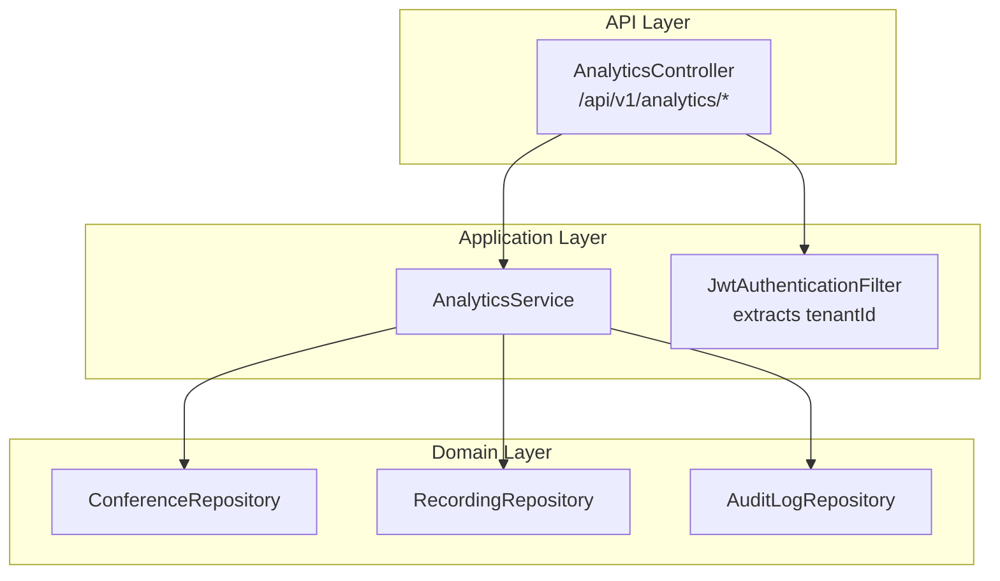
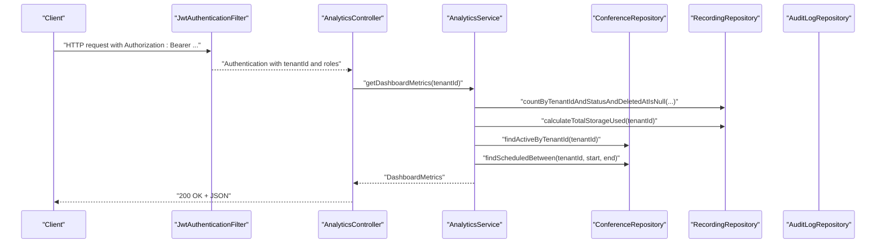
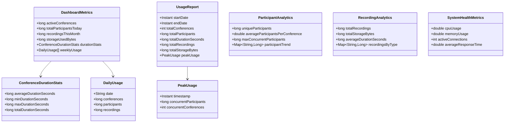
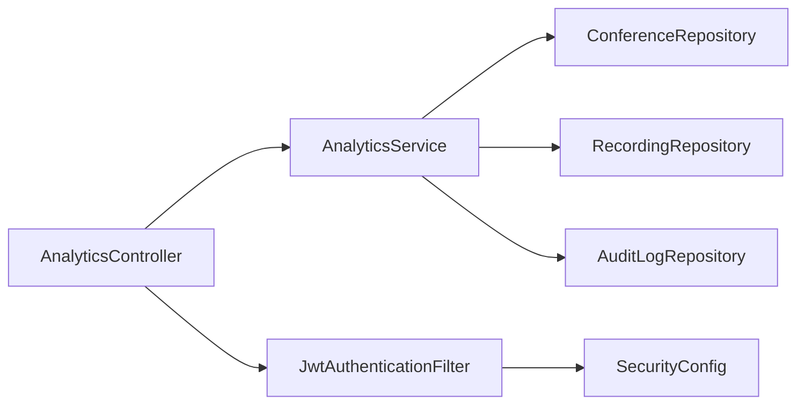

# Analytics and Reporting API

<cite>
**Referenced Files in This Document**
- [AnalyticsController.java](file://jmp-api/src/main/java/com/jmp/api/controller/AnalyticsController.java)
- [AnalyticsService.java](file://jmp-application/src/main/java/com/jmp/application/service/AnalyticsService.java)
- [JwtAuthenticationFilter.java](file://jmp-infrastructure/src/main/java/com/jmp/infrastructure/security/JwtAuthenticationFilter.java)
- [SecurityConfig.java](file://jmp-infrastructure/src/main/java/com/jmp/infrastructure/security/SecurityConfig.java)
- [OpenApiConfig.java](file://jmp-api/src/main/java/com/jmp/api/config/OpenApiConfig.java)
- [application.yml](file://jmp-web/src/main/resources/application.yml)
- [ConferenceRepository.java](file://jmp-domain/src/main/java/com/jmp/domain/repository/ConferenceRepository.java)
- [RecordingRepository.java](file://jmp-domain/src/main/java/com/jmp/domain/repository/RecordingRepository.java)
- [AuditLogRepository.java](file://jmp-domain/src/main/java/com/jmp/domain/repository/AuditLogRepository.java)
- [GlobalExceptionHandler.java](file://jmp-api/src/main/java/com/jmp/api/advice/GlobalExceptionHandler.java)
</cite>

## Table of Contents
1. [Introduction](#introduction)
2. [Project Structure](#project-structure)
3. [Core Components](#core-components)
4. [Architecture Overview](#architecture-overview)
5. [Detailed Component Analysis](#detailed-component-analysis)
6. [Dependency Analysis](#dependency-analysis)
7. [Performance Considerations](#performance-considerations)
8. [Troubleshooting Guide](#troubleshooting-guide)
9. [Conclusion](#conclusion)
10. [Appendices](#appendices)

## Introduction
This document provides comprehensive API documentation for the Analytics and Reporting endpoints. It covers dashboard metrics, usage analytics, participant analytics, recording analytics, and system health metrics. It also documents request/response schemas, time-series data, filtering by tenant, and placeholders for pagination and exports. Guidance on caching and performance optimization is included.

## Project Structure
The Analytics module spans three layers:
- API layer: REST endpoints exposed by the AnalyticsController
- Application layer: Business logic encapsulated in AnalyticsService
- Domain layer: Repositories for Conference, Recording, and AuditLog entities

**Diagram sources**
- [AnalyticsController.java:36-87](file://jmp-api/src/main/java/com/jmp/api/controller/AnalyticsController.java#L36-L87)
- [AnalyticsService.java:31-33](file://jmp-application/src/main/java/com/jmp/application/service/AnalyticsService.java#L31-L33)
- [JwtAuthenticationFilter.java:99-120](file://jmp-infrastructure/src/main/java/com/jmp/infrastructure/security/JwtAuthenticationFilter.java#L99-L120)
- [ConferenceRepository.java:21-109](file://jmp-domain/src/main/java/com/jmp/domain/repository/ConferenceRepository.java#L21-L109)
- [RecordingRepository.java:20-99](file://jmp-domain/src/main/java/com/jmp/domain/repository/RecordingRepository.java#L20-L99)
- [AuditLogRepository.java:19-84](file://jmp-domain/src/main/java/com/jmp/domain/repository/AuditLogRepository.java#L19-L84)

**Section sources**
- [AnalyticsController.java:26-31](file://jmp-api/src/main/java/com/jmp/api/controller/AnalyticsController.java#L26-L31)
- [AnalyticsService.java:25-28](file://jmp-application/src/main/java/com/jmp/application/service/AnalyticsService.java#L25-L28)
- [JwtAuthenticationFilter.java:27-37](file://jmp-infrastructure/src/main/java/com/jmp/infrastructure/security/JwtAuthenticationFilter.java#L27-L37)

## Core Components
- AnalyticsController: Exposes GET endpoints for dashboard metrics, usage report, participant analytics, recording analytics, and system health metrics. Uses role-based authorization and extracts tenantId from JWT claims.
- AnalyticsService: Aggregates metrics using repositories. Provides record classes for response schemas.
- Repositories: ConferenceRepository, RecordingRepository, and AuditLogRepository define query methods used by AnalyticsService.
- Security: JwtAuthenticationFilter injects tenantId and roles into Authentication details; SecurityConfig enforces stateless JWT authentication.

**Section sources**
- [AnalyticsController.java:36-87](file://jmp-api/src/main/java/com/jmp/api/controller/AnalyticsController.java#L36-L87)
- [AnalyticsService.java:38-145](file://jmp-application/src/main/java/com/jmp/application/service/AnalyticsService.java#L38-L145)
- [ConferenceRepository.java:40-108](file://jmp-domain/src/main/java/com/jmp/domain/repository/ConferenceRepository.java#L40-L108)
- [RecordingRepository.java:45-98](file://jmp-domain/src/main/java/com/jmp/domain/repository/RecordingRepository.java#L45-L98)
- [AuditLogRepository.java:44-78](file://jmp-domain/src/main/java/com/jmp/domain/repository/AuditLogRepository.java#L44-L78)
- [JwtAuthenticationFilter.java:99-120](file://jmp-infrastructure/src/main/java/com/jmp/infrastructure/security/JwtAuthenticationFilter.java#L99-L120)
- [SecurityConfig.java:42-61](file://jmp-infrastructure/src/main/java/com/jmp/infrastructure/security/SecurityConfig.java#L42-L61)

## Architecture Overview
The Analytics endpoints follow a layered architecture:
- Controllers enforce authorization and delegate to Services
- Services orchestrate repository queries and compute aggregates
- Repositories encapsulate SQL/JPA queries
- Security filter extracts tenant context from JWT

**Diagram sources**
- [AnalyticsController.java:36-44](file://jmp-api/src/main/java/com/jmp/api/controller/AnalyticsController.java#L36-L44)
- [AnalyticsService.java:38-64](file://jmp-application/src/main/java/com/jmp/application/service/AnalyticsService.java#L38-L64)
- [RecordingRepository.java:45-78](file://jmp-domain/src/main/java/com/jmp/domain/repository/RecordingRepository.java#L45-L78)
- [ConferenceRepository.java:48-92](file://jmp-domain/src/main/java/com/jmp/domain/repository/ConferenceRepository.java#L48-L92)
- [JwtAuthenticationFilter.java:99-120](file://jmp-infrastructure/src/main/java/com/jmp/infrastructure/security/JwtAuthenticationFilter.java#L99-L120)

## Detailed Component Analysis

### Endpoints and Schemas

#### GET /api/v1/analytics/dashboard
- Roles: TENANT_ADMIN, SUPER_ADMIN, AUDITOR
- Description: Returns dashboard metrics for the current tenant
- Path parameters: None
- Query parameters: None
- Response: DashboardMetrics
- Example request:
  - curl -H "Authorization: Bearer <JWT>" https://api.jmp.example.com/api/v1/analytics/dashboard
- Example response keys:
  - activeConferences
  - totalParticipantsToday
  - recordingsThisMonth
  - storageUsedBytes
  - durationStats (averageDurationSeconds, minDurationSeconds, maxDurationSeconds, totalDurationSeconds)
  - weeklyUsage (List of DailyUsage entries with date, conferences, participants, recordings)

Notes:
- activeConferences and totalParticipantsToday are currently placeholders
- weeklyUsage is currently empty in the implementation

**Section sources**
- [AnalyticsController.java:36-44](file://jmp-api/src/main/java/com/jmp/api/controller/AnalyticsController.java#L36-L44)
- [AnalyticsService.java:38-64](file://jmp-application/src/main/java/com/jmp/application/service/AnalyticsService.java#L38-L64)
- [AnalyticsService.java:174-181](file://jmp-application/src/main/java/com/jmp/application/service/AnalyticsService.java#L174-L181)

#### GET /api/v1/analytics/usage-report
- Roles: TENANT_ADMIN, SUPER_ADMIN, AUDITOR
- Description: Returns usage report for a given date range
- Path parameters: None
- Query parameters:
  - startDate (required, ISO date-time)
  - endDate (required, ISO date-time)
- Response: UsageReport
- Example request:
  - curl -H "Authorization: Bearer <JWT>" "https://api.jmp.example.com/api/v1/analytics/usage-report?startDate=2024-01-01T00:00:00Z&endDate=2024-01-31T23:59:59Z"
- Example response keys:
  - startDate
  - endDate
  - totalConferences (placeholder)
  - totalParticipants (placeholder)
  - totalDurationSeconds (placeholder)
  - totalRecordings
  - totalStorageBytes
  - peakUsage (timestamp, concurrentParticipants, concurrentConferences)

**Section sources**
- [AnalyticsController.java:46-56](file://jmp-api/src/main/java/com/jmp/api/controller/AnalyticsController.java#L46-L56)
- [AnalyticsService.java:70-92](file://jmp-application/src/main/java/com/jmp/application/service/AnalyticsService.java#L70-L92)
- [AnalyticsService.java:197-206](file://jmp-application/src/main/java/com/jmp/application/service/AnalyticsService.java#L197-L206)

#### GET /api/v1/analytics/participants
- Roles: TENANT_ADMIN, SUPER_ADMIN, AUDITOR
- Description: Returns participant analytics for a given date range
- Path parameters: None
- Query parameters:
  - startDate (required, ISO date-time)
  - endDate (required, ISO date-time)
- Response: ParticipantAnalytics
- Example response keys:
  - uniqueParticipants
  - averageParticipantsPerConference
  - maxConcurrentParticipants
  - participantTrend (Map<String, Long>)

Notes:
- participantTrend is currently empty in the implementation

**Section sources**
- [AnalyticsController.java:58-68](file://jmp-api/src/main/java/com/jmp/api/controller/AnalyticsController.java#L58-L68)
- [AnalyticsService.java:97-106](file://jmp-application/src/main/java/com/jmp/application/service/AnalyticsService.java#L97-L106)
- [AnalyticsService.java:214-219](file://jmp-application/src/main/java/com/jmp/application/service/AnalyticsService.java#L214-L219)

#### GET /api/v1/analytics/recordings
- Roles: TENANT_ADMIN, SUPER_ADMIN, AUDITOR
- Description: Returns recording analytics for a given date range
- Path parameters: None
- Query parameters:
  - startDate (required, ISO date-time)
  - endDate (required, ISO date-time)
- Response: RecordingAnalytics
- Example response keys:
  - totalRecordings
  - totalStorageBytes
  - averageDurationSeconds
  - recordingsByType (Map<String, Long>)

Notes:
- recordingsByType is currently empty in the implementation

**Section sources**
- [AnalyticsController.java:70-80](file://jmp-api/src/main/java/com/jmp/api/controller/AnalyticsController.java#L70-L80)
- [AnalyticsService.java:111-131](file://jmp-application/src/main/java/com/jmp/application/service/AnalyticsService.java#L111-L131)
- [AnalyticsService.java:221-226](file://jmp-application/src/main/java/com/jmp/application/service/AnalyticsService.java#L221-L226)

#### GET /api/v1/analytics/system-health
- Roles: SUPER_ADMIN
- Description: Returns system health metrics
- Path parameters: None
- Query parameters: None
- Response: SystemHealthMetrics
- Example response keys:
  - cpuUsage
  - memoryUsage
  - activeConnections
  - averageResponseTime

Notes:
- Metrics are currently placeholders; integration with actuator is planned

**Section sources**
- [AnalyticsController.java:82-87](file://jmp-api/src/main/java/com/jmp/api/controller/AnalyticsController.java#L82-L87)
- [AnalyticsService.java:136-145](file://jmp-application/src/main/java/com/jmp/application/service/AnalyticsService.java#L136-L145)
- [AnalyticsService.java:228-233](file://jmp-application/src/main/java/com/jmp/application/service/AnalyticsService.java#L228-L233)

### Request/Response Schemas

**Diagram sources**
- [AnalyticsService.java:174-233](file://jmp-application/src/main/java/com/jmp/application/service/AnalyticsService.java#L174-L233)

**Section sources**
- [AnalyticsService.java:174-233](file://jmp-application/src/main/java/com/jmp/application/service/AnalyticsService.java#L174-L233)

### Filtering and Tenant Context
- Tenant filtering: All analytics endpoints extract tenantId from the JWT claims injected by JwtAuthenticationFilter and restrict queries to that tenant.
- Roles: Endpoints enforce role-based access using @PreAuthorize annotations.
- Date range filtering: Usage and participant endpoints accept startDate and endDate query parameters.

**Section sources**
- [AnalyticsController.java:89-94](file://jmp-api/src/main/java/com/jmp/api/controller/AnalyticsController.java#L89-L94)
- [JwtAuthenticationFilter.java:99-120](file://jmp-infrastructure/src/main/java/com/jmp/infrastructure/security/JwtAuthenticationFilter.java#L99-L120)
- [SecurityConfig.java:49-58](file://jmp-infrastructure/src/main/java/com/jmp/infrastructure/security/SecurityConfig.java#L49-L58)

### Pagination and Export
- Pagination: Not implemented for analytics endpoints. Repositories expose Pageable-capable methods but the service layer does not pass Pageable to the controller.
- Export: Not implemented. No explicit export endpoints are present.

Recommendations:
- Add Pageable support to analytics endpoints and propagate page and size query parameters.
- Add CSV/JSON export endpoints for usage-report and participant analytics.

**Section sources**
- [ConferenceRepository.java:38-38](file://jmp-domain/src/main/java/com/jmp/domain/repository/ConferenceRepository.java#L38-L38)
- [RecordingRepository.java:35-35](file://jmp-domain/src/main/java/com/jmp/domain/repository/RecordingRepository.java#L35-L35)
- [AuditLogRepository.java:24-24](file://jmp-domain/src/main/java/com/jmp/domain/repository/AuditLogRepository.java#L24-L24)

### Historical Trends and Compliance Reporting
- Historical trends: weeklyUsage is a placeholder; durationStats and peakUsage are placeholders. Implementing time-series aggregation requires date-bucketed queries in repositories.
- Compliance reporting: AuditLogRepository supports filtered searches by tenant, user, event type, and date range. This can serve as a foundation for compliance reports.

**Section sources**
- [AnalyticsService.java:149-170](file://jmp-application/src/main/java/com/jmp/application/service/AnalyticsService.java#L149-L170)
- [AuditLogRepository.java:44-58](file://jmp-domain/src/main/java/com/jmp/domain/repository/AuditLogRepository.java#L44-L58)

## Dependency Analysis

**Diagram sources**
- [AnalyticsController.java:34-34](file://jmp-api/src/main/java/com/jmp/api/controller/AnalyticsController.java#L34-L34)
- [AnalyticsService.java:31-33](file://jmp-application/src/main/java/com/jmp/application/service/AnalyticsService.java#L31-L33)
- [JwtAuthenticationFilter.java:29-37](file://jmp-infrastructure/src/main/java/com/jmp/infrastructure/security/JwtAuthenticationFilter.java#L29-L37)
- [SecurityConfig.java:42-61](file://jmp-infrastructure/src/main/java/com/jmp/infrastructure/security/SecurityConfig.java#L42-L61)

**Section sources**
- [AnalyticsController.java:34-34](file://jmp-api/src/main/java/com/jmp/api/controller/AnalyticsController.java#L34-L34)
- [AnalyticsService.java:31-33](file://jmp-application/src/main/java/com/jmp/application/service/AnalyticsService.java#L31-L33)
- [JwtAuthenticationFilter.java:29-37](file://jmp-infrastructure/src/main/java/com/jmp/infrastructure/security/JwtAuthenticationFilter.java#L29-L37)
- [SecurityConfig.java:42-61](file://jmp-infrastructure/src/main/java/com/jmp/infrastructure/security/SecurityConfig.java#L42-L61)

## Performance Considerations
- Current implementation:
  - AnalyticsService methods are annotated @Transactional(readOnly = true).
  - Some metrics are placeholders; actual computation requires repository-backed aggregations.
- Recommendations:
  - Add database indexes for tenantId, status, createdAt, and scheduledStartAt to optimize analytics queries.
  - Introduce caching for frequently accessed dashboard metrics using Redis configured under spring.data.redis.
  - Use projection queries to limit result sets for time-series endpoints.
  - Apply pagination for large datasets (see Pagination section).
  - Monitor slow queries and consider materialized summaries for high-cardinality metrics.

[No sources needed since this section provides general guidance]

## Troubleshooting Guide
Common issues and resolutions:
- Unauthorized/Forbidden:
  - Ensure Authorization header contains a valid Bearer token with appropriate roles.
  - Verify JWT contains tenant_id claim and roles array.
- Bad Request:
  - Validate startDate and endDate are valid ISO date-time values.
  - Confirm request body conforms to expected JSON for any POST endpoints (none for analytics).
- Internal Server Error:
  - Check server logs for stack traces.
  - Verify database connectivity and repository queries.

Error handling follows RFC 7807 Problem Details with standardized fields.

**Section sources**
- [GlobalExceptionHandler.java:26-38](file://jmp-api/src/main/java/com/jmp/api/advice/GlobalExceptionHandler.java#L26-L38)
- [GlobalExceptionHandler.java:68-80](file://jmp-api/src/main/java/com/jmp/api/advice/GlobalExceptionHandler.java#L68-L80)
- [GlobalExceptionHandler.java:116-128](file://jmp-api/src/main/java/com/jmp/api/advice/GlobalExceptionHandler.java#L116-L128)

## Conclusion
The Analytics and Reporting API provides foundational endpoints for dashboard metrics, usage reports, participant analytics, recording analytics, and system health. While several metrics are placeholders, the underlying repository layer and tenant-aware security model enable robust extension. Implementing pagination, export, historical trend aggregation, and caching will significantly improve usability and performance.

## Appendices

### API Metadata and Security
- Base URL: See servers in OpenAPI configuration
- Authentication: Bearer JWT
- Authorization: Role-based access per endpoint
- CORS: Configured for development origins

**Section sources**
- [OpenApiConfig.java:42-53](file://jmp-api/src/main/java/com/jmp/api/config/OpenApiConfig.java#L42-L53)
- [SecurityConfig.java:49-58](file://jmp-infrastructure/src/main/java/com/jmp/infrastructure/security/SecurityConfig.java#L49-L58)
- [application.yml:71-128](file://jmp-web/src/main/resources/application.yml#L71-L128)