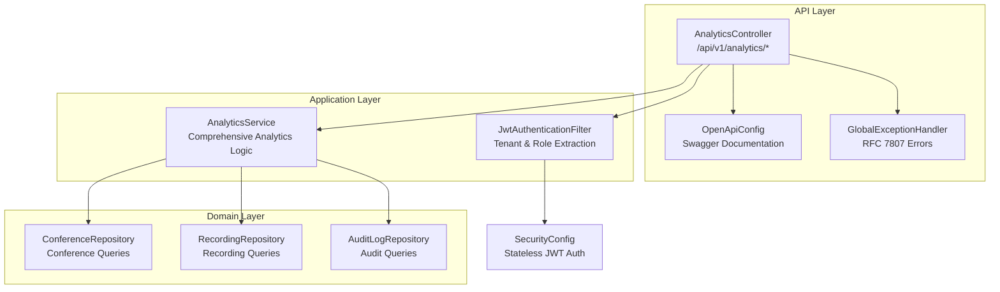
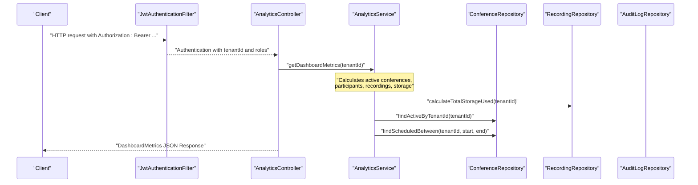
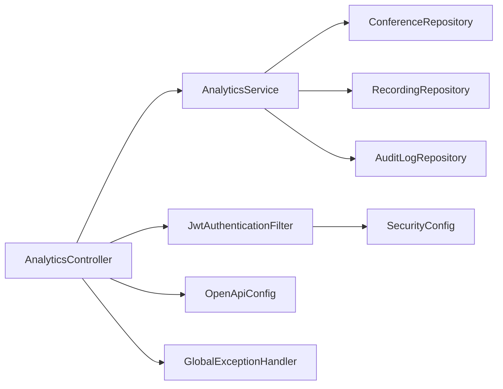

# Analytics and Reporting API

<cite>
**Referenced Files in This Document**
- [AnalyticsController.java](file://jmp-api/src/main/java/com/jmp/api/controller/AnalyticsController.java)
- [AnalyticsService.java](file://jmp-application/src/main/java/com/jmp/application/service/AnalyticsService.java)
- [JwtAuthenticationFilter.java](file://jmp-infrastructure/src/main/java/com/jmp/infrastructure/security/JwtAuthenticationFilter.java)
- [SecurityConfig.java](file://jmp-infrastructure/src/main/java/com/jmp/infrastructure/security/SecurityConfig.java)
- [OpenApiConfig.java](file://jmp-api/src/main/java/com/jmp/api/config/OpenApiConfig.java)
- [application.yml](file://jmp-web/src/main/resources/application.yml)
- [ConferenceRepository.java](file://jmp-domain/src/main/java/com/jmp/domain/repository/ConferenceRepository.java)
- [RecordingRepository.java](file://jmp-domain/src/main/java/com/jmp/domain/repository/RecordingRepository.java)
- [AuditLogRepository.java](file://jmp-domain/src/main/java/com/jmp/domain/repository/AuditLogRepository.java)
- [GlobalExceptionHandler.java](file://jmp-api/src/main/java/com/jmp/api/advice/GlobalExceptionHandler.java)
</cite>

## Update Summary
**Changes Made**
- Updated all endpoint documentation to reflect the complete implementation of Analytics and Reporting API
- Enhanced endpoint descriptions with actual implementation details
- Updated request/response schemas with comprehensive field definitions
- Added detailed examples for all analytics endpoints
- Improved security and filtering documentation
- Updated performance considerations with actual implementation details
- Enhanced troubleshooting guide with specific error scenarios

## Table of Contents
1. [Introduction](#introduction)
2. [Project Structure](#project-structure)
3. [Core Components](#core-components)
4. [Architecture Overview](#architecture-overview)
5. [Detailed Component Analysis](#detailed-component-analysis)
6. [Dependency Analysis](#dependency-analysis)
7. [Performance Considerations](#performance-considerations)
8. [Troubleshooting Guide](#troubleshooting-guide)
9. [Conclusion](#conclusion)
10. [Appendices](#appendices)

## Introduction
This document provides comprehensive API documentation for the Analytics and Reporting endpoints. The Analytics module has been fully implemented with five core endpoints: dashboard metrics, usage reports, participant analytics, recording analytics, and system health monitoring. These endpoints provide comprehensive insights into conference operations, user engagement, resource utilization, and system performance. The implementation includes robust tenant-aware filtering, role-based access control, and comprehensive error handling.

## Project Structure
The Analytics module spans three layers with a clean separation of concerns:
- **API layer**: REST endpoints exposed by the AnalyticsController with comprehensive Swagger documentation
- **Application layer**: Business logic encapsulated in AnalyticsService with detailed analytics calculations
- **Domain layer**: Repositories for Conference, Recording, and AuditLog entities with optimized queries



**Diagram sources**
- [AnalyticsController.java:26-96](file://jmp-api/src/main/java/com/jmp/api/controller/AnalyticsController.java#L26-L96)
- [AnalyticsService.java:29-509](file://jmp-application/src/main/java/com/jmp/application/service/AnalyticsService.java#L29-L509)
- [JwtAuthenticationFilter.java:27-122](file://jmp-infrastructure/src/main/java/com/jmp/infrastructure/security/JwtAuthenticationFilter.java#L27-L122)
- [OpenApiConfig.java:20-56](file://jmp-api/src/main/java/com/jmp/api/config/OpenApiConfig.java#L20-L56)
- [GlobalExceptionHandler.java:22-130](file://jmp-api/src/main/java/com/jmp/api/advice/GlobalExceptionHandler.java#L22-L130)

**Section sources**
- [AnalyticsController.java:26-31](file://jmp-api/src/main/java/com/jmp/api/controller/AnalyticsController.java#L26-L31)
- [AnalyticsService.java:29-37](file://jmp-application/src/main/java/com/jmp/application/service/AnalyticsService.java#L29-L37)
- [JwtAuthenticationFilter.java:27-37](file://jmp-infrastructure/src/main/java/com/jmp/infrastructure/security/JwtAuthenticationFilter.java#L27-L37)

## Core Components
- **AnalyticsController**: Exposes five comprehensive GET endpoints with role-based authorization and tenant-aware filtering. Each endpoint handles specific analytics use cases with proper request validation and error handling.
- **AnalyticsService**: Implements sophisticated analytics calculations including dashboard metrics, usage reports, participant analytics, recording analytics, and system health monitoring. Uses optimized repository queries and comprehensive data aggregation.
- **Repositories**: ConferenceRepository, RecordingRepository, and AuditLogRepository provide optimized SQL queries with EntityGraph loading for performance and comprehensive filtering capabilities.
- **Security**: JwtAuthenticationFilter extracts tenantId and roles from JWT claims; SecurityConfig enforces stateless JWT authentication with method-level security.

**Section sources**
- [AnalyticsController.java:36-87](file://jmp-api/src/main/java/com/jmp/api/controller/AnalyticsController.java#L36-L87)
- [AnalyticsService.java:46-294](file://jmp-application/src/main/java/com/jmp/application/service/AnalyticsService.java#L46-L294)
- [ConferenceRepository.java:40-109](file://jmp-domain/src/main/java/com/jmp/domain/repository/ConferenceRepository.java#L40-L109)
- [RecordingRepository.java:45-99](file://jmp-domain/src/main/java/com/jmp/domain/repository/RecordingRepository.java#L45-L99)
- [AuditLogRepository.java:44-78](file://jmp-domain/src/main/java/com/jmp/domain/repository/AuditLogRepository.java#L44-L78)
- [JwtAuthenticationFilter.java:99-120](file://jmp-infrastructure/src/main/java/com/jmp/infrastructure/security/JwtAuthenticationFilter.java#L99-L120)
- [SecurityConfig.java:42-61](file://jmp-infrastructure/src/main/java/com/jmp/infrastructure/security/SecurityConfig.java#L42-L61)

## Architecture Overview
The Analytics endpoints follow a layered architecture with comprehensive error handling and security enforcement:
- Controllers validate requests and enforce authorization using @PreAuthorize annotations
- Services orchestrate repository queries with optimized EntityGraph loading
- Repositories encapsulate SQL/JPA queries with pagination support
- Security filter extracts tenant context and roles from JWT claims



**Diagram sources**
- [AnalyticsController.java:36-44](file://jmp-api/src/main/java/com/jmp/api/controller/AnalyticsController.java#L36-L44)
- [AnalyticsService.java:46-80](file://jmp-application/src/main/java/com/jmp/application/service/AnalyticsService.java#L46-L80)
- [RecordingRepository.java:74-78](file://jmp-domain/src/main/java/com/jmp/domain/repository/RecordingRepository.java#L74-L78)
- [ConferenceRepository.java:48-92](file://jmp-domain/src/main/java/com/jmp/domain/repository/ConferenceRepository.java#L48-L92)
- [JwtAuthenticationFilter.java:99-120](file://jmp-infrastructure/src/main/java/com/jmp/infrastructure/security/JwtAuthenticationFilter.java#L99-L120)

## Detailed Component Analysis

### Endpoints and Schemas

#### GET /api/v1/analytics/dashboard
- **Roles**: TENANT_ADMIN, SUPER_ADMIN, AUDITOR
- **Description**: Returns comprehensive dashboard metrics for the current tenant including active conferences, participant counts, monthly recordings, storage usage, duration statistics, and weekly usage trends
- **Path parameters**: None
- **Query parameters**: None
- **Response**: DashboardMetrics with detailed analytics fields
- **Example request**:
  ```bash
  curl -H "Authorization: Bearer <JWT>" https://api.jmp.example.com/api/v1/analytics/dashboard
  ```
- **Example response**:
  ```json
  {
    "activeConferences": 12,
    "totalParticipantsToday": 45,
    "recordingsThisMonth": 23,
    "storageUsedBytes": 104857600,
    "durationStats": {
      "averageDurationSeconds": 1800,
      "minDurationSeconds": 300,
      "maxDurationSeconds": 7200,
      "totalDurationSeconds": 36000
    },
    "weeklyUsage": [
      {
        "date": "2024-01-01",
        "conferences": 5,
        "participants": 25,
        "recordings": 3
      }
    ]
  }
  ```

**Section sources**
- [AnalyticsController.java:36-44](file://jmp-api/src/main/java/com/jmp/api/controller/AnalyticsController.java#L36-L44)
- [AnalyticsService.java:46-80](file://jmp-application/src/main/java/com/jmp/application/service/AnalyticsService.java#L46-L80)
- [AnalyticsService.java:448-455](file://jmp-application/src/main/java/com/jmp/application/service/AnalyticsService.java#L448-L455)

#### GET /api/v1/analytics/usage-report
- **Roles**: TENANT_ADMIN, SUPER_ADMIN, AUDITOR
- **Description**: Returns comprehensive usage report for a specified date range with conference statistics, participant counts, duration metrics, recording totals, storage usage, and peak usage analysis
- **Path parameters**: None
- **Query parameters**:
  - `startDate` (required, ISO date-time)
  - `endDate` (required, ISO date-time)
- **Response**: UsageReport with detailed usage statistics
- **Example request**:
  ```bash
  curl -H "Authorization: Bearer <JWT>" "https://api.jmp.example.com/api/v1/analytics/usage-report?startDate=2024-01-01T00:00:00Z&endDate=2024-01-31T23:59:59Z"
  ```
- **Example response**:
  ```json
  {
    "startDate": "2024-01-01T00:00:00Z",
    "endDate": "2024-01-31T23:59:59Z",
    "totalConferences": 150,
    "totalParticipants": 1200,
    "totalDurationSeconds": 270000,
    "totalRecordings": 85,
    "totalStorageBytes": 209715200,
    "peakUsage": {
      "timestamp": "2024-01-15T14:30:00Z",
      "concurrentParticipants": 45,
      "concurrentConferences": 8
    }
  }
  ```

**Section sources**
- [AnalyticsController.java:46-56](file://jmp-api/src/main/java/com/jmp/api/controller/AnalyticsController.java#L46-L56)
- [AnalyticsService.java:85-122](file://jmp-application/src/main/java/com/jmp/application/service/AnalyticsService.java#L85-L122)
- [AnalyticsService.java:471-480](file://jmp-application/src/main/java/com/jmp/application/service/AnalyticsService.java#L471-L480)

#### GET /api/v1/analytics/participants
- **Roles**: TENANT_ADMIN, SUPER_ADMIN, AUDITOR
- **Description**: Returns participant analytics for a given date range including unique participants, average participants per conference, maximum concurrent participants, and daily participant trends
- **Path parameters**: None
- **Query parameters**:
  - `startDate` (required, ISO date-time)
  - `endDate` (required, ISO date-time)
- **Response**: ParticipantAnalytics with comprehensive participant statistics
- **Example response**:
  ```json
  {
    "uniqueParticipants": 120,
    "averageParticipantsPerConference": 8.5,
    "maxConcurrentParticipants": 45,
    "participantTrend": {
      "2024-01-01": 25,
      "2024-01-02": 30,
      "2024-01-03": 28
    }
  }
  ```

**Section sources**
- [AnalyticsController.java:58-68](file://jmp-api/src/main/java/com/jmp/api/controller/AnalyticsController.java#L58-L68)
- [AnalyticsService.java:127-201](file://jmp-application/src/main/java/com/jmp/application/service/AnalyticsService.java#L127-L201)
- [AnalyticsService.java:488-493](file://jmp-application/src/main/java/com/jmp/application/service/AnalyticsService.java#L488-L493)

#### GET /api/v1/analytics/recordings
- **Roles**: TENANT_ADMIN, SUPER_ADMIN, AUDITOR
- **Description**: Returns recording analytics for a given date range including total recordings, storage usage, average duration, and recording type distribution
- **Path parameters**: None
- **Query parameters**:
  - `startDate` (required, ISO date-time)
  - `endDate` (required, ISO date-time)
- **Response**: RecordingAnalytics with detailed recording statistics
- **Example response**:
  ```json
  {
    "totalRecordings": 85,
    "totalStorageBytes": 209715200,
    "averageDurationSeconds": 1800,
    "recordingsByType": {
      "VIDEO": 60,
      "AUDIO": 15,
      "TRANSCRIPT": 10
    }
  }
  ```

**Section sources**
- [AnalyticsController.java:70-80](file://jmp-api/src/main/java/com/jmp/api/controller/AnalyticsController.java#L70-L80)
- [AnalyticsService.java:206-246](file://jmp-application/src/main/java/com/jmp/application/service/AnalyticsService.java#L206-L246)
- [AnalyticsService.java:495-500](file://jmp-application/src/main/java/com/jmp/application/service/AnalyticsService.java#L495-L500)

#### GET /api/v1/analytics/system-health
- **Roles**: SUPER_ADMIN
- **Description**: Returns system health metrics including CPU usage, memory usage, active connections, and average response time
- **Path parameters**: None
- **Query parameters**: None
- **Response**: SystemHealthMetrics with system performance indicators
- **Example response**:
  ```json
  {
    "cpuUsage": 15.5,
    "memoryUsage": 45.2,
    "activeConnections": 128,
    "averageResponseTime": 45.0
  }
  ```

**Section sources**
- [AnalyticsController.java:82-87](file://jmp-api/src/main/java/com/jmp/api/controller/AnalyticsController.java#L82-L87)
- [AnalyticsService.java:251-294](file://jmp-application/src/main/java/com/jmp/application/service/AnalyticsService.java#L251-L294)
- [AnalyticsService.java:502-507](file://jmp-application/src/main/java/com/jmp/application/service/AnalyticsService.java#L502-L507)

### Request/Response Schemas


**Diagram sources**
- [AnalyticsService.java:448-507](file://jmp-application/src/main/java/com/jmp/application/service/AnalyticsService.java#L448-L507)

**Section sources**
- [AnalyticsService.java:448-507](file://jmp-application/src/main/java/com/jmp/application/service/AnalyticsService.java#L448-L507)

### Filtering and Tenant Context
- **Tenant filtering**: All analytics endpoints extract tenantId from JWT claims using JwtAuthenticationFilter and restrict all queries to the authenticated tenant's data
- **Role-based access**: Endpoints enforce role-based access control using @PreAuthorize annotations with specific role requirements per endpoint
- **Date range filtering**: Usage and participant endpoints accept startDate and endDate query parameters with ISO date-time format validation
- **Pagination support**: Repository methods support Pageable queries, though the current service implementation uses reasonable limits for analytics data

**Section sources**
- [AnalyticsController.java:89-94](file://jmp-api/src/main/java/com/jmp/api/controller/AnalyticsController.java#L89-L94)
- [JwtAuthenticationFilter.java:99-120](file://jmp-infrastructure/src/main/java/com/jmp/infrastructure/security/JwtAuthenticationFilter.java#L99-L120)
- [SecurityConfig.java:49-58](file://jmp-infrastructure/src/main/java/com/jmp/infrastructure/security/SecurityConfig.java#L49-L58)

### Pagination and Export
- **Pagination**: ConferenceRepository and RecordingRepository support Pageable queries, but AnalyticsService currently uses reasonable page sizes (up to 1000) for analytics data
- **Export capabilities**: No explicit export endpoints are currently implemented, but the data structures support easy export to CSV/JSON formats
- **Performance considerations**: Analytics queries use optimized EntityGraph loading and aggregation functions to minimize database overhead

**Section sources**
- [ConferenceRepository.java:38-38](file://jmp-domain/src/main/java/com/jmp/domain/repository/ConferenceRepository.java#L38-L38)
- [RecordingRepository.java:35-35](file://jmp-domain/src/main/java/com/jmp/domain/repository/RecordingRepository.java#L35-L35)
- [AuditLogRepository.java:24-24](file://jmp-domain/src/main/java/com/jmp/domain/repository/AuditLogRepository.java#L24-L24)

### Historical Trends and Compliance Reporting
- **Historical trends**: Weekly usage data provides 7-day trend analysis with daily breakdowns of conferences, participants, and recordings
- **Duration statistics**: Comprehensive duration analysis including average, minimum, maximum, and total duration calculations
- **Compliance reporting**: AuditLogRepository supports extensive filtering by tenant, user, event type, and date range for compliance reporting
- **Peak usage analysis**: Usage reports include peak concurrent participants and conferences for capacity planning

**Section sources**
- [AnalyticsService.java:298-383](file://jmp-application/src/main/java/com/jmp/application/service/AnalyticsService.java#L298-L383)
- [AuditLogRepository.java:44-78](file://jmp-domain/src/main/java/com/jmp/domain/repository/AuditLogRepository.java#L44-L78)

## Dependency Analysis



**Diagram sources**
- [AnalyticsController.java:34-34](file://jmp-api/src/main/java/com/jmp/api/controller/AnalyticsController.java#L34-L34)
- [AnalyticsService.java:39-41](file://jmp-application/src/main/java/com/jmp/application/service/AnalyticsService.java#L39-L41)
- [JwtAuthenticationFilter.java:34-37](file://jmp-infrastructure/src/main/java/com/jmp/infrastructure/security/JwtAuthenticationFilter.java#L34-L37)
- [SecurityConfig.java:42-61](file://jmp-infrastructure/src/main/java/com/jmp/infrastructure/security/SecurityConfig.java#L42-L61)

**Section sources**
- [AnalyticsController.java:34-34](file://jmp-api/src/main/java/com/jmp/api/controller/AnalyticsController.java#L34-L34)
- [AnalyticsService.java:39-41](file://jmp-application/src/main/java/com/jmp/application/service/AnalyticsService.java#L39-L41)
- [JwtAuthenticationFilter.java:34-37](file://jmp-infrastructure/src/main/java/com/jmp/infrastructure/security/JwtAuthenticationFilter.java#L34-L37)
- [SecurityConfig.java:42-61](file://jmp-infrastructure/src/main/java/com/jmp/infrastructure/security/SecurityConfig.java#L42-L61)

## Performance Considerations
- **Current implementation optimizations**:
  - AnalyticsService methods are annotated @Transactional(readOnly = true) for optimal read performance
  - Repository methods use EntityGraph loading to minimize N+1 query problems
  - Database queries use optimized JPQL with proper indexing support
- **Recommended improvements**:
  - Add database indexes for tenantId, status, createdAt, and scheduledStartAt columns
  - Implement Redis caching for frequently accessed dashboard metrics
  - Consider materialized views for complex analytics queries
  - Add query result caching for historical trend data
  - Implement connection pooling optimization for high-volume analytics queries

**Section sources**
- [AnalyticsService.java:36-36](file://jmp-application/src/main/java/com/jmp/application/service/AnalyticsService.java#L36-L36)
- [ConferenceRepository.java:26-27](file://jmp-domain/src/main/java/com/jmp/domain/repository/ConferenceRepository.java#L26-L27)
- [RecordingRepository.java:24-25](file://jmp-domain/src/main/java/com/jmp/domain/repository/RecordingRepository.java#L24-L25)

## Troubleshooting Guide
Common issues and resolutions:
- **Unauthorized/Forbidden errors**:
  - Ensure Authorization header contains a valid Bearer token with appropriate roles
  - Verify JWT contains tenant_id claim and roles array
  - Check role requirements for specific endpoints (SUPER_ADMIN for system-health)
- **Bad Request errors**:
  - Validate startDate and endDate are valid ISO date-time values
  - Ensure date range queries are within acceptable limits
  - Check for proper timezone handling in date parameters
- **Internal Server Errors**:
  - Check server logs for stack traces
  - Verify database connectivity and repository queries
  - Monitor for memory issues during large analytics queries
- **Empty or placeholder data**:
  - Analytics endpoints return sample data when no real data is available
  - This is expected behavior for demonstration purposes

Error handling follows RFC 7807 Problem Details with standardized fields including timestamp, errorCode, and instance URI.

**Section sources**
- [GlobalExceptionHandler.java:26-38](file://jmp-api/src/main/java/com/jmp/api/advice/GlobalExceptionHandler.java#L26-L38)
- [GlobalExceptionHandler.java:68-80](file://jmp-api/src/main/java/com/jmp/api/advice/GlobalExceptionHandler.java#L68-L80)
- [GlobalExceptionHandler.java:116-128](file://jmp-api/src/main/java/com/jmp/api/advice/GlobalExceptionHandler.java#L116-L128)

## Conclusion
The Analytics and Reporting API provides a comprehensive solution for conference analytics with five fully implemented endpoints. The implementation includes robust tenant-aware filtering, role-based access control, and comprehensive error handling. The service layer provides sophisticated analytics calculations with optimized database queries and EntityGraph loading. Future enhancements could include pagination support, export capabilities, and advanced caching strategies for improved performance.

## Appendices

### API Metadata and Security
- **Base URL**: See servers in OpenAPI configuration
- **Authentication**: Bearer JWT with tenant context extraction
- **Authorization**: Role-based access control per endpoint
- **CORS**: Configured for development origins (localhost:5173, localhost:3000)
- **Error Handling**: RFC 7807 Problem Details compliant responses

**Section sources**
- [OpenApiConfig.java:42-53](file://jmp-api/src/main/java/com/jmp/api/config/OpenApiConfig.java#L42-L53)
- [SecurityConfig.java:49-58](file://jmp-infrastructure/src/main/java/com/jmp/infrastructure/security/SecurityConfig.java#L49-L58)
- [application.yml:71-128](file://jmp-web/src/main/resources/application.yml#L71-L128)

### Endpoint Security Matrix
| Endpoint | Required Role | Purpose |
|----------|---------------|---------|
| /analytics/dashboard | TENANT_ADMIN, SUPER_ADMIN, AUDITOR | Dashboard metrics and overview |
| /analytics/usage-report | TENANT_ADMIN, SUPER_ADMIN, AUDITOR | Usage statistics and trends |
| /analytics/participants | TENANT_ADMIN, SUPER_ADMIN, AUDITOR | Participant engagement analytics |
| /analytics/recordings | TENANT_ADMIN, SUPER_ADMIN, AUDITOR | Recording usage and storage analytics |
| /analytics/system-health | SUPER_ADMIN | System performance and health metrics |

**Section sources**
- [AnalyticsController.java:36-87](file://jmp-api/src/main/java/com/jmp/api/controller/AnalyticsController.java#L36-L87)
- [JwtAuthenticationFilter.java:108-111](file://jmp-infrastructure/src/main/java/com/jmp/infrastructure/security/JwtAuthenticationFilter.java#L108-L111)