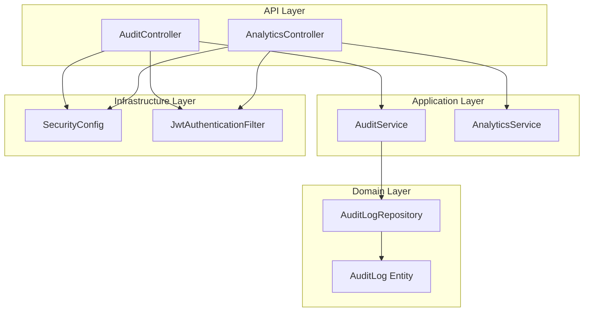
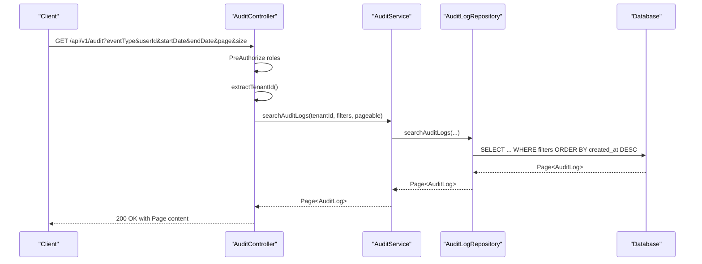
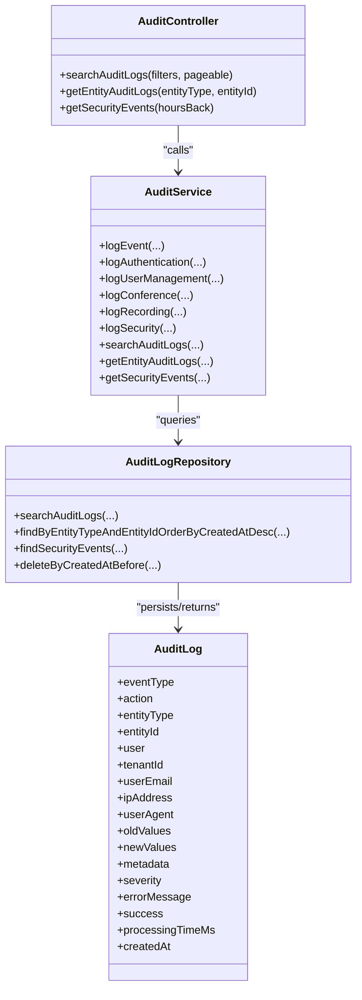
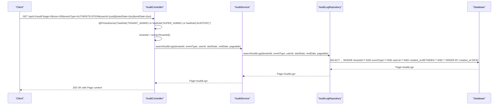
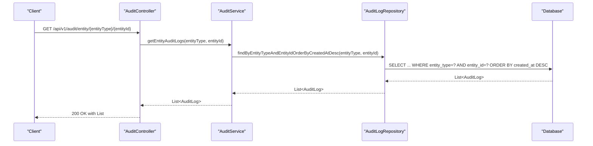
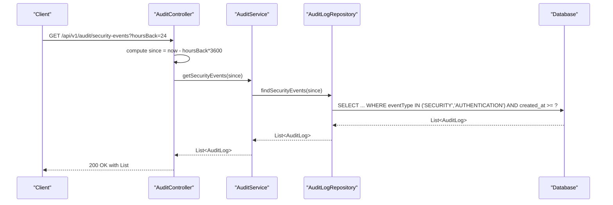
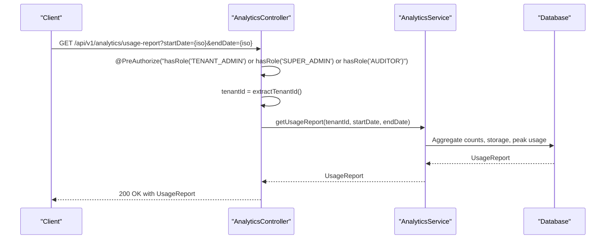
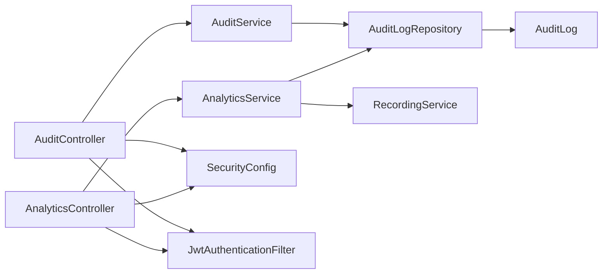

# Audit and Compliance API

<cite>
**Referenced Files in This Document**
- [AuditController.java](file://jmp-api/src/main/java/com/jmp/api/controller/AuditController.java)
- [AuditService.java](file://jmp-application/src/main/java/com/jmp/application/service/AuditService.java)
- [AuditLog.java](file://jmp-domain/src/main/java/com/jmp/domain/entity/AuditLog.java)
- [AuditLogRepository.java](file://jmp-domain/src/main/java/com/jmp/domain/repository/AuditLogRepository.java)
- [V4__create_audit_logs_table.sql](file://jmp-web/src/main/resources/db/migration/V4__create_audit_logs_table.sql)
- [SecurityConfig.java](file://jmp-infrastructure/src/main/java/com/jmp/infrastructure/security/SecurityConfig.java)
- [JwtAuthenticationFilter.java](file://jmp-infrastructure/src/main/java/com/jmp/infrastructure/security/JwtAuthenticationFilter.java)
- [AnalyticsController.java](file://jmp-api/src/main/java/com/jmp/api/controller/AnalyticsController.java)
- [AnalyticsService.java](file://jmp-application/src/main/java/com/jmp/application/service/AnalyticsService.java)
- [RecordingService.java](file://jmp-application/src/main/java/com/jmp/application/service/RecordingService.java)
</cite>

## Table of Contents
1. [Introduction](#introduction)
2. [Project Structure](#project-structure)
3. [Core Components](#core-components)
4. [Architecture Overview](#architecture-overview)
5. [Detailed Component Analysis](#detailed-component-analysis)
6. [Dependency Analysis](#dependency-analysis)
7. [Performance Considerations](#performance-considerations)
8. [Troubleshooting Guide](#troubleshooting-guide)
9. [Conclusion](#conclusion)
10. [Appendices](#appendices)

## Introduction
This document provides comprehensive API documentation for Audit and Compliance endpoints. It covers:
- Audit log retrieval with filtering by user, action type, timestamp ranges, and resource identifiers
- Compliance reporting endpoints for regulatory requirements and security monitoring
- Request/response schemas for audit events, log metadata, and compliance exports
- Examples of audit trail queries, compliance reporting, and security incident tracking
- Pagination for large audit datasets, advanced filtering capabilities, and export formats
- Retention policies, data privacy considerations, and access control for audit data

## Project Structure
The Audit and Compliance functionality spans four layers:
- API Layer: Controllers expose endpoints for audit retrieval and analytics
- Application Layer: Services orchestrate audit logging and reporting
- Domain Layer: Entities and repositories define audit data model and persistence
- Infrastructure Layer: Security configuration and JWT filter enforce access control and tenant scoping

**Diagram sources**
- [AuditController.java:30-82](file://jmp-api/src/main/java/com/jmp/api/controller/AuditController.java#L30-L82)
- [AnalyticsController.java:26-56](file://jmp-api/src/main/java/com/jmp/api/controller/AnalyticsController.java#L26-L56)
- [AuditService.java:22-207](file://jmp-application/src/main/java/com/jmp/application/service/AuditService.java#L22-L207)
- [AnalyticsService.java:25-235](file://jmp-application/src/main/java/com/jmp/application/service/AnalyticsService.java#L25-L235)
- [AuditLog.java:20-136](file://jmp-domain/src/main/java/com/jmp/domain/entity/AuditLog.java#L20-L136)
- [AuditLogRepository.java:18-85](file://jmp-domain/src/main/java/com/jmp/domain/repository/AuditLogRepository.java#L18-L85)
- [SecurityConfig.java:28-90](file://jmp-infrastructure/src/main/java/com/jmp/infrastructure/security/SecurityConfig.java#L28-L90)
- [JwtAuthenticationFilter.java:27-122](file://jmp-infrastructure/src/main/java/com/jmp/infrastructure/security/JwtAuthenticationFilter.java#L27-L122)

**Section sources**
- [AuditController.java:30-82](file://jmp-api/src/main/java/com/jmp/api/controller/AuditController.java#L30-L82)
- [AnalyticsController.java:26-56](file://jmp-api/src/main/java/com/jmp/api/controller/AnalyticsController.java#L26-L56)
- [AuditService.java:22-207](file://jmp-application/src/main/java/com/jmp/application/service/AuditService.java#L22-L207)
- [AnalyticsService.java:25-235](file://jmp-application/src/main/java/com/jmp/application/service/AnalyticsService.java#L25-L235)
- [AuditLog.java:20-136](file://jmp-domain/src/main/java/com/jmp/domain/entity/AuditLog.java#L20-L136)
- [AuditLogRepository.java:18-85](file://jmp-domain/src/main/java/com/jmp/domain/repository/AuditLogRepository.java#L18-L85)
- [SecurityConfig.java:28-90](file://jmp-infrastructure/src/main/java/com/jmp/infrastructure/security/SecurityConfig.java#L28-L90)
- [JwtAuthenticationFilter.java:27-122](file://jmp-infrastructure/src/main/java/com/jmp/infrastructure/security/JwtAuthenticationFilter.java#L27-L122)

## Core Components
- AuditController: Exposes endpoints for audit log search, entity-specific logs, and security events
- AuditService: Provides asynchronous audit logging and search capabilities
- AuditLog: JPA entity representing audit records with JSON metadata support
- AuditLogRepository: JPA repository with search queries and retention helpers
- AnalyticsController and AnalyticsService: Provide usage and dashboard metrics for compliance reporting
- SecurityConfig and JwtAuthenticationFilter: Enforce role-based access control and tenant scoping

**Section sources**
- [AuditController.java:30-82](file://jmp-api/src/main/java/com/jmp/api/controller/AuditController.java#L30-L82)
- [AuditService.java:22-207](file://jmp-application/src/main/java/com/jmp/application/service/AuditService.java#L22-L207)
- [AuditLog.java:20-136](file://jmp-domain/src/main/java/com/jmp/domain/entity/AuditLog.java#L20-L136)
- [AuditLogRepository.java:18-85](file://jmp-domain/src/main/java/com/jmp/domain/repository/AuditLogRepository.java#L18-L85)
- [AnalyticsController.java:26-56](file://jmp-api/src/main/java/com/jmp/api/controller/AnalyticsController.java#L26-L56)
- [AnalyticsService.java:25-235](file://jmp-application/src/main/java/com/jmp/application/service/AnalyticsService.java#L25-L235)
- [SecurityConfig.java:28-90](file://jmp-infrastructure/src/main/java/com/jmp/infrastructure/security/SecurityConfig.java#L28-L90)
- [JwtAuthenticationFilter.java:27-122](file://jmp-infrastructure/src/main/java/com/jmp/infrastructure/security/JwtAuthenticationFilter.java#L27-L122)

## Architecture Overview
The Audit and Compliance API follows a layered architecture:
- Controllers handle HTTP requests and apply method-level security
- Services encapsulate business logic and coordinate repository access
- Repositories persist and query audit data with pagination and filtering
- Security filter extracts tenant context from JWT claims for tenant-scoped queries

**Diagram sources**
- [AuditController.java:40-53](file://jmp-api/src/main/java/com/jmp/api/controller/AuditController.java#L40-L53)
- [AuditService.java:178-189](file://jmp-application/src/main/java/com/jmp/application/service/AuditService.java#L178-L189)
- [AuditLogRepository.java:44-58](file://jmp-domain/src/main/java/com/jmp/domain/repository/AuditLogRepository.java#L44-L58)

**Section sources**
- [AuditController.java:30-82](file://jmp-api/src/main/java/com/jmp/api/controller/AuditController.java#L30-L82)
- [AuditService.java:178-189](file://jmp-application/src/main/java/com/jmp/application/service/AuditService.java#L178-L189)
- [AuditLogRepository.java:44-58](file://jmp-domain/src/main/java/com/jmp/domain/repository/AuditLogRepository.java#L44-L58)

## Detailed Component Analysis

### AuditController
Endpoints:
- GET /api/v1/audit
  - Filters: eventType (enum), userId (UUID), startDate, endDate (ISO instant)
  - Pagination: page, size, sort via Spring Pageable
  - Access: TENANT_ADMIN, SUPER_ADMIN, AUDITOR
  - Returns: Page<AuditLog>
- GET /api/v1/audit/entity/{entityType}/{entityId}
  - Returns: List<AuditLog> ordered by created_at desc
- GET /api/v1/audit/security-events
  - Query param: hoursBack (default 24)
  - Returns: List<AuditLog> for SECURITY and AUTHENTICATION event types

Tenant scoping:
- Extracted from JWT claims via JwtAuthenticationFilter.WebAuthenticationDetails

**Section sources**
- [AuditController.java:40-73](file://jmp-api/src/main/java/com/jmp/api/controller/AuditController.java#L40-L73)
- [JwtAuthenticationFilter.java:99-120](file://jmp-infrastructure/src/main/java/com/jmp/infrastructure/security/JwtAuthenticationFilter.java#L99-L120)

### AuditService
Responsibilities:
- Asynchronous audit logging with transaction boundaries
- Convenience methods for authentication, user management, conference, recording, and security events
- Search and retrieval methods for audit logs and security events

Key methods:
- logEvent(...): builds AuditLog and persists
- logAuthentication(...), logUserManagement(...), logConference(...), logRecording(...), logSecurity(...)
- searchAuditLogs(...): delegates to repository
- getEntityAuditLogs(...): finds logs for a specific entity
- getSecurityEvents(...): retrieves recent security/auth events

**Section sources**
- [AuditService.java:29-205](file://jmp-application/src/main/java/com/jmp/application/service/AuditService.java#L29-L205)

### AuditLog Entity
Schema highlights:
- Identifiers: id (UUID), tenantId (UUID), user (many-to-one), entity_type + entity_id
- Event metadata: eventType (enum), action (string), severity (string), success (boolean)
- User context: userEmail, ipAddress, userAgent
- Payloads: old_values, new_values, metadata (JSONB)
- Timestamps: created_at (auto-set)
- Additional fields: processing_time_ms, error_message

Supported event types:
- AUTHENTICATION, AUTHORIZATION, USER_MANAGEMENT, TENANT_MANAGEMENT, CONFERENCE, RECORDING, SYSTEM, SECURITY, API_CALL, WEBHOOK, CONFIGURATION

Indexes (migration):
- tenant_id, user_id, event_type, entity_type+entity_id, created_at desc, tenant_id+created_at desc, success=false

**Section sources**
- [AuditLog.java:20-136](file://jmp-domain/src/main/java/com/jmp/domain/entity/AuditLog.java#L20-L136)
- [V4__create_audit_logs_table.sql:4-36](file://jmp-web/src/main/resources/db/migration/V4__create_audit_logs_table.sql#L4-L36)

### AuditLogRepository
Queries:
- findByTenantIdOrderByCreatedAtDesc
- findByUserIdOrderByCreatedAtDesc
- findByEventTypeOrderByCreatedAtDesc
- findByEntityTypeAndEntityIdOrderByCreatedAtDesc
- searchAuditLogs: tenantId, eventType, userId, startDate, endDate with pagination
- findBySuccessFalseOrderByCreatedAtDesc
- findSecurityEvents: SECURITY and AUTHENTICATION within time window
- countEventsByType: groups by eventType for time windows
- deleteByCreatedAtBefore: retention cleanup

**Section sources**
- [AuditLogRepository.java:18-85](file://jmp-domain/src/main/java/com/jmp/domain/repository/AuditLogRepository.java#L18-L85)

### AnalyticsController and AnalyticsService
Endpoints:
- GET /api/v1/analytics/dashboard
  - Returns dashboard metrics for a tenant
- GET /api/v1/analytics/usage-report?startDate&endDate
  - Returns usage report for a tenant within a date range

Compliance relevance:
- Provides aggregated usage metrics suitable for compliance reporting
- Supports peak usage calculations and storage metrics

**Section sources**
- [AnalyticsController.java:36-56](file://jmp-api/src/main/java/com/jmp/api/controller/AnalyticsController.java#L36-L56)
- [AnalyticsService.java:38-92](file://jmp-application/src/main/java/com/jmp/application/service/AnalyticsService.java#L38-L92)

### Security and Access Control
- Method-level security: @PreAuthorize on controllers restricts endpoints to specific roles
- JWT filter extracts tenant_id from claims and exposes it to controllers
- Stateless session policy and CORS configuration

Roles and permissions:
- TENANT_ADMIN, SUPER_ADMIN, AUDITOR
- Permissions seeded in database migration (audit_log:read, audit_log:export)

**Section sources**
- [AuditController.java:41-72](file://jmp-api/src/main/java/com/jmp/api/controller/AuditController.java#L41-L72)
- [SecurityConfig.java:49-58](file://jmp-infrastructure/src/main/java/com/jmp/infrastructure/security/SecurityConfig.java#L49-L58)
- [JwtAuthenticationFilter.java:108-111](file://jmp-infrastructure/src/main/java/com/jmp/infrastructure/security/JwtAuthenticationFilter.java#L108-L111)

### Retention Policies and Data Privacy
- Retention deletion: AuditLogRepository.deleteByCreatedAtBefore(...) supports automated cleanup
- Recording retention: RecordingService sets default 90-day retention and enforces expiry during downloads
- Data minimization: IP address and user agent are optional fields captured per event
- Access control: Tenant-scoped queries prevent cross-tenant data leakage

**Section sources**
- [AuditLogRepository.java:83-83](file://jmp-domain/src/main/java/com/jmp/domain/repository/AuditLogRepository.java#L83-L83)
- [RecordingService.java:61-62](file://jmp-application/src/main/java/com/jmp/application/service/RecordingService.java#L61-L62)
- [RecordingService.java:150-152](file://jmp-application/src/main/java/com/jmp/application/service/RecordingService.java#L150-L152)

## Architecture Overview

**Diagram sources**
- [AuditController.java:30-82](file://jmp-api/src/main/java/com/jmp/api/controller/AuditController.java#L30-L82)
- [AuditService.java:22-207](file://jmp-application/src/main/java/com/jmp/application/service/AuditService.java#L22-L207)
- [AuditLogRepository.java:18-85](file://jmp-domain/src/main/java/com/jmp/domain/repository/AuditLogRepository.java#L18-L85)
- [AuditLog.java:20-136](file://jmp-domain/src/main/java/com/jmp/domain/entity/AuditLog.java#L20-L136)

## Detailed Component Analysis

### Audit Retrieval API

**Diagram sources**
- [AuditController.java:40-53](file://jmp-api/src/main/java/com/jmp/api/controller/AuditController.java#L40-L53)
- [AuditService.java:178-189](file://jmp-application/src/main/java/com/jmp/application/service/AuditService.java#L178-L189)
- [AuditLogRepository.java:44-58](file://jmp-domain/src/main/java/com/jmp/domain/repository/AuditLogRepository.java#L44-L58)

### Entity-Specific Audit Logs

**Diagram sources**
- [AuditController.java:55-63](file://jmp-api/src/main/java/com/jmp/api/controller/AuditController.java#L55-L63)
- [AuditService.java:194-197](file://jmp-application/src/main/java/com/jmp/application/service/AuditService.java#L194-L197)
- [AuditLogRepository.java:37-39](file://jmp-domain/src/main/java/com/jmp/domain/repository/AuditLogRepository.java#L37-L39)

### Security Events Endpoint

**Diagram sources**
- [AuditController.java:65-73](file://jmp-api/src/main/java/com/jmp/api/controller/AuditController.java#L65-L73)
- [AuditService.java:202-205](file://jmp-application/src/main/java/com/jmp/application/service/AuditService.java#L202-L205)
- [AuditLogRepository.java:66-70](file://jmp-domain/src/main/java/com/jmp/domain/repository/AuditLogRepository.java#L66-L70)

### Compliance Reporting Endpoints

**Diagram sources**
- [AnalyticsController.java:46-56](file://jmp-api/src/main/java/com/jmp/api/controller/AnalyticsController.java#L46-L56)
- [AnalyticsService.java:70-92](file://jmp-application/src/main/java/com/jmp/application/service/AnalyticsService.java#L70-L92)

## Dependency Analysis

**Diagram sources**
- [AuditController.java:30-82](file://jmp-api/src/main/java/com/jmp/api/controller/AuditController.java#L30-L82)
- [AuditService.java:22-207](file://jmp-application/src/main/java/com/jmp/application/service/AuditService.java#L22-L207)
- [AuditLogRepository.java:18-85](file://jmp-domain/src/main/java/com/jmp/domain/repository/AuditLogRepository.java#L18-L85)
- [AuditLog.java:20-136](file://jmp-domain/src/main/java/com/jmp/domain/entity/AuditLog.java#L20-L136)
- [AnalyticsController.java:26-56](file://jmp-api/src/main/java/com/jmp/api/controller/AnalyticsController.java#L26-L56)
- [AnalyticsService.java:25-235](file://jmp-application/src/main/java/com/jmp/application/service/AnalyticsService.java#L25-L235)
- [RecordingService.java:31-200](file://jmp-application/src/main/java/com/jmp/application/service/RecordingService.java#L31-L200)
- [SecurityConfig.java:28-90](file://jmp-infrastructure/src/main/java/com/jmp/infrastructure/security/SecurityConfig.java#L28-L90)
- [JwtAuthenticationFilter.java:27-122](file://jmp-infrastructure/src/main/java/com/jmp/infrastructure/security/JwtAuthenticationFilter.java#L27-L122)

**Section sources**
- [AuditController.java:30-82](file://jmp-api/src/main/java/com/jmp/api/controller/AuditController.java#L30-L82)
- [AuditService.java:22-207](file://jmp-application/src/main/java/com/jmp/application/service/AuditService.java#L22-L207)
- [AuditLogRepository.java:18-85](file://jmp-domain/src/main/java/com/jmp/domain/repository/AuditLogRepository.java#L18-L85)
- [AnalyticsController.java:26-56](file://jmp-api/src/main/java/com/jmp/api/controller/AnalyticsController.java#L26-L56)
- [AnalyticsService.java:25-235](file://jmp-application/src/main/java/com/jmp/application/service/AnalyticsService.java#L25-L235)
- [RecordingService.java:31-200](file://jmp-application/src/main/java/com/jmp/application/service/RecordingService.java#L31-L200)
- [SecurityConfig.java:28-90](file://jmp-infrastructure/src/main/java/com/jmp/infrastructure/security/SecurityConfig.java#L28-L90)
- [JwtAuthenticationFilter.java:27-122](file://jmp-infrastructure/src/main/java/com/jmp/infrastructure/security/JwtAuthenticationFilter.java#L27-L122)

## Performance Considerations
- Pagination: All search endpoints accept Pageable; use page and size parameters to limit response volume
- Indexes: Database indexes on tenant_id, user_id, event_type, entity_type+entity_id, created_at, and tenant_id+created_at optimize filtering and sorting
- Asynchronous logging: AuditService.logEvent runs in a dedicated executor to avoid blocking request threads
- Filtering: Prefer narrowing filters (eventType, userId, date range) to reduce result sets
- JSON payloads: old_values, new_values, and metadata are stored as JSONB; keep payloads minimal to reduce storage and transfer overhead

[No sources needed since this section provides general guidance]

## Troubleshooting Guide
Common issues and resolutions:
- Access Denied: Ensure the caller has one of the required roles: TENANT_ADMIN, SUPER_ADMIN, or AUDITOR
- Tenant Scoping Failure: Verify JWT contains tenant_id claim; the filter extracts tenantId from claims
- Empty Results: Confirm filters match existing data; check date range and UUID formats
- Large Datasets: Use pagination (page, size) and refine filters to improve performance
- Retention Cleanup: Old audit logs are removed by deleteByCreatedAtBefore; schedule periodic cleanup jobs

**Section sources**
- [AuditController.java:41-72](file://jmp-api/src/main/java/com/jmp/api/controller/AuditController.java#L41-L72)
- [JwtAuthenticationFilter.java:108-111](file://jmp-infrastructure/src/main/java/com/jmp/infrastructure/security/JwtAuthenticationFilter.java#L108-L111)
- [AuditLogRepository.java:83-83](file://jmp-domain/src/main/java/com/jmp/domain/repository/AuditLogRepository.java#L83-L83)

## Conclusion
The Audit and Compliance API provides robust, tenant-scoped audit log retrieval, entity-specific auditing, and security event monitoring. Combined with analytics endpoints, it supports compliance reporting and security incident tracking. Strong access controls, pagination, and optimized indexes ensure secure and performant operations at scale.

[No sources needed since this section summarizes without analyzing specific files]

## Appendices

### API Endpoints Reference

- GET /api/v1/audit
  - Filters: eventType (enum), userId (UUID), startDate (ISO instant), endDate (ISO instant)
  - Pagination: page, size, sort
  - Roles: TENANT_ADMIN, SUPER_ADMIN, AUDITOR
  - Response: Page<AuditLog>

- GET /api/v1/audit/entity/{entityType}/{entityId}
  - Response: List<AuditLog> ordered by created_at desc

- GET /api/v1/audit/security-events?hoursBack={int}
  - Response: List<AuditLog> for SECURITY and AUTHENTICATION event types

- GET /api/v1/analytics/dashboard
  - Roles: TENANT_ADMIN, SUPER_ADMIN, AUDITOR
  - Response: Dashboard metrics

- GET /api/v1/analytics/usage-report?startDate={iso}&endDate={iso}
  - Roles: TENANT_ADMIN, SUPER_ADMIN, AUDITOR
  - Response: UsageReport

**Section sources**
- [AuditController.java:40-73](file://jmp-api/src/main/java/com/jmp/api/controller/AuditController.java#L40-L73)
- [AnalyticsController.java:36-56](file://jmp-api/src/main/java/com/jmp/api/controller/AnalyticsController.java#L36-L56)

### AuditLog Schema

Fields:
- id: UUID
- eventType: enum (AUTHENTICATION, AUTHORIZATION, USER_MANAGEMENT, TENANT_MANAGEMENT, CONFERENCE, RECORDING, SYSTEM, SECURITY, API_CALL, WEBHOOK, CONFIGURATION)
- action: string
- entityType: string
- entityId: UUID
- user: User (many-to-one)
- tenantId: UUID
- userEmail: string
- ipAddress: string
- userAgent: string
- oldValues: JSONB
- newValues: JSONB
- metadata: JSONB
- severity: string
- errorMessage: string
- success: boolean
- processingTimeMs: long
- createdAt: timestamp with timezone

**Section sources**
- [AuditLog.java:20-136](file://jmp-domain/src/main/java/com/jmp/domain/entity/AuditLog.java#L20-L136)

### Example Queries and Reports

- Audit Trail Query
  - Purpose: Retrieve authentication events for a user in the last 7 days
  - Endpoint: GET /api/v1/audit?eventType=AUTHENTICATION&userId={uuid}&startDate={iso}&endDate={iso}&page={int}&size={int}

- Security Incident Tracking
  - Purpose: Fetch recent security events from the last 24 hours
  - Endpoint: GET /api/v1/audit/security-events?hoursBack=24

- Compliance Reporting
  - Purpose: Generate usage report for a tenant within a date range
  - Endpoint: GET /api/v1/analytics/usage-report?startDate={iso}&endDate={iso}

**Section sources**
- [AuditController.java:40-73](file://jmp-api/src/main/java/com/jmp/api/controller/AuditController.java#L40-L73)
- [AnalyticsController.java:46-56](file://jmp-api/src/main/java/com/jmp/api/controller/AnalyticsController.java#L46-L56)

### Retention and Privacy Notes
- Audit logs: Use deleteByCreatedAtBefore to enforce retention policies
- Recordings: Default 90-day retention; downloads are rejected after expiry
- Privacy: Optional IP address and user agent capture; consider minimizing sensitive metadata in old/new values

**Section sources**
- [AuditLogRepository.java:83-83](file://jmp-domain/src/main/java/com/jmp/domain/repository/AuditLogRepository.java#L83-L83)
- [RecordingService.java:61-62](file://jmp-application/src/main/java/com/jmp/application/service/RecordingService.java#L61-L62)
- [RecordingService.java:150-152](file://jmp-application/src/main/java/com/jmp/application/service/RecordingService.java#L150-L152)