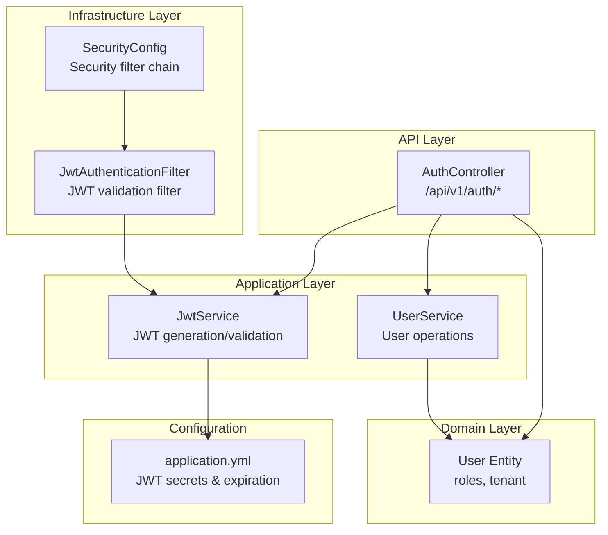
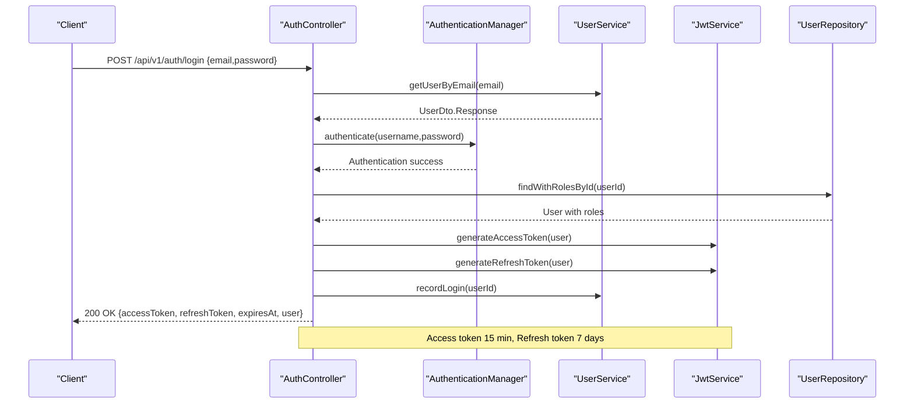
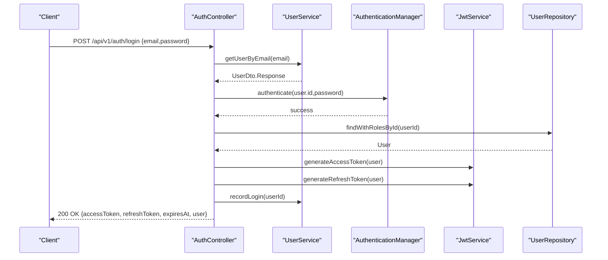
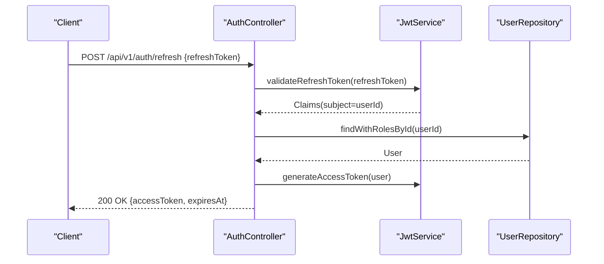
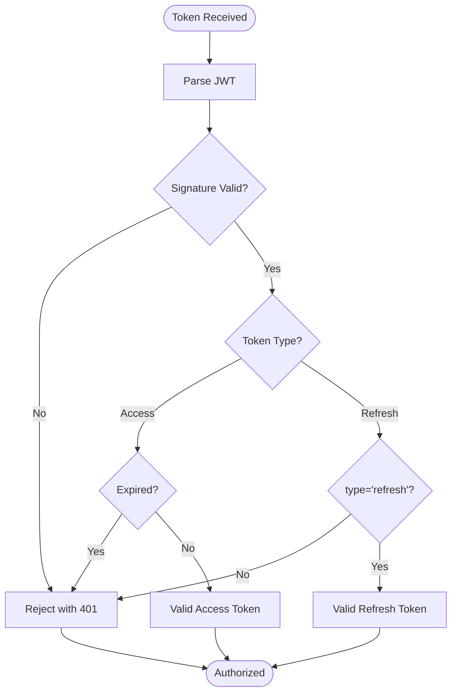
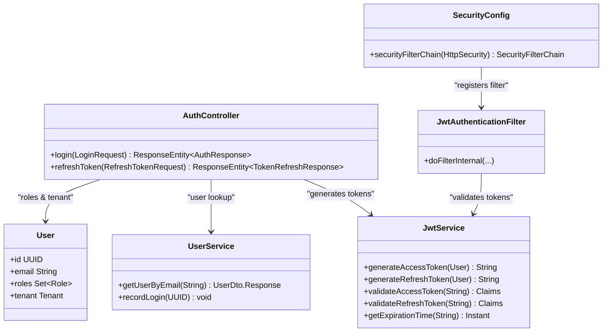

# Authentication API

<cite>
**Referenced Files in This Document**
- [AuthController.java](file://jmp-api/src/main/java/com/jmp/api/controller/AuthController.java)
- [JwtService.java](file://jmp-application/src/main/java/com/jmp/application/service/JwtService.java)
- [SecurityConfig.java](file://jmp-infrastructure/src/main/java/com/jmp/infrastructure/security/SecurityConfig.java)
- [JwtAuthenticationFilter.java](file://jmp-infrastructure/src/main/java/com/jmp/infrastructure/security/JwtAuthenticationFilter.java)
- [UserService.java](file://jmp-application/src/main/java/com/jmp/application/service/UserService.java)
- [User.java](file://jmp-domain/src/main/java/com/jmp/domain/entity/User.java)
- [application.yml](file://jmp-web/src/main/resources/application.yml)
- [GlobalExceptionHandler.java](file://jmp-api/src/main/java/com/jmp/api/advice/GlobalExceptionHandler.java)
</cite>

## Table of Contents
1. [Introduction](#introduction)
2. [Project Structure](#project-structure)
3. [Core Components](#core-components)
4. [Architecture Overview](#architecture-overview)
5. [Detailed Component Analysis](#detailed-component-analysis)
6. [Dependency Analysis](#dependency-analysis)
7. [Performance Considerations](#performance-considerations)
8. [Troubleshooting Guide](#troubleshooting-guide)
9. [Conclusion](#conclusion)

## Introduction
This document provides comprehensive API documentation for the Authentication endpoints, focusing on JWT-based authentication with username/password credentials. It covers the login endpoint for acquiring access and refresh tokens, the token refresh endpoint for extending sessions, and outlines the logout mechanism. The documentation includes request/response schemas, JWT token structure, expiration handling, refresh token mechanisms, HTTP status codes, error responses, security headers, practical cURL examples, and security considerations for token storage, transmission, and rotation policies.

## Project Structure
The authentication system spans multiple layers:
- API Layer: Exposes REST endpoints for authentication
- Application Layer: Implements business logic for JWT generation/validation and user operations
- Infrastructure Layer: Configures Spring Security, filters, and CORS
- Domain Layer: Defines user entity and roles
- Configuration: Security keys and token expiration settings

**Diagram sources**
- [AuthController.java:30-124](file://jmp-api/src/main/java/com/jmp/api/controller/AuthController.java#L30-L124)
- [JwtService.java:25-236](file://jmp-application/src/main/java/com/jmp/application/service/JwtService.java#L25-L236)
- [SecurityConfig.java:28-90](file://jmp-infrastructure/src/main/java/com/jmp/infrastructure/security/SecurityConfig.java#L28-L90)
- [JwtAuthenticationFilter.java:27-122](file://jmp-infrastructure/src/main/java/com/jmp/infrastructure/security/JwtAuthenticationFilter.java#L27-L122)
- [User.java:23-164](file://jmp-domain/src/main/java/com/jmp/domain/entity/User.java#L23-L164)
- [application.yml:71-79](file://jmp-web/src/main/resources/application.yml#L71-L79)

**Section sources**
- [AuthController.java:30-124](file://jmp-api/src/main/java/com/jmp/api/controller/AuthController.java#L30-L124)
- [JwtService.java:25-236](file://jmp-application/src/main/java/com/jmp/application/service/JwtService.java#L25-L236)
- [SecurityConfig.java:28-90](file://jmp-infrastructure/src/main/java/com/jmp/infrastructure/security/SecurityConfig.java#L28-L90)
- [JwtAuthenticationFilter.java:27-122](file://jmp-infrastructure/src/main/java/com/jmp/infrastructure/security/JwtAuthenticationFilter.java#L27-L122)
- [User.java:23-164](file://jmp-domain/src/main/java/com/jmp/domain/entity/User.java#L23-L164)
- [application.yml:71-79](file://jmp-web/src/main/resources/application.yml#L71-L79)

## Core Components
- AuthController: Exposes /api/v1/auth/login and /api/v1/auth/refresh endpoints, handles authentication and token issuance.
- JwtService: Generates and validates JWTs, manages access and refresh token secrets and expiration.
- SecurityConfig: Configures stateless security, permits public auth endpoints, and registers the JWT filter.
- JwtAuthenticationFilter: Extracts Authorization Bearer tokens, validates access tokens, and populates SecurityContext.
- UserService: Provides user lookup and login recording.
- User Entity: Represents users with roles and tenant association.

**Section sources**
- [AuthController.java:30-124](file://jmp-api/src/main/java/com/jmp/api/controller/AuthController.java#L30-L124)
- [JwtService.java:25-236](file://jmp-application/src/main/java/com/jmp/application/service/JwtService.java#L25-L236)
- [SecurityConfig.java:28-90](file://jmp-infrastructure/src/main/java/com/jmp/infrastructure/security/SecurityConfig.java#L28-L90)
- [JwtAuthenticationFilter.java:27-122](file://jmp-infrastructure/src/main/java/com/jmp/infrastructure/security/JwtAuthenticationFilter.java#L27-L122)
- [UserService.java:32-190](file://jmp-application/src/main/java/com/jmp/application/service/UserService.java#L32-L190)
- [User.java:23-164](file://jmp-domain/src/main/java/com/jmp/domain/entity/User.java#L23-L164)

## Architecture Overview
The authentication flow integrates Spring Security with JWT:
- Public endpoints permit /api/v1/auth/** and /api/v1/webhooks/**
- All other endpoints require authentication via JWT filter
- Access tokens are short-lived (15 minutes), refresh tokens are long-lived (7 days)
- Login validates credentials, generates both tokens, and records login
- Refresh endpoint validates refresh token and issues a new access token

**Diagram sources**
- [AuthController.java:42-81](file://jmp-api/src/main/java/com/jmp/api/controller/AuthController.java#L42-L81)
- [UserService.java:84-88](file://jmp-application/src/main/java/com/jmp/application/service/UserService.java#L84-L88)
- [JwtService.java:49-87](file://jmp-application/src/main/java/com/jmp/application/service/JwtService.java#L49-L87)

## Detailed Component Analysis

### Authentication Endpoints

#### Login Endpoint
- Method: POST
- Path: /api/v1/auth/login
- Purpose: Authenticate user with email and password, returning access and refresh tokens

Request Schema
- email: string (required)
- password: string (required)

Response Schema
- accessToken: string (JWT)
- refreshToken: string (JWT)
- expiresAt: datetime (UTC)
- user: object containing user metadata

Success Response
- Status: 200 OK
- Body: AuthResponse with tokens and user info

Error Responses
- Status: 401 Unauthorized
- Body: RFC 7807 Problem Details with errorCode AUTHENTICATION_FAILED

**Diagram sources**
- [AuthController.java:42-81](file://jmp-api/src/main/java/com/jmp/api/controller/AuthController.java#L42-L81)
- [UserService.java:84-88](file://jmp-application/src/main/java/com/jmp/application/service/UserService.java#L84-L88)
- [JwtService.java:49-87](file://jmp-application/src/main/java/com/jmp/application/service/JwtService.java#L49-L87)

**Section sources**
- [AuthController.java:42-81](file://jmp-api/src/main/java/com/jmp/api/controller/AuthController.java#L42-L81)
- [GlobalExceptionHandler.java:54-66](file://jmp-api/src/main/java/com/jmp/api/advice/GlobalExceptionHandler.java#L54-L66)

#### Token Refresh Endpoint
- Method: POST
- Path: /api/v1/auth/refresh
- Purpose: Issue a new access token using a valid refresh token

Request Schema
- refreshToken: string (required)

Response Schema
- accessToken: string (JWT)
- expiresAt: datetime (UTC)

Success Response
- Status: 200 OK
- Body: TokenRefreshResponse with new access token and expiration

Error Responses
- Status: 401 Unauthorized
- Body: RFC 7807 Problem Details with errorCode AUTHENTICATION_FAILED

**Diagram sources**
- [AuthController.java:83-100](file://jmp-api/src/main/java/com/jmp/api/controller/AuthController.java#L83-L100)
- [JwtService.java:176-188](file://jmp-application/src/main/java/com/jmp/application/service/JwtService.java#L176-L188)

**Section sources**
- [AuthController.java:83-100](file://jmp-api/src/main/java/com/jmp/api/controller/AuthController.java#L83-L100)
- [JwtService.java:176-188](file://jmp-application/src/main/java/com/jmp/application/service/JwtService.java#L176-L188)
- [GlobalExceptionHandler.java:54-66](file://jmp-api/src/main/java/com/jmp/api/advice/GlobalExceptionHandler.java#L54-L66)

#### Logout Endpoint
- Current Implementation: Not present in the codebase
- Recommended Approach: Stateless JWT implies no server-side session to invalidate
- Practical Recommendation: Client-side token removal and refresh token rotation
- Alternative: Introduce a revocation mechanism using a blacklist or short-lived tokens with frequent refresh

[No sources needed since this section provides general guidance]

### JWT Token Structure and Validation

Access Token Claims
- sub: user identifier
- email: user email
- tenant_id: tenant identifier
- roles: list of role names
- iat: issued at timestamp
- exp: expiration timestamp

Refresh Token Claims
- sub: user identifier
- type: "refresh"
- iat: issued at timestamp
- exp: expiration timestamp

Token Validation
- Access tokens validated using access secret key
- Refresh tokens validated using refresh secret key and must have type "refresh"
- Expiration checked via exp claim

**Diagram sources**
- [JwtService.java:165-188](file://jmp-application/src/main/java/com/jmp/application/service/JwtService.java#L165-L188)

**Section sources**
- [JwtService.java:49-87](file://jmp-application/src/main/java/com/jmp/application/service/JwtService.java#L49-L87)
- [JwtService.java:165-188](file://jmp-application/src/main/java/com/jmp/application/service/JwtService.java#L165-L188)

### Security Configuration and Headers

Security Headers and Policies
- Authorization: Bearer <access_token> for protected endpoints
- Stateless session management (SessionCreationPolicy.STATELESS)
- Public endpoints: /api/v1/auth/** and /api/v1/webhooks/**
- CORS configured for localhost origins

JWT Secrets and Expiration
- Access token secret and refresh token secret configured via environment variables
- Access token expiration: 15 minutes
- Refresh token expiration: 7 days

**Section sources**
- [JwtAuthenticationFilter.java:78-84](file://jmp-infrastructure/src/main/java/com/jmp/infrastructure/security/JwtAuthenticationFilter.java#L78-L84)
- [SecurityConfig.java:47-58](file://jmp-infrastructure/src/main/java/com/jmp/infrastructure/security/SecurityConfig.java#L47-L58)
- [application.yml:71-79](file://jmp-web/src/main/resources/application.yml#L71-L79)

## Dependency Analysis

**Diagram sources**
- [AuthController.java:37-40](file://jmp-api/src/main/java/com/jmp/api/controller/AuthController.java#L37-L40)
- [JwtService.java:29-43](file://jmp-application/src/main/java/com/jmp/application/service/JwtService.java#L29-L43)
- [UserService.java:34-38](file://jmp-application/src/main/java/com/jmp/application/service/UserService.java#L34-L38)
- [User.java:28-96](file://jmp-domain/src/main/java/com/jmp/domain/entity/User.java#L28-L96)
- [SecurityConfig.java:33-40](file://jmp-infrastructure/src/main/java/com/jmp/infrastructure/security/SecurityConfig.java#L33-L40)
- [JwtAuthenticationFilter.java:31-36](file://jmp-infrastructure/src/main/java/com/jmp/infrastructure/security/JwtAuthenticationFilter.java#L31-L36)

**Section sources**
- [AuthController.java:37-40](file://jmp-api/src/main/java/com/jmp/api/controller/AuthController.java#L37-L40)
- [JwtService.java:29-43](file://jmp-application/src/main/java/com/jmp/application/service/JwtService.java#L29-L43)
- [UserService.java:34-38](file://jmp-application/src/main/java/com/jmp/application/service/UserService.java#L34-L38)
- [User.java:28-96](file://jmp-domain/src/main/java/com/jmp/domain/entity/User.java#L28-L96)
- [SecurityConfig.java:33-40](file://jmp-infrastructure/src/main/java/com/jmp/infrastructure/security/SecurityConfig.java#L33-L40)
- [JwtAuthenticationFilter.java:31-36](file://jmp-infrastructure/src/main/java/com/jmp/infrastructure/security/JwtAuthenticationFilter.java#L31-L36)

## Performance Considerations
- Access tokens are short-lived (15 minutes) to minimize risk and reduce validation overhead
- Refresh tokens are long-lived (7 days) to balance usability and security
- Stateless design eliminates server-side session storage, improving scalability
- Consider rate limiting for authentication endpoints to prevent brute force attacks

[No sources needed since this section provides general guidance]

## Troubleshooting Guide

Common Issues and Resolutions
- Invalid Credentials: Returns 401 Unauthorized with RFC 7807 error details
- Account Lockout Scenarios: Not implemented in code; consider adding account lockout policy
- Token Expiration: Access tokens expire after 15 minutes; use refresh endpoint to obtain new access token
- Missing Authorization Header: Protected endpoints require Authorization: Bearer <access_token>
- CORS Issues: Ensure client origin is configured in CORS settings

Error Response Format
- Status: 401 Unauthorized
- Body: RFC 7807 Problem Details with fields:
  - title: "Unauthorized"
  - status: 401
  - detail: "Invalid credentials"
  - instance: request URI
  - timestamp: current UTC time
  - errorCode: "AUTHENTICATION_FAILED"

**Section sources**
- [GlobalExceptionHandler.java:54-66](file://jmp-api/src/main/java/com/jmp/api/advice/GlobalExceptionHandler.java#L54-L66)

## Conclusion
The authentication system provides robust JWT-based authentication with clear separation of concerns across layers. The login endpoint issues both access and refresh tokens, while the refresh endpoint extends sessions securely. The stateless design aligns with modern API security practices. Consider implementing logout via client-side token removal and refresh token rotation, and evaluate adding account lockout policies for enhanced security.