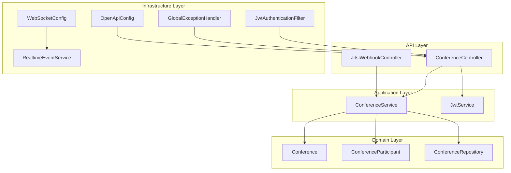
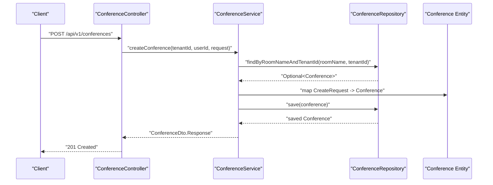
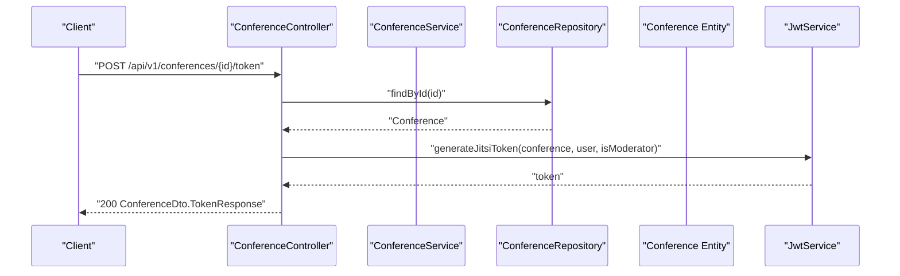
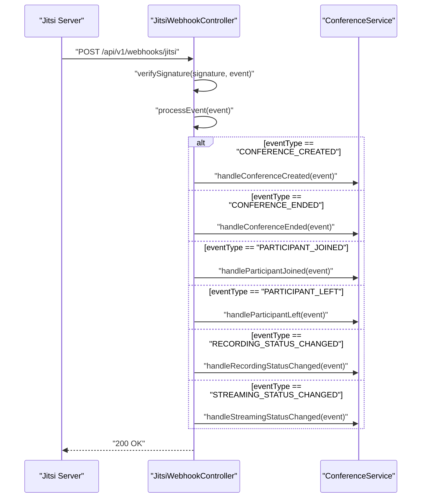
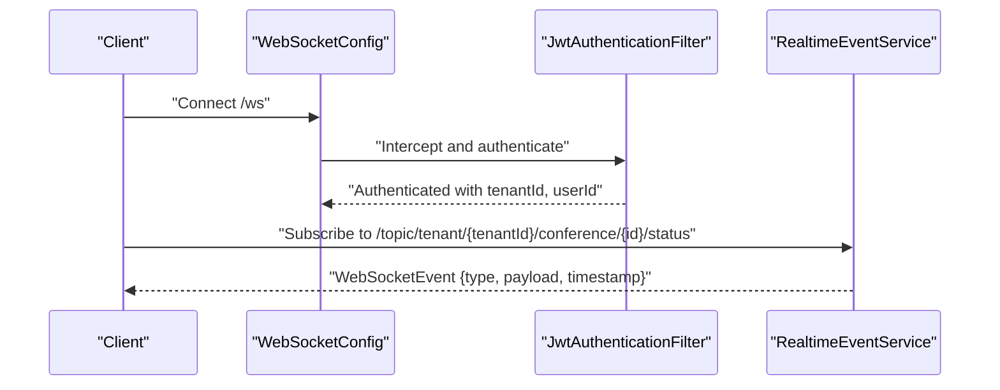
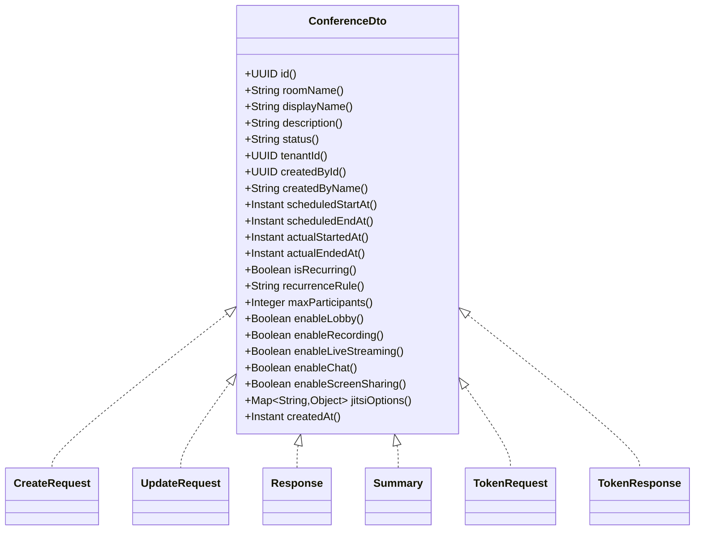
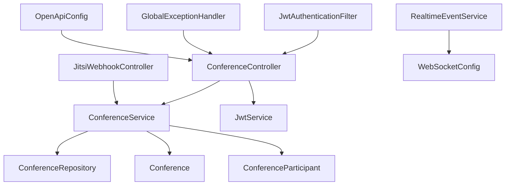

# Conference Management API

<cite>
**Referenced Files in This Document**
- [ConferenceController.java](file://jmp-api/src/main/java/com/jmp/api/controller/ConferenceController.java)
- [JitsiWebhookController.java](file://jmp-api/src/main/java/com/jmp/api/controller/JitsiWebhookController.java)
- [ConferenceService.java](file://jmp-application/src/main/java/com/jmp/application/service/ConferenceService.java)
- [ConferenceDto.java](file://jmp-application/src/main/java/com/jmp/application/dto/ConferenceDto.java)
- [Conference.java](file://jmp-domain/src/main/java/com/jmp/domain/entity/Conference.java)
- [ConferenceRepository.java](file://jmp-domain/src/main/java/com/jmp/domain/repository/ConferenceRepository.java)
- [ConferenceParticipant.java](file://jmp-domain/src/main/java/com/jmp/domain/entity/ConferenceParticipant.java)
- [RealtimeEventService.java](file://jmp-infrastructure/src/main/java/com/jmp/infrastructure/websocket/RealtimeEventService.java)
- [WebSocketConfig.java](file://jmp-infrastructure/src/main/java/com/jmp/infrastructure/websocket/WebSocketConfig.java)
- [JwtService.java](file://jmp-application/src/main/java/com/jmp/application/service/JwtService.java)
- [JwtAuthenticationFilter.java](file://jmp-infrastructure/src/main/java/com/jmp/infrastructure/security/JwtAuthenticationFilter.java)
- [GlobalExceptionHandler.java](file://jmp-api/src/main/java/com/jmp/api/advice/GlobalExceptionHandler.java)
- [OpenApiConfig.java](file://jmp-api/src/main/java/com/jmp/api/config/OpenApiConfig.java)
</cite>

## Table of Contents
1. [Introduction](#introduction)
2. [Project Structure](#project-structure)
3. [Core Components](#core-components)
4. [Architecture Overview](#architecture-overview)
5. [Detailed Component Analysis](#detailed-component-analysis)
6. [Dependency Analysis](#dependency-analysis)
7. [Performance Considerations](#performance-considerations)
8. [Troubleshooting Guide](#troubleshooting-guide)
9. [Conclusion](#conclusion)
10. [Appendices](#appendices)

## Introduction
This document provides comprehensive API documentation for the Conference Management module. It covers the full lifecycle of conferences: creation, scheduling, participant management, and termination. It also documents real-time participant tracking endpoints, conference status updates, and Jitsi integration hooks. The documentation includes request/response schemas, pagination and filtering capabilities, and error handling patterns.

## Project Structure
The Conference Management API is organized into layered modules:
- API Layer: Controllers expose REST endpoints for conference operations and Jitsi webhooks.
- Application Layer: Services encapsulate business logic and coordinate repositories and mappers.
- Domain Layer: Entities model conferences, participants, and related domain objects.
- Infrastructure Layer: WebSocket configuration and real-time event broadcasting; JWT authentication filter; exception handling; OpenAPI configuration.

**Diagram sources**
- [ConferenceController.java:37-189](file://jmp-api/src/main/java/com/jmp/api/controller/ConferenceController.java#L37-L189)
- [JitsiWebhookController.java:24-125](file://jmp-api/src/main/java/com/jmp/api/controller/JitsiWebhookController.java#L24-L125)
- [ConferenceService.java:25-225](file://jmp-application/src/main/java/com/jmp/application/service/ConferenceService.java#L25-L225)
- [Conference.java:25-217](file://jmp-domain/src/main/java/com/jmp/domain/entity/Conference.java#L25-L217)
- [ConferenceParticipant.java:18-150](file://jmp-domain/src/main/java/com/jmp/domain/entity/ConferenceParticipant.java#L18-L150)
- [ConferenceRepository.java:20-110](file://jmp-domain/src/main/java/com/jmp/domain/repository/ConferenceRepository.java#L20-L110)
- [WebSocketConfig.java:23-70](file://jmp-infrastructure/src/main/java/com/jmp/infrastructure/websocket/WebSocketConfig.java#L23-L70)
- [RealtimeEventService.java:17-142](file://jmp-infrastructure/src/main/java/com/jmp/infrastructure/websocket/RealtimeEventService.java#L17-L142)
- [JwtAuthenticationFilter.java:27-122](file://jmp-infrastructure/src/main/java/com/jmp/infrastructure/security/JwtAuthenticationFilter.java#L27-L122)
- [GlobalExceptionHandler.java:22-130](file://jmp-api/src/main/java/com/jmp/api/advice/GlobalExceptionHandler.java#L22-L130)
- [OpenApiConfig.java:20-56](file://jmp-api/src/main/java/com/jmp/api/config/OpenApiConfig.java#L20-L56)

**Section sources**
- [ConferenceController.java:37-189](file://jmp-api/src/main/java/com/jmp/api/controller/ConferenceController.java#L37-L189)
- [ConferenceService.java:25-225](file://jmp-application/src/main/java/com/jmp/application/service/ConferenceService.java#L25-L225)
- [Conference.java:25-217](file://jmp-domain/src/main/java/com/jmp/domain/entity/Conference.java#L25-L217)
- [ConferenceRepository.java:20-110](file://jmp-domain/src/main/java/com/jmp/domain/repository/ConferenceRepository.java#L20-L110)
- [WebSocketConfig.java:23-70](file://jmp-infrastructure/src/main/java/com/jmp/infrastructure/websocket/WebSocketConfig.java#L23-L70)
- [RealtimeEventService.java:17-142](file://jmp-infrastructure/src/main/java/com/jmp/infrastructure/websocket/RealtimeEventService.java#L17-L142)
- [JwtAuthenticationFilter.java:27-122](file://jmp-infrastructure/src/main/java/com/jmp/infrastructure/security/JwtAuthenticationFilter.java#L27-L122)
- [GlobalExceptionHandler.java:22-130](file://jmp-api/src/main/java/com/jmp/api/advice/GlobalExceptionHandler.java#L22-L130)
- [OpenApiConfig.java:20-56](file://jmp-api/src/main/java/com/jmp/api/config/OpenApiConfig.java#L20-L56)

## Core Components
- ConferenceController: Exposes endpoints for creating, retrieving, listing, updating, starting, ending, and deleting conferences; generates Jitsi JWT tokens; supports pagination and search.
- ConferenceService: Implements business logic for conference lifecycle operations, status transitions, and scheduled auto-start/end processing.
- ConferenceRepository: Provides JPA queries for conferences, including paginated listing, searching, upcoming, active, and scheduled auto-processing.
- Conference Entity: Models conference attributes, status transitions, participant counting, and JSON jitsiOptions.
- ConferenceParticipant Entity: Tracks participant roles, statuses, join/leave timestamps, and metadata.
- JitsiWebhookController: Receives Jitsi webhook events, verifies signatures, and routes to handlers for conference lifecycle and participant/streaming/recording status changes.
- RealtimeEventService: Publishes WebSocket events for conference status, recording status, and system notifications to tenants/users.
- WebSocketConfig: Configures STOMP broker, endpoints, and inbound channel interceptors.
- JwtService: Generates JWT tokens for platform and Jitsi, including claims for tenant, moderator status, and feature flags.
- JwtAuthenticationFilter: Extracts tenant/user IDs from JWT and populates authentication details.
- GlobalExceptionHandler: Standardizes error responses using RFC 7807 Problem Details.
- OpenApiConfig: Defines OpenAPI security scheme and servers for API documentation.

**Section sources**
- [ConferenceController.java:37-189](file://jmp-api/src/main/java/com/jmp/api/controller/ConferenceController.java#L37-L189)
- [ConferenceService.java:25-225](file://jmp-application/src/main/java/com/jmp/application/service/ConferenceService.java#L25-L225)
- [ConferenceRepository.java:20-110](file://jmp-domain/src/main/java/com/jmp/domain/repository/ConferenceRepository.java#L20-L110)
- [Conference.java:25-217](file://jmp-domain/src/main/java/com/jmp/domain/entity/Conference.java#L25-L217)
- [ConferenceParticipant.java:18-150](file://jmp-domain/src/main/java/com/jmp/domain/entity/ConferenceParticipant.java#L18-L150)
- [JitsiWebhookController.java:24-125](file://jmp-api/src/main/java/com/jmp/api/controller/JitsiWebhookController.java#L24-L125)
- [RealtimeEventService.java:17-142](file://jmp-infrastructure/src/main/java/com/jmp/infrastructure/websocket/RealtimeEventService.java#L17-L142)
- [WebSocketConfig.java:23-70](file://jmp-infrastructure/src/main/java/com/jmp/infrastructure/websocket/WebSocketConfig.java#L23-L70)
- [JwtService.java:25-236](file://jmp-application/src/main/java/com/jmp/application/service/JwtService.java#L25-L236)
- [JwtAuthenticationFilter.java:27-122](file://jmp-infrastructure/src/main/java/com/jmp/infrastructure/security/JwtAuthenticationFilter.java#L27-L122)
- [GlobalExceptionHandler.java:22-130](file://jmp-api/src/main/java/com/jmp/api/advice/GlobalExceptionHandler.java#L22-L130)
- [OpenApiConfig.java:20-56](file://jmp-api/src/main/java/com/jmp/api/config/OpenApiConfig.java#L20-L56)

## Architecture Overview
The system follows a layered architecture:
- API Layer handles HTTP requests and delegates to application services.
- Application Layer enforces business rules and orchestrates repositories and mappers.
- Domain Layer persists entities and exposes repository interfaces with JPQL queries.
- Infrastructure Layer manages WebSocket messaging, JWT authentication, and global exception handling.

**Diagram sources**
- [ConferenceController.java:49-63](file://jmp-api/src/main/java/com/jmp/api/controller/ConferenceController.java#L49-L63)
- [ConferenceService.java:40-65](file://jmp-application/src/main/java/com/jmp/application/service/ConferenceService.java#L40-L65)
- [ConferenceRepository.java:30-32](file://jmp-domain/src/main/java/com/jmp/domain/repository/ConferenceRepository.java#L30-L32)
- [Conference.java:25-217](file://jmp-domain/src/main/java/com/jmp/domain/entity/Conference.java#L25-L217)

**Section sources**
- [ConferenceController.java:37-189](file://jmp-api/src/main/java/com/jmp/api/controller/ConferenceController.java#L37-L189)
- [ConferenceService.java:25-225](file://jmp-application/src/main/java/com/jmp/application/service/ConferenceService.java#L25-L225)
- [ConferenceRepository.java:20-110](file://jmp-domain/src/main/java/com/jmp/domain/repository/ConferenceRepository.java#L20-L110)
- [Conference.java:25-217](file://jmp-domain/src/main/java/com/jmp/domain/entity/Conference.java#L25-L217)

## Detailed Component Analysis

### Conference Lifecycle Endpoints
- Create Conference
  - Method: POST /api/v1/conferences
  - Auth: MODERATOR/TENANT_ADMIN/SUPER_ADMIN
  - Request: ConferenceDto.CreateRequest
  - Response: 201 ConferenceDto.Response
  - Behavior: Validates tenant/user existence, checks unique room name per tenant, sets status to SCHEDULED, and returns created conference with computed currentParticipants.
  - Error: 400 for invalid arguments; 409 for state conflicts; 500 for internal errors.

- Get Conference by ID
  - Method: GET /api/v1/conferences/{id}
  - Auth: PARTICIPANT/MODERATOR/TENANT_ADMIN/SUPER_ADMIN
  - Response: ConferenceDto.Response

- List Conferences (with pagination and optional search)
  - Method: GET /api/v1/conferences
  - Auth: PARTICIPANT/MODERATOR/TENANT_ADMIN/SUPER_ADMIN
  - Query params: page, size, sort; search (optional)
  - Response: Page<ConferenceDto.Summary>

- Active Conferences
  - Method: GET /api/v1/conferences/active
  - Auth: PARTICIPANT/MODERATOR/TENANT_ADMIN/SUPER_ADMIN
  - Response: List<ConferenceDto.Summary>

- Upcoming Conferences
  - Method: GET /api/v1/conferences/upcoming
  - Auth: PARTICIPANT/MODERATOR/TENANT_ADMIN/SUPER_ADMIN
  - Response: List<ConferenceDto.Summary>

- Update Conference
  - Method: PUT /api/v1/conferences/{id}
  - Auth: MODERATOR/TENANT_ADMIN/SUPER_ADMIN
  - Request: ConferenceDto.UpdateRequest
  - Behavior: Allowed only for SCHEDULED conferences; updates non-sensitive fields.

- Start Conference
  - Method: POST /api/v1/conferences/{id}/start
  - Auth: MODERATOR/TENANT_ADMIN/SUPER_ADMIN
  - Behavior: Transitions status from SCHEDULED to ACTIVE and records actualStartedAt.

- End Conference
  - Method: POST /api/v1/conferences/{id}/end
  - Auth: MODERATOR/TENANT_ADMIN/SUPER_ADMIN
  - Behavior: Transitions status from ACTIVE to ENDED and records actualEndedAt.

- Delete Conference
  - Method: DELETE /api/v1/conferences/{id}
  - Auth: MODERATOR/TENANT_ADMIN/SUPER_ADMIN
  - Behavior: Soft deletes conference by setting deletedAt and status to CANCELLED.

- Generate Jitsi JWT Token
  - Method: POST /api/v1/conferences/{id}/token
  - Auth: PARTICIPANT/MODERATOR/TENANT_ADMIN/SUPER_ADMIN
  - Request: ConferenceDto.TokenRequest (displayName, isModerator, features)
  - Response: ConferenceDto.TokenResponse (token, roomUrl, expiresAt)
  - Behavior: Builds JWT with room, tenant slug, user context, and feature flags; constructs room URL.

**Diagram sources**
- [ConferenceController.java:140-173](file://jmp-api/src/main/java/com/jmp/api/controller/ConferenceController.java#L140-L173)
- [JwtService.java:89-126](file://jmp-application/src/main/java/com/jmp/application/service/JwtService.java#L89-L126)
- [ConferenceRepository.java:26-27](file://jmp-domain/src/main/java/com/jmp/domain/repository/ConferenceRepository.java#L26-L27)

**Section sources**
- [ConferenceController.java:49-173](file://jmp-api/src/main/java/com/jmp/api/controller/ConferenceController.java#L49-L173)
- [ConferenceService.java:40-189](file://jmp-application/src/main/java/com/jmp/application/service/ConferenceService.java#L40-L189)
- [ConferenceDto.java:43-174](file://jmp-application/src/main/java/com/jmp/application/dto/ConferenceDto.java#L43-L174)
- [JwtService.java:89-126](file://jmp-application/src/main/java/com/jmp/application/service/JwtService.java#L89-L126)

### Jitsi Webhook Integration
- Endpoint: POST /api/v1/webhooks/jitsi
- Headers: X-Jitsi-Signature (optional)
- Body: JitsiWebhookEvent (eventType, roomName, tenantId, conferenceId, timestamp, participant, data)
- Signature Verification: Optional HMAC verification (configured per spec).
- Event Types:
  - CONFERENCE_CREATED: Log and optionally update status.
  - CONFERENCE_ENDED: Log and update status.
  - PARTICIPANT_JOINED: Log and update participant metrics.
  - PARTICIPANT_LEFT: Log and update participant metrics.
  - RECORDING_STATUS_CHANGED: Handle recording lifecycle.
  - STREAMING_STATUS_CHANGED: Handle streaming status.

**Diagram sources**
- [JitsiWebhookController.java:33-102](file://jmp-api/src/main/java/com/jmp/api/controller/JitsiWebhookController.java#L33-L102)
- [ConferenceService.java:194-223](file://jmp-application/src/main/java/com/jmp/application/service/ConferenceService.java#L194-L223)

**Section sources**
- [JitsiWebhookController.java:24-125](file://jmp-api/src/main/java/com/jmp/api/controller/JitsiWebhookController.java#L24-L125)
- [ConferenceService.java:194-223](file://jmp-application/src/main/java/com/jmp/application/service/ConferenceService.java#L194-L223)

### Real-Time Status Updates via WebSocket
- WebSocket Broker: In-memory STOMP broker configured; production-grade brokers supported.
- Endpoints:
  - Native WebSocket: /ws
  - SockJS: /ws with fallback
- Authentication Interceptor: JwtAuthenticationFilter validates tokens and injects tenant/user details.
- Events:
  - Conference status: /topic/tenant/{tenantId}/conference/{conferenceId}/status
  - Recording status: /topic/tenant/{tenantId}/recording/{recordingId}/status
  - System notifications: /topic/tenant/{tenantId}/notifications/system
  - Broadcast: /topic/broadcast/{eventType}
  - Personal queue: /user/{userId}/queue/events

**Diagram sources**
- [WebSocketConfig.java:27-69](file://jmp-infrastructure/src/main/java/com/jmp/infrastructure/websocket/WebSocketConfig.java#L27-L69)
- [JwtAuthenticationFilter.java:29-122](file://jmp-infrastructure/src/main/java/com/jmp/infrastructure/security/JwtAuthenticationFilter.java#L29-L122)
- [RealtimeEventService.java:27-101](file://jmp-infrastructure/src/main/java/com/jmp/infrastructure/websocket/RealtimeEventService.java#L27-L101)

**Section sources**
- [WebSocketConfig.java:23-70](file://jmp-infrastructure/src/main/java/com/jmp/infrastructure/websocket/WebSocketConfig.java#L23-L70)
- [JwtAuthenticationFilter.java:27-122](file://jmp-infrastructure/src/main/java/com/jmp/infrastructure/security/JwtAuthenticationFilter.java#L27-L122)
- [RealtimeEventService.java:17-142](file://jmp-infrastructure/src/main/java/com/jmp/infrastructure/websocket/RealtimeEventService.java#L17-L142)

### Data Models and Schemas
- ConferenceDto.CreateRequest
  - Fields: roomName*, displayName*, description, scheduledStartAt, scheduledEndAt, isRecurring, recurrenceRule, maxParticipants, enableLobby, enableRecording, enableLiveStreaming, enableChat, enableScreenSharing, jitsiOptions
- ConferenceDto.UpdateRequest
  - Fields: displayName, description, scheduledStartAt, scheduledEndAt, maxParticipants, enableLobby, enableRecording, enableLiveStreaming, enableChat, enableScreenSharing, jitsiOptions
- ConferenceDto.Response
  - Fields: id, roomName, displayName, description, status, tenantId, createdById, createdByName, scheduledStartAt, scheduledEndAt, actualStartedAt, actualEndedAt, isRecurring, recurrenceRule, maxParticipants, enableLobby, enableRecording, enableLiveStreaming, enableChat, enableScreenSharing, jitsiOptions, currentParticipants, createdAt
- ConferenceDto.Summary
  - Fields: id, roomName, displayName, status, scheduledStartAt, scheduledEndAt, currentParticipants, maxParticipants
- ConferenceDto.TokenRequest
  - Fields: conferenceId*, displayName*, isModerator, features
- ConferenceDto.TokenResponse
  - Fields: token, roomUrl, expiresAt

**Diagram sources**
- [ConferenceDto.java:15-176](file://jmp-application/src/main/java/com/jmp/application/dto/ConferenceDto.java#L15-L176)

**Section sources**
- [ConferenceDto.java:43-174](file://jmp-application/src/main/java/com/jmp/application/dto/ConferenceDto.java#L43-L174)

### Filtering, Pagination, and Search
- Pagination: Uses Spring Data Pageable for list endpoints.
- Search: Optional query param search filters by displayName, roomName, or description.
- Date/Time Range: Repository supports finding conferences scheduled within a range.
- Upcoming/Active: Dedicated endpoints return upcoming and active conferences for a tenant.

**Section sources**
- [ConferenceController.java:72-106](file://jmp-api/src/main/java/com/jmp/api/controller/ConferenceController.java#L72-L106)
- [ConferenceRepository.java:64-92](file://jmp-domain/src/main/java/com/jmp/domain/repository/ConferenceRepository.java#L64-L92)

### Error Handling
- Standardized Problem Details responses using RFC 7807.
- Common error codes:
  - INVALID_ARGUMENT: 400 for bad requests.
  - STATE_CONFLICT: 409 for lifecycle/state conflicts.
  - AUTHENTICATION_FAILED: 401 for invalid credentials.
  - ACCESS_DENIED: 403 for insufficient permissions.
  - VALIDATION_ERROR: 400 with field-specific errors.
  - INTERNAL_ERROR: 500 for unexpected errors.

**Section sources**
- [GlobalExceptionHandler.java:22-130](file://jmp-api/src/main/java/com/jmp/api/advice/GlobalExceptionHandler.java#L22-L130)

## Dependency Analysis

**Diagram sources**
- [ConferenceController.java:37-189](file://jmp-api/src/main/java/com/jmp/api/controller/ConferenceController.java#L37-L189)
- [ConferenceService.java:25-225](file://jmp-application/src/main/java/com/jmp/application/service/ConferenceService.java#L25-L225)
- [ConferenceRepository.java:20-110](file://jmp-domain/src/main/java/com/jmp/domain/repository/ConferenceRepository.java#L20-L110)
- [Conference.java:25-217](file://jmp-domain/src/main/java/com/jmp/domain/entity/Conference.java#L25-L217)
- [ConferenceParticipant.java:18-150](file://jmp-domain/src/main/java/com/jmp/domain/entity/ConferenceParticipant.java#L18-L150)
- [JitsiWebhookController.java:24-125](file://jmp-api/src/main/java/com/jmp/api/controller/JitsiWebhookController.java#L24-L125)
- [RealtimeEventService.java:17-142](file://jmp-infrastructure/src/main/java/com/jmp/infrastructure/websocket/RealtimeEventService.java#L17-L142)
- [WebSocketConfig.java:23-70](file://jmp-infrastructure/src/main/java/com/jmp/infrastructure/websocket/WebSocketConfig.java#L23-L70)
- [JwtAuthenticationFilter.java:27-122](file://jmp-infrastructure/src/main/java/com/jmp/infrastructure/security/JwtAuthenticationFilter.java#L27-L122)
- [GlobalExceptionHandler.java:22-130](file://jmp-api/src/main/java/com/jmp/api/advice/GlobalExceptionHandler.java#L22-L130)
- [OpenApiConfig.java:20-56](file://jmp-api/src/main/java/com/jmp/api/config/OpenApiConfig.java#L20-L56)

**Section sources**
- [ConferenceController.java:37-189](file://jmp-api/src/main/java/com/jmp/api/controller/ConferenceController.java#L37-L189)
- [ConferenceService.java:25-225](file://jmp-application/src/main/java/com/jmp/application/service/ConferenceService.java#L25-L225)
- [ConferenceRepository.java:20-110](file://jmp-domain/src/main/java/com/jmp/domain/repository/ConferenceRepository.java#L20-L110)
- [Conference.java:25-217](file://jmp-domain/src/main/java/com/jmp/domain/entity/Conference.java#L25-L217)
- [ConferenceParticipant.java:18-150](file://jmp-domain/src/main/java/com/jmp/domain/entity/ConferenceParticipant.java#L18-L150)
- [JitsiWebhookController.java:24-125](file://jmp-api/src/main/java/com/jmp/api/controller/JitsiWebhookController.java#L24-L125)
- [RealtimeEventService.java:17-142](file://jmp-infrastructure/src/main/java/com/jmp/infrastructure/websocket/RealtimeEventService.java#L17-L142)
- [WebSocketConfig.java:23-70](file://jmp-infrastructure/src/main/java/com/jmp/infrastructure/websocket/WebSocketConfig.java#L23-L70)
- [JwtAuthenticationFilter.java:27-122](file://jmp-infrastructure/src/main/java/com/jmp/infrastructure/security/JwtAuthenticationFilter.java#L27-L122)
- [GlobalExceptionHandler.java:22-130](file://jmp-api/src/main/java/com/jmp/api/advice/GlobalExceptionHandler.java#L22-L130)
- [OpenApiConfig.java:20-56](file://jmp-api/src/main/java/com/jmp/api/config/OpenApiConfig.java#L20-L56)

## Performance Considerations
- Entity Graphs: findWithDetailsById and findByTenantIdAndDeletedAtIsNull use EntityGraph to eagerly fetch associations, reducing N+1 queries.
- Pagination: Repository methods support Pageable for efficient large dataset traversal.
- Scheduled Auto-Processing: Separate scheduled tasks process auto-starts and auto-ends to avoid blocking request threads.
- WebSocket Broker: In-memory broker suitable for development; production should use scalable brokers (e.g., RabbitMQ/Redis) for horizontal scaling.

[No sources needed since this section provides general guidance]

## Troubleshooting Guide
- Room Name Already Exists
  - Symptom: 400 Bad Request during creation.
  - Cause: Duplicate roomName within tenant.
  - Resolution: Choose a unique roomName.

- Conference Not Found
  - Symptom: 400 Bad Request on update/start/end/delete/get.
  - Cause: Invalid conference ID.
  - Resolution: Verify conference ID and tenant association.

- State Conflict (Cannot Update Ended/Cancelled or Start Non-Scheduled)
  - Symptom: 409 Conflict.
  - Cause: Attempting lifecycle transitions outside allowed states.
  - Resolution: Ensure conference is in SCHEDULED before start; only update SCHEDULED conferences.

- Authentication/Authorization Failures
  - Symptom: 401 Unauthorized or 403 Forbidden.
  - Cause: Invalid/expired JWT or insufficient roles.
  - Resolution: Re-authenticate and ensure proper roles (MODERATOR/TENANT_ADMIN/SUPER_ADMIN/PARTICIPANT).

- Validation Errors
  - Symptom: 400 Bad Request with field-specific errors.
  - Cause: Missing or invalid fields in request body.
  - Resolution: Review validation messages and correct payload.

- Jitsi Webhook Signature Verification
  - Symptom: 401 Unauthorized on webhook.
  - Cause: Signature mismatch or disabled verification.
  - Resolution: Configure signature verification and ensure shared secret alignment.

**Section sources**
- [ConferenceService.java:40-65](file://jmp-application/src/main/java/com/jmp/application/service/ConferenceService.java#L40-L65)
- [ConferenceService.java:113-131](file://jmp-application/src/main/java/com/jmp/application/service/ConferenceService.java#L113-L131)
- [ConferenceService.java:136-152](file://jmp-application/src/main/java/com/jmp/application/service/ConferenceService.java#L136-L152)
- [ConferenceService.java:157-173](file://jmp-application/src/main/java/com/jmp/application/service/ConferenceService.java#L157-L173)
- [GlobalExceptionHandler.java:26-52](file://jmp-api/src/main/java/com/jmp/api/advice/GlobalExceptionHandler.java#L26-L52)
- [JitsiWebhookController.java:104-109](file://jmp-api/src/main/java/com/jmp/api/controller/JitsiWebhookController.java#L104-L109)

## Conclusion
The Conference Management API provides a robust, secure, and extensible foundation for managing Jitsi conferences. It supports full lifecycle operations, real-time updates, and Jitsi integration via webhooks and JWT tokens. The layered architecture, standardized error handling, and comprehensive DTOs enable maintainable and scalable integrations.

[No sources needed since this section summarizes without analyzing specific files]

## Appendices

### API Endpoints Reference
- Conference Operations
  - POST /api/v1/conferences
  - GET /api/v1/conferences/{id}
  - GET /api/v1/conferences
  - GET /api/v1/conferences/active
  - GET /api/v1/conferences/upcoming
  - PUT /api/v1/conferences/{id}
  - POST /api/v1/conferences/{id}/start
  - POST /api/v1/conferences/{id}/end
  - DELETE /api/v1/conferences/{id}
  - POST /api/v1/conferences/{id}/token

- Jitsi Webhooks
  - POST /api/v1/webhooks/jitsi

**Section sources**
- [ConferenceController.java:49-173](file://jmp-api/src/main/java/com/jmp/api/controller/ConferenceController.java#L49-L173)
- [JitsiWebhookController.java:33-52](file://jmp-api/src/main/java/com/jmp/api/controller/JitsiWebhookController.java#L33-L52)

### WebSocket Event Types
- Conference Status: /topic/tenant/{tenantId}/conference/{conferenceId}/status
- Recording Status: /topic/tenant/{tenantId}/recording/{recordingId}/status
- System Notifications: /topic/tenant/{tenantId}/notifications/system
- Broadcast: /topic/broadcast/{eventType}
- Personal Queue: /user/{userId}/queue/events

**Section sources**
- [RealtimeEventService.java:27-86](file://jmp-infrastructure/src/main/java/com/jmp/infrastructure/websocket/RealtimeEventService.java#L27-L86)
- [WebSocketConfig.java:32-50](file://jmp-infrastructure/src/main/java/com/jmp/infrastructure/websocket/WebSocketConfig.java#L32-L50)