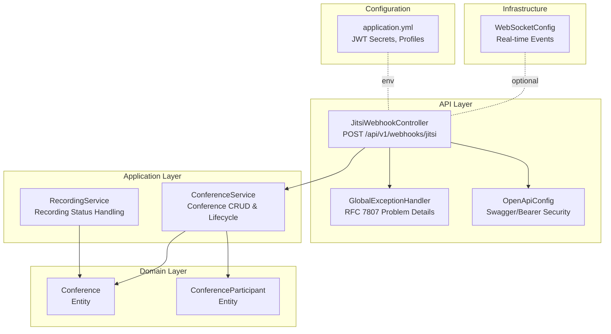
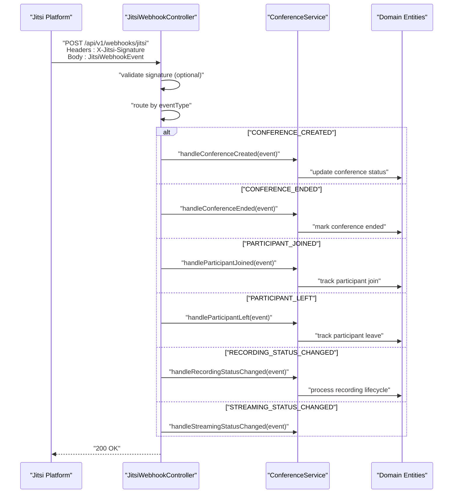
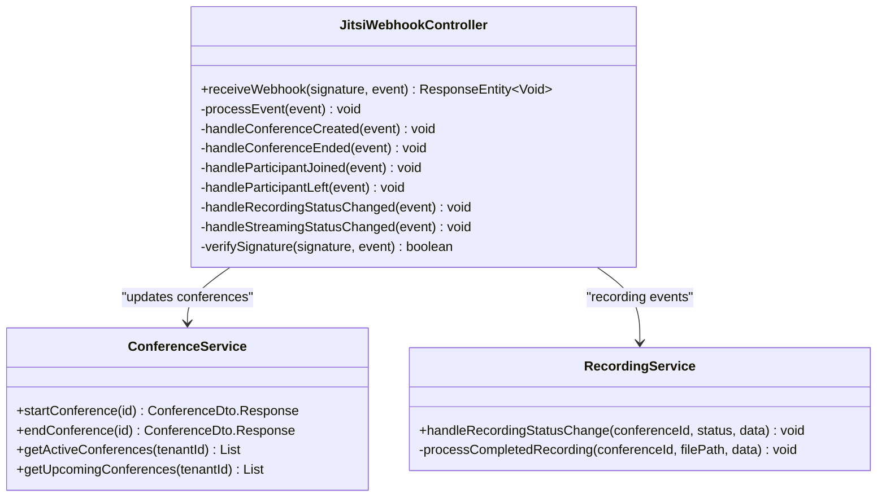
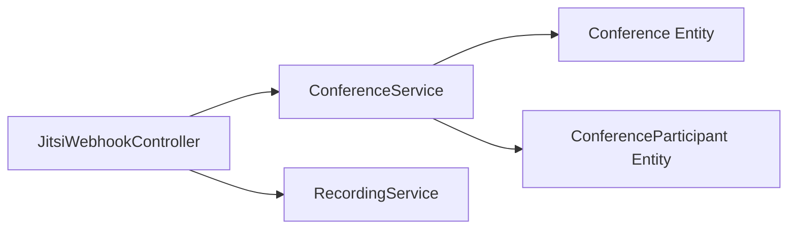

# Jitsi Webhook Integration

<cite>
**Referenced Files in This Document**
- [JitsiWebhookController.java](file://jmp-api/src/main/java/com/jmp/api/controller/JitsiWebhookController.java)
- [ConferenceService.java](file://jmp-application/src/main/java/com/jmp/application/service/ConferenceService.java)
- [RecordingService.java](file://jmp-application/src/main/java/com/jmp/application/service/RecordingService.java)
- [Conference.java](file://jmp-domain/src/main/java/com/jmp/domain/entity/Conference.java)
- [ConferenceParticipant.java](file://jmp-domain/src/main/java/com/jmp/domain/entity/ConferenceParticipant.java)
- [GlobalExceptionHandler.java](file://jmp-api/src/main/java/com/jmp/api/advice/GlobalExceptionHandler.java)
- [OpenApiConfig.java](file://jmp-api/src/main/java/com/jmp/api/config/OpenApiConfig.java)
- [application.yml](file://jmp-web/src/main/resources/application.yml)
- [WebSocketConfig.java](file://jmp-infrastructure/src/main/java/com/jmp/infrastructure/websocket/WebSocketConfig.java)
</cite>

## Table of Contents
1. [Introduction](#introduction)
2. [Project Structure](#project-structure)
3. [Core Components](#core-components)
4. [Architecture Overview](#architecture-overview)
5. [Detailed Component Analysis](#detailed-component-analysis)
6. [Dependency Analysis](#dependency-analysis)
7. [Performance Considerations](#performance-considerations)
8. [Troubleshooting Guide](#troubleshooting-guide)
9. [Conclusion](#conclusion)
10. [Appendices](#appendices)

## Introduction
This document provides comprehensive API documentation for the Jitsi Webhook Integration endpoints within the Jitsi Management Platform. It covers webhook configuration, signature verification, and event processing for conference lifecycle events. It also documents webhook payload schemas for meeting start/end events, participant join/leave events, and recording status updates. Security considerations, including HMAC signature verification, webhook endpoint registration, and event replay protection, are addressed alongside examples of webhook setup, payload validation, and event handling workflows. Error handling for malformed payloads, signature verification failures, and retry mechanisms are included, along with testing procedures and debugging techniques.

## Project Structure
The webhook integration is implemented as a dedicated REST endpoint under the API module. Supporting services and domain entities manage conference lifecycle and participant tracking. Configuration files define JWT secrets and application behavior.

**Diagram sources**
- [JitsiWebhookController.java:24-52](file://jmp-api/src/main/java/com/jmp/api/controller/JitsiWebhookController.java#L24-L52)
- [ConferenceService.java:25-34](file://jmp-application/src/main/java/com/jmp/application/service/ConferenceService.java#L25-L34)
- [RecordingService.java:267-290](file://jmp-application/src/main/java/com/jmp/application/service/RecordingService.java#L267-L290)
- [Conference.java:25-30](file://jmp-domain/src/main/java/com/jmp/domain/entity/Conference.java#L25-L30)
- [ConferenceParticipant.java:47-102](file://jmp-domain/src/main/java/com/jmp/domain/entity/ConferenceParticipant.java#L47-L102)
- [GlobalExceptionHandler.java:22-24](file://jmp-api/src/main/java/com/jmp/api/advice/GlobalExceptionHandler.java#L22-L24)
- [OpenApiConfig.java:20-21](file://jmp-api/src/main/java/com/jmp/api/config/OpenApiConfig.java#L20-L21)
- [application.yml:71-79](file://jmp-web/src/main/resources/application.yml#L71-L79)
- [WebSocketConfig.java:23-27](file://jmp-infrastructure/src/main/java/com/jmp/infrastructure/websocket/WebSocketConfig.java#L23-L27)

**Section sources**
- [JitsiWebhookController.java:24-52](file://jmp-api/src/main/java/com/jmp/api/controller/JitsiWebhookController.java#L24-L52)
- [OpenApiConfig.java:20-54](file://jmp-api/src/main/java/com/jmp/api/config/OpenApiConfig.java#L20-L54)
- [application.yml:71-79](file://jmp-web/src/main/resources/application.yml#L71-L79)

## Core Components
- JitsiWebhookController: Receives webhook events, validates signatures, and routes events to handlers.
- ConferenceService: Manages conference lifecycle operations and integrates with domain entities.
- RecordingService: Processes recording status changes and handles completed recordings.
- Domain Entities: Conference and ConferenceParticipant represent persisted state and lifecycle.
- GlobalExceptionHandler: Provides standardized error responses per RFC 7807.
- OpenApiConfig: Defines Swagger UI and bearer token security scheme for API documentation.
- application.yml: Contains JWT secrets and runtime configuration.

Key responsibilities:
- Endpoint: POST /api/v1/webhooks/jitsi
- Signature header: X-Jitsi-Signature
- Event routing by eventType field
- Validation via Jakarta Bean Validation and Spring’s request binding
- Standardized error responses via GlobalExceptionHandler

**Section sources**
- [JitsiWebhookController.java:33-52](file://jmp-api/src/main/java/com/jmp/api/controller/JitsiWebhookController.java#L33-L52)
- [ConferenceService.java:25-34](file://jmp-application/src/main/java/com/jmp/application/service/ConferenceService.java#L25-L34)
- [RecordingService.java:267-290](file://jmp-application/src/main/java/com/jmp/application/service/RecordingService.java#L267-L290)
- [GlobalExceptionHandler.java:22-128](file://jmp-api/src/main/java/com/jmp/api/advice/GlobalExceptionHandler.java#L22-L128)
- [OpenApiConfig.java:26-53](file://jmp-api/src/main/java/com/jmp/api/config/OpenApiConfig.java#L26-L53)
- [application.yml:71-79](file://jmp-web/src/main/resources/application.yml#L71-L79)

## Architecture Overview
The webhook endpoint accepts events, verifies signatures, and dispatches to event-specific handlers. Handlers currently log events and are intended to update domain entities and trigger downstream actions.

**Diagram sources**
- [JitsiWebhookController.java:33-102](file://jmp-api/src/main/java/com/jmp/api/controller/JitsiWebhookController.java#L33-L102)
- [ConferenceService.java:136-173](file://jmp-application/src/main/java/com/jmp/application/service/ConferenceService.java#L136-L173)
- [RecordingService.java:267-290](file://jmp-application/src/main/java/com/jmp/application/service/RecordingService.java#L267-L290)

## Detailed Component Analysis

### JitsiWebhookController
Responsibilities:
- Exposes POST /api/v1/webhooks/jitsi
- Reads optional X-Jitsi-Signature header
- Validates incoming JitsiWebhookEvent payload
- Routes to handler based on eventType
- Returns 200 OK on successful processing; 401 Unauthorized on signature failure

Payload model (JitsiWebhookEvent):
- eventType: Non-blank string identifying the event type
- roomName: Non-blank string identifying the conference room
- tenantId: Optional identifier for multi-tenant context
- conferenceId: Optional identifier linking to a conference record
- timestamp: Optional instant for event timing
- participant: Optional map containing participant metadata (e.g., id)
- data: Optional map carrying event-specific data (e.g., recording status)

Signature verification:
- verifySignature(signature, event) is present but currently returns true for development
- Production deployments should implement HMAC-SHA256 verification against a shared secret

Event handlers:
- CONFERENCE_CREATED: Log creation; integrate with ConferenceService to update status
- CONFERENCE_ENDED: Log end; update conference status accordingly
- PARTICIPANT_JOINED: Log join; increment participant counts and audit logs
- PARTICIPANT_LEFT: Log leave; decrement participant counts
- RECORDING_STATUS_CHANGED: Log status change; delegate to RecordingService for lifecycle handling
- STREAMING_STATUS_CHANGED: Log streaming status change; integrate with streaming logic

**Diagram sources**
- [JitsiWebhookController.java:29-124](file://jmp-api/src/main/java/com/jmp/api/controller/JitsiWebhookController.java#L29-L124)
- [ConferenceService.java:25-173](file://jmp-application/src/main/java/com/jmp/application/service/ConferenceService.java#L25-L173)
- [RecordingService.java:267-290](file://jmp-application/src/main/java/com/jmp/application/service/RecordingService.java#L267-L290)

**Section sources**
- [JitsiWebhookController.java:33-124](file://jmp-api/src/main/java/com/jmp/api/controller/JitsiWebhookController.java#L33-L124)

### ConferenceService
Responsibilities:
- Create, retrieve, list, search, update, start, end, and delete conferences
- Manage active/upcoming conference queries
- Transactional operations for lifecycle transitions

Integration points:
- startConference marks a scheduled conference as active
- endConference closes an active conference
- Used by webhook handlers to reflect real-time events in persistent state

**Section sources**
- [ConferenceService.java:136-173](file://jmp-application/src/main/java/com/jmp/application/service/ConferenceService.java#L136-L173)

### RecordingService
Responsibilities:
- Processes recording status changes
- Handles recording lifecycle transitions (on/off/failed)
- Completes recording processing by extracting file path and associated metadata

Integration points:
- Called by webhook handlers upon RECORDING_STATUS_CHANGED events
- Persists or updates recording records based on completion

**Section sources**
- [RecordingService.java:267-290](file://jmp-application/src/main/java/com/jmp/application/service/RecordingService.java#L267-L290)

### Domain Entities
Conference:
- Tracks roomName, display name, description, scheduling, and Jitsi options
- Maintains status and timestamps for lifecycle events
- Supports JSON metadata for extensibility

ConferenceParticipant:
- Tracks participant roles, status, join/leave timestamps
- Stores client identifiers and device attributes

These entities underpin webhook-driven state changes and provide audit trails for participant and conference events.

**Section sources**
- [Conference.java:25-132](file://jmp-domain/src/main/java/com/jmp/domain/entity/Conference.java#L25-L132)
- [ConferenceParticipant.java:47-102](file://jmp-domain/src/main/java/com/jmp/domain/entity/ConferenceParticipant.java#L47-L102)

### Payload Schemas

Meeting lifecycle events:
- CONFERENCE_CREATED
  - eventType: "CONFERENCE_CREATED"
  - roomName: string
  - tenantId: string (optional)
  - conferenceId: string (optional)
  - timestamp: ISO instant (optional)
  - participant: object (optional)
  - data: object (optional)

- CONFERENCE_ENDED
  - eventType: "CONFERENCE_ENDED"
  - roomName: string
  - tenantId: string (optional)
  - conferenceId: string (optional)
  - timestamp: ISO instant (optional)
  - participant: object (optional)
  - data: object (optional)

Participant events:
- PARTICIPANT_JOINED
  - eventType: "PARTICIPANT_JOINED"
  - roomName: string
  - tenantId: string (optional)
  - conferenceId: string (optional)
  - timestamp: ISO instant (optional)
  - participant: map with participant metadata (e.g., id)
  - data: object (optional)

- PARTICIPANT_LEFT
  - eventType: "PARTICIPANT_LEFT"
  - roomName: string
  - tenantId: string (optional)
  - conferenceId: string (optional)
  - timestamp: ISO instant (optional)
  - participant: map with participant metadata (e.g., id)
  - data: object (optional)

Recording status updates:
- RECORDING_STATUS_CHANGED
  - eventType: "RECORDING_STATUS_CHANGED"
  - roomName: string
  - tenantId: string (optional)
  - conferenceId: string (optional)
  - timestamp: ISO instant (optional)
  - participant: object (optional)
  - data: map containing status and related fields (e.g., status, path)

Streaming status updates:
- STREAMING_STATUS_CHANGED
  - eventType: "STREAMING_STATUS_CHANGED"
  - roomName: string
  - tenantId: string (optional)
  - conferenceId: string (optional)
  - timestamp: ISO instant (optional)
  - participant: object (optional)
  - data: object (optional)

Validation rules:
- eventType and roomName are required and non-blank
- Additional fields are optional and validated per handler logic

**Section sources**
- [JitsiWebhookController.java:115-123](file://jmp-api/src/main/java/com/jmp/api/controller/JitsiWebhookController.java#L115-L123)

### Security Considerations

HMAC signature verification:
- Header: X-Jitsi-Signature
- Verification logic is present but currently returns true for development
- Production: Implement HMAC-SHA256 verification using a shared secret
- Recommended: Use a deterministic payload canonicalization and compare with the provided signature

Webhook endpoint registration:
- Endpoint: POST /api/v1/webhooks/jitsi
- Configure Jitsi to send events to this URL with the X-Jitsi-Signature header
- Ensure TLS termination occurs at the ingress/load balancer

Event replay protection:
- Implement idempotency keys derived from event metadata
- Store processed event IDs to prevent reprocessing
- Consider deduplication windows and cleanup policies

JWT and API security:
- OpenAPI defines a bearer token security scheme for other endpoints
- Webhook endpoint does not require JWT authentication; rely on signature verification
- Keep JWT secrets secure via environment variables

**Section sources**
- [JitsiWebhookController.java:36-46](file://jmp-api/src/main/java/com/jmp/api/controller/JitsiWebhookController.java#L36-L46)
- [OpenApiConfig.java:47-53](file://jmp-api/src/main/java/com/jmp/api/config/OpenApiConfig.java#L47-L53)
- [application.yml:71-79](file://jmp-web/src/main/resources/application.yml#L71-L79)

### Examples

Webhook setup:
- Configure Jitsi to POST to https://your-host/api/v1/webhooks/jitsi
- Include X-Jitsi-Signature header for production
- Ensure endpoint is reachable and returns 200 OK for valid events

Payload validation:
- Validate presence of eventType and roomName
- Ensure participant.id is present for participant events
- Verify data.status for recording/streaming events

Event handling workflows:
- CONFERENCE_CREATED: Persist or update conference with scheduled status
- CONFERENCE_ENDED: Transition to ended and finalize analytics
- PARTICIPANT_JOINED/LEFT: Update participant counts and audit logs
- RECORDING_STATUS_CHANGED: Start/stop processing based on status; on OFF, process completed recording

Retry mechanisms:
- Jitsi retries failed deliveries; implement idempotent handlers
- Monitor 4xx/5xx responses and investigate signature/validation failures
- Use dead-letter queues or retry backoff for transient errors

**Section sources**
- [JitsiWebhookController.java:33-102](file://jmp-api/src/main/java/com/jmp/api/controller/JitsiWebhookController.java#L33-L102)

## Dependency Analysis
The webhook controller depends on ConferenceService for conference state changes and RecordingService for recording lifecycle management. Domain entities encapsulate persistence and state transitions.

**Diagram sources**
- [JitsiWebhookController.java:31-32](file://jmp-api/src/main/java/com/jmp/api/controller/JitsiWebhookController.java#L31-L32)
- [ConferenceService.java:31-34](file://jmp-application/src/main/java/com/jmp/application/service/ConferenceService.java#L31-L34)
- [RecordingService.java:267-290](file://jmp-application/src/main/java/com/jmp/application/service/RecordingService.java#L267-L290)
- [Conference.java:25-30](file://jmp-domain/src/main/java/com/jmp/domain/entity/Conference.java#L25-L30)
- [ConferenceParticipant.java:47-102](file://jmp-domain/src/main/java/com/jmp/domain/entity/ConferenceParticipant.java#L47-L102)

**Section sources**
- [JitsiWebhookController.java:31-32](file://jmp-api/src/main/java/com/jmp/api/controller/JitsiWebhookController.java#L31-L32)
- [ConferenceService.java:31-34](file://jmp-application/src/main/java/com/jmp/application/service/ConferenceService.java#L31-L34)

## Performance Considerations
- Asynchronous processing: Offload heavy operations (e.g., storage uploads) to async tasks or message queues
- Idempotency: Ensure handlers are idempotent to support retries without side effects
- Batch updates: Group participant count updates to reduce database writes
- Caching: Cache tenant/conference metadata to minimize repeated lookups
- Monitoring: Track webhook throughput, latency, and error rates

## Troubleshooting Guide
Common issues and resolutions:
- 401 Unauthorized: Indicates signature verification failure. Verify shared secret and payload canonicalization
- 400 Bad Request: Validation errors for missing or invalid fields. Confirm eventType, roomName, and participant.id
- 409 Conflict: Illegal state transitions (e.g., ending a non-active conference). Align webhook events with expected lifecycle
- 500 Internal Server Error: Unexpected exceptions. Check GlobalExceptionHandler-provided Problem Details for error codes and timestamps

Debugging techniques:
- Enable debug logging for com.jmp to capture detailed webhook processing
- Inspect request headers (X-Jitsi-Signature) and body payloads
- Verify JWT secrets and profile configuration in application.yml
- Use actuator endpoints for health and metrics visibility

**Section sources**
- [GlobalExceptionHandler.java:26-128](file://jmp-api/src/main/java/com/jmp/api/advice/GlobalExceptionHandler.java#L26-L128)
- [application.yml:80-112](file://jmp-web/src/main/resources/application.yml#L80-L112)

## Conclusion
The Jitsi Webhook Integration provides a robust foundation for processing conference lifecycle events, participant actions, and recording updates. While signature verification is currently disabled for development, production deployments must implement HMAC-SHA256 verification and incorporate replay protection. By leveraging ConferenceService and RecordingService, the platform can maintain accurate, auditable state synchronized with real-time events from Jitsi.

## Appendices

### API Definition
- Method: POST
- Path: /api/v1/webhooks/jitsi
- Headers:
  - X-Jitsi-Signature: Required in production for HMAC verification
- Body: JitsiWebhookEvent (see Payload Schemas)
- Responses:
  - 200 OK: Event processed successfully
  - 400 Bad Request: Malformed or invalid payload
  - 401 Unauthorized: Signature verification failed
  - 409 Conflict: Illegal state transition
  - 500 Internal Server Error: Unexpected error

### Testing Procedures
- Unit tests: Validate payload parsing and handler routing
- Integration tests: Simulate webhook delivery with signed payloads
- Load tests: Measure throughput under high event volume
- Replay tests: Confirm idempotency and deduplication behavior

### Security Checklist
- Implement HMAC-SHA256 signature verification
- Enforce TLS for webhook endpoints
- Use unique shared secrets per tenant/environment
- Monitor and alert on signature verification failures
- Apply rate limiting and IP allowlists at the ingress