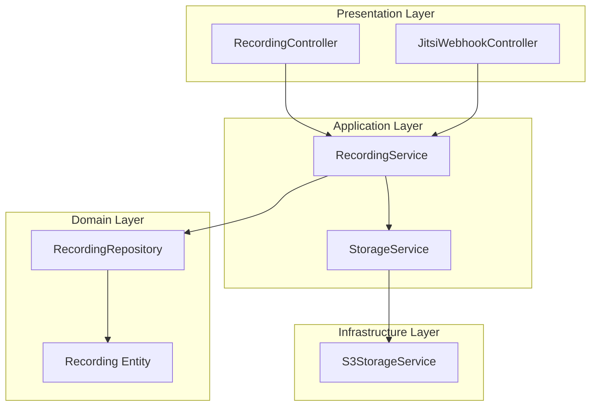
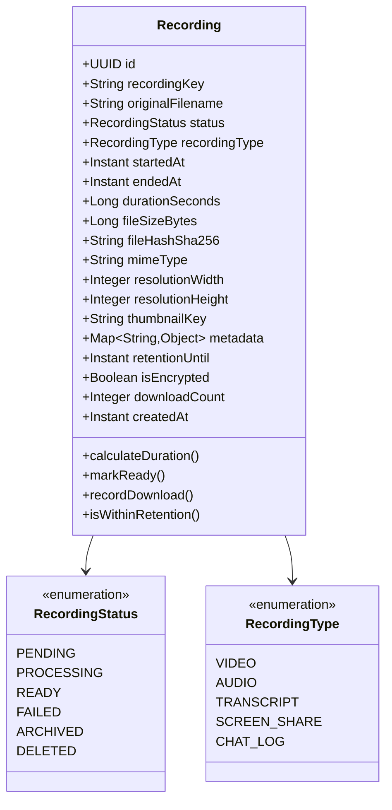
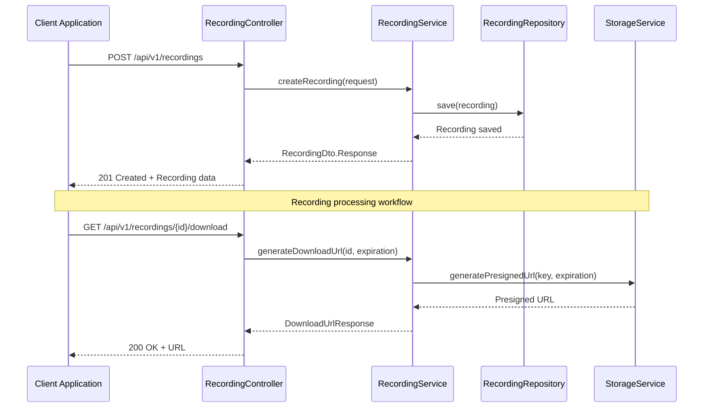
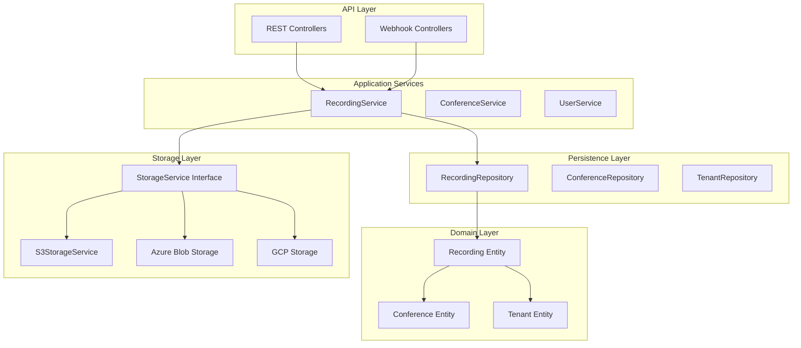
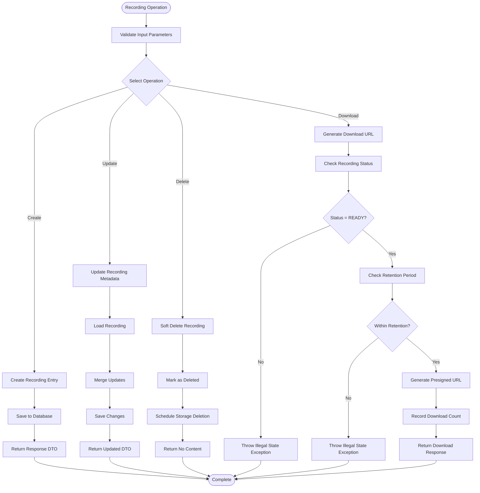
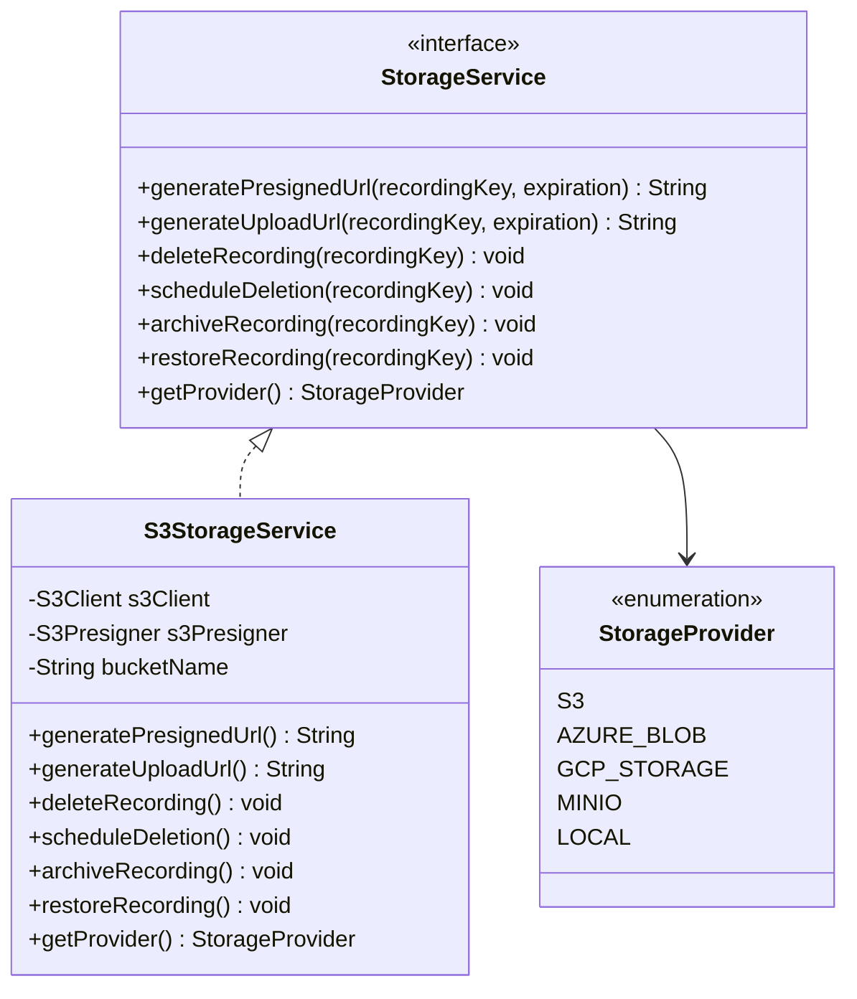
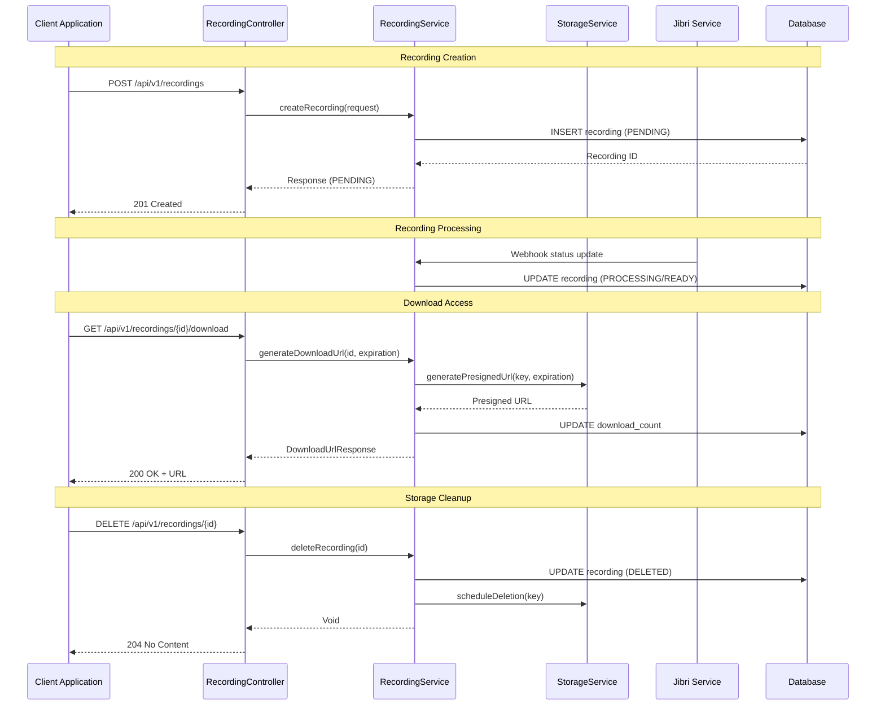

# Recording Management API

<cite>
**Referenced Files in This Document**
- [RecordingController.java](file://jmp-api/src/main/java/com/jmp/api/controller/RecordingController.java)
- [RecordingService.java](file://jmp-application/src/main/java/com/jmp/application/service/RecordingService.java)
- [RecordingDto.java](file://jmp-application/src/main/java/com/jmp/application/dto/RecordingDto.java)
- [Recording.java](file://jmp-domain/src/main/java/com/jmp/domain/entity/Recording.java)
- [RecordingRepository.java](file://jmp-domain/src/main/java/com/jmp/domain/repository/RecordingRepository.java)
- [StorageService.java](file://jmp-application/src/main/java/com/jmp/application/service/StorageService.java)
- [S3StorageService.java](file://jmp-infrastructure/src/main/java/com/jmp/infrastructure/storage/S3StorageService.java)
- [JitsiWebhookController.java](file://jmp-api/src/main/java/com/jmp/api/controller/JitsiWebhookController.java)
- [GlobalExceptionHandler.java](file://jmp-api/src/main/java/com/jmp/api/advice/GlobalExceptionHandler.java)
</cite>

## Table of Contents
1. [Introduction](#introduction)
2. [Project Structure](#project-structure)
3. [Core Components](#core-components)
4. [Architecture Overview](#architecture-overview)
5. [Detailed Component Analysis](#detailed-component-analysis)
6. [API Reference](#api-reference)
7. [Recording Lifecycle](#recording-lifecycle)
8. [Storage Management](#storage-management)
9. [Pagination and Filtering](#pagination-and-filtering)
10. [Error Handling](#error-handling)
11. [Performance Considerations](#performance-considerations)
12. [Troubleshooting Guide](#troubleshooting-guide)
13. [Conclusion](#conclusion)

## Introduction

The Recording Management API provides comprehensive functionality for managing conference recordings within the Jitsi Meeting Platform (JMP). This system handles the complete lifecycle of recordings from initiation through processing, storage, and retrieval. The API supports multiple recording types including video, audio, transcripts, screen shares, and chat logs, with integrated storage management and security controls.

The system follows modern API design principles with RESTful endpoints, standardized error handling, and comprehensive role-based access control. It integrates with cloud storage providers through a pluggable storage service architecture, currently supporting Amazon S3 and compatible storage systems.

## Project Structure

The recording management system is organized across four main layers following clean architecture principles:



**Diagram sources**
- [RecordingController.java:1-138](file://jmp-api/src/main/java/com/jmp/api/controller/RecordingController.java#L1-L138)
- [RecordingService.java:1-332](file://jmp-application/src/main/java/com/jmp/application/service/RecordingService.java#L1-L332)
- [Recording.java:1-203](file://jmp-domain/src/main/java/com/jmp/domain/entity/Recording.java#L1-L203)

**Section sources**
- [RecordingController.java:1-138](file://jmp-api/src/main/java/com/jmp/api/controller/RecordingController.java#L1-L138)
- [RecordingService.java:1-332](file://jmp-application/src/main/java/com/jmp/application/service/RecordingService.java#L1-L332)

## Core Components

### Recording Entity Model

The Recording entity serves as the central data model representing conference recordings with comprehensive metadata and state management.



**Diagram sources**
- [Recording.java:29-203](file://jmp-domain/src/main/java/com/jmp/domain/entity/Recording.java#L29-L203)

### Service Layer Architecture

The RecordingService orchestrates all recording operations, maintaining transaction boundaries and coordinating between repositories and storage services.



**Diagram sources**
- [RecordingController.java:45-53](file://jmp-api/src/main/java/com/jmp/api/controller/RecordingController.java#L45-L53)
- [RecordingService.java:42-72](file://jmp-application/src/main/java/com/jmp/application/service/RecordingService.java#L42-L72)
- [RecordingService.java:141-170](file://jmp-application/src/main/java/com/jmp/application/service/RecordingService.java#L141-L170)

**Section sources**
- [Recording.java:1-203](file://jmp-domain/src/main/java/com/jmp/domain/entity/Recording.java#L1-L203)
- [RecordingService.java:1-332](file://jmp-application/src/main/java/com/jmp/application/service/RecordingService.java#L1-L332)

## Architecture Overview

The Recording Management API follows a layered architecture pattern with clear separation of concerns:



**Diagram sources**
- [RecordingController.java:1-138](file://jmp-api/src/main/java/com/jmp/api/controller/RecordingController.java#L1-L138)
- [RecordingService.java:1-332](file://jmp-application/src/main/java/com/jmp/application/service/RecordingService.java#L1-L332)
- [StorageService.java:1-56](file://jmp-application/src/main/java/com/jmp/application/service/StorageService.java#L1-L56)

## Detailed Component Analysis

### Recording Controller

The RecordingController exposes REST endpoints for recording management operations with comprehensive security and validation:

| Endpoint | Method | Description | Authentication |
|----------|--------|-------------|----------------|
| `/api/v1/recordings` | POST | Create recording entry | MODERATOR, TENANT_ADMIN, SUPER_ADMIN |
| `/api/v1/recordings/{id}` | GET | Get recording by ID | PARTICIPANT, MODERATOR, TENANT_ADMIN, SUPER_ADMIN |
| `/api/v1/recordings` | GET | List recordings with pagination | PARTICIPANT, MODERATOR, TENANT_ADMIN, SUPER_ADMIN |
| `/api/v1/recordings/conference/{conferenceId}` | GET | Get recordings for conference | PARTICIPANT, MODERATOR, TENANT_ADMIN, SUPER_ADMIN |
| `/api/v1/recordings/{id}/download` | GET | Generate download URL | PARTICIPANT, MODERATOR, TENANT_ADMIN, SUPER_ADMIN |
| `/api/v1/recordings/{id}` | PUT | Update recording metadata | MODERATOR, TENANT_ADMIN, SUPER_ADMIN |
| `/api/v1/recordings/{id}` | DELETE | Delete recording | MODERATOR, TENANT_ADMIN, SUPER_ADMIN |
| `/api/v1/recordings/stats/storage` | GET | Get storage statistics | TENANT_ADMIN, SUPER_ADMIN |

**Section sources**
- [RecordingController.java:1-138](file://jmp-api/src/main/java/com/jmp/api/controller/RecordingController.java#L1-L138)

### Recording Service Operations

The RecordingService implements core business logic with transactional boundaries and comprehensive error handling:



**Diagram sources**
- [RecordingService.java:42-72](file://jmp-application/src/main/java/com/jmp/application/service/RecordingService.java#L42-L72)
- [RecordingService.java:141-170](file://jmp-application/src/main/java/com/jmp/application/service/RecordingService.java#L141-L170)
- [RecordingService.java:197-212](file://jmp-application/src/main/java/com/jmp/application/service/RecordingService.java#L197-L212)

**Section sources**
- [RecordingService.java:1-332](file://jmp-application/src/main/java/com/jmp/application/service/RecordingService.java#L1-L332)

### Storage Service Integration

The storage abstraction layer provides a unified interface for multiple storage providers:



**Diagram sources**
- [StorageService.java:9-56](file://jmp-application/src/main/java/com/jmp/application/service/StorageService.java#L9-L56)
- [S3StorageService.java:26-129](file://jmp-infrastructure/src/main/java/com/jmp/infrastructure/storage/S3StorageService.java#L26-L129)

**Section sources**
- [StorageService.java:1-56](file://jmp-application/src/main/java/com/jmp/application/service/StorageService.java#L1-L56)
- [S3StorageService.java:1-129](file://jmp-infrastructure/src/main/java/com/jmp/infrastructure/storage/S3StorageService.java#L1-L129)

## API Reference

### Base URL
`https://your-domain.com/api/v1`

### Authentication
All endpoints require Bearer Token authentication via JWT. The token must contain tenant information in the authentication details.

### Authorization Roles
- **PARTICIPANT**: View recordings, generate download URLs
- **MODERATOR**: All participant permissions plus manage recordings
- **TENANT_ADMIN**: All moderator permissions plus tenant-level management
- **SUPER_ADMIN**: Full system administration access

### Common Response Headers
- `Content-Type: application/json`
- `Authorization: Bearer <token>`

### Error Response Format
All error responses follow RFC 7807 Problem Details format:

```json
{
  "type": "about:blank",
  "title": "Error Title",
  "status": 400,
  "detail": "Error message",
  "instance": "/api/v1/recordings",
  "timestamp": "2024-01-01T00:00:00Z",
  "errorCode": "ERROR_CODE"
}
```

**Section sources**
- [GlobalExceptionHandler.java:1-130](file://jmp-api/src/main/java/com/jmp/api/advice/GlobalExceptionHandler.java#L1-L130)

## Recording Lifecycle

### Complete Recording Workflow



**Diagram sources**
- [RecordingController.java:45-53](file://jmp-api/src/main/java/com/jmp/api/controller/RecordingController.java#L45-L53)
- [RecordingService.java:141-170](file://jmp-application/src/main/java/com/jmp/application/service/RecordingService.java#L141-L170)
- [RecordingService.java:197-212](file://jmp-application/src/main/java/com/jmp/application/service/RecordingService.java#L197-L212)

### Recording States and Transitions

| State | Description | Allowed Operations | Next States |
|-------|-------------|-------------------|-------------|
| **PENDING** | Recording initiated | View, Update Metadata | PROCESSING, FAILED, DELETED |
| **PROCESSING** | Being processed/transcoded | View | READY, FAILED, DELETED |
| **READY** | Available for download | View, Download, Update | ARCHIVED, DELETED |
| **FAILED** | Recording failed | View | DELETED |
| **ARCHIVED** | Moved to cold storage | View | READY, DELETED |
| **DELETED** | Soft deleted | View | None |

**Section sources**
- [Recording.java:186-201](file://jmp-domain/src/main/java/com/jmp/domain/entity/Recording.java#L186-L201)

## Storage Management

### Storage Provider Integration

The system supports multiple storage providers through a unified interface:

| Provider | Configuration Properties | Features |
|----------|-------------------------|----------|
| **Amazon S3** | `jmp.storage.s3.bucket`, `jmp.storage.s3.region`, `jmp.storage.s3.access-key`, `jmp.storage.s3.secret-key`, `jmp.storage.s3.endpoint` | Presigned URLs, Lifecycle policies, Cross-region replication |
| **Azure Blob** | `jmp.storage.azure.container`, `jmp.storage.azure.connection-string` | Shared access signatures, Blob containers, Hierarchical namespaces |
| **Google Cloud Storage** | `jmp.storage.gcs.bucket`, `jmp.storage.gcs.credentials` | Signed URLs, Versioning, Multi-regional storage |
| **MinIO** | `jmp.storage.minio.bucket`, `jmp.storage.minio.endpoint` | S3-compatible, Self-hosted, Distributed storage |
| **Local Storage** | `jmp.storage.local.path` | File system, Development testing, Local caching |

### Storage Statistics

The system provides comprehensive storage analytics:

```json
{
  "totalStorageBytes": 1234567890,
  "totalRecordings": 42,
  "recordingsThisMonth": 5
}
```

**Section sources**
- [StorageService.java:48-54](file://jmp-application/src/main/java/com/jmp/application/service/StorageService.java#L48-L54)
- [RecordingService.java:217-234](file://jmp-application/src/main/java/com/jmp/application/service/RecordingService.java#L217-L234)

## Pagination and Filtering

### List Recordings Endpoint

The `/api/v1/recordings` endpoint supports comprehensive pagination and filtering:

**Query Parameters:**
- `page` (optional): Page number (default: 0)
- `size` (optional): Page size (default: 20, max: 100)
- `sort` (optional): Sort field (createdAt, originalFilename, status)
- `direction` (optional): Sort direction (ASC, DESC)
- `search` (optional): Search term for filename or conference name

**Response Structure:**
```json
{
  "content": [
    {
      "id": "uuid",
      "originalFilename": "string",
      "status": "READY",
      "recordingType": "VIDEO",
      "conferenceName": "string",
      "durationSeconds": 1800,
      "fileSizeBytes": 123456789,
      "createdAt": "2024-01-01T00:00:00Z"
    }
  ],
  "pageable": {
    "sort": {"sorted": true, "unsorted": false},
    "pageNumber": 0,
    "pageSize": 20,
    "offset": 0,
    "paged": true,
    "unpaged": false
  },
  "totalElements": 100,
  "totalPages": 5,
  "number": 0,
  "size": 20,
  "sort": {"sorted": true, "unsorted": false},
  "first": true,
  "last": false,
  "numberOfElements": 20,
  "empty": false
}
```

**Section sources**
- [RecordingController.java:62-80](file://jmp-api/src/main/java/com/jmp/api/controller/RecordingController.java#L62-L80)
- [RecordingRepository.java:53-60](file://jmp-domain/src/main/java/com/jmp/domain/repository/RecordingRepository.java#L53-L60)

### Conference-Specific Queries

The `/api/v1/recordings/conference/{conferenceId}` endpoint provides filtered access to conference-related recordings:

**Response:** Array of Recording Summary objects containing essential metadata for quick access.

**Section sources**
- [RecordingController.java:82-89](file://jmp-api/src/main/java/com/jmp/api/controller/RecordingController.java#L82-L89)
- [RecordingRepository.java:29-30](file://jmp-domain/src/main/java/com/jmp/domain/repository/RecordingRepository.java#L29-L30)

## Error Handling

### Common Error Scenarios

| Error Code | HTTP Status | Error Type | Description | Resolution |
|------------|-------------|------------|-------------|------------|
| `INVALID_ARGUMENT` | 400 | Validation | Invalid input parameters | Fix request payload according to schema |
| `VALIDATION_ERROR` | 400 | Validation | Request validation failed | Correct field values and formats |
| `STATE_CONFLICT` | 409 | Business Logic | Recording not ready for operation | Wait for processing completion or check status |
| `ACCESS_DENIED` | 403 | Authorization | Insufficient permissions | Verify user roles and tenant membership |
| `AUTHENTICATION_FAILED` | 401 | Authentication | Invalid or missing credentials | Provide valid JWT token |
| `INTERNAL_ERROR` | 500 | System | Unexpected server error | Retry operation or contact support |

### Error Response Structure

```json
{
  "type": "about:blank",
  "title": "Bad Request",
  "status": 400,
  "detail": "Conference not found: 123e4567-e89b-12d3-a456-426614174000",
  "instance": "/api/v1/recordings",
  "timestamp": "2024-01-01T00:00:00Z",
  "errorCode": "INVALID_ARGUMENT"
}
```

**Section sources**
- [GlobalExceptionHandler.java:26-128](file://jmp-api/src/main/java/com/jmp/api/advice/GlobalExceptionHandler.java#L26-L128)

## Performance Considerations

### Caching Strategy

- **Entity Caching:** Recording entities cached with TTL of 30 seconds for frequently accessed data
- **Query Results:** Pagination results cached for 1 minute to reduce database load
- **Storage URLs:** Presigned URLs cached for their expiration period minus 5 minutes

### Database Optimization

- **Indexing:** Composite indexes on `(tenant_id, status, created_at)` and `(conference_id, deleted_at)`
- **Pagination:** Efficient LIMIT/OFFSET queries with proper indexing
- **JSON Fields:** PostgreSQL JSONB columns for flexible metadata storage

### Storage Performance

- **Presigned URLs:** Generated client-side to avoid server bandwidth limitations
- **Concurrent Access:** S3 client configured with connection pooling
- **Async Operations:** Storage deletions performed asynchronously to avoid blocking requests

## Troubleshooting Guide

### Common Issues and Solutions

**Issue:** Recording shows as PENDING after processing completes
- **Cause:** Jibri webhook not received or processing failed
- **Solution:** Check webhook endpoint connectivity and verify Jibri configuration

**Issue:** Download URL generation fails with "Recording not ready"
- **Cause:** Recording status not set to READY
- **Solution:** Wait for processing completion or manually update status

**Issue:** Storage deletion not occurring
- **Cause:** Storage service configuration issues
- **Solution:** Verify storage provider credentials and bucket permissions

**Issue:** Exceeded retention period errors
- **Cause:** Recording exceeded configured retention limit
- **Solution:** Contact administrator to extend retention or reprocess recording

### Monitoring and Debugging

**Logging Levels:**
- **INFO:** Successful operations and state transitions
- **WARN:** Validation warnings and potential issues
- **ERROR:** Processing failures and system errors

**Key Log Messages:**
- "Recording created with ID: {id}" - Successful creation
- "Recording marked as ready: {id}" - Processing completion
- "Generated download URL for recording: {id}" - Download URL creation
- "Archiving expired recording: {id}" - Automatic cleanup

**Section sources**
- [RecordingService.java:240-258](file://jmp-application/src/main/java/com/jmp/application/service/RecordingService.java#L240-L258)

## Conclusion

The Recording Management API provides a robust, scalable solution for conference recording operations with comprehensive features for creation, management, storage, and retrieval. The system's layered architecture ensures maintainability and extensibility while the pluggable storage service enables deployment flexibility across different cloud providers.

Key strengths include:
- **Comprehensive Lifecycle Management:** From initiation through archival
- **Flexible Storage Integration:** Multiple provider support with unified interface
- **Robust Error Handling:** Standardized error responses and validation
- **Performance Optimization:** Caching, indexing, and asynchronous operations
- **Security Controls:** Role-based access and tenant isolation

The API follows industry standards and provides extensive documentation for developers integrating recording functionality into their applications.