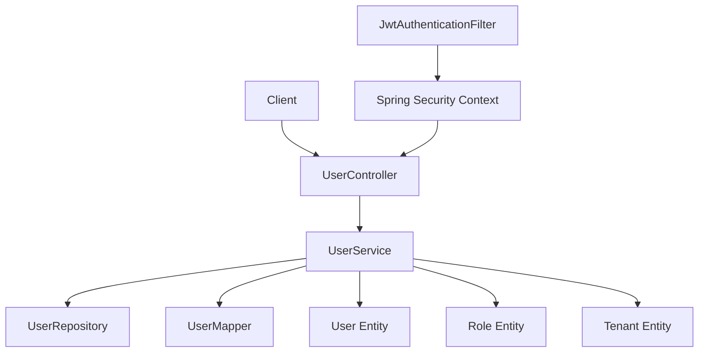
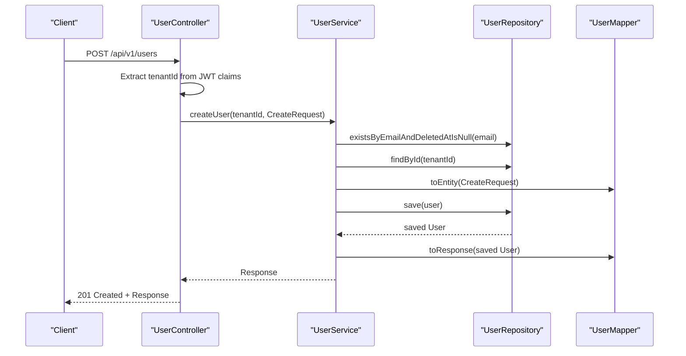
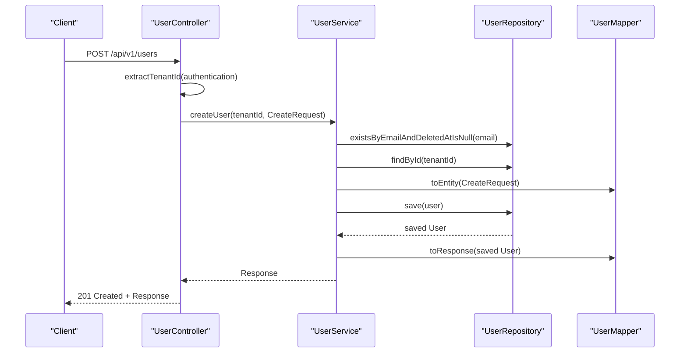
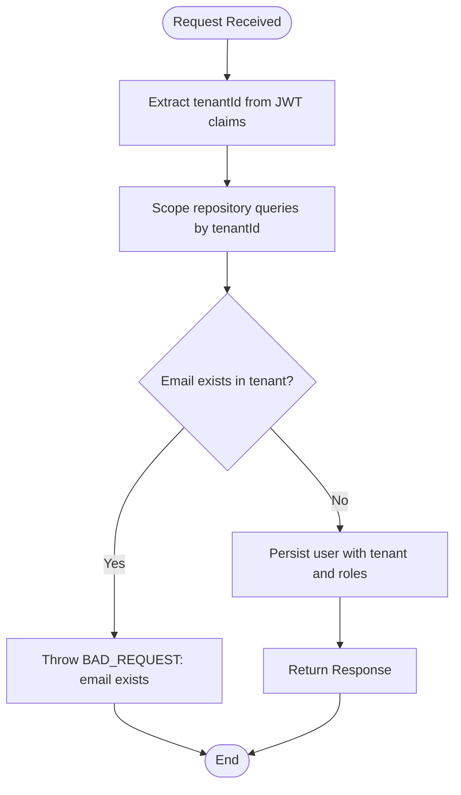
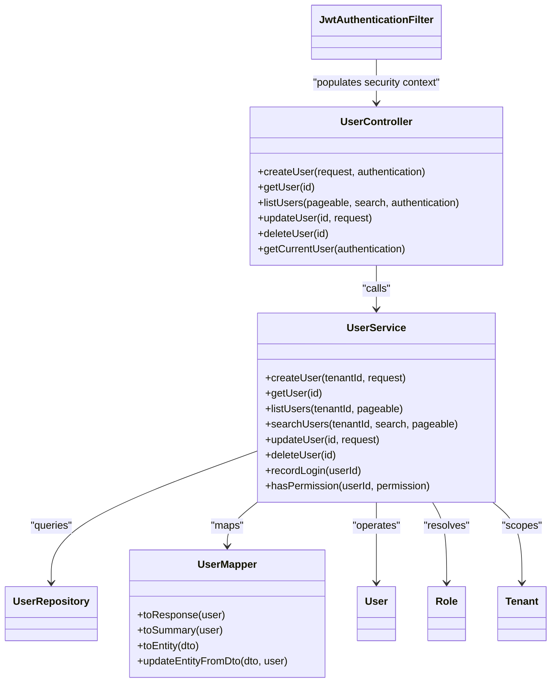

# User Management API

<cite>
**Referenced Files in This Document**
- [UserController.java](file://jmp-api/src/main/java/com/jmp/api/controller/UserController.java)
- [UserService.java](file://jmp-application/src/main/java/com/jmp/application/service/UserService.java)
- [UserDto.java](file://jmp-application/src/main/java/com/jmp/application/dto/UserDto.java)
- [UserMapper.java](file://jmp-application/src/main/java/com/jmp/application/mapper/UserMapper.java)
- [UserRepository.java](file://jmp-domain/src/main/java/com/jmp/domain/repository/UserRepository.java)
- [User.java](file://jmp-domain/src/main/java/com/jmp/domain/entity/User.java)
- [Role.java](file://jmp-domain/src/main/java/com/jmp/domain/entity/Role.java)
- [Tenant.java](file://jmp-domain/src/main/java/com/jmp/domain/entity/Tenant.java)
- [JwtAuthenticationFilter.java](file://jmp-infrastructure/src/main/java/com/jmp/infrastructure/security/JwtAuthenticationFilter.java)
- [GlobalExceptionHandler.java](file://jmp-api/src/main/java/com/jmp/api/advice/GlobalExceptionHandler.java)
</cite>

## Table of Contents
1. [Introduction](#introduction)
2. [Project Structure](#project-structure)
3. [Core Components](#core-components)
4. [Architecture Overview](#architecture-overview)
5. [Detailed Component Analysis](#detailed-component-analysis)
6. [Dependency Analysis](#dependency-analysis)
7. [Performance Considerations](#performance-considerations)
8. [Troubleshooting Guide](#troubleshooting-guide)
9. [Conclusion](#conclusion)
10. [Appendices](#appendices)

## Introduction
This document provides comprehensive API documentation for User Management endpoints. It covers:
- CRUD operations: create, retrieve, update, delete
- Tenant scoping and isolation
- Role assignment and permission checks
- User status management
- Request/response schemas and validation rules
- Pagination, sorting, and search
- Error handling patterns

The API is secured via bearer tokens and enforces role-based access control (RBAC) with tenant-aware authorization.

## Project Structure
The User Management feature spans four layers:
- API Layer: REST endpoints exposed by the controller
- Application Layer: Business logic and orchestration
- Domain Layer: Entities, repositories, and value objects
- Infrastructure Layer: Security filters and JWT integration

**Diagram sources**
- [UserController.java:33-123](file://jmp-api/src/main/java/com/jmp/api/controller/UserController.java#L33-L123)
- [UserService.java:28-190](file://jmp-application/src/main/java/com/jmp/application/service/UserService.java#L28-L190)
- [UserRepository.java:18-82](file://jmp-domain/src/main/java/com/jmp/domain/repository/UserRepository.java#L18-L82)
- [UserMapper.java:18-76](file://jmp-application/src/main/java/com/jmp/application/mapper/UserMapper.java#L18-L76)
- [User.java:23-164](file://jmp-domain/src/main/java/com/jmp/domain/entity/User.java#L23-L164)
- [Role.java:22-131](file://jmp-domain/src/main/java/com/jmp/domain/entity/Role.java#L22-L131)
- [Tenant.java:24-174](file://jmp-domain/src/main/java/com/jmp/domain/entity/Tenant.java#L24-L174)
- [JwtAuthenticationFilter.java:27-122](file://jmp-infrastructure/src/main/java/com/jmp/infrastructure/security/JwtAuthenticationFilter.java#L27-L122)

**Section sources**
- [UserController.java:33-123](file://jmp-api/src/main/java/com/jmp/api/controller/UserController.java#L33-L123)
- [UserService.java:28-190](file://jmp-application/src/main/java/com/jmp/application/service/UserService.java#L28-L190)
- [UserRepository.java:18-82](file://jmp-domain/src/main/java/com/jmp/domain/repository/UserRepository.java#L18-L82)
- [UserMapper.java:18-76](file://jmp-application/src/main/java/com/jmp/application/mapper/UserMapper.java#L18-L76)
- [User.java:23-164](file://jmp-domain/src/main/java/com/jmp/domain/entity/User.java#L23-L164)
- [Role.java:22-131](file://jmp-domain/src/main/java/com/jmp/domain/entity/Role.java#L22-L131)
- [Tenant.java:24-174](file://jmp-domain/src/main/java/com/jmp/domain/entity/Tenant.java#L24-L174)
- [JwtAuthenticationFilter.java:27-122](file://jmp-infrastructure/src/main/java/com/jmp/infrastructure/security/JwtAuthenticationFilter.java#L27-L122)

## Core Components
- UserController: Exposes REST endpoints for user management under /api/v1/users. Enforces method-level security and extracts tenant/user IDs from JWT claims.
- UserService: Implements business logic for user creation, retrieval, listing, searching, updates, and soft deletion. Handles role resolution and tenant scoping.
- DTOs: Sealed interface defining CreateRequest, UpdateRequest, Response, and Summary DTOs with validation constraints.
- Mappers: Mapstruct-based mapping between entities and DTOs, including role name conversion.
- Repositories and Entities: JPA repositories and JPA entities for User, Role, and Tenant with tenant isolation and role-permission relationships.

**Section sources**
- [UserController.java:33-123](file://jmp-api/src/main/java/com/jmp/api/controller/UserController.java#L33-L123)
- [UserService.java:28-190](file://jmp-application/src/main/java/com/jmp/application/service/UserService.java#L28-L190)
- [UserDto.java:14-97](file://jmp-application/src/main/java/com/jmp/application/dto/UserDto.java#L14-L97)
- [UserMapper.java:18-76](file://jmp-application/src/main/java/com/jmp/application/mapper/UserMapper.java#L18-L76)
- [UserRepository.java:18-82](file://jmp-domain/src/main/java/com/jmp/domain/repository/UserRepository.java#L18-L82)
- [User.java:23-164](file://jmp-domain/src/main/java/com/jmp/domain/entity/User.java#L23-L164)
- [Role.java:22-131](file://jmp-domain/src/main/java/com/jmp/domain/entity/Role.java#L22-L131)
- [Tenant.java:24-174](file://jmp-domain/src/main/java/com/jmp/domain/entity/Tenant.java#L24-L174)

## Architecture Overview
The User Management API follows a layered architecture:
- API Layer validates requests and delegates to the service layer.
- Service Layer orchestrates repository access, applies tenant scoping, resolves roles, and manages transactions.
- Domain Layer encapsulates business rules, tenant isolation, and RBAC.
- Infrastructure Layer authenticates requests via JWT and populates security context.

**Diagram sources**
- [UserController.java:43-55](file://jmp-api/src/main/java/com/jmp/api/controller/UserController.java#L43-L55)
- [UserService.java:44-70](file://jmp-application/src/main/java/com/jmp/application/service/UserService.java#L44-L70)
- [UserRepository.java:42-48](file://jmp-domain/src/main/java/com/jmp/domain/repository/UserRepository.java#L42-L48)
- [UserMapper.java:46-26](file://jmp-application/src/main/java/com/jmp/application/mapper/UserMapper.java#L46-L26)

**Section sources**
- [UserController.java:33-123](file://jmp-api/src/main/java/com/jmp/api/controller/UserController.java#L33-L123)
- [UserService.java:28-190](file://jmp-application/src/main/java/com/jmp/application/service/UserService.java#L28-L190)
- [UserRepository.java:18-82](file://jmp-domain/src/main/java/com/jmp/domain/repository/UserRepository.java#L18-L82)
- [UserMapper.java:18-76](file://jmp-application/src/main/java/com/jmp/application/mapper/UserMapper.java#L18-L76)

## Detailed Component Analysis

### Endpoints

#### Create User
- Method: POST
- Path: /api/v1/users
- Auth: Bearer, requires TENANT_ADMIN or SUPER_ADMIN
- Request body: CreateRequest
- Response: 201 Created + Response
- Behavior:
  - Validates email uniqueness per tenant
  - Assigns default PARTICIPANT role if none provided
  - Sets initial status to ACTIVE and emailVerified to false
  - Stores password hash after encoding

**Diagram sources**
- [UserController.java:43-55](file://jmp-api/src/main/java/com/jmp/api/controller/UserController.java#L43-L55)
- [UserService.java:44-70](file://jmp-application/src/main/java/com/jmp/application/service/UserService.java#L44-L70)
- [UserRepository.java:42-48](file://jmp-domain/src/main/java/com/jmp/domain/repository/UserRepository.java#L42-L48)
- [UserMapper.java:46-26](file://jmp-application/src/main/java/com/jmp/application/mapper/UserMapper.java#L46-L26)

**Section sources**
- [UserController.java:43-55](file://jmp-api/src/main/java/com/jmp/api/controller/UserController.java#L43-L55)
- [UserService.java:44-70](file://jmp-application/src/main/java/com/jmp/application/service/UserService.java#L44-L70)
- [UserDto.java:30-44](file://jmp-application/src/main/java/com/jmp/application/dto/UserDto.java#L30-L44)
- [UserRepository.java:42-48](file://jmp-domain/src/main/java/com/jmp/domain/repository/UserRepository.java#L42-L48)

#### Get User by ID
- Method: GET
- Path: /api/v1/users/{id}
- Auth: Bearer, requires TENANT_ADMIN, SUPER_ADMIN, or self (isCurrentUser)
- Response: 200 OK + Response
- Notes: Returns user with roles and tenant association

**Section sources**
- [UserController.java:57-62](file://jmp-api/src/main/java/com/jmp/api/controller/UserController.java#L57-L62)
- [UserService.java:75-79](file://jmp-application/src/main/java/com/jmp/application/service/UserService.java#L75-L79)

#### List Users (with optional search)
- Method: GET
- Path: /api/v1/users
- Auth: Bearer, requires TENANT_ADMIN or SUPER_ADMIN
- Query params:
  - page, size, sort (Spring Data Pageable)
  - search: free-text search by email, first_name, last_name
- Response: 200 OK + Page

- Behavior:
  - If search is present, performs text search scoped to tenant
  - Otherwise lists users scoped to tenant

**Section sources**
- [UserController.java:64-82](file://jmp-api/src/main/java/com/jmp/api/controller/UserController.java#L64-L82)
- [UserService.java:94-105](file://jmp-application/src/main/java/com/jmp/application/service/UserService.java#L94-L105)
- [UserRepository.java:47-60](file://jmp-domain/src/main/java/com/jmp/domain/repository/UserRepository.java#L47-L60)

#### Update User
- Method: PUT
- Path: /api/v1/users/{id}
- Auth: Bearer, requires TENANT_ADMIN, SUPER_ADMIN, or self (isCurrentUser)
- Request body: UpdateRequest
- Response: 200 OK + Response
- Behavior:
  - Updates profile fields
  - Optionally updates roles for the user’s tenant
  - Roles not provided are not changed

**Section sources**
- [UserController.java:84-92](file://jmp-api/src/main/java/com/jmp/api/controller/UserController.java#L84-L92)
- [UserService.java:110-129](file://jmp-application/src/main/java/com/jmp/application/service/UserService.java#L110-L129)
- [UserDto.java:49-62](file://jmp-application/src/main/java/com/jmp/application/dto/UserDto.java#L49-L62)

#### Delete User
- Method: DELETE
- Path: /api/v1/users/{id}
- Auth: Bearer, requires TENANT_ADMIN or SUPER_ADMIN
- Response: 204 No Content
- Behavior: Soft deletes user by setting deletedAt and status

**Section sources**
- [UserController.java:94-100](file://jmp-api/src/main/java/com/jmp/api/controller/UserController.java#L94-L100)
- [UserService.java:134-145](file://jmp-application/src/main/java/com/jmp/application/service/UserService.java#L134-L145)
- [User.java:112-115](file://jmp-domain/src/main/java/com/jmp/domain/entity/User.java#L112-L115)

#### Get Current User Profile
- Method: GET
- Path: /api/v1/users/me
- Auth: Bearer
- Response: 200 OK + Response
- Behavior: Resolves current user from JWT subject

**Section sources**
- [UserController.java:102-107](file://jmp-api/src/main/java/com/jmp/api/controller/UserController.java#L102-L107)
- [JwtAuthenticationFilter.java:108-115](file://jmp-infrastructure/src/main/java/com/jmp/infrastructure/security/JwtAuthenticationFilter.java#L108-L115)

### Request/Response Schemas

#### CreateRequest
- Fields:
  - email: string, required, email format, max 255
  - firstName: string, required, max 100
  - lastName: string, required, max 100
  - password: string, required, min 8, max 100
  - roleNames: array of strings (optional)
- Validation: Bean validation constraints applied at endpoint

**Section sources**
- [UserDto.java:30-44](file://jmp-application/src/main/java/com/jmp/application/dto/UserDto.java#L30-L44)

#### UpdateRequest
- Fields:
  - firstName: string, max 100
  - lastName: string, max 100
  - roleNames: array of strings (optional)
- Validation: Bean validation constraints applied at endpoint

**Section sources**
- [UserDto.java:49-62](file://jmp-application/src/main/java/com/jmp/application/dto/UserDto.java#L49-L62)

#### Response
- Fields:
  - id: uuid
  - email: string
  - firstName: string
  - lastName: string
  - status: enum string
  - emailVerified: boolean
  - lastLoginAt: instant
  - roles: array of strings
  - tenantId: uuid
  - createdAt: instant

**Section sources**
- [UserDto.java:67-78](file://jmp-application/src/main/java/com/jmp/application/dto/UserDto.java#L67-L78)

#### Summary
- Fields:
  - id: uuid
  - email: string
  - firstName: string
  - lastName: string
  - status: enum string

**Section sources**
- [UserDto.java:83-89](file://jmp-application/src/main/java/com/jmp/application/dto/UserDto.java#L83-L89)

### Validation Rules
- Email uniqueness is enforced per tenant (deletedAt is null).
- Required fields validated via @NotBlank, @Email, @Size constraints.
- Password minimum length enforced.
- Role names resolved against tenant-scoped roles; missing roles cause argument error.

**Section sources**
- [UserRepository.java:42-48](file://jmp-domain/src/main/java/com/jmp/domain/repository/UserRepository.java#L42-L48)
- [UserService.java:48-51](file://jmp-application/src/main/java/com/jmp/application/service/UserService.java#L48-L51)
- [UserDto.java:30-44](file://jmp-application/src/main/java/com/jmp/application/dto/UserDto.java#L30-L44)

### Pagination, Sorting, and Search
- Pagination: Pageable supports page, size, sort parameters.
- Sorting: Sortable fields include any JPA-entity-backed fields exposed by repositories.
- Search: Free-text search across email, firstName, lastName within tenant.

**Section sources**
- [UserController.java:67-81](file://jmp-api/src/main/java/com/jmp/api/controller/UserController.java#L67-L81)
- [UserService.java:94-105](file://jmp-application/src/main/java/com/jmp/application/service/UserService.java#L94-L105)
- [UserRepository.java:53-60](file://jmp-domain/src/main/java/com/jmp/domain/repository/UserRepository.java#L53-L60)

### Role Assignment and Permissions
- Role assignment:
  - Creation: roleNames optional; defaults to PARTICIPANT if absent.
  - Update: roleNames optional; if provided, replaces user’s roles.
- Permission checks:
  - Service exposes hasPermission(userId, permission) by flattening role permissions.
- Role types:
  - Predefined role names include SUPER_ADMIN, TENANT_ADMIN, MODERATOR, PARTICIPANT, AUDITOR, SERVICE_ACCOUNT.

**Section sources**
- [UserService.java:161-168](file://jmp-application/src/main/java/com/jmp/application/service/UserService.java#L161-L168)
- [UserService.java:173-188](file://jmp-application/src/main/java/com/jmp/application/service/UserService.java#L173-L188)
- [Role.java:114-130](file://jmp-domain/src/main/java/com/jmp/domain/entity/Role.java#L114-L130)

### Tenant Scoping and Isolation
- Tenant extraction:
  - JWT claims include tenant_id; controller extracts and scopes operations.
- Repository queries:
  - findByTenantIdAndDeletedAtIsNull, searchByTenantId, existsByIdAndTenantIdAndDeletedAtIsNull enforce tenant boundaries.
- Deletion:
  - Soft delete marks user as deleted and inactive.

**Diagram sources**
- [JwtAuthenticationFilter.java:108-111](file://jmp-infrastructure/src/main/java/com/jmp/infrastructure/security/JwtAuthenticationFilter.java#L108-L111)
- [UserController.java:50-51](file://jmp-api/src/main/java/com/jmp/api/controller/UserController.java#L50-L51)
- [UserService.java:48-51](file://jmp-application/src/main/java/com/jmp/application/service/UserService.java#L48-L51)
- [UserRepository.java:47-70](file://jmp-domain/src/main/java/com/jmp/domain/repository/UserRepository.java#L47-L70)

**Section sources**
- [JwtAuthenticationFilter.java:108-111](file://jmp-infrastructure/src/main/java/com/jmp/infrastructure/security/JwtAuthenticationFilter.java#L108-L111)
- [UserController.java:50-51](file://jmp-api/src/main/java/com/jmp/api/controller/UserController.java#L50-L51)
- [UserService.java:48-51](file://jmp-application/src/main/java/com/jmp/application/service/UserService.java#L48-L51)
- [UserRepository.java:47-70](file://jmp-domain/src/main/java/com/jmp/domain/repository/UserRepository.java#L47-L70)

### User Status Management
- Status lifecycle:
  - Creation sets status to ACTIVE.
  - Soft deletion sets status to DELETED and records deletedAt.
  - isActive() considers both status and deletedAt.

**Section sources**
- [UserService.java:58-60](file://jmp-application/src/main/java/com/jmp/application/service/UserService.java#L58-L60)
- [UserService.java:141-142](file://jmp-application/src/main/java/com/jmp/application/service/UserService.java#L141-L142)
- [User.java:112-122](file://jmp-domain/src/main/java/com/jmp/domain/entity/User.java#L112-L122)

### Invitation Workflows
- The current implementation does not expose dedicated invitation endpoints. Typical patterns observed:
  - Create user with initial ACTIVE status and unverified email.
  - External systems can trigger out-of-band invitations (e.g., email) after successful creation.
- To add explicit invitation endpoints, extend the controller with POST /invitations and implement service logic to generate invite tokens and send notifications.

[No sources needed since this section proposes future enhancements not present in the current codebase]

## Dependency Analysis

**Diagram sources**
- [UserController.java:33-123](file://jmp-api/src/main/java/com/jmp/api/controller/UserController.java#L33-L123)
- [UserService.java:28-190](file://jmp-application/src/main/java/com/jmp/application/service/UserService.java#L28-L190)
- [UserMapper.java:18-76](file://jmp-application/src/main/java/com/jmp/application/mapper/UserMapper.java#L18-L76)
- [UserRepository.java:18-82](file://jmp-domain/src/main/java/com/jmp/domain/repository/UserRepository.java#L18-L82)
- [User.java:23-164](file://jmp-domain/src/main/java/com/jmp/domain/entity/User.java#L23-L164)
- [Role.java:22-131](file://jmp-domain/src/main/java/com/jmp/domain/entity/Role.java#L22-L131)
- [Tenant.java:24-174](file://jmp-domain/src/main/java/com/jmp/domain/entity/Tenant.java#L24-L174)
- [JwtAuthenticationFilter.java:27-122](file://jmp-infrastructure/src/main/java/com/jmp/infrastructure/security/JwtAuthenticationFilter.java#L27-L122)

**Section sources**
- [UserController.java:33-123](file://jmp-api/src/main/java/com/jmp/api/controller/UserController.java#L33-L123)
- [UserService.java:28-190](file://jmp-application/src/main/java/com/jmp/application/service/UserService.java#L28-L190)
- [UserMapper.java:18-76](file://jmp-application/src/main/java/com/jmp/application/mapper/UserMapper.java#L18-L76)
- [UserRepository.java:18-82](file://jmp-domain/src/main/java/com/jmp/domain/repository/UserRepository.java#L18-L82)
- [User.java:23-164](file://jmp-domain/src/main/java/com/jmp/domain/entity/User.java#L23-L164)
- [Role.java:22-131](file://jmp-domain/src/main/java/com/jmp/domain/entity/Role.java#L22-L131)
- [Tenant.java:24-174](file://jmp-domain/src/main/java/com/jmp/domain/entity/Tenant.java#L24-L174)
- [JwtAuthenticationFilter.java:27-122](file://jmp-infrastructure/src/main/java/com/jmp/infrastructure/security/JwtAuthenticationFilter.java#L27-L122)

## Performance Considerations
- Pagination: Use Pageable to avoid large result sets; ensure appropriate indexes on tenantId and search columns.
- Entity graphs: findWithRolesById loads roles and permissions; avoid unnecessary eager loading outside list/search contexts.
- Unique checks: existsByEmailAndDeletedAtIsNull prevents duplicate emails per tenant with single indexed lookup.
- Role resolution: resolveRoles iterates provided roleNames; keep roleNames minimal to reduce lookups.

[No sources needed since this section provides general guidance]

## Troubleshooting Guide
Common error scenarios and responses:
- Duplicate email:
  - Cause: Email already exists for the tenant
  - Response: 400 Bad Request with error code INVALID_ARGUMENT
- Permission violations:
  - Cause: Insufficient roles or attempting to access unauthorized user
  - Response: 403 Forbidden with error code ACCESS_DENIED
- Tenant isolation failures:
  - Cause: Attempting to access or modify users outside tenant scope
  - Response: 400 Bad Request or 404 Not Found depending on query path
- Validation errors:
  - Cause: Missing required fields or constraint violations
  - Response: 400 Bad Request with error code VALIDATION_ERROR and field-level messages

**Section sources**
- [GlobalExceptionHandler.java:26-100](file://jmp-api/src/main/java/com/jmp/api/advice/GlobalExceptionHandler.java#L26-L100)
- [UserService.java:48-51](file://jmp-application/src/main/java/com/jmp/application/service/UserService.java#L48-L51)
- [UserController.java:57-62](file://jmp-api/src/main/java/com/jmp/api/controller/UserController.java#L57-L62)

## Conclusion
The User Management API provides secure, tenant-scoped CRUD operations with robust role-based access control and clear validation. It supports pagination, search, and role assignment while enforcing tenant isolation. Extending the API with dedicated invitation endpoints would further streamline user onboarding workflows.

## Appendices

### API Reference Summary

- POST /api/v1/users
  - Auth: TENANT_ADMIN or SUPER_ADMIN
  - Request: CreateRequest
  - Response: 201 Created + Response

- GET /api/v1/users/{id}
  - Auth: TENANT_ADMIN, SUPER_ADMIN, or self
  - Response: 200 OK + Response

- GET /api/v1/users
  - Auth: TENANT_ADMIN or SUPER_ADMIN
  - Query: page, size, sort, search
  - Response: 200 OK + Page

- PUT /api/v1/users/{id}
  - Auth: TENANT_ADMIN, SUPER_ADMIN, or self
  - Request: UpdateRequest
  - Response: 200 OK + Response

- DELETE /api/v1/users/{id}
  - Auth: TENANT_ADMIN or SUPER_ADMIN
  - Response: 204 No Content

- GET /api/v1/users/me
  - Auth: Bearer
  - Response: 200 OK + Response

**Section sources**
- [UserController.java:43-107](file://jmp-api/src/main/java/com/jmp/api/controller/UserController.java#L43-L107)