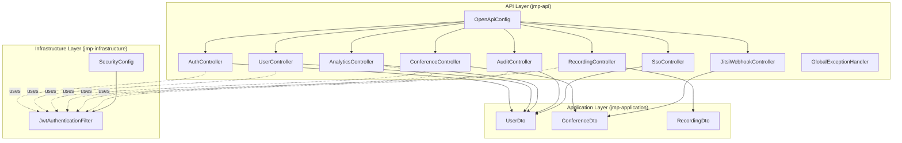
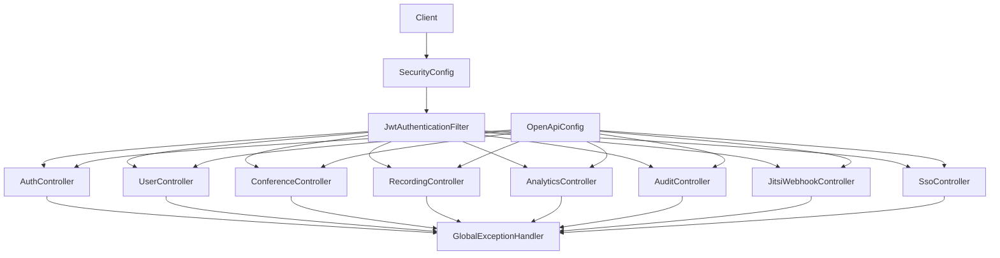
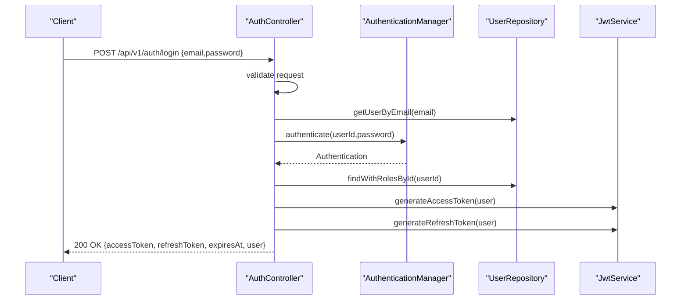
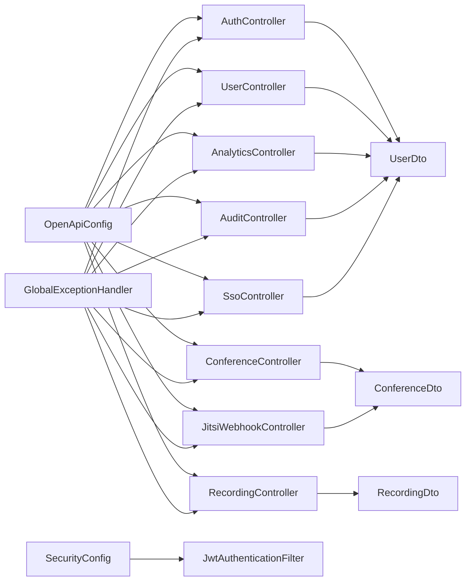
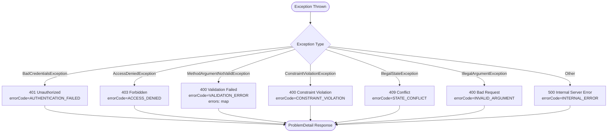

# API Layer

<cite>
**Referenced Files in This Document**
- [AuthController.java](file://jmp-api/src/main/java/com/jmp/api/controller/AuthController.java)
- [UserController.java](file://jmp-api/src/main/java/com/jmp/api/controller/UserController.java)
- [ConferenceController.java](file://jmp-api/src/main/java/com/jmp/api/controller/ConferenceController.java)
- [RecordingController.java](file://jmp-api/src/main/java/com/jmp/api/controller/RecordingController.java)
- [AnalyticsController.java](file://jmp-api/src/main/java/com/jmp/api/controller/AnalyticsController.java)
- [AuditController.java](file://jmp-api/src/main/java/com/jmp/api/controller/AuditController.java)
- [JitsiWebhookController.java](file://jmp-api/src/main/java/com/jmp/api/controller/JitsiWebhookController.java)
- [SsoController.java](file://jmp-api/src/main/java/com/jmp/api/controller/SsoController.java)
- [GlobalExceptionHandler.java](file://jmp-api/src/main/java/com/jmp/api/advice/GlobalExceptionHandler.java)
- [OpenApiConfig.java](file://jmp-api/src/main/java/com/jmp/api/config/OpenApiConfig.java)
- [JwtAuthenticationFilter.java](file://jmp-infrastructure/src/main/java/com/jmp/infrastructure/security/JwtAuthenticationFilter.java)
- [SecurityConfig.java](file://jmp-infrastructure/src/main/java/com/jmp/infrastructure/security/SecurityConfig.java)
- [UserDto.java](file://jmp-application/src/main/java/com/jmp/application/dto/UserDto.java)
- [ConferenceDto.java](file://jmp-application/src/main/java/com/jmp/application/dto/ConferenceDto.java)
- [RecordingDto.java](file://jmp-application/src/main/java/com/jmp/application/dto/RecordingDto.java)
</cite>

## Table of Contents
1. [Introduction](#introduction)
2. [Project Structure](#project-structure)
3. [Core Components](#core-components)
4. [Architecture Overview](#architecture-overview)
5. [Detailed Component Analysis](#detailed-component-analysis)
6. [Dependency Analysis](#dependency-analysis)
7. [Performance Considerations](#performance-considerations)
8. [Troubleshooting Guide](#troubleshooting-guide)
9. [Conclusion](#conclusion)
10. [Appendices](#appendices)

## Introduction
This document describes the API Layer of the Jitsi Management Platform (JMP). It covers all REST controllers responsible for authentication, user management, conference orchestration, recording lifecycle, analytics, audit logging, SSO/OIDC, and webhook ingestion. It also documents global exception handling, OpenAPI/Swagger configuration, authentication and authorization mechanisms, API versioning, content negotiation, and testing approaches grounded in the repository’s implementation.

## Project Structure
The API Layer is organized around Spring MVC controllers under the jmp-api module, with shared DTOs in jmp-application and security/filter configuration in jmp-infrastructure. Controllers are grouped by domain and exposed under a versioned base path.

**Diagram sources**
- [AuthController.java:1-124](file://jmp-api/src/main/java/com/jmp/api/controller/AuthController.java#L1-L124)
- [UserController.java:1-123](file://jmp-api/src/main/java/com/jmp/api/controller/UserController.java#L1-L123)
- [ConferenceController.java:1-189](file://jmp-api/src/main/java/com/jmp/api/controller/ConferenceController.java#L1-L189)
- [RecordingController.java:1-138](file://jmp-api/src/main/java/com/jmp/api/controller/RecordingController.java#L1-L138)
- [AnalyticsController.java:1-96](file://jmp-api/src/main/java/com/jmp/api/controller/AnalyticsController.java#L1-L96)
- [AuditController.java:1-82](file://jmp-api/src/main/java/com/jmp/api/controller/AuditController.java#L1-L82)
- [JitsiWebhookController.java:1-125](file://jmp-api/src/main/java/com/jmp/api/controller/JitsiWebhookController.java#L1-L125)
- [SsoController.java:1-125](file://jmp-api/src/main/java/com/jmp/api/controller/SsoController.java#L1-L125)
- [OpenApiConfig.java:1-56](file://jmp-api/src/main/java/com/jmp/api/config/OpenApiConfig.java#L1-L56)
- [GlobalExceptionHandler.java:1-130](file://jmp-api/src/main/java/com/jmp/api/advice/GlobalExceptionHandler.java#L1-L130)
- [JwtAuthenticationFilter.java:1-122](file://jmp-infrastructure/src/main/java/com/jmp/infrastructure/security/JwtAuthenticationFilter.java#L1-L122)
- [SecurityConfig.java:1-90](file://jmp-infrastructure/src/main/java/com/jmp/infrastructure/security/SecurityConfig.java#L1-L90)
- [UserDto.java:1-97](file://jmp-application/src/main/java/com/jmp/application/dto/UserDto.java#L1-L97)
- [ConferenceDto.java:1-176](file://jmp-application/src/main/java/com/jmp/application/dto/ConferenceDto.java#L1-L176)
- [RecordingDto.java:1-170](file://jmp-application/src/main/java/com/jmp/application/dto/RecordingDto.java#L1-L170)

**Section sources**
- [AuthController.java:1-124](file://jmp-api/src/main/java/com/jmp/api/controller/AuthController.java#L1-L124)
- [UserController.java:1-123](file://jmp-api/src/main/java/com/jmp/api/controller/UserController.java#L1-L123)
- [ConferenceController.java:1-189](file://jmp-api/src/main/java/com/jmp/api/controller/ConferenceController.java#L1-L189)
- [RecordingController.java:1-138](file://jmp-api/src/main/java/com/jmp/api/controller/RecordingController.java#L1-L138)
- [AnalyticsController.java:1-96](file://jmp-api/src/main/java/com/jmp/api/controller/AnalyticsController.java#L1-L96)
- [AuditController.java:1-82](file://jmp-api/src/main/java/com/jmp/api/controller/AuditController.java#L1-L82)
- [JitsiWebhookController.java:1-125](file://jmp-api/src/main/java/com/jmp/api/controller/JitsiWebhookController.java#L1-L125)
- [SsoController.java:1-125](file://jmp-api/src/main/java/com/jmp/api/controller/SsoController.java#L1-L125)
- [OpenApiConfig.java:1-56](file://jmp-api/src/main/java/com/jmp/api/config/OpenApiConfig.java#L1-L56)
- [GlobalExceptionHandler.java:1-130](file://jmp-api/src/main/java/com/jmp/api/advice/GlobalExceptionHandler.java#L1-L130)
- [JwtAuthenticationFilter.java:1-122](file://jmp-infrastructure/src/main/java/com/jmp/infrastructure/security/JwtAuthenticationFilter.java#L1-L122)
- [SecurityConfig.java:1-90](file://jmp-infrastructure/src/main/java/com/jmp/infrastructure/security/SecurityConfig.java#L1-L90)
- [UserDto.java:1-97](file://jmp-application/src/main/java/com/jmp/application/dto/UserDto.java#L1-L97)
- [ConferenceDto.java:1-176](file://jmp-application/src/main/java/com/jmp/application/dto/ConferenceDto.java#L1-L176)
- [RecordingDto.java:1-170](file://jmp-application/src/main/java/com/jmp/application/dto/RecordingDto.java#L1-L170)

## Core Components
- AuthController: Handles login and refresh token operations with JWT issuance and credential validation.
- UserController: Manages user CRUD, listing, search, and self-profile retrieval with tenant-aware authorization.
- ConferenceController: Manages conference lifecycle, listing, search, active/upcoming queries, and Jitsi JWT token generation.
- RecordingController: Manages recording entries, listing, search, download URL generation, and storage statistics.
- AnalyticsController: Provides dashboard metrics, usage reports, participant analytics, recording analytics, and system health metrics.
- AuditController: Searches audit logs, retrieves per-entity logs, and fetches recent security events.
- JitsiWebhookController: Receives and processes Jitsi webhook events with optional signature verification.
- SsoController: Exposes SSO/OIDC provider discovery and handles OAuth callback with state validation.

Each controller is annotated for Swagger/OpenAPI tagging and security requirements, and uses DTOs for request/response contracts.

**Section sources**
- [AuthController.java:30-35](file://jmp-api/src/main/java/com/jmp/api/controller/AuthController.java#L30-L35)
- [UserController.java:33-38](file://jmp-api/src/main/java/com/jmp/api/controller/UserController.java#L33-L38)
- [ConferenceController.java:37-42](file://jmp-api/src/main/java/com/jmp/api/controller/ConferenceController.java#L37-L42)
- [RecordingController.java:35-40](file://jmp-api/src/main/java/com/jmp/api/controller/RecordingController.java#L35-L40)
- [AnalyticsController.java:26-31](file://jmp-api/src/main/java/com/jmp/api/controller/AnalyticsController.java#L26-L31)
- [AuditController.java:30-35](file://jmp-api/src/main/java/com/jmp/api/controller/AuditController.java#L30-L35)
- [JitsiWebhookController.java:24-28](file://jmp-api/src/main/java/com/jmp/api/controller/JitsiWebhookController.java#L24-L28)
- [SsoController.java:30-34](file://jmp-api/src/main/java/com/jmp/api/controller/SsoController.java#L30-L34)

## Architecture Overview
The API Layer enforces stateless JWT authentication via a dedicated filter, applies method-level authorization, and centralizes error handling using RFC 7807 Problem Details. OpenAPI/Swagger is configured centrally to document all controllers and security schemes.

**Diagram sources**
- [SecurityConfig.java:42-61](file://jmp-infrastructure/src/main/java/com/jmp/infrastructure/security/SecurityConfig.java#L42-L61)
- [JwtAuthenticationFilter.java:39-76](file://jmp-infrastructure/src/main/java/com/jmp/infrastructure/security/JwtAuthenticationFilter.java#L39-L76)
- [AuthController.java:30-35](file://jmp-api/src/main/java/com/jmp/api/controller/AuthController.java#L30-L35)
- [UserController.java:33-38](file://jmp-api/src/main/java/com/jmp/api/controller/UserController.java#L33-L38)
- [ConferenceController.java:37-42](file://jmp-api/src/main/java/com/jmp/api/controller/ConferenceController.java#L37-L42)
- [RecordingController.java:35-40](file://jmp-api/src/main/java/com/jmp/api/controller/RecordingController.java#L35-L40)
- [AnalyticsController.java:26-31](file://jmp-api/src/main/java/com/jmp/api/controller/AnalyticsController.java#L26-L31)
- [AuditController.java:30-35](file://jmp-api/src/main/java/com/jmp/api/controller/AuditController.java#L30-L35)
- [JitsiWebhookController.java:24-28](file://jmp-api/src/main/java/com/jmp/api/controller/JitsiWebhookController.java#L24-L28)
- [SsoController.java:30-34](file://jmp-api/src/main/java/com/jmp/api/controller/SsoController.java#L30-L34)
- [OpenApiConfig.java:26-54](file://jmp-api/src/main/java/com/jmp/api/config/OpenApiConfig.java#L26-L54)
- [GlobalExceptionHandler.java:22-24](file://jmp-api/src/main/java/com/jmp/api/advice/GlobalExceptionHandler.java#L22-L24)

## Detailed Component Analysis

### Authentication and Authorization
- JWT Bearer Authentication: Implemented via JwtAuthenticationFilter and SecurityConfig. Stateless sessions, custom authentication details carrying tenant/user IDs, and explicit exclusions for public endpoints.
- Method-level Authorization: PreAuthorize annotations on controllers enforce role-based access per endpoint.
- Credentials Management: AuthController authenticates against the application’s AuthenticationManager and issues access/refresh tokens.

**Diagram sources**
- [AuthController.java:44-81](file://jmp-api/src/main/java/com/jmp/api/controller/AuthController.java#L44-L81)
- [JwtAuthenticationFilter.java:39-76](file://jmp-infrastructure/src/main/java/com/jmp/infrastructure/security/JwtAuthenticationFilter.java#L39-L76)
- [SecurityConfig.java:42-61](file://jmp-infrastructure/src/main/java/com/jmp/infrastructure/security/SecurityConfig.java#L42-L61)

**Section sources**
- [JwtAuthenticationFilter.java:39-76](file://jmp-infrastructure/src/main/java/com/jmp/infrastructure/security/JwtAuthenticationFilter.java#L39-L76)
- [SecurityConfig.java:42-61](file://jmp-infrastructure/src/main/java/com/jmp/infrastructure/security/SecurityConfig.java#L42-L61)
- [AuthController.java:42-81](file://jmp-api/src/main/java/com/jmp/api/controller/AuthController.java#L42-L81)

### AuthController
- Endpoints:
  - POST /api/v1/auth/login: Authenticates user and returns tokens plus user payload.
  - POST /api/v1/auth/refresh: Validates refresh token and issues a new access token.
- Request/Response:
  - LoginRequest: email, password.
  - AuthResponse: accessToken, refreshToken, expiresAt, user.
  - RefreshTokenRequest: refreshToken.
  - TokenRefreshResponse: accessToken, expiresAt.
- Validation: Uses @Valid and Bean Validation constraints on request records.
- Error Handling: Throws BadCredentialsException for invalid credentials; global handler maps to RFC 7807.

**Section sources**
- [AuthController.java:42-100](file://jmp-api/src/main/java/com/jmp/api/controller/AuthController.java#L42-L100)
- [UserDto.java:67-78](file://jmp-application/src/main/java/com/jmp/application/dto/UserDto.java#L67-L78)

### UserController
- Endpoints:
  - POST /api/v1/users: Create user (tenant admin/super admin).
  - GET /api/v1/users/{id}: Get user by ID (self or admin).
  - GET /api/v1/users: List users with optional search (tenant admin/super admin).
  - PUT /api/v1/users/{id}: Update user (self or admin).
  - DELETE /api/v1/users/{id}: Delete user (admin).
  - GET /api/v1/users/me: Get current user profile.
- Authorization: PreAuthorize with role checks and a custom expression to allow self-access.
- Pagination: Uses Spring Data Pageable.
- Tenant Isolation: Extracts tenantId from JwtAuthenticationFilter.WebAuthenticationDetails.

**Section sources**
- [UserController.java:43-107](file://jmp-api/src/main/java/com/jmp/api/controller/UserController.java#L43-L107)
- [JwtAuthenticationFilter.java:99-120](file://jmp-infrastructure/src/main/java/com/jmp/infrastructure/security/JwtAuthenticationFilter.java#L99-L120)

### ConferenceController
- Endpoints:
  - POST /api/v1/conferences: Create conference (moderator/admin/super admin).
  - GET /api/v1/conferences/{id}: Get conference (participant/moderator/admin/super admin).
  - GET /api/v1/conferences: List conferences with optional search (participant/moderator/admin/super admin).
  - GET /api/v1/conferences/active: Active conferences (participant/moderator/admin/super admin).
  - GET /api/v1/conferences/upcoming: Upcoming conferences (participant/moderator/admin/super admin).
  - PUT /api/v1/conferences/{id}: Update conference (moderator/admin/super admin).
  - POST /api/v1/conferences/{id}/start: Start conference (moderator/admin/super admin).
  - POST /api/v1/conferences/{id}/end: End conference (moderator/admin/super admin).
  - DELETE /api/v1/conferences/{id}: Delete conference (moderator/admin/super admin).
  - POST /api/v1/conferences/{id}/token: Generate Jitsi JWT token (participant/moderator/admin/super admin).
- Token Generation: Builds a room URL using tenant Jitsi domain and generated JWT.
- Tenant/UserId Extraction: From JwtAuthenticationFilter.WebAuthenticationDetails.

**Section sources**
- [ConferenceController.java:49-173](file://jmp-api/src/main/java/com/jmp/api/controller/ConferenceController.java#L49-L173)
- [JwtAuthenticationFilter.java:175-187](file://jmp-infrastructure/src/main/java/com/jmp/infrastructure/security/JwtAuthenticationFilter.java#L175-L187)

### RecordingController
- Endpoints:
  - POST /api/v1/recordings: Create recording entry (moderator/admin/super admin).
  - GET /api/v1/recordings/{id}: Get recording (participant/moderator/admin/super admin).
  - GET /api/v1/recordings: List recordings with optional search (participant/moderator/admin/super admin).
  - GET /api/v1/recordings/conference/{conferenceId}: Recordings for a conference (participant/moderator/admin/super admin).
  - GET /api/v1/recordings/{id}/download: Generate presigned download URL with expiration minutes (participant/moderator/admin/super admin).
  - PUT /api/v1/recordings/{id}: Update recording metadata (moderator/admin/super admin).
  - DELETE /api/v1/recordings/{id}: Delete recording (moderator/admin/super admin).
  - GET /api/v1/recordings/stats/storage: Storage statistics (tenant admin/super admin).
- Download URLs: Generated with configurable expiration.

**Section sources**
- [RecordingController.java:45-129](file://jmp-api/src/main/java/com/jmp/api/controller/RecordingController.java#L45-L129)

### AnalyticsController
- Endpoints:
  - GET /api/v1/analytics/dashboard: Dashboard metrics (tenant admin/super admin/auditor).
  - GET /api/v1/analytics/usage-report: Usage report for date range (tenant admin/super admin/auditor).
  - GET /api/v1/analytics/participants: Participant analytics for date range (tenant admin/super admin/auditor).
  - GET /api/v1/analytics/recordings: Recording analytics for date range (tenant admin/super admin/auditor).
  - GET /api/v1/analytics/system-health: System health metrics (super admin).
- Date Range: ISO date-time parameters.

**Section sources**
- [AnalyticsController.java:36-87](file://jmp-api/src/main/java/com/jmp/api/controller/AnalyticsController.java#L36-L87)

### AuditController
- Endpoints:
  - GET /api/v1/audit: Search audit logs with filters (event type, user, date range) and pagination (tenant admin/super admin/auditor).
  - GET /api/v1/audit/entity/{entityType}/{entityId}: Logs for a specific entity (tenant admin/super admin/auditor).
  - GET /api/v1/audit/security-events: Recent security events (super admin/auditor).
- Filtering: Supports event type, user ID, and date range.

**Section sources**
- [AuditController.java:40-73](file://jmp-api/src/main/java/com/jmp/api/controller/AuditController.java#L40-L73)

### JitsiWebhookController
- Endpoint:
  - POST /api/v1/webhooks/jitsi: Receive Jitsi webhook events.
- Signature Verification: Optional verification via X-Jitsi-Signature header (placeholder implementation currently accepts all).
- Event Processing: Switch on eventType to route to specialized handlers.

**Section sources**
- [JitsiWebhookController.java:33-52](file://jmp-api/src/main/java/com/jmp/api/controller/JitsiWebhookController.java#L33-L52)

### SsoController
- Endpoints:
  - GET /api/v1/sso/providers/{tenantId}: Available SSO providers for a tenant.
  - GET /api/v1/sso/login/{providerId}: Redirect to provider authorization URL with state/nonce.
  - GET /api/v1/sso/callback: Handle OAuth callback, validate state, and return access/refresh tokens.
- Security: Stores state/nonce in session and validates on callback.

**Section sources**
- [SsoController.java:44-110](file://jmp-api/src/main/java/com/jmp/api/controller/SsoController.java#L44-L110)

## Dependency Analysis
Controllers depend on application services and DTOs, while security is centralized in JwtAuthenticationFilter and SecurityConfig. OpenAPI configuration is applied globally to annotate controllers.

**Diagram sources**
- [AuthController.java:3-8](file://jmp-api/src/main/java/com/jmp/api/controller/AuthController.java#L3-L8)
- [UserController.java:3-5](file://jmp-api/src/main/java/com/jmp/api/controller/UserController.java#L3-L5)
- [ConferenceController.java:3-7](file://jmp-api/src/main/java/com/jmp/api/controller/ConferenceController.java#L3-L7)
- [RecordingController.java:3-5](file://jmp-api/src/main/java/com/jmp/api/controller/RecordingController.java#L3-L5)
- [AnalyticsController.java:3-4](file://jmp-api/src/main/java/com/jmp/api/controller/AnalyticsController.java#L3-L4)
- [AuditController.java:3-4](file://jmp-api/src/main/java/com/jmp/api/controller/AuditController.java#L3-L4)
- [JitsiWebhookController.java:3-4](file://jmp-api/src/main/java/com/jmp/api/controller/JitsiWebhookController.java#L3-L4)
- [SsoController.java:4-6](file://jmp-api/src/main/java/com/jmp/api/controller/SsoController.java#L4-L6)
- [SecurityConfig.java:36-40](file://jmp-infrastructure/src/main/java/com/jmp/infrastructure/security/SecurityConfig.java#L36-L40)
- [JwtAuthenticationFilter.java:34-37](file://jmp-infrastructure/src/main/java/com/jmp/infrastructure/security/JwtAuthenticationFilter.java#L34-L37)
- [OpenApiConfig.java:26-54](file://jmp-api/src/main/java/com/jmp/api/config/OpenApiConfig.java#L26-L54)
- [GlobalExceptionHandler.java:22-24](file://jmp-api/src/main/java/com/jmp/api/advice/GlobalExceptionHandler.java#L22-L24)

**Section sources**
- [UserDto.java:14-96](file://jmp-application/src/main/java/com/jmp/application/dto/UserDto.java#L14-L96)
- [ConferenceDto.java:15-175](file://jmp-application/src/main/java/com/jmp/application/dto/ConferenceDto.java#L15-L175)
- [RecordingDto.java:13-169](file://jmp-application/src/main/java/com/jmp/application/dto/RecordingDto.java#L13-L169)
- [JwtAuthenticationFilter.java:39-76](file://jmp-infrastructure/src/main/java/com/jmp/infrastructure/security/JwtAuthenticationFilter.java#L39-L76)
- [SecurityConfig.java:42-61](file://jmp-infrastructure/src/main/java/com/jmp/infrastructure/security/SecurityConfig.java#L42-L61)
- [OpenApiConfig.java:26-54](file://jmp-api/src/main/java/com/jmp/api/config/OpenApiConfig.java#L26-L54)
- [GlobalExceptionHandler.java:22-24](file://jmp-api/src/main/java/com/jmp/api/advice/GlobalExceptionHandler.java#L22-L24)

## Performance Considerations
- Stateless JWT: No server-side session storage reduces memory footprint.
- Pagination: Controllers use Pageable for efficient large dataset traversal.
- DTOs: Sealed interfaces reduce object overhead and improve serialization predictability.
- CORS: Configured for minimal latency and controlled origins.

[No sources needed since this section provides general guidance]

## Troubleshooting Guide
- Global Exception Handling:
  - RFC 7807 Problem Details responses for validation failures, bad requests, conflicts, unauthorized, forbidden, and internal server errors.
  - Validation errors include a structured “errors” map keyed by field.
- Common Scenarios:
  - Invalid credentials: Returns 401 with AUTHENTICATION_FAILED.
  - Access Denied: Returns 403 with ACCESS_DENIED.
  - Validation Errors: Returns 400 with VALIDATION_ERROR and nested field errors.
  - Generic Errors: Returns 500 with INTERNAL_ERROR.

**Diagram sources**
- [GlobalExceptionHandler.java:26-128](file://jmp-api/src/main/java/com/jmp/api/advice/GlobalExceptionHandler.java#L26-L128)

**Section sources**
- [GlobalExceptionHandler.java:26-128](file://jmp-api/src/main/java/com/jmp/api/advice/GlobalExceptionHandler.java#L26-L128)

## Conclusion
The API Layer implements a clean separation of concerns with strong security, robust error handling, and comprehensive API documentation via OpenAPI. Controllers are designed around DTOs, enforce tenant isolation, and apply method-level authorization. The JWT filter and security configuration ensure stateless, scalable authentication, while global exception handling provides standardized error responses.

[No sources needed since this section summarizes without analyzing specific files]

## Appendices

### API Versioning and Content Negotiation
- Versioning Strategy: All controllers use /api/v1/base-path to indicate versioned endpoints.
- Content Negotiation: Spring MVC defaults apply; controllers return ResponseEntity with appropriate statuses and serialized DTOs.

**Section sources**
- [AuthController.java](file://jmp-api/src/main/java/com/jmp/api/controller/AuthController.java#L31)
- [UserController.java](file://jmp-api/src/main/java/com/jmp/api/controller/UserController.java#L34)
- [ConferenceController.java](file://jmp-api/src/main/java/com/jmp/api/controller/ConferenceController.java#L38)
- [RecordingController.java](file://jmp-api/src/main/java/com/jmp/api/controller/RecordingController.java#L36)
- [AnalyticsController.java](file://jmp-api/src/main/java/com/jmp/api/controller/AnalyticsController.java#L27)
- [AuditController.java](file://jmp-api/src/main/java/com/jmp/api/controller/AuditController.java#L31)
- [JitsiWebhookController.java](file://jmp-api/src/main/java/com/jmp/api/controller/JitsiWebhookController.java#L25)
- [SsoController.java](file://jmp-api/src/main/java/com/jmp/api/controller/SsoController.java#L31)

### OpenAPI/Swagger Configuration
- Security Scheme: bearerAuth with JWT bearer format.
- Servers: Local dev and production URLs.
- Tags: Each controller annotated with @Tag for grouping.
- Global Security Requirement: Applied to controllers requiring bearer auth.

**Section sources**
- [OpenApiConfig.java:26-54](file://jmp-api/src/main/java/com/jmp/api/config/OpenApiConfig.java#L26-L54)
- [AuthController.java](file://jmp-api/src/main/java/com/jmp/api/controller/AuthController.java#L34)
- [UserController.java](file://jmp-api/src/main/java/com/jmp/api/controller/UserController.java#L37)
- [ConferenceController.java](file://jmp-api/src/main/java/com/jmp/api/controller/ConferenceController.java#L41)
- [RecordingController.java](file://jmp-api/src/main/java/com/jmp/api/controller/RecordingController.java#L39)
- [AnalyticsController.java](file://jmp-api/src/main/java/com/jmp/api/controller/AnalyticsController.java#L30)
- [AuditController.java](file://jmp-api/src/main/java/com/jmp/api/controller/AuditController.java#L34)
- [JitsiWebhookController.java](file://jmp-api/src/main/java/com/jmp/api/controller/JitsiWebhookController.java#L28)
- [SsoController.java](file://jmp-api/src/main/java/com/jmp/api/controller/SsoController.java#L34)

### Authentication Decorators and Security Annotations
- @SecurityRequirement(name = "bearerAuth"): Applied at controller level.
- @PreAuthorize: Enforced via method security enabled in SecurityConfig.
- @Operation: Swagger operation summaries for endpoints.

**Section sources**
- [UserController.java:37-38](file://jmp-api/src/main/java/com/jmp/api/controller/UserController.java#L37-L38)
- [ConferenceController.java](file://jmp-api/src/main/java/com/jmp/api/controller/ConferenceController.java#L41)
- [RecordingController.java](file://jmp-api/src/main/java/com/jmp/api/controller/RecordingController.java#L39)
- [AnalyticsController.java](file://jmp-api/src/main/java/com/jmp/api/controller/AnalyticsController.java#L30)
- [AuditController.java](file://jmp-api/src/main/java/com/jmp/api/controller/AuditController.java#L34)
- [SecurityConfig.java](file://jmp-infrastructure/src/main/java/com/jmp/infrastructure/security/SecurityConfig.java#L30)

### Request Validation and Response Serialization Patterns
- Validation: @NotBlank, @Size, @NotNull, @Email on DTOs and request records; @Valid on controller parameters.
- Serialization: ResponseEntity.ok()/created/noContent() with DTO instances; ProblemDetail for errors.

**Section sources**
- [UserDto.java:30-62](file://jmp-application/src/main/java/com/jmp/application/dto/UserDto.java#L30-L62)
- [ConferenceDto.java:43-96](file://jmp-application/src/main/java/com/jmp/application/dto/ConferenceDto.java#L43-L96)
- [RecordingDto.java:41-94](file://jmp-application/src/main/java/com/jmp/application/dto/RecordingDto.java#L41-L94)
- [GlobalExceptionHandler.java:82-114](file://jmp-api/src/main/java/com/jmp/api/advice/GlobalExceptionHandler.java#L82-L114)

### Typical API Interactions and Error Scenarios
- Successful Login: POST /api/v1/auth/login returns tokens and user profile.
- Access Denied: Attempting admin-only endpoint without required role yields 403.
- Validation Failure: Sending missing/invalid fields yields 400 with field-level errors.
- Unauthorized: Using invalid/expired tokens yields 401.

**Section sources**
- [AuthController.java:44-81](file://jmp-api/src/main/java/com/jmp/api/controller/AuthController.java#L44-L81)
- [GlobalExceptionHandler.java:54-80](file://jmp-api/src/main/java/com/jmp/api/advice/GlobalExceptionHandler.java#L54-L80)