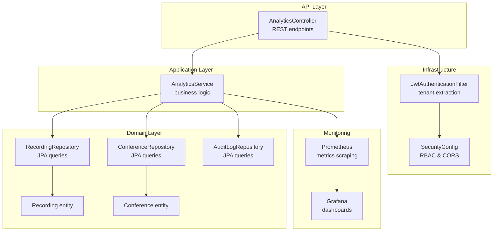
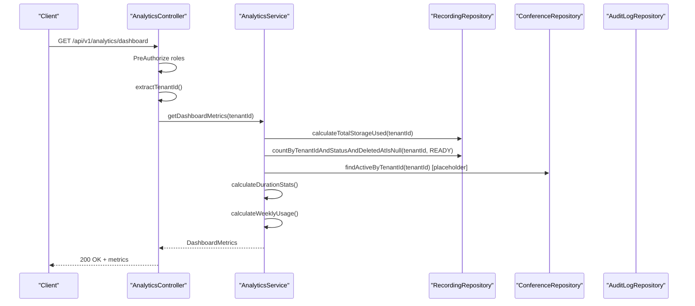
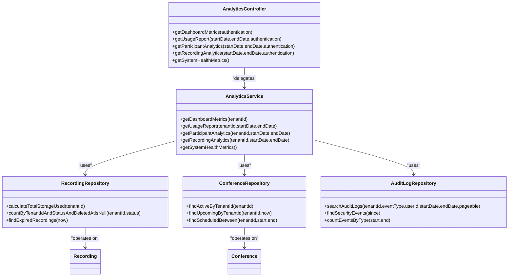

# Analytics and Reporting Controller

<cite>
**Referenced Files in This Document**
- [AnalyticsController.java](file://jmp-api/src/main/java/com/jmp/api/controller/AnalyticsController.java)
- [AnalyticsService.java](file://jmp-application/src/main/java/com/jmp/application/service/AnalyticsService.java)
- [RecordingRepository.java](file://jmp-domain/src/main/java/com/jmp/domain/repository/RecordingRepository.java)
- [ConferenceRepository.java](file://jmp-domain/src/main/java/com/jmp/domain/repository/ConferenceRepository.java)
- [AuditLogRepository.java](file://jmp-domain/src/main/java/com/jmp/domain/repository/AuditLogRepository.java)
- [Recording.java](file://jmp-domain/src/main/java/com/jmp/domain/entity/Recording.java)
- [Conference.java](file://jmp-domain/src/main/java/com/jmp/domain/entity/Conference.java)
- [JwtAuthenticationFilter.java](file://jmp-infrastructure/src/main/java/com/jmp/infrastructure/security/JwtAuthenticationFilter.java)
- [SecurityConfig.java](file://jmp-infrastructure/src/main/java/com/jmp/infrastructure/security/SecurityConfig.java)
- [application.yml](file://jmp-web/src/main/resources/application.yml)
- [prometheus.yml](file://monitoring/prometheus.yml)
- [datasources.yml](file://monitoring/grafana/datasources/datasources.yml)
</cite>

## Table of Contents
1. [Introduction](#introduction)
2. [Project Structure](#project-structure)
3. [Core Components](#core-components)
4. [Architecture Overview](#architecture-overview)
5. [Detailed Component Analysis](#detailed-component-analysis)
6. [Dependency Analysis](#dependency-analysis)
7. [Performance Considerations](#performance-considerations)
8. [Troubleshooting Guide](#troubleshooting-guide)
9. [Conclusion](#conclusion)
10. [Appendices](#appendices)

## Introduction
This document provides comprehensive API documentation for the Analytics and Reporting Controller. It covers analytics endpoints for dashboard metrics, usage statistics, participant analytics, recording analytics, and system health metrics. It explains how real-time metrics collection and historical data aggregation are implemented, outlines metric calculation algorithms, and documents data retention policies and performance optimizations. The document also addresses export functionality, report generation, and data visualization endpoints, along with filtering capabilities, date range selection, and custom report creation. Privacy, anonymization, and compliance considerations are included, alongside examples of analytics workflows and integration with monitoring systems.

## Project Structure
The analytics functionality spans three layers:
- API Layer: REST endpoints exposed via the Analytics Controller
- Application Layer: Business logic encapsulated in the Analytics Service
- Domain Layer: Repositories and entities for recordings, conferences, and audit logs

**Diagram sources**
- [AnalyticsController.java:1-96](file://jmp-api/src/main/java/com/jmp/api/controller/AnalyticsController.java#L1-L96)
- [AnalyticsService.java:1-235](file://jmp-application/src/main/java/com/jmp/application/service/AnalyticsService.java#L1-L235)
- [RecordingRepository.java:1-100](file://jmp-domain/src/main/java/com/jmp/domain/repository/RecordingRepository.java#L1-L100)
- [ConferenceRepository.java:1-110](file://jmp-domain/src/main/java/com/jmp/domain/repository/ConferenceRepository.java#L1-L110)
- [AuditLogRepository.java:1-85](file://jmp-domain/src/main/java/com/jmp/domain/repository/AuditLogRepository.java#L1-L85)
- [Recording.java:1-203](file://jmp-domain/src/main/java/com/jmp/domain/entity/Recording.java#L1-L203)
- [Conference.java:1-217](file://jmp-domain/src/main/java/com/jmp/domain/entity/Conference.java#L1-L217)
- [JwtAuthenticationFilter.java:1-122](file://jmp-infrastructure/src/main/java/com/jmp/infrastructure/security/JwtAuthenticationFilter.java#L1-L122)
- [SecurityConfig.java:1-90](file://jmp-infrastructure/src/main/java/com/jmp/infrastructure/security/SecurityConfig.java#L1-L90)
- [prometheus.yml:1-23](file://monitoring/prometheus.yml#L1-L23)
- [datasources.yml:1-11](file://monitoring/grafana/datasources/datasources.yml#L1-L11)

**Section sources**
- [AnalyticsController.java:1-96](file://jmp-api/src/main/java/com/jmp/api/controller/AnalyticsController.java#L1-L96)
- [AnalyticsService.java:1-235](file://jmp-application/src/main/java/com/jmp/application/service/AnalyticsService.java#L1-L235)
- [RecordingRepository.java:1-100](file://jmp-domain/src/main/java/com/jmp/domain/repository/RecordingRepository.java#L1-L100)
- [ConferenceRepository.java:1-110](file://jmp-domain/src/main/java/com/jmp/domain/repository/ConferenceRepository.java#L1-L110)
- [AuditLogRepository.java:1-85](file://jmp-domain/src/main/java/com/jmp/domain/repository/AuditLogRepository.java#L1-L85)
- [Recording.java:1-203](file://jmp-domain/src/main/java/com/jmp/domain/entity/Recording.java#L1-L203)
- [Conference.java:1-217](file://jmp-domain/src/main/java/com/jmp/domain/entity/Conference.java#L1-L217)
- [JwtAuthenticationFilter.java:1-122](file://jmp-infrastructure/src/main/java/com/jmp/infrastructure/security/JwtAuthenticationFilter.java#L1-L122)
- [SecurityConfig.java:1-90](file://jmp-infrastructure/src/main/java/com/jmp/infrastructure/security/SecurityConfig.java#L1-L90)
- [prometheus.yml:1-23](file://monitoring/prometheus.yml#L1-L23)
- [datasources.yml:1-11](file://monitoring/grafana/datasources/datasources.yml#L1-L11)

## Core Components
- AnalyticsController: Exposes REST endpoints for analytics and reporting, enforcing role-based access control and extracting tenant IDs from JWT claims.
- AnalyticsService: Implements analytics calculations using repositories for recordings, conferences, and audit logs, returning structured data transfer objects.
- Repositories: Provide JPA queries for counting, aggregating, and filtering analytics data.
- Entities: Recording and Conference define the data model used by analytics calculations.
- Security: JWT-based authentication extracts tenant and user identifiers, enabling per-tenant analytics scoping.

Key responsibilities:
- Dashboard metrics: monthly recordings, storage usage, duration statistics, and weekly usage trends
- Usage reports: total recordings, storage, and peak usage within a date range
- Participant analytics: placeholders for unique participants, averages, concurrency, and trends
- Recording analytics: totals, storage, average duration, and type distributions
- System health metrics: placeholders for CPU/memory usage, connections, and response times

**Section sources**
- [AnalyticsController.java:36-87](file://jmp-api/src/main/java/com/jmp/api/controller/AnalyticsController.java#L36-L87)
- [AnalyticsService.java:38-145](file://jmp-application/src/main/java/com/jmp/application/service/AnalyticsService.java#L38-L145)
- [RecordingRepository.java:74-78](file://jmp-domain/src/main/java/com/jmp/domain/repository/RecordingRepository.java#L74-L78)
- [ConferenceRepository.java:48-50](file://jmp-domain/src/main/java/com/jmp/domain/repository/ConferenceRepository.java#L48-L50)
- [JwtAuthenticationFilter.java:108-111](file://jmp-infrastructure/src/main/java/com/jmp/infrastructure/security/JwtAuthenticationFilter.java#L108-L111)

## Architecture Overview
The analytics pipeline follows a layered architecture:
- API Layer validates requests, enforces RBAC, and delegates to the service layer
- Service Layer orchestrates repository queries and constructs analytics DTOs
- Domain Layer persists and retrieves data via JPA repositories
- Infrastructure Layer secures requests and extracts tenant context
- Monitoring Layer exposes metrics for visualization and alerting

**Diagram sources**
- [AnalyticsController.java:36-44](file://jmp-api/src/main/java/com/jmp/api/controller/AnalyticsController.java#L36-L44)
- [AnalyticsService.java:38-64](file://jmp-application/src/main/java/com/jmp/application/service/AnalyticsService.java#L38-L64)
- [RecordingRepository.java:74-78](file://jmp-domain/src/main/java/com/jmp/domain/repository/RecordingRepository.java#L74-L78)
- [ConferenceRepository.java:48-50](file://jmp-domain/src/main/java/com/jmp/domain/repository/ConferenceRepository.java#L48-L50)

**Section sources**
- [AnalyticsController.java:36-87](file://jmp-api/src/main/java/com/jmp/api/controller/AnalyticsController.java#L36-L87)
- [AnalyticsService.java:38-145](file://jmp-application/src/main/java/com/jmp/application/service/AnalyticsService.java#L38-L145)

## Detailed Component Analysis

### AnalyticsController
Responsibilities:
- Exposes endpoints for dashboard metrics, usage reports, participant analytics, recording analytics, and system health metrics
- Enforces role-based access control (TENANT_ADMIN, SUPER_ADMIN, AUDITOR for analytics; SUPER_ADMIN for system health)
- Extracts tenant ID from JWT claims for per-tenant scoping
- Accepts ISO 8601 date-time parameters for historical analytics

Endpoints:
- GET /api/v1/analytics/dashboard
  - Returns DashboardMetrics
  - Requires: TENANT_ADMIN, SUPER_ADMIN, or AUDITOR
- GET /api/v1/analytics/usage-report
  - Query params: startDate, endDate (ISO 8601)
  - Returns UsageReport
  - Requires: TENANT_ADMIN, SUPER_ADMIN, or AUDITOR
- GET /api/v1/analytics/participants
  - Query params: startDate, endDate (ISO 8601)
  - Returns ParticipantAnalytics
  - Requires: TENANT_ADMIN, SUPER_ADMIN, or AUDITOR
- GET /api/v1/analytics/recordings
  - Query params: startDate, endDate (ISO 8601)
  - Returns RecordingAnalytics
  - Requires: TENANT_ADMIN, SUPER_ADMIN, or AUDITOR
- GET /api/v1/analytics/system-health
  - Returns SystemHealthMetrics
  - Requires: SUPER_ADMIN

Tenant extraction:
- Uses JwtAuthenticationFilter.WebAuthenticationDetails to retrieve tenant_id from JWT claims

**Section sources**
- [AnalyticsController.java:36-87](file://jmp-api/src/main/java/com/jmp/api/controller/AnalyticsController.java#L36-L87)
- [JwtAuthenticationFilter.java:99-121](file://jmp-infrastructure/src/main/java/com/jmp/infrastructure/security/JwtAuthenticationFilter.java#L99-L121)

### AnalyticsService
Responsibilities:
- Orchestrates analytics computations using repositories
- Provides structured DTOs for analytics responses
- Implements placeholder calculations for advanced metrics

Key methods and algorithms:
- getDashboardMetrics(tenantId)
  - Calculates monthly recordings (READY status, not deleted)
  - Computes total storage used (READY recordings, not deleted)
  - Builds duration statistics for the last 30 days
  - Aggregates weekly usage (last 7 days) as placeholder
- getUsageReport(tenantId, startDate, endDate)
  - Aggregates total recordings and storage for the given period
  - Identifies peak usage (placeholders for concurrent participants/conferences)
- getParticipantAnalytics(tenantId, startDate, endDate)
  - Returns placeholders for unique participants, averages, concurrency, and trends
- getRecordingAnalytics(tenantId, startDate, endDate)
  - Computes total recordings and storage
  - Calculates average duration from available recordings
  - Provides type distribution as placeholder
- getSystemHealthMetrics()
  - Returns placeholders for CPU/memory usage, active connections, and response time

Data structures:
- DashboardMetrics, UsageReport, ParticipantAnalytics, RecordingAnalytics, SystemHealthMetrics, ConferenceDurationStats, DailyUsage, PeakUsage

**Section sources**
- [AnalyticsService.java:38-145](file://jmp-application/src/main/java/com/jmp/application/service/AnalyticsService.java#L38-L145)
- [AnalyticsService.java:174-234](file://jmp-application/src/main/java/com/jmp/application/service/AnalyticsService.java#L174-L234)

### Repositories and Entities
RecordingRepository:
- Provides functions to count recordings by status, calculate total storage used, and find expired recordings based on retentionUntil
- Supports pagination and tenant-scoped queries

ConferenceRepository:
- Offers queries for active/upcoming conferences, scheduled ranges, and auto-start/end logic
- Supports tenant-scoped pagination and filtering

AuditLogRepository:
- Enables audit log searches with tenant, user, event type, and date range filters
- Supports security event detection and event type counts

Entities:
- Recording: includes status, duration, file size, retentionUntil, encryption flags, and timestamps
- Conference: includes scheduling, status, participant counts, and metadata

**Section sources**
- [RecordingRepository.java:74-78](file://jmp-domain/src/main/java/com/jmp/domain/repository/RecordingRepository.java#L74-L78)
- [RecordingRepository.java:65-69](file://jmp-domain/src/main/java/com/jmp/domain/repository/RecordingRepository.java#L65-L69)
- [ConferenceRepository.java:48-50](file://jmp-domain/src/main/java/com/jmp/domain/repository/ConferenceRepository.java#L48-L50)
- [ConferenceRepository.java:87-92](file://jmp-domain/src/main/java/com/jmp/domain/repository/ConferenceRepository.java#L87-L92)
- [AuditLogRepository.java:44-58](file://jmp-domain/src/main/java/com/jmp/domain/repository/AuditLogRepository.java#L44-L58)
- [Recording.java:101-115](file://jmp-domain/src/main/java/com/jmp/domain/entity/Recording.java#L101-L115)
- [Conference.java:65-75](file://jmp-domain/src/main/java/com/jmp/domain/entity/Conference.java#L65-L75)

### Security and Access Control
- JWT-based authentication validates access tokens and populates authorities
- WebAuthenticationDetails holds tenant_id extracted from JWT claims
- SecurityConfig configures stateless sessions, CORS, and method-level authorization
- AnalyticsController enforces PreAuthorize annotations for role-based access

**Section sources**
- [JwtAuthenticationFilter.java:39-76](file://jmp-infrastructure/src/main/java/com/jmp/infrastructure/security/JwtAuthenticationFilter.java#L39-L76)
- [JwtAuthenticationFilter.java:108-111](file://jmp-infrastructure/src/main/java/com/jmp/infrastructure/security/JwtAuthenticationFilter.java#L108-L111)
- [SecurityConfig.java:42-61](file://jmp-infrastructure/src/main/java/com/jmp/infrastructure/security/SecurityConfig.java#L42-L61)

### Monitoring and Metrics Exposure
- Actuator exposes Prometheus-compatible metrics at /actuator/prometheus
- Prometheus scrapes jmp-api metrics at 5-second intervals
- Grafana connects to Prometheus as a data source for dashboards

**Section sources**
- [application.yml:92-112](file://jmp-web/src/main/resources/application.yml#L92-L112)
- [prometheus.yml:18-22](file://monitoring/prometheus.yml#L18-L22)
- [datasources.yml:4-10](file://monitoring/grafana/datasources/datasources.yml#L4-L10)

## Dependency Analysis

**Diagram sources**
- [AnalyticsController.java:36-87](file://jmp-api/src/main/java/com/jmp/api/controller/AnalyticsController.java#L36-L87)
- [AnalyticsService.java:31-33](file://jmp-application/src/main/java/com/jmp/application/service/AnalyticsService.java#L31-L33)
- [RecordingRepository.java:74-78](file://jmp-domain/src/main/java/com/jmp/domain/repository/RecordingRepository.java#L74-L78)
- [ConferenceRepository.java:48-50](file://jmp-domain/src/main/java/com/jmp/domain/repository/ConferenceRepository.java#L48-L50)
- [AuditLogRepository.java:44-58](file://jmp-domain/src/main/java/com/jmp/domain/repository/AuditLogRepository.java#L44-L58)
- [Recording.java:1-203](file://jmp-domain/src/main/java/com/jmp/domain/entity/Recording.java#L1-L203)
- [Conference.java:1-217](file://jmp-domain/src/main/java/com/jmp/domain/entity/Conference.java#L1-L217)

**Section sources**
- [AnalyticsController.java:36-87](file://jmp-api/src/main/java/com/jmp/api/controller/AnalyticsController.java#L36-L87)
- [AnalyticsService.java:31-33](file://jmp-application/src/main/java/com/jmp/application/service/AnalyticsService.java#L31-L33)

## Performance Considerations
- Database optimization
  - Use indexed columns for tenant_id, status, created_at, and scheduled_start_at/end_at
  - Prefer pagination-aware queries (Pageable) for large datasets
  - Aggregate queries (SUM/COUNT) are executed via repository methods to minimize round trips
- Caching
  - Consider caching frequently accessed dashboard metrics for short TTLs (e.g., minutes) to reduce database load
  - Cache aggregated usage reports for recent periods
- Query efficiency
  - Limit date-range selections to reasonable windows to avoid heavy scans
  - Use tenant-scoped queries to prevent cross-tenant data leakage and improve performance
- Batch operations
  - Leverage batch sizes and ordered inserts/updates configured in application.yml
- Monitoring
  - Enable Prometheus metrics and Grafana dashboards for capacity planning and anomaly detection

[No sources needed since this section provides general guidance]

## Troubleshooting Guide
Common issues and resolutions:
- Unauthorized access
  - Ensure the JWT includes required roles (TENANT_ADMIN, SUPER_ADMIN, AUDITOR) and tenant_id claim
  - Verify SecurityConfig permits analytics endpoints after authentication
- Missing tenant context
  - Confirm JwtAuthenticationFilter extracts tenant_id from claims and that the Authentication details are present
- Empty or placeholder analytics
  - Some metrics (weekly usage, duration stats, participant trends, system health) are placeholders and require implementation
- Date range errors
  - Ensure startDate and endDate are valid ISO 8601 timestamps
- Slow queries
  - Add appropriate database indexes on tenant_id, status, and date columns
  - Reduce date range windows and enable pagination where applicable

**Section sources**
- [SecurityConfig.java:42-61](file://jmp-infrastructure/src/main/java/com/jmp/infrastructure/security/SecurityConfig.java#L42-L61)
- [JwtAuthenticationFilter.java:39-76](file://jmp-infrastructure/src/main/java/com/jmp/infrastructure/security/JwtAuthenticationFilter.java#L39-L76)
- [AnalyticsService.java:158-170](file://jmp-application/src/main/java/com/jmp/application/service/AnalyticsService.java#L158-L170)

## Conclusion
The Analytics and Reporting Controller provides a robust foundation for dashboard metrics, usage reports, participant analytics, recording analytics, and system health monitoring. While several advanced metrics are placeholders, the underlying architecture supports extensibility and performance optimization. Integrations with JWT-based security, Prometheus metrics, and Grafana dashboards enable secure, scalable, and observable analytics delivery.

[No sources needed since this section summarizes without analyzing specific files]

## Appendices

### API Endpoints Reference
- GET /api/v1/analytics/dashboard
  - Roles: TENANT_ADMIN, SUPER_ADMIN, AUDITOR
  - Response: DashboardMetrics
- GET /api/v1/analytics/usage-report
  - Query params: startDate (ISO 8601), endDate (ISO 8601)
  - Roles: TENANT_ADMIN, SUPER_ADMIN, AUDITOR
  - Response: UsageReport
- GET /api/v1/analytics/participants
  - Query params: startDate (ISO 8601), endDate (ISO 8601)
  - Roles: TENANT_ADMIN, SUPER_ADMIN, AUDITOR
  - Response: ParticipantAnalytics
- GET /api/v1/analytics/recordings
  - Query params: startDate (ISO 8601), endDate (ISO 8601)
  - Roles: TENANT_ADMIN, SUPER_ADMIN, AUDITOR
  - Response: RecordingAnalytics
- GET /api/v1/analytics/system-health
  - Roles: SUPER_ADMIN
  - Response: SystemHealthMetrics

**Section sources**
- [AnalyticsController.java:36-87](file://jmp-api/src/main/java/com/jmp/api/controller/AnalyticsController.java#L36-L87)

### Data Retention Policies
- Recording retention
  - retentionUntil determines expiration; expired recordings are identified via findExpiredRecordings(now)
  - Soft-deleted recordings (deletedAt IS NOT NULL) are excluded from analytics
- Audit log retention
  - Old audit logs can be purged using deleteByCreatedAtBefore(before) to enforce retention policies

**Section sources**
- [Recording.java:101-115](file://jmp-domain/src/main/java/com/jmp/domain/entity/Recording.java#L101-L115)
- [RecordingRepository.java:65-69](file://jmp-domain/src/main/java/com/jmp/domain/repository/RecordingRepository.java#L65-L69)
- [AuditLogRepository.java:83-83](file://jmp-domain/src/main/java/com/jmp/domain/repository/AuditLogRepository.java#L83-L83)

### Metric Calculation Algorithms
- Monthly recordings: count READY recordings for a tenant excluding deleted ones
- Storage used: SUM(file_size_bytes) for READY recordings excluding deleted ones
- Duration statistics: computed over the last 30 days (placeholder implementation)
- Weekly usage: daily aggregation over the last 7 days (placeholder implementation)
- Peak usage: identifies concurrent participants/conferences during the requested period (placeholder implementation)
- Average recording duration: mean of durationSeconds for available recordings

**Section sources**
- [AnalyticsService.java:44-46](file://jmp-application/src/main/java/com/jmp/application/service/AnalyticsService.java#L44-L46)
- [AnalyticsService.java:49-49](file://jmp-application/src/main/java/com/jmp/application/service/AnalyticsService.java#L49-L49)
- [AnalyticsService.java:118-123](file://jmp-application/src/main/java/com/jmp/application/service/AnalyticsService.java#L118-L123)

### Filtering and Date Range Selection
- Date range parameters: startDate and endDate accept ISO 8601 timestamps
- Repository-level filtering:
  - ConferenceRepository.findScheduledBetween for scheduled conferences within a range
  - AuditLogRepository.searchAuditLogs for filtered audit logs by tenant, user, event type, and date range

**Section sources**
- [AnalyticsController.java:50-51](file://jmp-api/src/main/java/com/jmp/api/controller/AnalyticsController.java#L50-L51)
- [ConferenceRepository.java:87-92](file://jmp-domain/src/main/java/com/jmp/domain/repository/ConferenceRepository.java#L87-L92)
- [AuditLogRepository.java:44-58](file://jmp-domain/src/main/java/com/jmp/domain/repository/AuditLogRepository.java#L44-L58)

### Export Functionality and Report Generation
- Current implementation returns analytics DTOs; export and report generation endpoints are not implemented
- Recommended approach:
  - Add CSV/Excel export endpoints that serialize UsageReport and other analytics DTOs
  - Implement scheduled report generation jobs to produce and deliver reports

[No sources needed since this section provides general guidance]

### Data Privacy, Anonymization, and Compliance
- Tenant isolation: all analytics are scoped by tenant_id extracted from JWT claims
- Deleted records exclusion: repositories exclude deletedAt IS NOT NULL records
- Audit logging: AuditLogRepository supports filtering and searching for compliance auditing
- Encryption: Recording includes encryption flags and metadata; ensure sensitive data handling aligns with compliance requirements

**Section sources**
- [JwtAuthenticationFilter.java:108-111](file://jmp-infrastructure/src/main/java/com/jmp/infrastructure/security/JwtAuthenticationFilter.java#L108-L111)
- [RecordingRepository.java:35-35](file://jmp-domain/src/main/java/com/jmp/domain/repository/RecordingRepository.java#L35-L35)
- [AuditLogRepository.java:24-29](file://jmp-domain/src/main/java/com/jmp/domain/repository/AuditLogRepository.java#L24-L29)

### Monitoring Integration Examples
- Prometheus scraping: jmp-api exposes metrics at /actuator/prometheus
- Grafana dashboard: configure Prometheus data source and build dashboards for analytics metrics
- System health: SystemHealthMetrics placeholders can be integrated with Actuator health endpoints

**Section sources**
- [application.yml:92-112](file://jmp-web/src/main/resources/application.yml#L92-L112)
- [prometheus.yml:18-22](file://monitoring/prometheus.yml#L18-L22)
- [datasources.yml:4-10](file://monitoring/grafana/datasources/datasources.yml#L4-L10)