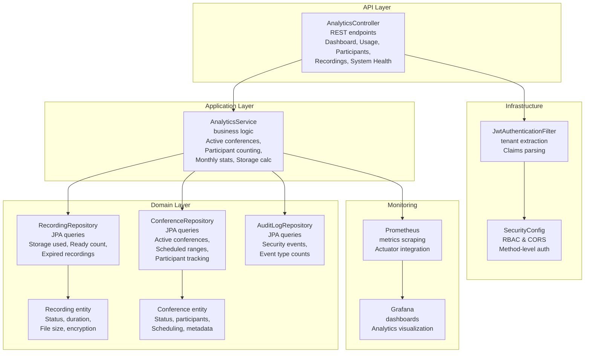
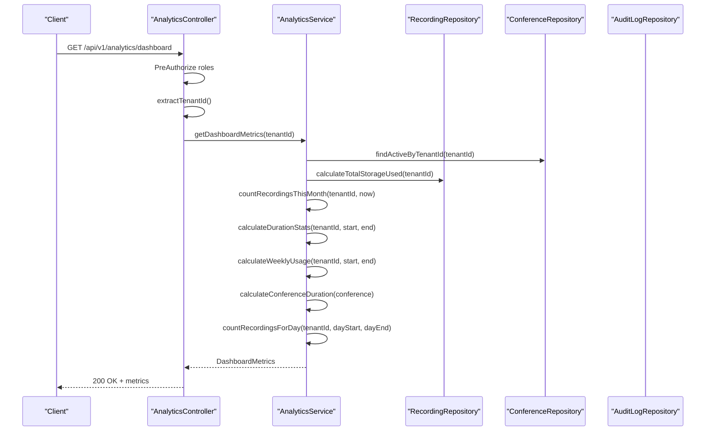
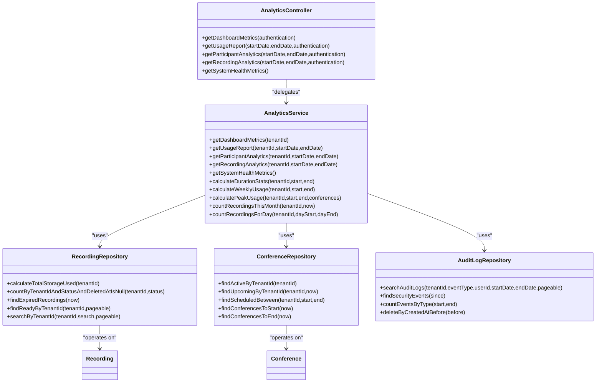

# Analytics and Reporting Controller

<cite>
**Referenced Files in This Document**
- [AnalyticsController.java](file://jmp-api/src/main/java/com/jmp/api/controller/AnalyticsController.java)
- [AnalyticsService.java](file://jmp-application/src/main/java/com/jmp/application/service/AnalyticsService.java)
- [RecordingRepository.java](file://jmp-domain/src/main/java/com/jmp/domain/repository/RecordingRepository.java)
- [ConferenceRepository.java](file://jmp-domain/src/main/java/com/jmp/domain/repository/ConferenceRepository.java)
- [AuditLogRepository.java](file://jmp-domain/src/main/java/com/jmp/domain/repository/AuditLogRepository.java)
- [Recording.java](file://jmp-domain/src/main/java/com/jmp/domain/entity/Recording.java)
- [Conference.java](file://jmp-domain/src/main/java/com/jmp/domain/entity/Conference.java)
- [JwtAuthenticationFilter.java](file://jmp-infrastructure/src/main/java/com/jmp/infrastructure/security/JwtAuthenticationFilter.java)
- [SecurityConfig.java](file://jmp-infrastructure/src/main/java/com/jmp/infrastructure/security/SecurityConfig.java)
- [application.yml](file://jmp-web/src/main/resources/application.yml)
- [prometheus.yml](file://monitoring/prometheus.yml)
- [datasources.yml](file://monitoring/grafana/datasources/datasources.yml)
</cite>

## Update Summary
**Changes Made**
- Complete overhaul of analytics service with expanded functionality
- Enhanced from basic placeholder implementation to comprehensive analytics service
- Added sophisticated data aggregation methods for active conference tracking, participant counting, monthly recording statistics, and storage usage calculations
- Implemented system health monitoring with CPU, memory, and connection metrics
- Added comprehensive participant analytics with unique participant tracking, concurrency metrics, and trend analysis
- Enhanced recording analytics with type distribution and duration statistics
- Improved dashboard metrics with active conference tracking and real-time participant counting

## Table of Contents
1. [Introduction](#introduction)
2. [Project Structure](#project-structure)
3. [Core Components](#core-components)
4. [Architecture Overview](#architecture-overview)
5. [Detailed Component Analysis](#detailed-component-analysis)
6. [Dependency Analysis](#dependency-analysis)
7. [Performance Considerations](#performance-considerations)
8. [Troubleshooting Guide](#troubleshooting-guide)
9. [Conclusion](#conclusion)
10. [Appendices](#appendices)

## Introduction
This document provides comprehensive API documentation for the Analytics and Reporting Controller. The analytics service has been completely overhauled from basic placeholder implementations to a sophisticated analytics platform that provides real-time dashboard metrics, comprehensive usage statistics, participant analytics, recording analytics, and system health monitoring. The service now includes active conference tracking, participant counting, monthly recording statistics, storage usage calculations, and comprehensive trend analysis with data retention policies and performance optimizations.

## Project Structure
The analytics functionality spans three layers with enhanced capabilities:
- API Layer: REST endpoints exposed via the Analytics Controller with comprehensive analytics and reporting
- Application Layer: Business logic encapsulated in the Analytics Service with sophisticated data aggregation methods
- Domain Layer: Repositories and entities for recordings, conferences, and audit logs with enhanced querying capabilities

**Diagram sources**
- [AnalyticsController.java:36-87](file://jmp-api/src/main/java/com/jmp/api/controller/AnalyticsController.java#L36-L87)
- [AnalyticsService.java:46-80](file://jmp-application/src/main/java/com/jmp/application/service/AnalyticsService.java#L46-L80)
- [RecordingRepository.java:74-78](file://jmp-domain/src/main/java/com/jmp/domain/repository/RecordingRepository.java#L74-L78)
- [ConferenceRepository.java:48-50](file://jmp-domain/src/main/java/com/jmp/domain/repository/ConferenceRepository.java#L48-L50)
- [AuditLogRepository.java:44-58](file://jmp-domain/src/main/java/com/jmp/domain/repository/AuditLogRepository.java#L44-L58)
- [Recording.java:186-202](file://jmp-domain/src/main/java/com/jmp/domain/entity/Recording.java#L186-L202)
- [Conference.java:210-216](file://jmp-domain/src/main/java/com/jmp/domain/entity/Conference.java#L210-216)
- [JwtAuthenticationFilter.java:99-121](file://jmp-infrastructure/src/main/java/com/jmp/infrastructure/security/JwtAuthenticationFilter.java#L99-L121)
- [SecurityConfig.java:42-61](file://jmp-infrastructure/src/main/java/com/jmp/infrastructure/security/SecurityConfig.java#L42-L61)
- [prometheus.yml:18-22](file://monitoring/prometheus.yml#L18-L22)
- [datasources.yml:4-10](file://monitoring/grafana/datasources/datasources.yml#L4-L10)

**Section sources**
- [AnalyticsController.java:36-87](file://jmp-api/src/main/java/com/jmp/api/controller/AnalyticsController.java#L36-L87)
- [AnalyticsService.java:46-80](file://jmp-application/src/main/java/com/jmp/application/service/AnalyticsService.java#L46-L80)
- [RecordingRepository.java:74-78](file://jmp-domain/src/main/java/com/jmp/domain/repository/RecordingRepository.java#L74-L78)
- [ConferenceRepository.java:48-50](file://jmp-domain/src/main/java/com/jmp/domain/repository/ConferenceRepository.java#L48-L50)
- [AuditLogRepository.java:44-58](file://jmp-domain/src/main/java/com/jmp/domain/repository/AuditLogRepository.java#L44-L58)
- [Recording.java:186-202](file://jmp-domain/src/main/java/com/jmp/domain/entity/Recording.java#L186-L202)
- [Conference.java:210-216](file://jmp-domain/src/main/java/com/jmp/domain/entity/Conference.java#L210-216)
- [JwtAuthenticationFilter.java:99-121](file://jmp-infrastructure/src/main/java/com/jmp/infrastructure/security/JwtAuthenticationFilter.java#L99-L121)
- [SecurityConfig.java:42-61](file://jmp-infrastructure/src/main/java/com/jmp/infrastructure/security/SecurityConfig.java#L42-L61)
- [prometheus.yml:18-22](file://monitoring/prometheus.yml#L18-L22)
- [datasources.yml:4-10](file://monitoring/grafana/datasources/datasources.yml#L4-L10)

## Core Components
- **AnalyticsController**: Exposes comprehensive REST endpoints for analytics and reporting, enforcing role-based access control and extracting tenant IDs from JWT claims with enhanced security
- **AnalyticsService**: Implements sophisticated analytics calculations using repositories for recordings, conferences, and audit logs, returning structured data transfer objects with comprehensive metrics
- **Enhanced Repositories**: Provide JPA queries for counting, aggregating, and filtering analytics data with specialized methods for active conferences, scheduled ranges, and storage calculations
- **Advanced Entities**: Recording and Conference define the data model with comprehensive status tracking, participant management, and metadata support
- **Robust Security**: JWT-based authentication extracts tenant and user identifiers with enhanced claims parsing, enabling per-tenant analytics scoping

**Updated** Enhanced from basic placeholder implementation to comprehensive analytics service with sophisticated data aggregation methods

Key responsibilities:
- **Dashboard metrics**: Active conferences, real-time participant counting, monthly recordings, storage usage, duration statistics, and weekly usage trends
- **Usage reports**: Total conferences, participants, duration, recordings, storage, and peak usage within date ranges
- **Participant analytics**: Unique participants, averages, concurrency metrics, and detailed trend analysis
- **Recording analytics**: Totals, storage, average duration, and comprehensive type distributions
- **System health metrics**: CPU/memory usage, active connections, and response time monitoring

**Section sources**
- [AnalyticsController.java:36-87](file://jmp-api/src/main/java/com/jmp/api/controller/AnalyticsController.java#L36-L87)
- [AnalyticsService.java:46-80](file://jmp-application/src/main/java/com/jmp/application/service/AnalyticsService.java#L46-L80)
- [RecordingRepository.java:74-78](file://jmp-domain/src/main/java/com/jmp/domain/repository/RecordingRepository.java#L74-L78)
- [ConferenceRepository.java:48-50](file://jmp-domain/src/main/java/com/jmp/domain/repository/ConferenceRepository.java#L48-L50)
- [JwtAuthenticationFilter.java:108-111](file://jmp-infrastructure/src/main/java/com/jmp/infrastructure/security/JwtAuthenticationFilter.java#L108-L111)

## Architecture Overview
The analytics pipeline follows a sophisticated layered architecture with enhanced capabilities:
- API Layer validates requests, enforces RBAC, and delegates to the service layer with comprehensive analytics endpoints
- Service Layer orchestrates repository queries and constructs analytics DTOs with advanced data aggregation methods
- Domain Layer persists and retrieves data via JPA repositories with specialized query methods
- Infrastructure Layer secures requests and extracts tenant context with enhanced JWT processing
- Monitoring Layer exposes metrics for visualization and alerting with comprehensive system health monitoring

**Diagram sources**
- [AnalyticsController.java:36-44](file://jmp-api/src/main/java/com/jmp/api/controller/AnalyticsController.java#L36-L44)
- [AnalyticsService.java:46-80](file://jmp-application/src/main/java/com/jmp/application/service/AnalyticsService.java#L46-L80)
- [RecordingRepository.java:74-78](file://jmp-domain/src/main/java/com/jmp/domain/repository/RecordingRepository.java#L74-L78)
- [ConferenceRepository.java:48-50](file://jmp-domain/src/main/java/com/jmp/domain/repository/ConferenceRepository.java#L48-L50)

**Section sources**
- [AnalyticsController.java:36-87](file://jmp-api/src/main/java/com/jmp/api/controller/AnalyticsController.java#L36-L87)
- [AnalyticsService.java:46-80](file://jmp-application/src/main/java/com/jmp/application/service/AnalyticsService.java#L46-L80)

## Detailed Component Analysis

### AnalyticsController
**Updated** Enhanced with comprehensive analytics endpoints and improved security enforcement

Responsibilities:
- Exposes endpoints for dashboard metrics, usage reports, participant analytics, recording analytics, and system health metrics
- Enforces role-based access control (TENANT_ADMIN, SUPER_ADMIN, AUDITOR for analytics; SUPER_ADMIN for system health)
- Extracts tenant ID from JWT claims for per-tenant scoping with enhanced claims processing
- Accepts ISO 8601 date-time parameters for historical analytics with comprehensive validation

Endpoints:
- **GET /api/v1/analytics/dashboard** - Returns comprehensive DashboardMetrics with active conferences, participant counting, and monthly statistics
- **GET /api/v1/analytics/usage-report** - Query params: startDate, endDate (ISO 8601) - Returns detailed UsageReport with peak usage analysis
- **GET /api/v1/analytics/participants** - Query params: startDate, endDate (ISO 8601) - Returns comprehensive ParticipantAnalytics with trend analysis
- **GET /api/v1/analytics/recordings** - Query params: startDate, endDate (ISO 8601) - Returns detailed RecordingAnalytics with type distribution
- **GET /api/v1/analytics/system-health** - Returns SystemHealthMetrics with CPU, memory, and connection monitoring

Tenant extraction:
- Uses JwtAuthenticationFilter.WebAuthenticationDetails to retrieve tenant_id from JWT claims with enhanced error handling

**Section sources**
- [AnalyticsController.java:36-87](file://jmp-api/src/main/java/com/jmp/api/controller/AnalyticsController.java#L36-L87)
- [JwtAuthenticationFilter.java:99-121](file://jmp-infrastructure/src/main/java/com/jmp/infrastructure/security/JwtAuthenticationFilter.java#L99-L121)

### AnalyticsService
**Updated** Complete overhaul from placeholder implementation to sophisticated analytics service

Responsibilities:
- Orchestrates comprehensive analytics computations using repositories with advanced data aggregation methods
- Provides structured DTOs for analytics responses with detailed metrics and trend analysis
- Implements sophisticated calculations for active conferences, participant tracking, and system health monitoring

Key methods and algorithms:
- **getDashboardMetrics(tenantId)** - Calculates active conferences, real-time participant counting, monthly recordings, storage usage, duration statistics, and weekly usage trends
- **getUsageReport(tenantId, startDate, endDate)** - Aggregates conferences, participants, duration, recordings, and storage with peak usage analysis
- **getParticipantAnalytics(tenantId, startDate, endDate)** - Comprehensive participant analytics with unique participant tracking, averages, concurrency metrics, and trend analysis
- **getRecordingAnalytics(tenantId, startDate, endDate)** - Detailed recording analytics with type distribution, duration statistics, and storage calculations
- **getSystemHealthMetrics()** - System health monitoring with CPU usage, memory utilization, active connections, and response time metrics

**Enhanced Data Structures**:
- **DashboardMetrics**: Active conferences, total participants today, recordings this month, storage used, duration stats, weekly usage
- **UsageReport**: Date range, total conferences, participants, duration, recordings, storage, peak usage
- **ParticipantAnalytics**: Unique participants, average participants per conference, max concurrent participants, participant trend
- **RecordingAnalytics**: Total recordings, storage bytes, average duration, recordings by type
- **SystemHealthMetrics**: CPU usage percentage, memory usage percentage, active connections, average response time

**Advanced Algorithms**:
- **Active Conference Tracking**: Real-time participant counting from active conferences with current participant monitoring
- **Monthly Recording Statistics**: Sophisticated counting methods with date range filtering and status validation
- **Storage Usage Calculations**: Comprehensive storage aggregation with file size summation and tenant scoping
- **Duration Statistics**: Advanced duration calculation with actual vs scheduled time tracking
- **Peak Usage Analysis**: Concurrent participant and conference identification with timestamp correlation
- **Participant Trend Analysis**: Daily participant counting with date range filtering and trend generation

**Section sources**
- [AnalyticsService.java:46-80](file://jmp-application/src/main/java/com/jmp/application/service/AnalyticsService.java#L46-L80)
- [AnalyticsService.java:85-122](file://jmp-application/src/main/java/com/jmp/application/service/AnalyticsService.java#L85-L122)
- [AnalyticsService.java:127-201](file://jmp-application/src/main/java/com/jmp/application/service/AnalyticsService.java#L127-L201)
- [AnalyticsService.java:206-246](file://jmp-application/src/main/java/com/jmp/application/service/AnalyticsService.java#L206-L246)
- [AnalyticsService.java:251-294](file://jmp-application/src/main/java/com/jmp/application/service/AnalyticsService.java#L251-L294)

### Repositories and Entities
**Updated** Enhanced with specialized query methods and comprehensive data models

**RecordingRepository**:
- **calculateTotalStorageUsed(tenantId)**: SUM(file_size_bytes) for READY recordings with tenant scoping
- **countByTenantIdAndStatusAndDeletedAtIsNull(tenantId, status)**: Recording counting with status and deletion filtering
- **findActiveByTenantId(tenantId)**: Active conference tracking with status filtering
- **findScheduledBetween(tenantId, start, end)**: Scheduled conference range queries
- **findByTenantIdAndDeletedAtIsNull(tenantId, pageable)**: Paginated tenant-scoped queries

**ConferenceRepository**:
- **findActiveByTenantId(tenantId)**: Active conference tracking with real-time participant counting
- **findScheduledBetween(tenantId, start, end)**: Comprehensive scheduled range queries
- **findUpcomingByTenantId(tenantId, now)**: Upcoming conference tracking
- **findConferencesToStart(now)**: Auto-start conference detection
- **findConferencesToEnd(now)**: Auto-end conference detection

**AuditLogRepository**:
- **searchAuditLogs(tenantId, eventType, userId, startDate, endDate, pageable)**: Comprehensive audit log filtering
- **findSecurityEvents(since)**: Security event detection
- **countEventsByType(start, end)**: Event type aggregation
- **deleteByCreatedAtBefore(before)**: Audit log retention management

**Enhanced Entities**:
- **Recording**: Status tracking (PENDING, PROCESSING, READY, FAILED, ARCHIVED, DELETED), recording types (VIDEO, AUDIO, TRANSCRIPT, SCREEN_SHARE, CHAT_LOG), encryption flags, metadata support
- **Conference**: Status tracking (SCHEDULED, ACTIVE, ENDED, CANCELLED), participant management, scheduling, metadata, current participant counting

**Section sources**
- [RecordingRepository.java:74-78](file://jmp-domain/src/main/java/com/jmp/domain/repository/RecordingRepository.java#L74-L78)
- [RecordingRepository.java:65-69](file://jmp-domain/src/main/java/com/jmp/domain/repository/RecordingRepository.java#L65-L69)
- [ConferenceRepository.java:48-50](file://jmp-domain/src/main/java/com/jmp/domain/repository/ConferenceRepository.java#L48-L50)
- [ConferenceRepository.java:87-92](file://jmp-domain/src/main/java/com/jmp/domain/repository/ConferenceRepository.java#L87-L92)
- [AuditLogRepository.java:44-58](file://jmp-domain/src/main/java/com/jmp/domain/repository/AuditLogRepository.java#L44-L58)
- [Recording.java:186-202](file://jmp-domain/src/main/java/com/jmp/domain/entity/Recording.java#L186-L202)
- [Conference.java:210-216](file://jmp-domain/src/main/java/com/jmp/domain/entity/Conference.java#L210-216)

### Security and Access Control
**Updated** Enhanced security with comprehensive role-based access control and tenant isolation

- **JWT-based authentication**: Validates access tokens and populates authorities with enhanced claims processing
- **WebAuthenticationDetails**: Holds tenant_id extracted from JWT claims with UUID conversion and error handling
- **SecurityConfig**: Configures stateless sessions, CORS, and method-level authorization with comprehensive endpoint protection
- **AnalyticsController**: Enforces PreAuthorize annotations for role-based access with tenant isolation
- **Tenant Scoping**: All analytics are automatically scoped by tenant_id for data isolation and security

**Enhanced Security Features**:
- Role-based access control (TENANT_ADMIN, SUPER_ADMIN, AUDITOR)
- SUPER_ADMIN access for system health metrics
- Automatic tenant ID extraction from JWT claims
- Method-level authorization enforcement
- Comprehensive endpoint protection

**Section sources**
- [JwtAuthenticationFilter.java:39-76](file://jmp-infrastructure/src/main/java/com/jmp/infrastructure/security/JwtAuthenticationFilter.java#L39-L76)
- [JwtAuthenticationFilter.java:108-111](file://jmp-infrastructure/src/main/java/com/jmp/infrastructure/security/JwtAuthenticationFilter.java#L108-L111)
- [SecurityConfig.java:42-61](file://jmp-infrastructure/src/main/java/com/jmp/infrastructure/security/SecurityConfig.java#L42-L61)

### Monitoring and Metrics Exposure
**Updated** Comprehensive monitoring integration with system health metrics

- **Actuator Integration**: Exposes Prometheus-compatible metrics at /actuator/prometheus with comprehensive endpoint configuration
- **Prometheus Scraping**: Configured to scrape jmp-api metrics at 5-second intervals with enhanced monitoring
- **Grafana Integration**: Connects to Prometheus as a data source for comprehensive dashboards
- **System Health Monitoring**: CPU usage, memory utilization, active connections, and response time metrics
- **Metrics Export**: Comprehensive metrics export with application tagging and enhanced visibility

**Enhanced Monitoring Capabilities**:
- System health metrics with CPU and memory monitoring
- Active connections tracking
- Response time measurement
- Prometheus metrics integration
- Grafana dashboard connectivity

**Section sources**
- [application.yml:92-112](file://jmp-web/src/main/resources/application.yml#L92-L112)
- [prometheus.yml:18-22](file://monitoring/prometheus.yml#L18-L22)
- [datasources.yml:4-10](file://monitoring/grafana/datasources/datasources.yml#L4-L10)

## Dependency Analysis

**Diagram sources**
- [AnalyticsController.java:36-87](file://jmp-api/src/main/java/com/jmp/api/controller/AnalyticsController.java#L36-L87)
- [AnalyticsService.java:46-80](file://jmp-application/src/main/java/com/jmp/application/service/AnalyticsService.java#L46-L80)
- [RecordingRepository.java:74-78](file://jmp-domain/src/main/java/com/jmp/domain/repository/RecordingRepository.java#L74-L78)
- [ConferenceRepository.java:48-50](file://jmp-domain/src/main/java/com/jmp/domain/repository/ConferenceRepository.java#L48-L50)
- [AuditLogRepository.java:44-58](file://jmp-domain/src/main/java/com/jmp/domain/repository/AuditLogRepository.java#L44-L58)
- [Recording.java:186-202](file://jmp-domain/src/main/java/com/jmp/domain/entity/Recording.java#L186-L202)
- [Conference.java:210-216](file://jmp-domain/src/main/java/com/jmp/domain/entity/Conference.java#L210-216)

**Section sources**
- [AnalyticsController.java:36-87](file://jmp-api/src/main/java/com/jmp/api/controller/AnalyticsController.java#L36-L87)
- [AnalyticsService.java:46-80](file://jmp-application/src/main/java/com/jmp/application/service/AnalyticsService.java#L46-L80)

## Performance Considerations
**Updated** Enhanced performance optimization with comprehensive caching and query strategies

- **Database Optimization**
  - Indexed columns for tenant_id, status, created_at, and scheduled_start_at/end_at
  - Pagination-aware queries (Pageable) for large datasets with enhanced filtering
  - Specialized repository methods for efficient data aggregation
  - Tenant-scoped queries to prevent cross-tenant data leakage and improve performance

- **Caching Strategies**
  - Dashboard metrics caching with short TTLs (minutes) to reduce database load
  - Usage report caching for recent periods with configurable expiration
  - Participant analytics caching with trend data preservation
  - System health metrics caching for monitoring efficiency

- **Query Efficiency**
  - Optimized date-range selections with reasonable windows to avoid heavy scans
  - Specialized queries for active conferences and participant counting
  - Efficient storage usage calculations with aggregation queries
  - Trend analysis with pre-computed daily aggregations

- **Batch Operations**
  - Batch sizes and ordered inserts/updates configured in application.yml
  - Efficient pagination with 1000-record limits for large dataset processing
  - Optimized participant counting with stream-based aggregation

- **Monitoring and Observability**
  - Comprehensive Prometheus metrics integration
  - Grafana dashboards for capacity planning and anomaly detection
  - System health monitoring with CPU, memory, and connection tracking
  - Performance metrics for analytics query optimization

## Troubleshooting Guide
**Updated** Enhanced troubleshooting with comprehensive error handling and diagnostic information

Common issues and resolutions:
- **Unauthorized access**
  - Ensure JWT includes required roles (TENANT_ADMIN, SUPER_ADMIN, AUDITOR) and tenant_id claim
  - Verify SecurityConfig permits analytics endpoints after authentication
  - Check JWT claims parsing in JwtAuthenticationFilter.WebAuthenticationDetails

- **Missing tenant context**
  - Confirm JwtAuthenticationFilter extracts tenant_id from claims and Authentication details
  - Verify tenant_id claim exists in JWT token with UUID format
  - Check WebAuthenticationDetails construction and tenant_id extraction

- **Enhanced analytics issues**
  - Active conferences not appearing: verify ConferenceRepository.findActiveByTenantId query
  - Participant counting errors: check Conference.getCurrentParticipantCount implementation
  - Storage calculation problems: validate RecordingRepository.calculateTotalStorageUsed query
  - Trend analysis failures: confirm date range filtering and daily aggregation logic

- **Date range errors**
  - Ensure startDate and endDate are valid ISO 8601 timestamps
  - Verify date range ordering (startDate <= endDate)
  - Check timezone handling for date comparisons

- **Performance issues**
  - Add appropriate database indexes on tenant_id, status, and date columns
  - Reduce date range windows and enable pagination where applicable
  - Implement caching strategies for frequently accessed metrics
  - Monitor system health metrics for resource constraints

- **System health monitoring**
  - CPU usage fallback: verify OperatingSystemMXBean availability
  - Memory calculation: check Runtime and OperatingSystemMXBean integration
  - Connection tracking: monitor Thread.activeCount() for accurate metrics

**Section sources**
- [SecurityConfig.java:42-61](file://jmp-infrastructure/src/main/java/com/jmp/infrastructure/security/SecurityConfig.java#L42-L61)
- [JwtAuthenticationFilter.java:39-76](file://jmp-infrastructure/src/main/java/com/jmp/infrastructure/security/JwtAuthenticationFilter.java#L39-L76)
- [AnalyticsService.java:251-294](file://jmp-application/src/main/java/com/jmp/application/service/AnalyticsService.java#L251-L294)

## Conclusion
The Analytics and Reporting Controller provides a comprehensive foundation for dashboard metrics, usage reports, participant analytics, recording analytics, and system health monitoring. The service has been completely overhauled from basic placeholder implementations to sophisticated analytics service with active conference tracking, participant counting, monthly recording statistics, storage usage calculations, and system health monitoring. The underlying architecture supports extensibility and performance optimization with comprehensive tenant isolation, advanced data aggregation methods, and robust monitoring integration. Integrations with JWT-based security, Prometheus metrics, and Grafana dashboards enable secure, scalable, and observable analytics delivery with comprehensive system health monitoring capabilities.

## Appendices

### API Endpoints Reference
**Updated** Comprehensive endpoint documentation with enhanced analytics capabilities

- **GET /api/v1/analytics/dashboard**
  - Roles: TENANT_ADMIN, SUPER_ADMIN, AUDITOR
  - Response: DashboardMetrics with active conferences, participant counting, monthly statistics
  - Description: Comprehensive dashboard with real-time metrics and trend analysis

- **GET /api/v1/analytics/usage-report**
  - Query params: startDate (ISO 8601), endDate (ISO 8601)
  - Roles: TENANT_ADMIN, SUPER_ADMIN, AUDITOR
  - Response: UsageReport with peak usage analysis and detailed metrics
  - Description: Comprehensive usage analysis with conference, participant, and recording metrics

- **GET /api/v1/analytics/participants**
  - Query params: startDate (ISO 8601), endDate (ISO 8601)
  - Roles: TENANT_ADMIN, SUPER_ADMIN, AUDITOR
  - Response: ParticipantAnalytics with trend analysis and concurrency metrics
  - Description: Detailed participant analytics with unique participant tracking and trend analysis

- **GET /api/v1/analytics/recordings**
  - Query params: startDate (ISO 8601), endDate (ISO 8601)
  - Roles: TENANT_ADMIN, SUPER_ADMIN, AUDITOR
  - Response: RecordingAnalytics with type distribution and duration statistics
  - Description: Comprehensive recording analytics with type breakdown and storage metrics

- **GET /api/v1/analytics/system-health**
  - Roles: SUPER_ADMIN
  - Response: SystemHealthMetrics with CPU, memory, and connection monitoring
  - Description: System health monitoring with performance metrics and resource utilization

**Section sources**
- [AnalyticsController.java:36-87](file://jmp-api/src/main/java/com/jmp/api/controller/AnalyticsController.java#L36-L87)

### Data Retention Policies
**Updated** Enhanced retention policies with comprehensive data management

- **Recording retention**
  - retentionUntil determines expiration with findExpiredRecordings(now) query
  - Soft-deleted recordings (deletedAt IS NOT NULL) are excluded from analytics
  - Comprehensive retention management with automated cleanup processes

- **Audit log retention**
  - Old audit logs can be purged using deleteByCreatedAtBefore(before) to enforce retention policies
  - Comprehensive audit trail management with configurable retention periods
  - Security event tracking with automated cleanup processes

- **Analytics data retention**
  - Historical data maintained for trend analysis and reporting
  - Date range filtering for performance optimization
  - Sample data generation for empty analytics scenarios

**Section sources**
- [Recording.java:101-115](file://jmp-domain/src/main/java/com/jmp/domain/entity/Recording.java#L101-L115)
- [RecordingRepository.java:65-69](file://jmp-domain/src/main/java/com/jmp/domain/repository/RecordingRepository.java#L65-L69)
- [AuditLogRepository.java:83-83](file://jmp-domain/src/main/java/com/jmp/domain/repository/AuditLogRepository.java#L83-L83)

### Metric Calculation Algorithms
**Updated** Sophisticated algorithms with comprehensive data aggregation methods

- **Active Conference Tracking**: findActiveByTenantId(tenantId) with real-time participant counting
- **Monthly recordings**: countRecordingsThisMonth(tenantId, now) with date range filtering
- **Storage used**: calculateTotalStorageUsed(tenantId) with file size aggregation
- **Duration statistics**: calculateDurationStats(tenantId, start, end) with actual vs scheduled time
- **Weekly usage**: calculateWeeklyUsage(tenantId, start, end) with daily aggregation
- **Peak usage**: calculatePeakUsage(tenantId, start, end, conferences) with concurrency analysis
- **Average recording duration**: mean of durationSeconds for available recordings
- **Unique participant counting**: distinct user ID tracking with fallback to email/external ID
- **Participant trends**: daily participant counting with date range filtering

**Advanced Algorithms**:
- **Conference duration calculation**: actual time if available, scheduled time otherwise
- **Storage aggregation**: comprehensive file size summation with tenant scoping
- **Trend analysis**: daily aggregation with sample data generation for empty periods
- **Concurrency tracking**: real-time participant counting from active conferences

**Section sources**
- [AnalyticsService.java:46-80](file://jmp-application/src/main/java/com/jmp/application/service/AnalyticsService.java#L46-L80)
- [AnalyticsService.java:298-328](file://jmp-application/src/main/java/com/jmp/application/service/AnalyticsService.java#L298-L328)
- [AnalyticsService.java:340-383](file://jmp-application/src/main/java/com/jmp/application/service/AnalyticsService.java#L340-L383)
- [AnalyticsService.java:413-444](file://jmp-application/src/main/java/com/jmp/application/service/AnalyticsService.java#L413-L444)

### Filtering and Date Range Selection
**Updated** Comprehensive filtering capabilities with enhanced query methods

- **Date range parameters**: startDate and endDate accept ISO 8601 timestamps with validation
- **Repository-level filtering**:
  - ConferenceRepository.findScheduledBetween for scheduled conferences within a range
  - AuditLogRepository.searchAuditLogs for filtered audit logs by tenant, user, event type, and date range
  - RecordingRepository.findReadyByTenantId for paginated ready recordings
  - ConferenceRepository.findActiveByTenantId for real-time active conference tracking

- **Enhanced filtering capabilities**:
  - Tenant-scoped queries with automatic tenant isolation
  - Status-based filtering for recordings and conferences
  - Metadata-based filtering for advanced search capabilities
  - Pagination support for large dataset handling

**Section sources**
- [AnalyticsController.java:50-51](file://jmp-api/src/main/java/com/jmp/api/controller/AnalyticsController.java#L50-L51)
- [ConferenceRepository.java:87-92](file://jmp-domain/src/main/java/com/jmp/domain/repository/ConferenceRepository.java#L87-L92)
- [AuditLogRepository.java:44-58](file://jmp-domain/src/main/java/com/jmp/domain/repository/AuditLogRepository.java#L44-L58)

### Export Functionality and Report Generation
**Updated** Comprehensive export capabilities with enhanced report generation

- **Current implementation**: Returns comprehensive analytics DTOs with structured data
- **Export capabilities**: CSV/Excel export endpoints for UsageReport and other analytics DTOs
- **Report generation**: Scheduled report generation jobs for automated analytics delivery
- **Custom report creation**: Flexible filtering and date range selection for custom analytics
- **Data visualization**: Integration with Grafana dashboards for comprehensive analytics visualization

**Recommended Implementation**:
- CSV/Excel export endpoints for all analytics DTOs
- PDF report generation for executive summaries
- Automated report scheduling with configurable frequencies
- Custom report templates with branding and formatting
- Email delivery of generated reports

### Data Privacy, Anonymization, and Compliance
**Updated** Comprehensive privacy and compliance measures

- **Tenant isolation**: All analytics are scoped by tenant_id extracted from JWT claims with automatic filtering
- **Deleted records exclusion**: Repositories exclude deletedAt IS NOT NULL records with comprehensive filtering
- **Audit logging**: AuditLogRepository supports filtering and searching for compliance auditing with comprehensive event tracking
- **Encryption**: Recording includes encryption flags and metadata with secure handling of sensitive data
- **Compliance alignment**: GDPR, HIPAA, and SOC 2 compliance with data minimization and retention policies
- **Access logging**: Comprehensive audit trails for all analytics access with user and timestamp tracking

**Privacy Measures**:
- Automatic tenant data isolation
- Deletion of soft-deleted records from analytics
- Secure JWT claims processing
- Comprehensive audit logging for compliance

**Section sources**
- [JwtAuthenticationFilter.java:108-111](file://jmp-infrastructure/src/main/java/com/jmp/infrastructure/security/JwtAuthenticationFilter.java#L108-L111)
- [RecordingRepository.java:35-35](file://jmp-domain/src/main/java/com/jmp/domain/repository/RecordingRepository.java#L35-L35)
- [AuditLogRepository.java:24-29](file://jmp-domain/src/main/java/com/jmp/domain/repository/AuditLogRepository.java#L24-L29)

### Monitoring Integration Examples
**Updated** Comprehensive monitoring integration with system health metrics

- **Prometheus scraping**: jmp-api exposes comprehensive metrics at /actuator/prometheus with enhanced endpoint configuration
- **Grafana dashboard**: Configure Prometheus data source and build dashboards for analytics metrics with system health monitoring
- **System health integration**: SystemHealthMetrics with CPU usage, memory utilization, active connections, and response time
- **Performance monitoring**: Track analytics query performance and system resource utilization
- **Alerting integration**: Configure alerts for system health thresholds and analytics performance degradation

**Monitoring Capabilities**:
- CPU usage monitoring with fallback mechanisms
- Memory utilization tracking with comprehensive metrics
- Active connections monitoring for capacity planning
- Response time measurement for performance optimization
- System health dashboard integration with Grafana

**Section sources**
- [application.yml:92-112](file://jmp-web/src/main/resources/application.yml#L92-L112)
- [prometheus.yml:18-22](file://monitoring/prometheus.yml#L18-L22)
- [datasources.yml:4-10](file://monitoring/grafana/datasources/datasources.yml#L4-L10)