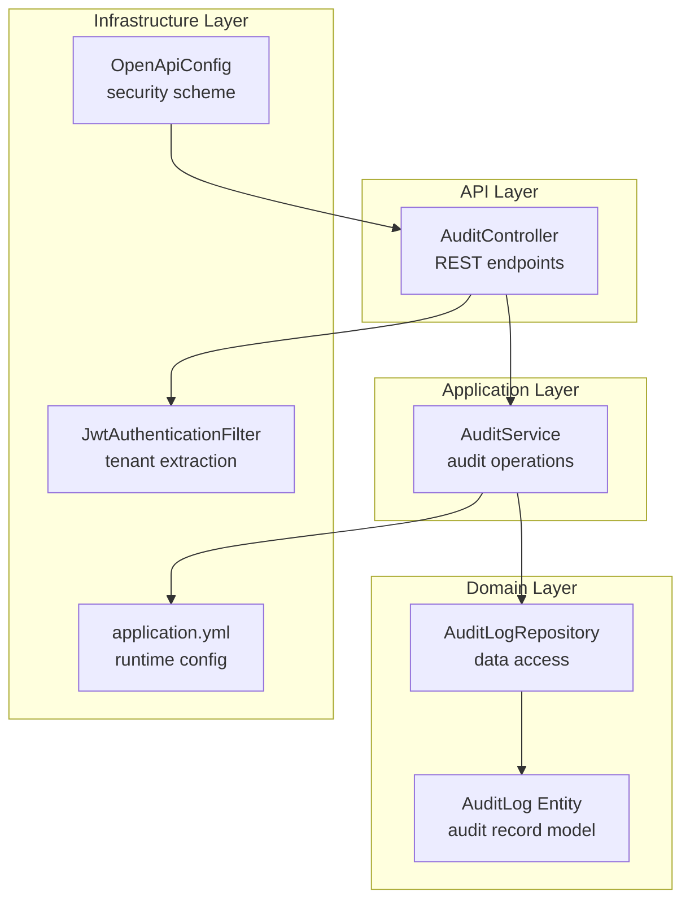
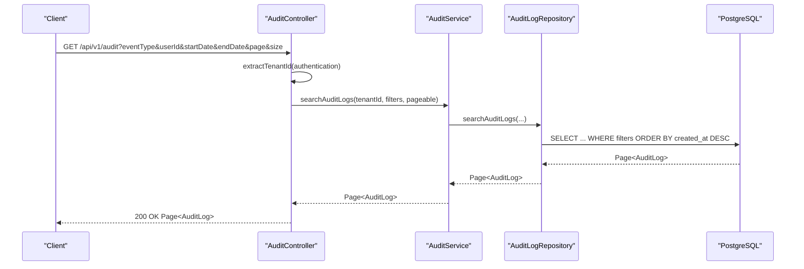
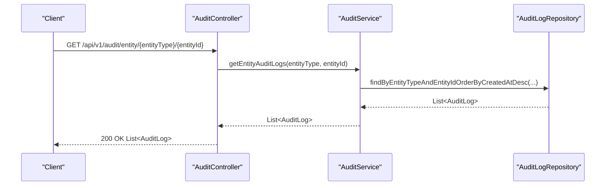
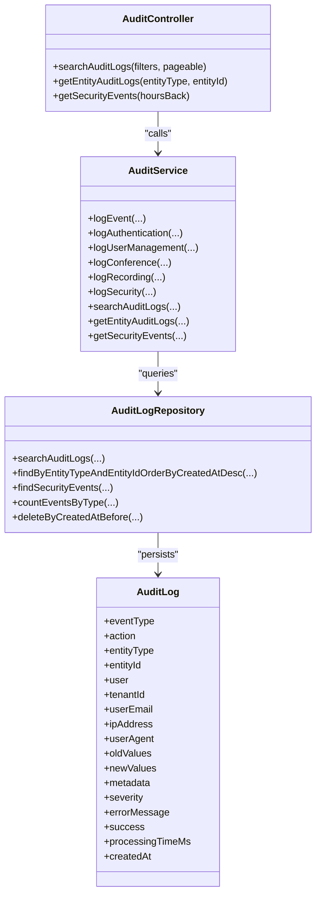

# Audit and Compliance Controller

<cite>
**Referenced Files in This Document**
- [AuditController.java](file://jmp-api/src/main/java/com/jmp/api/controller/AuditController.java)
- [AuditService.java](file://jmp-application/src/main/java/com/jmp/application/service/AuditService.java)
- [AuditLog.java](file://jmp-domain/src/main/java/com/jmp/domain/entity/AuditLog.java)
- [AuditLogRepository.java](file://jmp-domain/src/main/java/com/jmp/domain/repository/AuditLogRepository.java)
- [V4__create_audit_logs_table.sql](file://jmp-web/src/main/resources/db/migration/V4__create_audit_logs_table.sql)
- [JwtAuthenticationFilter.java](file://jmp-infrastructure/src/main/java/com/jmp/infrastructure/security/JwtAuthenticationFilter.java)
- [application.yml](file://jmp-web/src/main/resources/application.yml)
- [OpenApiConfig.java](file://jmp-api/src/main/java/com/jmp/api/config/OpenApiConfig.java)
</cite>

## Table of Contents
1. [Introduction](#introduction)
2. [Project Structure](#project-structure)
3. [Core Components](#core-components)
4. [Architecture Overview](#architecture-overview)
5. [Detailed Component Analysis](#detailed-component-analysis)
6. [Dependency Analysis](#dependency-analysis)
7. [Performance Considerations](#performance-considerations)
8. [Troubleshooting Guide](#troubleshooting-guide)
9. [Conclusion](#conclusion)
10. [Appendices](#appendices)

## Introduction
This document provides comprehensive API documentation for the Audit and Compliance Controller. It covers audit log retrieval endpoints, compliance reporting capabilities, and security monitoring interfaces. It also explains filtering and search features, export readiness, compliance requirements, audit trail preservation, regulatory reporting support, security event logging, user and system activity tracking, retention policies, log rotation, and archival procedures. Guidance is included for data privacy compliance, GDPR alignment, and audit trail integrity. Examples of audit workflows, compliance reporting, and integration with security monitoring systems are provided.

## Project Structure
The audit and compliance functionality spans four layers:
- API Layer: REST endpoints exposed by the Audit Controller
- Application Layer: Business logic encapsulated in the Audit Service
- Domain Layer: Entities and repositories for audit records
- Infrastructure Layer: Security and configuration supporting audit operations

**Diagram sources**
- [AuditController.java:30-81](file://jmp-api/src/main/java/com/jmp/api/controller/AuditController.java#L30-L81)
- [AuditService.java:22-206](file://jmp-application/src/main/java/com/jmp/application/service/AuditService.java#L22-L206)
- [AuditLog.java:20-135](file://jmp-domain/src/main/java/com/jmp/domain/entity/AuditLog.java#L20-L135)
- [AuditLogRepository.java:18-84](file://jmp-domain/src/main/java/com/jmp/domain/repository/AuditLogRepository.java#L18-L84)
- [JwtAuthenticationFilter.java:27-121](file://jmp-infrastructure/src/main/java/com/jmp/infrastructure/security/JwtAuthenticationFilter.java#L27-L121)
- [application.yml:71-128](file://jmp-web/src/main/resources/application.yml#L71-L128)
- [OpenApiConfig.java:20-54](file://jmp-api/src/main/java/com/jmp/api/config/OpenApiConfig.java#L20-L54)

**Section sources**
- [AuditController.java:30-81](file://jmp-api/src/main/java/com/jmp/api/controller/AuditController.java#L30-L81)
- [AuditService.java:22-206](file://jmp-application/src/main/java/com/jmp/application/service/AuditService.java#L22-L206)
- [AuditLog.java:20-135](file://jmp-domain/src/main/java/com/jmp/domain/entity/AuditLog.java#L20-L135)
- [AuditLogRepository.java:18-84](file://jmp-domain/src/main/java/com/jmp/domain/repository/AuditLogRepository.java#L18-L84)
- [JwtAuthenticationFilter.java:27-121](file://jmp-infrastructure/src/main/java/com/jmp/infrastructure/security/JwtAuthenticationFilter.java#L27-L121)
- [application.yml:71-128](file://jmp-web/src/main/resources/application.yml#L71-L128)
- [OpenApiConfig.java:20-54](file://jmp-api/src/main/java/com/jmp/api/config/OpenApiConfig.java#L20-L54)

## Core Components
- Audit Controller: Exposes REST endpoints for audit log retrieval, entity-specific audit history, and recent security events.
- Audit Service: Implements asynchronous audit logging, specialized logging helpers for authentication, user management, conference, recording, and security events, plus search and retrieval operations.
- Audit Log Entity: Defines the audit record schema, including event type, action, entity linkage, user and tenant identifiers, IP address, user agent, JSON fields for values and metadata, severity, success flag, error messages, processing time, and timestamps.
- Audit Log Repository: Provides paginated queries, filtered searches, security event retrieval, event counts by type, and retention cleanup.

Key capabilities:
- Tenant-aware audit log retrieval
- Filtering by event type, user, and date range
- Entity-scoped audit history
- Security event monitoring window
- Asynchronous audit logging with transaction isolation
- JSON-based auditing for structured change tracking

**Section sources**
- [AuditController.java:40-73](file://jmp-api/src/main/java/com/jmp/api/controller/AuditController.java#L40-L73)
- [AuditService.java:29-205](file://jmp-application/src/main/java/com/jmp/application/service/AuditService.java#L29-L205)
- [AuditLog.java:32-95](file://jmp-domain/src/main/java/com/jmp/domain/entity/AuditLog.java#L32-L95)
- [AuditLogRepository.java:21-83](file://jmp-domain/src/main/java/com/jmp/domain/repository/AuditLogRepository.java#L21-L83)

## Architecture Overview
The Audit and Compliance Controller follows a layered architecture with clear separation of concerns:
- API endpoints delegate to the Audit Service
- The Audit Service orchestrates repository operations and persists audit records
- The database schema supports efficient querying and indexing for audit analytics
- Security is enforced via JWT-based authentication and role-based authorization

**Diagram sources**
- [AuditController.java:40-53](file://jmp-api/src/main/java/com/jmp/api/controller/AuditController.java#L40-L53)
- [AuditService.java:178-189](file://jmp-application/src/main/java/com/jmp/application/service/AuditService.java#L178-L189)
- [AuditLogRepository.java:44-58](file://jmp-domain/src/main/java/com/jmp/domain/repository/AuditLogRepository.java#L44-L58)

**Section sources**
- [AuditController.java:40-53](file://jmp-api/src/main/java/com/jmp/api/controller/AuditController.java#L40-L53)
- [AuditService.java:178-189](file://jmp-application/src/main/java/com/jmp/application/service/AuditService.java#L178-L189)
- [AuditLogRepository.java:44-58](file://jmp-domain/src/main/java/com/jmp/domain/repository/AuditLogRepository.java#L44-L58)

## Detailed Component Analysis

### Audit Controller Endpoints
- Base Path: /api/v1/audit
- Authentication: Bearer JWT
- Authorization:
  - Search audit logs: TENANT_ADMIN, SUPER_ADMIN, AUDITOR
  - Entity audit logs: TENANT_ADMIN, SUPER_ADMIN, AUDITOR
  - Security events: SUPER_ADMIN, AUDITOR

Endpoints:
- GET /api/v1/audit
  - Query parameters:
    - eventType: enum AuditEventType
    - userId: UUID
    - startDate: ISO date-time
    - endDate: ISO date-time
    - page: integer (default managed by Pageable)
    - size: integer (default managed by Pageable)
  - Response: Page<AuditLog>
  - Purpose: Retrieve paginated audit logs with optional filters

- GET /api/v1/audit/entity/{entityType}/{entityId}
  - Path parameters:
    - entityType: string
    - entityId: UUID
  - Response: List<AuditLog>
  - Purpose: Retrieve all audit logs associated with a specific entity

- GET /api/v1/audit/security-events
  - Query parameters:
    - hoursBack: integer (default 24)
  - Response: List<AuditLog>
  - Purpose: Retrieve recent security and authentication events within the specified window

Tenant extraction:
- The controller extracts tenantId from the JWT claims via JwtAuthenticationFilter.WebAuthenticationDetails

**Section sources**
- [AuditController.java:40-73](file://jmp-api/src/main/java/com/jmp/api/controller/AuditController.java#L40-L73)
- [JwtAuthenticationFilter.java:99-120](file://jmp-infrastructure/src/main/java/com/jmp/infrastructure/security/JwtAuthenticationFilter.java#L99-L120)

### Audit Service Operations
Asynchronous audit logging:
- logEvent: Creates an AuditLog with event metadata, user, tenant, IP, user agent, old/new values, success/error details, and severity
- logAuthentication: Specialized logging for authentication actions
- logUserManagement: Specialized logging for user management actions
- logConference: Specialized logging for conference actions
- logRecording: Specialized logging for recording actions
- logSecurity: Specialized logging for security events

Search and retrieval:
- searchAuditLogs: Tenant-aware, filterable, paginated search
- getEntityAuditLogs: Retrieves all logs for a given entity type and ID ordered by creation time
- getSecurityEvents: Returns security and authentication events within a time window

**Section sources**
- [AuditService.java:29-205](file://jmp-application/src/main/java/com/jmp/application/service/AuditService.java#L29-L205)

### Audit Log Entity Schema
Fields:
- id: UUID
- eventType: enum AuditEventType
- action: string
- entityType: string
- entityId: UUID
- user: User (many-to-one)
- tenantId: UUID
- userEmail: string
- ipAddress: string
- userAgent: string
- oldValues: JSONB
- newValues: JSONB
- metadata: JSONB
- severity: string
- errorMessage: string
- success: boolean
- processingTimeMs: long
- createdAt: timestamp with timezone

Event Types:
- AUTHENTICATION, AUTHORIZATION, USER_MANAGEMENT, TENANT_MANAGEMENT, CONFERENCE, RECORDING, SYSTEM, SECURITY, API_CALL, WEBHOOK, CONFIGURATION

**Section sources**
- [AuditLog.java:32-95](file://jmp-domain/src/main/java/com/jmp/domain/entity/AuditLog.java#L32-L95)
- [AuditLog.java:122-134](file://jmp-domain/src/main/java/com/jmp/domain/entity/AuditLog.java#L122-L134)

### Audit Log Repository Queries
- findByTenantIdOrderByCreatedAtDesc
- findByUserIdOrderByCreatedAtDesc
- findByEventTypeOrderByCreatedAtDesc
- findByEntityTypeAndEntityIdOrderByCreatedAtDesc
- searchAuditLogs: tenantId, eventType, userId, startDate, endDate with pagination
- findBySuccessFalseOrderByCreatedAtDesc
- findSecurityEvents: security and authentication events since a timestamp
- countEventsByType: aggregates event counts by type over a date range
- deleteByCreatedAtBefore: retention-based cleanup

Indexes (schema):
- tenant_id, user_id, event_type, (entity_type, entity_id), created_at DESC, tenant_created, success=false

**Section sources**
- [AuditLogRepository.java:21-83](file://jmp-domain/src/main/java/com/jmp/domain/repository/AuditLogRepository.java#L21-L83)
- [V4__create_audit_logs_table.sql:25-32](file://jmp-web/src/main/resources/db/migration/V4__create_audit_logs_table.sql#L25-L32)

### Security Monitoring Interfaces
- Security events endpoint: GET /api/v1/audit/security-events with hoursBack parameter
- Repository-backed security event retrieval
- Event types included: SECURITY, AUTHENTICATION

**Section sources**
- [AuditController.java:65-73](file://jmp-api/src/main/java/com/jmp/api/controller/AuditController.java#L65-L73)
- [AuditLogRepository.java:66-70](file://jmp-domain/src/main/java/com/jmp/domain/repository/AuditLogRepository.java#L66-L70)

### Compliance Reporting and Export Functionality
- Paginated audit log search supports export preparation
- JSON fields (oldValues, newValues, metadata) enable structured export
- Security events retrieval supports incident reporting windows
- Event type aggregation enables basic compliance dashboards

Note: The current implementation exposes endpoints for retrieval and filtering. Export endpoints or bulk download endpoints are not present in the controller; however, the underlying data model and repository support export-ready operations.

**Section sources**
- [AuditController.java:40-73](file://jmp-api/src/main/java/com/jmp/api/controller/AuditController.java#L40-L73)
- [AuditLogRepository.java:75-78](file://jmp-domain/src/main/java/com/jmp/domain/repository/AuditLogRepository.java#L75-L78)

### Audit Trail Preservation and Integrity
- Immutable fields: id, createdAt
- Timestamp precision: timezone-aware
- Asynchronous logging with transaction propagation ensures durability
- Severity and success flags support integrity checks
- JSON fields preserve structured change data

**Section sources**
- [AuditLog.java:32-95](file://jmp-domain/src/main/java/com/jmp/domain/entity/AuditLog.java#L32-L95)
- [AuditService.java:32-72](file://jmp-application/src/main/java/com/jmp/application/service/AuditService.java#L32-L72)

### Retention Policies, Log Rotation, and Archival Procedures
- Retention cleanup: deleteByCreatedAtBefore
- Recommended procedure:
  - Schedule periodic cleanup jobs to remove records older than policy-defined thresholds
  - Archive eligible records to cold storage (external process) prior to deletion
  - Maintain audit trail of retention and archival actions

**Section sources**
- [AuditLogRepository.java:80-83](file://jmp-domain/src/main/java/com/jmp/domain/repository/AuditLogRepository.java#L80-L83)

### Data Privacy Compliance and GDPR Alignment
- Minimal personal data capture: user email stored alongside user association
- IP address and user agent are captured; consider anonymization or pseudonymization per policy
- Access controls: role-based authorization restricts sensitive endpoints
- Retention-based deletion supports data minimization
- Structured logging enables accountability and auditability

**Section sources**
- [AuditLog.java:55-65](file://jmp-domain/src/main/java/com/jmp/domain/entity/AuditLog.java#L55-L65)
- [AuditController.java:41-41](file://jmp-api/src/main/java/com/jmp/api/controller/AuditController.java#L41-L41)
- [AuditController.java:56-56](file://jmp-api/src/main/java/com/jmp/api/controller/AuditController.java#L56-L56)
- [AuditController.java:66-66](file://jmp-api/src/main/java/com/jmp/api/controller/AuditController.java#L66-L66)

### Integration with Security Monitoring Systems
- Security events endpoint feeds SIEM/EDR systems
- Event types SECURITY and AUTHENTICATION align with common security telemetry
- JSON metadata field supports extended attributes for correlation

**Section sources**
- [AuditLogRepository.java:66-70](file://jmp-domain/src/main/java/com/jmp/domain/repository/AuditLogRepository.java#L66-L70)
- [AuditLog.java:122-134](file://jmp-domain/src/main/java/com/jmp/domain/entity/AuditLog.java#L122-L134)

### Audit Workflows and Examples
- User management audit workflow:
  - Actor performs user CRUD operation
  - Service logs user management event with old/new values
  - Controller retrieves logs by entity type and ID for review

- Security incident monitoring:
  - Controller endpoint returns recent security/authentication events
  - Repository filters by event types and time window

- Compliance reporting:
  - Controller endpoint returns paginated audit logs
  - Repository aggregates event counts by type for dashboards

**Diagram sources**
- [AuditController.java:55-63](file://jmp-api/src/main/java/com/jmp/api/controller/AuditController.java#L55-L63)
- [AuditService.java:191-197](file://jmp-application/src/main/java/com/jmp/application/service/AuditService.java#L191-L197)
- [AuditLogRepository.java:37-39](file://jmp-domain/src/main/java/com/jmp/domain/repository/AuditLogRepository.java#L37-L39)

## Dependency Analysis
The Audit Controller depends on the Audit Service, which depends on the Audit Log Repository. The repository interacts with the PostgreSQL schema. Security is enforced by JWT-based authentication and role-based authorization.

**Diagram sources**
- [AuditController.java:30-81](file://jmp-api/src/main/java/com/jmp/api/controller/AuditController.java#L30-L81)
- [AuditService.java:22-206](file://jmp-application/src/main/java/com/jmp/application/service/AuditService.java#L22-L206)
- [AuditLogRepository.java:18-84](file://jmp-domain/src/main/java/com/jmp/domain/repository/AuditLogRepository.java#L18-L84)
- [AuditLog.java:20-135](file://jmp-domain/src/main/java/com/jmp/domain/entity/AuditLog.java#L20-L135)

**Section sources**
- [AuditController.java:30-81](file://jmp-api/src/main/java/com/jmp/api/controller/AuditController.java#L30-L81)
- [AuditService.java:22-206](file://jmp-application/src/main/java/com/jmp/application/service/AuditService.java#L22-L206)
- [AuditLogRepository.java:18-84](file://jmp-domain/src/main/java/com/jmp/domain/repository/AuditLogRepository.java#L18-L84)
- [AuditLog.java:20-135](file://jmp-domain/src/main/java/com/jmp/domain/entity/AuditLog.java#L20-L135)

## Performance Considerations
- Asynchronous audit logging reduces request latency and isolates audit writes
- Pagination prevents large result sets and supports scalable retrieval
- Database indexes optimize tenant, user, event type, entity, and time-based queries
- JSONB fields enable flexible auditing while maintaining performance with proper indexing
- Consider partitioning strategies for very large datasets

[No sources needed since this section provides general guidance]

## Troubleshooting Guide
Common issues and resolutions:
- Tenant ID extraction failures:
  - Ensure JWT contains tenant_id claim and authentication details are properly populated
- Insufficient permissions:
  - Verify roles: TENANT_ADMIN, SUPER_ADMIN, AUDITOR for respective endpoints
- Empty or unexpected results:
  - Confirm filters match event types, dates, and entity identifiers
- Performance degradation:
  - Use pagination and narrow filters
  - Review database indexes and query plans

**Section sources**
- [AuditController.java:75-80](file://jmp-api/src/main/java/com/jmp/api/controller/AuditController.java#L75-L80)
- [JwtAuthenticationFilter.java:99-120](file://jmp-infrastructure/src/main/java/com/jmp/infrastructure/security/JwtAuthenticationFilter.java#L99-L120)
- [AuditController.java:41-41](file://jmp-api/src/main/java/com/jmp/api/controller/AuditController.java#L41-L41)
- [AuditController.java:56-56](file://jmp-api/src/main/java/com/jmp/api/controller/AuditController.java#L56-L56)
- [AuditController.java:66-66](file://jmp-api/src/main/java/com/jmp/api/controller/AuditController.java#L66-L66)

## Conclusion
The Audit and Compliance Controller provides a robust foundation for audit log retrieval, compliance reporting, and security monitoring. Its asynchronous logging, tenant-aware filtering, and structured audit records support scalability and regulatory needs. While export endpoints are not currently exposed, the underlying model and repository enable export-ready operations. Retention and archival procedures should be implemented to meet compliance and privacy requirements.

[No sources needed since this section summarizes without analyzing specific files]

## Appendices

### API Definitions

- Base Path: /api/v1/audit
- Security Scheme: bearerAuth (JWT)
- Roles:
  - TENANT_ADMIN
  - SUPER_ADMIN
  - AUDITOR

Endpoints:
- GET /api/v1/audit
  - Query parameters:
    - eventType: enum AuditEventType
    - userId: UUID
    - startDate: ISO date-time
    - endDate: ISO date-time
    - page: integer
    - size: integer
  - Response: Page<AuditLog>
  - Authorization: TENANT_ADMIN, SUPER_ADMIN, AUDITOR

- GET /api/v1/audit/entity/{entityType}/{entityId}
  - Path parameters:
    - entityType: string
    - entityId: UUID
  - Response: List<AuditLog>
  - Authorization: TENANT_ADMIN, SUPER_ADMIN, AUDITOR

- GET /api/v1/audit/security-events
  - Query parameters:
    - hoursBack: integer (default 24)
  - Response: List<AuditLog>
  - Authorization: SUPER_ADMIN, AUDITOR

**Section sources**
- [AuditController.java:40-73](file://jmp-api/src/main/java/com/jmp/api/controller/AuditController.java#L40-L73)
- [OpenApiConfig.java:46-53](file://jmp-api/src/main/java/com/jmp/api/config/OpenApiConfig.java#L46-L53)

### Audit Log Schema (Table Definition)
- Columns:
  - id: UUID (primary key)
  - event_type: varchar(50)
  - action: varchar(100)
  - entity_type: varchar(100)
  - entity_id: UUID
  - user_id: UUID (foreign key)
  - tenant_id: UUID
  - user_email: varchar(255)
  - ip_address: varchar(50)
  - user_agent: varchar(500)
  - old_values: JSONB
  - new_values: JSONB
  - metadata: JSONB
  - severity: varchar(20)
  - error_message: varchar(1000)
  - success: boolean
  - processing_time_ms: bigint
  - created_at: timestamptz
- Indexes:
  - tenant_id
  - user_id
  - event_type
  - (entity_type, entity_id)
  - created_at DESC
  - (tenant_id, created_at DESC)
  - success=false

**Section sources**
- [V4__create_audit_logs_table.sql:4-32](file://jmp-web/src/main/resources/db/migration/V4__create_audit_logs_table.sql#L4-L32)

### Security Configuration
- JWT access token secret and expiration configured
- Actuator endpoints exposed for monitoring
- OpenAPI security scheme configured for Swagger UI

**Section sources**
- [application.yml:72-106](file://jmp-web/src/main/resources/application.yml#L72-L106)
- [OpenApiConfig.java:46-53](file://jmp-api/src/main/java/com/jmp/api/config/OpenApiConfig.java#L46-L53)