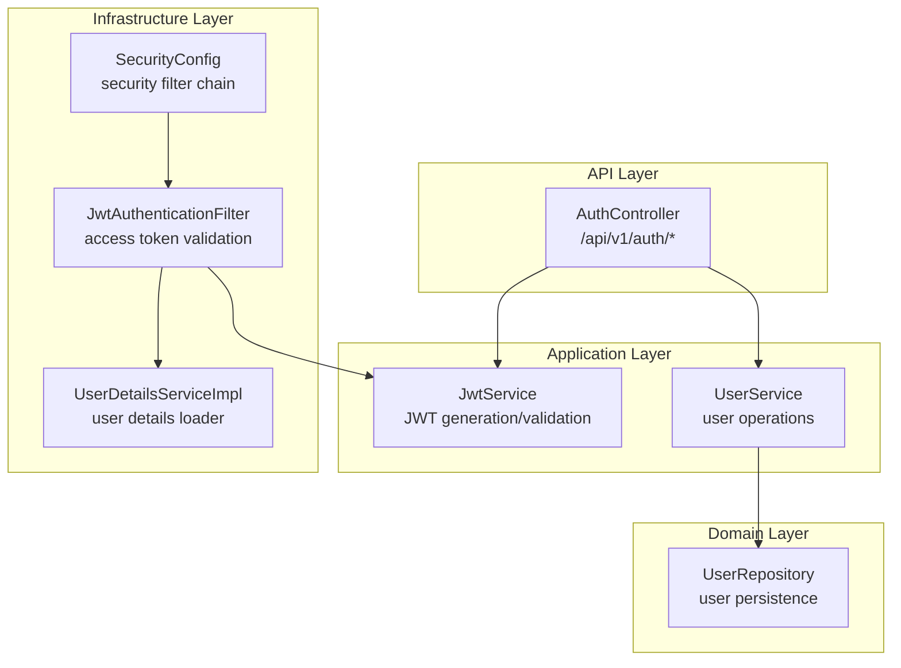
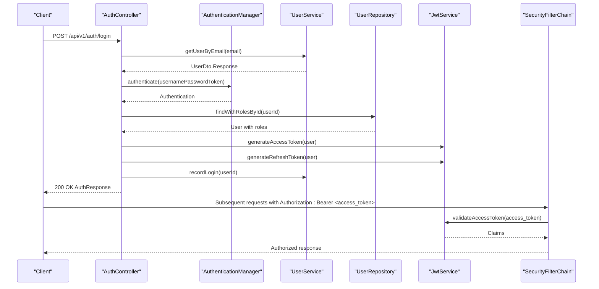
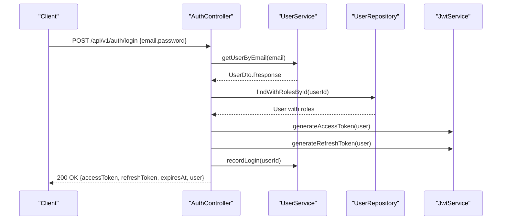
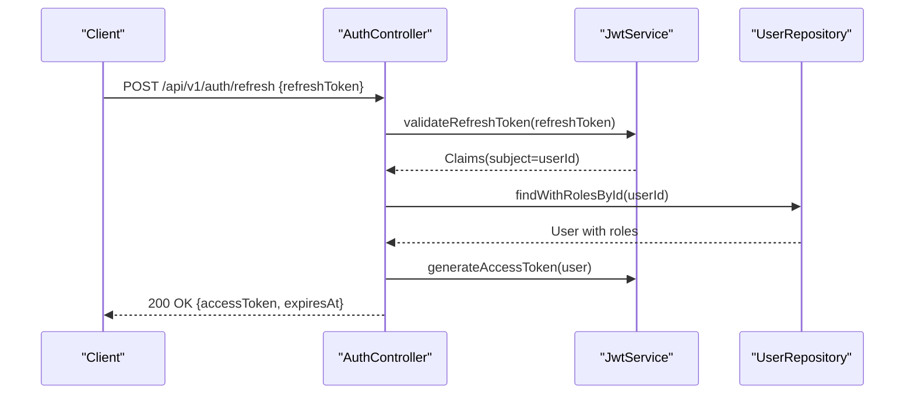
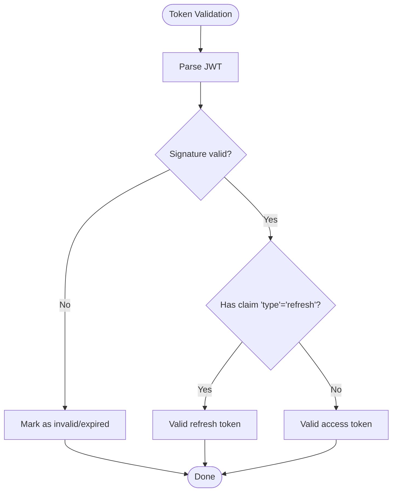
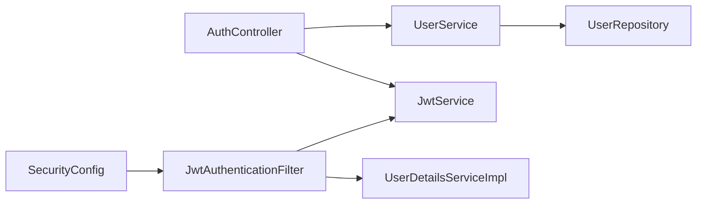

# Authentication Controller

<cite>
**Referenced Files in This Document**
- [AuthController.java](file://jmp-api/src/main/java/com/jmp/api/controller/AuthController.java)
- [JwtService.java](file://jmp-application/src/main/java/com/jmp/application/service/JwtService.java)
- [SecurityConfig.java](file://jmp-infrastructure/src/main/java/com/jmp/infrastructure/security/SecurityConfig.java)
- [JwtAuthenticationFilter.java](file://jmp-infrastructure/src/main/java/com/jmp/infrastructure/security/JwtAuthenticationFilter.java)
- [UserDetailsServiceImpl.java](file://jmp-infrastructure/src/main/java/com/jmp/infrastructure/security/UserDetailsServiceImpl.java)
- [UserService.java](file://jmp-application/src/main/java/com/jmp/application/service/UserService.java)
- [UserRepository.java](file://jmp-domain/src/main/java/com/jmp/domain/repository/UserRepository.java)
- [GlobalExceptionHandler.java](file://jmp-api/src/main/java/com/jmp/api/advice/GlobalExceptionHandler.java)
- [application.yml](file://jmp-web/src/main/resources/application.yml)
</cite>

## Table of Contents
1. [Introduction](#introduction)
2. [Project Structure](#project-structure)
3. [Core Components](#core-components)
4. [Architecture Overview](#architecture-overview)
5. [Detailed Component Analysis](#detailed-component-analysis)
6. [Dependency Analysis](#dependency-analysis)
7. [Performance Considerations](#performance-considerations)
8. [Troubleshooting Guide](#troubleshooting-guide)
9. [Conclusion](#conclusion)
10. [Appendices](#appendices)

## Introduction
This document provides comprehensive API documentation for the Authentication Controller, focusing on login, token refresh, and related authentication flows. It explains HTTP endpoints, request/response schemas, JWT token generation and validation, security headers, CORS configuration, session management, error handling, and security considerations. Practical examples and client implementation guidelines are included to help integrate the authentication system effectively.

## Project Structure
The authentication system spans multiple layers:
- API Layer: Exposes REST endpoints for authentication
- Application Layer: Implements business logic for JWT generation and user operations
- Infrastructure Layer: Configures Spring Security, filters, and user details loading
- Domain Layer: Provides repositories and entities for user data
- Global Exception Handling: Standardizes error responses

**Diagram sources**
- [AuthController.java:30-124](file://jmp-api/src/main/java/com/jmp/api/controller/AuthController.java#L30-L124)
- [JwtService.java:25-236](file://jmp-application/src/main/java/com/jmp/application/service/JwtService.java#L25-L236)
- [SecurityConfig.java:28-90](file://jmp-infrastructure/src/main/java/com/jmp/infrastructure/security/SecurityConfig.java#L28-L90)
- [JwtAuthenticationFilter.java:27-122](file://jmp-infrastructure/src/main/java/com/jmp/infrastructure/security/JwtAuthenticationFilter.java#L27-L122)
- [UserDetailsServiceImpl.java:19-48](file://jmp-infrastructure/src/main/java/com/jmp/infrastructure/security/UserDetailsServiceImpl.java#L19-L48)
- [UserRepository.java:18-82](file://jmp-domain/src/main/java/com/jmp/domain/repository/UserRepository.java#L18-L82)

**Section sources**
- [AuthController.java:30-124](file://jmp-api/src/main/java/com/jmp/api/controller/AuthController.java#L30-L124)
- [SecurityConfig.java:28-90](file://jmp-infrastructure/src/main/java/com/jmp/infrastructure/security/SecurityConfig.java#L28-L90)

## Core Components
- Authentication Controller: Exposes login and token refresh endpoints under /api/v1/auth.
- JWT Service: Generates and validates access and refresh tokens with configurable expiration.
- Security Configuration: Defines stateless sessions, CORS, and public endpoints.
- JWT Authentication Filter: Validates access tokens and populates Spring Security context.
- User Details Service: Loads user authorities for authenticated requests.
- User Service and Repository: Retrieve user data and record login events.

**Section sources**
- [AuthController.java:37-124](file://jmp-api/src/main/java/com/jmp/api/controller/AuthController.java#L37-L124)
- [JwtService.java:29-87](file://jmp-application/src/main/java/com/jmp/application/service/JwtService.java#L29-L87)
- [SecurityConfig.java:42-88](file://jmp-infrastructure/src/main/java/com/jmp/infrastructure/security/SecurityConfig.java#L42-L88)
- [JwtAuthenticationFilter.java:39-94](file://jmp-infrastructure/src/main/java/com/jmp/infrastructure/security/JwtAuthenticationFilter.java#L39-L94)
- [UserDetailsServiceImpl.java:25-46](file://jmp-infrastructure/src/main/java/com/jmp/infrastructure/security/UserDetailsServiceImpl.java#L25-L46)
- [UserService.java:150-156](file://jmp-application/src/main/java/com/jmp/application/service/UserService.java#L150-L156)
- [UserRepository.java:24-37](file://jmp-domain/src/main/java/com/jmp/domain/repository/UserRepository.java#L24-L37)

## Architecture Overview
The authentication flow integrates REST endpoints, JWT validation, and Spring Security:

**Diagram sources**
- [AuthController.java:42-81](file://jmp-api/src/main/java/com/jmp/api/controller/AuthController.java#L42-L81)
- [UserService.java:84-88](file://jmp-application/src/main/java/com/jmp/application/service/UserService.java#L84-L88)
- [UserRepository.java:36](file://jmp-domain/src/main/java/com/jmp/domain/repository/UserRepository.java#L36)
- [JwtService.java:49-87](file://jmp-application/src/main/java/com/jmp/application/service/JwtService.java#L49-L87)
- [SecurityConfig.java:42-61](file://jmp-infrastructure/src/main/java/com/jmp/infrastructure/security/SecurityConfig.java#L42-L61)
- [JwtAuthenticationFilter.java:42-76](file://jmp-infrastructure/src/main/java/com/jmp/infrastructure/security/JwtAuthenticationFilter.java#L42-L76)

## Detailed Component Analysis

### Authentication Endpoints

#### POST /api/v1/auth/login
- Purpose: Authenticate a user and return access and refresh tokens.
- Authentication: None (public endpoint).
- Request Schema:
  - email: string, required
  - password: string, required
- Response Schema:
  - accessToken: string
  - refreshToken: string
  - expiresAt: datetime (UTC)
  - user: object containing user metadata (id, email, name, roles, tenantId, timestamps)
- Success Response: 200 OK
- Error Responses:
  - 400 Bad Request: Validation errors
  - 401 Unauthorized: Invalid credentials
  - 500 Internal Server Error: Unexpected errors

**Diagram sources**
- [AuthController.java:42-81](file://jmp-api/src/main/java/com/jmp/api/controller/AuthController.java#L42-L81)
- [UserService.java:84-88](file://jmp-application/src/main/java/com/jmp/application/service/UserService.java#L84-L88)
- [UserRepository.java:36](file://jmp-domain/src/main/java/com/jmp/domain/repository/UserRepository.java#L36)
- [JwtService.java:49-87](file://jmp-application/src/main/java/com/jmp/application/service/JwtService.java#L49-L87)

**Section sources**
- [AuthController.java:42-81](file://jmp-api/src/main/java/com/jmp/api/controller/AuthController.java#L42-L81)
- [AuthController.java:103-113](file://jmp-api/src/main/java/com/jmp/api/controller/AuthController.java#L103-L113)

#### POST /api/v1/auth/refresh
- Purpose: Refresh an access token using a valid refresh token.
- Authentication: None (public endpoint).
- Request Schema:
  - refreshToken: string, required
- Response Schema:
  - accessToken: string
  - expiresAt: datetime (UTC)
- Success Response: 200 OK
- Error Responses:
  - 400 Bad Request: Validation errors
  - 401 Unauthorized: Invalid or expired refresh token
  - 500 Internal Server Error: Unexpected errors

**Diagram sources**
- [AuthController.java:83-100](file://jmp-api/src/main/java/com/jmp/api/controller/AuthController.java#L83-L100)
- [JwtService.java:176-188](file://jmp-application/src/main/java/com/jmp/application/service/JwtService.java#L176-L188)
- [UserRepository.java:36](file://jmp-domain/src/main/java/com/jmp/domain/repository/UserRepository.java#L36)

**Section sources**
- [AuthController.java:83-100](file://jmp-api/src/main/java/com/jmp/api/controller/AuthController.java#L83-L100)
- [AuthController.java:115-122](file://jmp-api/src/main/java/com/jmp/api/controller/AuthController.java#L115-L122)

### JWT Token Generation and Validation

#### Access Token
- Issuer: Platform
- TTL: 15 minutes (configurable)
- Claims:
  - sub: user UUID
  - email: user email
  - tenant_id: tenant UUID
  - roles: list of role names
- Signature: HMAC using configured secret
- Usage: Bearer token in Authorization header

#### Refresh Token
- Issuer: Platform
- TTL: 7 days (configurable)
- Claims:
  - sub: user UUID
  - type: "refresh"
- Signature: HMAC using configured secret
- Usage: Sent to refresh endpoint to obtain a new access token

**Diagram sources**
- [JwtService.java:165-188](file://jmp-application/src/main/java/com/jmp/application/service/JwtService.java#L165-L188)

**Section sources**
- [JwtService.java:49-87](file://jmp-application/src/main/java/com/jmp/application/service/JwtService.java#L49-L87)
- [JwtService.java:165-188](file://jmp-application/src/main/java/com/jmp/application/service/JwtService.java#L165-L188)
- [application.yml:75-78](file://jmp-web/src/main/resources/application.yml#L75-L78)

### Security Headers and CORS
- Authorization Header: Bearer <access_token> for protected endpoints
- CORS Configuration:
  - Allowed Origins: localhost development ports
  - Allowed Methods: GET, POST, PUT, PATCH, DELETE, OPTIONS
  - Allowed Headers: *
  - Credentials: true
- Session Management: Stateless (no server-side session)

**Section sources**
- [JwtAuthenticationFilter.java:78-84](file://jmp-infrastructure/src/main/java/com/jmp/infrastructure/security/JwtAuthenticationFilter.java#L78-L84)
- [SecurityConfig.java:77-88](file://jmp-infrastructure/src/main/java/com/jmp/infrastructure/security/SecurityConfig.java#L77-L88)
- [SecurityConfig.java:47-48](file://jmp-infrastructure/src/main/java/com/jmp/infrastructure/security/SecurityConfig.java#L47-L48)

### Session Management
- Session Policy: STATELESS
- Authentication Context: Populated by JWT filter for each request
- Public Endpoints: /api/v1/auth/**, /api/v1/webhooks/**, health and OpenAPI endpoints

**Section sources**
- [SecurityConfig.java:47-58](file://jmp-infrastructure/src/main/java/com/jmp/infrastructure/security/SecurityConfig.java#L47-L58)
- [JwtAuthenticationFilter.java:87-94](file://jmp-infrastructure/src/main/java/com/jmp/infrastructure/security/JwtAuthenticationFilter.java#L87-L94)

### Error Handling and Security Considerations
- Standardized Problem Details Responses (RFC 7807) for:
  - Bad Request (validation errors)
  - Unauthorized (invalid credentials)
  - Forbidden (access denied)
  - Conflict (state conflicts)
  - Internal Server Error (unexpected errors)
- Authentication failures return 401 Unauthorized with standardized payload
- Rate limiting and brute force protection are not implemented in the current codebase

**Section sources**
- [GlobalExceptionHandler.java:54-66](file://jmp-api/src/main/java/com/jmp/api/advice/GlobalExceptionHandler.java#L54-L66)
- [GlobalExceptionHandler.java:102-114](file://jmp-api/src/main/java/com/jmp/api/advice/GlobalExceptionHandler.java#L102-L114)

## Dependency Analysis
The authentication controller depends on services and repositories for user data and JWT operations. Security configuration integrates the JWT filter into the filter chain.

**Diagram sources**
- [AuthController.java:37-40](file://jmp-api/src/main/java/com/jmp/api/controller/AuthController.java#L37-L40)
- [UserService.java:34-38](file://jmp-application/src/main/java/com/jmp/application/service/UserService.java#L34-L38)
- [UserRepository.java:18-19](file://jmp-domain/src/main/java/com/jmp/domain/repository/UserRepository.java#L18-L19)
- [SecurityConfig.java:33-40](file://jmp-infrastructure/src/main/java/com/jmp/infrastructure/security/SecurityConfig.java#L33-L40)
- [JwtAuthenticationFilter.java:31-37](file://jmp-infrastructure/src/main/java/com/jmp/infrastructure/security/JwtAuthenticationFilter.java#L31-L37)
- [UserDetailsServiceImpl.java:23](file://jmp-infrastructure/src/main/java/com/jmp/infrastructure/security/UserDetailsServiceImpl.java#L23)

**Section sources**
- [AuthController.java:37-40](file://jmp-api/src/main/java/com/jmp/api/controller/AuthController.java#L37-L40)
- [SecurityConfig.java:33-40](file://jmp-infrastructure/src/main/java/com/jmp/infrastructure/security/SecurityConfig.java#L33-L40)

## Performance Considerations
- Stateless design eliminates server-side session storage overhead.
- JWT parsing occurs per request; keep token size minimal by limiting claims.
- Use EntityGraphs to eagerly load roles and permissions to reduce N+1 queries during authentication.
- Configure appropriate CORS origins to avoid preflight overhead.

[No sources needed since this section provides general guidance]

## Troubleshooting Guide
Common issues and resolutions:
- 401 Unauthorized on login:
  - Verify credentials and ensure user is active.
  - Check JWT secrets and expiration settings.
- 401 Unauthorized on protected endpoints:
  - Ensure Authorization header includes Bearer <access_token>.
  - Confirm token is not expired.
- CORS errors:
  - Verify client origin is in allowed origins.
  - Confirm credentials are allowed for cross-origin requests.
- Validation errors:
  - Review request body against documented schemas.

**Section sources**
- [GlobalExceptionHandler.java:54-66](file://jmp-api/src/main/java/com/jmp/api/advice/GlobalExceptionHandler.java#L54-L66)
- [JwtAuthenticationFilter.java:78-84](file://jmp-infrastructure/src/main/java/com/jmp/infrastructure/security/JwtAuthenticationFilter.java#L78-L84)
- [SecurityConfig.java:77-88](file://jmp-infrastructure/src/main/java/com/jmp/infrastructure/security/SecurityConfig.java#L77-L88)

## Conclusion
The Authentication Controller provides a robust, stateless authentication mechanism using JWT. It supports login and token refresh with clear request/response schemas, standardized error handling, and secure CORS configuration. Clients should implement token storage securely and refresh tokens responsibly to maintain session continuity while minimizing risk.

[No sources needed since this section summarizes without analyzing specific files]

## Appendices

### Endpoint Reference

- POST /api/v1/auth/login
  - Request: { email, password }
  - Response: { accessToken, refreshToken, expiresAt, user }
  - Notes: Returns short-lived access token and long-lived refresh token

- POST /api/v1/auth/refresh
  - Request: { refreshToken }
  - Response: { accessToken, expiresAt }
  - Notes: Uses refresh token to obtain a new access token

### Request/Response Schemas

- LoginRequest
  - email: string, required
  - password: string, required

- AuthResponse
  - accessToken: string
  - refreshToken: string
  - expiresAt: datetime (UTC)
  - user: object with id, email, name, roles, tenantId, timestamps

- RefreshTokenRequest
  - refreshToken: string, required

- TokenRefreshResponse
  - accessToken: string
  - expiresAt: datetime (UTC)

**Section sources**
- [AuthController.java:103-122](file://jmp-api/src/main/java/com/jmp/api/controller/AuthController.java#L103-L122)

### Client Implementation Guidelines
- Store access tokens in memory only (e.g., in-memory store or secure browser storage).
- Persist refresh tokens securely (e.g., HttpOnly cookies if using server-side sessions).
- On token expiration, call the refresh endpoint with a valid refresh token.
- Always send Authorization: Bearer <access_token> for protected endpoints.
- Implement retry logic for transient failures and handle 401 Unauthorized by prompting re-authentication.

[No sources needed since this section provides general guidance]

### Security Recommendations
- Rotate JWT secrets periodically and manage them via environment variables.
- Enforce HTTPS in production to protect tokens in transit.
- Consider adding rate limiting and brute force protection (not present in current code).
- Limit token claims to essential data to minimize payload size.
- Use short access token TTLs and long refresh token TTLs as configured.

[No sources needed since this section provides general guidance]