# Conference Management Controller

<cite>
**Referenced Files in This Document**
- [ConferenceController.java](file://jmp-api/src/main/java/com/jmp/api/controller/ConferenceController.java)
- [ConferenceService.java](file://jmp-application/src/main/java/com/jmp/application/service/ConferenceService.java)
- [Conference.java](file://jmp-domain/src/main/java/com/jmp/domain/entity/Conference.java)
- [ConferenceParticipant.java](file://jmp-domain/src/main/java/com/jmp/domain/entity/ConferenceParticipant.java)
- [ConferenceRepository.java](file://jmp-domain/src/main/java/com/jmp/domain/repository/ConferenceRepository.java)
- [ConferenceDto.java](file://jmp-application/src/main/java/com/jmp/application/dto/ConferenceDto.java)
- [ConferenceMapper.java](file://jmp-application/src/main/java/com/jmp/application/mapper/ConferenceMapper.java)
- [WebSocketConfig.java](file://jmp-infrastructure/src/main/java/com/jmp/infrastructure/websocket/WebSocketConfig.java)
- [RealtimeEventService.java](file://jmp-infrastructure/src/main/java/com/jmp/infrastructure/websocket/RealtimeEventService.java)
- [JitsiWebhookController.java](file://jmp-api/src/main/java/com/jmp/api/controller/JitsiWebhookController.java)
- [RecordingService.java](file://jmp-application/src/main/java/com/jmp/application/service/RecordingService.java)
- [RecordingController.java](file://jmp-api/src/main/java/com/jmp/api/controller/RecordingController.java)
- [AnalyticsService.java](file://jmp-application/src/main/java/com/jmp/application/service/AnalyticsService.java)
- [AnalyticsController.java](file://jmp-api/src/main/java/com/jmp/api/controller/AnalyticsController.java)
- [JwtService.java](file://jmp-application/src/main/java/com/jmp/application/service/JwtService.java)
- [OpenApiConfig.java](file://jmp-api/src/main/java/com/jmp/api/config/OpenApiConfig.java)
- [V6__add_conference_type.sql](file://jmp-web/src/main/resources/db/migration/V6__add_conference_type.sql)
</cite>

## Update Summary
**Changes Made**
- Added comprehensive documentation for the new conference type field supporting SCHEDULED and PERMANENT conference types
- Updated validation logic documentation for type-specific requirements
- Enhanced API documentation with type field specifications
- Added database migration documentation for the new type column
- Updated Swagger/OpenAPI documentation with proper type field descriptions

## Table of Contents
1. [Introduction](#introduction)
2. [Project Structure](#project-structure)
3. [Core Components](#core-components)
4. [Architecture Overview](#architecture-overview)
5. [Detailed Component Analysis](#detailed-component-analysis)
6. [Conference Types and Validation](#conference-types-and-validation)
7. [Dependency Analysis](#dependency-analysis)
8. [Performance Considerations](#performance-considerations)
9. [Troubleshooting Guide](#troubleshooting-guide)
10. [Conclusion](#conclusion)
11. [Appendices](#appendices)

## Introduction
This document provides comprehensive API documentation for the Conference Management Controller, focusing on the full lifecycle of conferences: creation, scheduling, participant management, and termination. The system now supports two distinct conference types - SCHEDULED and PERMANENT - each with specific validation requirements and operational characteristics. It also covers real-time status updates, participant tracking, state transitions, room management, invitations, scheduling conflict handling, recording triggers, analytics, and WebSocket integration for live notifications. The documentation explains tenant isolation, participant restrictions, and integration with the Jitsi server for secure token generation and webhook-driven lifecycle updates.

## Project Structure
The conference management system spans four layers:
- API Layer: REST controllers exposing conference, recording, analytics, and webhook endpoints
- Application Layer: Services implementing business logic and orchestrating domain operations
- Domain Layer: Entities and repositories modeling conferences, participants, and persistence
- Infrastructure Layer: WebSocket configuration and event broadcasting, plus JWT token generation

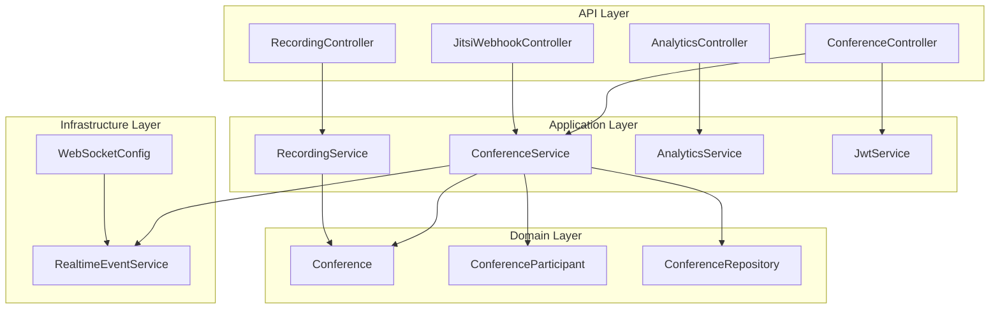

**Diagram sources**
- [ConferenceController.java:37-189](file://jmp-api/src/main/java/com/jmp/api/controller/ConferenceController.java#L37-L189)
- [ConferenceService.java:25-225](file://jmp-application/src/main/java/com/jmp/application/service/ConferenceService.java#L25-L225)
- [Conference.java:25-217](file://jmp-domain/src/main/java/com/jmp/domain/entity/Conference.java#L25-L217)
- [ConferenceParticipant.java:18-150](file://jmp-domain/src/main/java/com/jmp/domain/entity/ConferenceParticipant.java#L18-L150)
- [ConferenceRepository.java:20-110](file://jmp-domain/src/main/java/com/jmp/domain/repository/ConferenceRepository.java#L20-L110)
- [WebSocketConfig.java:23-70](file://jmp-infrastructure/src/main/java/com/jmp/infrastructure/websocket/WebSocketConfig.java#L23-L70)
- [RealtimeEventService.java:17-142](file://jmp-infrastructure/src/main/java/com/jmp/infrastructure/websocket/RealtimeEventService.java#L17-L142)
- [JitsiWebhookController.java:24-125](file://jmp-api/src/main/java/com/jmp/api/controller/JitsiWebhookController.java#L24-L125)
- [RecordingService.java:27-332](file://jmp-application/src/main/java/com/jmp/application/service/RecordingService.java#L27-L332)
- [AnalyticsService.java:25-235](file://jmp-application/src/main/java/com/jmp/application/service/AnalyticsService.java#L25-L235)
- [JwtService.java:25-236](file://jmp-application/src/main/java/com/jmp/application/service/JwtService.java#L25-L236)

**Section sources**
- [ConferenceController.java:37-189](file://jmp-api/src/main/java/com/jmp/api/controller/ConferenceController.java#L37-L189)
- [ConferenceService.java:25-225](file://jmp-application/src/main/java/com/jmp/application/service/ConferenceService.java#L25-L225)
- [Conference.java:25-217](file://jmp-domain/src/main/java/com/jmp/domain/entity/Conference.java#L25-L217)
- [ConferenceParticipant.java:18-150](file://jmp-domain/src/main/java/com/jmp/domain/entity/ConferenceParticipant.java#L18-L150)
- [ConferenceRepository.java:20-110](file://jmp-domain/src/main/java/com/jmp/domain/repository/ConferenceRepository.java#L20-L110)
- [WebSocketConfig.java:23-70](file://jmp-infrastructure/src/main/java/com/jmp/infrastructure/websocket/WebSocketConfig.java#L23-L70)
- [RealtimeEventService.java:17-142](file://jmp-infrastructure/src/main/java/com/jmp/infrastructure/websocket/RealtimeEventService.java#L17-L142)
- [JitsiWebhookController.java:24-125](file://jmp-api/src/main/java/com/jmp/api/controller/JitsiWebhookController.java#L24-L125)
- [RecordingService.java:27-332](file://jmp-application/src/main/java/com/jmp/application/service/RecordingService.java#L27-L332)
- [AnalyticsService.java:25-235](file://jmp-application/src/main/java/com/jmp/application/service/AnalyticsService.java#L25-L235)
- [JwtService.java:25-236](file://jmp-application/src/main/java/com/jmp/application/service/JwtService.java#L25-L236)

## Core Components
- ConferenceController: Exposes REST endpoints for conference lifecycle, token generation, and listing active/upcoming conferences
- ConferenceService: Implements business rules for creation, updates, scheduling, and termination; coordinates with repositories and mappers
- Conference Entity: Models conference state, scheduling, room options, and participant collection with new type field support
- ConferenceParticipant Entity: Tracks participant roles, statuses, and join/leave timestamps
- ConferenceRepository: Provides queries for tenant scoping, search, upcoming/scheduled lists, and auto-start/end
- DTOs and Mapper: Define request/response contracts and map between entities and DTOs with type field inclusion
- WebSocket Infrastructure: Configures STOMP endpoints and broadcasts real-time events per tenant
- Jitsi Webhook Controller: Receives and processes Jitsi events for lifecycle and participant actions
- RecordingService and Controller: Manage recording lifecycle and storage integration
- AnalyticsService and Controller: Provide dashboard, usage, participant, and recording analytics
- JwtService: Generates Jitsi JWT tokens with tenant-aware claims and moderator context

**Section sources**
- [ConferenceController.java:37-189](file://jmp-api/src/main/java/com/jmp/api/controller/ConferenceController.java#L37-L189)
- [ConferenceService.java:25-225](file://jmp-application/src/main/java/com/jmp/application/service/ConferenceService.java#L25-L225)
- [Conference.java:25-217](file://jmp-domain/src/main/java/com/jmp/domain/entity/Conference.java#L25-L217)
- [ConferenceParticipant.java:18-150](file://jmp-domain/src/main/java/com/jmp/domain/entity/ConferenceParticipant.java#L18-L150)
- [ConferenceRepository.java:20-110](file://jmp-domain/src/main/java/com/jmp/domain/repository/ConferenceRepository.java#L20-L110)
- [ConferenceDto.java:15-176](file://jmp-application/src/main/java/com/jmp/application/dto/ConferenceDto.java#L15-L176)
- [ConferenceMapper.java:15-75](file://jmp-application/src/main/java/com/jmp/application/mapper/ConferenceMapper.java#L15-L75)
- [WebSocketConfig.java:23-70](file://jmp-infrastructure/src/main/java/com/jmp/infrastructure/websocket/WebSocketConfig.java#L23-L70)
- [RealtimeEventService.java:17-142](file://jmp-infrastructure/src/main/java/com/jmp/infrastructure/websocket/RealtimeEventService.java#L17-L142)
- [JitsiWebhookController.java:24-125](file://jmp-api/src/main/java/com/jmp/api/controller/JitsiWebhookController.java#L24-L125)
- [RecordingService.java:27-332](file://jmp-application/src/main/java/com/jmp/application/service/RecordingService.java#L27-L332)
- [RecordingController.java:35-138](file://jmp-api/src/main/java/com/jmp/api/controller/RecordingController.java#L35-L138)
- [AnalyticsService.java:25-235](file://jmp-application/src/main/java/com/jmp/application/service/AnalyticsService.java#L25-L235)
- [AnalyticsController.java:26-96](file://jmp-api/src/main/java/com/jmp/api/controller/AnalyticsController.java#L26-L96)
- [JwtService.java:25-236](file://jmp-application/src/main/java/com/jmp/application/service/JwtService.java#L25-L236)

## Architecture Overview
The system follows layered architecture with clear separation of concerns:
- Controllers expose HTTP endpoints secured by bearer tokens
- Services encapsulate business logic and orchestrate domain operations
- Repositories manage persistence with tenant-scoped queries
- Entities model domain concepts with state machines for conferences and participants
- Infrastructure handles real-time communication and JWT tokenization for Jitsi

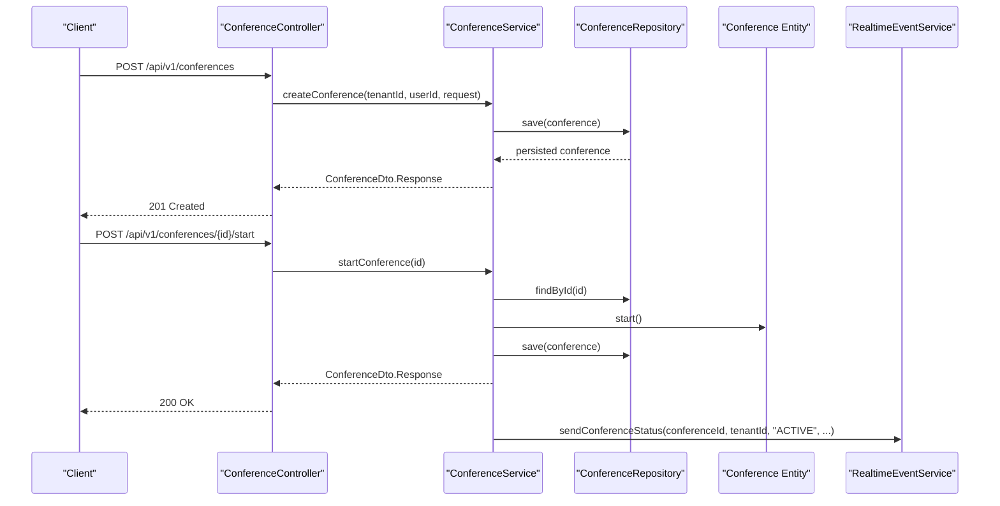

**Diagram sources**
- [ConferenceController.java:49-63](file://jmp-api/src/main/java/com/jmp/api/controller/ConferenceController.java#L49-L63)
- [ConferenceService.java:40-65](file://jmp-application/src/main/java/com/jmp/application/service/ConferenceService.java#L40-L65)
- [ConferenceRepository.java:20-110](file://jmp-domain/src/main/java/com/jmp/domain/repository/ConferenceRepository.java#L20-L110)
- [Conference.java:140-151](file://jmp-domain/src/main/java/com/jmp/domain/entity/Conference.java#L140-L151)
- [RealtimeEventService.java:44-52](file://jmp-infrastructure/src/main/java/com/jmp/infrastructure/websocket/RealtimeEventService.java#L44-L52)

**Section sources**
- [ConferenceController.java:37-189](file://jmp-api/src/main/java/com/jmp/api/controller/ConferenceController.java#L37-L189)
- [ConferenceService.java:25-225](file://jmp-application/src/main/java/com/jmp/application/service/ConferenceService.java#L25-L225)
- [ConferenceRepository.java:20-110](file://jmp-domain/src/main/java/com/jmp/domain/repository/ConferenceRepository.java#L20-L110)
- [Conference.java:25-217](file://jmp-domain/src/main/java/com/jmp/domain/entity/Conference.java#L25-L217)
- [RealtimeEventService.java:17-142](file://jmp-infrastructure/src/main/java/com/jmp/infrastructure/websocket/RealtimeEventService.java#L17-L142)

## Detailed Component Analysis

### Conference Lifecycle Endpoints
- Create Conference
  - Method: POST /api/v1/conferences
  - Auth: MODERATOR, TENANT_ADMIN, SUPER_ADMIN
  - Request: ConferenceDto.CreateRequest (includes type field)
  - Behavior: Validates tenant/user existence, ensures unique room name, validates type-specific requirements, sets status to SCHEDULED, returns ConferenceDto.Response
  - Complexity: O(1) database operations
- Get Conference by ID
  - Method: GET /api/v1/conferences/{id}
  - Auth: PARTICIPANT, MODERATOR, TENANT_ADMIN, SUPER_ADMIN
  - Returns: ConferenceDto.Response
- List Conferences (tenant-scoped)
  - Method: GET /api/v1/conferences
  - Auth: PARTICIPANT, MODERATOR, TENANT_ADMIN, SUPER_ADMIN
  - Query params: search (optional), pageable
  - Returns: Page<ConferenceDto.Summary>
- Active Conferences
  - Method: GET /api/v1/conferences/active
  - Auth: PARTICIPANT, MODERATOR, TENANT_ADMIN, SUPER_ADMIN
  - Returns: List<ConferenceDto.Summary> for ACTIVE
- Upcoming Conferences
  - Method: GET /api/v1/conferences/upcoming
  - Auth: PARTICIPANT, MODERATOR, TENANT_ADMIN, SUPER_ADMIN
  - Returns: List<ConferenceDto.Summary> for SCHEDULED future starts
- Update Conference
  - Method: PUT /api/v1/conferences/{id}
  - Auth: MODERATOR, TENANT_ADMIN, SUPER_ADMIN
  - Request: ConferenceDto.UpdateRequest (includes type field)
  - Constraints: Cannot update ENDED or CANCELLED conferences, validates type-specific requirements during updates
- Start Conference
  - Method: POST /api/v1/conferences/{id}/start
  - Auth: MODERATOR, TENANT_ADMIN, SUPER_ADMIN
  - Constraints: Conference must be SCHEDULED
- End Conference
  - Method: POST /api/v1/conferences/{id}/end
  - Auth: MODERATOR, TENANT_ADMIN, SUPER_ADMIN
  - Constraints: Conference must be ACTIVE
- Delete Conference
  - Method: DELETE /api/v1/conferences/{id}
  - Auth: MODERATOR, TENANT_ADMIN, SUPER_ADMIN
  - Behavior: Soft deletes by setting status to CANCELLED and marking deletedAt

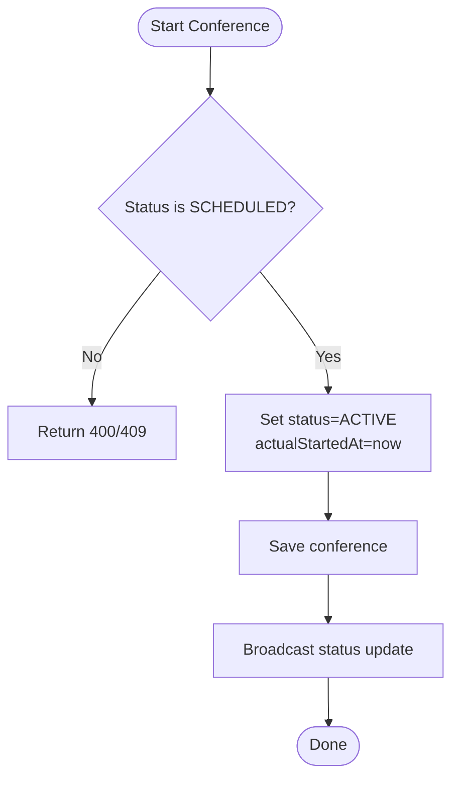

**Diagram sources**
- [ConferenceService.java:136-152](file://jmp-application/src/main/java/com/jmp/application/service/ConferenceService.java#L136-L152)
- [Conference.java:140-151](file://jmp-domain/src/main/java/com/jmp/domain/entity/Conference.java#L140-L151)
- [RealtimeEventService.java:44-52](file://jmp-infrastructure/src/main/java/com/jmp/infrastructure/websocket/RealtimeEventService.java#L44-L52)

**Section sources**
- [ConferenceController.java:49-138](file://jmp-api/src/main/java/com/jmp/api/controller/ConferenceController.java#L49-L138)
- [ConferenceService.java:40-189](file://jmp-application/src/main/java/com/jmp/application/service/ConferenceService.java#L40-L189)
- [ConferenceRepository.java:48-60](file://jmp-domain/src/main/java/com/jmp/domain/repository/ConferenceRepository.java#L48-L60)
- [Conference.java:140-159](file://jmp-domain/src/main/java/com/jmp/domain/entity/Conference.java#L140-L159)

### Real-Time Status Updates and WebSocket Integration
- WebSocket Broker: In-memory STOMP broker enabled for topics and queues; supports SockJS and native WebSocket
- Event Broadcasting:
  - sendConferenceStatus: Publishes ConferenceStatusEvent to tenant-scoped topic
  - sendRecordingStatus: Publishes RecordingStatusEvent to tenant-scoped topic
  - sendToTenant/sendToUser/broadcast: Generic event delivery helpers
- Client Subscription:
  - Tenant-scoped: /topic/tenant/{tenantId}/{eventType}
  - User-specific: /user/{userId}/queue/events
  - Broadcast: /topic/broadcast/{eventType}

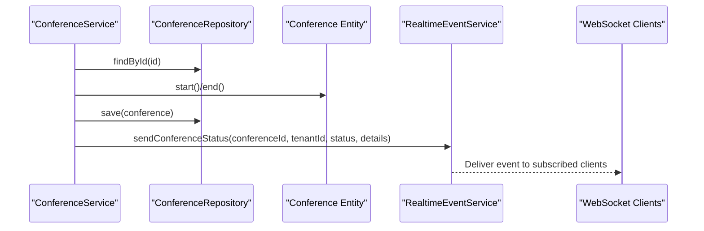

**Diagram sources**
- [ConferenceService.java:136-173](file://jmp-application/src/main/java/com/jmp/application/service/ConferenceService.java#L136-L173)
- [RealtimeEventService.java:44-65](file://jmp-infrastructure/src/main/java/com/jmp/infrastructure/websocket/RealtimeEventService.java#L44-L65)
- [WebSocketConfig.java:32-50](file://jmp-infrastructure/src/main/java/com/jmp/infrastructure/websocket/WebSocketConfig.java#L32-L50)

**Section sources**
- [WebSocketConfig.java:23-70](file://jmp-infrastructure/src/main/java/com/jmp/infrastructure/websocket/WebSocketConfig.java#L23-L70)
- [RealtimeEventService.java:17-142](file://jmp-infrastructure/src/main/java/com/jmp/infrastructure/websocket/RealtimeEventService.java#L17-L142)
- [ConferenceService.java:136-173](file://jmp-application/src/main/java/com/jmp/application/service/ConferenceService.java#L136-L173)

### Participant Management and Tracking
- Roles and Statuses:
  - Roles: HOST, MODERATOR, PARTICIPANT, GUEST, RECORDER
  - Statuses: INVITED, JOINED, LEFT, KICKED, DECLINED
- Tracking:
  - Participants collection in Conference
  - Current participant count derived from JOINED status
- Room Options:
  - enableLobby, enableRecording, enableLiveStreaming, enableChat, enableScreenSharing
  - maxParticipants for capacity limits
  - requirePassword/passwordHash for password protection
  - requireSignedIn for signed-in-only access
  - muteUponEntry and lobby gating

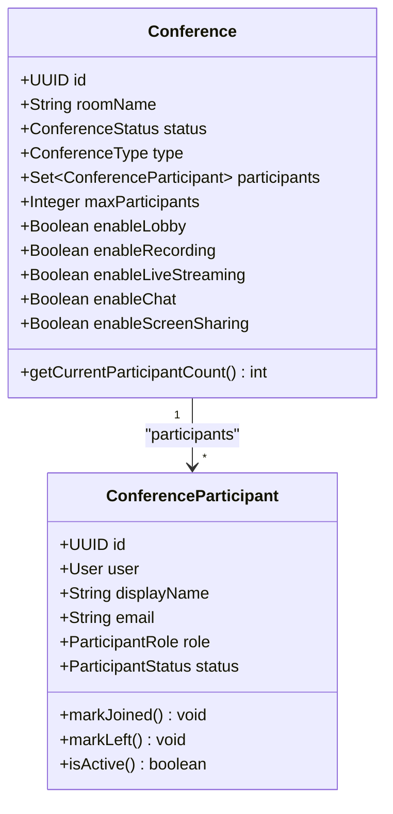

**Diagram sources**
- [Conference.java:30-184](file://jmp-domain/src/main/java/com/jmp/domain/entity/Conference.java#L30-L184)
- [ConferenceParticipant.java:23-109](file://jmp-domain/src/main/java/com/jmp/domain/entity/ConferenceParticipant.java#L23-L109)

**Section sources**
- [Conference.java:84-117](file://jmp-domain/src/main/java/com/jmp/domain/entity/Conference.java#L84-L117)
- [ConferenceParticipant.java:134-149](file://jmp-domain/src/main/java/com/jmp/domain/entity/ConferenceParticipant.java#L134-L149)

### Conference Room Management and Invitation Workflows
- Room Name Uniqueness: Enforced at creation per tenant
- Password Protection: Optional; hashed password stored when enabled
- Lobby and Moderation: enableLobby gates entry; isModerator flag influences Jitsi permissions
- Invitation Workflow:
  - Generate Jitsi JWT token endpoint returns token and room URL for participants
  - Tokens carry tenant slug, room, user context, and feature flags
  - Guest tokens supported for external participants

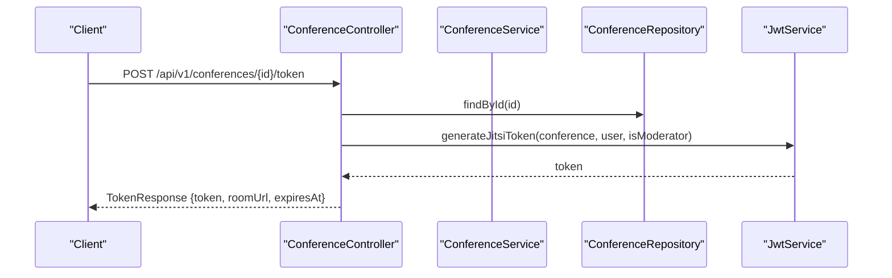

**Diagram sources**
- [ConferenceController.java:140-173](file://jmp-api/src/main/java/com/jmp/api/controller/ConferenceController.java#L140-L173)
- [JwtService.java:94-126](file://jmp-application/src/main/java/com/jmp/application/service/JwtService.java#L94-L126)
- [ConferenceRepository.java:26-27](file://jmp-domain/src/main/java/com/jmp/domain/repository/ConferenceRepository.java#L26-L27)

**Section sources**
- [ConferenceController.java:140-173](file://jmp-api/src/main/java/com/jmp/api/controller/ConferenceController.java#L140-L173)
- [JwtService.java:94-160](file://jmp-application/src/main/java/com/jmp/application/service/JwtService.java#L94-L160)
- [ConferenceService.java:50-54](file://jmp-application/src/main/java/com/jmp/application/service/ConferenceService.java#L50-L54)

### Meeting Scheduling Conflicts
- Scheduled Start/End: ConferenceService exposes queries for upcoming conferences and auto-start/end
- Auto-Start/Auto-End: Background processing finds conferences whose scheduledStartAt or scheduledEndAt have passed and transitions state accordingly
- Conflict Detection: Room name uniqueness per tenant prevents duplicate room names; scheduling conflicts are mitigated by tenant scoping and future-dated scheduling

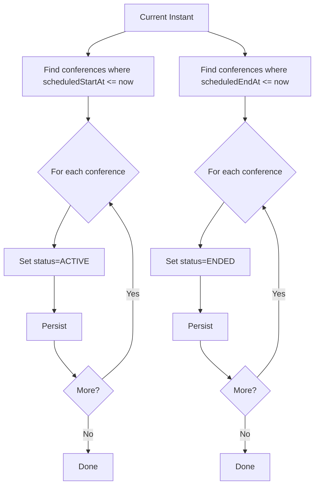

**Diagram sources**
- [ConferenceService.java:194-223](file://jmp-application/src/main/java/com/jmp/application/service/ConferenceService.java#L194-L223)
- [ConferenceRepository.java:97-108](file://jmp-domain/src/main/java/com/jmp/domain/repository/ConferenceRepository.java#L97-L108)

**Section sources**
- [ConferenceService.java:194-223](file://jmp-application/src/main/java/com/jmp/application/service/ConferenceService.java#L194-L223)
- [ConferenceRepository.java:97-108](file://jmp-domain/src/main/java/com/jmp/domain/repository/ConferenceRepository.java#L97-L108)

### Recording Trigger Endpoints and Jitsi Integration
- Recording Lifecycle:
  - RecordingService manages recording entries, readiness, metadata, downloads, and archival
  - RecordingController exposes CRUD and listing endpoints scoped by tenant
- Jitsi Webhooks:
  - JitsiWebhookController receives events (e.g., RECORDING_STATUS_CHANGED)
  - Signature verification can be enabled; events trigger internal processing
- Jibri Integration:
  - RecordingService includes handler for Jibri status changes to process completed recordings

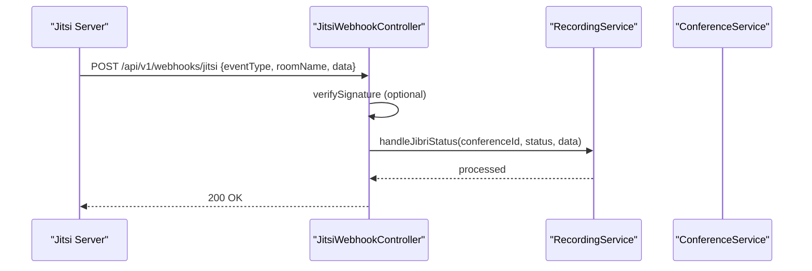

**Diagram sources**
- [JitsiWebhookController.java:33-64](file://jmp-api/src/main/java/com/jmp/api/controller/JitsiWebhookController.java#L33-L64)
- [RecordingService.java:263-284](file://jmp-application/src/main/java/com/jmp/application/service/RecordingService.java#L263-L284)

**Section sources**
- [RecordingService.java:27-332](file://jmp-application/src/main/java/com/jmp/application/service/RecordingService.java#L27-L332)
- [RecordingController.java:35-138](file://jmp-api/src/main/java/com/jmp/api/controller/RecordingController.java#L35-L138)
- [JitsiWebhookController.java:24-125](file://jmp-api/src/main/java/com/jmp/api/controller/JitsiWebhookController.java#L24-L125)

### Conference and Participant Analytics
- AnalyticsController endpoints:
  - Dashboard metrics
  - Usage reports for date ranges
  - Participant analytics
  - Recording analytics
  - System health metrics (super admin)
- AnalyticsService aggregates:
  - Storage usage and recording counts
  - Duration statistics and trends
  - Placeholder for active conferences and participant counts

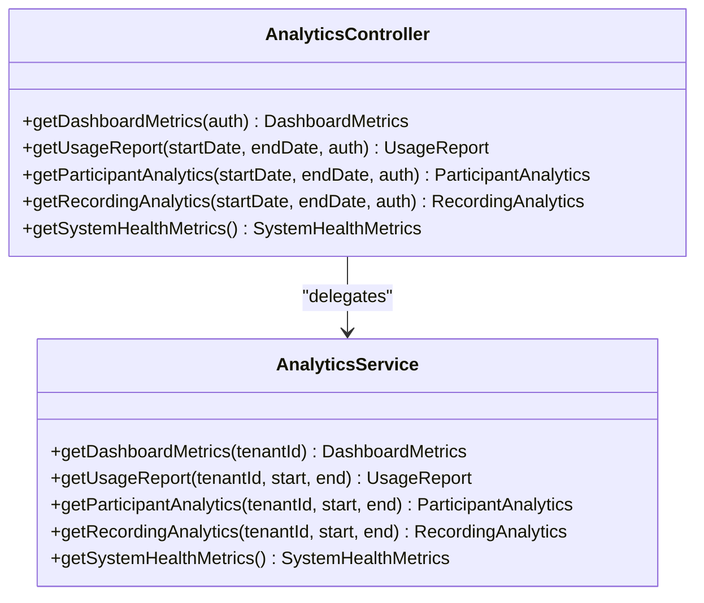

**Diagram sources**
- [AnalyticsController.java:26-96](file://jmp-api/src/main/java/com/jmp/api/controller/AnalyticsController.java#L26-L96)
- [AnalyticsService.java:25-235](file://jmp-application/src/main/java/com/jmp/application/service/AnalyticsService.java#L25-L235)

**Section sources**
- [AnalyticsController.java:26-96](file://jmp-api/src/main/java/com/jmp/api/controller/AnalyticsController.java#L26-L96)
- [AnalyticsService.java:25-235](file://jmp-application/src/main/java/com/jmp/application/service/AnalyticsService.java#L25-L235)

### Tenant Isolation and Access Control
- Tenant Extraction:
  - Controllers extract tenantId and userId from Authentication details
  - All list/search endpoints filter by tenantId
- Role-Based Access:
  - Creation and modification require higher roles
  - Read access varies by participation level
- JWT Claims:
  - JwtService embeds tenant slug and user context for Jitsi tokens

**Section sources**
- [ConferenceController.java:175-187](file://jmp-api/src/main/java/com/jmp/api/controller/ConferenceController.java#L175-L187)
- [RecordingController.java:131-137](file://jmp-api/src/main/java/com/jmp/api/controller/RecordingController.java#L131-L137)
- [AnalyticsController.java:89-95](file://jmp-api/src/main/java/com/jmp/api/controller/AnalyticsController.java#L89-L95)
- [JwtService.java:94-126](file://jmp-application/src/main/java/com/jmp/application/service/JwtService.java#L94-L126)

## Conference Types and Validation

### Conference Type Field
The conference system now supports two distinct types with specific validation requirements:

#### SCHEDULED Conferences
- **Purpose**: Fixed-time conferences with specific start/end times
- **Validation Requirements**:
  - Must have `scheduledStartAt` timestamp
  - Can have optional `scheduledEndAt`
  - Automatically transition to ACTIVE at scheduled start time
  - Can auto-end at scheduled end time
- **Lifecycle**: Follows standard conference lifecycle with scheduling constraints

#### PERMANENT Conferences  
- **Purpose**: Always-available conference rooms accessible at any time
- **Validation Requirements**:
  - No scheduled start/end times required
  - Can be started manually by authorized users
  - No automatic scheduling behavior
- **Lifecycle**: Manual start/stop control without time constraints

### Type Validation Logic
The system enforces type-specific validation during creation and updates:

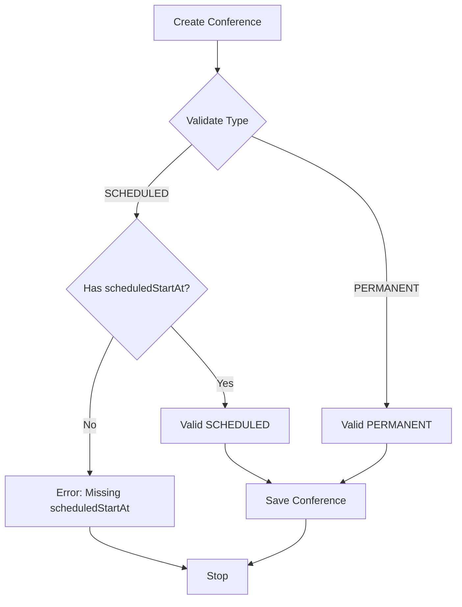

**Diagram sources**
- [ConferenceService.java:56-78](file://jmp-application/src/main/java/com/jmp/application/service/ConferenceService.java#L56-L78)
- [ConferenceService.java:139-161](file://jmp-application/src/main/java/com/jmp/application/service/ConferenceService.java#L139-L161)

### Database Schema Changes
The conference table now includes a type column with appropriate indexing:

- **Column**: `type` (VARCHAR, NOT NULL, DEFAULT 'SCHEDULED')
- **Index**: `idx_conferences_type` for type filtering
- **Comment**: Describes conference type as either SCHEDULED or PERMANENT

**Section sources**
- [Conference.java:80-83](file://jmp-domain/src/main/java/com/jmp/domain/entity/Conference.java#L80-L83)
- [Conference.java:240-243](file://jmp-domain/src/main/java/com/jmp/domain/entity/Conference.java#L240-L243)
- [ConferenceDto.java:49](file://jmp-application/src/main/java/com/jmp/application/dto/ConferenceDto.java#L49)
- [ConferenceDto.java:78](file://jmp-application/src/main/java/com/jmp/application/dto/ConferenceDto.java#L78)
- [V6__add_conference_type.sql:1-14](file://jmp-web/src/main/resources/db/migration/V6__add_conference_type.sql#L1-L14)

## Dependency Analysis
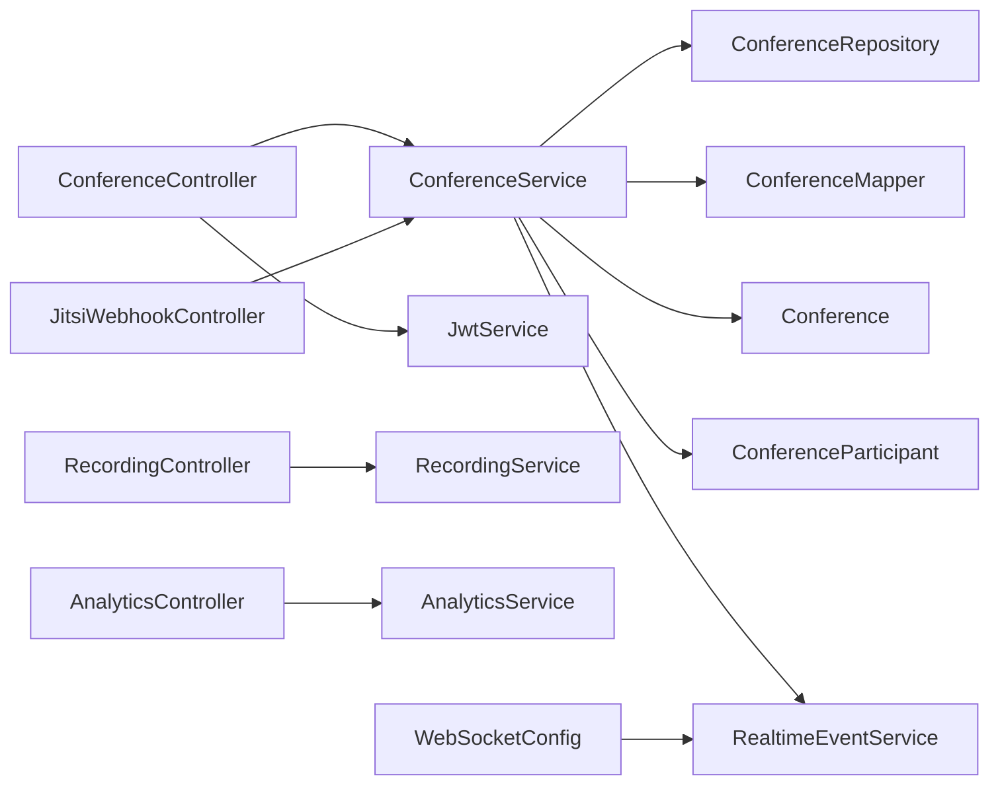

**Diagram sources**
- [ConferenceController.java:45-47](file://jmp-api/src/main/java/com/jmp/api/controller/ConferenceController.java#L45-L47)
- [ConferenceService.java:31-34](file://jmp-application/src/main/java/com/jmp/application/service/ConferenceService.java#L31-L34)
- [ConferenceRepository.java:20-110](file://jmp-domain/src/main/java/com/jmp/domain/repository/ConferenceRepository.java#L20-L110)
- [ConferenceMapper.java:15-75](file://jmp-application/src/main/java/com/jmp/application/mapper/ConferenceMapper.java#L15-L75)
- [Conference.java:25-217](file://jmp-domain/src/main/java/com/jmp/domain/entity/Conference.java#L25-L217)
- [ConferenceParticipant.java:18-150](file://jmp-domain/src/main/java/com/jmp/domain/entity/ConferenceParticipant.java#L18-L150)
- [RealtimeEventService.java:17-142](file://jmp-infrastructure/src/main/java/com/jmp/infrastructure/websocket/RealtimeEventService.java#L17-L142)
- [JitsiWebhookController.java:24-125](file://jmp-api/src/main/java/com/jmp/api/controller/JitsiWebhookController.java#L24-L125)
- [RecordingController.java:35-138](file://jmp-api/src/main/java/com/jmp/api/controller/RecordingController.java#L35-L138)
- [RecordingService.java:27-332](file://jmp-application/src/main/java/com/jmp/application/service/RecordingService.java#L27-L332)
- [AnalyticsController.java:26-96](file://jmp-api/src/main/java/com/jmp/api/controller/AnalyticsController.java#L26-L96)
- [AnalyticsService.java:25-235](file://jmp-application/src/main/java/com/jmp/application/service/AnalyticsService.java#L25-L235)
- [WebSocketConfig.java:23-70](file://jmp-infrastructure/src/main/java/com/jmp/infrastructure/websocket/WebSocketConfig.java#L23-L70)
- [JwtService.java:25-236](file://jmp-application/src/main/java/com/jmp/application/service/JwtService.java#L25-L236)

**Section sources**
- [ConferenceController.java:37-189](file://jmp-api/src/main/java/com/jmp/api/controller/ConferenceController.java#L37-L189)
- [ConferenceService.java:25-225](file://jmp-application/src/main/java/com/jmp/application/service/ConferenceService.java#L25-L225)
- [ConferenceRepository.java:20-110](file://jmp-domain/src/main/java/com/jmp/domain/repository/ConferenceRepository.java#L20-L110)
- [ConferenceMapper.java:15-75](file://jmp-application/src/main/java/com/jmp/application/mapper/ConferenceMapper.java#L15-L75)
- [Conference.java:25-217](file://jmp-domain/src/main/java/com/jmp/domain/entity/Conference.java#L25-L217)
- [ConferenceParticipant.java:18-150](file://jmp-domain/src/main/java/com/jmp/domain/entity/ConferenceParticipant.java#L18-L150)
- [RealtimeEventService.java:17-142](file://jmp-infrastructure/src/main/java/com/jmp/infrastructure/websocket/RealtimeEventService.java#L17-L142)
- [JitsiWebhookController.java:24-125](file://jmp-api/src/main/java/com/jmp/api/controller/JitsiWebhookController.java#L24-L125)
- [RecordingController.java:35-138](file://jmp-api/src/main/java/com/jmp/api/controller/RecordingController.java#L35-L138)
- [RecordingService.java:27-332](file://jmp-application/src/main/java/com/jmp/application/service/RecordingService.java#L27-L332)
- [AnalyticsController.java:26-96](file://jmp-api/src/main/java/com/jmp/api/controller/AnalyticsController.java#L26-L96)
- [AnalyticsService.java:25-235](file://jmp-application/src/main/java/com/jmp/application/service/AnalyticsService.java#L25-L235)
- [WebSocketConfig.java:23-70](file://jmp-infrastructure/src/main/java/com/jmp/infrastructure/websocket/WebSocketConfig.java#L23-L70)
- [JwtService.java:25-236](file://jmp-application/src/main/java/com/jmp/application/service/JwtService.java#L25-L236)

## Performance Considerations
- Entity Graphs: Repository queries use @EntityGraph to eagerly fetch associations (createdBy, tenant, participants) to reduce N+1 queries during detailed reads
- Pagination: Listing endpoints support Pageable for efficient large dataset traversal
- Indexing: Queries filter by tenantId and status; ensure database indexes on tenant_id, status, scheduledStartAt/scheduledEndAt, and the new type column for optimal performance
- WebSocket Scalability: In-memory broker suitable for development; production should use external brokers (e.g., RabbitMQ/Redis) for horizontal scaling
- Token TTL: Jitsi tokens expire after 4 hours; align with conference duration to avoid unnecessary re-authentication

## Troubleshooting Guide
- Conference Not Found
  - Symptom: 404 when fetching/updating/deleting
  - Cause: Invalid UUID or soft-deleted conference
  - Resolution: Verify conferenceId and tenant scoping
- Update Attempt on Ended/Cancelled
  - Symptom: 400/409 when updating
  - Cause: ConferenceService enforces immutable state post-termination
  - Resolution: Start conference again or recreate
- Start/End Constraints
  - Symptom: 400/409 on state transitions
  - Cause: Conference must be SCHEDULED to start or ACTIVE to end
  - Resolution: Check current status via GET /api/v1/conferences/{id}
- Room Name Collision
  - Symptom: 400 on creation
  - Cause: Room name must be unique per tenant
  - Resolution: Change roomName or tenant
- Token Generation Issues
  - Symptom: 404 when retrieving conference for token
  - Cause: Conference not found or tenant mismatch
  - Resolution: Confirm conferenceId and tenant association
- WebSocket Delivery Failures
  - Symptom: No real-time updates
  - Cause: Broker misconfiguration or client disconnect
  - Resolution: Validate WebSocketConfig and client subscriptions
- Conference Type Validation Errors
  - Symptom: 400 when creating/updating conference
  - Cause: Invalid conference type or missing required fields for type
  - Resolution: Ensure type is either 'SCHEDULED' or 'PERMANENT' and provide required fields (scheduledStartAt for SCHEDULED)

**Section sources**
- [ConferenceService.java:120-124](file://jmp-application/src/main/java/com/jmp/application/service/ConferenceService.java#L120-L124)
- [ConferenceService.java:143-145](file://jmp-application/src/main/java/com/jmp/application/service/ConferenceService.java#L143-L145)
- [ConferenceService.java:164-166](file://jmp-application/src/main/java/com/jmp/application/service/ConferenceService.java#L164-L166)
- [ConferenceService.java:50-54](file://jmp-application/src/main/java/com/jmp/application/service/ConferenceService.java#L50-L54)
- [ConferenceController.java:150-151](file://jmp-api/src/main/java/com/jmp/api/controller/ConferenceController.java#L150-L151)
- [WebSocketConfig.java:32-50](file://jmp-infrastructure/src/main/java/com/jmp/infrastructure/websocket/WebSocketConfig.java#L32-L50)

## Conclusion
The Conference Management Controller provides a robust, tenant-isolated solution for managing conference lifecycles, real-time updates, participant tracking, and integrations with Jitsi and storage systems. The enhanced type field support enables flexible conference management with both scheduled and permanent room options. Its layered design promotes maintainability, while DTOs and mappers ensure clean data contracts. Real-time capabilities are powered by WebSocket infrastructure, and analytics services offer insights into usage and storage. Proper adherence to state transitions, tenant scoping, access controls, and type-specific validation ensures secure and predictable operation.

## Appendices

### API Reference: Conference Endpoints
- POST /api/v1/conferences
  - Auth: MODERATOR, TENANT_ADMIN, SUPER_ADMIN
  - Request: ConferenceDto.CreateRequest (includes type field)
  - Response: 201 ConferenceDto.Response
- GET /api/v1/conferences/{id}
  - Auth: PARTICIPANT, MODERATOR, TENANT_ADMIN, SUPER_ADMIN
  - Response: ConferenceDto.Response
- GET /api/v1/conferences
  - Auth: PARTICIPANT, MODERATOR, TENANT_ADMIN, SUPER_ADMIN
  - Query: search (optional), pageable
  - Response: Page<ConferenceDto.Summary>
- GET /api/v1/conferences/active
  - Auth: PARTICIPANT, MODERATOR, TENANT_ADMIN, SUPER_ADMIN
  - Response: List<ConferenceDto.Summary>
- GET /api/v1/conferences/upcoming
  - Auth: PARTICIPANT, MODERATOR, TENANT_ADMIN, SUPER_ADMIN
  - Response: List<ConferenceDto.Summary>
- PUT /api/v1/conferences/{id}
  - Auth: MODERATOR, TENANT_ADMIN, SUPER_ADMIN
  - Request: ConferenceDto.UpdateRequest (includes type field)
  - Response: ConferenceDto.Response
- POST /api/v1/conferences/{id}/start
  - Auth: MODERATOR, TENANT_ADMIN, SUPER_ADMIN
  - Response: ConferenceDto.Response
- POST /api/v1/conferences/{id}/end
  - Auth: MODERATOR, TENANT_ADMIN, SUPER_ADMIN
  - Response: ConferenceDto.Response
- DELETE /api/v1/conferences/{id}
  - Auth: MODERATOR, TENANT_ADMIN, SUPER_ADMIN
  - Response: 204 No Content
- POST /api/v1/conferences/{id}/token
  - Auth: PARTICIPANT, MODERATOR, TENANT_ADMIN, SUPER_ADMIN
  - Request: ConferenceDto.TokenRequest
  - Response: ConferenceDto.TokenResponse

**Section sources**
- [ConferenceController.java:49-173](file://jmp-api/src/main/java/com/jmp/api/controller/ConferenceController.java#L49-L173)

### API Reference: Recording Endpoints
- POST /api/v1/recordings
  - Auth: MODERATOR, TENANT_ADMIN, SUPER_ADMIN
  - Request: RecordingDto.CreateRequest
  - Response: 201 RecordingDto.Response
- GET /api/v1/recordings/{id}
  - Auth: PARTICIPANT, MODERATOR, TENANT_ADMIN, SUPER_ADMIN
  - Response: RecordingDto.Response
- GET /api/v1/recordings
  - Auth: PARTICIPANT, MODERATOR, TENANT_ADMIN, SUPER_ADMIN
  - Query: search (optional), pageable
  - Response: Page<RecordingDto.Summary>
- GET /api/v1/recordings/conference/{conferenceId}
  - Auth: PARTICIPANT, MODERATOR, TENANT_ADMIN, SUPER_ADMIN
  - Response: List<RecordingDto.Summary>
- GET /api/v1/recordings/{id}/download
  - Auth: PARTICIPANT, MODERATOR, TENANT_ADMIN, SUPER_ADMIN
  - Query: expirationMinutes (default 60)
  - Response: RecordingDto.DownloadUrlResponse
- PUT /api/v1/recordings/{id}
  - Auth: MODERATOR, TENANT_ADMIN, SUPER_ADMIN
  - Request: RecordingDto.UpdateRequest
  - Response: RecordingDto.Response
- DELETE /api/v1/recordings/{id}
  - Auth: MODERATOR, TENANT_ADMIN, SUPER_ADMIN
  - Response: 204 No Content
- GET /api/v1/recordings/stats/storage
  - Auth: TENANT_ADMIN, SUPER_ADMIN
  - Response: RecordingDto.StorageStats

**Section sources**
- [RecordingController.java:45-138](file://jmp-api/src/main/java/com/jmp/api/controller/RecordingController.java#L45-L138)

### API Reference: Analytics Endpoints
- GET /api/v1/analytics/dashboard
  - Auth: TENANT_ADMIN, SUPER_ADMIN, AUDITOR
  - Response: AnalyticsService.DashboardMetrics
- GET /api/v1/analytics/usage-report
  - Auth: TENANT_ADMIN, SUPER_ADMIN, AUDITOR
  - Query: startDate, endDate
  - Response: AnalyticsService.UsageReport
- GET /api/v1/analytics/participants
  - Auth: TENANT_ADMIN, SUPER_ADMIN, AUDITOR
  - Query: startDate, endDate
  - Response: AnalyticsService.ParticipantAnalytics
- GET /api/v1/analytics/recordings
  - Auth: TENANT_ADMIN, SUPER_ADMIN, AUDITOR
  - Query: startDate, endDate
  - Response: AnalyticsService.RecordingAnalytics
- GET /api/v1/analytics/system-health
  - Auth: SUPER_ADMIN
  - Response: AnalyticsService.SystemHealthMetrics

**Section sources**
- [AnalyticsController.java:36-96](file://jmp-api/src/main/java/com/jmp/api/controller/AnalyticsController.java#L36-L96)

### Conference Type Specifications
- **ConferenceType Enum Values**:
  - `SCHEDULED`: Conference with fixed start/end times
  - `PERMANENT`: Always-available conference room
- **Type Validation Rules**:
  - SCHEDULED conferences require `scheduledStartAt`
  - PERMANENT conferences have no time constraints
  - Type cannot be changed to invalid values
- **Database Schema**:
  - Column: `type` (VARCHAR, NOT NULL, DEFAULT 'SCHEDULED')
  - Index: `idx_conferences_type` for performance
  - Comment: Describes conference type distinction

**Section sources**
- [Conference.java:240-243](file://jmp-domain/src/main/java/com/jmp/domain/entity/Conference.java#L240-L243)
- [ConferenceService.java:56-78](file://jmp-application/src/main/java/com/jmp/application/service/ConferenceService.java#L56-L78)
- [ConferenceService.java:139-161](file://jmp-application/src/main/java/com/jmp/application/service/ConferenceService.java#L139-L161)
- [V6__add_conference_type.sql:1-14](file://jmp-web/src/main/resources/db/migration/V6__add_conference_type.sql#L1-L14)

### Jitsi Webhook Events
- Supported Types:
  - CONFERENCE_CREATED, CONFERENCE_ENDED
  - PARTICIPANT_JOINED, PARTICIPANT_LEFT
  - RECORDING_STATUS_CHANGED, STREAMING_STATUS_CHANGED
- Signature Verification:
  - Optional; configurable via signature header

**Section sources**
- [JitsiWebhookController.java:54-109](file://jmp-api/src/main/java/com/jmp/api/controller/JitsiWebhookController.java#L54-L109)