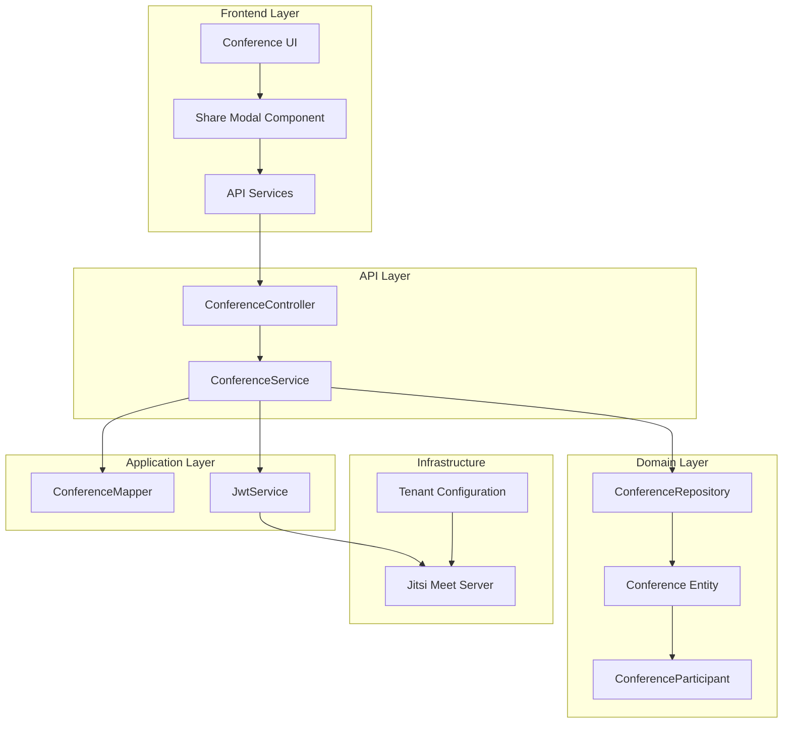
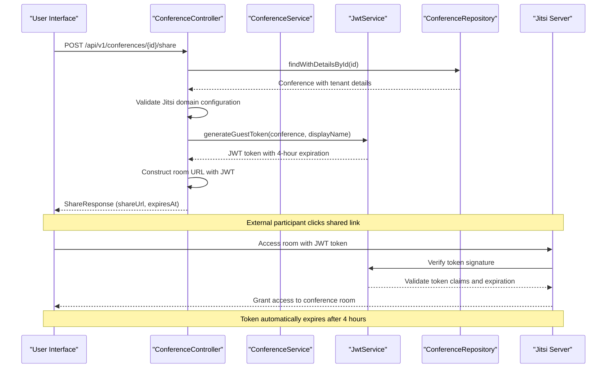
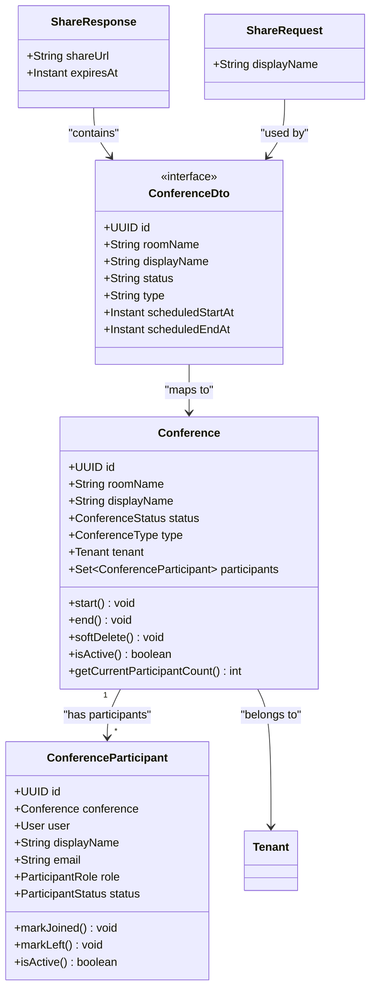
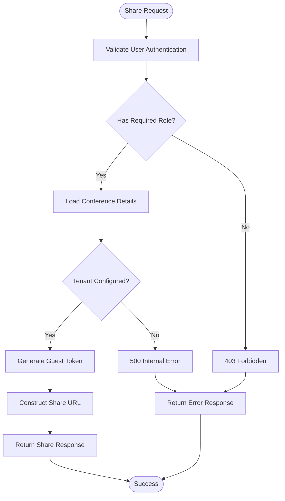
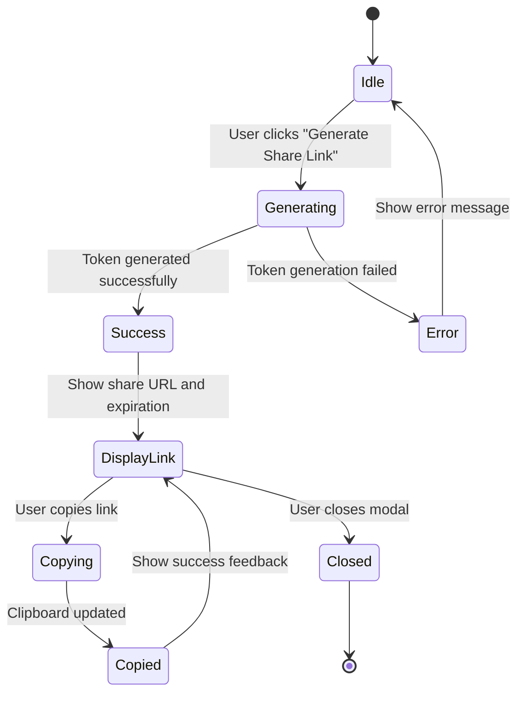
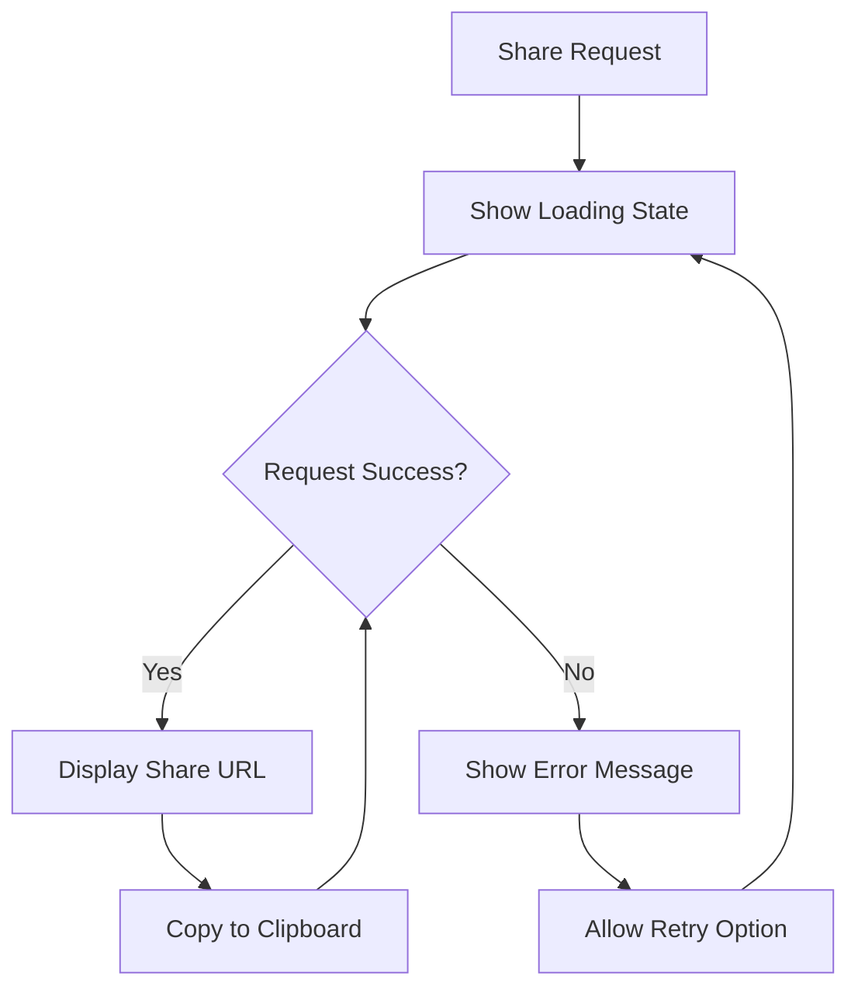

# Conference Sharing Functionality

<cite>
**Referenced Files in This Document**
- [ConferenceController.java](file://jmp-api/src/main/java/com/jmp/api/controller/ConferenceController.java)
- [ConferenceService.java](file://jmp-application/src/main/java/com/jmp/application/service/ConferenceService.java)
- [JwtService.java](file://jmp-application/src/main/java/com/jmp/application/service/JwtService.java)
- [ConferenceDto.java](file://jmp-application/src/main/java/com/jmp/application/dto/ConferenceDto.java)
- [Conference.java](file://jmp-domain/src/main/java/com/jmp/domain/entity/Conference.java)
- [ConferenceParticipant.java](file://jmp-domain/src/main/java/com/jmp/domain/entity/ConferenceParticipant.java)
- [ConferenceRepository.java](file://jmp-domain/src/main/java/com/jmp/domain/repository/ConferenceRepository.java)
- [ShareModal.tsx](file://jmp-ui/src/components/ShareModal.tsx)
- [ConferencesPage.tsx](file://jmp-ui/src/pages/ConferencesPage.tsx)
- [api.ts](file://jmp-ui/src/services/api.ts)
- [index.ts](file://jmp-ui/src/types/index.ts)
</cite>

## Table of Contents
1. [Introduction](#introduction)
2. [System Architecture](#system-architecture)
3. [Core Components](#core-components)
4. [Conference Sharing Workflow](#conference-sharing-workflow)
5. [Technical Implementation](#technical-implementation)
6. [Security Model](#security-model)
7. [Frontend Integration](#frontend-integration)
8. [Configuration Requirements](#configuration-requirements)
9. [Error Handling](#error-handling)
10. [Performance Considerations](#performance-considerations)
11. [Troubleshooting Guide](#troubleshooting-guide)
12. [Conclusion](#conclusion)

## Introduction

The Conference Sharing functionality enables users to generate temporary, shareable links for video conferences powered by Jitsi Meet. This feature allows external participants to join conferences without requiring individual accounts, while maintaining security and access control through JWT tokens and tenant-specific configurations.

The system provides two primary sharing mechanisms:
- **Guest Share Links**: Temporary links valid for 4 hours that allow external participants to join conferences
- **JWT Token Generation**: Secure tokens for authenticated users with configurable moderator permissions

## System Architecture

The conference sharing functionality follows a layered architecture pattern with clear separation of concerns:



**Diagram sources**
- [ConferenceController.java:49-233](file://jmp-api/src/main/java/com/jmp/api/controller/ConferenceController.java#L49-L233)
- [ConferenceService.java:29-255](file://jmp-application/src/main/java/com/jmp/application/service/ConferenceService.java#L29-L255)
- [JwtService.java:27-245](file://jmp-application/src/main/java/com/jmp/application/service/JwtService.java#L27-L245)

## Core Components

### ConferenceController

The primary entry point for conference sharing operations, handling HTTP requests and coordinating with the service layer.

**Key Responsibilities:**
- Validates authentication and authorization for sharing operations
- Generates guest share links with expiration timestamps
- Integrates with JWT service for secure token generation
- Manages tenant-specific Jitsi domain configurations

**Security Implementation:**
- Uses Spring Security PreAuthorize annotations for role-based access control
- Supports multiple user roles: PARTICIPANT, MODERATOR, TENANT_ADMIN, SUPER_ADMIN
- Extracts tenant and user context from JWT authentication details

**Section sources**
- [ConferenceController.java:56-217](file://jmp-api/src/main/java/com/jmp/api/controller/ConferenceController.java#L56-L217)

### ConferenceService

Business logic layer responsible for conference management and sharing operations.

**Core Operations:**
- Conference lifecycle management (create, update, start, end)
- Participant tracking and status management
- Conference search and filtering capabilities
- Automated scheduling for conference start/end

**Data Validation:**
- Room name uniqueness validation per tenant
- Conference type validation (SCHEDULED vs PERMANENT)
- Scheduled conference timing requirements
- Status-based operation restrictions

**Section sources**
- [ConferenceService.java:40-255](file://jmp-application/src/main/java/com/jmp/application/service/ConferenceService.java#L40-L255)

### JwtService

JWT token generation and validation service specifically designed for Jitsi integration.

**Token Types:**
- **Guest Tokens**: Temporary access for external participants (4-hour validity)
- **Jitsi Tokens**: Full-featured access for authenticated users with moderator capabilities
- **Access Tokens**: Standard platform authentication tokens

**Security Features:**
- HMAC-SHA256 signature verification
- Tenant-scoped token generation
- Feature-based access control (recording, live streaming, screen sharing)
- Expiration time management

**Section sources**
- [JwtService.java:94-169](file://jmp-application/src/main/java/com/jmp/application/service/JwtService.java#L94-L169)

## Conference Sharing Workflow

The sharing functionality implements a comprehensive workflow for generating and managing conference access links:



**Diagram sources**
- [ConferenceController.java:185-217](file://jmp-api/src/main/java/com/jmp/api/controller/ConferenceController.java#L185-L217)
- [JwtService.java:138-169](file://jmp-application/src/main/java/com/jmp/application/service/JwtService.java#L138-L169)

### Share Link Generation Process

1. **Validation Phase**
   - Conference existence verification
   - Tenant Jitsi domain configuration check
   - User authorization validation

2. **Token Generation**
   - Guest token creation with random identifier
   - 4-hour expiration timestamp calculation
   - Jitsi-compatible claim structure

3. **URL Construction**
   - Jitsi domain resolution from tenant configuration
   - Room name extraction from conference
   - JWT token embedding in URL query parameter

4. **Response Delivery**
   - Share URL construction
   - Expiration timestamp return
   - Frontend display and copying functionality

**Section sources**
- [ConferenceController.java:185-217](file://jmp-api/src/main/java/com/jmp/api/controller/ConferenceController.java#L185-L217)
- [JwtService.java:138-169](file://jmp-application/src/main/java/com/jmp/application/service/JwtService.java#L138-L169)

## Technical Implementation

### Data Models

The conference sharing functionality relies on several key data structures:



**Diagram sources**
- [Conference.java:45-245](file://jmp-domain/src/main/java/com/jmp/domain/entity/Conference.java#L45-L245)
- [ConferenceParticipant.java:23-150](file://jmp-domain/src/main/java/com/jmp/domain/entity/ConferenceParticipant.java#L23-L150)
- [ConferenceDto.java:16-196](file://jmp-application/src/main/java/com/jmp/application/dto/ConferenceDto.java#L16-L196)

### API Endpoints

The sharing functionality exposes two primary endpoints:

| Endpoint | Method | Description | Authentication |
|----------|--------|-------------|----------------|
| `/api/v1/conferences/{id}/share` | POST | Generate shareable link for conference | PARTICIPANT+ |
| `/api/v1/conferences/{id}/token` | POST | Generate JWT token for conference | PARTICIPANT+ |

**Authorization Matrix:**
- **PARTICIPANT**: Can generate share links and JWT tokens
- **MODERATOR**: Can manage conference and generate tokens
- **TENANT_ADMIN**: Full administrative privileges
- **SUPER_ADMIN**: System-wide access

**Section sources**
- [ConferenceController.java:185-217](file://jmp-api/src/main/java/com/jmp/api/controller/ConferenceController.java#L185-L217)
- [ConferenceController.java:147-183](file://jmp-api/src/main/java/com/jmp/api/controller/ConferenceController.java#L147-L183)

## Security Model

The conference sharing system implements multiple layers of security:

### Token-Based Access Control

1. **Guest Token Security**
   - Random UUID-based guest identifiers
   - 4-hour automatic expiration
   - Minimal claim scope (room access only)
   - No persistent user association

2. **JWT Token Validation**
   - HMAC-SHA256 signature verification
   - Tenant-scoped token validation
   - Feature-based capability enforcement
   - Moderator role assignment

3. **Tenant Isolation**
   - Jitsi domain per tenant configuration
   - Cross-tenant access prevention
   - Resource quota enforcement

### Access Control Implementation



**Diagram sources**
- [ConferenceController.java:185-217](file://jmp-api/src/main/java/com/jmp/api/controller/ConferenceController.java#L185-L217)

**Section sources**
- [JwtService.java:138-169](file://jmp-application/src/main/java/com/jmp/application/service/JwtService.java#L138-L169)
- [ConferenceController.java:185-217](file://jmp-api/src/main/java/com/jmp/api/controller/ConferenceController.java#L185-L217)

## Frontend Integration

The frontend implementation provides a seamless user experience for conference sharing:

### Share Modal Component

The ShareModal component handles the complete sharing workflow:



**Diagram sources**
- [ShareModal.tsx:26-269](file://jmp-ui/src/components/ShareModal.tsx#L26-L269)

### User Interface Features

**Key UI Components:**
- **Conference Card Integration**: Share button on each conference card
- **Modal Dialog**: Comprehensive sharing interface with copy functionality
- **Expiration Display**: Clear indication of link validity period
- **Error Handling**: User-friendly error messages and retry options
- **Responsive Design**: Mobile-optimized sharing experience

**Integration Points:**
- Conference list page displays share buttons for all conferences
- Share modal integrates with conference API service
- Clipboard API for seamless link copying
- Real-time expiration countdown display

**Section sources**
- [ConferencesPage.tsx:319-322](file://jmp-ui/src/pages/ConferencesPage.tsx#L319-L322)
- [ShareModal.tsx:26-269](file://jmp-ui/src/components/ShareModal.tsx#L26-L269)

## Configuration Requirements

### Tenant Configuration

Each tenant requires specific Jitsi domain configuration:

| Configuration Parameter | Description | Default Value |
|------------------------|-------------|---------------|
| `jitsi_domain` | Jitsi server domain for conference rooms | `meet.jit.si` |
| `max_concurrent_conferences` | Maximum simultaneous conferences | 50 |
| `max_participants_per_conference` | Maximum participants per conference | 100 |
| `max_conference_duration_minutes` | Maximum conference duration | 240 |
| `allowed_features` | Enabled features (chat, recording, etc.) | `chat,screen_share,recording,live_streaming` |

### Environment Variables

```yaml
jmp:
  security:
    jwt:
      access-token-secret: "your-base64-encoded-secret-key"
      refresh-token-secret: "your-base64-encoded-refresh-secret"
      access-token-expiration-minutes: 15
      refresh-token-expiration-days: 7
  jitsi:
    domain: "meet.jit.si"
    port: 8000
```

**Section sources**
- [ConferenceController.java:198-202](file://jmp-api/src/main/java/com/jmp/api/controller/ConferenceController.java#L198-L202)
- [Tenant.java:60-61](file://jmp-domain/src/main/java/com/jmp/domain/entity/Tenant.java#L60-L61)

## Error Handling

The system implements comprehensive error handling across all layers:

### Common Error Scenarios

| Error Type | HTTP Status | Cause | Resolution |
|------------|-------------|-------|------------|
| Conference Not Found | 404 | Invalid conference ID | Verify conference exists |
| Jitsi Domain Not Configured | 500 | Missing tenant Jitsi domain | Configure tenant settings |
| Unauthorized Access | 403 | Insufficient permissions | Check user role assignments |
| Token Generation Failure | 500 | JWT service error | Retry operation |
| Invalid Request Data | 400 | Malformed request | Validate input parameters |

### Frontend Error Management

The ShareModal component provides robust error handling:



**Diagram sources**
- [ShareModal.tsx:33-53](file://jmp-ui/src/components/ShareModal.tsx#L33-L53)

**Section sources**
- [ConferenceController.java:193-202](file://jmp-api/src/main/java/com/jmp/api/controller/ConferenceController.java#L193-L202)
- [ShareModal.tsx:47-50](file://jmp-ui/src/components/ShareModal.tsx#L47-L50)

## Performance Considerations

### Scalability Factors

1. **Token Generation Efficiency**
   - JWT signing operations are CPU-intensive but fast
   - Token validation is lightweight and cache-friendly
   - Guest tokens have minimal overhead

2. **Database Optimization**
   - Entity graph fetching reduces N+1 query problems
   - Conference repository provides optimized queries
   - Indexes on tenant ID and status fields

3. **Caching Strategies**
   - JWT token validation results can be cached
   - Conference metadata caching for frequent access
   - Tenant configuration caching

### Monitoring and Metrics

Key performance indicators:
- Token generation latency (<50ms)
- Conference load time (<100ms)
- Share link generation success rate (>99.9%)
- Jitsi server response time (<2s)

## Troubleshooting Guide

### Common Issues and Solutions

**Issue**: "Jitsi domain not configured for tenant"
**Cause**: Tenant missing Jitsi domain configuration
**Solution**: Update tenant settings with valid Jitsi domain

**Issue**: Share link expires immediately
**Cause**: Incorrect system time or token validation failure
**Solution**: Verify system clock synchronization and JWT secret configuration

**Issue**: External participants cannot join
**Cause**: Jitsi server accessibility or firewall issues
**Solution**: Test Jitsi server connectivity and configure proper network access

**Issue**: Share modal shows error but API works
**Cause**: Frontend token validation or clipboard permission issues
**Solution**: Check browser permissions and retry operation

### Debugging Steps

1. **Verify Tenant Configuration**
   ```sql
   SELECT id, name, jitsi_domain FROM jmp.tenants WHERE id = 'your-tenant-id';
   ```

2. **Test JWT Token Generation**
   ```bash
   curl -X POST /api/v1/conferences/{id}/share \
     -H "Authorization: Bearer {your-jwt-token}" \
     -H "Content-Type: application/json" \
     -d '{"displayName":"Guest"}'
   ```

3. **Check Jitsi Server Connectivity**
   ```bash
   curl -I http://your-jitsi-domain:8000
   ```

**Section sources**
- [ConferenceController.java:164-168](file://jmp-api/src/main/java/com/jmp/api/controller/ConferenceController.java#L164-L168)
- [JwtService.java:138-169](file://jmp-application/src/main/java/com/jmp/application/service/JwtService.java#L138-L169)

## Conclusion

The Conference Sharing functionality provides a robust, secure, and user-friendly solution for enabling external participants to join video conferences. The implementation balances security requirements with ease of use through:

- **Multi-layered Security**: JWT tokens, tenant isolation, and role-based access control
- **Flexible Configuration**: Tenant-specific Jitsi domains and feature controls
- **Seamless User Experience**: Intuitive frontend integration and real-time feedback
- **Comprehensive Error Handling**: Graceful degradation and user-friendly error messages
- **Performance Optimization**: Efficient token generation and database operations

The system successfully addresses the core requirement of providing temporary access to conference rooms while maintaining strict security boundaries and operational reliability. Future enhancements could include advanced sharing permissions, analytics tracking, and integration with additional video conferencing platforms.