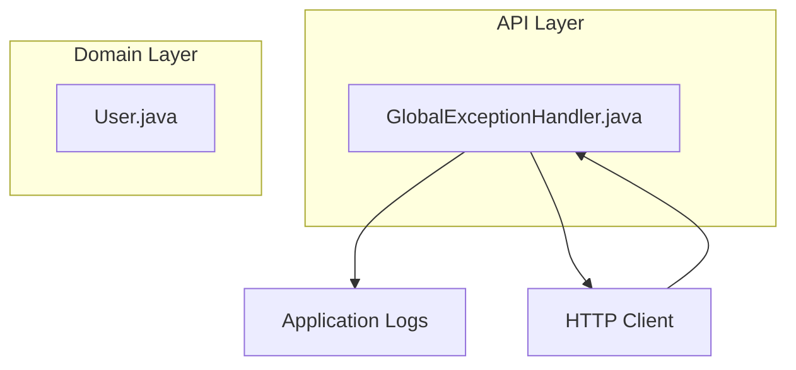
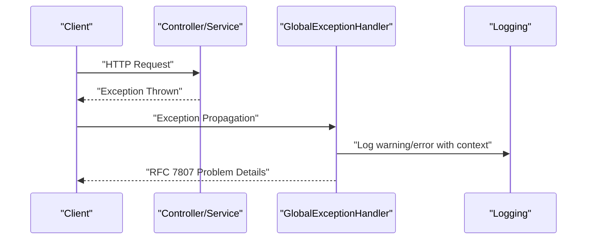
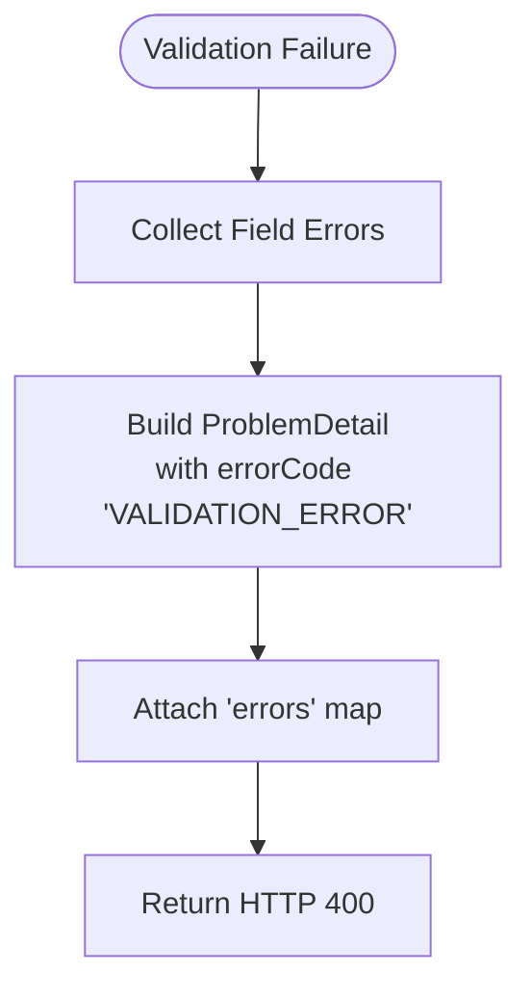
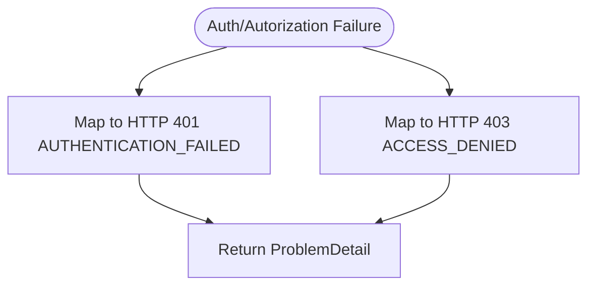
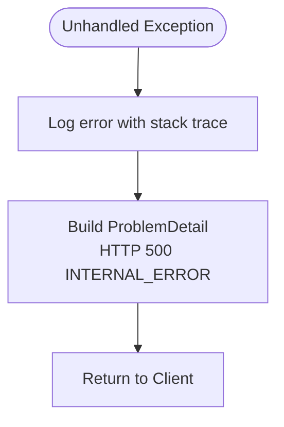
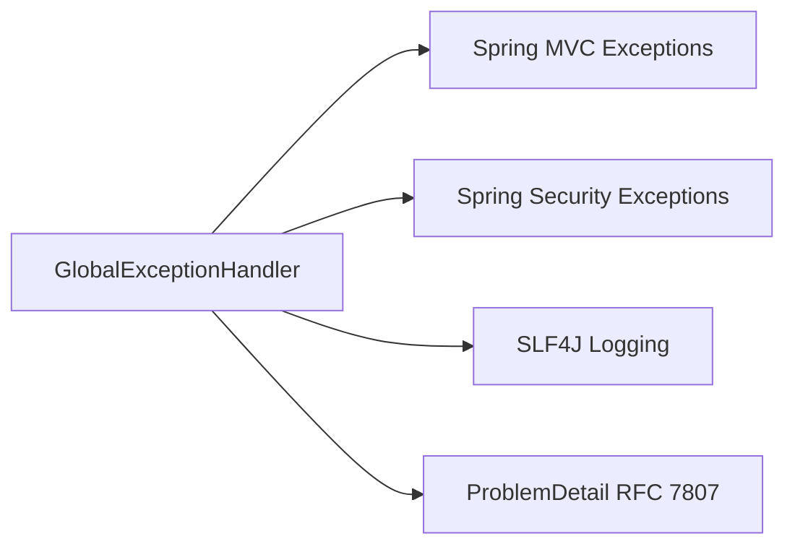

# Global Exception Handling

<cite>
**Referenced Files in This Document**
- [GlobalExceptionHandler.java](file://jmp-api/src/main/java/com/jmp/api/advice/GlobalExceptionHandler.java)
- [User.java](file://jmp-domain/src/main/java/com/jmp/domain/entity/User.java)
</cite>

## Table of Contents
1. [Introduction](#introduction)
2. [Project Structure](#project-structure)
3. [Core Components](#core-components)
4. [Architecture Overview](#architecture-overview)
5. [Detailed Component Analysis](#detailed-component-analysis)
6. [Dependency Analysis](#dependency-analysis)
7. [Performance Considerations](#performance-considerations)
8. [Troubleshooting Guide](#troubleshooting-guide)
9. [Conclusion](#conclusion)
10. [Appendices](#appendices)

## Introduction
This document describes the Global Exception Handling mechanism implemented in the API layer. It explains how exceptions are mapped to standardized HTTP responses compliant with RFC 7807 Problem Details, how error responses are formatted, and how different categories of exceptions are handled. It also covers exception logging, fallback strategies, and operational guidance for integrating these responses with frontend applications.

## Project Structure
The global exception handling is centralized in a Spring RestControllerAdvice that intercepts unhandled exceptions thrown by controllers and services. The handler produces structured error responses and logs diagnostic information for observability.

**Diagram sources**
- [GlobalExceptionHandler.java:22-24](file://jmp-api/src/main/java/com/jmp/api/advice/GlobalExceptionHandler.java#L22-L24)
- [User.java:28-164](file://jmp-domain/src/main/java/com/jmp/domain/entity/User.java#L28-L164)

**Section sources**
- [GlobalExceptionHandler.java:22-24](file://jmp-api/src/main/java/com/jmp/api/advice/GlobalExceptionHandler.java#L22-L24)

## Core Components
- GlobalExceptionHandler: A RestControllerAdvice that defines exception handlers for specific exception types and a generic fallback handler. It builds Problem Details responses with standardized fields such as title, status, detail, instance, timestamp, and errorCode. It also attaches validation errors for binding/validation failures and logs diagnostics at appropriate levels.

Key behaviors:
- Maps IllegalArgumentException to HTTP 400 with INVALID_ARGUMENT error code.
- Maps IllegalStateException to HTTP 409 with STATE_CONFLICT error code.
- Maps BadCredentialsException to HTTP 401 with AUTHENTICATION_FAILED error code.
- Maps AccessDeniedException to HTTP 403 with ACCESS_DENIED error code.
- Maps MethodArgumentNotValidException to HTTP 400 with VALIDATION_ERROR and a structured errors map.
- Maps ConstraintViolationException to HTTP 400 with CONSTRAINT_VIOLATION.
- Provides a catch-all handler for Exception to HTTP 500 with INTERNAL_ERROR.

**Section sources**
- [GlobalExceptionHandler.java:26-38](file://jmp-api/src/main/java/com/jmp/api/advice/GlobalExceptionHandler.java#L26-L38)
- [GlobalExceptionHandler.java:40-52](file://jmp-api/src/main/java/com/jmp/api/advice/GlobalExceptionHandler.java#L40-L52)
- [GlobalExceptionHandler.java:54-66](file://jmp-api/src/main/java/com/jmp/api/advice/GlobalExceptionHandler.java#L54-L66)
- [GlobalExceptionHandler.java:68-80](file://jmp-api/src/main/java/com/jmp/api/advice/GlobalExceptionHandler.java#L68-L80)
- [GlobalExceptionHandler.java:82-100](file://jmp-api/src/main/java/com/jmp/api/advice/GlobalExceptionHandler.java#L82-L100)
- [GlobalExceptionHandler.java:102-114](file://jmp-api/src/main/java/com/jmp/api/advice/GlobalExceptionHandler.java#L102-L114)
- [GlobalExceptionHandler.java:116-128](file://jmp-api/src/main/java/com/jmp/api/advice/GlobalExceptionHandler.java#L116-L128)

## Architecture Overview
The global exception handling sits between the application’s controllers/services and the HTTP client. It ensures consistent error responses regardless of where an exception originates.

**Diagram sources**
- [GlobalExceptionHandler.java:26-38](file://jmp-api/src/main/java/com/jmp/api/advice/GlobalExceptionHandler.java#L26-L38)
- [GlobalExceptionHandler.java:116-128](file://jmp-api/src/main/java/com/jmp/api/advice/GlobalExceptionHandler.java#L116-L128)

## Detailed Component Analysis

### GlobalExceptionHandler
Responsibilities:
- Intercept exceptions via @ExceptionHandler methods.
- Build ProblemDetail instances with:
  - Status code mapped per exception category.
  - Title and detail for human-readable context.
  - Instance URI pointing to the request endpoint.
  - Timestamp property for correlation.
  - errorCode property for machine-readable categorization.
  - Additional properties such as errors for validation failures.
- Log warnings for client-side errors and errors for unexpected server-side issues.

Exception categories and mappings:
- IllegalArgumentException → HTTP 400 INVALID_ARGUMENT
- IllegalStateException → HTTP 409 STATE_CONFLICT
- BadCredentialsException → HTTP 401 AUTHENTICATION_FAILED
- AccessDeniedException → HTTP 403 ACCESS_DENIED
- MethodArgumentNotValidException → HTTP 400 VALIDATION_ERROR with field-level errors
- ConstraintViolationException → HTTP 400 CONSTRAINT_VIOLATION
- Exception (fallback) → HTTP 500 INTERNAL_ERROR

Validation error handling:
- Aggregates field-level validation errors into a map keyed by field name and valued by error message.
- Attaches the map under the "errors" property for structured client consumption.

Logging and diagnostics:
- Uses warn level for client-caused errors (e.g., invalid arguments, validation failures, bad credentials, access denials).
- Uses error level for unexpected/unhandled server-side errors.

Security considerations:
- Avoids exposing internal stack traces or implementation details in error responses.
- Returns generic messages for authentication/authorization failures while still providing actionable error codes.

Operational guidance:
- Clients should parse the errorCode to drive UX and analytics.
- The presence of "errors" indicates field-level validation failures; clients should display per-field messages.

**Section sources**
- [GlobalExceptionHandler.java:26-38](file://jmp-api/src/main/java/com/jmp/api/advice/GlobalExceptionHandler.java#L26-L38)
- [GlobalExceptionHandler.java:40-52](file://jmp-api/src/main/java/com/jmp/api/advice/GlobalExceptionHandler.java#L40-L52)
- [GlobalExceptionHandler.java:54-66](file://jmp-api/src/main/java/com/jmp/api/advice/GlobalExceptionHandler.java#L54-L66)
- [GlobalExceptionHandler.java:68-80](file://jmp-api/src/main/java/com/jmp/api/advice/GlobalExceptionHandler.java#L68-L80)
- [GlobalExceptionHandler.java:82-100](file://jmp-api/src/main/java/com/jmp/api/advice/GlobalExceptionHandler.java#L82-L100)
- [GlobalExceptionHandler.java:102-114](file://jmp-api/src/main/java/com/jmp/api/advice/GlobalExceptionHandler.java#L102-L114)
- [GlobalExceptionHandler.java:116-128](file://jmp-api/src/main/java/com/jmp/api/advice/GlobalExceptionHandler.java#L116-L128)

### Validation Error Handling Flow

**Diagram sources**
- [GlobalExceptionHandler.java:82-100](file://jmp-api/src/main/java/com/jmp/api/advice/GlobalExceptionHandler.java#L82-L100)

### Authentication and Authorization Error Handling

**Diagram sources**
- [GlobalExceptionHandler.java:54-66](file://jmp-api/src/main/java/com/jmp/api/advice/GlobalExceptionHandler.java#L54-L66)
- [GlobalExceptionHandler.java:68-80](file://jmp-api/src/main/java/com/jmp/api/advice/GlobalExceptionHandler.java#L68-L80)

### Generic Fallback Handler

**Diagram sources**
- [GlobalExceptionHandler.java:116-128](file://jmp-api/src/main/java/com/jmp/api/advice/GlobalExceptionHandler.java#L116-L128)

### Domain Entity Context
While the global exception handler does not directly throw domain exceptions, the domain model informs validation constraints that can trigger validation errors routed to the handler. For example, entity-level constraints (e.g., @Email, @NotNull, @Size) can lead to binding/validation failures captured by the handler.

**Section sources**
- [User.java:35-58](file://jmp-domain/src/main/java/com/jmp/domain/entity/User.java#L35-L58)

## Dependency Analysis
- The handler depends on Spring Web MVC for exception interception and ProblemDetail for standardized responses.
- It integrates with Spring Security exception types for authentication/authorization failures.
- Logging is performed via SLF4J (via @Slf4j) to capture warnings and errors with contextual request URIs.

**Diagram sources**
- [GlobalExceptionHandler.java:10-16](file://jmp-api/src/main/java/com/jmp/api/advice/GlobalExceptionHandler.java#L10-L16)
- [GlobalExceptionHandler.java:22-24](file://jmp-api/src/main/java/com/jmp/api/advice/GlobalExceptionHandler.java#L22-L24)

**Section sources**
- [GlobalExceptionHandler.java:10-16](file://jmp-api/src/main/java/com/jmp/api/advice/GlobalExceptionHandler.java#L10-L16)
- [GlobalExceptionHandler.java:22-24](file://jmp-api/src/main/java/com/jmp/api/advice/GlobalExceptionHandler.java#L22-L24)

## Performance Considerations
- Exception handling overhead is minimal; the primary cost is logging and constructing ProblemDetail objects.
- Avoid throwing exceptions for normal control flow; rely on validation constraints and explicit checks to reduce exception volume.
- Keep error messages concise to minimize payload sizes.

## Troubleshooting Guide
Common scenarios and recommended actions:
- Validation errors (HTTP 400):
  - Inspect the errorCode and the "errors" map to identify failing fields.
  - Ensure client-side validation mirrors server-side constraints.
- Authentication failure (HTTP 401):
  - Verify credentials and token validity.
  - Confirm that the errorCode indicates AUTHENTICATION_FAILED.
- Access denied (HTTP 403):
  - Review user permissions and roles.
  - Confirm that the errorCode indicates ACCESS_DENIED.
- Unexpected server error (HTTP 500):
  - Check application logs for the error-level entries with timestamps and request URIs.
  - Investigate the stack trace attached to the logged error.

Integration tips for frontend:
- Route errorCode to localized messages for user-friendly display.
- Use the "errors" map to show inline field-specific messages.
- Capture the timestamp and errorCode for support and analytics.

**Section sources**
- [GlobalExceptionHandler.java:82-100](file://jmp-api/src/main/java/com/jmp/api/advice/GlobalExceptionHandler.java#L82-L100)
- [GlobalExceptionHandler.java:54-66](file://jmp-api/src/main/java/com/jmp/api/advice/GlobalExceptionHandler.java#L54-L66)
- [GlobalExceptionHandler.java:68-80](file://jmp-api/src/main/java/com/jmp/api/advice/GlobalExceptionHandler.java#L68-L80)
- [GlobalExceptionHandler.java:116-128](file://jmp-api/src/main/java/com/jmp/api/advice/GlobalExceptionHandler.java#L116-L128)

## Conclusion
The GlobalExceptionHandler centralizes error handling across the API, ensuring consistent, standards-compliant responses and robust logging. By categorizing exceptions and attaching machine- and human-readable metadata, it enables reliable client integrations, effective debugging, and secure error communication.

## Appendices

### Error Response Format (RFC 7807 Problem Details)
- Fields included in all responses:
  - type: Standardized reference for the error type.
  - title: Human-readable summary of the error category.
  - status: HTTP status code.
  - detail: Brief description of the error.
  - instance: URI of the request endpoint.
  - timestamp: ISO instant for correlation.
  - errorCode: Machine-readable error classification.
  - errors: Optional map of field-level validation errors.

Mapping examples:
- INVALID_ARGUMENT: HTTP 400 for invalid arguments.
- STATE_CONFLICT: HTTP 409 for conflicting state transitions.
- AUTHENTICATION_FAILED: HTTP 401 for invalid credentials.
- ACCESS_DENIED: HTTP 403 for insufficient permissions.
- VALIDATION_ERROR: HTTP 400 with "errors" map for binding/validation failures.
- CONSTRAINT_VIOLATION: HTTP 400 for bean validation constraint violations.
- INTERNAL_ERROR: HTTP 500 for unexpected server errors.

**Section sources**
- [GlobalExceptionHandler.java:26-38](file://jmp-api/src/main/java/com/jmp/api/advice/GlobalExceptionHandler.java#L26-L38)
- [GlobalExceptionHandler.java:40-52](file://jmp-api/src/main/java/com/jmp/api/advice/GlobalExceptionHandler.java#L40-L52)
- [GlobalExceptionHandler.java:54-66](file://jmp-api/src/main/java/com/jmp/api/advice/GlobalExceptionHandler.java#L54-L66)
- [GlobalExceptionHandler.java:68-80](file://jmp-api/src/main/java/com/jmp/api/advice/GlobalExceptionHandler.java#L68-L80)
- [GlobalExceptionHandler.java:82-100](file://jmp-api/src/main/java/com/jmp/api/advice/GlobalExceptionHandler.java#L82-L100)
- [GlobalExceptionHandler.java:102-114](file://jmp-api/src/main/java/com/jmp/api/advice/GlobalExceptionHandler.java#L102-L114)
- [GlobalExceptionHandler.java:116-128](file://jmp-api/src/main/java/com/jmp/api/advice/GlobalExceptionHandler.java#L116-L128)