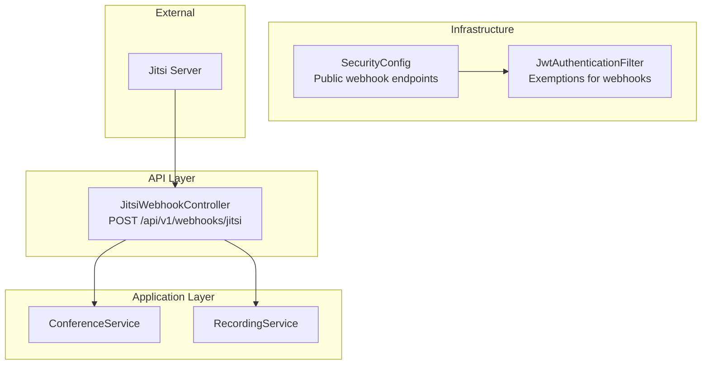
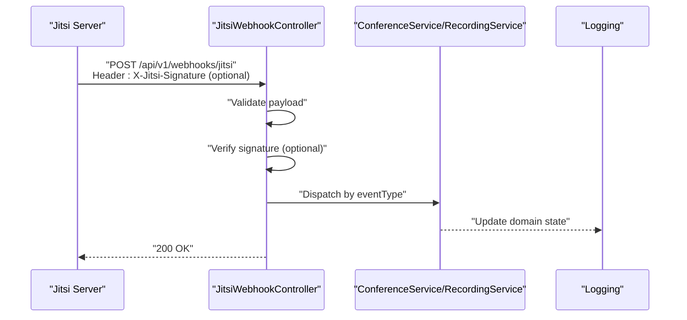
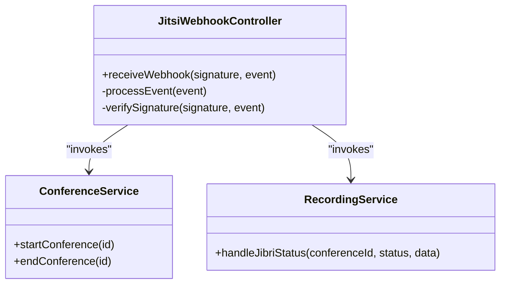
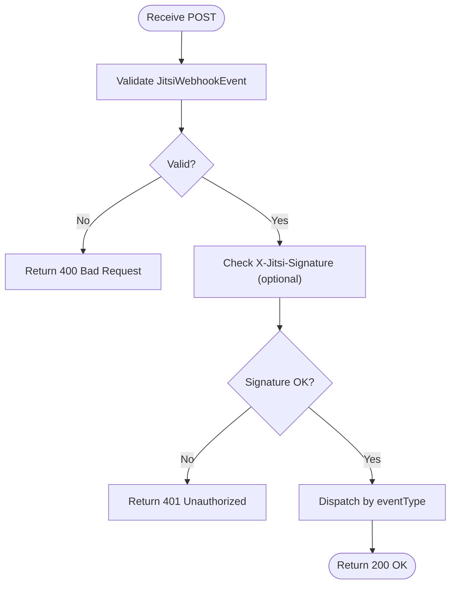

# Jitsi Webhook Controller

<cite>
**Referenced Files in This Document**
- [JitsiWebhookController.java](file://jmp-api/src/main/java/com/jmp/api/controller/JitsiWebhookController.java)
- [SecurityConfig.java](file://jmp-infrastructure/src/main/java/com/jmp/infrastructure/security/SecurityConfig.java)
- [JwtAuthenticationFilter.java](file://jmp-infrastructure/src/main/java/com/jmp/infrastructure/security/JwtAuthenticationFilter.java)
- [RecordingService.java](file://jmp-application/src/main/java/com/jmp/application/service/RecordingService.java)
- [ConferenceService.java](file://jmp-application/src/main/java/com/jmp/application/service/ConferenceService.java)
- [application.yml](file://jmp-web/src/main/resources/application.yml)
- [GlobalExceptionHandler.java](file://jmp-api/src/main/java/com/jmp/api/advice/GlobalExceptionHandler.java)
</cite>

## Table of Contents
1. [Introduction](#introduction)
2. [Project Structure](#project-structure)
3. [Core Components](#core-components)
4. [Architecture Overview](#architecture-overview)
5. [Detailed Component Analysis](#detailed-component-analysis)
6. [Dependency Analysis](#dependency-analysis)
7. [Performance Considerations](#performance-considerations)
8. [Troubleshooting Guide](#troubleshooting-guide)
9. [Conclusion](#conclusion)
10. [Appendices](#appendices)

## Introduction
This document provides comprehensive API documentation for the Jitsi Webhook Controller. It covers the webhook endpoint for receiving Jitsi events, including conference lifecycle events, participant join/leave events, and recording/streaming status changes. It also documents signature verification, event payload validation, security posture, and operational guidance for retries, dead letter handling, and error management. The document is intended for developers integrating with the platform’s webhook capabilities and for operators maintaining webhook endpoints.

## Project Structure
The webhook controller resides in the API module and integrates with application services for domain operations. Security is configured globally to permit webhook endpoints publicly while enforcing authentication for other routes. Configuration includes JWT secrets and security settings.

**Diagram sources**
- [JitsiWebhookController.java:24-52](file://jmp-api/src/main/java/com/jmp/api/controller/JitsiWebhookController.java#L24-L52)
- [SecurityConfig.java:49-58](file://jmp-infrastructure/src/main/java/com/jmp/infrastructure/security/SecurityConfig.java#L49-L58)
- [JwtAuthenticationFilter.java:87-94](file://jmp-infrastructure/src/main/java/com/jmp/infrastructure/security/JwtAuthenticationFilter.java#L87-L94)

**Section sources**
- [JitsiWebhookController.java:24-52](file://jmp-api/src/main/java/com/jmp/api/controller/JitsiWebhookController.java#L24-L52)
- [SecurityConfig.java:49-58](file://jmp-infrastructure/src/main/java/com/jmp/infrastructure/security/SecurityConfig.java#L49-L58)
- [JwtAuthenticationFilter.java:87-94](file://jmp-infrastructure/src/main/java/com/jmp/infrastructure/security/JwtAuthenticationFilter.java#L87-L94)

## Core Components
- Endpoint: POST /api/v1/webhooks/jitsi
- Headers:
  - X-Jitsi-Signature (optional)
- Body: JitsiWebhookEvent record
- Validation: Event payload is validated via bean validation
- Signature Verification: Optional HMAC verification hook
- Processing: Dispatches to handlers based on eventType

Supported event types:
- CONFERENCE_CREATED
- CONFERENCE_ENDED
- PARTICIPANT_JOINED
- PARTICIPANT_LEFT
- RECORDING_STATUS_CHANGED
- STREAMING_STATUS_CHANGED

Response:
- 200 OK on successful processing
- 401 Unauthorized if signature verification fails (when configured)
- 400 Bad Request for invalid payloads
- 500 Internal Server Error for unhandled exceptions

**Section sources**
- [JitsiWebhookController.java:33-52](file://jmp-api/src/main/java/com/jmp/api/controller/JitsiWebhookController.java#L33-L52)
- [JitsiWebhookController.java:115-123](file://jmp-api/src/main/java/com/jmp/api/controller/JitsiWebhookController.java#L115-L123)

## Architecture Overview
The webhook endpoint is intentionally public per security configuration to allow Jitsi server to deliver events without prior authentication. Signature verification is optional and currently a no-op in development. Application services are invoked to update domain state (e.g., conference lifecycle, participant counts, recording status).

**Diagram sources**
- [JitsiWebhookController.java:33-52](file://jmp-api/src/main/java/com/jmp/api/controller/JitsiWebhookController.java#L33-L52)
- [SecurityConfig.java:50-52](file://jmp-infrastructure/src/main/java/com/jmp/infrastructure/security/SecurityConfig.java#L50-L52)

## Detailed Component Analysis

### JitsiWebhookController
Responsibilities:
- Receive webhook events
- Validate payload
- Optionally verify signature
- Route to appropriate handler
- Return HTTP 200 on success

Security:
- Exempt from JWT authentication by design
- Signature verification is configurable but currently a pass-through

Event routing:
- CONFERENCE_CREATED: logs and updates conference status
- CONFERENCE_ENDED: logs and updates conference status
- PARTICIPANT_JOINED: logs participant ID and room
- PARTICIPANT_LEFT: logs participant ID and room
- RECORDING_STATUS_CHANGED: logs recording status for room
- STREAMING_STATUS_CHANGED: logs streaming status for room

Signature verification:
- Placeholder for HMAC verification
- Returns true in current implementation

Payload model:
- JitsiWebhookEvent record with eventType, roomName, tenantId, conferenceId, timestamp, participant, data

**Section sources**
- [JitsiWebhookController.java:33-123](file://jmp-api/src/main/java/com/jmp/api/controller/JitsiWebhookController.java#L33-L123)

### Security Configuration
- Webhook endpoints are permitted without authentication
- Public exemptions include /api/v1/webhooks/**
- JWT filter exempts webhook paths and health/docs
- JWT secrets configured in application.yml

**Section sources**
- [SecurityConfig.java:49-58](file://jmp-infrastructure/src/main/java/com/jmp/infrastructure/security/SecurityConfig.java#L49-L58)
- [JwtAuthenticationFilter.java:87-94](file://jmp-infrastructure/src/main/java/com/jmp/infrastructure/security/JwtAuthenticationFilter.java#L87-L94)
- [application.yml:72-78](file://jmp-web/src/main/resources/application.yml#L72-L78)

### Domain Services Involved
- ConferenceService: manages conference lifecycle and state transitions
- RecordingService: handles recording lifecycle and status updates

Note: The controller currently logs events and defers persistence to services. RecordingService includes a dedicated handler for Jibri status updates.

**Section sources**
- [ConferenceService.java:136-173](file://jmp-application/src/main/java/com/jmp/application/service/ConferenceService.java#L136-L173)
- [RecordingService.java:260-290](file://jmp-application/src/main/java/com/jmp/application/service/RecordingService.java#L260-L290)

### Event Payload Model
Structure:
- eventType: non-blank
- roomName: non-blank
- tenantId: optional
- conferenceId: optional
- timestamp: optional
- participant: optional map of string attributes
- data: optional map of arbitrary attributes

Validation:
- Non-blank constraints enforced at binding/validation time

**Section sources**
- [JitsiWebhookController.java:115-123](file://jmp-api/src/main/java/com/jmp/api/controller/JitsiWebhookController.java#L115-L123)

## Dependency Analysis
- JitsiWebhookController depends on ConferenceService for conference-related operations
- SecurityConfig permits webhook endpoints publicly
- JwtAuthenticationFilter exempts webhook paths from JWT checks
- RecordingService provides recording status handling utilities

**Diagram sources**
- [JitsiWebhookController.java:31-109](file://jmp-api/src/main/java/com/jmp/api/controller/JitsiWebhookController.java#L31-L109)
- [ConferenceService.java:136-173](file://jmp-application/src/main/java/com/jmp/application/service/ConferenceService.java#L136-L173)
- [RecordingService.java:260-290](file://jmp-application/src/main/java/com/jmp/application/service/RecordingService.java#L260-L290)

**Section sources**
- [JitsiWebhookController.java:31-109](file://jmp-api/src/main/java/com/jmp/api/controller/JitsiWebhookController.java#L31-L109)
- [SecurityConfig.java:49-58](file://jmp-infrastructure/src/main/java/com/jmp/infrastructure/security/SecurityConfig.java#L49-L58)

## Performance Considerations
- Keep webhook handlers lightweight; delegate heavy work to services
- Avoid synchronous blocking operations in the controller
- Consider asynchronous processing for high-volume events
- Monitor logs and metrics for throughput and latency

[No sources needed since this section provides general guidance]

## Troubleshooting Guide
Common issues and resolutions:
- 400 Bad Request: Validate payload against JitsiWebhookEvent schema; ensure eventType and roomName are present
- 401 Unauthorized: If signature verification is enabled, confirm X-Jitsi-Signature header matches expected HMAC
- 500 Internal Server Error: Inspect logs for unhandled exceptions; global exception handler returns RFC 7807 Problem Details

Operational tips:
- Enable debug logging for webhook controller and application services
- Confirm webhook endpoint is reachable from Jitsi server
- Verify security configuration allows public access to /api/v1/webhooks/**

**Section sources**
- [GlobalExceptionHandler.java:26-128](file://jmp-api/src/main/java/com/jmp/api/advice/GlobalExceptionHandler.java#L26-L128)
- [SecurityConfig.java:50-52](file://jmp-infrastructure/src/main/java/com/jmp/infrastructure/security/SecurityConfig.java#L50-L52)

## Conclusion
The Jitsi Webhook Controller provides a minimal, extensible endpoint for ingesting Jitsi events. It supports essential conference lifecycle and participant events, and includes hooks for recording and streaming status updates. Security is configured to permit webhook delivery without prior authentication, with optional signature verification. Operators should implement robust retry and dead letter queue strategies externally and monitor logs and metrics for reliability.

[No sources needed since this section summarizes without analyzing specific files]

## Appendices

### API Definition
- Method: POST
- Path: /api/v1/webhooks/jitsi
- Headers:
  - X-Jitsi-Signature: optional
- Body: JitsiWebhookEvent
- Responses:
  - 200 OK on success
  - 400 Bad Request for validation errors
  - 401 Unauthorized for signature failure (when configured)
  - 500 Internal Server Error for unhandled exceptions

**Section sources**
- [JitsiWebhookController.java:33-52](file://jmp-api/src/main/java/com/jmp/api/controller/JitsiWebhookController.java#L33-L52)
- [JitsiWebhookController.java:115-123](file://jmp-api/src/main/java/com/jmp/api/controller/JitsiWebhookController.java#L115-L123)

### Event Payload Validation Flow

**Diagram sources**
- [JitsiWebhookController.java:33-52](file://jmp-api/src/main/java/com/jmp/api/controller/JitsiWebhookController.java#L33-L52)

### Security and Rate Limiting Notes
- Webhook endpoints are public per configuration
- JWT filter exempts webhook paths
- Rate limiting and abuse prevention are not implemented in the controller; implement at ingress or proxy level

**Section sources**
- [SecurityConfig.java:49-58](file://jmp-infrastructure/src/main/java/com/jmp/infrastructure/security/SecurityConfig.java#L49-L58)
- [JwtAuthenticationFilter.java:87-94](file://jmp-infrastructure/src/main/java/com/jmp/infrastructure/security/JwtAuthenticationFilter.java#L87-L94)