# OpenAPI/Swagger Configuration

<cite>
**Referenced Files in This Document**
- [OpenApiConfig.java](file://jmp-api/src/main/java/com/jmp/api/config/OpenApiConfig.java)
- [AuthController.java](file://jmp-api/src/main/java/com/jmp/api/controller/AuthController.java)
- [ConferenceController.java](file://jmp-api/src/main/java/com/jmp/api/controller/ConferenceController.java)
- [UserController.java](file://jmp-api/src/main/java/com/jmp/api/controller/UserController.java)
- [AnalyticsController.java](file://jmp-api/src/main/java/com/jmp/api/controller/AnalyticsController.java)
- [AuditController.java](file://jmp-api/src/main/java/com/jmp/api/controller/AuditController.java)
- [RecordingController.java](file://jmp-api/src/main/java/com/jmp/api/controller/RecordingController.java)
- [JitsiWebhookController.java](file://jmp-api/src/main/java/com/jmp/api/controller/JitsiWebhookController.java)
- [GlobalExceptionHandler.java](file://jmp-api/src/main/java/com/jmp/api/advice/GlobalExceptionHandler.java)
- [UserDto.java](file://jmp-application/src/main/java/com/jmp/application/dto/UserDto.java)
- [ConferenceDto.java](file://jmp-application/src/main/java/com/jmp/application/dto/ConferenceDto.java)
- [RecordingDto.java](file://jmp-application/src/main/java/com/jmp/application/dto/RecordingDto.java)
- [pom.xml](file://jmp-api/pom.xml)
</cite>

## Table of Contents
1. [Introduction](#introduction)
2. [Project Structure](#project-structure)
3. [Core Components](#core-components)
4. [Architecture Overview](#architecture-overview)
5. [Detailed Component Analysis](#detailed-component-analysis)
6. [Dependency Analysis](#dependency-analysis)
7. [Performance Considerations](#performance-considerations)
8. [Troubleshooting Guide](#troubleshooting-guide)
9. [Conclusion](#conclusion)
10. [Appendices](#appendices)

## Introduction
This document explains how OpenAPI/Swagger is configured and used across the API module to generate interactive API documentation. It covers the OpenAPI specification setup, endpoint documentation via annotations, security scheme configuration, and how controllers expose metadata for the API explorer. It also documents how exceptions are standardized to improve documentation clarity, how DTOs define request/response shapes, and how to customize documentation output and integrate with API management tools.

## Project Structure
The OpenAPI/Swagger configuration and documentation live primarily in the API module:
- OpenAPI configuration bean defines metadata, servers, and security schemes.
- Controllers annotate endpoints with tags, summaries, and security requirements.
- Exception handling produces structured Problem Details responses.
- DTOs define request/response shapes for documentation.

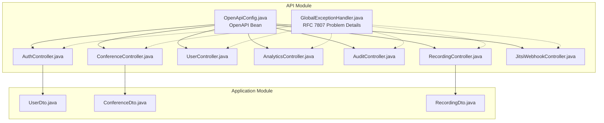

**Diagram sources**
- [OpenApiConfig.java:26-54](file://jmp-api/src/main/java/com/jmp/api/config/OpenApiConfig.java#L26-L54)
- [AuthController.java:30-35](file://jmp-api/src/main/java/com/jmp/api/controller/AuthController.java#L30-L35)
- [ConferenceController.java:37-43](file://jmp-api/src/main/java/com/jmp/api/controller/ConferenceController.java#L37-L43)
- [UserController.java:33-39](file://jmp-api/src/main/java/com/jmp/api/controller/UserController.java#L33-L39)
- [AnalyticsController.java:26-32](file://jmp-api/src/main/java/com/jmp/api/controller/AnalyticsController.java#L26-L32)
- [AuditController.java:30-36](file://jmp-api/src/main/java/com/jmp/api/controller/AuditController.java#L30-L36)
- [RecordingController.java:35-41](file://jmp-api/src/main/java/com/jmp/api/controller/RecordingController.java#L35-L41)
- [JitsiWebhookController.java:24-29](file://jmp-api/src/main/java/com/jmp/api/controller/JitsiWebhookController.java#L24-L29)
- [GlobalExceptionHandler.java:22-24](file://jmp-api/src/main/java/com/jmp/api/advice/GlobalExceptionHandler.java#L22-L24)
- [UserDto.java:14-97](file://jmp-application/src/main/java/com/jmp/application/dto/UserDto.java#L14-L97)
- [ConferenceDto.java:15-176](file://jmp-application/src/main/java/com/jmp/application/dto/ConferenceDto.java#L15-L176)
- [RecordingDto.java:13-170](file://jmp-application/src/main/java/com/jmp/application/dto/RecordingDto.java#L13-L170)

**Section sources**
- [OpenApiConfig.java:26-54](file://jmp-api/src/main/java/com/jmp/api/config/OpenApiConfig.java#L26-L54)
- [pom.xml:48-52](file://jmp-api/pom.xml#L48-L52)

## Core Components
- OpenAPI configuration bean sets the API title, description, version, contact/license, servers, and a bearer security scheme globally applied to endpoints.
- Controllers use Swagger annotations to tag endpoints, provide operation summaries, and apply per-controller security requirements.
- DTOs define request/response structures, enabling accurate schema documentation.
- Global exception handler ensures consistent error responses aligned with RFC 7807, improving documentation accuracy.

Key responsibilities:
- OpenApiConfig: centralizes OpenAPI metadata and security scheme definition.
- Controllers: document endpoints, roles, and request/response shapes.
- DTOs: define fields and constraints for schema rendering.
- GlobalExceptionHandler: standardizes error responses for documentation.

**Section sources**
- [OpenApiConfig.java:26-54](file://jmp-api/src/main/java/com/jmp/api/config/OpenApiConfig.java#L26-L54)
- [AuthController.java:34-35](file://jmp-api/src/main/java/com/jmp/api/controller/AuthController.java#L34-L35)
- [ConferenceController.java:41-42](file://jmp-api/src/main/java/com/jmp/api/controller/ConferenceController.java#L41-L42)
- [UserController.java:37-38](file://jmp-api/src/main/java/com/jmp/api/controller/UserController.java#L37-L38)
- [AnalyticsController.java:30-31](file://jmp-api/src/main/java/com/jmp/api/controller/AnalyticsController.java#L30-L31)
- [AuditController.java:34-35](file://jmp-api/src/main/java/com/jmp/api/controller/AuditController.java#L34-L35)
- [RecordingController.java:39-40](file://jmp-api/src/main/java/com/jmp/api/controller/RecordingController.java#L39-L40)
- [JitsiWebhookController.java:28](file://jmp-api/src/main/java/com/jmp/api/controller/JitsiWebhookController.java#L28)
- [GlobalExceptionHandler.java:22-24](file://jmp-api/src/main/java/com/jmp/api/advice/GlobalExceptionHandler.java#L22-L24)

## Architecture Overview
The OpenAPI/Swagger stack integrates with Spring MVC controllers and SpringDoc UI to produce interactive documentation. The configuration bean defines global metadata and security, while controllers annotate endpoints. DTOs provide request/response schemas. Exceptions are normalized to improve documentation reliability.

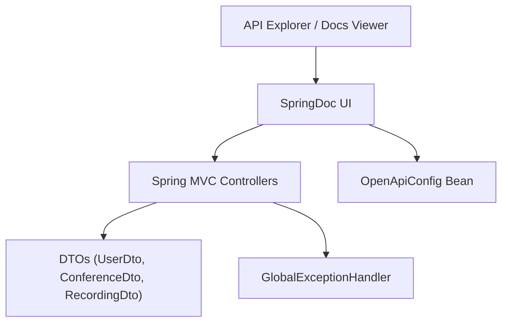

**Diagram sources**
- [OpenApiConfig.java:26-54](file://jmp-api/src/main/java/com/jmp/api/config/OpenApiConfig.java#L26-L54)
- [pom.xml:48-52](file://jmp-api/pom.xml#L48-L52)
- [UserDto.java:14-97](file://jmp-application/src/main/java/com/jmp/application/dto/UserDto.java#L14-L97)
- [ConferenceDto.java:15-176](file://jmp-application/src/main/java/com/jmp/application/dto/ConferenceDto.java#L15-L176)
- [RecordingDto.java:13-170](file://jmp-application/src/main/java/com/jmp/application/dto/RecordingDto.java#L13-L170)
- [GlobalExceptionHandler.java:22-24](file://jmp-api/src/main/java/com/jmp/api/advice/GlobalExceptionHandler.java#L22-L24)

## Detailed Component Analysis

### OpenAPI Configuration
The OpenAPI configuration bean defines:
- Info: title, description, version, contact, license.
- Servers: local and production URLs.
- Security scheme: bearer JWT with name, type, scheme, and description.
- Global security requirement applied to endpoints.

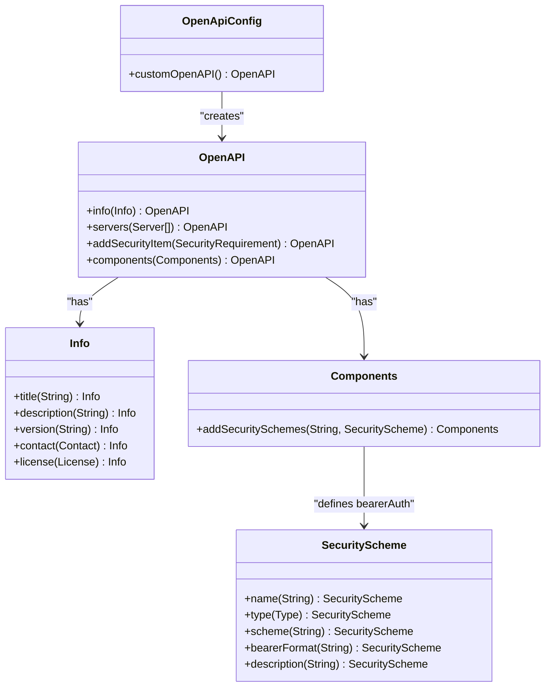

**Diagram sources**
- [OpenApiConfig.java:26-54](file://jmp-api/src/main/java/com/jmp/api/config/OpenApiConfig.java#L26-L54)

**Section sources**
- [OpenApiConfig.java:26-54](file://jmp-api/src/main/java/com/jmp/api/config/OpenApiConfig.java#L26-L54)

### Authentication Endpoints
- Tagged as “Authentication”.
- Uses bearer security requirement.
- Summaries describe login and token refresh operations.
- DTOs define request/response shapes.

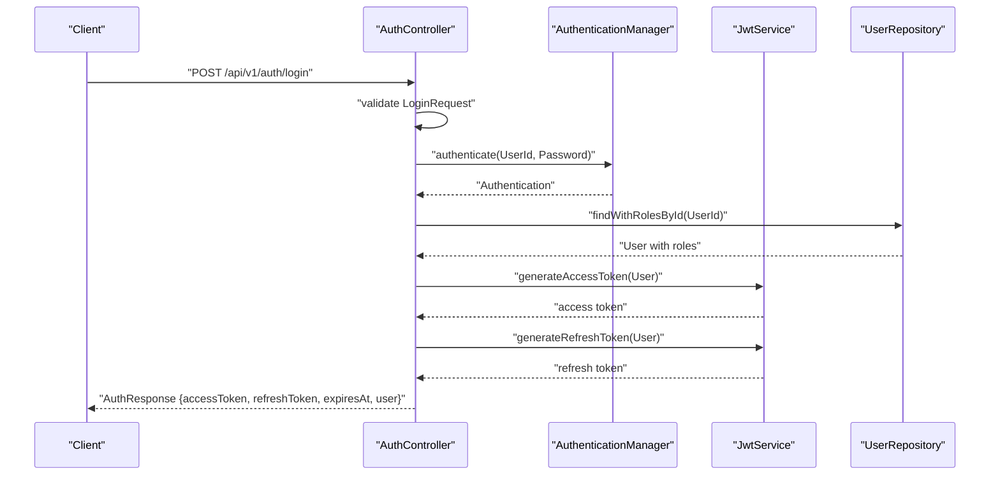

**Diagram sources**
- [AuthController.java:42-81](file://jmp-api/src/main/java/com/jmp/api/controller/AuthController.java#L42-L81)
- [UserDto.java:67-78](file://jmp-application/src/main/java/com/jmp/application/dto/UserDto.java#L67-L78)

**Section sources**
- [AuthController.java:34-35](file://jmp-api/src/main/java/com/jmp/api/controller/AuthController.java#L34-L35)
- [AuthController.java:42-81](file://jmp-api/src/main/java/com/jmp/api/controller/AuthController.java#L42-L81)
- [UserDto.java:30-44](file://jmp-application/src/main/java/com/jmp/application/dto/UserDto.java#L30-L44)
- [UserDto.java:67-78](file://jmp-application/src/main/java/com/jmp/application/dto/UserDto.java#L67-L78)

### Conference Management Endpoints
- Tagged as “Conferences”.
- Uses bearer security requirement.
- Summaries describe CRUD and lifecycle operations.
- Token generation endpoint integrates with Jitsi.

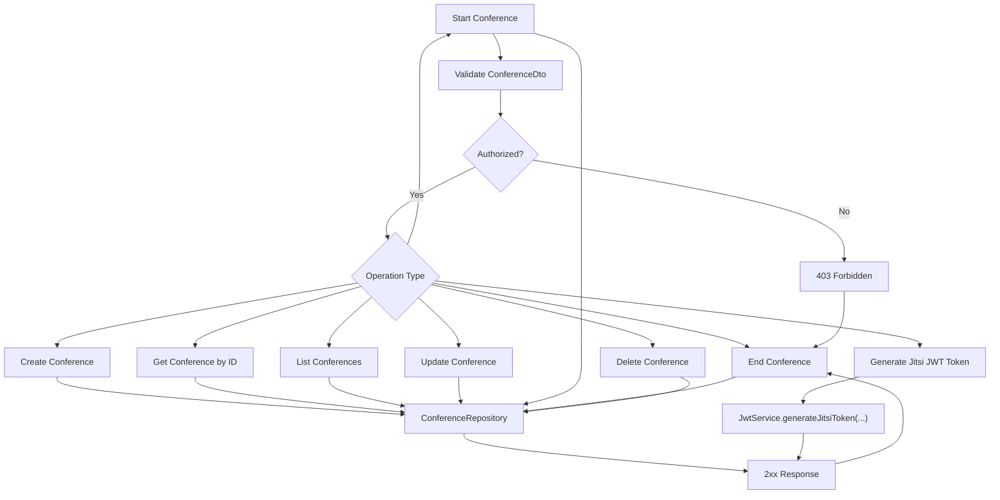

**Diagram sources**
- [ConferenceController.java:49-138](file://jmp-api/src/main/java/com/jmp/api/controller/ConferenceController.java#L49-L138)
- [ConferenceDto.java:43-125](file://jmp-application/src/main/java/com/jmp/application/dto/ConferenceDto.java#L43-L125)

**Section sources**
- [ConferenceController.java:41-42](file://jmp-api/src/main/java/com/jmp/api/controller/ConferenceController.java#L41-L42)
- [ConferenceController.java:49-138](file://jmp-api/src/main/java/com/jmp/api/controller/ConferenceController.java#L49-L138)
- [ConferenceDto.java:15-176](file://jmp-application/src/main/java/com/jmp/application/dto/ConferenceDto.java#L15-L176)

### User Management Endpoints
- Tagged as “Users”.
- Uses bearer security requirement.
- Summaries describe CRUD and self-management operations.

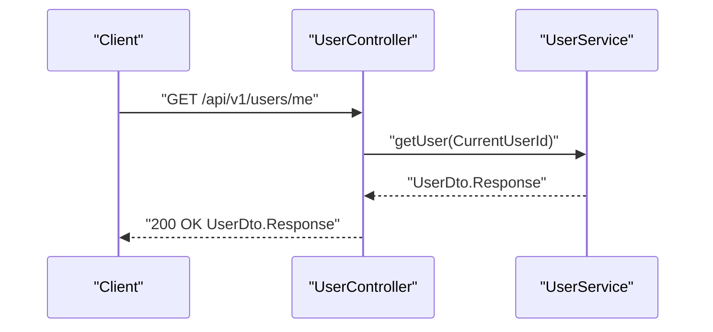

**Diagram sources**
- [UserController.java:102-107](file://jmp-api/src/main/java/com/jmp/api/controller/UserController.java#L102-L107)
- [UserDto.java:67-78](file://jmp-application/src/main/java/com/jmp/application/dto/UserDto.java#L67-L78)

**Section sources**
- [UserController.java:37-38](file://jmp-api/src/main/java/com/jmp/api/controller/UserController.java#L37-L38)
- [UserController.java:102-107](file://jmp-api/src/main/java/com/jmp/api/controller/UserController.java#L102-L107)
- [UserDto.java:67-78](file://jmp-application/src/main/java/com/jmp/application/dto/UserDto.java#L67-L78)

### Analytics and Reporting Endpoints
- Tagged as “Analytics”.
- Uses bearer security requirement.
- Summaries describe dashboard metrics, usage reports, participant analytics, recording analytics, and system health.

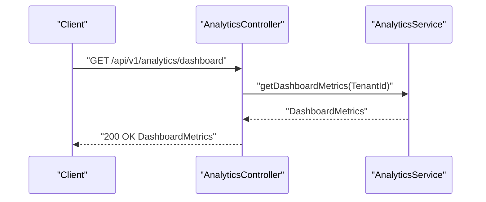

**Diagram sources**
- [AnalyticsController.java:36-44](file://jmp-api/src/main/java/com/jmp/api/controller/AnalyticsController.java#L36-L44)

**Section sources**
- [AnalyticsController.java:30-31](file://jmp-api/src/main/java/com/jmp/api/controller/AnalyticsController.java#L30-L31)
- [AnalyticsController.java:36-44](file://jmp-api/src/main/java/com/jmp/api/controller/AnalyticsController.java#L36-L44)

### Audit Log Endpoints
- Tagged as “Audit”.
- Uses bearer security requirement.
- Summaries describe searching logs, entity-specific logs, and security events.

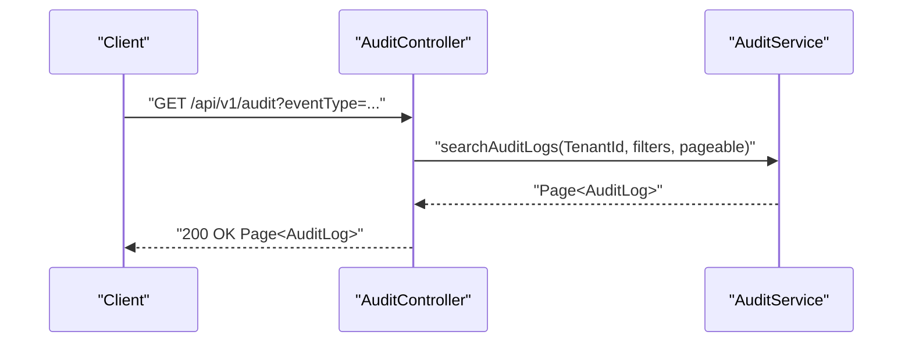

**Diagram sources**
- [AuditController.java:40-53](file://jmp-api/src/main/java/com/jmp/api/controller/AuditController.java#L40-L53)

**Section sources**
- [AuditController.java:34-35](file://jmp-api/src/main/java/com/jmp/api/controller/AuditController.java#L34-L35)
- [AuditController.java:40-53](file://jmp-api/src/main/java/com/jmp/api/controller/AuditController.java#L40-L53)

### Recording Management Endpoints
- Tagged as “Recordings”.
- Uses bearer security requirement.
- Summaries describe CRUD, search, download URL generation, and storage statistics.

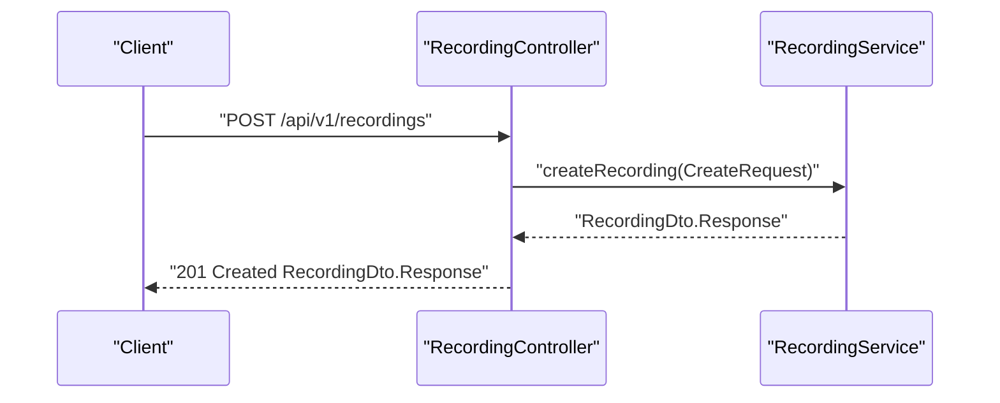

**Diagram sources**
- [RecordingController.java:45-53](file://jmp-api/src/main/java/com/jmp/api/controller/RecordingController.java#L45-L53)
- [RecordingDto.java:99-122](file://jmp-application/src/main/java/com/jmp/application/dto/RecordingDto.java#L99-L122)

**Section sources**
- [RecordingController.java:39-40](file://jmp-api/src/main/java/com/jmp/api/controller/RecordingController.java#L39-L40)
- [RecordingController.java:45-53](file://jmp-api/src/main/java/com/jmp/api/controller/RecordingController.java#L45-L53)
- [RecordingDto.java:99-122](file://jmp-application/src/main/java/com/jmp/application/dto/RecordingDto.java#L99-L122)

### Jitsi Webhook Endpoints
- Tagged as “Jitsi Webhooks”.
- Summaries describe receiving webhook events with optional signature verification.

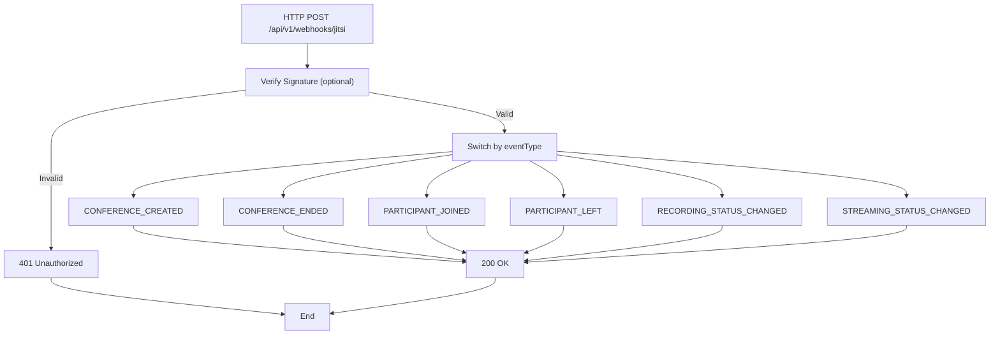

**Diagram sources**
- [JitsiWebhookController.java:33-52](file://jmp-api/src/main/java/com/jmp/api/controller/JitsiWebhookController.java#L33-L52)

**Section sources**
- [JitsiWebhookController.java:28](file://jmp-api/src/main/java/com/jmp/api/controller/JitsiWebhookController.java#L28)
- [JitsiWebhookController.java:33-52](file://jmp-api/src/main/java/com/jmp/api/controller/JitsiWebhookController.java#L33-L52)

### Exception Handling and Documentation Accuracy
- Global exception handler produces RFC 7807 Problem Details responses with consistent fields across error types.
- Improves documentation accuracy by ensuring error schemas are predictable and uniform.

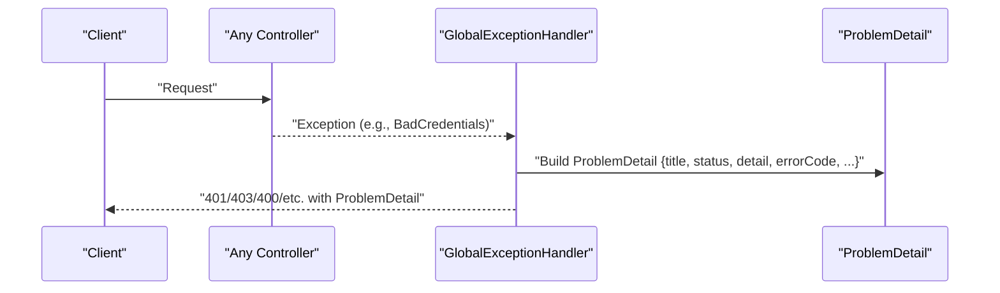

**Diagram sources**
- [GlobalExceptionHandler.java:54-66](file://jmp-api/src/main/java/com/jmp/api/advice/GlobalExceptionHandler.java#L54-L66)

**Section sources**
- [GlobalExceptionHandler.java:22-24](file://jmp-api/src/main/java/com/jmp/api/advice/GlobalExceptionHandler.java#L22-L24)
- [GlobalExceptionHandler.java:54-66](file://jmp-api/src/main/java/com/jmp/api/advice/GlobalExceptionHandler.java#L54-L66)

## Dependency Analysis
The API module depends on SpringDoc OpenAPI UI starter to generate documentation. Controllers depend on application-layer services and DTOs to define request/response schemas.

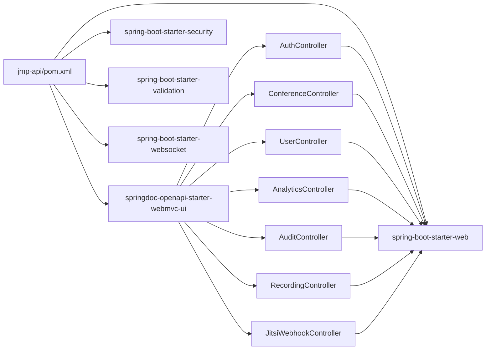

**Diagram sources**
- [pom.xml:48-52](file://jmp-api/pom.xml#L48-L52)

**Section sources**
- [pom.xml:48-52](file://jmp-api/pom.xml#L48-L52)

## Performance Considerations
- Keep DTOs concise and focused to reduce schema complexity in documentation.
- Prefer pagination for list endpoints to avoid large payloads in docs.
- Centralize security checks to minimize branching in controllers, simplifying documentation coverage.
- Use summary descriptions judiciously to keep the API explorer navigable.

## Troubleshooting Guide
Common issues and resolutions:
- Missing or invalid bearer token leads to 401/403 responses. Ensure the security scheme is enabled in the API explorer and the token is included in the correct header.
- Validation errors return structured Problem Details with field-level messages. Review the “errors” property to resolve request issues.
- AccessDeniedExceptions indicate insufficient permissions. Verify role-based authorizations and tenant scoping.

**Section sources**
- [GlobalExceptionHandler.java:54-80](file://jmp-api/src/main/java/com/jmp/api/advice/GlobalExceptionHandler.java#L54-L80)
- [ConferenceController.java:108-138](file://jmp-api/src/main/java/com/jmp/api/controller/ConferenceController.java#L108-L138)
- [UserController.java:84-100](file://jmp-api/src/main/java/com/jmp/api/controller/UserController.java#L84-L100)

## Conclusion
The API module integrates OpenAPI/Swagger through a centralized configuration bean, controller annotations, and standardized DTOs. SpringDoc UI renders interactive documentation, while the global exception handler ensures consistent error schemas. Together, these components provide a robust foundation for API documentation, security, and developer experience.

## Appendices

### Customizing Documentation Output
- Metadata customization: adjust title, description, version, contact, and license in the OpenAPI bean.
- Security scheme customization: modify the bearer scheme name, type, and description to match your deployment.
- Endpoint documentation: add operation summaries and descriptions via controller annotations.
- Servers customization: update local and production URLs to reflect your environments.

**Section sources**
- [OpenApiConfig.java:30-53](file://jmp-api/src/main/java/com/jmp/api/config/OpenApiConfig.java#L30-L53)

### Interactive API Testing
- Use the API explorer generated by SpringDoc to test endpoints directly.
- Apply the bearer token from authentication endpoints to protected routes.
- Leverage pre-filled examples from DTOs to construct requests.

**Section sources**
- [AuthController.java:42-81](file://jmp-api/src/main/java/com/jmp/api/controller/AuthController.java#L42-L81)
- [ConferenceController.java:140-173](file://jmp-api/src/main/java/com/jmp/api/controller/ConferenceController.java#L140-L173)
- [RecordingController.java:91-103](file://jmp-api/src/main/java/com/jmp/api/controller/RecordingController.java#L91-L103)

### Versioning and Maintenance
- Version the API via the OpenAPI info version and base paths (e.g., /api/v1).
- Maintain DTOs alongside controllers to keep documentation synchronized with implementation.
- Centralize security configuration in the OpenAPI bean to enforce consistent policies.

**Section sources**
- [OpenApiConfig.java:35](file://jmp-api/src/main/java/com/jmp/api/config/OpenApiConfig.java#L35)
- [ConferenceController.java:38](file://jmp-api/src/main/java/com/jmp/api/controller/ConferenceController.java#L38)
- [UserController.java:34](file://jmp-api/src/main/java/com/jmp/api/controller/UserController.java#L34)

### Integrating with API Management Tools
- Export the OpenAPI JSON from the SpringDoc endpoint for ingestion into gateway/API management platforms.
- Use consistent tags and operation IDs to facilitate tooling integrations.
- Keep DTOs stable to minimize breaking changes in generated clients.

**Section sources**
- [pom.xml:48-52](file://jmp-api/pom.xml#L48-L52)