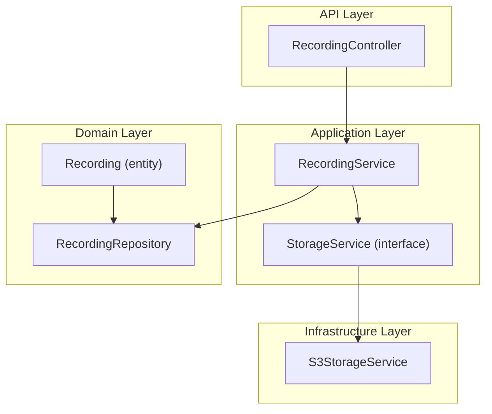
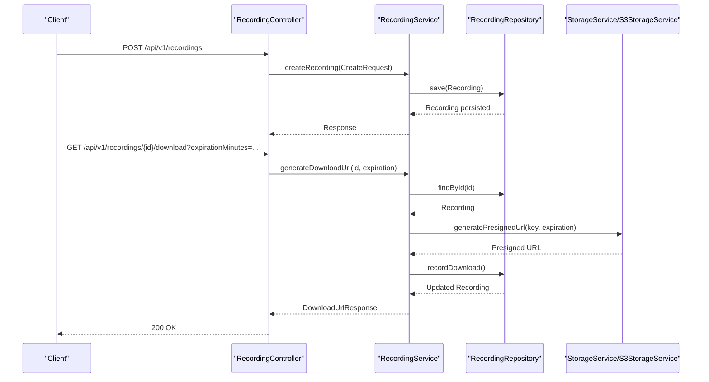
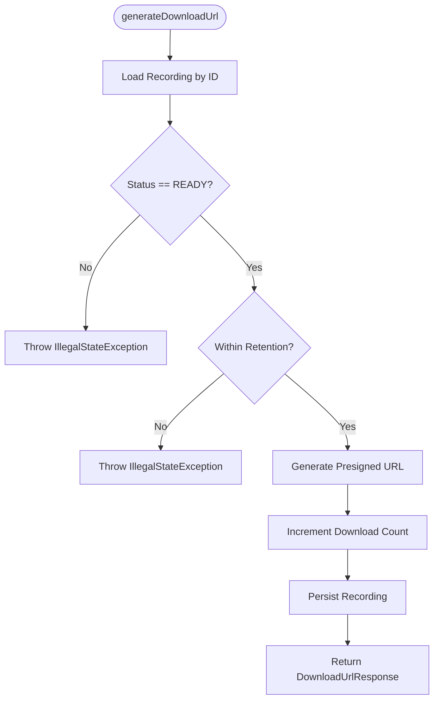
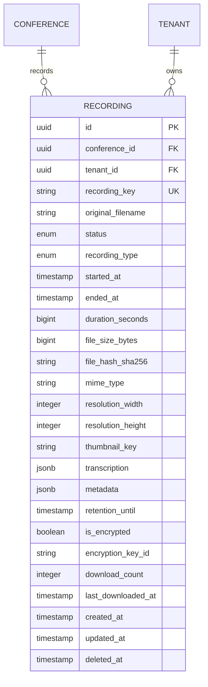
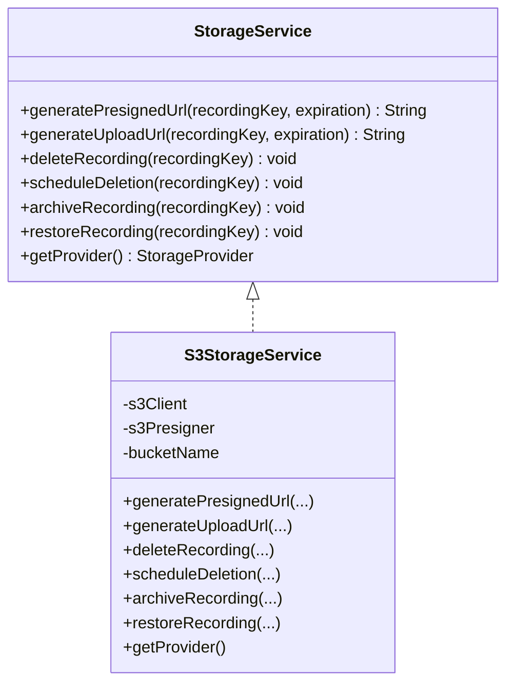
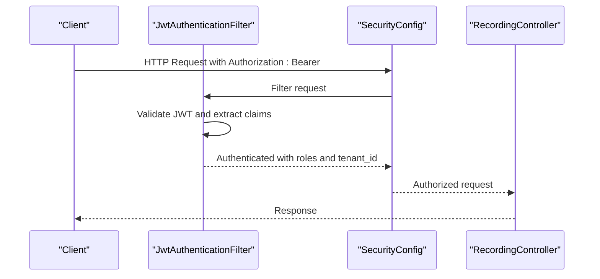
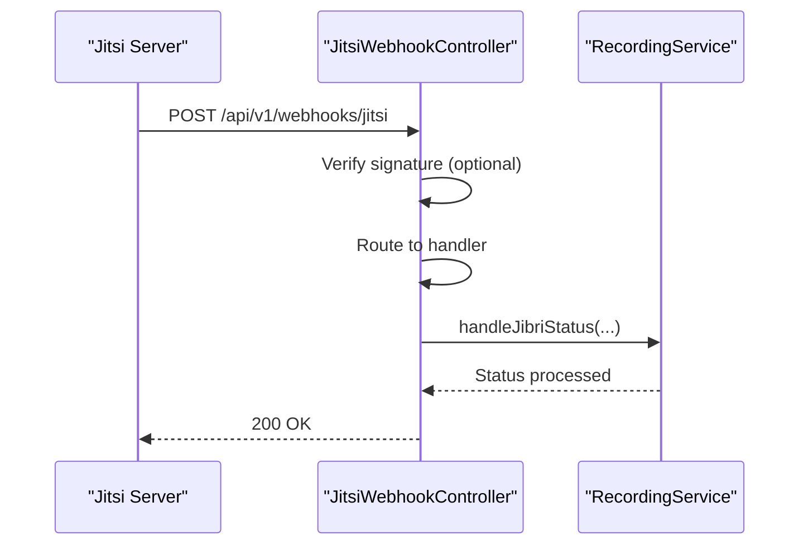
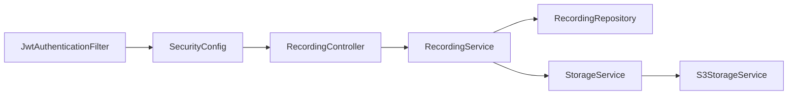

# Recording Management Controller

<cite>
**Referenced Files in This Document**
- [RecordingController.java](file://jmp-api/src/main/java/com/jmp/api/controller/RecordingController.java)
- [RecordingService.java](file://jmp-application/src/main/java/com/jmp/application/service/RecordingService.java)
- [RecordingDto.java](file://jmp-application/src/main/java/com/jmp/application/dto/RecordingDto.java)
- [Recording.java](file://jmp-domain/src/main/java/com/jmp/domain/entity/Recording.java)
- [RecordingRepository.java](file://jmp-domain/src/main/java/com/jmp/domain/repository/RecordingRepository.java)
- [S3StorageService.java](file://jmp-infrastructure/src/main/java/com/jmp/infrastructure/storage/S3StorageService.java)
- [StorageService.java](file://jmp-application/src/main/java/com/jmp/application/service/StorageService.java)
- [SecurityConfig.java](file://jmp-infrastructure/src/main/java/com/jmp/infrastructure/security/SecurityConfig.java)
- [JwtAuthenticationFilter.java](file://jmp-infrastructure/src/main/java/com/jmp/infrastructure/security/JwtAuthenticationFilter.java)
- [JitsiWebhookController.java](file://jmp-api/src/main/java/com/jmp/api/controller/JitsiWebhookController.java)
- [V3__create_recordings_table.sql](file://jmp-web/src/main/resources/db/migration/V3__create_recordings_table.sql)
- [application.yml](file://jmp-web/src/main/resources/application.yml)
</cite>

## Table of Contents
1. [Introduction](#introduction)
2. [Project Structure](#project-structure)
3. [Core Components](#core-components)
4. [Architecture Overview](#architecture-overview)
5. [Detailed Component Analysis](#detailed-component-analysis)
6. [Dependency Analysis](#dependency-analysis)
7. [Performance Considerations](#performance-considerations)
8. [Troubleshooting Guide](#troubleshooting-guide)
9. [Conclusion](#conclusion)
10. [Appendices](#appendices)

## Introduction
This document provides comprehensive API documentation for the Recording Management Controller, focusing on recording lifecycle operations, AWS S3 integration, metadata handling, status transitions, and operational policies. It covers endpoint definitions, request/response structures, security controls, storage management, and integration patterns with the storage service and Jitsi webhooks.

## Project Structure
The recording management feature spans four layers:
- API Layer: REST endpoints exposed via the Recording Controller
- Application Layer: Business logic encapsulated in RecordingService
- Domain Layer: Persistence model and repository abstractions
- Infrastructure Layer: Storage abstraction and S3 implementation

**Diagram sources**
- [RecordingController.java:41-137](file://jmp-api/src/main/java/com/jmp/api/controller/RecordingController.java#L41-L137)
- [RecordingService.java:31-331](file://jmp-application/src/main/java/com/jmp/application/service/RecordingService.java#L31-L331)
- [Recording.java:29-202](file://jmp-domain/src/main/java/com/jmp/domain/entity/Recording.java#L29-L202)
- [RecordingRepository.java:20-99](file://jmp-domain/src/main/java/com/jmp/domain/repository/RecordingRepository.java#L20-L99)
- [StorageService.java:9-55](file://jmp-application/src/main/java/com/jmp/application/service/StorageService.java#L9-L55)
- [S3StorageService.java:28-130](file://jmp-infrastructure/src/main/java/com/jmp/infrastructure/storage/S3StorageService.java#L28-L130)

**Section sources**
- [RecordingController.java:41-137](file://jmp-api/src/main/java/com/jmp/api/controller/RecordingController.java#L41-L137)
- [RecordingService.java:31-331](file://jmp-application/src/main/java/com/jmp/application/service/RecordingService.java#L31-L331)
- [Recording.java:29-202](file://jmp-domain/src/main/java/com/jmp/domain/entity/Recording.java#L29-L202)
- [RecordingRepository.java:20-99](file://jmp-domain/src/main/java/com/jmp/domain/repository/RecordingRepository.java#L20-L99)
- [StorageService.java:9-55](file://jmp-application/src/main/java/com/jmp/application/service/StorageService.java#L9-L55)
- [S3StorageService.java:28-130](file://jmp-infrastructure/src/main/java/com/jmp/infrastructure/storage/S3StorageService.java#L28-L130)

## Core Components
- RecordingController: Exposes REST endpoints for recording creation, retrieval, listing, updates, downloads, and deletion. Implements role-based access control and tenant scoping.
- RecordingService: Orchestrates recording lifecycle, interacts with repositories and storage service, manages status transitions, and enforces retention policies.
- Recording Entity and Repository: Persist recording metadata, manage status/state, and provide queries for tenant-scoped operations and retention.
- StorageService Interface and S3StorageService: Abstract storage operations and provide S3-specific implementations for presigned URLs, uploads, deletions, archiving, and restoration.

**Section sources**
- [RecordingController.java:41-137](file://jmp-api/src/main/java/com/jmp/api/controller/RecordingController.java#L41-L137)
- [RecordingService.java:31-331](file://jmp-application/src/main/java/com/jmp/application/service/RecordingService.java#L31-L331)
- [Recording.java:29-202](file://jmp-domain/src/main/java/com/jmp/domain/entity/Recording.java#L29-L202)
- [RecordingRepository.java:20-99](file://jmp-domain/src/main/java/com/jmp/domain/repository/RecordingRepository.java#L20-L99)
- [StorageService.java:9-55](file://jmp-application/src/main/java/com/jmp/application/service/StorageService.java#L9-L55)
- [S3StorageService.java:28-130](file://jmp-infrastructure/src/main/java/com/jmp/infrastructure/storage/S3StorageService.java#L28-L130)

## Architecture Overview
The Recording Management Controller follows a layered architecture with clear separation of concerns:
- Controllers enforce authentication and authorization, delegate to services, and return standardized DTOs.
- Services encapsulate business rules, coordinate domain entities, and interact with storage.
- Repositories abstract persistence and expose tenant-scoped queries.
- Infrastructure provides pluggable storage implementations with S3 as the primary provider.

**Diagram sources**
- [RecordingController.java:45-103](file://jmp-api/src/main/java/com/jmp/api/controller/RecordingController.java#L45-L103)
- [RecordingService.java:42-170](file://jmp-application/src/main/java/com/jmp/application/service/RecordingService.java#L42-L170)
- [RecordingRepository.java:20-99](file://jmp-domain/src/main/java/com/jmp/domain/repository/RecordingRepository.java#L20-L99)
- [S3StorageService.java:63-87](file://jmp-infrastructure/src/main/java/com/jmp/infrastructure/storage/S3StorageService.java#L63-L87)

## Detailed Component Analysis

### RecordingController API Endpoints
- POST /api/v1/recordings
  - Purpose: Create a recording entry with initial metadata.
  - Authentication/Authorization: MODERATOR, TENANT_ADMIN, SUPER_ADMIN.
  - Request Body: RecordingDto.CreateRequest.
  - Response: RecordingDto.Response with CREATED status.
- GET /api/v1/recordings/{id}
  - Purpose: Retrieve a recording by ID.
  - Authentication/Authorization: PARTICIPANT, MODERATOR, TENANT_ADMIN, SUPER_ADMIN.
  - Response: RecordingDto.Response.
- GET /api/v1/recordings
  - Purpose: List recordings for the authenticated tenant with optional search.
  - Authentication/Authorization: PARTICIPANT, MODERATOR, TENANT_ADMIN, SUPER_ADMIN.
  - Query Params: pageable, search (optional).
  - Response: Page<RecordingDto.Summary>.
- GET /api/v1/recordings/conference/{conferenceId}
  - Purpose: List recordings associated with a conference.
  - Authentication/Authorization: PARTICIPANT, MODERATOR, TENANT_ADMIN, SUPER_ADMIN.
  - Response: List<RecordingDto.Summary>.
- GET /api/v1/recordings/{id}/download
  - Purpose: Generate a presigned download URL for a READY recording within retention.
  - Authentication/Authorization: PARTICIPANT, MODERATOR, TENANT_ADMIN, SUPER_ADMIN.
  - Query Params: expirationMinutes (default 60).
  - Response: RecordingDto.DownloadUrlResponse containing URL and expiry.
- PUT /api/v1/recordings/{id}
  - Purpose: Update recording metadata and retention policy.
  - Authentication/Authorization: MODERATOR, TENANT_ADMIN, SUPER_ADMIN.
  - Request Body: RecordingDto.UpdateRequest.
  - Response: RecordingDto.Response.
- DELETE /api/v1/recordings/{id}
  - Purpose: Soft delete a recording and schedule storage deletion.
  - Authentication/Authorization: MODERATOR, TENANT_ADMIN, SUPER_ADMIN.
  - Response: No Content.
- GET /api/v1/recordings/stats/storage
  - Purpose: Retrieve storage statistics for the tenant.
  - Authentication/Authorization: TENANT_ADMIN, SUPER_ADMIN.
  - Response: RecordingDto.StorageStats.

Access control is enforced via method-level annotations and JWT-based authentication. Tenant scoping is derived from the JWT claims.

**Section sources**
- [RecordingController.java:45-129](file://jmp-api/src/main/java/com/jmp/api/controller/RecordingController.java#L45-L129)
- [SecurityConfig.java:49-58](file://jmp-infrastructure/src/main/java/com/jmp/infrastructure/security/SecurityConfig.java#L49-L58)
- [JwtAuthenticationFilter.java:99-120](file://jmp-infrastructure/src/main/java/com/jmp/infrastructure/security/JwtAuthenticationFilter.java#L99-L120)

### RecordingService Processing Logic
- Creation: Initializes a PENDING recording with tenant association, encryption flag, and retention window.
- Status Transitions: Supports READY, PROCESSING, FAILED, ARCHIVED, DELETED states; includes helper to compute duration.
- Download Workflow: Validates READY status and retention, generates presigned URL via storage service, increments download counters.
- Deletion: Soft deletes the recording and schedules asynchronous storage deletion.
- Statistics: Aggregates total storage used and counts of READY recordings per tenant.
- Retention Handling: Provides archival workflow for expired recordings.

**Diagram sources**
- [RecordingService.java:141-170](file://jmp-application/src/main/java/com/jmp/application/service/RecordingService.java#L141-L170)
- [Recording.java:148-161](file://jmp-domain/src/main/java/com/jmp/domain/entity/Recording.java#L148-L161)

**Section sources**
- [RecordingService.java:42-258](file://jmp-application/src/main/java/com/jmp/application/service/RecordingService.java#L42-L258)
- [Recording.java:131-161](file://jmp-domain/src/main/java/com/jmp/domain/entity/Recording.java#L131-L161)

### Data Model and Repository Queries
The Recording entity captures essential metadata, status, encryption flags, retention, and download metrics. The repository exposes tenant-scoped queries, search capabilities, retention-based expiration, and aggregation functions for storage statistics.

**Diagram sources**
- [Recording.java:29-202](file://jmp-domain/src/main/java/com/jmp/domain/entity/Recording.java#L29-L202)
- [V3__create_recordings_table.sql:4-43](file://jmp-web/src/main/resources/db/migration/V3__create_recordings_table.sql#L4-L43)

**Section sources**
- [Recording.java:29-202](file://jmp-domain/src/main/java/com/jmp/domain/entity/Recording.java#L29-L202)
- [RecordingRepository.java:20-99](file://jmp-domain/src/main/java/com/jmp/domain/repository/RecordingRepository.java#L20-L99)
- [V3__create_recordings_table.sql:4-43](file://jmp-web/src/main/resources/db/migration/V3__create_recordings_table.sql#L4-L43)

### AWS S3 Integration
The StorageService interface defines operations for presigned URLs, uploads, deletions, archiving, and restoration. The S3StorageService implements these using AWS SDK v2 with support for MinIO-compatible endpoints and static credentials.

Key behaviors:
- Presigned Download URL generation with configurable expiration.
- Presigned Upload URL generation for client-side uploads.
- Immediate deletion and scheduled deletion hooks.
- Placeholder methods for archive/restore workflows.

**Diagram sources**
- [StorageService.java:9-55](file://jmp-application/src/main/java/com/jmp/application/service/StorageService.java#L9-L55)
- [S3StorageService.java:28-130](file://jmp-infrastructure/src/main/java/com/jmp/infrastructure/storage/S3StorageService.java#L28-L130)

**Section sources**
- [StorageService.java:9-55](file://jmp-application/src/main/java/com/jmp/application/service/StorageService.java#L9-L55)
- [S3StorageService.java:28-130](file://jmp-infrastructure/src/main/java/com/jmp/infrastructure/storage/S3StorageService.java#L28-L130)

### Recording Metadata, Quality, Formats, and Compression
- Metadata: Stored as JSONB in the recording entity; supports arbitrary key-value pairs and is merged during updates and readiness processing.
- Quality Settings: Resolution fields capture width and height; encryption flag indicates secure storage.
- Formats: MIME type and recording type enumeration support VIDEO, AUDIO, TRANSCRIPT, SCREEN_SHARE, CHAT_LOG.
- Compression: Not explicitly handled in the codebase; compression options are external to the current implementation.

**Section sources**
- [Recording.java:93-99](file://jmp-domain/src/main/java/com/jmp/domain/entity/Recording.java#L93-L99)
- [Recording.java:195-201](file://jmp-domain/src/main/java/com/jmp/domain/entity/Recording.java#L195-L201)
- [RecordingDto.java:38-94](file://jmp-application/src/main/java/com/jmp/application/dto/RecordingDto.java#L38-L94)

### Recording Quotas, Limits, and Cleanup Policies
- Retention Policy: Default retention window applied at creation; recordings outside retention cannot be downloaded.
- Cleanup: Expired recordings are transitioned to ARCHIVED and can be archived in storage; deletion is soft with asynchronous storage removal.
- Storage Statistics: Aggregated totals for a tenant to monitor usage.

Note: Explicit quotas or hard limits are not present in the current implementation.

**Section sources**
- [RecordingService.java:61-62](file://jmp-application/src/main/java/com/jmp/application/service/RecordingService.java#L61-L62)
- [RecordingService.java:239-258](file://jmp-application/src/main/java/com/jmp/application/service/RecordingService.java#L239-L258)
- [RecordingRepository.java:63-78](file://jmp-domain/src/main/java/com/jmp/domain/repository/RecordingRepository.java#L63-L78)

### Security, Access Control, and Sharing
- Authentication: Stateless JWT bearer tokens validated by a dedicated filter.
- Authorization: Method-level PreAuthorize checks for roles (PARTICIPANT, MODERATOR, TENANT_ADMIN, SUPER_ADMIN).
- Tenant Scoping: Tenant ID extracted from JWT claims and used to scope queries and statistics.
- Webhook Security: Jitsi webhooks include optional signature verification hook for integrity.

**Diagram sources**
- [SecurityConfig.java:42-76](file://jmp-infrastructure/src/main/java/com/jmp/infrastructure/security/SecurityConfig.java#L42-L76)
- [JwtAuthenticationFilter.java:39-76](file://jmp-infrastructure/src/main/java/com/jmp/infrastructure/security/JwtAuthenticationFilter.java#L39-L76)

**Section sources**
- [RecordingController.java:46-50](file://jmp-api/src/main/java/com/jmp/api/controller/RecordingController.java#L46-L50)
- [SecurityConfig.java:49-58](file://jmp-infrastructure/src/main/java/com/jmp/infrastructure/security/SecurityConfig.java#L49-L58)
- [JwtAuthenticationFilter.java:99-120](file://jmp-infrastructure/src/main/java/com/jmp/infrastructure/security/JwtAuthenticationFilter.java#L99-L120)

### Jitsi Webhook Integration
The system receives Jitsi webhooks for conference and recording status changes. The webhook controller validates signatures and routes events to handlers. Recording lifecycle events can trigger downstream processing in the recording service.

**Diagram sources**
- [JitsiWebhookController.java:33-52](file://jmp-api/src/main/java/com/jmp/api/controller/JitsiWebhookController.java#L33-L52)
- [RecordingService.java:263-284](file://jmp-application/src/main/java/com/jmp/application/service/RecordingService.java#L263-L284)

**Section sources**
- [JitsiWebhookController.java:33-102](file://jmp-api/src/main/java/com/jmp/api/controller/JitsiWebhookController.java#L33-L102)
- [RecordingService.java:263-290](file://jmp-application/src/main/java/com/jmp/application/service/RecordingService.java#L263-L290)

## Dependency Analysis
The controller depends on the service layer; the service depends on repositories and the storage abstraction. The storage abstraction is implemented by S3StorageService. Security configuration applies globally to protect endpoints.

**Diagram sources**
- [RecordingController.java:41-137](file://jmp-api/src/main/java/com/jmp/api/controller/RecordingController.java#L41-L137)
- [RecordingService.java:31-37](file://jmp-application/src/main/java/com/jmp/application/service/RecordingService.java#L31-L37)
- [RecordingRepository.java:20-99](file://jmp-domain/src/main/java/com/jmp/domain/repository/RecordingRepository.java#L20-L99)
- [StorageService.java:9-55](file://jmp-application/src/main/java/com/jmp/application/service/StorageService.java#L9-L55)
- [S3StorageService.java:28-130](file://jmp-infrastructure/src/main/java/com/jmp/infrastructure/storage/S3StorageService.java#L28-L130)
- [SecurityConfig.java:42-61](file://jmp-infrastructure/src/main/java/com/jmp/infrastructure/security/SecurityConfig.java#L42-L61)
- [JwtAuthenticationFilter.java:39-76](file://jmp-infrastructure/src/main/java/com/jmp/infrastructure/security/JwtAuthenticationFilter.java#L39-L76)

**Section sources**
- [RecordingController.java:41-137](file://jmp-api/src/main/java/com/jmp/api/controller/RecordingController.java#L41-L137)
- [RecordingService.java:31-37](file://jmp-application/src/main/java/com/jmp/application/service/RecordingService.java#L31-L37)
- [SecurityConfig.java:42-61](file://jmp-infrastructure/src/main/java/com/jmp/infrastructure/security/SecurityConfig.java#L42-L61)

## Performance Considerations
- Pagination: Listing endpoints support Pageable parameters to limit result sets.
- Indexing: Database schema includes indexes on tenant, status, retention, and timestamps to optimize queries.
- Asynchronous Operations: Deletion and archival are coordinated via the service layer; consider background jobs for large-scale operations.
- Caching: Redis is configured in the environment; consider caching frequently accessed metadata or stats.

[No sources needed since this section provides general guidance]

## Troubleshooting Guide
Common issues and resolutions:
- Unauthorized Access: Ensure Authorization header with valid JWT and appropriate roles.
- Recording Not Ready: Download requires READY status; verify recording processing pipeline.
- Retention Exceeded: Downloads are blocked after retention; adjust retention or reprocess.
- Storage Deletion: Soft-deleted recordings remain queryable until storage deletion completes.
- Webhook Validation: Signature verification failures lead to 401 responses; confirm shared secrets.

**Section sources**
- [RecordingController.java:56-103](file://jmp-api/src/main/java/com/jmp/api/controller/RecordingController.java#L56-L103)
- [RecordingService.java:146-152](file://jmp-application/src/main/java/com/jmp/application/service/RecordingService.java#L146-L152)
- [JitsiWebhookController.java:42-46](file://jmp-api/src/main/java/com/jmp/api/controller/JitsiWebhookController.java#L42-L46)

## Conclusion
The Recording Management Controller provides a robust, tenant-scoped solution for recording lifecycle management with strong security, clear status transitions, and scalable S3 integration. The design supports future enhancements such as explicit quotas, advanced compression, and expanded storage providers.

[No sources needed since this section summarizes without analyzing specific files]

## Appendices

### API Endpoint Reference
- POST /api/v1/recordings: Create recording entry
- GET /api/v1/recordings/{id}: Get recording by ID
- GET /api/v1/recordings: List recordings (tenant-scoped)
- GET /api/v1/recordings/conference/{conferenceId}: List conference recordings
- GET /api/v1/recordings/{id}/download: Generate download URL
- PUT /api/v1/recordings/{id}: Update recording metadata
- DELETE /api/v1/recordings/{id}: Soft delete recording
- GET /api/v1/recordings/stats/storage: Get storage statistics

**Section sources**
- [RecordingController.java:45-129](file://jmp-api/src/main/java/com/jmp/api/controller/RecordingController.java#L45-L129)

### Configuration Notes
- S3 Bucket and Region: Configured via application properties.
- CORS: Enabled for local development origins.
- Actuator: Metrics and Prometheus export enabled.

**Section sources**
- [application.yml:12-128](file://jmp-web/src/main/resources/application.yml#L12-L128)