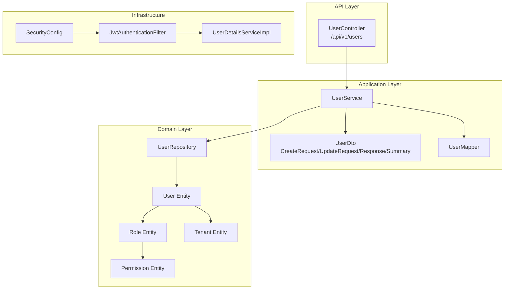
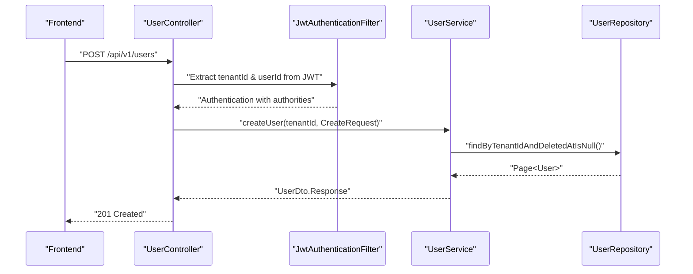
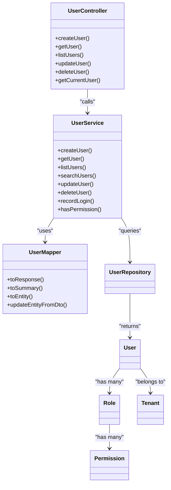
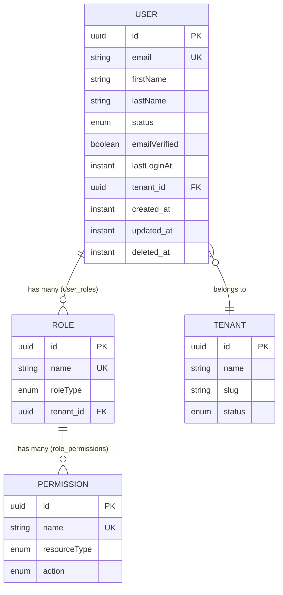

# User Management Controller

<cite>
**Referenced Files in This Document**
- [UserController.java](file://jmp-api/src/main/java/com/jmp/api/controller/UserController.java)
- [UserService.java](file://jmp-application/src/main/java/com/jmp/application/service/UserService.java)
- [UserDto.java](file://jmp-application/src/main/java/com/jmp/application/dto/UserDto.java)
- [UserMapper.java](file://jmp-application/src/main/java/com/jmp/application/mapper/UserMapper.java)
- [UserRepository.java](file://jmp-domain/src/main/java/com/jmp/domain/repository/UserRepository.java)
- [User.java](file://jmp-domain/src/main/java/com/jmp/domain/entity/User.java)
- [Role.java](file://jmp-domain/src/main/java/com/jmp/domain/entity/Role.java)
- [Tenant.java](file://jmp-domain/src/main/java/com/jmp/domain/entity/Tenant.java)
- [Permission.java](file://jmp-domain/src/main/java/com/jmp/domain/entity/Permission.java)
- [JwtAuthenticationFilter.java](file://jmp-infrastructure/src/main/java/com/jmp/infrastructure/security/JwtAuthenticationFilter.java)
- [SecurityConfig.java](file://jmp-infrastructure/src/main/java/com/jmp/infrastructure/security/SecurityConfig.java)
- [UserDetailsServiceImpl.java](file://jmp-infrastructure/src/main/java/com/jmp/infrastructure/security/UserDetailsServiceImpl.java)
- [GlobalExceptionHandler.java](file://jmp-api/src/main/java/com/jmp/api/advice/GlobalExceptionHandler.java)
- [api.ts](file://jmp-ui/src/services/api.ts)
- [UsersPage.tsx](file://jmp-ui/src/pages/UsersPage.tsx)
</cite>

## Table of Contents
1. [Introduction](#introduction)
2. [Project Structure](#project-structure)
3. [Core Components](#core-components)
4. [Architecture Overview](#architecture-overview)
5. [Detailed Component Analysis](#detailed-component-analysis)
6. [Dependency Analysis](#dependency-analysis)
7. [Performance Considerations](#performance-considerations)
8. [Troubleshooting Guide](#troubleshooting-guide)
9. [Conclusion](#conclusion)
10. [Appendices](#appendices)

## Introduction
This document provides comprehensive API documentation for the User Management Controller. It covers all user CRUD operations (create, read, update, delete), tenant-scoped user management, role assignment, and permission handling. It also documents request/response schemas, validation rules, data transformation patterns, pagination, filtering, sorting, user invitation workflows, email verification processes, account activation, multi-tenant isolation, user search functionality, and integration patterns with the frontend application.

## Project Structure
The user management feature spans three layers:
- API Layer: REST endpoints exposed by the controller.
- Application Layer: Business logic encapsulated in the service and DTOs.
- Domain Layer: Entities, repositories, and RBAC model.

**Diagram sources**
- [UserController.java:33-122](file://jmp-api/src/main/java/com/jmp/api/controller/UserController.java#L33-L122)
- [UserService.java:28-189](file://jmp-application/src/main/java/com/jmp/application/service/UserService.java#L28-L189)
- [UserDto.java:14-96](file://jmp-application/src/main/java/com/jmp/application/dto/UserDto.java#L14-L96)
- [UserMapper.java:18-75](file://jmp-application/src/main/java/com/jmp/application/mapper/UserMapper.java#L18-L75)
- [UserRepository.java:18-81](file://jmp-domain/src/main/java/com/jmp/domain/repository/UserRepository.java#L18-L81)
- [User.java:23-163](file://jmp-domain/src/main/java/com/jmp/domain/entity/User.java#L23-L163)
- [Role.java:22-130](file://jmp-domain/src/main/java/com/jmp/domain/entity/Role.java#L22-L130)
- [Tenant.java:24-173](file://jmp-domain/src/main/java/com/jmp/domain/entity/Tenant.java#L24-L173)
- [Permission.java:18-127](file://jmp-domain/src/main/java/com/jmp/domain/entity/Permission.java#L18-L127)
- [SecurityConfig.java:28-89](file://jmp-infrastructure/src/main/java/com/jmp/infrastructure/security/SecurityConfig.java#L28-L89)
- [JwtAuthenticationFilter.java:27-121](file://jmp-infrastructure/src/main/java/com/jmp/infrastructure/security/JwtAuthenticationFilter.java#L27-L121)
- [UserDetailsServiceImpl.java:19-46](file://jmp-infrastructure/src/main/java/com/jmp/infrastructure/security/UserDetailsServiceImpl.java#L19-L46)

**Section sources**
- [UserController.java:33-122](file://jmp-api/src/main/java/com/jmp/api/controller/UserController.java#L33-L122)
- [UserService.java:28-189](file://jmp-application/src/main/java/com/jmp/application/service/UserService.java#L28-L189)
- [UserRepository.java:18-81](file://jmp-domain/src/main/java/com/jmp/domain/repository/UserRepository.java#L18-L81)

## Core Components
- UserController: Exposes REST endpoints for user management under /api/v1/users. It enforces method-level security and extracts tenant/user IDs from JWT claims.
- UserService: Implements business logic for user creation, retrieval, listing, searching, updates, and soft deletion. Handles role resolution and password encoding.
- UserDto: Defines request/response DTOs for user operations with validation constraints.
- UserMapper: Transforms between domain entities and DTOs using MapStruct.
- UserRepository: JPA repository with tenant-scoped queries and search functionality.
- User/Role/Tenant/Permission: Domain entities implementing multi-tenancy, RBAC, and audit fields.

**Section sources**
- [UserController.java:33-122](file://jmp-api/src/main/java/com/jmp/api/controller/UserController.java#L33-L122)
- [UserService.java:28-189](file://jmp-application/src/main/java/com/jmp/application/service/UserService.java#L28-L189)
- [UserDto.java:14-96](file://jmp-application/src/main/java/com/jmp/application/dto/UserDto.java#L14-L96)
- [UserMapper.java:18-75](file://jmp-application/src/main/java/com/jmp/application/mapper/UserMapper.java#L18-L75)
- [UserRepository.java:18-81](file://jmp-domain/src/main/java/com/jmp/domain/repository/UserRepository.java#L18-L81)
- [User.java:23-163](file://jmp-domain/src/main/java/com/jmp/domain/entity/User.java#L23-L163)
- [Role.java:22-130](file://jmp-domain/src/main/java/com/jmp/domain/entity/Role.java#L22-L130)
- [Tenant.java:24-173](file://jmp-domain/src/main/java/com/jmp/domain/entity/Tenant.java#L24-L173)
- [Permission.java:18-127](file://jmp-domain/src/main/java/com/jmp/domain/entity/Permission.java#L18-L127)

## Architecture Overview
The user management flow integrates JWT-based authentication, method-level authorization, and tenant-scoped data access.

**Diagram sources**
- [UserController.java:43-55](file://jmp-api/src/main/java/com/jmp/api/controller/UserController.java#L43-L55)
- [JwtAuthenticationFilter.java:39-76](file://jmp-infrastructure/src/main/java/com/jmp/infrastructure/security/JwtAuthenticationFilter.java#L39-L76)
- [UserService.java:44-70](file://jmp-application/src/main/java/com/jmp/application/service/UserService.java#L44-L70)
- [UserRepository.java:47-48](file://jmp-domain/src/main/java/com/jmp/domain/repository/UserRepository.java#L47-L48)

## Detailed Component Analysis

### REST Endpoints
- Base Path: /api/v1/users
- Security: Bearer token required; method-level authorization via @PreAuthorize.

Endpoints:
- POST /api/v1/users
  - Purpose: Create a new user.
  - Auth: TENANT_ADMIN or SUPER_ADMIN.
  - Request Body: UserDto.CreateRequest.
  - Response: 201 Created with UserDto.Response.
  - Notes: Validates email uniqueness, assigns roles, sets initial status and emailVerified flag.

- GET /api/v1/users/{id}
  - Purpose: Retrieve a user by ID.
  - Auth: TENANT_ADMIN, SUPER_ADMIN, or self (currentUser).
  - Response: UserDto.Response.

- GET /api/v1/users
  - Purpose: List users in the current tenant with optional search.
  - Auth: TENANT_ADMIN or SUPER_ADMIN.
  - Query Params:
    - page, size: Pagination (Spring Data).
    - search: Free-text search across email, first name, last name.
  - Response: Page<UserDto.Summary>.

- PUT /api/v1/users/{id}
  - Purpose: Update user details.
  - Auth: TENANT_ADMIN, SUPER_ADMIN, or self (currentUser).
  - Request Body: UserDto.UpdateRequest.
  - Response: UserDto.Response.

- DELETE /api/v1/users/{id}
  - Purpose: Soft-delete a user.
  - Auth: TENANT_ADMIN or SUPER_ADMIN.
  - Response: 204 No Content.

- GET /api/v1/users/me
  - Purpose: Retrieve current user profile.
  - Auth: Any authenticated user.
  - Response: UserDto.Response.

Authorization Rules:
- TENANT_ADMIN and SUPER_ADMIN can manage all users in their tenant scope.
- Regular users can update their own profile and read their own profile.

Pagination, Filtering, Sorting:
- Pagination: Pageable supports page and size parameters.
- Filtering: search query parameter filters by email, firstName, lastName.
- Sorting: Not explicitly supported in current implementation; defaults apply.

**Section sources**
- [UserController.java:43-107](file://jmp-api/src/main/java/com/jmp/api/controller/UserController.java#L43-L107)
- [UserService.java:94-105](file://jmp-application/src/main/java/com/jmp/application/service/UserService.java#L94-L105)
- [UserRepository.java:53-60](file://jmp-domain/src/main/java/com/jmp/domain/repository/UserRepository.java#L53-L60)

### Request/Response Schemas and Validation
- CreateRequest
  - Fields: email (required, email format, max 255), firstName (required, max 100), lastName (required, max 100), password (required, min 8, max 100), roleNames (optional set).
  - Validation: Jakarta Bean Validation constraints applied at endpoint level.

- UpdateRequest
  - Fields: firstName (optional, max 100), lastName (optional, max 100), roleNames (optional set).
  - Validation: Optional updates only.

- Response
  - Fields: id, email, firstName, lastName, status, emailVerified, lastLoginAt, roles, tenantId, createdAt.

- Summary
  - Fields: id, email, firstName, lastName, status (used for listing/search results).

Transformation:
- UserMapper converts User entity to Response/Summary DTOs.
- Roles are mapped from Role entities to role name strings.

**Section sources**
- [UserDto.java:30-95](file://jmp-application/src/main/java/com/jmp/application/dto/UserDto.java#L30-L95)
- [UserMapper.java:24-64](file://jmp-application/src/main/java/com/jmp/application/mapper/UserMapper.java#L24-L64)
- [User.java:28-96](file://jmp-domain/src/main/java/com/jmp/domain/entity/User.java#L28-L96)

### Multi-Tenant Isolation and Role Assignment
- Tenant Extraction:
  - JWT claims include tenant_id and subject (user ID). Extracted in UserController via JwtAuthenticationFilter.WebAuthenticationDetails.
- User Creation:
  - Validates tenant existence, ensures email uniqueness within the tenant, assigns roles by name, and sets default status and emailVerified flag.
- Listing/Search:
  - Queries restrict results to the current tenant and exclude soft-deleted users.
- Role Resolution:
  - Resolves role names to Role entities per tenant; defaults to PARTICIPANT if none provided.

**Section sources**
- [UserController.java:109-121](file://jmp-api/src/main/java/com/jmp/api/controller/UserController.java#L109-L121)
- [JwtAuthenticationFilter.java:99-120](file://jmp-infrastructure/src/main/java/com/jmp/infrastructure/security/JwtAuthenticationFilter.java#L99-L120)
- [UserService.java:44-70](file://jmp-application/src/main/java/com/jmp/application/service/UserService.java#L44-L70)
- [UserRepository.java:47-60](file://jmp-domain/src/main/java/com/jmp/domain/repository/UserRepository.java#L47-L60)
- [Role.java:114-130](file://jmp-domain/src/main/java/com/jmp/domain/entity/Role.java#L114-L130)

### Permission Handling
- Permissions are attached to roles and inherited by users.
- Utility method checks if a user has a specific permission by traversing role-to-permission relationships.
- Authorization expressions in controllers leverage role names (e.g., ROLE_TENANT_ADMIN).

**Section sources**
- [UserService.java:161-168](file://jmp-application/src/main/java/com/jmp/application/service/UserService.java#L161-L168)
- [Role.java:52-59](file://jmp-domain/src/main/java/com/jmp/domain/entity/Role.java#L52-L59)
- [Permission.java:18-127](file://jmp-domain/src/main/java/com/jmp/domain/entity/Permission.java#L18-L127)

### Email Verification, Invitation, and Account Activation
- Initial Status: PENDING_VERIFICATION during creation.
- emailVerified Flag: Starts as false; can be updated via dedicated endpoints if implemented elsewhere.
- Invitation Workflow: Not implemented in the controller; typically handled by admin-initiated creation with role assignment.
- Account Activation: Status transitions to ACTIVE upon verification; enforcement in domain logic prevents inactive users from authenticating.

Note: The current implementation does not expose explicit endpoints for email verification or activation. These would typically be part of a separate workflow handled by the AuthController or a dedicated verification service.

**Section sources**
- [UserService.java:44-70](file://jmp-application/src/main/java/com/jmp/application/service/UserService.java#L44-L70)
- [User.java:157-162](file://jmp-domain/src/main/java/com/jmp/domain/entity/User.java#L157-L162)
- [UserDetailsServiceImpl.java:31-33](file://jmp-infrastructure/src/main/java/com/jmp/infrastructure/security/UserDetailsServiceImpl.java#L31-L33)

### Data Transformation Patterns
- DTO Mapping:
  - CreateRequest -> User entity (mapped except status, emailVerified, timestamps).
  - UpdateRequest -> User entity (mapped except immutable fields).
  - User -> Response/Summary DTOs (roles mapped to strings).
- Password Encoding:
  - Passwords are encoded using BCrypt before persisting.

**Section sources**
- [UserMapper.java:31-64](file://jmp-application/src/main/java/com/jmp/application/mapper/UserMapper.java#L31-L64)
- [UserService.java:58-69](file://jmp-application/src/main/java/com/jmp/application/service/UserService.java#L58-L69)
- [SecurityConfig.java:64-66](file://jmp-infrastructure/src/main/java/com/jmp/infrastructure/security/SecurityConfig.java#L64-L66)

### Frontend Integration
- Axios client configured with Authorization header injection.
- UsersPage integrates with userApi endpoints for listing, creating, updating, and deleting users.
- Search is passed as a query parameter to the list endpoint.

**Section sources**
- [api.ts:1-93](file://jmp-ui/src/services/api.ts#L1-L93)
- [UsersPage.tsx:52-115](file://jmp-ui/src/pages/UsersPage.tsx#L52-L115)

## Dependency Analysis

**Diagram sources**
- [UserController.java:33-122](file://jmp-api/src/main/java/com/jmp/api/controller/UserController.java#L33-L122)
- [UserService.java:28-189](file://jmp-application/src/main/java/com/jmp/application/service/UserService.java#L28-L189)
- [UserMapper.java:18-75](file://jmp-application/src/main/java/com/jmp/application/mapper/UserMapper.java#L18-L75)
- [UserRepository.java:18-81](file://jmp-domain/src/main/java/com/jmp/domain/repository/UserRepository.java#L18-L81)
- [User.java:28-96](file://jmp-domain/src/main/java/com/jmp/domain/entity/User.java#L28-L96)
- [Role.java:22-59](file://jmp-domain/src/main/java/com/jmp/domain/entity/Role.java#L22-L59)
- [Permission.java:18-47](file://jmp-domain/src/main/java/com/jmp/domain/entity/Permission.java#L18-L47)

**Section sources**
- [UserController.java:33-122](file://jmp-api/src/main/java/com/jmp/api/controller/UserController.java#L33-L122)
- [UserService.java:28-189](file://jmp-application/src/main/java/com/jmp/application/service/UserService.java#L28-L189)
- [UserRepository.java:18-81](file://jmp-domain/src/main/java/com/jmp/domain/repository/UserRepository.java#L18-L81)

## Performance Considerations
- Pagination: Implemented via Pageable; ensure appropriate page sizes and indexes on tenantId and deletedAt.
- Search: Uses LIKE queries on email, firstName, and lastName; consider adding composite indexes for performance.
- Entity Graphs: Roles and permissions are fetched eagerly for user operations; monitor N+1 risks and optimize queries.
- Password Hashing: BCrypt cost factor is set to 12; acceptable for production but tune based on hardware constraints.
- Soft Deletes: Deleted users excluded from queries; maintain consistent filtering across all endpoints.

[No sources needed since this section provides general guidance]

## Troubleshooting Guide
Common Issues and Resolutions:
- 401 Unauthorized
  - Cause: Missing or invalid Bearer token.
  - Resolution: Ensure Authorization header is present and valid.
- 403 Forbidden
  - Cause: Insufficient role or attempting to access another user’s data without authorization.
  - Resolution: Verify role names and tenant scoping.
- 400 Bad Request
  - Cause: Validation failures (invalid email, missing fields, short password).
  - Resolution: Review request payload against DTO constraints.
- 409 Conflict
  - Cause: Attempting to create a user with an existing email.
  - Resolution: Use a unique email address.
- 404 Not Found
  - Cause: User or tenant not found.
  - Resolution: Confirm IDs and tenant membership.

Error Handling:
- GlobalExceptionHandler returns RFC 7807 Problem Details with structured error codes and timestamps.

**Section sources**
- [GlobalExceptionHandler.java:26-128](file://jmp-api/src/main/java/com/jmp/api/advice/GlobalExceptionHandler.java#L26-L128)
- [UserService.java:48-51](file://jmp-application/src/main/java/com/jmp/application/service/UserService.java#L48-L51)
- [UserRepository.java:42-42](file://jmp-domain/src/main/java/com/jmp/domain/repository/UserRepository.java#L42-L42)

## Conclusion
The User Management Controller provides a robust, tenant-scoped, role-based user administration API. It supports full CRUD operations, flexible listing with search, secure role assignment, and clear separation of concerns across layers. Extending the controller to include email verification, invitations, and activation endpoints would complete the user lifecycle management.

[No sources needed since this section summarizes without analyzing specific files]

## Appendices

### Endpoint Reference

- POST /api/v1/users
  - Auth: TENANT_ADMIN or SUPER_ADMIN
  - Request: UserDto.CreateRequest
  - Response: 201 UserDto.Response

- GET /api/v1/users/{id}
  - Auth: TENANT_ADMIN or SUPER_ADMIN or self
  - Response: UserDto.Response

- GET /api/v1/users
  - Auth: TENANT_ADMIN or SUPER_ADMIN
  - Query: page, size, search
  - Response: Page<UserDto.Summary>

- PUT /api/v1/users/{id}
  - Auth: TENANT_ADMIN or SUPER_ADMIN or self
  - Request: UserDto.UpdateRequest
  - Response: UserDto.Response

- DELETE /api/v1/users/{id}
  - Auth: TENANT_ADMIN or SUPER_ADMIN
  - Response: 204

- GET /api/v1/users/me
  - Auth: authenticated
  - Response: UserDto.Response

**Section sources**
- [UserController.java:43-107](file://jmp-api/src/main/java/com/jmp/api/controller/UserController.java#L43-L107)

### Data Models

**Diagram sources**
- [User.java:28-107](file://jmp-domain/src/main/java/com/jmp/domain/entity/User.java#L28-L107)
- [Role.java:22-59](file://jmp-domain/src/main/java/com/jmp/domain/entity/Role.java#L22-L59)
- [Permission.java:18-47](file://jmp-domain/src/main/java/com/jmp/domain/entity/Permission.java#L18-L47)
- [Tenant.java:24-80](file://jmp-domain/src/main/java/com/jmp/domain/entity/Tenant.java#L24-L80)