# Application Layer

<cite>
**Referenced Files in This Document**
- [UserService.java](file://jmp-application/src/main/java/com/jmp/application/service/UserService.java)
- [ConferenceService.java](file://jmp-application/src/main/java/com/jmp/application/service/ConferenceService.java)
- [RecordingService.java](file://jmp-application/src/main/java/com/jmp/application/service/RecordingService.java)
- [AnalyticsService.java](file://jmp-application/src/main/java/com/jmp/application/service/AnalyticsService.java)
- [AuditService.java](file://jmp-application/src/main/java/com/jmp/application/service/AuditService.java)
- [JwtService.java](file://jmp-application/src/main/java/com/jmp/application/service/JwtService.java)
- [SsoService.java](file://jmp-application/src/main/java/com/jmp/application/service/SsoService.java)
- [StorageService.java](file://jmp-application/src/main/java/com/jmp/application/service/StorageService.java)
- [UserDto.java](file://jmp-application/src/main/java/com/jmp/application/dto/UserDto.java)
- [ConferenceDto.java](file://jmp-application/src/main/java/com/jmp/application/dto/ConferenceDto.java)
- [RecordingDto.java](file://jmp-application/src/main/java/com/jmp/application/dto/RecordingDto.java)
- [UserMapper.java](file://jmp-application/src/main/java/com/jmp/application/mapper/UserMapper.java)
- [ConferenceMapper.java](file://jmp-application/src/main/java/com/jmp/application/mapper/ConferenceMapper.java)
</cite>

## Table of Contents
1. [Introduction](#introduction)
2. [Project Structure](#project-structure)
3. [Core Components](#core-components)
4. [Architecture Overview](#architecture-overview)
5. [Detailed Component Analysis](#detailed-component-analysis)
6. [Dependency Analysis](#dependency-analysis)
7. [Performance Considerations](#performance-considerations)
8. [Troubleshooting Guide](#troubleshooting-guide)
9. [Conclusion](#conclusion)
10. [Appendices](#appendices)

## Introduction
This document describes the Application Layer of the Jitsi Management Platform with a focus on service implementations, DTO patterns, mapping, validation, error handling, and transaction management. It covers the core services: UserService, ConferenceService, RecordingService, AnalyticsService, and AuditService. It also documents supporting services such as JwtService, SsoService, and the StorageService interface, along with the DTOs and MapStruct mappers used for data transfer and transformation.

## Project Structure
The Application Layer resides under jmp-application and is organized by responsibility:
- service: Business services implementing domain use cases
- dto: Sealed interfaces and records representing cross-layer data contracts
- mapper: MapStruct interfaces for entity-to-DTO conversions
- Additional services: JwtService, SsoService, StorageService interface

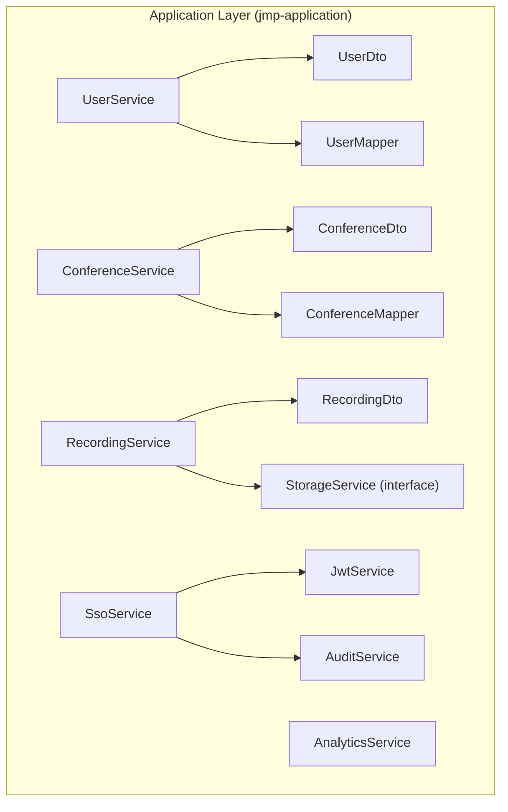

**Diagram sources**
- [UserService.java:1-190](file://jmp-application/src/main/java/com/jmp/application/service/UserService.java#L1-L190)
- [ConferenceService.java:1-225](file://jmp-application/src/main/java/com/jmp/application/service/ConferenceService.java#L1-L225)
- [RecordingService.java:1-332](file://jmp-application/src/main/java/com/jmp/application/service/RecordingService.java#L1-L332)
- [AnalyticsService.java:1-235](file://jmp-application/src/main/java/com/jmp/application/service/AnalyticsService.java#L1-L235)
- [AuditService.java:1-207](file://jmp-application/src/main/java/com/jmp/application/service/AuditService.java#L1-L207)
- [JwtService.java:1-236](file://jmp-application/src/main/java/com/jmp/application/service/JwtService.java#L1-L236)
- [SsoService.java:1-244](file://jmp-application/src/main/java/com/jmp/application/service/SsoService.java#L1-L244)
- [StorageService.java:1-56](file://jmp-application/src/main/java/com/jmp/application/service/StorageService.java#L1-L56)
- [UserDto.java:1-97](file://jmp-application/src/main/java/com/jmp/application/dto/UserDto.java#L1-L97)
- [ConferenceDto.java:1-176](file://jmp-application/src/main/java/com/jmp/application/dto/ConferenceDto.java#L1-L176)
- [RecordingDto.java:1-170](file://jmp-application/src/main/java/com/jmp/application/dto/RecordingDto.java#L1-L170)
- [UserMapper.java:1-76](file://jmp-application/src/main/java/com/jmp/application/mapper/UserMapper.java#L1-L76)
- [ConferenceMapper.java:1-75](file://jmp-application/src/main/java/com/jmp/application/mapper/ConferenceMapper.java#L1-L75)

**Section sources**
- [UserService.java:1-190](file://jmp-application/src/main/java/com/jmp/application/service/UserService.java#L1-L190)
- [ConferenceService.java:1-225](file://jmp-application/src/main/java/com/jmp/application/service/ConferenceService.java#L1-L225)
- [RecordingService.java:1-332](file://jmp-application/src/main/java/com/jmp/application/service/RecordingService.java#L1-L332)
- [AnalyticsService.java:1-235](file://jmp-application/src/main/java/com/jmp/application/service/AnalyticsService.java#L1-L235)
- [AuditService.java:1-207](file://jmp-application/src/main/java/com/jmp/application/service/AuditService.java#L1-L207)
- [JwtService.java:1-236](file://jmp-application/src/main/java/com/jmp/application/service/JwtService.java#L1-L236)
- [SsoService.java:1-244](file://jmp-application/src/main/java/com/jmp/application/service/SsoService.java#L1-L244)
- [StorageService.java:1-56](file://jmp-application/src/main/java/com/jmp/application/service/StorageService.java#L1-L56)
- [UserDto.java:1-97](file://jmp-application/src/main/java/com/jmp/application/dto/UserDto.java#L1-L97)
- [ConferenceDto.java:1-176](file://jmp-application/src/main/java/com/jmp/application/dto/ConferenceDto.java#L1-L176)
- [RecordingDto.java:1-170](file://jmp-application/src/main/java/com/jmp/application/dto/RecordingDto.java#L1-L170)
- [UserMapper.java:1-76](file://jmp-application/src/main/java/com/jmp/application/mapper/UserMapper.java#L1-L76)
- [ConferenceMapper.java:1-75](file://jmp-application/src/main/java/com/jmp/application/mapper/ConferenceMapper.java#L1-L75)

## Core Components
This section outlines the primary services and their responsibilities, encapsulating business logic and orchestrating domain operations.

- UserService
  - Manages user lifecycle: creation, retrieval, listing, search, update, soft deletion, and login tracking
  - Enforces uniqueness constraints and role assignment
  - Uses UserMapper for DTO/entity conversions and PasswordEncoder for secure credential hashing

- ConferenceService
  - Handles conference lifecycle: creation, retrieval, listing/search, status transitions (start/end), soft deletion
  - Implements scheduled start/end processing via cron-triggered methods
  - Validates state transitions and uniqueness of room names per tenant

- RecordingService
  - Manages recording entries: creation, readiness marking, retrieval, listing/search, metadata updates, soft deletion
  - Generates presigned URLs for downloads, enforces retention policies, and integrates with StorageService
  - Processes expired recordings and handles Jibri webhook events

- AnalyticsService
  - Aggregates dashboard metrics, usage reports, participant analytics, and recording analytics
  - Provides structured records for metrics and trends; placeholders indicate future integrations

- AuditService
  - Asynchronously logs audit events with transaction isolation guarantees
  - Provides convenience methods for authentication, user management, conference, recording, and security events
  - Supports searching and retrieving audit trails

- Supporting Services
  - JwtService: Generates and validates access/refresh/Jitsi tokens with configurable expiration and claims
  - SsoService: Orchestrates OIDC authorization URL generation, callback handling, token exchange, user provisioning, and JWT issuance
  - StorageService: Defines storage operations (presigned URLs, upload/download, archival, deletion scheduling)

**Section sources**
- [UserService.java:24-189](file://jmp-application/src/main/java/com/jmp/application/service/UserService.java#L24-L189)
- [ConferenceService.java:21-224](file://jmp-application/src/main/java/com/jmp/application/service/ConferenceService.java#L21-L224)
- [RecordingService.java:23-331](file://jmp-application/src/main/java/com/jmp/application/service/RecordingService.java#L23-L331)
- [AnalyticsService.java:21-234](file://jmp-application/src/main/java/com/jmp/application/service/AnalyticsService.java#L21-L234)
- [AuditService.java:18-206](file://jmp-application/src/main/java/com/jmp/application/service/AuditService.java#L18-L206)
- [JwtService.java:21-235](file://jmp-application/src/main/java/com/jmp/application/service/JwtService.java#L21-L235)
- [SsoService.java:28-243](file://jmp-application/src/main/java/com/jmp/application/service/SsoService.java#L28-L243)
- [StorageService.java:5-55](file://jmp-application/src/main/java/com/jmp/application/service/StorageService.java#L5-L55)

## Architecture Overview
The Application Layer follows clean architecture principles:
- Services encapsulate business logic and orchestrate domain operations
- DTOs define strict contracts for inbound/outbound data
- MapStruct mappers transform between domain entities and DTOs
- Transaction boundaries are declared at service methods
- Validation is enforced via DTO constraints and runtime checks
- Asynchronous auditing ensures non-blocking audit logging

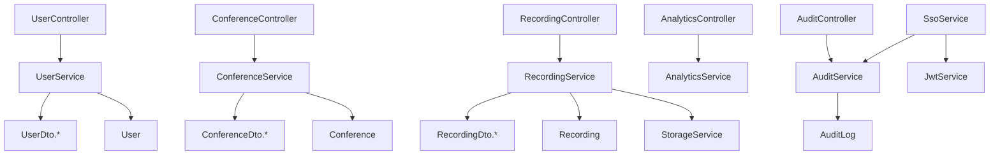

**Diagram sources**
- [UserService.java:1-190](file://jmp-application/src/main/java/com/jmp/application/service/UserService.java#L1-L190)
- [ConferenceService.java:1-225](file://jmp-application/src/main/java/com/jmp/application/service/ConferenceService.java#L1-L225)
- [RecordingService.java:1-332](file://jmp-application/src/main/java/com/jmp/application/service/RecordingService.java#L1-L332)
- [AnalyticsService.java:1-235](file://jmp-application/src/main/java/com/jmp/application/service/AnalyticsService.java#L1-L235)
- [AuditService.java:1-207](file://jmp-application/src/main/java/com/jmp/application/service/AuditService.java#L1-L207)
- [JwtService.java:1-236](file://jmp-application/src/main/java/com/jmp/application/service/JwtService.java#L1-L236)
- [SsoService.java:1-244](file://jmp-application/src/main/java/com/jmp/application/service/SsoService.java#L1-L244)
- [StorageService.java:1-56](file://jmp-application/src/main/java/com/jmp/application/service/StorageService.java#L1-L56)
- [UserDto.java:1-97](file://jmp-application/src/main/java/com/jmp/application/dto/UserDto.java#L1-L97)
- [ConferenceDto.java:1-176](file://jmp-application/src/main/java/com/jmp/application/dto/ConferenceDto.java#L1-L176)
- [RecordingDto.java:1-170](file://jmp-application/src/main/java/com/jmp/application/dto/RecordingDto.java#L1-L170)

## Detailed Component Analysis

### UserService
- Responsibilities
  - Create users with tenant association, role assignment, and password hashing
  - Retrieve users by ID/email, list/search within tenant, update with optional role reassignment
  - Soft delete users and record login timestamps
  - Check permissions by traversing roles and permissions
- Validation and Error Handling
  - Email uniqueness check; throws exceptions for duplicates or missing entities
  - Role resolution with defaults and validation
- Transaction Management
  - readOnly=true at class level; explicit @Transactional on mutating methods
- DTO and Mapping
  - Uses UserDto.CreateRequest, UpdateRequest, Response, Summary
  - UserMapper handles entity-to-DTO conversions and selective field mapping

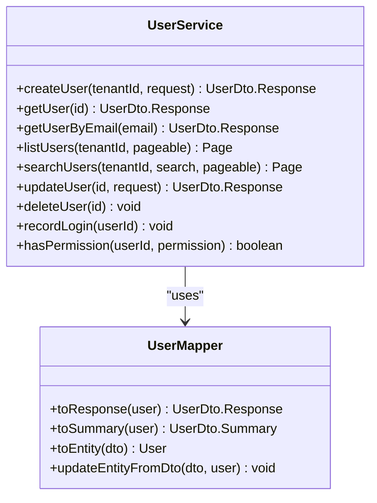

**Diagram sources**
- [UserService.java:28-189](file://jmp-application/src/main/java/com/jmp/application/service/UserService.java#L28-L189)
- [UserMapper.java:18-75](file://jmp-application/src/main/java/com/jmp/application/mapper/UserMapper.java#L18-L75)

**Section sources**
- [UserService.java:28-189](file://jmp-application/src/main/java/com/jmp/application/service/UserService.java#L28-L189)
- [UserDto.java:14-96](file://jmp-application/src/main/java/com/jmp/application/dto/UserDto.java#L14-L96)
- [UserMapper.java:18-75](file://jmp-application/src/main/java/com/jmp/application/mapper/UserMapper.java#L18-L75)

### ConferenceService
- Responsibilities
  - Create conferences with tenant and creator linkage, enforce room name uniqueness
  - Retrieve, list, search conferences; filter active/upcoming
  - Update conferences with state transition guards
  - Start/end conferences with state validations
  - Soft delete conferences
  - Scheduled processing for auto-start and auto-end
- Validation and Error Handling
  - Throws on invalid state transitions and missing entities
  - Room name uniqueness enforced per tenant
- Transaction Management
  - readOnly=true at class level; explicit @Transactional on mutating methods
- DTO and Mapping
  - Uses ConferenceDto.CreateRequest, UpdateRequest, Response, Summary
  - ConferenceMapper maps computed fields like current participants and creator name

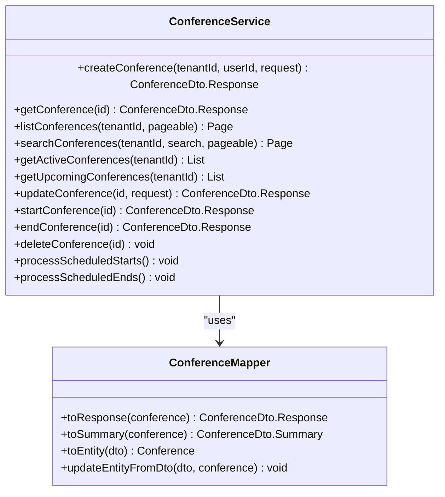

**Diagram sources**
- [ConferenceService.java:25-224](file://jmp-application/src/main/java/com/jmp/application/service/ConferenceService.java#L25-L224)
- [ConferenceMapper.java:15-74](file://jmp-application/src/main/java/com/jmp/application/mapper/ConferenceMapper.java#L15-L74)

**Section sources**
- [ConferenceService.java:25-224](file://jmp-application/src/main/java/com/jmp/application/service/ConferenceService.java#L25-L224)
- [ConferenceDto.java:15-175](file://jmp-application/src/main/java/com/jmp/application/dto/ConferenceDto.java#L15-L175)
- [ConferenceMapper.java:15-74](file://jmp-application/src/main/java/com/jmp/application/mapper/ConferenceMapper.java#L15-L74)

### RecordingService
- Responsibilities
  - Create recording entries with metadata, encryption flag, retention policy
  - Mark recordings ready with duration calculation and hash updates
  - Retrieve/list/search recordings; filter by conference
  - Generate presigned download URLs with retention checks
  - Update metadata and retention; soft delete with asynchronous storage deletion
  - Compute storage statistics and archive expired recordings
  - Handle Jibri status webhooks
- Validation and Error Handling
  - Throws when recording not found, not ready, or outside retention
  - Retries and logging for scheduled archival tasks
- Transaction Management
  - readOnly=true at class level; explicit @Transactional on mutating methods
- DTO and Mapping
  - Uses RecordingDto.CreateRequest, UpdateRequest, Response, Summary, DownloadUrlResponse, StorageStats
  - Internal helpers convert domain entities to DTOs

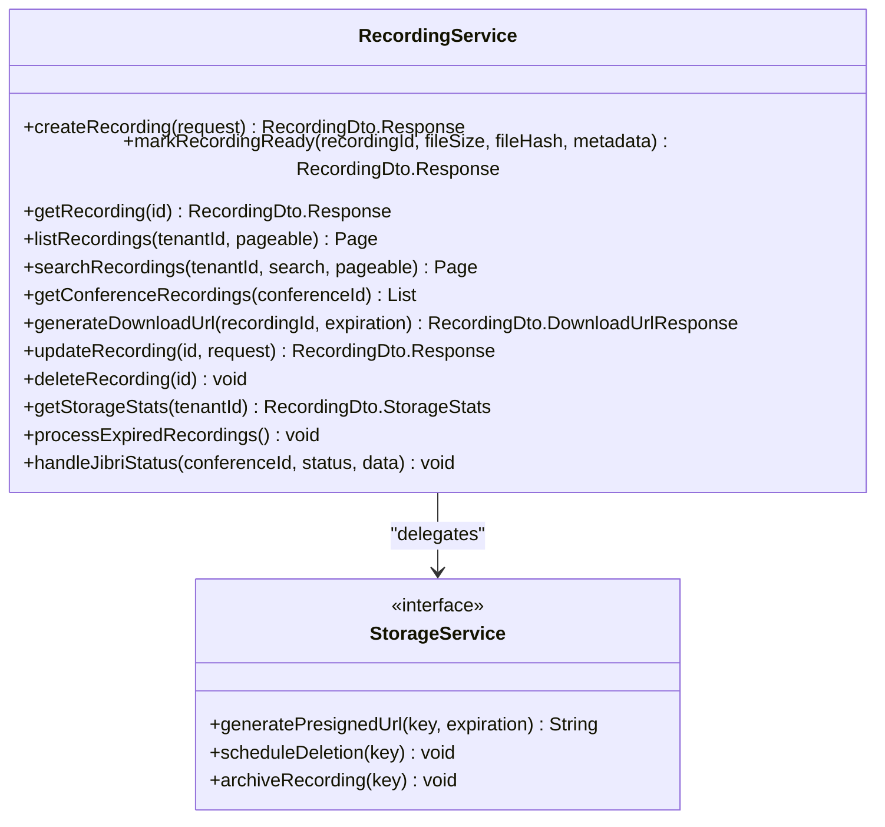

**Diagram sources**
- [RecordingService.java:27-331](file://jmp-application/src/main/java/com/jmp/application/service/RecordingService.java#L27-L331)
- [StorageService.java:9-55](file://jmp-application/src/main/java/com/jmp/application/service/StorageService.java#L9-L55)

**Section sources**
- [RecordingService.java:27-331](file://jmp-application/src/main/java/com/jmp/application/service/RecordingService.java#L27-L331)
- [RecordingDto.java:13-169](file://jmp-application/src/main/java/com/jmp/application/dto/RecordingDto.java#L13-L169)
- [StorageService.java:9-55](file://jmp-application/src/main/java/com/jmp/application/service/StorageService.java#L9-L55)

### AnalyticsService
- Responsibilities
  - Aggregate dashboard metrics: recordings this month, storage used, duration stats, weekly usage
  - Generate usage reports for date ranges with peak usage
  - Provide participant and recording analytics
  - System health metrics (placeholder)
- Data Contracts
  - Returns structured records: DashboardMetrics, UsageReport, ParticipantAnalytics, RecordingAnalytics, SystemHealthMetrics

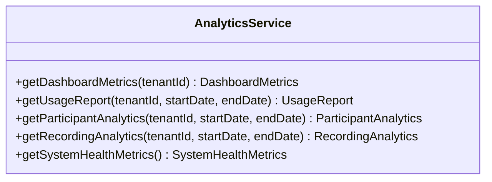

**Diagram sources**
- [AnalyticsService.java:25-234](file://jmp-application/src/main/java/com/jmp/application/service/AnalyticsService.java#L25-L234)

**Section sources**
- [AnalyticsService.java:25-234](file://jmp-application/src/main/java/com/jmp/application/service/AnalyticsService.java#L25-L234)

### AuditService
- Responsibilities
  - Asynchronously log audit events with propagation REQUIRES_NEW
  - Convenience methods for authentication, user management, conference, recording, and security events
  - Search audit logs and retrieve entity-specific audit trails
- Transaction Management
  - Async execution with dedicated executor; transaction propagation configured

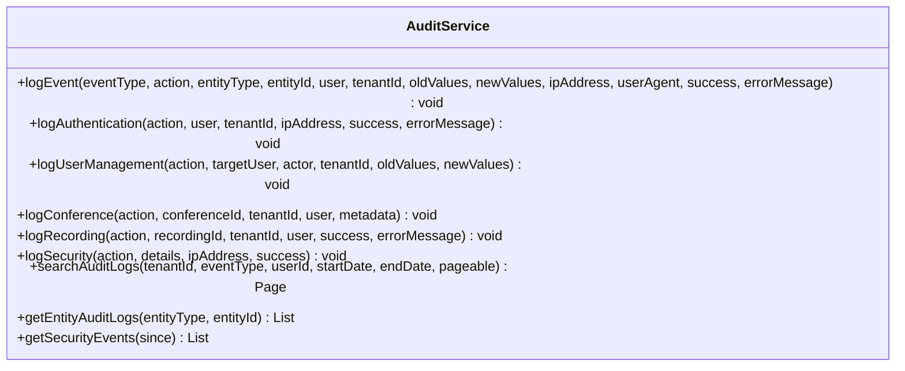

**Diagram sources**
- [AuditService.java:22-206](file://jmp-application/src/main/java/com/jmp/application/service/AuditService.java#L22-L206)

**Section sources**
- [AuditService.java:22-206](file://jmp-application/src/main/java/com/jmp/application/service/AuditService.java#L22-L206)

### Supporting Services

#### JwtService
- Responsibilities
  - Generate access/refresh tokens with configurable expiration
  - Generate Jitsi conference tokens with room, moderator flag, and feature claims
  - Generate guest tokens for external participants
  - Validate tokens and extract claims
- Configuration
  - Reads secrets and expiration settings from configuration

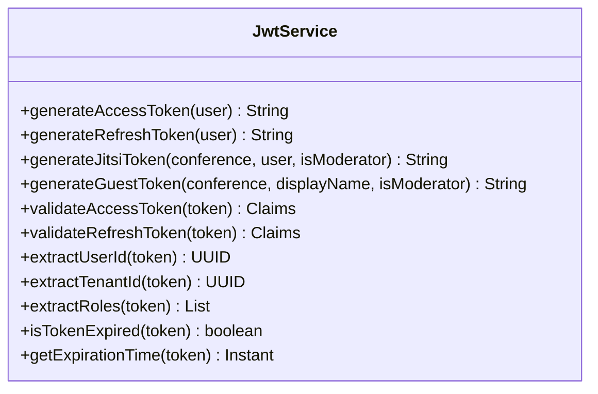

**Diagram sources**
- [JwtService.java:25-235](file://jmp-application/src/main/java/com/jmp/application/service/JwtService.java#L25-L235)

**Section sources**
- [JwtService.java:25-235](file://jmp-application/src/main/java/com/jmp/application/service/JwtService.java#L25-L235)

#### SsoService
- Responsibilities
  - Generate OIDC authorization URLs
  - Handle callbacks: exchange code for tokens, fetch user info, map attributes
  - Provision users when auto-provisioning is enabled
  - Issue JWT tokens and log authentication events
- Integrations
  - Uses IdentityProviderRepository, UserRepository, RoleRepository, JwtService, AuditService
  - REST client for OIDC endpoints

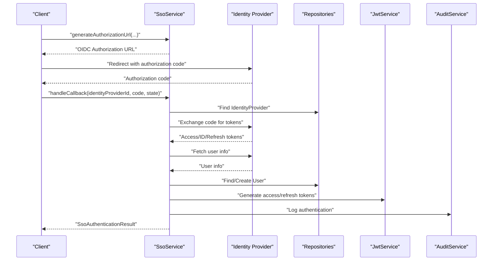

**Diagram sources**
- [SsoService.java:44-131](file://jmp-application/src/main/java/com/jmp/application/service/SsoService.java#L44-L131)
- [JwtService.java:49-87](file://jmp-application/src/main/java/com/jmp/application/service/JwtService.java#L49-L87)
- [AuditService.java:77-92](file://jmp-application/src/main/java/com/jmp/application/service/AuditService.java#L77-L92)

**Section sources**
- [SsoService.java:44-131](file://jmp-application/src/main/java/com/jmp/application/service/SsoService.java#L44-L131)

#### StorageService Interface
- Responsibilities
  - Define storage operations: presigned URLs (download/upload), deletion, archival, restoration, provider identification
- Extensibility
  - Implementation varies by provider (e.g., S3, Azure Blob, GCP Storage, MinIO, Local)

**Section sources**
- [StorageService.java:9-55](file://jmp-application/src/main/java/com/jmp/application/service/StorageService.java#L9-L55)

### DTO Patterns
The Application Layer uses sealed interfaces and records to define immutable, type-safe DTOs:
- UserDto: CreateRequest, UpdateRequest, Response, Summary
- ConferenceDto: CreateRequest, UpdateRequest, Response, Summary, TokenRequest, TokenResponse
- RecordingDto: CreateRequest, UpdateRequest, Response, Summary, DownloadUrlResponse, StorageStats

Validation constraints are applied at DTO boundaries to ensure robust input handling.

**Section sources**
- [UserDto.java:14-96](file://jmp-application/src/main/java/com/jmp/application/dto/UserDto.java#L14-L96)
- [ConferenceDto.java:15-175](file://jmp-application/src/main/java/com/jmp/application/dto/ConferenceDto.java#L15-L175)
- [RecordingDto.java:13-169](file://jmp-application/src/main/java/com/jmp/application/dto/RecordingDto.java#L13-L169)

### Mapper Classes (MapStruct)
- UserMapper
  - Converts User entity to UserDto.Response and Summary
  - Maps roles to strings and tenant ID
  - Ignores derived/sensitive fields during entity creation/update
- ConferenceMapper
  - Converts Conference entity to Response/Summary
  - Computes current participants and creator name
  - Ignores derived/sensitive fields during creation/update

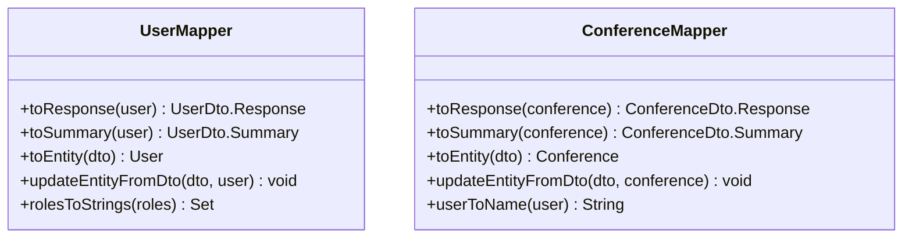

**Diagram sources**
- [UserMapper.java:18-75](file://jmp-application/src/main/java/com/jmp/application/mapper/UserMapper.java#L18-L75)
- [ConferenceMapper.java:15-74](file://jmp-application/src/main/java/com/jmp/application/mapper/ConferenceMapper.java#L15-L74)

**Section sources**
- [UserMapper.java:18-75](file://jmp-application/src/main/java/com/jmp/application/mapper/UserMapper.java#L18-L75)
- [ConferenceMapper.java:15-74](file://jmp-application/src/main/java/com/jmp/application/mapper/ConferenceMapper.java#L15-L74)

## Dependency Analysis
- Cohesion
  - Each service focuses on a bounded context: users, conferences, recordings, analytics, audits
- Coupling
  - Services depend on repositories and mappers; RecordingService depends on StorageService
  - AuditService is invoked by other services for non-blocking logging
  - SsoService coordinates with JwtService and AuditService
- External Dependencies
  - MapStruct for compile-time object mapping
  - Spring Data for pagination and repository abstractions
  - Spring Security for password encoding
  - JSON Web Token library for token operations
  - REST client for OIDC flows

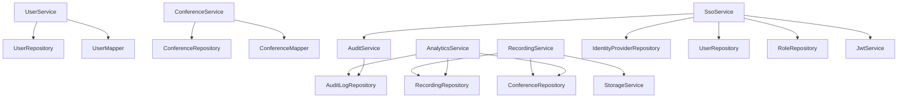

**Diagram sources**
- [UserService.java:34-38](file://jmp-application/src/main/java/com/jmp/application/service/UserService.java#L34-L38)
- [ConferenceService.java:31-34](file://jmp-application/src/main/java/com/jmp/application/service/ConferenceService.java#L31-L34)
- [RecordingService.java:33-36](file://jmp-application/src/main/java/com/jmp/application/service/RecordingService.java#L33-L36)
- [AnalyticsService.java:31-33](file://jmp-application/src/main/java/com/jmp/application/service/AnalyticsService.java#L31-L33)
- [AuditService.java](file://jmp-application/src/main/java/com/jmp/application/service/AuditService.java#L27)
- [SsoService.java:37-42](file://jmp-application/src/main/java/com/jmp/application/service/SsoService.java#L37-L42)
- [JwtService.java:29-43](file://jmp-application/src/main/java/com/jmp/application/service/JwtService.java#L29-L43)

**Section sources**
- [UserService.java:34-38](file://jmp-application/src/main/java/com/jmp/application/service/UserService.java#L34-L38)
- [ConferenceService.java:31-34](file://jmp-application/src/main/java/com/jmp/application/service/ConferenceService.java#L31-L34)
- [RecordingService.java:33-36](file://jmp-application/src/main/java/com/jmp/application/service/RecordingService.java#L33-L36)
- [AnalyticsService.java:31-33](file://jmp-application/src/main/java/com/jmp/application/service/AnalyticsService.java#L31-L33)
- [AuditService.java](file://jmp-application/src/main/java/com/jmp/application/service/AuditService.java#L27)
- [SsoService.java:37-42](file://jmp-application/src/main/java/com/jmp/application/service/SsoService.java#L37-L42)
- [JwtService.java:29-43](file://jmp-application/src/main/java/com/jmp/application/service/JwtService.java#L29-L43)

## Performance Considerations
- Pagination
  - Services expose Pageable parameters for list/search operations to avoid large result sets
- Indexing
  - Methods like findByTenantIdAndDeletedAtIsNull and search queries imply database indexing for tenant and search fields
- Asynchronous Auditing
  - AuditService uses async execution and separate transaction propagation to prevent blocking
- Scheduled Jobs
  - ConferenceService and RecordingService include scheduled processing methods for auto-start, auto-end, and archival
- DTO Projection
  - Mappers exclude sensitive fields and compute derived values efficiently

[No sources needed since this section provides general guidance]

## Troubleshooting Guide
- Common Exceptions
  - IllegalArgumentException for missing entities or invalid states
  - IllegalStateException for invalid state transitions or retention violations
- Logging
  - Services log informational messages around create/update/delete/start/end operations
  - AuditService logs warnings for failed audit writes and errors for exceptions
- Validation Failures
  - DTO constraints ensure early rejection of malformed requests
- Recommendations
  - Verify tenant and user existence before invoking services
  - Ensure room name uniqueness for conferences
  - Confirm recording readiness and retention before generating download URLs
  - Check scheduled job configurations for auto-start/auto-end and archival

**Section sources**
- [UserService.java:48-51](file://jmp-application/src/main/java/com/jmp/application/service/UserService.java#L48-L51)
- [ConferenceService.java:120-124](file://jmp-application/src/main/java/com/jmp/application/service/ConferenceService.java#L120-L124)
- [RecordingService.java:146-152](file://jmp-application/src/main/java/com/jmp/application/service/RecordingService.java#L146-L152)
- [AuditService.java:69-71](file://jmp-application/src/main/java/com/jmp/application/service/AuditService.java#L69-L71)

## Conclusion
The Application Layer cleanly separates business logic from infrastructure concerns, using DTOs and MapStruct mappers to maintain strong contracts and reduce boilerplate. Services enforce validation and business rules, manage transactions appropriately, and delegate storage operations. Audit logging is decoupled and asynchronous, ensuring system responsiveness. Supporting services like JwtService and SsoService provide secure token handling and SSO integration, while AnalyticsService offers extensible reporting capabilities.

[No sources needed since this section summarizes without analyzing specific files]

## Appendices

### Complex Business Operations Examples

#### Conference Scheduling
- Create a conference with scheduled start/end times
- Update only scheduled fields for future events
- Auto-start conferences at scheduled time; auto-end at end time
- Guard against updates to ended/cancelled conferences

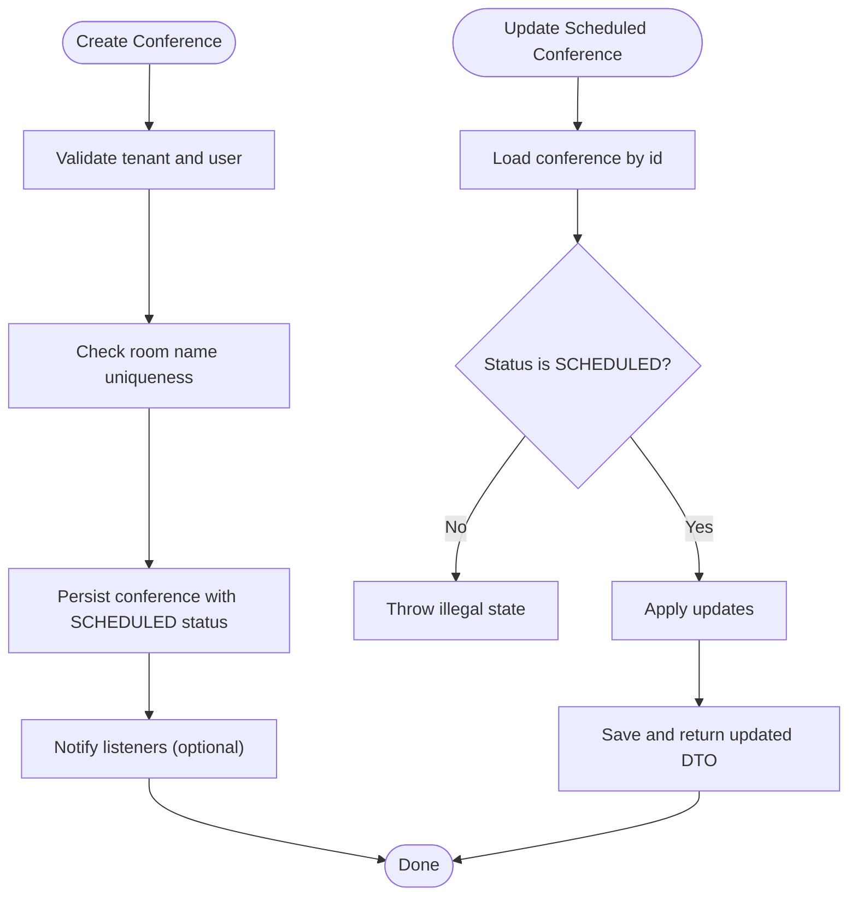

**Diagram sources**
- [ConferenceService.java:40-65](file://jmp-application/src/main/java/com/jmp/application/service/ConferenceService.java#L40-L65)
- [ConferenceService.java:113-131](file://jmp-application/src/main/java/com/jmp/application/service/ConferenceService.java#L113-L131)

**Section sources**
- [ConferenceService.java:40-65](file://jmp-application/src/main/java/com/jmp/application/service/ConferenceService.java#L40-L65)
- [ConferenceService.java:113-131](file://jmp-application/src/main/java/com/jmp/application/service/ConferenceService.java#L113-L131)

#### Recording Management
- Create recording entry upon initiation
- Mark ready with file metadata and duration calculation
- Generate presigned download URL respecting retention
- Soft delete with asynchronous storage deletion and archival

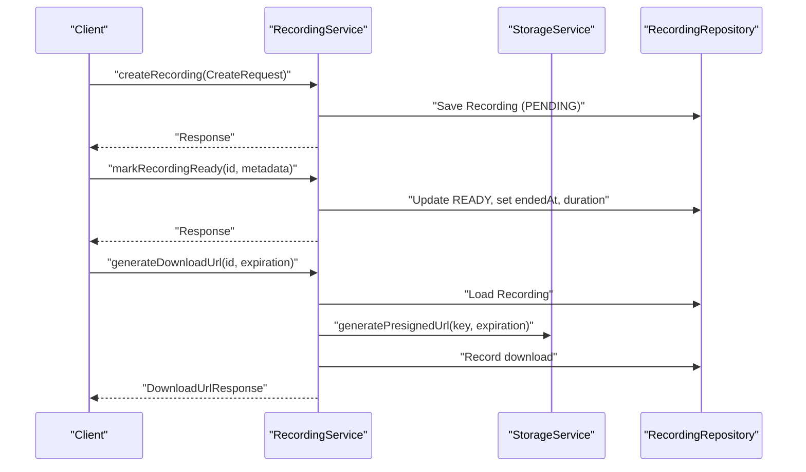

**Diagram sources**
- [RecordingService.java:42-101](file://jmp-application/src/main/java/com/jmp/application/service/RecordingService.java#L42-L101)
- [RecordingService.java:141-170](file://jmp-application/src/main/java/com/jmp/application/service/RecordingService.java#L141-L170)
- [RecordingService.java:196-212](file://jmp-application/src/main/java/com/jmp/application/service/RecordingService.java#L196-L212)

**Section sources**
- [RecordingService.java:42-101](file://jmp-application/src/main/java/com/jmp/application/service/RecordingService.java#L42-L101)
- [RecordingService.java:141-170](file://jmp-application/src/main/java/com/jmp/application/service/RecordingService.java#L141-L170)
- [RecordingService.java:196-212](file://jmp-application/src/main/java/com/jmp/application/service/RecordingService.java#L196-L212)

#### Analytics Calculation
- Dashboard metrics: recordings this month, storage used, duration stats, weekly usage
- Usage report: total recordings, storage, peak usage for a date range
- Recording analytics: averages, counts by type

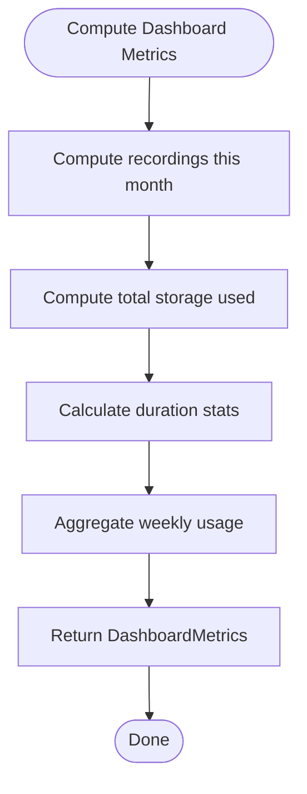

**Diagram sources**
- [AnalyticsService.java:38-65](file://jmp-application/src/main/java/com/jmp/application/service/AnalyticsService.java#L38-L65)

**Section sources**
- [AnalyticsService.java:38-65](file://jmp-application/src/main/java/com/jmp/application/service/AnalyticsService.java#L38-L65)

### Service Layer Testing Strategies
- Unit Tests
  - Mock repositories and mappers; assert service method behavior and exceptions
  - Test DTO validation constraints via service inputs
- Integration Tests
  - Use @DataJpaTest for repository layers; @Import for service wiring
  - Verify transaction boundaries and rollback behavior
- Audit Logging
  - Test async logging via controlled executors and assertions on persisted audit logs
- SSO Flow
  - Mock OIDC endpoints and RestTemplate; verify token exchange and user provisioning
- Storage Delegation
  - Mock StorageService to isolate RecordingService behavior

[No sources needed since this section provides general guidance]

### Dependency Injection Patterns
- Constructor Injection
  - Services receive dependencies via constructor for immutability and testability
- MapStruct Component Model
  - @Mapper(componentModel = "spring") enables DI of generated mappers
- Configuration Properties
  - JwtService reads secrets and expiration from configuration
- Async Execution
  - AuditService uses a named executor bean "auditExecutor" for async logging

**Section sources**
- [UserMapper.java:18-21](file://jmp-application/src/main/java/com/jmp/application/mapper/UserMapper.java#L18-L21)
- [JwtService.java:34-43](file://jmp-application/src/main/java/com/jmp/application/service/JwtService.java#L34-L43)
- [AuditService.java:32-33](file://jmp-application/src/main/java/com/jmp/application/service/AuditService.java#L32-L33)