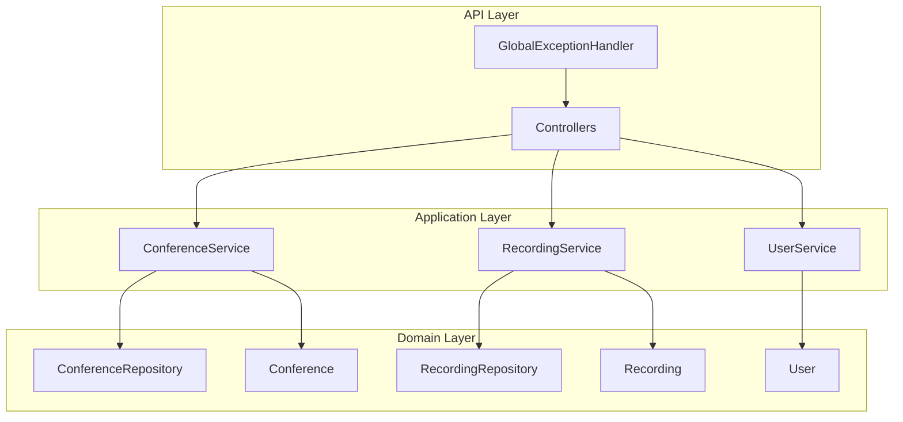
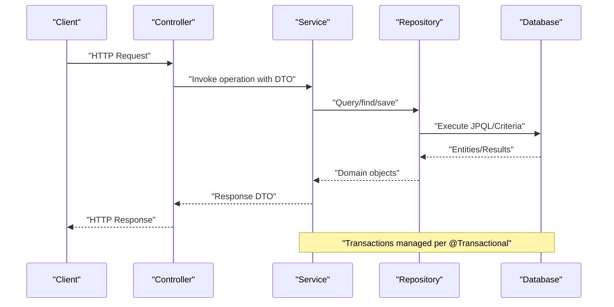
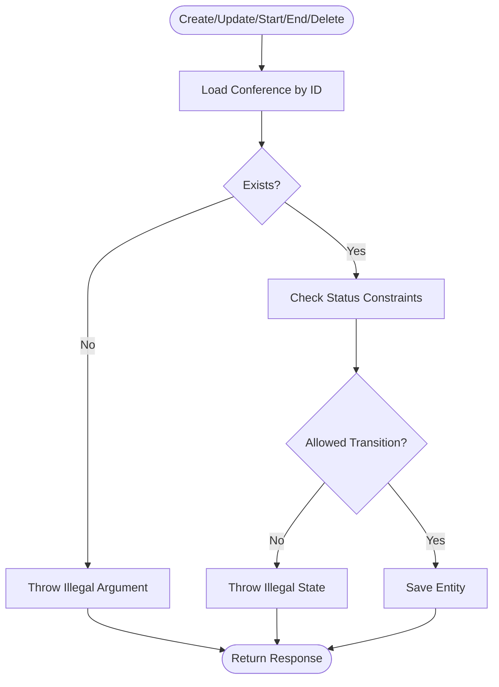
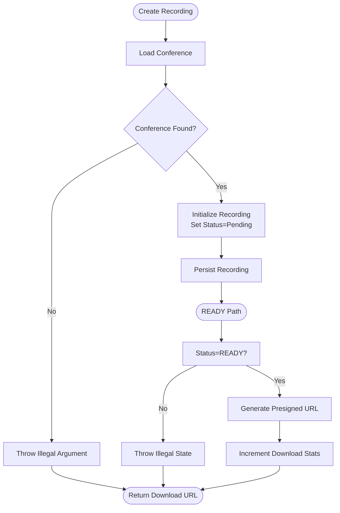
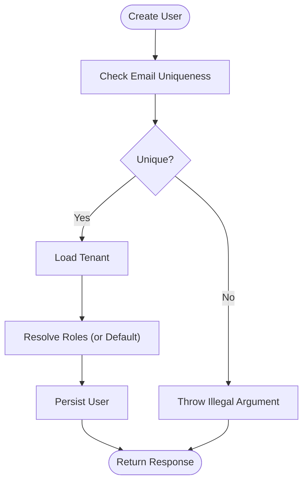
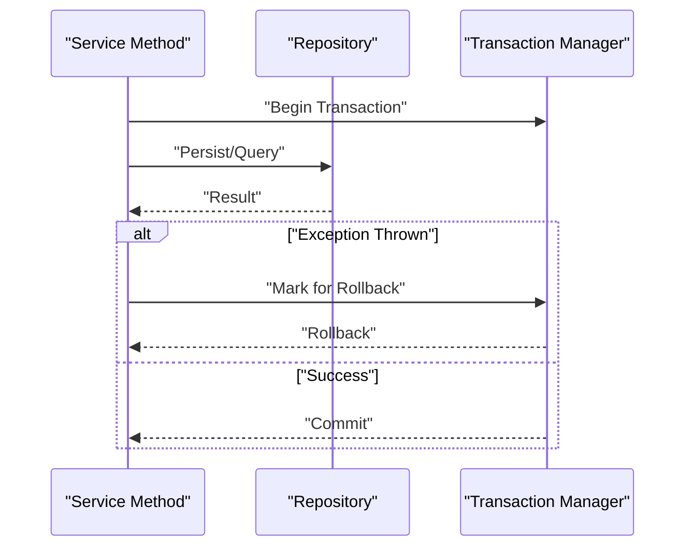
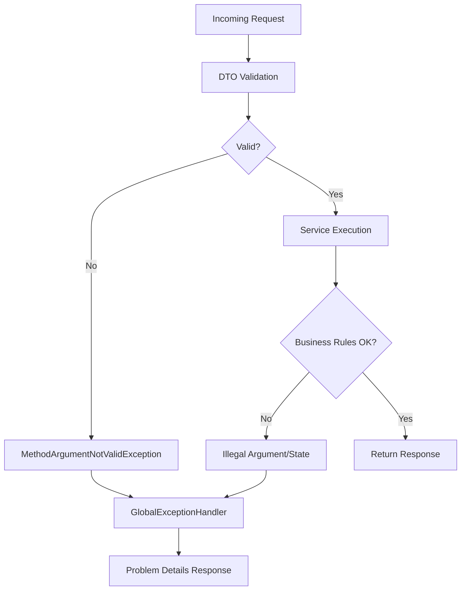
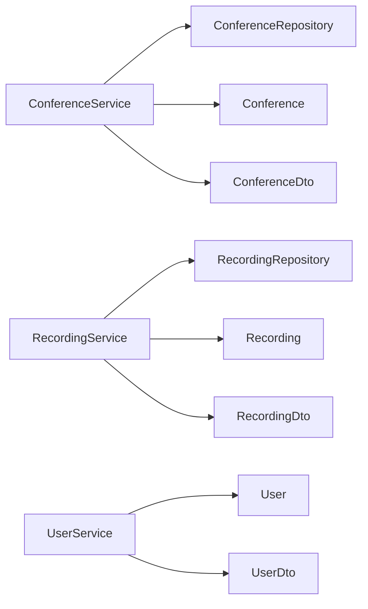

# Business Logic and Validation

<cite>
**Referenced Files in This Document**
- [ConferenceService.java](file://jmp-application/src/main/java/com/jmp/application/service/ConferenceService.java)
- [RecordingService.java](file://jmp-application/src/main/java/com/jmp/application/service/RecordingService.java)
- [UserService.java](file://jmp-application/src/main/java/com/jmp/application/service/UserService.java)
- [Conference.java](file://jmp-domain/src/main/java/com/jmp/domain/entity/Conference.java)
- [Recording.java](file://jmp-domain/src/main/java/com/jmp/domain/entity/Recording.java)
- [User.java](file://jmp-domain/src/main/java/com/jmp/domain/entity/User.java)
- [ConferenceRepository.java](file://jmp-domain/src/main/java/com/jmp/domain/repository/ConferenceRepository.java)
- [RecordingRepository.java](file://jmp-domain/src/main/java/com/jmp/domain/repository/RecordingRepository.java)
- [ConferenceDto.java](file://jmp-application/src/main/java/com/jmp/application/dto/ConferenceDto.java)
- [RecordingDto.java](file://jmp-application/src/main/java/com/jmp/application/dto/RecordingDto.java)
- [UserDto.java](file://jmp-application/src/main/java/com/jmp/application/dto/UserDto.java)
- [GlobalExceptionHandler.java](file://jmp-api/src/main/java/com/jmp/api/advice/GlobalExceptionHandler.java)
</cite>

## Table of Contents
1. [Introduction](#introduction)
2. [Project Structure](#project-structure)
3. [Core Components](#core-components)
4. [Architecture Overview](#architecture-overview)
5. [Detailed Component Analysis](#detailed-component-analysis)
6. [Dependency Analysis](#dependency-analysis)
7. [Performance Considerations](#performance-considerations)
8. [Troubleshooting Guide](#troubleshooting-guide)
9. [Conclusion](#conclusion)

## Introduction
This document explains the business logic and validation strategies implemented in the application layer. It focuses on how business rules are enforced, how input validation is performed, and how data integrity is maintained within service methods. It also documents transaction management, rollback strategies, and consistency guarantees, and provides examples of complex business operations such as conference scheduling validation, user permission checking, and recording status transitions. Guidance on error handling, user-friendly error messages, and debugging validation failures is included, along with the relationship between business logic and domain entities.

## Project Structure
The application follows a layered architecture:
- Application layer: Services orchestrate business operations, enforce rules, and coordinate repositories and mappers.
- Domain layer: Entities encapsulate business state and behavior, with JPA/Hibernate annotations and enums defining constraints.
- Infrastructure layer: Repositories define data access queries; controllers and exception handlers manage inbound requests and error responses.
- DTOs: Define validated request/response shapes for services and controllers.

**Diagram sources**
- [ConferenceService.java:25-225](file://jmp-application/src/main/java/com/jmp/application/service/ConferenceService.java#L25-L225)
- [RecordingService.java:27-332](file://jmp-application/src/main/java/com/jmp/application/service/RecordingService.java#L27-L332)
- [UserService.java:28-190](file://jmp-application/src/main/java/com/jmp/application/service/UserService.java#L28-L190)
- [ConferenceRepository.java:21-110](file://jmp-domain/src/main/java/com/jmp/domain/repository/ConferenceRepository.java#L21-L110)
- [RecordingRepository.java:19-100](file://jmp-domain/src/main/java/com/jmp/domain/repository/RecordingRepository.java#L19-L100)
- [Conference.java:25-217](file://jmp-domain/src/main/java/com/jmp/domain/entity/Conference.java#L25-L217)
- [Recording.java:24-203](file://jmp-domain/src/main/java/com/jmp/domain/entity/Recording.java#L24-L203)
- [User.java:23-164](file://jmp-domain/src/main/java/com/jmp/domain/entity/User.java#L23-L164)
- [GlobalExceptionHandler.java:22-130](file://jmp-api/src/main/java/com/jmp/api/advice/GlobalExceptionHandler.java#L22-L130)

**Section sources**
- [ConferenceService.java:25-225](file://jmp-application/src/main/java/com/jmp/application/service/ConferenceService.java#L25-L225)
- [RecordingService.java:27-332](file://jmp-application/src/main/java/com/jmp/application/service/RecordingService.java#L27-L332)
- [UserService.java:28-190](file://jmp-application/src/main/java/com/jmp/application/service/UserService.java#L28-L190)
- [ConferenceRepository.java:21-110](file://jmp-domain/src/main/java/com/jmp/domain/repository/ConferenceRepository.java#L21-L110)
- [RecordingRepository.java:19-100](file://jmp-domain/src/main/java/com/jmp/domain/repository/RecordingRepository.java#L19-L100)
- [Conference.java:25-217](file://jmp-domain/src/main/java/com/jmp/domain/entity/Conference.java#L25-L217)
- [Recording.java:24-203](file://jmp-domain/src/main/java/com/jmp/domain/entity/Recording.java#L24-L203)
- [User.java:23-164](file://jmp-domain/src/main/java/com/jmp/domain/entity/User.java#L23-L164)
- [GlobalExceptionHandler.java:22-130](file://jmp-api/src/main/java/com/jmp/api/advice/GlobalExceptionHandler.java#L22-L130)

## Core Components
- ConferenceService: Manages conference lifecycle, enforces scheduling and state transitions, and performs tenant-scoped validations.
- RecordingService: Manages recording lifecycle, enforces readiness and retention constraints, and coordinates storage operations.
- UserService: Manages user lifecycle, validates uniqueness, resolves roles, and checks permissions.

Validation strategies:
- DTO-level validation via Bean Validation annotations on records.
- Domain-level constraints via JPA/Hibernate annotations on entities.
- Service-level business rule enforcement and state checks.
- Global exception handling returning structured error responses.

**Section sources**
- [ConferenceService.java:25-225](file://jmp-application/src/main/java/com/jmp/application/service/ConferenceService.java#L25-L225)
- [RecordingService.java:27-332](file://jmp-application/src/main/java/com/jmp/application/service/RecordingService.java#L27-L332)
- [UserService.java:28-190](file://jmp-application/src/main/java/com/jmp/application/service/UserService.java#L28-L190)
- [ConferenceDto.java:14-176](file://jmp-application/src/main/java/com/jmp/application/dto/ConferenceDto.java#L14-L176)
- [RecordingDto.java:12-170](file://jmp-application/src/main/java/com/jmp/application/dto/RecordingDto.java#L12-L170)
- [UserDto.java:13-97](file://jmp-application/src/main/java/com/jmp/application/dto/UserDto.java#L13-L97)
- [Conference.java:25-217](file://jmp-domain/src/main/java/com/jmp/domain/entity/Conference.java#L25-L217)
- [Recording.java:24-203](file://jmp-domain/src/main/java/com/jmp/domain/entity/Recording.java#L24-L203)
- [User.java:23-164](file://jmp-domain/src/main/java/com/jmp/domain/entity/User.java#L23-L164)
- [GlobalExceptionHandler.java:22-130](file://jmp-api/src/main/java/com/jmp/api/advice/GlobalExceptionHandler.java#L22-L130)

## Architecture Overview
The application enforces business logic in services, backed by repositories and domain entities. Controllers receive requests, which are validated by DTO constraints and method-level validation. Exceptions are normalized by the global exception handler into structured Problem Details responses.

**Diagram sources**
- [ConferenceService.java:25-225](file://jmp-application/src/main/java/com/jmp/application/service/ConferenceService.java#L25-L225)
- [RecordingService.java:27-332](file://jmp-application/src/main/java/com/jmp/application/service/RecordingService.java#L27-L332)
- [UserService.java:28-190](file://jmp-application/src/main/java/com/jmp/application/service/UserService.java#L28-L190)
- [ConferenceRepository.java:21-110](file://jmp-domain/src/main/java/com/jmp/domain/repository/ConferenceRepository.java#L21-L110)
- [RecordingRepository.java:19-100](file://jmp-domain/src/main/java/com/jmp/domain/repository/RecordingRepository.java#L19-L100)

## Detailed Component Analysis

### Conference Management Service
Business rules and validations:
- Uniqueness: Room name scoped to tenant must be unique.
- State transitions: Updates allowed only when not ended/cancelled; start requires scheduled state; end requires active state.
- Scheduling: Scheduled start/end times are stored; auto-start and auto-end handled by scheduled jobs.
- Soft delete: Marks as cancelled and sets deleted timestamp.

**Diagram sources**
- [ConferenceService.java:40-189](file://jmp-application/src/main/java/com/jmp/application/service/ConferenceService.java#L40-L189)
- [Conference.java:137-175](file://jmp-domain/src/main/java/com/jmp/domain/entity/Conference.java#L137-L175)

**Section sources**
- [ConferenceService.java:40-189](file://jmp-application/src/main/java/com/jmp/application/service/ConferenceService.java#L40-L189)
- [ConferenceRepository.java:21-110](file://jmp-domain/src/main/java/com/jmp/domain/repository/ConferenceRepository.java#L21-L110)
- [Conference.java:137-175](file://jmp-domain/src/main/java/com/jmp/domain/entity/Conference.java#L137-L175)

### Recording Management Service
Business rules and validations:
- Creation: Validates associated conference exists; initializes status to pending; sets retention; optional metadata.
- Readiness: Marks as ready, calculates duration, updates end time and hash; merges metadata.
- Download: Requires READY status and within retention; generates presigned URL via storage service and increments download stats.
- Deletion: Soft deletes recording and schedules asynchronous storage deletion.
- Expiration: Archives expired recordings and triggers storage archival.
- Webhook handling: Processes Jibri status events to drive completion workflows.

**Diagram sources**
- [RecordingService.java:42-170](file://jmp-application/src/main/java/com/jmp/application/service/RecordingService.java#L42-L170)
- [Recording.java:128-161](file://jmp-domain/src/main/java/com/jmp/domain/entity/Recording.java#L128-L161)

**Section sources**
- [RecordingService.java:42-170](file://jmp-application/src/main/java/com/jmp/application/service/RecordingService.java#L42-L170)
- [RecordingRepository.java:19-100](file://jmp-domain/src/main/java/com/jmp/domain/repository/RecordingRepository.java#L19-L100)
- [Recording.java:128-161](file://jmp-domain/src/main/java/com/jmp/domain/entity/Recording.java#L128-L161)

### User Management and Permissions
Business rules and validations:
- Uniqueness: Email must be unique per tenant; duplicates rejected.
- Roles: Resolves requested roles or defaults to participant; throws if roles not found.
- Permissions: Checks if a user possesses a given permission by traversing roles and permissions.
- Lifecycle: Supports creation, retrieval, listing, updates (including role updates), and soft deletion.

**Diagram sources**
- [UserService.java:44-70](file://jmp-application/src/main/java/com/jmp/application/service/UserService.java#L44-L70)
- [User.java:117-130](file://jmp-domain/src/main/java/com/jmp/domain/entity/User.java#L117-L130)

**Section sources**
- [UserService.java:44-70](file://jmp-application/src/main/java/com/jmp/application/service/UserService.java#L44-L70)
- [User.java:117-130](file://jmp-domain/src/main/java/com/jmp/domain/entity/User.java#L117-L130)

### Transaction Management and Consistency
- Services are annotated with @Transactional(readOnly = true) for read operations and @Transactional for write operations.
- Methods that mutate state (create, update, start, end, delete, readiness, download) are transactional to ensure atomicity.
- Rollback occurs implicitly on unchecked exceptions thrown by services or repositories; checked exceptions must be declared or wrapped to trigger rollback.
- Idempotency considerations: Scheduled jobs wrap operations in try/catch to avoid partial state and log failures.

**Diagram sources**
- [ConferenceService.java:28-225](file://jmp-application/src/main/java/com/jmp/application/service/ConferenceService.java#L28-L225)
- [RecordingService.java:30-332](file://jmp-application/src/main/java/com/jmp/application/service/RecordingService.java#L30-L332)
- [UserService.java:31-190](file://jmp-application/src/main/java/com/jmp/application/service/UserService.java#L31-L190)

**Section sources**
- [ConferenceService.java:28-225](file://jmp-application/src/main/java/com/jmp/application/service/ConferenceService.java#L28-L225)
- [RecordingService.java:30-332](file://jmp-application/src/main/java/com/jmp/application/service/RecordingService.java#L30-L332)
- [UserService.java:31-190](file://jmp-application/src/main/java/com/jmp/application/service/UserService.java#L31-L190)

### Validation Strategies and Error Handling
- DTO-level validation: Records define constraints (e.g., @NotBlank, @Size, @Email, @NotNull) to guard inputs.
- Domain-level constraints: Entities declare JPA/Hibernate constraints (e.g., @NotNull, @Size) and JSON columns.
- Service-level validation: Additional business checks (e.g., uniqueness, state transitions, readiness) throw IllegalArgumentException or IllegalStateException.
- Global exception handling: Converts exceptions to RFC 7807 Problem Details with appropriate HTTP status and structured error properties.

**Diagram sources**
- [ConferenceDto.java:43-67](file://jmp-application/src/main/java/com/jmp/application/dto/ConferenceDto.java#L43-L67)
- [RecordingDto.java:41-65](file://jmp-application/src/main/java/com/jmp/application/dto/RecordingDto.java#L41-L65)
- [UserDto.java:30-44](file://jmp-application/src/main/java/com/jmp/application/dto/UserDto.java#L30-L44)
- [Conference.java:37-48](file://jmp-domain/src/main/java/com/jmp/domain/entity/Conference.java#L37-L48)
- [Recording.java:36-56](file://jmp-domain/src/main/java/com/jmp/domain/entity/Recording.java#L36-L56)
- [User.java:35-53](file://jmp-domain/src/main/java/com/jmp/domain/entity/User.java#L35-L53)
- [GlobalExceptionHandler.java:82-114](file://jmp-api/src/main/java/com/jmp/api/advice/GlobalExceptionHandler.java#L82-L114)

**Section sources**
- [ConferenceDto.java:43-67](file://jmp-application/src/main/java/com/jmp/application/dto/ConferenceDto.java#L43-L67)
- [RecordingDto.java:41-65](file://jmp-application/src/main/java/com/jmp/application/dto/RecordingDto.java#L41-L65)
- [UserDto.java:30-44](file://jmp-application/src/main/java/com/jmp/application/dto/UserDto.java#L30-L44)
- [Conference.java:37-48](file://jmp-domain/src/main/java/com/jmp/domain/entity/Conference.java#L37-L48)
- [Recording.java:36-56](file://jmp-domain/src/main/java/com/jmp/domain/entity/Recording.java#L36-L56)
- [User.java:35-53](file://jmp-domain/src/main/java/com/jmp/domain/entity/User.java#L35-L53)
- [GlobalExceptionHandler.java:82-114](file://jmp-api/src/main/java/com/jmp/api/advice/GlobalExceptionHandler.java#L82-L114)

## Dependency Analysis
Services depend on repositories and mappers to access and transform domain entities. Repositories encapsulate JPQL queries and entity graphs. DTOs and entities define validation boundaries.

**Diagram sources**
- [ConferenceService.java:31-34](file://jmp-application/src/main/java/com/jmp/application/service/ConferenceService.java#L31-L34)
- [RecordingService.java:33-36](file://jmp-application/src/main/java/com/jmp/application/service/RecordingService.java#L33-L36)
- [UserService.java:34-38](file://jmp-application/src/main/java/com/jmp/application/service/UserService.java#L34-L38)
- [ConferenceRepository.java:21-110](file://jmp-domain/src/main/java/com/jmp/domain/repository/ConferenceRepository.java#L21-L110)
- [RecordingRepository.java:19-100](file://jmp-domain/src/main/java/com/jmp/domain/repository/RecordingRepository.java#L19-L100)
- [ConferenceDto.java:14-176](file://jmp-application/src/main/java/com/jmp/application/dto/ConferenceDto.java#L14-L176)
- [RecordingDto.java:12-170](file://jmp-application/src/main/java/com/jmp/application/dto/RecordingDto.java#L12-L170)
- [UserDto.java:13-97](file://jmp-application/src/main/java/com/jmp/application/dto/UserDto.java#L13-L97)

**Section sources**
- [ConferenceService.java:31-34](file://jmp-application/src/main/java/com/jmp/application/service/ConferenceService.java#L31-L34)
- [RecordingService.java:33-36](file://jmp-application/src/main/java/com/jmp/application/service/RecordingService.java#L33-L36)
- [UserService.java:34-38](file://jmp-application/src/main/java/com/jmp/application/service/UserService.java#L34-L38)
- [ConferenceRepository.java:21-110](file://jmp-domain/src/main/java/com/jmp/domain/repository/ConferenceRepository.java#L21-L110)
- [RecordingRepository.java:19-100](file://jmp-domain/src/main/java/com/jmp/domain/repository/RecordingRepository.java#L19-L100)
- [ConferenceDto.java:14-176](file://jmp-application/src/main/java/com/jmp/application/dto/ConferenceDto.java#L14-L176)
- [RecordingDto.java:12-170](file://jmp-application/src/main/java/com/jmp/application/dto/RecordingDto.java#L12-L170)
- [UserDto.java:13-97](file://jmp-application/src/main/java/com/jmp/application/dto/UserDto.java#L13-L97)

## Performance Considerations
- Prefer findById with entity graphs only when needed to avoid N+1 selects.
- Use repository-provided JPQL queries for filtered lists and counts to minimize in-memory filtering.
- Batch operations in scheduled tasks (auto-start, auto-end, expiration) should be resilient with per-item try/catch to prevent cascading failures.
- Indexes on frequently queried columns (e.g., tenantId, status, timestamps) improve query performance.

## Troubleshooting Guide
Common validation and business rule failures:
- Conference update fails: Occurs when trying to update an ended or cancelled conference. Ensure the conference is in SCHEDULED state before updates.
- Conference start fails: Occurs when the conference is not in SCHEDULED state. Verify scheduledStartAt and status.
- Conference end fails: Occurs when the conference is not ACTIVE. Ensure it was started first.
- Recording readiness: Requires READY status and valid start/end times; ensure processing completed successfully.
- Recording download: Fails if not READY or outside retention. Confirm retentionUntil and status.
- User creation: Duplicate email within the tenant causes failure. Ensure email uniqueness.
- Permission checks: Fail if roles or permissions are misconfigured. Verify role-to-permission mapping.

Debugging tips:
- Inspect logs around service method entry/exit for IDs and states.
- Review Problem Details responses for errorCode and error properties.
- Validate DTO constraints locally before sending requests.
- Confirm repository queries return expected results for tenant-scoped filters.

**Section sources**
- [ConferenceService.java:113-173](file://jmp-application/src/main/java/com/jmp/application/service/ConferenceService.java#L113-L173)
- [RecordingService.java:141-170](file://jmp-application/src/main/java/com/jmp/application/service/RecordingService.java#L141-L170)
- [UserService.java:158-168](file://jmp-application/src/main/java/com/jmp/application/service/UserService.java#L158-L168)
- [GlobalExceptionHandler.java:26-52](file://jmp-api/src/main/java/com/jmp/api/advice/GlobalExceptionHandler.java#L26-L52)

## Conclusion
The application enforces robust business logic and validation at multiple layers. DTOs and entities define baseline constraints, while services implement domain-specific rules and state transitions. Transactions ensure atomicity, and the global exception handler provides consistent error responses. By following the documented patterns and troubleshooting steps, developers can maintain data integrity and deliver predictable business outcomes.