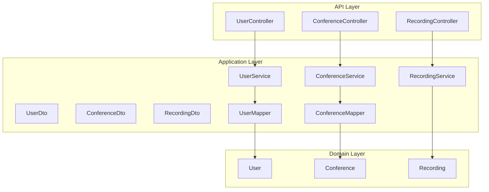
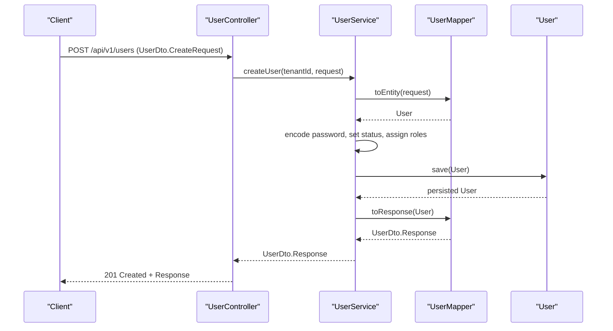
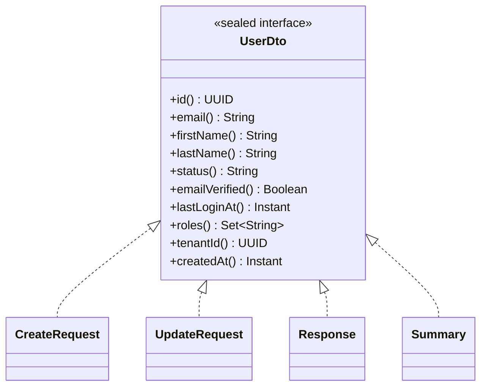
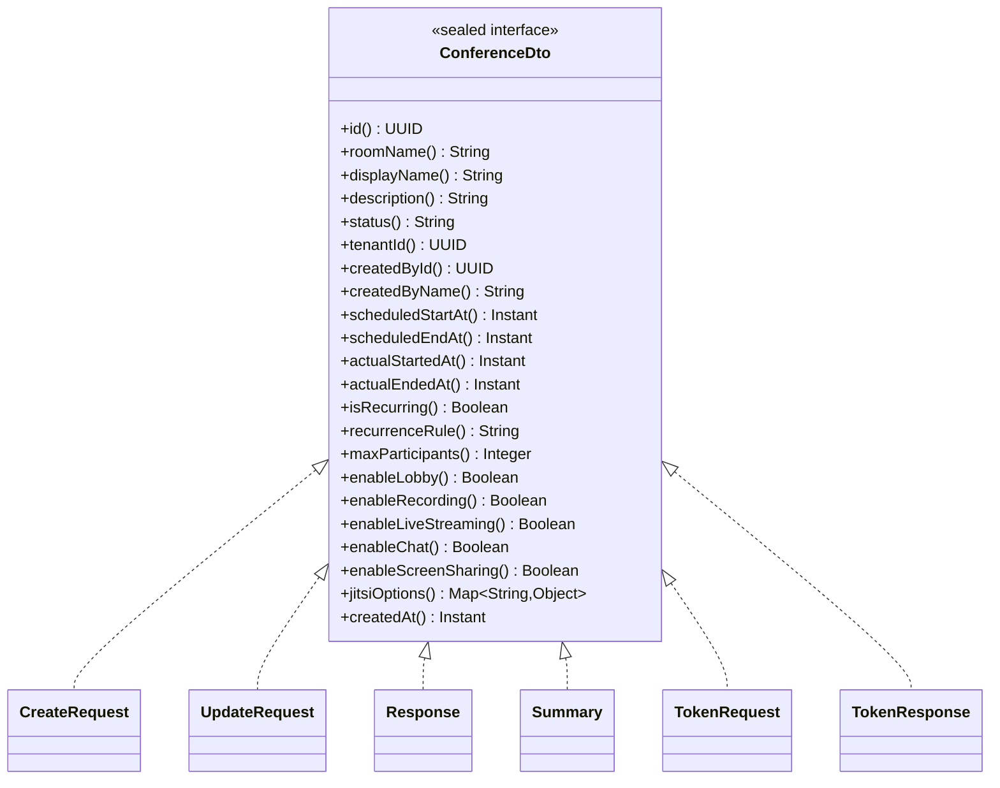
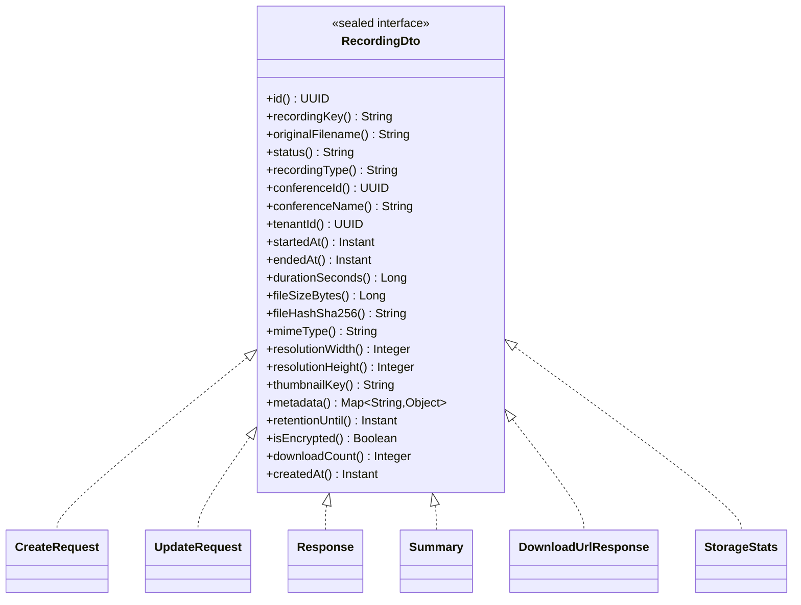
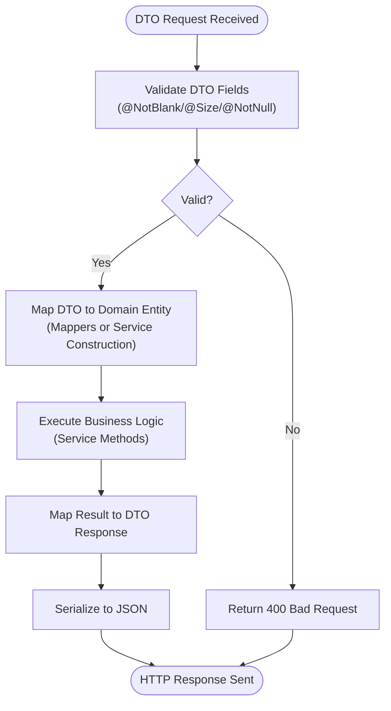
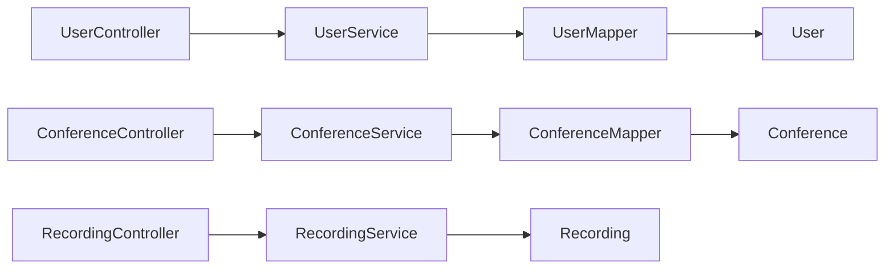

# DTO Patterns and Data Transfer

<cite>
**Referenced Files in This Document**
- [UserDto.java](file://jmp-application/src/main/java/com/jmp/application/dto/UserDto.java)
- [ConferenceDto.java](file://jmp-application/src/main/java/com/jmp/application/dto/ConferenceDto.java)
- [RecordingDto.java](file://jmp-application/src/main/java/com/jmp/application/dto/RecordingDto.java)
- [UserMapper.java](file://jmp-application/src/main/java/com/jmp/application/mapper/UserMapper.java)
- [ConferenceMapper.java](file://jmp-application/src/main/java/com/jmp/application/mapper/ConferenceMapper.java)
- [User.java](file://jmp-domain/src/main/java/com/jmp/domain/entity/User.java)
- [Conference.java](file://jmp-domain/src/main/java/com/jmp/domain/entity/Conference.java)
- [Recording.java](file://jmp-domain/src/main/java/com/jmp/domain/entity/Recording.java)
- [UserService.java](file://jmp-application/src/main/java/com/jmp/application/service/UserService.java)
- [ConferenceService.java](file://jmp-application/src/main/java/com/jmp/application/service/ConferenceService.java)
- [RecordingService.java](file://jmp-application/src/main/java/com/jmp/application/service/RecordingService.java)
- [UserController.java](file://jmp-api/src/main/java/com/jmp/api/controller/UserController.java)
- [ConferenceController.java](file://jmp-api/src/main/java/com/jmp/api/controller/ConferenceController.java)
- [RecordingController.java](file://jmp-api/src/main/java/com/jmp/api/controller/RecordingController.java)
</cite>

## Table of Contents
1. [Introduction](#introduction)
2. [Project Structure](#project-structure)
3. [Core Components](#core-components)
4. [Architecture Overview](#architecture-overview)
5. [Detailed Component Analysis](#detailed-component-analysis)
6. [Dependency Analysis](#dependency-analysis)
7. [Performance Considerations](#performance-considerations)
8. [Troubleshooting Guide](#troubleshooting-guide)
9. [Conclusion](#conclusion)

## Introduction
This document explains the Data Transfer Object (DTO) patterns used across the application layer. It focuses on three primary DTO interfaces: UserDto for user-related data, ConferenceDto for conference information, and RecordingDto for recording metadata. The document covers design principles, validation annotations, serialization patterns, and the relationship between DTOs and domain entities. It also documents usage in API responses, service method parameters, and data transformation scenarios, along with versioning, backward compatibility, and performance considerations for large datasets.

## Project Structure
DTOs live in the application module under the dto package. They are accompanied by MapStruct mappers that convert between domain entities and DTOs. Controllers expose DTOs in API responses and accept them as request bodies. Services orchestrate business logic and perform conversions via mappers.

**Diagram sources**
- [UserController.java:33-123](file://jmp-api/src/main/java/com/jmp/api/controller/UserController.java#L33-L123)
- [ConferenceController.java:37-189](file://jmp-api/src/main/java/com/jmp/api/controller/ConferenceController.java#L37-L189)
- [RecordingController.java:35-138](file://jmp-api/src/main/java/com/jmp/api/controller/RecordingController.java#L35-L138)
- [UserDto.java:14-96](file://jmp-application/src/main/java/com/jmp/application/dto/UserDto.java#L14-L96)
- [ConferenceDto.java:15-176](file://jmp-application/src/main/java/com/jmp/application/dto/ConferenceDto.java#L15-L176)
- [RecordingDto.java:13-170](file://jmp-application/src/main/java/com/jmp/application/dto/RecordingDto.java#L13-L170)
- [UserMapper.java:18-76](file://jmp-application/src/main/java/com/jmp/application/mapper/UserMapper.java#L18-L76)
- [ConferenceMapper.java:15-75](file://jmp-application/src/main/java/com/jmp/application/mapper/ConferenceMapper.java#L15-L75)
- [UserService.java:28-190](file://jmp-application/src/main/java/com/jmp/application/service/UserService.java#L28-L190)
- [ConferenceService.java:25-225](file://jmp-application/src/main/java/com/jmp/application/service/ConferenceService.java#L25-L225)
- [RecordingService.java:27-332](file://jmp-application/src/main/java/com/jmp/application/service/RecordingService.java#L27-L332)
- [User.java:23-164](file://jmp-domain/src/main/java/com/jmp/domain/entity/User.java#L23-L164)
- [Conference.java:25-217](file://jmp-domain/src/main/java/com/jmp/domain/entity/Conference.java#L25-L217)
- [Recording.java:24-203](file://jmp-domain/src/main/java/com/jmp/domain/entity/Recording.java#L24-L203)

**Section sources**
- [UserDto.java:14-96](file://jmp-application/src/main/java/com/jmp/application/dto/UserDto.java#L14-L96)
- [ConferenceDto.java:15-176](file://jmp-application/src/main/java/com/jmp/application/dto/ConferenceDto.java#L15-L176)
- [RecordingDto.java:13-170](file://jmp-application/src/main/java/com/jmp/application/dto/RecordingDto.java#L13-L170)

## Core Components
- UserDto: Sealed interface with nested records for CreateRequest, UpdateRequest, Response, and Summary. Validation annotations define field constraints. Roles are represented as a set of strings in DTOs but mapped to entity roles via UserMapper.
- ConferenceDto: Sealed interface with nested records for CreateRequest, UpdateRequest, Response, Summary, TokenRequest, and TokenResponse. Includes scheduling, lobby, recording, and Jitsi options fields. Mapped to Conference entity via ConferenceMapper.
- RecordingDto: Sealed interface with nested records for CreateRequest, UpdateRequest, Response, Summary, DownloadUrlResponse, and StorageStats. Handles metadata, retention, encryption, and download counts. Mapped to Recording entity via service-level transformations.

Validation annotations:
- NotBlank, NotNull, Size, Email, and others constrain request payloads at the API boundary.

Serialization patterns:
- DTOs are serializable POJO-like structures suitable for JSON APIs. Records provide immutable, concise data carriers.

**Section sources**
- [UserDto.java:14-96](file://jmp-application/src/main/java/com/jmp/application/dto/UserDto.java#L14-L96)
- [ConferenceDto.java:15-176](file://jmp-application/src/main/java/com/jmp/application/dto/ConferenceDto.java#L15-L176)
- [RecordingDto.java:13-170](file://jmp-application/src/main/java/com/jmp/application/dto/RecordingDto.java#L13-L170)

## Architecture Overview
The application follows clean architecture with DTOs decoupling API controllers from domain entities. Controllers receive DTOs as request bodies and return DTOs as responses. Services encapsulate business logic and coordinate with repositories. Mappers transform between DTOs and entities.

**Diagram sources**
- [UserController.java:43-55](file://jmp-api/src/main/java/com/jmp/api/controller/UserController.java#L43-L55)
- [UserService.java:44-70](file://jmp-application/src/main/java/com/jmp/application/service/UserService.java#L44-L70)
- [UserMapper.java:24-46](file://jmp-application/src/main/java/com/jmp/application/mapper/UserMapper.java#L24-L46)
- [User.java:23-164](file://jmp-domain/src/main/java/com/jmp/domain/entity/User.java#L23-L164)

## Detailed Component Analysis

### UserDto Analysis
UserDto defines a sealed interface with four nested records:
- CreateRequest: Validates email, name lengths, and password strength; includes optional role names.
- UpdateRequest: Allows partial updates to name and roles.
- Response: Full user data for detailed views.
- Summary: Lightweight summary for list views.

Validation annotations:
- Email, NotBlank, Size, and others ensure input correctness.

Conversion strategy:
- UserMapper maps User entity to UserDto.Response and Summary, converting roles to strings and extracting tenant IDs. It ignores sensitive or derived fields during entity creation/update.

Usage examples:
- Controllers accept UserDto.CreateRequest and UserDto.UpdateRequest as request bodies.
- Services return UserDto.Response and Page<UserDto.Summary>.

**Diagram sources**
- [UserDto.java:14-96](file://jmp-application/src/main/java/com/jmp/application/dto/UserDto.java#L14-L96)

**Section sources**
- [UserDto.java:14-96](file://jmp-application/src/main/java/com/jmp/application/dto/UserDto.java#L14-L96)
- [UserMapper.java:18-76](file://jmp-application/src/main/java/com/jmp/application/mapper/UserMapper.java#L18-L76)
- [UserController.java:43-92](file://jmp-api/src/main/java/com/jmp/api/controller/UserController.java#L43-L92)
- [UserService.java:44-129](file://jmp-application/src/main/java/com/jmp/application/service/UserService.java#L44-L129)

### ConferenceDto Analysis
ConferenceDto defines nested records for conference operations:
- CreateRequest: Room name, display name, scheduling, recurring options, participant limits, and feature flags.
- UpdateRequest: Partial updates to scheduling and features.
- Response: Full conference data including computed current participants and creator details.
- Summary: List-friendly subset.
- TokenRequest/TokenResponse: JWT generation for Jitsi integration.

Conversion strategy:
- ConferenceMapper maps Conference entity to Response and Summary, extracting tenant and creator IDs and computing current participants via entity methods. It ignores internal fields during creation/update.

Usage examples:
- Controllers accept ConferenceDto.CreateRequest and UpdateRequest.
- Services return Response and Summary, and generate TokenResponse for JWT issuance.

**Diagram sources**
- [ConferenceDto.java:15-176](file://jmp-application/src/main/java/com/jmp/application/dto/ConferenceDto.java#L15-L176)

**Section sources**
- [ConferenceDto.java:15-176](file://jmp-application/src/main/java/com/jmp/application/dto/ConferenceDto.java#L15-L176)
- [ConferenceMapper.java:15-75](file://jmp-application/src/main/java/com/jmp/application/mapper/ConferenceMapper.java#L15-L75)
- [ConferenceController.java:49-173](file://jmp-api/src/main/java/com/jmp/api/controller/ConferenceController.java#L49-L173)
- [ConferenceService.java:40-189](file://jmp-application/src/main/java/com/jmp/application/service/ConferenceService.java#L40-L189)

### RecordingDto Analysis
RecordingDto defines nested records for recording lifecycle:
- CreateRequest: Minimal metadata to register a recording entry.
- UpdateRequest: Metadata and retention updates.
- Response: Complete recording metadata including computed fields.
- Summary: List-friendly subset.
- DownloadUrlResponse: Presigned URL and expiry for downloads.
- StorageStats: Aggregated storage metrics.

Conversion strategy:
- RecordingService constructs Response and Summary from Recording entity, handling enums and computed fields.

Usage examples:
- Controllers accept CreateRequest and UpdateRequest.
- Services return Response, Summary, DownloadUrlResponse, and StorageStats.

**Diagram sources**
- [RecordingDto.java:13-170](file://jmp-application/src/main/java/com/jmp/application/dto/RecordingDto.java#L13-L170)

**Section sources**
- [RecordingDto.java:13-170](file://jmp-application/src/main/java/com/jmp/application/dto/RecordingDto.java#L13-L170)
- [RecordingService.java:42-330](file://jmp-application/src/main/java/com/jmp/application/service/RecordingService.java#L42-L330)
- [RecordingController.java:45-129](file://jmp-api/src/main/java/com/jmp/api/controller/RecordingController.java#L45-L129)

### DTO-to-Entity Relationship and Conversion Strategies
- User: UserMapper converts User entity to UserDto.Response/Summary, mapping roles to strings and tenant ID. Creation/Update requests map to User with ignored fields to prevent accidental overrides.
- Conference: ConferenceMapper maps Conference to Response/Summary, extracting tenant and creator identifiers and computing current participants. Requests map to Conference with ignored fields.
- Recording: RecordingService builds Response/Summary from Recording entity, handling enums and metadata.

**Diagram sources**
- [UserDto.java:30-44](file://jmp-application/src/main/java/com/jmp/application/dto/UserDto.java#L30-L44)
- [ConferenceDto.java:43-67](file://jmp-application/src/main/java/com/jmp/application/dto/ConferenceDto.java#L43-L67)
- [RecordingDto.java:41-65](file://jmp-application/src/main/java/com/jmp/application/dto/RecordingDto.java#L41-L65)
- [UserMapper.java:24-64](file://jmp-application/src/main/java/com/jmp/application/mapper/UserMapper.java#L24-L64)
- [ConferenceMapper.java:21-65](file://jmp-application/src/main/java/com/jmp/application/mapper/ConferenceMapper.java#L21-L65)
- [RecordingService.java:292-330](file://jmp-application/src/main/java/com/jmp/application/service/RecordingService.java#L292-L330)

**Section sources**
- [UserMapper.java:18-76](file://jmp-application/src/main/java/com/jmp/application/mapper/UserMapper.java#L18-L76)
- [ConferenceMapper.java:15-75](file://jmp-application/src/main/java/com/jmp/application/mapper/ConferenceMapper.java#L15-L75)
- [UserService.java:44-129](file://jmp-application/src/main/java/com/jmp/application/service/UserService.java#L44-L129)
- [ConferenceService.java:40-189](file://jmp-application/src/main/java/com/jmp/application/service/ConferenceService.java#L40-L189)
- [RecordingService.java:42-330](file://jmp-application/src/main/java/com/jmp/application/service/RecordingService.java#L42-L330)

### Examples of DTO Usage
- API Responses:
  - UserController returns UserDto.Response for GET /users/{id} and paginated UserDto.Summary for GET /users.
  - ConferenceController returns ConferenceDto.Response for GET /conferences/{id}, ConferenceDto.Summary for lists, and ConferenceDto.TokenResponse for JWT generation.
  - RecordingController returns RecordingDto.Response, RecordingDto.Summary, RecordingDto.DownloadUrlResponse, and RecordingDto.StorageStats.
- Service Method Parameters:
  - UserService.createUser accepts UserDto.CreateRequest.
  - ConferenceService.createConference accepts ConferenceDto.CreateRequest plus tenant and user IDs.
  - RecordingService.createRecording accepts RecordingDto.CreateRequest.
- Data Transformation Scenarios:
  - UserMapper transforms User to UserDto.Response/Summary.
  - ConferenceMapper transforms Conference to Response/Summary.
  - RecordingService constructs Response/Summary from Recording.

**Section sources**
- [UserController.java:43-107](file://jmp-api/src/main/java/com/jmp/api/controller/UserController.java#L43-L107)
- [ConferenceController.java:49-173](file://jmp-api/src/main/java/com/jmp/api/controller/ConferenceController.java#L49-L173)
- [RecordingController.java:45-129](file://jmp-api/src/main/java/com/jmp/api/controller/RecordingController.java#L45-L129)
- [UserService.java:44-129](file://jmp-application/src/main/java/com/jmp/application/service/UserService.java#L44-L129)
- [ConferenceService.java:40-189](file://jmp-application/src/main/java/com/jmp/application/service/ConferenceService.java#L40-L189)
- [RecordingService.java:42-330](file://jmp-application/src/main/java/com/jmp/application/service/RecordingService.java#L42-L330)

### DTO Versioning, Backward Compatibility, and Large Dataset Considerations
- Versioning:
  - DTOs are part of the application layer contract. Introduce new DTO versions by adding new records (e.g., v2 variants) while keeping existing ones to maintain backward compatibility. Update controllers/services to support both versions temporarily.
- Backward Compatibility:
  - Use Optional fields and defaults in DTOs. Ignore unknown fields on deserialization to avoid breaking changes.
  - Keep field names stable; prefer renaming via aliases if necessary.
- Large Datasets:
  - Prefer Summary DTOs for list endpoints to reduce payload size.
  - Use pagination (Pageable) to limit response sizes.
  - Avoid eager loading of large collections; compute derived fields (e.g., participant counts) efficiently in queries or mappers.

[No sources needed since this section provides general guidance]

## Dependency Analysis
- Controllers depend on services and DTOs.
- Services depend on repositories and mappers.
- Mappers depend on DTOs and entities.
- Entities are pure domain models with JPA annotations.

**Diagram sources**
- [UserController.java:33-123](file://jmp-api/src/main/java/com/jmp/api/controller/UserController.java#L33-L123)
- [ConferenceController.java:37-189](file://jmp-api/src/main/java/com/jmp/api/controller/ConferenceController.java#L37-L189)
- [RecordingController.java:35-138](file://jmp-api/src/main/java/com/jmp/api/controller/RecordingController.java#L35-L138)
- [UserService.java:28-190](file://jmp-application/src/main/java/com/jmp/application/service/UserService.java#L28-L190)
- [ConferenceService.java:25-225](file://jmp-application/src/main/java/com/jmp/application/service/ConferenceService.java#L25-L225)
- [RecordingService.java:27-332](file://jmp-application/src/main/java/com/jmp/application/service/RecordingService.java#L27-L332)
- [UserMapper.java:18-76](file://jmp-application/src/main/java/com/jmp/application/mapper/UserMapper.java#L18-L76)
- [ConferenceMapper.java:15-75](file://jmp-application/src/main/java/com/jmp/application/mapper/ConferenceMapper.java#L15-L75)
- [User.java:23-164](file://jmp-domain/src/main/java/com/jmp/domain/entity/User.java#L23-L164)
- [Conference.java:25-217](file://jmp-domain/src/main/java/com/jmp/domain/entity/Conference.java#L25-L217)
- [Recording.java:24-203](file://jmp-domain/src/main/java/com/jmp/domain/entity/Recording.java#L24-L203)

**Section sources**
- [UserMapper.java:18-76](file://jmp-application/src/main/java/com/jmp/application/mapper/UserMapper.java#L18-L76)
- [ConferenceMapper.java:15-75](file://jmp-application/src/main/java/com/jmp/application/mapper/ConferenceMapper.java#L15-L75)
- [UserService.java:28-190](file://jmp-application/src/main/java/com/jmp/application/service/UserService.java#L28-L190)
- [ConferenceService.java:25-225](file://jmp-application/src/main/java/com/jmp/application/service/ConferenceService.java#L25-L225)
- [RecordingService.java:27-332](file://jmp-application/src/main/java/com/jmp/application/service/RecordingService.java#L27-L332)

## Performance Considerations
- Prefer lightweight DTOs (Summary) for list endpoints to minimize bandwidth and parsing overhead.
- Use pagination to cap result sets.
- Avoid fetching unnecessary associations; rely on projections or computed fields in mappers/services.
- For large payloads (e.g., metadata maps), consider streaming or chunked responses if applicable.
- Cache frequently accessed small DTOs (e.g., user profiles) at the application level when appropriate.

[No sources needed since this section provides general guidance]

## Troubleshooting Guide
Common issues and resolutions:
- Validation failures on DTO fields:
  - Ensure @NotBlank, @Size, and @Email constraints match request payloads.
  - Review DTO constructors and annotations for correctness.
- Mapping errors:
  - Verify that mappers ignore non-matching fields and handle nulls appropriately.
  - Confirm enum conversions (e.g., status, type) align between DTOs and entities.
- Unexpected nulls or missing fields:
  - Check mapper configurations and explicit ignores for derived or sensitive fields.
- JWT token generation:
  - Confirm TokenRequest fields and service logic for generating tokens and room URLs.

**Section sources**
- [UserDto.java:30-44](file://jmp-application/src/main/java/com/jmp/application/dto/UserDto.java#L30-L44)
- [ConferenceDto.java:160-174](file://jmp-application/src/main/java/com/jmp/application/dto/ConferenceDto.java#L160-L174)
- [RecordingDto.java:156-159](file://jmp-application/src/main/java/com/jmp/application/dto/RecordingDto.java#L156-L159)
- [UserMapper.java:24-64](file://jmp-application/src/main/java/com/jmp/application/mapper/UserMapper.java#L24-L64)
- [ConferenceMapper.java:21-65](file://jmp-application/src/main/java/com/jmp/application/mapper/ConferenceMapper.java#L21-L65)
- [ConferenceController.java:140-173](file://jmp-api/src/main/java/com/jmp/api/controller/ConferenceController.java#L140-L173)

## Conclusion
The DTO patterns in this application emphasize clarity, validation, and separation of concerns. UserDto, ConferenceDto, and RecordingDto provide structured contracts for data exchange, with mappers ensuring safe and controlled transformations between DTOs and domain entities. By leveraging Summary DTOs, pagination, and careful validation, the system remains performant and maintainable while supporting future evolution through versioned DTOs and backward-compatible changes.