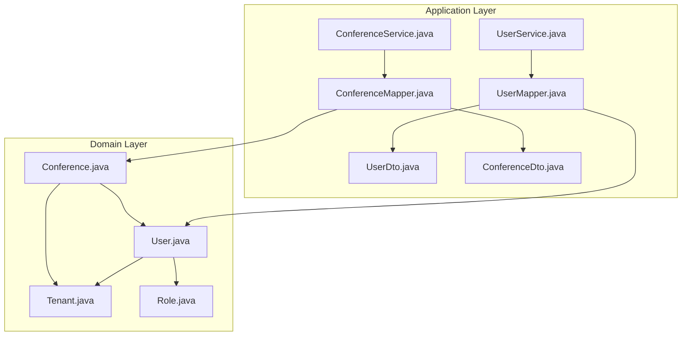
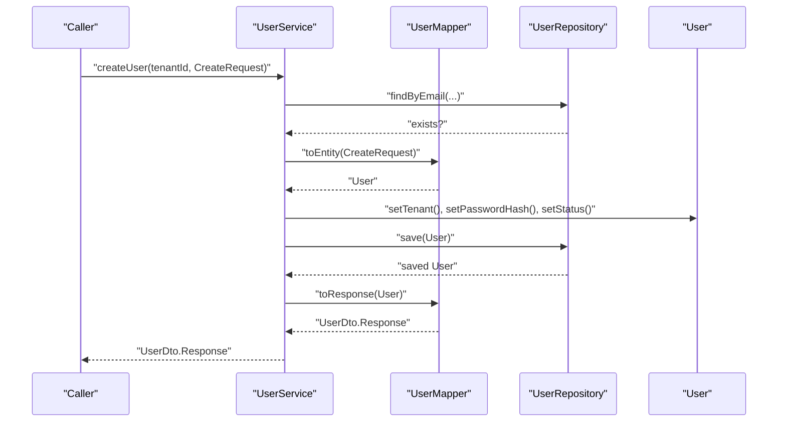
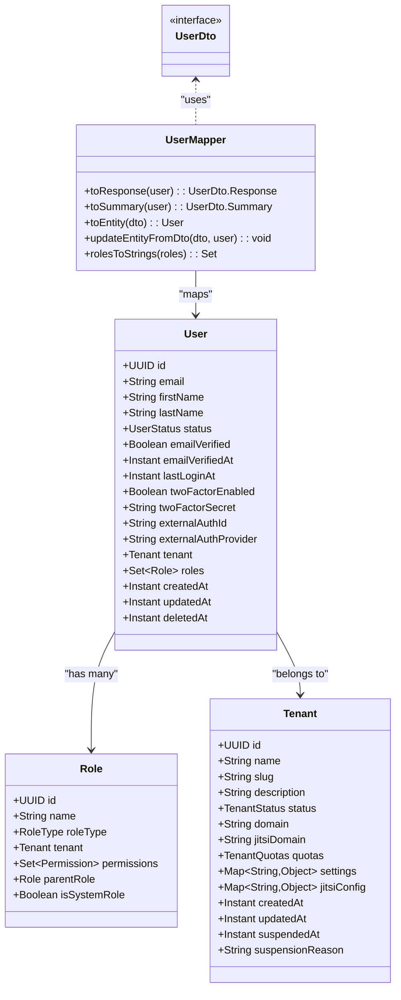
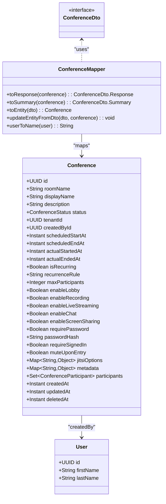
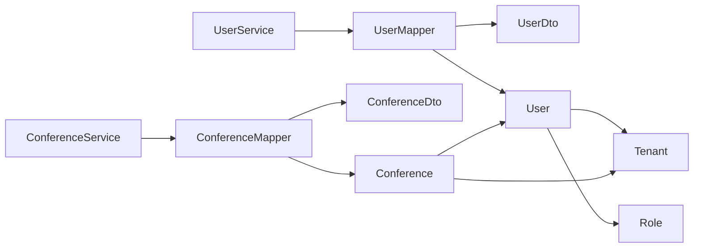

# Object Mapping and Conversion

<cite>
**Referenced Files in This Document**
- [UserMapper.java](file://jmp-application/src/main/java/com/jmp/application/mapper/UserMapper.java)
- [ConferenceMapper.java](file://jmp-application/src/main/java/com/jmp/application/mapper/ConferenceMapper.java)
- [UserDto.java](file://jmp-application/src/main/java/com/jmp/application/dto/UserDto.java)
- [ConferenceDto.java](file://jmp-application/src/main/java/com/jmp/application/dto/ConferenceDto.java)
- [User.java](file://jmp-domain/src/main/java/com/jmp/domain/entity/User.java)
- [Conference.java](file://jmp-domain/src/main/java/com/jmp/domain/entity/Conference.java)
- [Tenant.java](file://jmp-domain/src/main/java/com/jmp/domain/entity/Tenant.java)
- [Role.java](file://jmp-domain/src/main/java/com/jmp/domain/entity/Role.java)
- [UserService.java](file://jmp-application/src/main/java/com/jmp/application/service/UserService.java)
- [ConferenceService.java](file://jmp-application/src/main/java/com/jmp/application/service/ConferenceService.java)
</cite>

## Table of Contents
1. [Introduction](#introduction)
2. [Project Structure](#project-structure)
3. [Core Components](#core-components)
4. [Architecture Overview](#architecture-overview)
5. [Detailed Component Analysis](#detailed-component-analysis)
6. [Dependency Analysis](#dependency-analysis)
7. [Performance Considerations](#performance-considerations)
8. [Troubleshooting Guide](#troubleshooting-guide)
9. [Conclusion](#conclusion)

## Introduction
This document explains the object mapping implementation using MapStruct in the application layer. It focuses on the UserMapper interface for converting between User domain entities and UserDto objects, and ConferenceMapper for transforming Conference entities to ConferenceDto and vice versa. It covers MapStruct annotation usage, custom mapping methods, property mapping configurations, bidirectional mapping strategies, null safety handling, performance optimizations, complex mapping scenarios (collections, nested objects, computed properties), mapping validation, error handling, and testing strategies for mapper implementations.

## Project Structure
The mapping logic resides in the application module under the mapper package, with DTOs defined alongside the mappers and domain entities in the domain module. Services orchestrate mapping during create/update/list operations.

**Diagram sources**
- [UserMapper.java](file://jmp-application/src/main/java/com/jmp/application/mapper/UserMapper.java)
- [ConferenceMapper.java](file://jmp-application/src/main/java/com/jmp/application/mapper/ConferenceMapper.java)
- [UserDto.java](file://jmp-application/src/main/java/com/jmp/application/dto/UserDto.java)
- [ConferenceDto.java](file://jmp-application/src/main/java/com/jmp/application/dto/ConferenceDto.java)
- [User.java](file://jmp-domain/src/main/java/com/jmp/domain/entity/User.java)
- [Conference.java](file://jmp-domain/src/main/java/com/jmp/domain/entity/Conference.java)
- [Tenant.java](file://jmp-domain/src/main/java/com/jmp/domain/entity/Tenant.java)
- [Role.java](file://jmp-domain/src/main/java/com/jmp/domain/entity/Role.java)
- [UserService.java](file://jmp-application/src/main/java/com/jmp/application/service/UserService.java)
- [ConferenceService.java](file://jmp-application/src/main/java/com/jmp/application/service/ConferenceService.java)

**Section sources**
- [UserMapper.java](file://jmp-application/src/main/java/com/jmp/application/mapper/UserMapper.java)
- [ConferenceMapper.java](file://jmp-application/src/main/java/com/jmp/application/mapper/ConferenceMapper.java)
- [UserDto.java](file://jmp-application/src/main/java/com/jmp/application/dto/UserDto.java)
- [ConferenceDto.java](file://jmp-application/src/main/java/com/jmp/application/dto/ConferenceDto.java)
- [User.java](file://jmp-domain/src/main/java/com/jmp/domain/entity/User.java)
- [Conference.java](file://jmp-domain/src/main/java/com/jmp/domain/entity/Conference.java)
- [Tenant.java](file://jmp-domain/src/main/java/com/jmp/domain/entity/Tenant.java)
- [Role.java](file://jmp-domain/src/main/java/com/jmp/domain/entity/Role.java)
- [UserService.java](file://jmp-application/src/main/java/com/jmp/application/service/UserService.java)
- [ConferenceService.java](file://jmp-application/src/main/java/com/jmp/application/service/ConferenceService.java)

## Core Components
- UserMapper: Defines mappings between User and UserDto variants, including custom methods for role name conversion and computed properties via expression mapping.
- ConferenceMapper: Defines mappings between Conference and ConferenceDto variants, including computed participant counts and nested user-to-name mapping.
- DTOs: Sealed interfaces with records define request/response/summary DTOs for both User and Conference.
- Domain Entities: Rich entities with relationships and computed helpers used by mappers.

Key mapping characteristics:
- Component model configured for Spring-managed beans.
- Null handling strategy set to ignore null properties during mapping.
- Explicitly ignored target properties to prevent accidental writebacks of internal fields.
- Computed properties mapped via expressions and custom named methods.

**Section sources**
- [UserMapper.java](file://jmp-application/src/main/java/com/jmp/application/mapper/UserMapper.java)
- [ConferenceMapper.java](file://jmp-application/src/main/java/com/jmp/application/mapper/ConferenceMapper.java)
- [UserDto.java](file://jmp-application/src/main/java/com/jmp/application/dto/UserDto.java)
- [ConferenceDto.java](file://jmp-application/src/main/java/com/jmp/application/dto/ConferenceDto.java)
- [User.java](file://jmp-domain/src/main/java/com/jmp/domain/entity/User.java)
- [Conference.java](file://jmp-domain/src/main/java/com/jmp/domain/entity/Conference.java)

## Architecture Overview
MapStruct mappers are invoked by application services to convert between domain entities and DTOs. Services handle validation, repository interactions, and transaction boundaries, while mappers focus on property mapping, transformations, and computed values.

**Diagram sources**
- [UserService.java](file://jmp-application/src/main/java/com/jmp/application/service/UserService.java)
- [UserMapper.java](file://jmp-application/src/main/java/com/jmp/application/mapper/UserMapper.java)
- [User.java](file://jmp-domain/src/main/java/com/jmp/domain/entity/User.java)

**Section sources**
- [UserService.java](file://jmp-application/src/main/java/com/jmp/application/service/UserService.java)
- [UserMapper.java](file://jmp-application/src/main/java/com/jmp/application/mapper/UserMapper.java)
- [ConferenceService.java](file://jmp-application/src/main/java/com/jmp/application/service/ConferenceService.java)
- [ConferenceMapper.java](file://jmp-application/src/main/java/com/jmp/application/mapper/ConferenceMapper.java)

## Detailed Component Analysis

### UserMapper Analysis
UserMapper converts between User entities and UserDto variants, handling:
- Response mapping: flattens tenant relationship and role collection into scalar fields.
- Summary mapping: minimal projection for list views.
- CreateRequest mapping: ignores server-controlled fields and maps password separately.
- UpdateRequest mapping: ignores immutable/derived fields and updates only provided attributes.

Custom mapping methods:
- rolesToStrings: Converts Set<Role> to Set<String> using role names.
- Null safety: Returns empty set when roles are null.

**Diagram sources**
- [UserMapper.java](file://jmp-application/src/main/java/com/jmp/application/mapper/UserMapper.java)
- [User.java](file://jmp-domain/src/main/java/com/jmp/domain/entity/User.java)
- [Role.java](file://jmp-domain/src/main/java/com/jmp/domain/entity/Role.java)
- [Tenant.java](file://jmp-domain/src/main/java/com/jmp/domain/entity/Tenant.java)
- [UserDto.java](file://jmp-application/src/main/java/com/jmp/application/dto/UserDto.java)

**Section sources**
- [UserMapper.java](file://jmp-application/src/main/java/com/jmp/application/mapper/UserMapper.java)
- [User.java](file://jmp-domain/src/main/java/com/jmp/domain/entity/User.java)
- [Role.java](file://jmp-domain/src/main/java/com/jmp/domain/entity/Role.java)
- [Tenant.java](file://jmp-domain/src/main/java/com/jmp/domain/entity/Tenant.java)
- [UserDto.java](file://jmp-application/src/main/java/com/jmp/application/dto/UserDto.java)

### ConferenceMapper Analysis
ConferenceMapper converts between Conference entities and ConferenceDto variants, handling:
- Response mapping: flattens tenant and createdBy relationships, computes current participants.
- Summary mapping: minimal projection for list views.
- CreateRequest mapping: ignores server-controlled fields and sets defaults.
- UpdateRequest mapping: ignores immutable/derived fields and updates only provided attributes.

Custom mapping methods:
- userToName: Builds a full name from a User entity.
- Computed property: currentParticipants derived from participant stream.

**Diagram sources**
- [ConferenceMapper.java](file://jmp-application/src/main/java/com/jmp/application/mapper/ConferenceMapper.java)
- [Conference.java](file://jmp-domain/src/main/java/com/jmp/domain/entity/Conference.java)
- [User.java](file://jmp-domain/src/main/java/com/jmp/domain/entity/User.java)
- [ConferenceDto.java](file://jmp-application/src/main/java/com/jmp/application/dto/ConferenceDto.java)

**Section sources**
- [ConferenceMapper.java](file://jmp-application/src/main/java/com/jmp/application/mapper/ConferenceMapper.java)
- [Conference.java](file://jmp-domain/src/main/java/com/jmp/domain/entity/Conference.java)
- [User.java](file://jmp-domain/src/main/java/com/jmp/domain/entity/User.java)
- [ConferenceDto.java](file://jmp-application/src/main/java/com/jmp/application/dto/ConferenceDto.java)

### Mapping Strategies and Property Configurations
- Bidirectional mapping:
  - Entity to DTO: handled by dedicated methods per DTO variant.
  - DTO to Entity: separate methods for create and update, with explicit ignores for immutable fields.
- Null safety:
  - NullValuePropertyMappingStrategy.IGNORE prevents nulls from overwriting existing values.
  - Custom method rolesToStrings returns an empty set when input is null.
- Computed properties:
  - UserDto.Response includes roles as Set<String>.
  - ConferenceDto.Response includes currentParticipants computed from participant count.
  - ConferenceDto.Response includes createdByName derived from createdBy user.
- Nested object mapping:
  - tenant.id flattened to tenantId in DTOs.
  - createdBy mapped to createdById and createdByName.

**Section sources**
- [UserMapper.java](file://jmp-application/src/main/java/com/jmp/application/mapper/UserMapper.java)
- [ConferenceMapper.java](file://jmp-application/src/main/java/com/jmp/application/mapper/ConferenceMapper.java)

### Complex Mapping Scenarios
- Collections:
  - Role names extracted from Set<Role> via rolesToStrings.
- Nested objects:
  - Tenant and User relationships flattened to scalar identifiers/names.
- Computed properties:
  - Current participant count computed from participant collection.
  - Full name constructed from first and last name.

**Section sources**
- [UserMapper.java](file://jmp-application/src/main/java/com/jmp/application/mapper/UserMapper.java)
- [ConferenceMapper.java](file://jmp-application/src/main/java/com/jmp/application/mapper/ConferenceMapper.java)
- [Conference.java](file://jmp-domain/src/main/java/com/jmp/domain/entity/Conference.java)

### Validation and Error Handling
- Validation:
  - DTOs use Jakarta Bean Validation annotations for input constraints.
  - Services validate uniqueness and existence before mapping and persisting.
- Error handling:
  - Services throw IllegalArgumentException for invalid inputs (e.g., missing tenant/user, duplicate email/room name).
  - ConferenceService enforces state transitions for start/end operations.

**Section sources**
- [UserDto.java](file://jmp-application/src/main/java/com/jmp/application/dto/UserDto.java)
- [ConferenceDto.java](file://jmp-application/src/main/java/com/jmp/application/dto/ConferenceDto.java)
- [UserService.java](file://jmp-application/src/main/java/com/jmp/application/service/UserService.java)
- [ConferenceService.java](file://jmp-application/src/main/java/com/jmp/application/service/ConferenceService.java)

### Testing Strategies
Recommended testing approaches for mappers:
- Unit tests for mapper methods verifying:
  - Correct property mapping between entities and DTOs.
  - Computed properties (e.g., currentParticipants, rolesToStrings).
  - Null safety behavior (ignoring nulls, returning empty sets).
- Integration tests validating:
  - Service-layer mapping flows (create/update/list).
  - DTO validation and error propagation.
- Property coverage:
  - Test ignored fields remain untouched.
  - Test nested relationships flattened correctly.
  - Test expression-based computed properties.

[No sources needed since this section provides general guidance]

## Dependency Analysis
Mappers depend on DTOs and domain entities. Services depend on repositories and mappers. There are no circular dependencies between application and domain layers for mapping concerns.

**Diagram sources**
- [UserService.java](file://jmp-application/src/main/java/com/jmp/application/service/UserService.java)
- [ConferenceService.java](file://jmp-application/src/main/java/com/jmp/application/service/ConferenceService.java)
- [UserMapper.java](file://jmp-application/src/main/java/com/jmp/application/mapper/UserMapper.java)
- [ConferenceMapper.java](file://jmp-application/src/main/java/com/jmp/application/mapper/ConferenceMapper.java)
- [UserDto.java](file://jmp-application/src/main/java/com/jmp/application/dto/UserDto.java)
- [ConferenceDto.java](file://jmp-application/src/main/java/com/jmp/application/dto/ConferenceDto.java)
- [User.java](file://jmp-domain/src/main/java/com/jmp/domain/entity/User.java)
- [Conference.java](file://jmp-domain/src/main/java/com/jmp/domain/entity/Conference.java)
- [Tenant.java](file://jmp-domain/src/main/java/com/jmp/domain/entity/Tenant.java)
- [Role.java](file://jmp-domain/src/main/java/com/jmp/domain/entity/Role.java)

**Section sources**
- [UserService.java](file://jmp-application/src/main/java/com/jmp/application/service/UserService.java)
- [ConferenceService.java](file://jmp-application/src/main/java/com/jmp/application/service/ConferenceService.java)
- [UserMapper.java](file://jmp-application/src/main/java/com/jmp/application/mapper/UserMapper.java)
- [ConferenceMapper.java](file://jmp-application/src/main/java/com/jmp/application/mapper/ConferenceMapper.java)

## Performance Considerations
- MapStruct generates bytecode at compile-time, minimizing runtime overhead.
- Ignoring non-matching fields reduces unnecessary writes and improves throughput.
- Computed properties via expressions avoid loading extra entities when not needed.
- Prefer summary DTOs for list endpoints to reduce payload size.
- Avoid mapping large nested structures unless required; flatten where possible.

[No sources needed since this section provides general guidance]

## Troubleshooting Guide
Common issues and resolutions:
- Unexpected nulls in target fields:
  - Verify NullValuePropertyMappingStrategy.IGNORE is set and that ignored targets are intentional.
- Mismatched property names:
  - Use @Mapping(target = "...", source = "...") to align DTO and entity fields.
- Computed property not appearing:
  - Ensure expression mapping is present in the mapper method and that the underlying computation is available on the entity.
- Role names missing:
  - Confirm rolesToStrings is invoked via qualifiedByName and handles null input gracefully.
- Nested relationships not flattened:
  - Map tenant.id to tenantId and createdBy to createdById/createdByName explicitly.

**Section sources**
- [UserMapper.java](file://jmp-application/src/main/java/com/jmp/application/mapper/UserMapper.java)
- [ConferenceMapper.java](file://jmp-application/src/main/java/com/jmp/application/mapper/ConferenceMapper.java)

## Conclusion
The MapStruct-based mapping layer cleanly separates presentation concerns from domain logic. UserMapper and ConferenceMapper provide robust, null-safe conversions with custom methods for complex mappings, computed properties, and flattened relationships. Services orchestrate validation and persistence, ensuring reliable and maintainable object mapping across the application.