# Service Implementations

<cite>
**Referenced Files in This Document**
- [UserService.java](file://jmp-application/src/main/java/com/jmp/application/service/UserService.java)
- [ConferenceService.java](file://jmp-application/src/main/java/com/jmp/application/service/ConferenceService.java)
- [RecordingService.java](file://jmp-application/src/main/java/com/jmp/application/service/RecordingService.java)
- [AnalyticsService.java](file://jmp-application/src/main/java/com/jmp/application/service/AnalyticsService.java)
- [AuditService.java](file://jmp-application/src/main/java/com/jmp/application/service/AuditService.java)
- [JwtService.java](file://jmp-application/src/main/java/com/jmp/application/service/JwtService.java)
- [SsoService.java](file://jmp-application/src/main/java/com/jmp/application/service/SsoService.java)
- [StorageService.java](file://jmp-application/src/main/java/com/jmp/application/service/StorageService.java)
- [S3StorageService.java](file://jmp-infrastructure/src/main/java/com/jmp/infrastructure/storage/S3StorageService.java)
- [UserDto.java](file://jmp-application/src/main/java/com/jmp/application/dto/UserDto.java)
- [ConferenceDto.java](file://jmp-application/src/main/java/com/jmp/application/dto/ConferenceDto.java)
- [RecordingDto.java](file://jmp-application/src/main/java/com/jmp/application/dto/RecordingDto.java)
</cite>

## Table of Contents
1. [Introduction](#introduction)
2. [Project Structure](#project-structure)
3. [Core Components](#core-components)
4. [Architecture Overview](#architecture-overview)
5. [Detailed Component Analysis](#detailed-component-analysis)
6. [Dependency Analysis](#dependency-analysis)
7. [Performance Considerations](#performance-considerations)
8. [Troubleshooting Guide](#troubleshooting-guide)
9. [Conclusion](#conclusion)
10. [Appendices](#appendices)

## Introduction
This document provides a comprehensive analysis of the service layer implementations in the Jitsi Management Platform. It focuses on the business logic encapsulation, transaction boundaries, error handling strategies, method signatures, parameter validation, and return types for the following services:
- UserService for user management operations
- ConferenceService for conference lifecycle management
- RecordingService for recording operations
- AnalyticsService for metrics calculation
- AuditService for compliance logging
- JwtService for authentication tokens
- SsoService for single sign-on integration
- StorageService for file management

It also documents complex business operations such as conference scheduling workflows, recording status updates, and audit trail generation, along with testing approaches and integration patterns with domain entities.

## Project Structure
The service layer resides in the application module under the package com.jmp.application.service. DTOs are defined alongside the services in com.jmp.application.dto. Infrastructure-specific implementations (e.g., S3 storage) live in jmp-infrastructure.

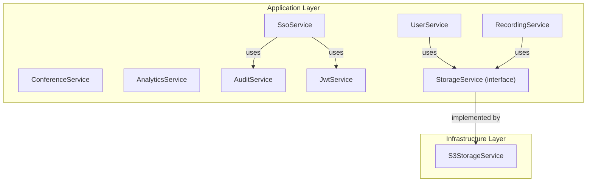

**Diagram sources**
- [UserService.java:1-190](file://jmp-application/src/main/java/com/jmp/application/service/UserService.java#L1-L190)
- [ConferenceService.java:1-225](file://jmp-application/src/main/java/com/jmp/application/service/ConferenceService.java#L1-L225)
- [RecordingService.java:1-332](file://jmp-application/src/main/java/com/jmp/application/service/RecordingService.java#L1-L332)
- [AnalyticsService.java:1-235](file://jmp-application/src/main/java/com/jmp/application/service/AnalyticsService.java#L1-L235)
- [AuditService.java:1-207](file://jmp-application/src/main/java/com/jmp/application/service/AuditService.java#L1-L207)
- [JwtService.java:1-236](file://jmp-application/src/main/java/com/jmp/application/service/JwtService.java#L1-L236)
- [SsoService.java:1-244](file://jmp-application/src/main/java/com/jmp/application/service/SsoService.java#L1-L244)
- [StorageService.java:1-56](file://jmp-application/src/main/java/com/jmp/application/service/StorageService.java#L1-L56)
- [S3StorageService.java:1-129](file://jmp-infrastructure/src/main/java/com/jmp/infrastructure/storage/S3StorageService.java#L1-L129)

**Section sources**
- [UserService.java:1-190](file://jmp-application/src/main/java/com/jmp/application/service/UserService.java#L1-L190)
- [ConferenceService.java:1-225](file://jmp-application/src/main/java/com/jmp/application/service/ConferenceService.java#L1-L225)
- [RecordingService.java:1-332](file://jmp-application/src/main/java/com/jmp/application/service/RecordingService.java#L1-L332)
- [AnalyticsService.java:1-235](file://jmp-application/src/main/java/com/jmp/application/service/AnalyticsService.java#L1-L235)
- [AuditService.java:1-207](file://jmp-application/src/main/java/com/jmp/application/service/AuditService.java#L1-L207)
- [JwtService.java:1-236](file://jmp-application/src/main/java/com/jmp/application/service/JwtService.java#L1-L236)
- [SsoService.java:1-244](file://jmp-application/src/main/java/com/jmp/application/service/SsoService.java#L1-L244)
- [StorageService.java:1-56](file://jmp-application/src/main/java/com/jmp/application/service/StorageService.java#L1-L56)
- [S3StorageService.java:1-129](file://jmp-infrastructure/src/main/java/com/jmp/infrastructure/storage/S3StorageService.java#L1-L129)

## Core Components
This section outlines the responsibilities, transaction boundaries, and error handling strategies for each service.

- UserService
  - Responsibilities: User creation, retrieval, listing/searching, updates, soft deletion, login tracking, permission checks.
  - Transaction Boundaries: Methods annotated with @Transactional for write operations; read-only methods use readOnly=true.
  - Error Handling: Throws IllegalArgumentException for invalid inputs/missing entities; throws IllegalStateException for missing default roles.
  - Validation: Uses DTO constraints and manual checks (e.g., email uniqueness).
  - Return Types: Returns UserDto.Response, UserDto.Summary, Page<UserDto.Summary>, boolean.

- ConferenceService
  - Responsibilities: Conference creation, retrieval, listing/searching, status transitions (start/end), soft deletion, scheduled auto-start/end processing.
  - Transaction Boundaries: Write operations are @Transactional; read operations are @Transactional(readOnly=true).
  - Error Handling: Validates status transitions and uniqueness; throws IllegalStateException for invalid state changes.
  - Return Types: Returns ConferenceDto.Response, ConferenceDto.Summary, List
, Page
.

- RecordingService
  - Responsibilities: Recording entry creation, readiness marking, retrieval, listing/searching, download URL generation, metadata updates, soft deletion, storage integration, retention/archival processing, webhook handling.
  - Transaction Boundaries: Write operations are @Transactional; read operations are @Transactional(readOnly=true).
  - Error Handling: Validates readiness and retention; integrates with StorageService for async operations.
  - Return Types: Returns RecordingDto.Response, RecordingDto.Summary, RecordingDto.DownloadUrlResponse, RecordingDto.StorageStats.

- AnalyticsService
  - Responsibilities: Dashboard metrics, usage reports, participant analytics, recording analytics, system health metrics.
  - Transaction Boundaries: All methods are @Transactional(readOnly=true).
  - Error Handling: Placeholder implementations; returns zeroed or empty structures.
  - Return Types: Records (DashboardMetrics, UsageReport, ParticipantAnalytics, RecordingAnalytics, SystemHealthMetrics).

- AuditService
  - Responsibilities: Asynchronous audit logging, event categorization (authentication, user management, conference, recording, security), search, and retrieval.
  - Transaction Boundaries: Async logging uses REQUIRES_NEW propagation; search/get methods are @Transactional(readOnly=true).
  - Error Handling: Catches exceptions during audit persistence and logs errors.
  - Return Types: Page<AuditLog>, List<AuditLog>.

- JwtService
  - Responsibilities: Access/refresh token generation for platform and Jitsi tokens, guest tokens, validation, extraction helpers.
  - Transaction Boundaries: Stateless service; no transactions.
  - Error Handling: Validates token types; handles parsing exceptions.
  - Return Types: String tokens, UUID extraction, boolean expired check, Instant expiration.

- SsoService
  - Responsibilities: OIDC authorization URL generation, callback handling, token exchange, user provisioning, JWT issuance, audit logging.
  - Transaction Boundaries: Callback handler is @Transactional; other methods are stateless.
  - Error Handling: Validates provider state, user info presence, and token exchange results.
  - Return Types: SsoAuthenticationResult, String authorization URL.

- StorageService
  - Responsibilities: Defines storage operations contract (presigned URLs, uploads/deletes, archival/restore, scheduling).
  - Implementation: S3StorageService provides AWS S3-compatible implementation with presigned URLs and lifecycle hooks.

**Section sources**
- [UserService.java:24-190](file://jmp-application/src/main/java/com/jmp/application/service/UserService.java#L24-L190)
- [ConferenceService.java:21-225](file://jmp-application/src/main/java/com/jmp/application/service/ConferenceService.java#L21-L225)
- [RecordingService.java:23-332](file://jmp-application/src/main/java/com/jmp/application/service/RecordingService.java#L23-L332)
- [AnalyticsService.java:21-235](file://jmp-application/src/main/java/com/jmp/application/service/AnalyticsService.java#L21-L235)
- [AuditService.java:18-207](file://jmp-application/src/main/java/com/jmp/application/service/AuditService.java#L18-L207)
- [JwtService.java:21-236](file://jmp-application/src/main/java/com/jmp/application/service/JwtService.java#L21-L236)
- [SsoService.java:28-244](file://jmp-application/src/main/java/com/jmp/application/service/SsoService.java#L28-L244)
- [StorageService.java:5-56](file://jmp-application/src/main/java/com/jmp/application/service/StorageService.java#L5-L56)
- [S3StorageService.java:20-129](file://jmp-infrastructure/src/main/java/com/jmp/infrastructure/storage/S3StorageService.java#L20-L129)

## Architecture Overview
The service layer orchestrates domain entities and repositories, applying business rules and returning DTOs. StorageService is an interface implemented by S3StorageService. AuditService writes logs asynchronously with REQUIRES_NEW propagation to ensure durability even if the calling transaction fails.

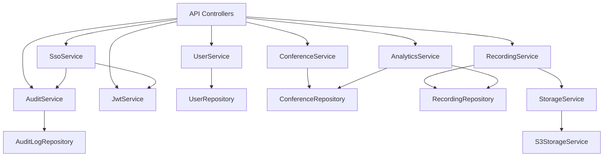

**Diagram sources**
- [UserService.java:34-38](file://jmp-application/src/main/java/com/jmp/application/service/UserService.java#L34-L38)
- [ConferenceService.java:31-34](file://jmp-application/src/main/java/com/jmp/application/service/ConferenceService.java#L31-L34)
- [RecordingService.java:33-36](file://jmp-application/src/main/java/com/jmp/application/service/RecordingService.java#L33-L36)
- [AnalyticsService.java:31-33](file://jmp-application/src/main/java/com/jmp/application/service/AnalyticsService.java#L31-L33)
- [AuditService.java:27](file://jmp-application/src/main/java/com/jmp/application/service/AuditService.java#L27)
- [JwtService.java:27-43](file://jmp-application/src/main/java/com/jmp/application/service/JwtService.java#L27-L43)
- [SsoService.java:37-42](file://jmp-application/src/main/java/com/jmp/application/service/SsoService.java#L37-L42)
- [StorageService.java:9-54](file://jmp-application/src/main/java/com/jmp/application/service/StorageService.java#L9-L54)
- [S3StorageService.java:26](file://jmp-infrastructure/src/main/java/com/jmp/infrastructure/storage/S3StorageService.java#L26)

## Detailed Component Analysis

### UserService Analysis
- Business Logic Encapsulation
  - Enforces tenant scoping and role assignment.
  - Encodes passwords and sets default statuses.
  - Supports soft deletion and login tracking.
- Transaction Boundaries
  - @Transactional(readOnly = true) for reads; @Transactional for mutations.
- Error Handling
  - Throws IllegalArgumentException for missing entities or duplicates.
  - Throws IllegalStateException for missing default roles.
- Method Signatures and Return Types
  - createUser(tenantId, request): returns UserDto.Response
  - getUser(id)/getUserByEmail(email): returns UserDto.Response
  - listUsers(tenantId, pageable): returns Page<UserDto.Summary>
  - searchUsers(tenantId, search, pageable): returns Page<UserDto.Summary>
  - updateUser(id, request): returns UserDto.Response
  - deleteUser(id): returns void
  - recordLogin(userId): returns void
  - hasPermission(userId, permission): returns boolean

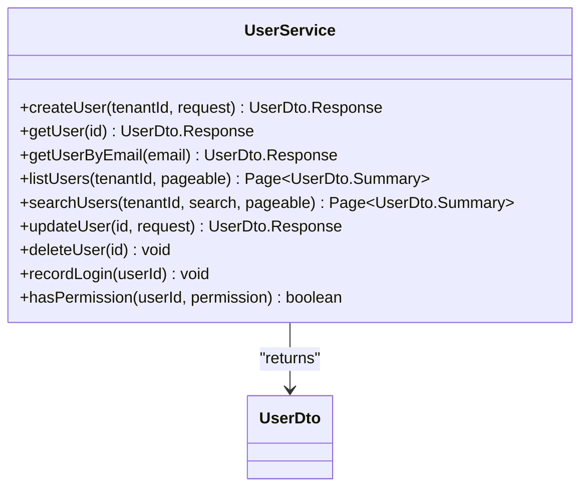

**Diagram sources**
- [UserService.java:44-168](file://jmp-application/src/main/java/com/jmp/application/service/UserService.java#L44-L168)
- [UserDto.java:14-96](file://jmp-application/src/main/java/com/jmp/application/dto/UserDto.java#L14-L96)

**Section sources**
- [UserService.java:24-190](file://jmp-application/src/main/java/com/jmp/application/service/UserService.java#L24-L190)
- [UserDto.java:14-96](file://jmp-application/src/main/java/com/jmp/application/dto/UserDto.java#L14-L96)

### ConferenceService Analysis
- Business Logic Encapsulation
  - Validates room name uniqueness per tenant.
  - Manages status transitions: SCHEDULED → ACTIVE → ENDED.
  - Provides scheduled auto-start/end processing via cron-triggered methods.
- Transaction Boundaries
  - @Transactional for all mutations; @Transactional(readOnly=true) for queries.
- Error Handling
  - Throws IllegalArgumentException for missing entities.
  - Throws IllegalStateException for invalid state transitions.
- Method Signatures and Return Types
  - createConference(tenantId, userId, request): returns ConferenceDto.Response
  - getConference(id): returns ConferenceDto.Response
  - listConferences(tenantId, pageable): returns Page<ConferenceDto.Summary>
  - searchConferences(tenantId, search, pageable): returns Page<ConferenceDto.Summary>
  - getActiveConferences(tenantId): returns List

  - getUpcomingConferences(tenantId): returns List

  - updateConference(id, request): returns ConferenceDto.Response
  - startConference(id): returns ConferenceDto.Response
  - endConference(id): returns ConferenceDto.Response
  - deleteConference(id): returns void
  - processScheduledStarts(): returns void
  - processScheduledEnds(): returns void

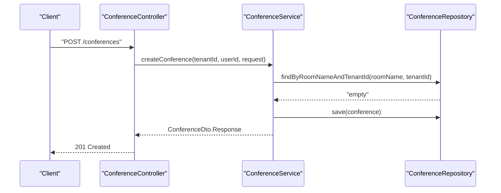

**Diagram sources**
- [ConferenceService.java:40-65](file://jmp-application/src/main/java/com/jmp/application/service/ConferenceService.java#L40-L65)
- [ConferenceDto.java:42-67](file://jmp-application/src/main/java/com/jmp/application/dto/ConferenceDto.java#L42-L67)

**Section sources**
- [ConferenceService.java:21-225](file://jmp-application/src/main/java/com/jmp/application/service/ConferenceService.java#L21-L225)
- [ConferenceDto.java:15-175](file://jmp-application/src/main/java/com/jmp/application/dto/ConferenceDto.java#L15-L175)

### RecordingService Analysis
- Business Logic Encapsulation
  - Creates recording entries with retention and encryption defaults.
  - Marks recordings ready, calculates duration, updates metadata.
  - Generates presigned download URLs and records downloads.
  - Handles soft deletion with async storage deletion scheduling.
  - Processes expired recordings and archives them.
  - Integrates with StorageService for all storage operations.
- Transaction Boundaries
  - @Transactional for all mutations; @Transactional(readOnly=true) for queries.
- Error Handling
  - Validates readiness and retention before generating download URLs.
  - Catches and logs failures during archival.
- Method Signatures and Return Types
  - createRecording(request): returns RecordingDto.Response
  - markRecordingReady(id, fileSize, hash, metadata): returns RecordingDto.Response
  - getRecording(id): returns RecordingDto.Response
  - listRecordings(tenantId, pageable): returns Page<RecordingDto.Summary>
  - searchRecordings(tenantId, search, pageable): returns Page<RecordingDto.Summary>
  - getConferenceRecordings(conferenceId): returns List<RecordingDto.Summary>
  - generateDownloadUrl(id, expiration): returns RecordingDto.DownloadUrlResponse
  - updateRecording(id, request): returns RecordingDto.Response
  - deleteRecording(id): returns void
  - getStorageStats(tenantId): returns RecordingDto.StorageStats
  - processExpiredRecordings(): returns void
  - handleJibriStatus(conferenceId, status, data): returns void

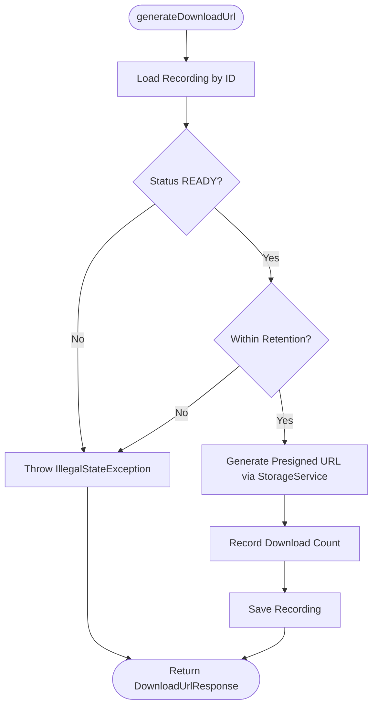

**Diagram sources**
- [RecordingService.java:141-170](file://jmp-application/src/main/java/com/jmp/application/service/RecordingService.java#L141-L170)
- [StorageService.java:14-15](file://jmp-application/src/main/java/com/jmp/application/service/StorageService.java#L14-L15)

**Section sources**
- [RecordingService.java:23-332](file://jmp-application/src/main/java/com/jmp/application/service/RecordingService.java#L23-L332)
- [RecordingDto.java:13-169](file://jmp-application/src/main/java/com/jmp/application/dto/RecordingDto.java#L13-L169)
- [StorageService.java:9-56](file://jmp-application/src/main/java/com/jmp/application/service/StorageService.java#L9-L56)

### AnalyticsService Analysis
- Business Logic Encapsulation
  - Aggregates dashboard metrics, usage reports, participant analytics, recording analytics, and system health metrics.
  - Uses repository counts and calculations for storage and recording statistics.
- Transaction Boundaries
  - @Transactional(readOnly=true) for all methods.
- Error Handling
  - Placeholder implementations return zeroed or empty structures.
- Method Signatures and Return Types
  - getDashboardMetrics(tenantId): returns DashboardMetrics
  - getUsageReport(tenantId, startDate, endDate): returns UsageReport
  - getParticipantAnalytics(tenantId, startDate, endDate): returns ParticipantAnalytics
  - getRecordingAnalytics(tenantId, startDate, endDate): returns RecordingAnalytics
  - getSystemHealthMetrics(): returns SystemHealthMetrics

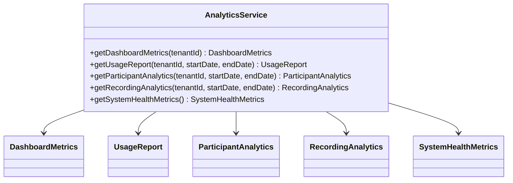

**Diagram sources**
- [AnalyticsService.java:38-145](file://jmp-application/src/main/java/com/jmp/application/service/AnalyticsService.java#L38-L145)
- [AnalyticsService.java:174-234](file://jmp-application/src/main/java/com/jmp/application/service/AnalyticsService.java#L174-L234)

**Section sources**
- [AnalyticsService.java:21-235](file://jmp-application/src/main/java/com/jmp/application/service/AnalyticsService.java#L21-L235)

### AuditService Analysis
- Business Logic Encapsulation
  - Asynchronously persists audit logs with REQUIRES_NEW propagation.
  - Provides convenience methods for authentication, user management, conference, recording, and security events.
  - Supports searching and retrieving audit logs and security events.
- Transaction Boundaries
  - Async logging uses @Async with REQUIRES_NEW; search/get methods are @Transactional(readOnly=true).
- Error Handling
  - Catches exceptions during audit persistence and logs errors.
- Method Signatures and Return Types
  - logEvent(eventType, action, entityType, entityId, user, tenantId, oldValues, newValues, ipAddress, userAgent, success, errorMessage): returns void
  - logAuthentication(action, user, tenantId, ipAddress, success, errorMessage): returns void
  - logUserManagement(action, targetUser, actor, tenantId, oldValues, newValues): returns void
  - logConference(action, conferenceId, tenantId, user, metadata): returns void
  - logRecording(action, recordingId, tenantId, user, success, errorMessage): returns void
  - logSecurity(action, details, ipAddress, success): returns void
  - searchAuditLogs(tenantId, eventType, userId, startDate, endDate, pageable): returns Page<AuditLog>
  - getEntityAuditLogs(entityType, entityId): returns List<AuditLog>
  - getSecurityEvents(since): returns List<AuditLog>

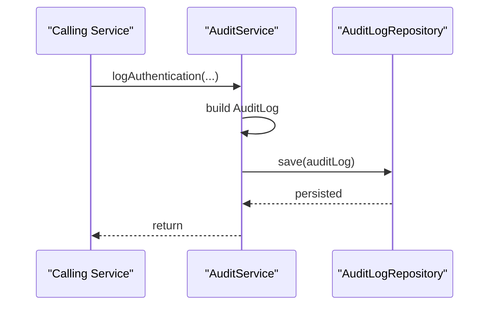

**Diagram sources**
- [AuditService.java:32-72](file://jmp-application/src/main/java/com/jmp/application/service/AuditService.java#L32-L72)
- [AuditService.java:181-205](file://jmp-application/src/main/java/com/jmp/application/service/AuditService.java#L181-L205)

**Section sources**
- [AuditService.java:18-207](file://jmp-application/src/main/java/com/jmp/application/service/AuditService.java#L18-L207)

### JwtService Analysis
- Business Logic Encapsulation
  - Generates access tokens (short-lived), refresh tokens (longer-lived), Jitsi conference tokens, and guest tokens.
  - Validates tokens and extracts claims (user ID, tenant ID, roles).
- Transaction Boundaries
  - Stateless service; no transactions.
- Error Handling
  - Validates token types and handles parsing exceptions.
- Method Signatures and Return Types
  - generateAccessToken(user): returns String
  - generateRefreshToken(user): returns String
  - generateJitsiToken(conference, user, isModerator): returns String
  - generateGuestToken(conference, displayName, isModerator): returns String
  - validateAccessToken(token): returns Claims
  - validateRefreshToken(token): returns Claims
  - extractUserId(token): returns UUID
  - extractTenantId(token): returns UUID
  - extractRoles(token): returns List<String>
  - isTokenExpired(token): returns boolean
  - getExpirationTime(token): returns Instant

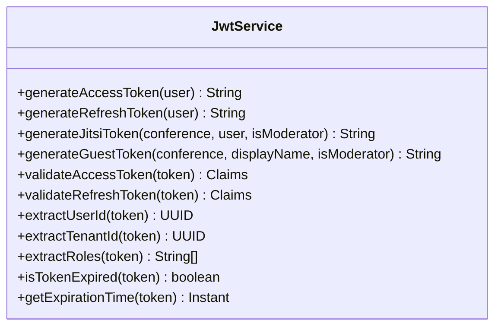

**Diagram sources**
- [JwtService.java:49-234](file://jmp-application/src/main/java/com/jmp/application/service/JwtService.java#L49-L234)

**Section sources**
- [JwtService.java:21-236](file://jmp-application/src/main/java/com/jmp/application/service/JwtService.java#L21-L236)

### SsoService Analysis
- Business Logic Encapsulation
  - Generates OIDC authorization URLs with state and nonce.
  - Handles callbacks: exchanges authorization code for tokens, retrieves user info, maps attributes, finds or provisions users, assigns roles, generates JWT tokens, and logs authentication.
- Transaction Boundaries
  - handleCallback is @Transactional; other methods are stateless.
- Error Handling
  - Validates provider state, user info presence, and token exchange results.
- Method Signatures and Return Types
  - generateAuthorizationUrl(identityProviderId, state, nonce): returns String
  - handleCallback(identityProviderId, code, state): returns SsoAuthenticationResult
  - SsoAuthenticationResult(user, accessToken, refreshToken)
  - OidcTokenResponse(accessToken, idToken, refreshToken, expiresIn)

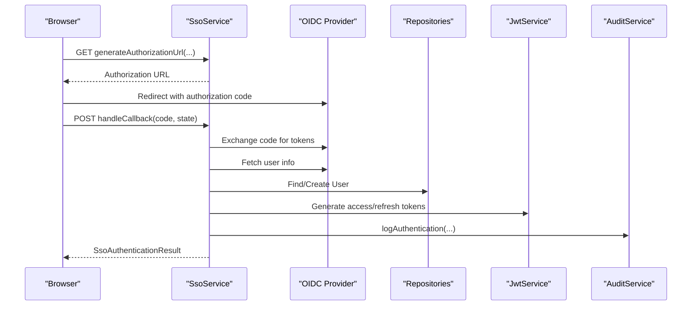

**Diagram sources**
- [SsoService.java:47-131](file://jmp-application/src/main/java/com/jmp/application/service/SsoService.java#L47-L131)
- [JwtService.java:49-87](file://jmp-application/src/main/java/com/jmp/application/service/JwtService.java#L49-L87)
- [AuditService.java:77-93](file://jmp-application/src/main/java/com/jmp/application/service/AuditService.java#L77-L93)

**Section sources**
- [SsoService.java:28-244](file://jmp-application/src/main/java/com/jmp/application/service/SsoService.java#L28-L244)

### StorageService Analysis
- Business Logic Encapsulation
  - Defines a unified interface for storage operations across providers.
  - S3StorageService implements presigned URL generation, upload/delete, archival/restore, and provider identification.
- Transaction Boundaries
  - Not applicable; infrastructure service.
- Error Handling
  - Delegates to underlying SDK; logs operations and placeholders for advanced lifecycle actions.
- Method Signatures and Return Types
  - generatePresignedUrl(key, expiration): returns String
  - generateUploadUrl(key, expiration): returns String
  - deleteRecording(key): returns void
  - scheduleDeletion(key): returns void
  - archiveRecording(key): returns void
  - restoreRecording(key): returns void
  - getProvider(): returns StorageProvider

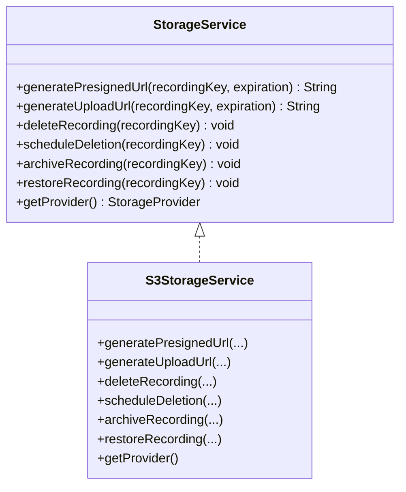

**Diagram sources**
- [StorageService.java:9-54](file://jmp-application/src/main/java/com/jmp/application/service/StorageService.java#L9-L54)
- [S3StorageService.java:61-127](file://jmp-infrastructure/src/main/java/com/jmp/infrastructure/storage/S3StorageService.java#L61-L127)

**Section sources**
- [StorageService.java:5-56](file://jmp-application/src/main/java/com/jmp/application/service/StorageService.java#L5-L56)
- [S3StorageService.java:20-129](file://jmp-infrastructure/src/main/java/com/jmp/infrastructure/storage/S3StorageService.java#L20-L129)

## Dependency Analysis
- Internal Dependencies
  - Services depend on repositories and mappers for domain entities.
  - RecordingService depends on StorageService for storage operations.
  - SsoService depends on JwtService and AuditService.
- External Dependencies
  - JwtService uses JWT library for signing/validating tokens.
  - SsoService uses RestTemplate for OIDC endpoints.
  - S3StorageService uses AWS SDK for S3 operations.

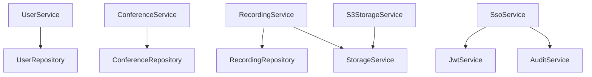

**Diagram sources**
- [UserService.java:34-38](file://jmp-application/src/main/java/com/jmp/application/service/UserService.java#L34-L38)
- [ConferenceService.java:31-34](file://jmp-application/src/main/java/com/jmp/application/service/ConferenceService.java#L31-L34)
- [RecordingService.java:33-36](file://jmp-application/src/main/java/com/jmp/application/service/RecordingService.java#L33-L36)
- [SsoService.java:37-42](file://jmp-application/src/main/java/com/jmp/application/service/SsoService.java#L37-L42)
- [StorageService.java:9-54](file://jmp-application/src/main/java/com/jmp/application/service/StorageService.java#L9-L54)
- [S3StorageService.java:26](file://jmp-infrastructure/src/main/java/com/jmp/infrastructure/storage/S3StorageService.java#L26)

**Section sources**
- [UserService.java:34-38](file://jmp-application/src/main/java/com/jmp/application/service/UserService.java#L34-L38)
- [ConferenceService.java:31-34](file://jmp-application/src/main/java/com/jmp/application/service/ConferenceService.java#L31-L34)
- [RecordingService.java:33-36](file://jmp-application/src/main/java/com/jmp/application/service/RecordingService.java#L33-L36)
- [SsoService.java:37-42](file://jmp-application/src/main/java/com/jmp/application/service/SsoService.java#L37-L42)
- [StorageService.java:9-54](file://jmp-application/src/main/java/com/jmp/application/service/StorageService.java#L9-L54)
- [S3StorageService.java:26](file://jmp-infrastructure/src/main/java/com/jmp/infrastructure/storage/S3StorageService.java#L26)

## Performance Considerations
- Transaction Boundaries
  - Use @Transactional(readOnly=true) for read-heavy operations to reduce lock contention.
  - Keep transaction scopes narrow; avoid heavy computation inside transactions.
- Asynchronous Logging
  - AuditService uses @Async with REQUIRES_NEW to prevent blocking and ensure audit durability.
- DTO Mapping
  - Mapper usage reduces object overhead and simplifies serialization.
- Indexing and Queries
  - Ensure database indexes exist for tenant-scoped lookups (e.g., findByTenantIdAndDeletedAtIsNull).
- Storage Operations
  - Presigned URLs offload bandwidth and latency from the application server.
  - ScheduleDeletion and archival help manage storage lifecycle efficiently.

[No sources needed since this section provides general guidance]

## Troubleshooting Guide
- Common Exceptions
  - IllegalArgumentException: Thrown when entities are not found or validations fail (e.g., email uniqueness, room name uniqueness, invalid status transitions).
  - IllegalStateException: Thrown for invalid state changes (e.g., updating ended/cancelled conference, missing default roles).
  - Audit Persistence Failures: Errors during audit logging are caught and logged; verify async executor configuration.
- Validation Tips
  - Ensure DTO constraints are met before invoking services.
  - Verify tenant scoping and role availability for user operations.
- Storage Issues
  - Confirm StorageService provider configuration and credentials.
  - Check retention periods and readiness before generating download URLs.
- JWT and SSO
  - Validate token secrets and expiration settings.
  - Ensure OIDC endpoints and attribute mappings are correct.

**Section sources**
- [UserService.java:48-51](file://jmp-application/src/main/java/com/jmp/application/service/UserService.java#L48-L51)
- [ConferenceService.java:120-124](file://jmp-application/src/main/java/com/jmp/application/service/ConferenceService.java#L120-L124)
- [RecordingService.java:146-152](file://jmp-application/src/main/java/com/jmp/application/service/RecordingService.java#L146-L152)
- [AuditService.java:69-71](file://jmp-application/src/main/java/com/jmp/application/service/AuditService.java#L69-L71)
- [S3StorageService.java:32-59](file://jmp-infrastructure/src/main/java/com/jmp/infrastructure/storage/S3StorageService.java#L32-L59)

## Conclusion
The service layer in the Jitsi Management Platform cleanly separates business logic from infrastructure concerns. Each service enforces domain rules, manages transactions appropriately, and integrates with repositories and DTOs. Storage operations are abstracted behind an interface, enabling pluggable providers. Audit logging is asynchronous and robust, ensuring compliance. The design supports scalability and maintainability while providing clear extension points for future enhancements.

[No sources needed since this section summarizes without analyzing specific files]

## Appendices
- Testing Approaches
  - Unit Tests: Mock repositories and mappers; assert service behavior for valid/invalid inputs and boundary conditions.
  - Integration Tests: Use @DataJpaTest for repositories; configure test containers for storage and OIDC endpoints.
  - Async Auditing: Use @TestExecutionListeners to verify audit persistence without relying on real async executors.
- Integration Patterns
  - Domain Entities: Services operate on domain entities and return DTOs; mappers handle conversion.
  - Event Hooks: RecordingService integrates with StorageService for lifecycle operations; SsoService integrates with JwtService and AuditService.

[No sources needed since this section provides general guidance]