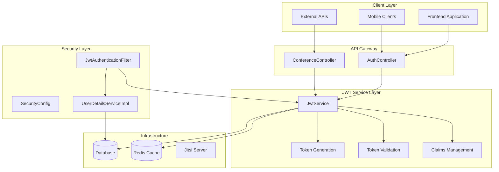
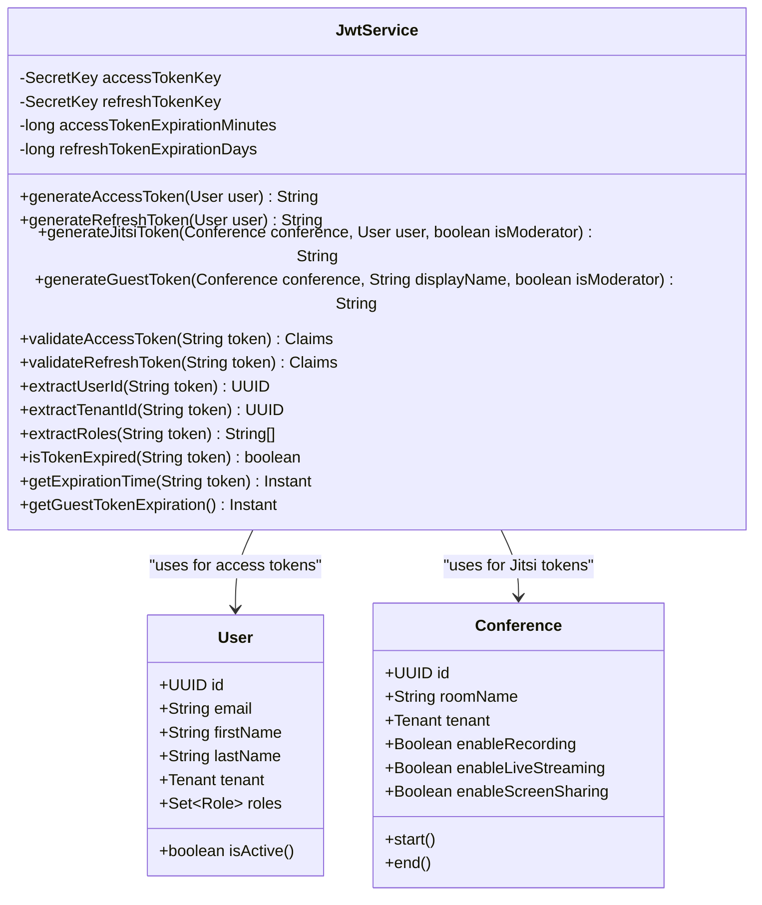
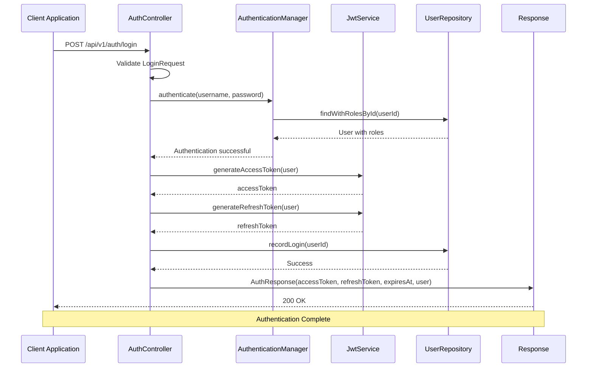
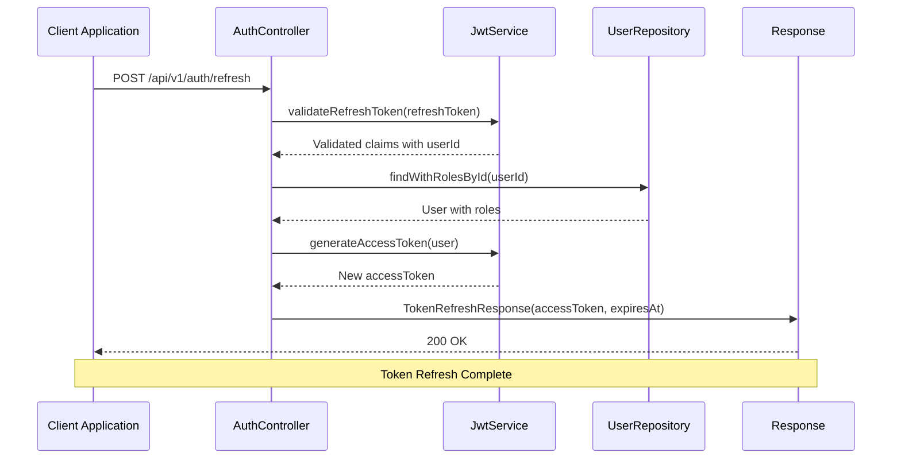
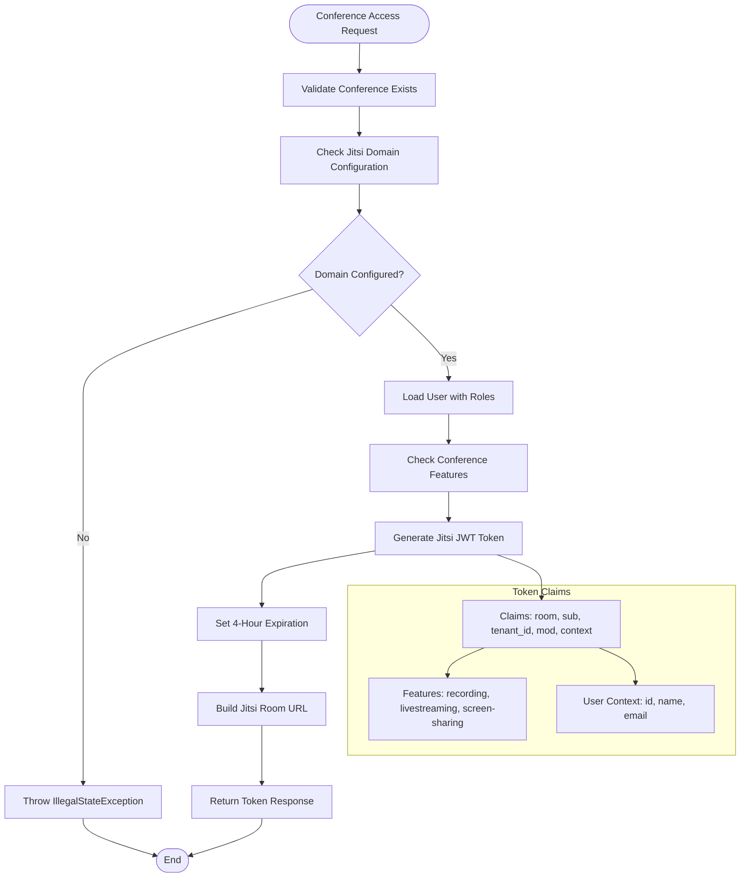
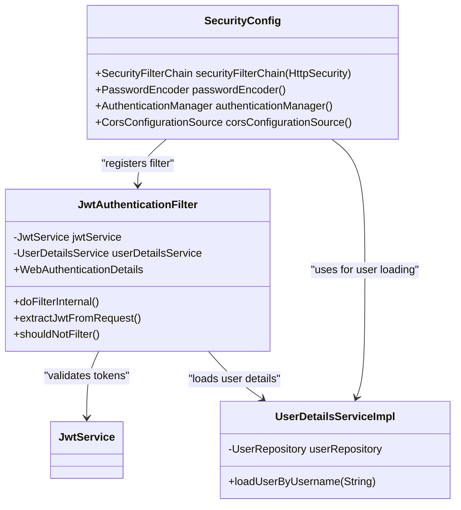
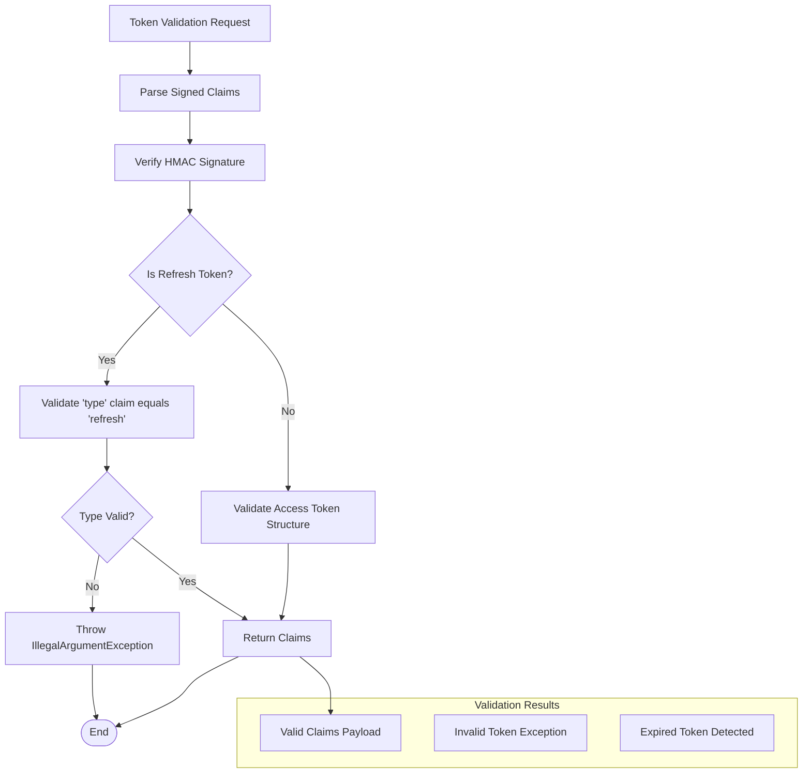

# JWT Service Enhancements

<cite>
**Referenced Files in This Document**
- [JwtService.java](file://jmp-application/src/main/java/com/jmp/application/service/JwtService.java)
- [JwtAuthenticationFilter.java](file://jmp-infrastructure/src/main/java/com/jmp/infrastructure/security/JwtAuthenticationFilter.java)
- [SecurityConfig.java](file://jmp-infrastructure/src/main/java/com/jmp/infrastructure/security/SecurityConfig.java)
- [UserDetailsServiceImpl.java](file://jmp-infrastructure/src/main/java/com/jmp/infrastructure/security/UserDetailsServiceImpl.java)
- [AuthController.java](file://jmp-api/src/main/java/com/jmp/api/controller/AuthController.java)
- [ConferenceController.java](file://jmp-api/src/main/java/com/jmp/api/controller/ConferenceController.java)
- [application.yml](file://jmp-web/src/main/resources/application.yml)
- [User.java](file://jmp-domain/src/main/java/com/jmp/domain/entity/User.java)
- [Conference.java](file://jmp-domain/src/main/java/com/jmp/domain/entity/Conference.java)
- [ConferenceDto.java](file://jmp-application/src/main/java/com/jmp/application/dto/ConferenceDto.java)
</cite>

## Table of Contents
1. [Introduction](#introduction)
2. [JWT Architecture Overview](#jwt-architecture-overview)
3. [Core JWT Components](#core-jwt-components)
4. [Authentication Flow](#authentication-flow)
5. [Token Types and Claims](#token-types-and-claims)
6. [Jitsi Integration](#jitsi-integration)
7. [Security Configuration](#security-configuration)
8. [Implementation Details](#implementation-details)
9. [Performance Considerations](#performance-considerations)
10. [Troubleshooting Guide](#troubleshooting-guide)
11. [Conclusion](#conclusion)

## Introduction

The JWT Service Enhancements in the Jitsi Management Platform (JMP) provide a comprehensive authentication and authorization framework built on JSON Web Tokens. This system enables secure access to platform resources while facilitating seamless integration with Jitsi video conferencing capabilities. The implementation follows industry best practices for token-based authentication, including short-lived access tokens, refresh token mechanisms, and specialized tokens for external participants.

The JWT service architecture consists of three primary token types: platform access tokens for internal authentication, refresh tokens for token renewal, and Jitsi-specific tokens for video conference participation. Each token type serves distinct purposes while maintaining consistent security standards and claim structures.

## JWT Architecture Overview

The JWT authentication system is designed around a layered architecture that separates concerns between token generation, validation, and integration with the broader security framework.

**Diagram sources**
- [JwtService.java:25-43](file://jmp-application/src/main/java/com/jmp/application/service/JwtService.java#L25-L43)
- [JwtAuthenticationFilter.java:27-37](file://jmp-infrastructure/src/main/java/com/jmp/infrastructure/security/JwtAuthenticationFilter.java#L27-L37)
- [SecurityConfig.java:31-40](file://jmp-infrastructure/src/main/java/com/jmp/infrastructure/security/SecurityConfig.java#L31-L40)

## Core JWT Components

### JwtService Implementation

The JwtService serves as the central component responsible for all JWT-related operations within the application. It manages multiple cryptographic keys for different token types and provides comprehensive token generation and validation capabilities.

**Diagram sources**
- [JwtService.java:27-244](file://jmp-application/src/main/java/com/jmp/application/service/JwtService.java#L27-L244)
- [User.java:28-163](file://jmp-domain/src/main/java/com/jmp/domain/entity/User.java#L28-L163)
- [Conference.java:45-244](file://jmp-domain/src/main/java/com/jmp/domain/entity/Conference.java#L45-L244)

**Section sources**
- [JwtService.java:25-43](file://jmp-application/src/main/java/com/jmp/application/service/JwtService.java#L25-L43)
- [JwtService.java:49-87](file://jmp-application/src/main/java/com/jmp/application/service/JwtService.java#L49-L87)
- [JwtService.java:94-169](file://jmp-application/src/main/java/com/jmp/application/service/JwtService.java#L94-L169)

### Token Configuration and Expiration

The JWT service supports configurable expiration times and cryptographic keys through Spring's configuration system. The application.yml file defines the security parameters that govern token behavior across the entire platform.

**Section sources**
- [application.yml:72-79](file://jmp-web/src/main/resources/application.yml#L72-L79)
- [JwtService.java:34-43](file://jmp-application/src/main/java/com/jmp/application/service/JwtService.java#L34-L43)

## Authentication Flow

The authentication process follows a standardized flow that ensures security while maintaining usability for legitimate users.

**Diagram sources**
- [AuthController.java:42-81](file://jmp-api/src/main/java/com/jmp/api/controller/AuthController.java#L42-L81)
- [JwtService.java:49-87](file://jmp-application/src/main/java/com/jmp/application/service/JwtService.java#L49-L87)
- [UserService.java:150-156](file://jmp-application/src/main/java/com/jmp/application/service/UserService.java#L150-L156)

**Section sources**
- [AuthController.java:42-81](file://jmp-api/src/main/java/com/jmp/api/controller/AuthController.java#L42-L81)
- [JwtService.java:49-87](file://jmp-application/src/main/java/com/jmp/application/service/JwtService.java#L49-L87)

### Token Refresh Process

The token refresh mechanism provides a secure way to extend session duration without requiring users to re-enter credentials.

**Diagram sources**
- [AuthController.java:83-100](file://jmp-api/src/main/java/com/jmp/api/controller/AuthController.java#L83-L100)
- [JwtService.java:185-197](file://jmp-application/src/main/java/com/jmp/application/service/JwtService.java#L185-L197)

**Section sources**
- [AuthController.java:83-100](file://jmp-api/src/main/java/com/jmp/api/controller/AuthController.java#L83-L100)
- [JwtService.java:185-197](file://jmp-application/src/main/java/com/jmp/application/service/JwtService.java#L185-L197)

## Token Types and Claims

### Access Token Structure

Access tokens serve as the primary authentication mechanism for platform operations, designed with short expiration times to minimize security risks.

| Claim | Purpose | Data Type | Example |
|-------|---------|-----------|---------|
| `sub` | Subject/User ID | UUID String | `"550e8400-e29b-41d4-a716-446655440000"` |
| `email` | User Email Address | String | `"user@example.com"` |
| `tenant_id` | Tenant Identifier | UUID String | `"6ba7b810-9dad-11d1-80b4-00c04fd430c8"` |
| `roles` | User Role Permissions | Array | `["PARTICIPANT", "MODERATOR"]` |
| `iat` | Issued At Timestamp | Number | `1640995200` |
| `exp` | Expiration Timestamp | Number | `1640995260` |

**Section sources**
- [JwtService.java:49-69](file://jmp-application/src/main/java/com/jmp/application/service/JwtService.java#L49-L69)
- [JwtService.java:202-223](file://jmp-application/src/main/java/com/jmp/application/service/JwtService.java#L202-L223)

### Refresh Token Structure

Refresh tokens provide extended session management with longer expiration periods and specific validation requirements.

| Claim | Purpose | Data Type | Example |
|-------|---------|-----------|---------|
| `sub` | Subject/User ID | UUID String | `"550e8400-e29b-41d4-a716-446655440000"` |
| `type` | Token Type Indicator | String | `"refresh"` |
| `iat` | Issued At Timestamp | Number | `1640995200` |
| `exp` | Expiration Timestamp | Number | `1641599999` |

**Section sources**
- [JwtService.java:75-87](file://jmp-application/src/main/java/com/jmp/application/service/JwtService.java#L75-L87)
- [JwtService.java:185-197](file://jmp-application/src/main/java/com/jmp/application/service/JwtService.java#L185-L197)

### Jitsi Token Structure

Jitsi tokens enable secure access to video conferencing features with specialized claims for room access and user permissions.

| Claim | Purpose | Data Type | Example |
|-------|---------|-----------|---------|
| `room` | Conference Room Name | String | `"conference-room-123"` |
| `sub` | User Identifier | String | `"user@example.com"` |
| `tenant_id` | Tenant Slug | String | `"example-tenant"` |
| `mod` | Moderator Status | Boolean | `true` |
| `context.user.id` | User UUID | String | `"550e8400-e29b-41d4-a716-446655440000"` |
| `context.features.recording` | Recording Permission | Boolean | `false` |
| `context.features.livestreaming` | Livestreaming Permission | Boolean | `false` |
| `context.features.screen-sharing` | Screen Sharing Permission | Boolean | `true` |

**Section sources**
- [JwtService.java:94-126](file://jmp-application/src/main/java/com/jmp/application/service/JwtService.java#L94-L126)
- [JwtService.java:138-169](file://jmp-application/src/main/java/com/jmp/application/service/JwtService.java#L138-L169)

## Jitsi Integration

The JWT service seamlessly integrates with Jitsi video conferencing through specialized token generation that includes conference-specific permissions and user context.

**Diagram sources**
- [ConferenceController.java:147-183](file://jmp-api/src/main/java/com/jmp/api/controller/ConferenceController.java#L147-L183)
- [JwtService.java:94-126](file://jmp-application/src/main/java/com/jmp/application/service/JwtService.java#L94-L126)

**Section sources**
- [ConferenceController.java:147-183](file://jmp-api/src/main/java/com/jmp/api/controller/ConferenceController.java#L147-L183)
- [JwtService.java:94-126](file://jmp-application/src/main/java/com/jmp/application/service/JwtService.java#L94-L126)

### Guest Token Generation

The system supports guest participants through dedicated token generation that provides limited permissions while maintaining security boundaries.

**Section sources**
- [JwtService.java:138-169](file://jmp-application/src/main/java/com/jmp/application/service/JwtService.java#L138-L169)
- [ConferenceController.java:185-217](file://jmp-api/src/main/java/com/jmp/api/controller/ConferenceController.java#L185-L217)

## Security Configuration

The security framework implements comprehensive protection mechanisms through Spring Security integration and custom authentication filters.

**Diagram sources**
- [SecurityConfig.java:31-90](file://jmp-infrastructure/src/main/java/com/jmp/infrastructure/security/SecurityConfig.java#L31-L90)
- [JwtAuthenticationFilter.java:27-121](file://jmp-infrastructure/src/main/java/com/jmp/infrastructure/security/JwtAuthenticationFilter.java#L27-L121)
- [UserDetailsServiceImpl.java:19-47](file://jmp-infrastructure/src/main/java/com/jmp/infrastructure/security/UserDetailsServiceImpl.java#L19-47)

**Section sources**
- [SecurityConfig.java:42-61](file://jmp-infrastructure/src/main/java/com/jmp/infrastructure/security/SecurityConfig.java#L42-L61)
- [JwtAuthenticationFilter.java:39-76](file://jmp-infrastructure/src/main/java/com/jmp/infrastructure/security/JwtAuthenticationFilter.java#L39-L76)
- [UserDetailsServiceImpl.java:25-46](file://jmp-infrastructure/src/main/java/com/jmp/infrastructure/security/UserDetailsServiceImpl.java#L25-L46)

### Authentication Details Enhancement

The WebAuthenticationDetails class extends the standard Spring Security authentication details to include JWT-specific information such as tenant ID and user ID extraction capabilities.

**Section sources**
- [JwtAuthenticationFilter.java:99-120](file://jmp-infrastructure/src/main/java/com/jmp/infrastructure/security/JwtAuthenticationFilter.java#L99-L120)
- [ConferenceController.java:219-231](file://jmp-api/src/main/java/com/jmp/api/controller/ConferenceController.java#L219-L231)

## Implementation Details

### Token Validation Mechanisms

The JWT service implements robust validation mechanisms that ensure token integrity and prevent unauthorized access attempts.

**Diagram sources**
- [JwtService.java:174-197](file://jmp-application/src/main/java/com/jmp/application/service/JwtService.java#L174-L197)

**Section sources**
- [JwtService.java:174-197](file://jmp-application/src/main/java/com/jmp/application/service/JwtService.java#L174-L197)
- [JwtService.java:228-243](file://jmp-application/src/main/java/com/jmp/application/service/JwtService.java#L228-L243)

### Cryptographic Key Management

The system utilizes separate HMAC-SHA keys for different token types to enhance security through key separation and reduce attack surface.

**Section sources**
- [JwtService.java:34-43](file://jmp-application/src/main/java/com/jmp/application/service/JwtService.java#L34-L43)
- [application.yml:76-77](file://jmp-web/src/main/resources/application.yml#L76-L77)

## Performance Considerations

The JWT service architecture incorporates several performance optimization strategies to ensure efficient token processing and minimal latency impact.

### Token Caching Strategy

While the current implementation focuses on direct token validation, potential caching mechanisms could be implemented for frequently accessed user roles and permissions to reduce database query overhead during authentication flows.

### Asynchronous Operations

The system leverages asynchronous processing for non-blocking operations, particularly beneficial for external integrations such as Jitsi server communication and audit logging operations.

### Memory Management

Token validation operations are designed to minimize memory allocation and garbage collection pressure through efficient claim parsing and object reuse patterns.

## Troubleshooting Guide

### Common Authentication Issues

**Invalid Credentials Error**
- **Symptoms**: `BadCredentialsException` during login attempts
- **Causes**: Incorrect password, inactive user account, or disabled authentication provider
- **Resolution**: Verify user credentials, ensure account activation, check password encoding configuration

**Token Validation Failures**
- **Symptoms**: `IllegalArgumentException` during token validation
- **Causes**: Expired tokens, tampered signatures, or incorrect token types
- **Resolution**: Implement proper token refresh mechanisms, verify cryptographic key consistency, check token expiration settings

**Authorization Denied Errors**
- **Symptoms**: `AccessDeniedException` for protected endpoints
- **Causes**: Insufficient user roles, missing permissions, or tenant boundary violations
- **Resolution**: Verify user role assignments, check tenant membership, validate permission configurations

**Section sources**
- [GlobalExceptionHandler.java:54-66](file://jmp-api/src/main/java/com/jmp/api/advice/GlobalExceptionHandler.java#L54-L66)
- [JwtAuthenticationFilter.java:70-73](file://jmp-infrastructure/src/main/java/com/jmp/infrastructure/security/JwtAuthenticationFilter.java#L70-L73)

### Debugging Token Issues

For comprehensive debugging of JWT-related issues, the system provides detailed logging throughout the authentication and authorization pipeline. Key areas to monitor include token generation timestamps, validation failures, and user role resolution processes.

**Section sources**
- [JwtService.java:50](file://jmp-application/src/main/java/com/jmp/application/service/JwtService.java#L50)
- [JwtAuthenticationFilter.java:68](file://jmp-infrastructure/src/main/java/com/jmp/infrastructure/security/JwtAuthenticationFilter.java#L68)

## Conclusion

The JWT Service Enhancements in the Jitsi Management Platform provide a robust, scalable, and secure authentication framework that supports modern application requirements. The implementation demonstrates best practices in token-based authentication through:

- **Multi-Token Architecture**: Separate access tokens, refresh tokens, and Jitsi-specific tokens with appropriate expiration policies
- **Enhanced Security**: Cryptographic key separation, comprehensive token validation, and tenant-scoped authentication
- **Seamless Integration**: Native support for Jitsi video conferencing with role-based permissions and feature controls
- **Developer Experience**: Clean API design, comprehensive error handling, and detailed logging for troubleshooting

The system successfully balances security requirements with usability considerations, providing a foundation for enterprise-grade authentication while maintaining flexibility for future enhancements. The modular architecture ensures maintainability and allows for easy extension of authentication mechanisms as requirements evolve.