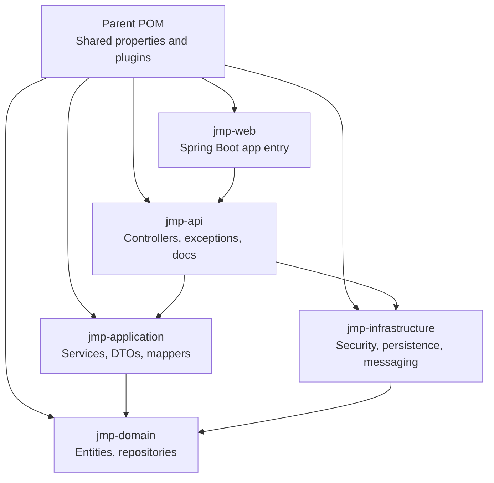
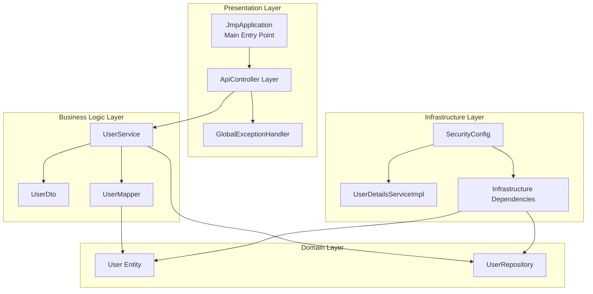
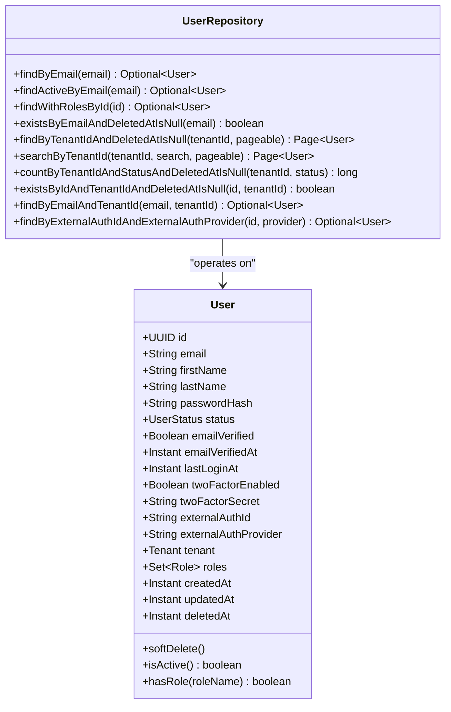
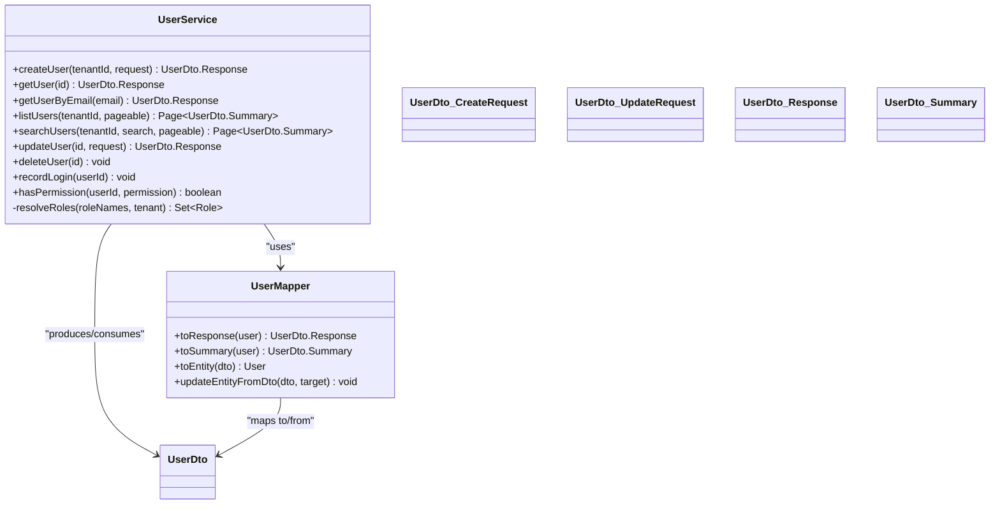
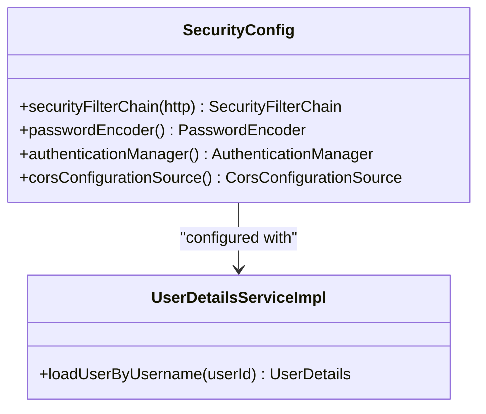
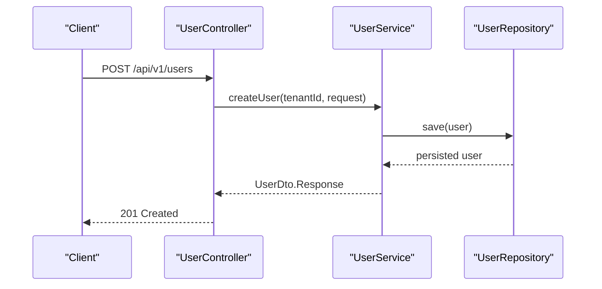
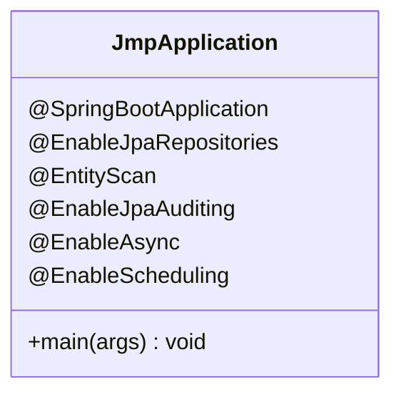
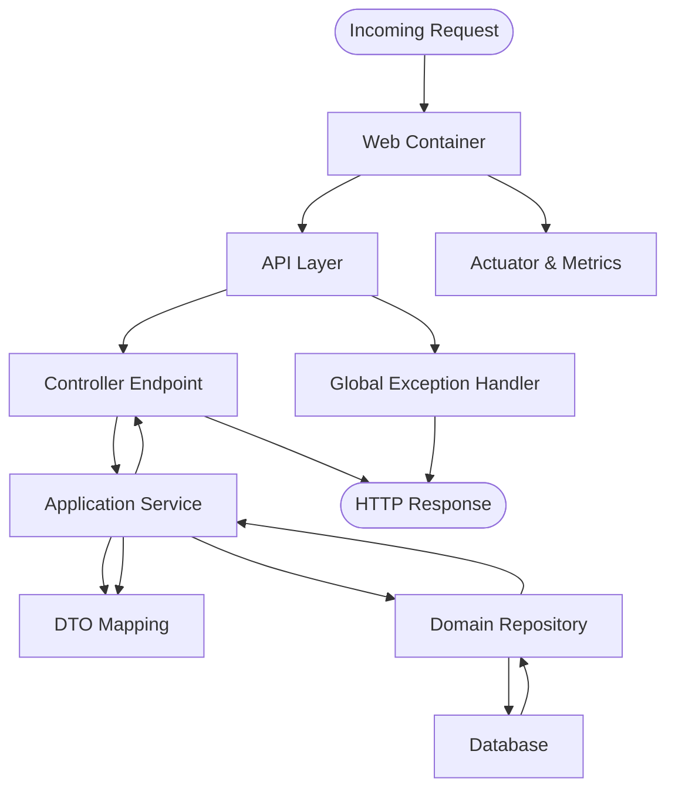
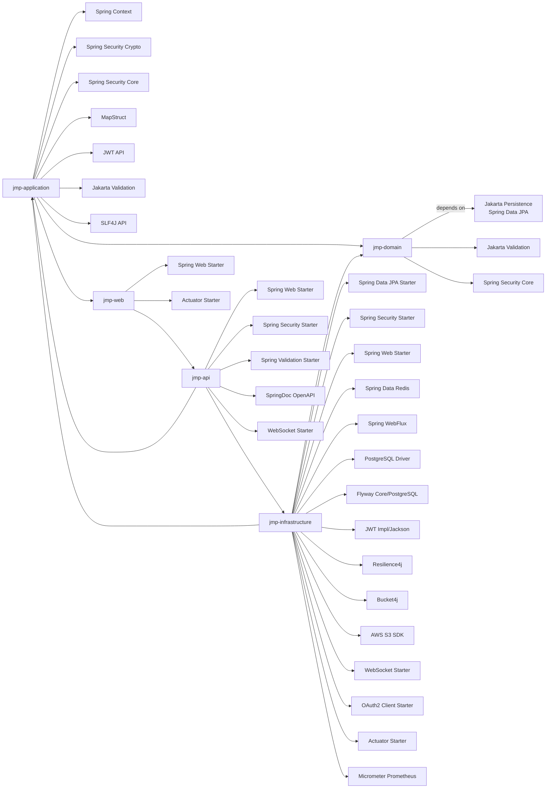

# Backend Modules

<cite>
**Referenced Files in This Document**
- [pom.xml](file://pom.xml)
- [jmp-web/pom.xml](file://jmp-web/pom.xml)
- [jmp-domain/pom.xml](file://jmp-domain/pom.xml)
- [jmp-application/pom.xml](file://jmp-application/pom.xml)
- [jmp-infrastructure/pom.xml](file://jmp-infrastructure/pom.xml)
- [jmp-api/pom.xml](file://jmp-api/pom.xml)
- [JmpApplication.java](file://jmp-web/src/main/java/com/jmp/web/JmpApplication.java)
- [User.java](file://jmp-domain/src/main/java/com/jmp/domain/entity/User.java)
- [UserRepository.java](file://jmp-domain/src/main/java/com/jmp/domain/repository/UserRepository.java)
- [UserService.java](file://jmp-application/src/main/java/com/jmp/application/service/UserService.java)
- [UserDto.java](file://jmp-application/src/main/java/com/jmp/application/dto/UserDto.java)
- [UserMapper.java](file://jmp-application/src/main/java/com/jmp/application/mapper/UserMapper.java)
- [SecurityConfig.java](file://jmp-infrastructure/src/main/java/com/jmp/infrastructure/security/SecurityConfig.java)
- [UserDetailsServiceImpl.java](file://jmp-infrastructure/src/main/java/com/jmp/infrastructure/security/UserDetailsServiceImpl.java)
- [UserController.java](file://jmp-api/src/main/java/com/jmp/api/controller/UserController.java)
- [GlobalExceptionHandler.java](file://jmp-api/src/main/java/com/jmp/api/advice/GlobalExceptionHandler.java)
</cite>

## Update Summary
**Changes Made**
- Updated module architecture to reflect the new five-module structure with jmp-web as the main application module
- Added comprehensive documentation for the jmp-web module and its role as the Spring Boot application entry point
- Updated module interaction patterns to show the complete dependency chain from jmp-web → jmp-api → jmp-application → jmp-infrastructure → jmp-domain
- Enhanced architectural diagrams to illustrate the new layered structure with proper module boundaries
- Updated Maven configuration documentation to reflect the complete multi-module setup

## Table of Contents
1. [Introduction](#introduction)
2. [Project Structure](#project-structure)
3. [Core Components](#core-components)
4. [Architecture Overview](#architecture-overview)
5. [Detailed Component Analysis](#detailed-component-analysis)
6. [Dependency Analysis](#dependency-analysis)
7. [Performance Considerations](#performance-considerations)
8. [Troubleshooting Guide](#troubleshooting-guide)
9. [Conclusion](#conclusion)
10. [Appendices](#appendices)

## Introduction
This document explains the backend module structure of the Jitsi Management Platform (JMP). The system follows a clean architecture with five focused modules organized in a hierarchical dependency structure:
- jmp-domain: Core business entities, value objects, repositories, and domain events
- jmp-application: Business logic, services, DTOs, mappers, validators, and use cases
- jmp-infrastructure: Security, persistence, messaging, caching, external integrations, and monitoring
- jmp-api: REST controllers, DTOs, exception handling, and API documentation
- jmp-web: Main Spring Boot application entry point and configuration

The jmp-web module serves as the primary application container, orchestrating all other modules through explicit dependencies. This five-module architecture enforces clear separation of concerns, testability, and maintainability while enabling robust integration patterns and deployment flexibility.

## Project Structure
The repository is a comprehensive multi-module Maven project centered around a parent POM that defines shared properties, dependency management, and build plugins. Each module encapsulates a specific layer of responsibility and declares explicit dependencies on other modules, creating a clear architectural hierarchy.

**Diagram sources**
- [pom.xml:40-46](file://pom.xml#L40-L46)
- [jmp-web/pom.xml:18-35](file://jmp-web/pom.xml#L18-L35)
- [jmp-api/pom.xml:17-28](file://jmp-api/pom.xml#L17-L28)
- [jmp-application/pom.xml:17-22](file://jmp-application/pom.xml#L17-L22)
- [jmp-infrastructure/pom.xml:17-28](file://jmp-infrastructure/pom.xml#L17-L28)

Key characteristics:
- Parent POM centralizes Java version, Spring Boot version, and dependency versions across all modules
- Module dependencies are declared explicitly via Maven dependencies with proper version management
- jmp-web depends on jmp-api and Spring Boot starters, serving as the main application container
- jmp-api depends on jmp-application and jmp-infrastructure, providing the REST interface layer
- jmp-application depends on jmp-domain, implementing business logic
- jmp-infrastructure depends on jmp-domain and jmp-application, handling cross-cutting concerns
- The architecture supports both development and production profiles with configurable properties

**Section sources**
- [pom.xml:40-46](file://pom.xml#L40-L46)
- [pom.xml:79-167](file://pom.xml#L79-L167)
- [jmp-web/pom.xml:18-35](file://jmp-web/pom.xml#L18-L35)
- [jmp-api/pom.xml:17-28](file://jmp-api/pom.xml#L17-L28)
- [jmp-application/pom.xml:17-22](file://jmp-application/pom.xml#L17-L22)
- [jmp-infrastructure/pom.xml:17-28](file://jmp-infrastructure/pom.xml#L17-L28)

## Core Components
This section outlines the responsibilities and key components of each module in the five-module architecture.

### jmp-domain
**Responsibilities**: Define core business entities, value objects, and repository interfaces. Encapsulate persistence contracts and domain-specific validations. Provides the foundational layer for all business logic.

**Examples**: User entity with comprehensive attributes, UserRepository interface with optimized queries, and related domain enums and annotations for tenant scoping and role-based access control.

**Notable files**: [User.java](file://jmp-domain/src/main/java/com/jmp/domain/entity/User.java), [UserRepository.java](file://jmp-domain/src/main/java/com/jmp/domain/repository/UserRepository.java)

### jmp-application
**Responsibilities**: Implement business logic, orchestrate use cases, provide DTOs, mappers, and validators. Coordinate with infrastructure services and handle transaction management. Contains the core business operations and data transformation logic.

**Examples**: UserService for user lifecycle operations with comprehensive CRUD functionality, UserDto for strict request/response shapes, and UserMapper for entity-to-DTO transformations with role mapping.

**Notable files**: [UserService.java](file://jmp-application/src/main/java/com/jmp/application/service/UserService.java), [UserDto.java](file://jmp-application/src/main/java/com/jmp/application/dto/UserDto.java), [UserMapper.java](file://jmp-application/src/main/java/com/jmp/application/mapper/UserMapper.java)

### jmp-infrastructure
**Responsibilities**: Implement cross-cutting concerns such as security, persistence configuration, external integrations (e.g., S3), caching, messaging, resilience, and monitoring. Handles all technical infrastructure concerns.

**Examples**: SecurityConfig for HTTP security and CORS configuration, UserDetailsServiceImpl for Spring Security integration, JWT authentication filter, and comprehensive external service integrations.

**Notable files**: [SecurityConfig.java](file://jmp-infrastructure/src/main/java/com/jmp/infrastructure/security/SecurityConfig.java), [UserDetailsServiceImpl.java](file://jmp-infrastructure/src/main/java/com/jmp/infrastructure/security/UserDetailsServiceImpl.java)

### jmp-api
**Responsibilities**: Expose REST endpoints, manage API documentation, and provide global exception handling conforming to RFC 7807 Problem Details. Serves as the presentation layer for external clients.

**Examples**: UserController for user operations with role-based access control, GlobalExceptionHandler for standardized error responses, and comprehensive Swagger/OpenAPI documentation.

**Notable files**: [UserController.java](file://jmp-api/src/main/java/com/jmp/api/controller/UserController.java), [GlobalExceptionHandler.java](file://jmp-api/src/main/java/com/jmp/api/advice/GlobalExceptionHandler.java)

### jmp-web
**Responsibilities**: Main Spring Boot application entry point and configuration. Orchestrates module initialization, enables JPA scanning, and provides the primary deployment artifact. Serves as the application container.

**Examples**: JmpApplication class with comprehensive Spring Boot configuration, EntityScan and EnableJpaRepositories annotations, and Actuator monitoring setup.

**Notable files**: [JmpApplication.java](file://jmp-web/src/main/java/com/jmp/web/JmpApplication.java)

**Section sources**
- [User.java:18-164](file://jmp-domain/src/main/java/com/jmp/domain/entity/User.java#L18-L164)
- [UserRepository.java:14-82](file://jmp-domain/src/main/java/com/jmp/domain/repository/UserRepository.java#L14-L82)
- [UserService.java:24-190](file://jmp-application/src/main/java/com/jmp/application/service/UserService.java#L24-L190)
- [UserDto.java:10-97](file://jmp-application/src/main/java/com/jmp/application/dto/UserDto.java#L10-L97)
- [UserMapper.java:14-76](file://jmp-application/src/main/java/com/jmp/application/mapper/UserMapper.java#L14-L76)
- [SecurityConfig.java:24-90](file://jmp-infrastructure/src/main/java/com/jmp/infrastructure/security/SecurityConfig.java#L24-L90)
- [UserDetailsServiceImpl.java:15-48](file://jmp-infrastructure/src/main/java/com/jmp/infrastructure/security/UserDetailsServiceImpl.java#L15-L48)
- [UserController.java:29-123](file://jmp-api/src/main/java/com/jmp/api/controller/UserController.java#L29-L123)
- [GlobalExceptionHandler.java:18-130](file://jmp-api/src/main/java/com/jmp/api/advice/GlobalExceptionHandler.java#L18-L130)
- [JmpApplication.java:11-27](file://jmp-web/src/main/java/com/jmp/web/JmpApplication.java#L11-L27)

## Architecture Overview
The backend follows a layered architecture with clear boundaries and explicit dependencies flowing from the presentation layer down to the persistence layer. The architecture emphasizes separation of concerns with each module having distinct responsibilities.

**Diagram sources**
- [JmpApplication.java:15-21](file://jmp-web/src/main/java/com/jmp/web/JmpApplication.java#L15-L21)
- [UserController.java:33-123](file://jmp-api/src/main/java/com/jmp/api/controller/UserController.java#L33-L123)
- [GlobalExceptionHandler.java:22-130](file://jmp-api/src/main/java/com/jmp/api/advice/GlobalExceptionHandler.java#L22-L130)
- [UserService.java:28-190](file://jmp-application/src/main/java/com/jmp/application/service/UserService.java#L28-L190)
- [UserDto.java:14-97](file://jmp-application/src/main/java/com/jmp/application/dto/UserDto.java#L14-L97)
- [UserMapper.java:18-76](file://jmp-application/src/main/java/com/jmp/application/mapper/UserMapper.java#L18-L76)
- [User.java:23-164](file://jmp-domain/src/main/java/com/jmp/domain/entity/User.java#L23-L164)
- [UserRepository.java:18-82](file://jmp-domain/src/main/java/com/jmp/domain/repository/UserRepository.java#L18-L82)
- [SecurityConfig.java:28-90](file://jmp-infrastructure/src/main/java/com/jmp/infrastructure/security/SecurityConfig.java#L28-L90)
- [UserDetailsServiceImpl.java:19-48](file://jmp-infrastructure/src/main/java/com/jmp/infrastructure/security/UserDetailsServiceImpl.java#L19-L48)

## Detailed Component Analysis

### Domain Layer: User Entity and Repository
The domain layer encapsulates the core business model and persistence contracts. The User entity models platform users with comprehensive tenant scoping, role-based access control, and audit metadata. The UserRepository defines optimized queries and fetch strategies for efficient loading of associated data with proper entity graph configuration.

**Diagram sources**
- [User.java:23-164](file://jmp-domain/src/main/java/com/jmp/domain/entity/User.java#L23-L164)
- [UserRepository.java:18-82](file://jmp-domain/src/main/java/com/jmp/domain/repository/UserRepository.java#L18-L82)

**Section sources**
- [User.java:18-164](file://jmp-domain/src/main/java/com/jmp/domain/entity/User.java#L18-L164)
- [UserRepository.java:14-82](file://jmp-domain/src/main/java/com/jmp/domain/repository/UserRepository.java#L14-L82)

### Application Layer: User Service and DTOs
The application layer implements business operations and data transfer objects. UserService orchestrates user creation, retrieval, updates, and deletion, leveraging repositories and mappers. It integrates with Spring Security for password encoding and role resolution. DTOs define strict request/response contracts, and UserMapper transforms between entities and DTOs with comprehensive role mapping.

**Diagram sources**
- [UserService.java:28-190](file://jmp-application/src/main/java/com/jmp/application/service/UserService.java#L28-L190)
- [UserDto.java:14-97](file://jmp-application/src/main/java/com/jmp/application/dto/UserDto.java#L14-L97)
- [UserMapper.java:18-76](file://jmp-application/src/main/java/com/jmp/application/mapper/UserMapper.java#L18-L76)

**Section sources**
- [UserService.java:24-190](file://jmp-application/src/main/java/com/jmp/application/service/UserService.java#L24-L190)
- [UserDto.java:10-97](file://jmp-application/src/main/java/com/jmp/application/dto/UserDto.java#L10-L97)
- [UserMapper.java:14-76](file://jmp-application/src/main/java/com/jmp/application/mapper/UserMapper.java#L14-L76)

### Infrastructure Layer: Security and User Details
Security is configured at the infrastructure layer with stateless sessions, method-level security, and JWT filter integration. UserDetailsService loads user principals by ID (from JWT subject) and constructs authorities from roles. The layer also handles external integrations, caching, and monitoring infrastructure.

**Diagram sources**
- [SecurityConfig.java:28-90](file://jmp-infrastructure/src/main/java/com/jmp/infrastructure/security/SecurityConfig.java#L28-L90)
- [UserDetailsServiceImpl.java:19-48](file://jmp-infrastructure/src/main/java/com/jmp/infrastructure/security/UserDetailsServiceImpl.java#L19-L48)

**Section sources**
- [SecurityConfig.java:24-90](file://jmp-infrastructure/src/main/java/com/jmp/infrastructure/security/SecurityConfig.java#L24-L90)
- [UserDetailsServiceImpl.java:15-48](file://jmp-infrastructure/src/main/java/com/jmp/infrastructure/security/UserDetailsServiceImpl.java#L15-L48)

### API Layer: Controllers and Exception Handling
The API layer exposes REST endpoints and standardizes error responses. UserController delegates to UserService and enforces role-based access control. GlobalExceptionHandler produces RFC 7807 Problem Details for consistent error reporting across all API endpoints.

**Diagram sources**
- [UserController.java:43-55](file://jmp-api/src/main/java/com/jmp/api/controller/UserController.java#L43-L55)
- [UserService.java:44-70](file://jmp-application/src/main/java/com/jmp/application/service/UserService.java#L44-L70)
- [UserRepository.java:18-82](file://jmp-domain/src/main/java/com/jmp/domain/repository/UserRepository.java#L18-L82)

**Section sources**
- [UserController.java:29-123](file://jmp-api/src/main/java/com/jmp/api/controller/UserController.java#L29-L123)
- [GlobalExceptionHandler.java:18-130](file://jmp-api/src/main/java/com/jmp/api/advice/GlobalExceptionHandler.java#L18-L130)

### Web Module: Application Bootstrap
The jmp-web module serves as the main Spring Boot application entry point, configuring JPA scanning, entity auditing, and scheduling capabilities. It orchestrates the startup of all dependent modules and provides the primary deployment artifact.

**Diagram sources**
- [JmpApplication.java:15-21](file://jmp-web/src/main/java/com/jmp/web/JmpApplication.java#L15-L21)

**Section sources**
- [JmpApplication.java:11-27](file://jmp-web/src/main/java/com/jmp/web/JmpApplication.java#L11-L27)

### Conceptual Overview
The following conceptual flow illustrates how a request moves through the complete five-module system from API to persistence and back.

[No sources needed since this diagram shows conceptual workflow, not actual code structure]

## Dependency Analysis
Module dependencies are declared explicitly in each module's POM with centralized version management in the parent POM. The five-module architecture creates a clear dependency hierarchy flowing from presentation to persistence layers.

**Diagram sources**
- [jmp-domain/pom.xml:17-53](file://jmp-domain/pom.xml#L17-L53)
- [jmp-application/pom.xml:17-71](file://jmp-application/pom.xml#L17-L71)
- [jmp-infrastructure/pom.xml:17-147](file://jmp-infrastructure/pom.xml#L17-L147)
- [jmp-api/pom.xml:17-59](file://jmp-api/pom.xml#L17-L59)
- [jmp-web/pom.xml:18-35](file://jmp-web/pom.xml#L18-L35)

**Section sources**
- [pom.xml:79-167](file://pom.xml#L79-L167)
- [jmp-domain/pom.xml:17-53](file://jmp-domain/pom.xml#L17-L53)
- [jmp-application/pom.xml:17-71](file://jmp-application/pom.xml#L17-L71)
- [jmp-infrastructure/pom.xml:17-147](file://jmp-infrastructure/pom.xml#L17-L147)
- [jmp-api/pom.xml:17-59](file://jmp-api/pom.xml#L17-L59)
- [jmp-web/pom.xml:18-35](file://jmp-web/pom.xml#L18-L35)

## Performance Considerations
- Entity graph fetching: UserRepository uses @EntityGraph to eagerly load roles and permissions, reducing N+1 queries during user retrieval with optimized association loading.
- Pagination: UserService leverages Pageable for scalable listing and search operations with database-level pagination support.
- Password hashing: BCrypt encoder with a cost factor of 12 is configured in SecurityConfig for secure but efficient password hashing.
- Caching and rate limiting: Bucket4j and Redis are available in infrastructure for request throttling and caching strategies with distributed rate limiting support.
- Observability: Micrometer with Prometheus and Spring Boot Actuator enable comprehensive metrics collection and health checks across all modules.
- Transaction management: Proper @Transactional annotations ensure optimal database performance and consistency across business operations.

[No sources needed since this section provides general guidance]

## Troubleshooting Guide
Common areas to inspect when diagnosing issues:
- Authentication failures: Review SecurityConfig for filter chain and password encoder configuration; check UserDetailsServiceImpl for user loading and role mapping; verify JWT token processing in JwtAuthenticationFilter.
- Validation errors: GlobalExceptionHandler maps constraint violations and binding errors to structured Problem Details responses with detailed error information.
- Repository access: Verify JPA repositories are enabled and scanned by JmpApplication; confirm EntityScan and EnableJpaRepositories annotations are properly configured.
- Module dependencies: Ensure proper Maven dependency declarations and version management in parent POM; check for circular dependencies between modules.
- Build and deployment: Confirm parent POM property alignment and dependencyManagement entries; ensure module POMs declare correct dependencies and Spring Boot plugin configuration.
- Application startup: Review JmpApplication configuration for proper package scanning and module initialization order.

**Section sources**
- [SecurityConfig.java:42-90](file://jmp-infrastructure/src/main/java/com/jmp/infrastructure/security/SecurityConfig.java#L42-L90)
- [UserDetailsServiceImpl.java:25-48](file://jmp-infrastructure/src/main/java/com/jmp/infrastructure/security/UserDetailsServiceImpl.java#L25-L48)
- [GlobalExceptionHandler.java:26-130](file://jmp-api/src/main/java/com/jmp/api/advice/GlobalExceptionHandler.java#L26-L130)
- [JmpApplication.java:15-21](file://jmp-web/src/main/java/com/jmp/web/JmpApplication.java#L15-L21)

## Conclusion
The Jitsi Management Platform backend employs a comprehensive five-module architecture that separates business logic, persistence, infrastructure concerns, API exposure, and application orchestration. The jmp-web module serves as the main application container, while the other modules maintain clear separation of concerns. The parent Maven configuration ensures consistent dependency and build management across all modules. Explicit module dependencies enforce clear boundaries, while Spring Boot auto-configuration and MapStruct streamline development. This design supports scalability, testability, maintainability, and provides a solid foundation for future enhancements.

[No sources needed since this section summarizes without analyzing specific files]

## Appendices

### Maven Configuration Highlights
- Parent POM
  - Centralized properties for Java 21 and Spring Boot 3.2.5 versions
  - Comprehensive dependency management for all modules and third-party libraries
  - Shared plugin management for compilation, testing, and quality gates across five modules
  - Support for development and production profiles with configurable properties
- Module POMs
  - jmp-domain: Declares persistence and validation dependencies for core business entities
  - jmp-application: Depends on jmp-domain and adds application-layer libraries for business logic
  - jmp-infrastructure: Depends on jmp-domain and jmp-application plus infrastructure starters
  - jmp-api: Depends on jmp-application and jmp-infrastructure plus web and documentation
  - jmp-web: Depends on jmp-api and Spring Boot starters for packaging the main application
- Build Configuration
  - Spring Boot Maven Plugin with layer optimization for container deployment
  - Comprehensive test coverage with Surefire and Failsafe plugins
  - Code quality tools including SpotBugs, Checkstyle, and JaCoCo
  - Multi-module build support with proper dependency resolution

**Section sources**
- [pom.xml:48-77](file://pom.xml#L48-L77)
- [pom.xml:79-167](file://pom.xml#L79-L167)
- [jmp-domain/pom.xml:17-53](file://jmp-domain/pom.xml#L17-L53)
- [jmp-application/pom.xml:17-71](file://jmp-application/pom.xml#L17-L71)
- [jmp-infrastructure/pom.xml:17-147](file://jmp-infrastructure/pom.xml#L17-L147)
- [jmp-api/pom.xml:17-59](file://jmp-api/pom.xml#L17-L59)
- [jmp-web/pom.xml:18-35](file://jmp-web/pom.xml#L18-L35)
- [jmp-web/pom.xml:38-57](file://jmp-web/pom.xml#L38-L57)