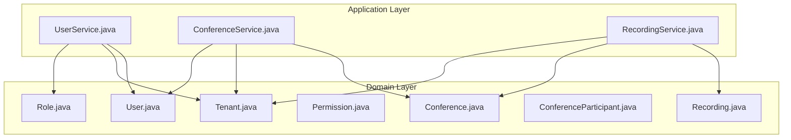
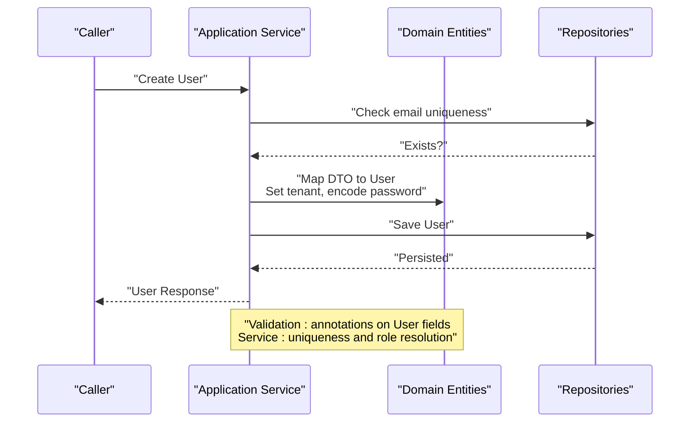
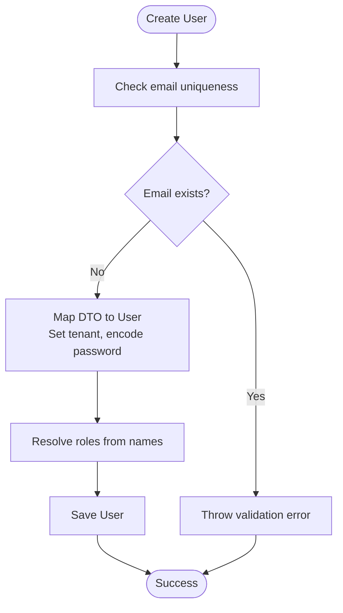
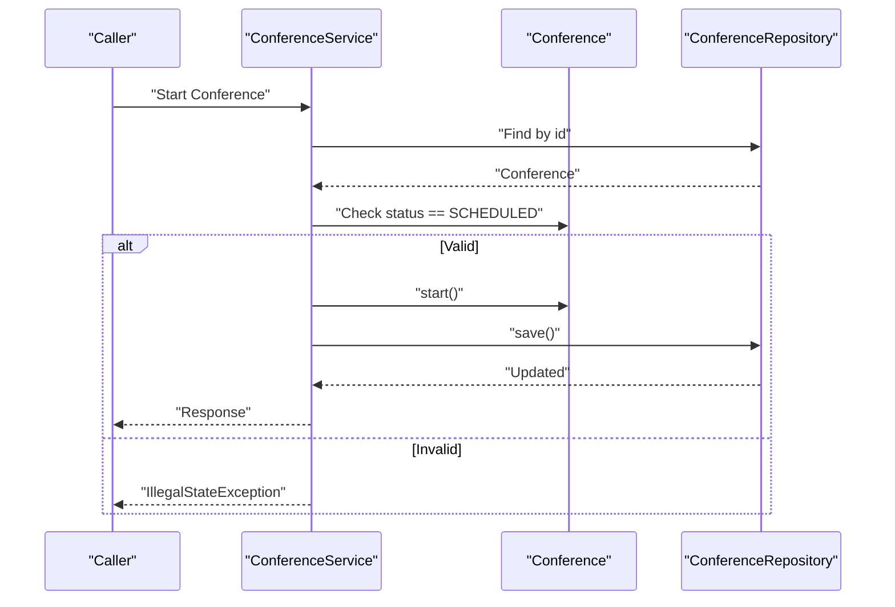
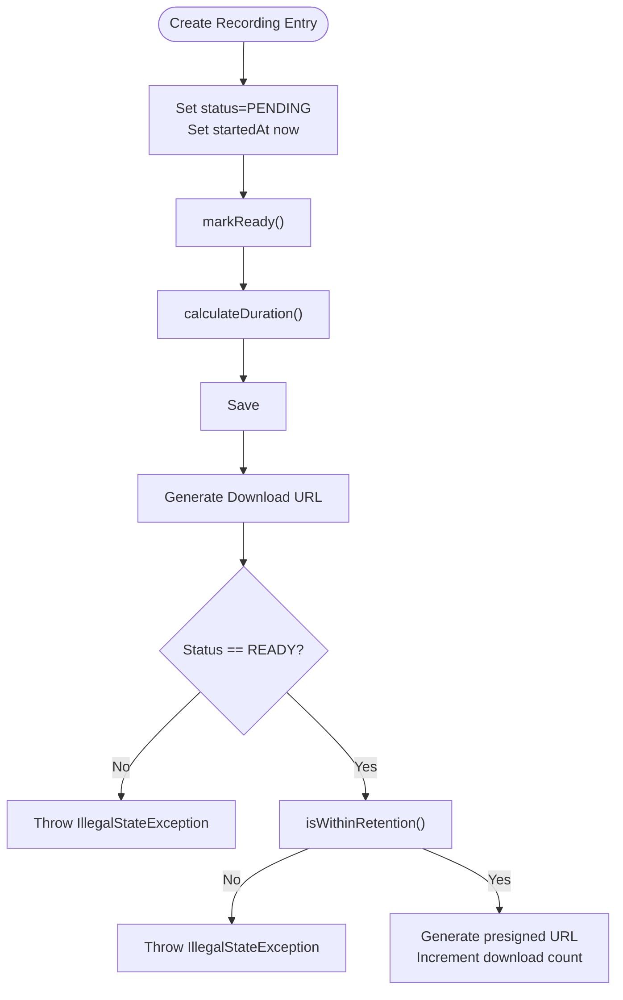
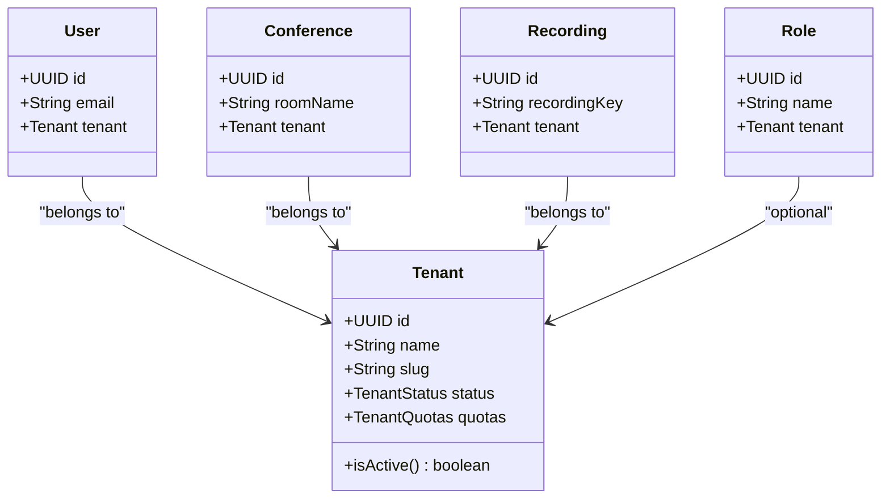
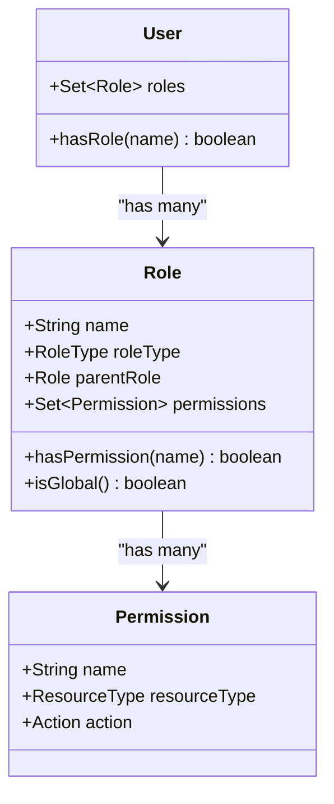
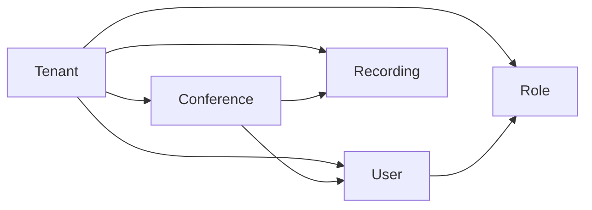

# Business Rules and Validation

<cite>
**Referenced Files in This Document**
- [User.java](file://jmp-domain/src/main/java/com/jmp/domain/entity/User.java)
- [Conference.java](file://jmp-domain/src/main/java/com/jmp/domain/entity/Conference.java)
- [Recording.java](file://jmp-domain/src/main/java/com/jmp/domain/entity/Recording.java)
- [Tenant.java](file://jmp-domain/src/main/java/com/jmp/domain/entity/Tenant.java)
- [Role.java](file://jmp-domain/src/main/java/com/jmp/domain/entity/Role.java)
- [Permission.java](file://jmp-domain/src/main/java/com/jmp/domain/entity/Permission.java)
- [ConferenceParticipant.java](file://jmp-domain/src/main/java/com/jmp/domain/entity/ConferenceParticipant.java)
- [ConferenceService.java](file://jmp-application/src/main/java/com/jmp/application/service/ConferenceService.java)
- [UserService.java](file://jmp-application/src/main/java/com/jmp/application/service/UserService.java)
- [RecordingService.java](file://jmp-application/src/main/java/com/jmp/application/service/RecordingService.java)
</cite>

## Table of Contents
1. [Introduction](#introduction)
2. [Project Structure](#project-structure)
3. [Core Components](#core-components)
4. [Architecture Overview](#architecture-overview)
5. [Detailed Component Analysis](#detailed-component-analysis)
6. [Dependency Analysis](#dependency-analysis)
7. [Performance Considerations](#performance-considerations)
8. [Troubleshooting Guide](#troubleshooting-guide)
9. [Conclusion](#conclusion)

## Introduction
This document explains how business rules and validation are enforced at the Domain Layer, independent of external frameworks. It focuses on:
- Domain-level validation via Bean Validation annotations and custom checks
- Role-based access control embedded in entities and value objects
- Immutability patterns, defensive copying, and state validation
- Business rule violations and their error handling
- Examples of constraints for User creation/modification, Conference scheduling/participant limits, Recording status transitions, and Tenant isolation enforcement

## Project Structure
The relevant domain and application layers are organized as follows:
- Domain entities define business constraints and state transitions
- Application services orchestrate operations and enforce runtime business rules
- Validation is expressed both declaratively (annotations) and procedurally (service-layer checks)

**Diagram sources**
- [User.java:1-164](file://jmp-domain/src/main/java/com/jmp/domain/entity/User.java#L1-L164)
- [Tenant.java:1-174](file://jmp-domain/src/main/java/com/jmp/domain/entity/Tenant.java#L1-L174)
- [Role.java:1-131](file://jmp-domain/src/main/java/com/jmp/domain/entity/Role.java#L1-L131)
- [Permission.java:1-128](file://jmp-domain/src/main/java/com/jmp/domain/entity/Permission.java#L1-L128)
- [Conference.java:1-217](file://jmp-domain/src/main/java/com/jmp/domain/entity/Conference.java#L1-L217)
- [ConferenceParticipant.java:1-150](file://jmp-domain/src/main/java/com/jmp/domain/entity/ConferenceParticipant.java#L1-L150)
- [Recording.java:1-203](file://jmp-domain/src/main/java/com/jmp/domain/entity/Recording.java#L1-L203)
- [UserService.java:1-190](file://jmp-application/src/main/java/com/jmp/application/service/UserService.java#L1-L190)
- [ConferenceService.java:1-225](file://jmp-application/src/main/java/com/jmp/application/service/ConferenceService.java#L1-L225)
- [RecordingService.java:1-332](file://jmp-application/src/main/java/com/jmp/application/service/RecordingService.java#L1-L332)

**Section sources**
- [User.java:1-164](file://jmp-domain/src/main/java/com/jmp/domain/entity/User.java#L1-L164)
- [Conference.java:1-217](file://jmp-domain/src/main/java/com/jmp/domain/entity/Conference.java#L1-L217)
- [Recording.java:1-203](file://jmp-domain/src/main/java/com/jmp/domain/entity/Recording.java#L1-L203)
- [Tenant.java:1-174](file://jmp-domain/src/main/java/com/jmp/domain/entity/Tenant.java#L1-L174)
- [Role.java:1-131](file://jmp-domain/src/main/java/com/jmp/domain/entity/Role.java#L1-L131)
- [Permission.java:1-128](file://jmp-domain/src/main/java/com/jmp/domain/entity/Permission.java#L1-L128)
- [ConferenceParticipant.java:1-150](file://jmp-domain/src/main/java/com/jmp/domain/entity/ConferenceParticipant.java#L1-L150)
- [UserService.java:1-190](file://jmp-application/src/main/java/com/jmp/application/service/UserService.java#L1-L190)
- [ConferenceService.java:1-225](file://jmp-application/src/main/java/com/jmp/application/service/ConferenceService.java#L1-L225)
- [RecordingService.java:1-332](file://jmp-application/src/main/java/com/jmp/application/service/RecordingService.java#L1-L332)

## Core Components
This section documents the primary domain entities and their embedded business rules and validations.

- User
  - Enforces email uniqueness and size limits
  - Tracks tenant association and roles
  - Provides role checks and active-state validation
  - Example constraints: email not-null and unique, first/last name size limits, status defaults, tenant foreign key not-null

- Conference
  - Enforces room name and display name size limits
  - Tracks tenant and creator associations
  - Manages scheduling, status transitions, participant counts, and optional password/security flags
  - Example constraints: room name not-null and size-limited, status defaults to scheduled, tenant and createdBy not-null

- Recording
  - Enforces recording key uniqueness and size limits
  - Manages status lifecycle and derived duration calculation
  - Tracks retention, encryption, and download metrics
  - Example constraints: recording key not-null and unique, status defaults to pending, tenant and conference not-null

- Tenant
  - Enforces name/slug uniqueness and size limits
  - Tracks quotas and feature gating
  - Provides activation/suspension logic
  - Example constraints: name/slug not-null and unique, quotas embeddable with defaults

- Role and Permission
  - Define RBAC model with role hierarchy and permission sets
  - Roles can be tenant-scoped or global
  - Permissions define resource/action pairs

- ConferenceParticipant
  - Tracks participant role/status and timestamps
  - Supports guest/participant distinction and activity checks

**Section sources**
- [User.java:35-96](file://jmp-domain/src/main/java/com/jmp/domain/entity/User.java#L35-L96)
- [Conference.java:37-135](file://jmp-domain/src/main/java/com/jmp/domain/entity/Conference.java#L37-L135)
- [Recording.java:36-126](file://jmp-domain/src/main/java/com/jmp/domain/entity/Recording.java#L36-L126)
- [Tenant.java:36-87](file://jmp-domain/src/main/java/com/jmp/domain/entity/Tenant.java#L36-L87)
- [Role.java:34-89](file://jmp-domain/src/main/java/com/jmp/domain/entity/Role.java#L34-L89)
- [Permission.java:30-76](file://jmp-domain/src/main/java/com/jmp/domain/entity/Permission.java#L30-L76)
- [ConferenceParticipant.java:30-109](file://jmp-domain/src/main/java/com/jmp/domain/entity/ConferenceParticipant.java#L30-L109)

## Architecture Overview
The domain enforces business rules independently of infrastructure concerns. Validation occurs at:
- Entity level via Bean Validation annotations
- Service level via explicit checks and state transitions

**Diagram sources**
- [UserService.java:44-70](file://jmp-application/src/main/java/com/jmp/application/service/UserService.java#L44-L70)
- [User.java:35-96](file://jmp-domain/src/main/java/com/jmp/domain/entity/User.java#L35-L96)

## Detailed Component Analysis

### User Creation and Modification Rules
- Declarative validation
  - Email not-null, valid format, size-limited, unique at database level
  - First/last name not-null and size-limited
  - Status defaults to pending verification; tenant not-null
- Procedural validation and behavior
  - Email uniqueness checked before save
  - Password hashed before persist
  - Roles resolved from role names; default role applied if none provided
  - Active state determined by status and soft-delete flag
  - Role membership checked via role name comparison

**Diagram sources**
- [UserService.java:44-70](file://jmp-application/src/main/java/com/jmp/application/service/UserService.java#L44-L70)
- [User.java:35-96](file://jmp-domain/src/main/java/com/jmp/domain/entity/User.java#L35-L96)

**Section sources**
- [User.java:35-96](file://jmp-domain/src/main/java/com/jmp/domain/entity/User.java#L35-L96)
- [UserService.java:44-70](file://jmp-application/src/main/java/com/jmp/application/service/UserService.java#L44-L70)

### Conference Scheduling and Participant Limits
- Declarative validation
  - Room name and display name size-limited
  - Tenant and creator not-null
  - Status defaults to scheduled
- Procedural validation and behavior
  - Room name uniqueness enforced per tenant
  - Updates allowed only when scheduled; prevents updates on ended/cancelled
  - Start allowed only from scheduled; end allowed only from active
  - Scheduler auto-starts/end conferences based on time windows
  - Participant count computed from joined participants

**Diagram sources**
- [ConferenceService.java:136-152](file://jmp-application/src/main/java/com/jmp/application/service/ConferenceService.java#L136-L152)
- [Conference.java:140-151](file://jmp-domain/src/main/java/com/jmp/domain/entity/Conference.java#L140-L151)

**Section sources**
- [Conference.java:37-135](file://jmp-domain/src/main/java/com/jmp/domain/entity/Conference.java#L37-L135)
- [ConferenceService.java:36-65](file://jmp-application/src/main/java/com/jmp/application/service/ConferenceService.java#L36-L65)
- [ConferenceService.java:113-131](file://jmp-application/src/main/java/com/jmp/application/service/ConferenceService.java#L113-L131)
- [ConferenceService.java:136-173](file://jmp-application/src/main/java/com/jmp/application/service/ConferenceService.java#L136-L173)

### Recording Status Transitions and Access Control
- Declarative validation
  - Recording key not-null and unique; size-limited
  - Status defaults to pending; type enumeration
  - Tenant and conference not-null
- Procedural validation and behavior
  - Ready transition sets end time, calculates duration, and persists
  - Download URL generation requires READY state and within-retention check
  - Soft delete marks as deleted and schedules storage deletion
  - Retention period defaults to 90 days; archival handled by scheduled job

**Diagram sources**
- [RecordingService.java:42-101](file://jmp-application/src/main/java/com/jmp/application/service/RecordingService.java#L42-L101)
- [RecordingService.java:141-170](file://jmp-application/src/main/java/com/jmp/application/service/RecordingService.java#L141-L170)
- [Recording.java:131-151](file://jmp-domain/src/main/java/com/jmp/domain/entity/Recording.java#L131-L151)

**Section sources**
- [Recording.java:36-126](file://jmp-domain/src/main/java/com/jmp/domain/entity/Recording.java#L36-L126)
- [RecordingService.java:42-101](file://jmp-application/src/main/java/com/jmp/application/service/RecordingService.java#L42-L101)
- [RecordingService.java:141-170](file://jmp-application/src/main/java/com/jmp/application/service/RecordingService.java#L141-L170)
- [RecordingService.java:197-212](file://jmp-application/src/main/java/com/jmp/application/service/RecordingService.java#L197-L212)

### Tenant Isolation Enforcement
- Declarative validation
  - Name/slug unique and size-limited
  - Quotas embeddable with defaults
- Procedural validation and behavior
  - All entities reference tenant via foreign keys
  - Services filter queries by tenant identifiers
  - Tenant status affects availability (active/suspended)
  - Feature gating via quotas’ allowed features

**Diagram sources**
- [Tenant.java:36-87](file://jmp-domain/src/main/java/com/jmp/domain/entity/Tenant.java#L36-L87)
- [User.java:84-87](file://jmp-domain/src/main/java/com/jmp/domain/entity/User.java#L84-L87)
- [Conference.java:51-54](file://jmp-domain/src/main/java/com/jmp/domain/entity/Conference.java#L51-L54)
- [Recording.java:42-44](file://jmp-domain/src/main/java/com/jmp/domain/entity/Recording.java#L42-L44)
- [Role.java:48-50](file://jmp-domain/src/main/java/com/jmp/domain/entity/Role.java#L48-L50)

**Section sources**
- [Tenant.java:36-87](file://jmp-domain/src/main/java/com/jmp/domain/entity/Tenant.java#L36-L87)
- [UserService.java:53-58](file://jmp-application/src/main/java/com/jmp/application/service/UserService.java#L53-L58)
- [ConferenceService.java:44-59](file://jmp-application/src/main/java/com/jmp/application/service/ConferenceService.java#L44-L59)
- [RecordingService.java:46-59](file://jmp-application/src/main/java/com/jmp/application/service/RecordingService.java#L46-L59)

### Role-Based Access Control Embedded in Entities
- Role and Permission
  - Roles carry permissions and optional parent role for hierarchy
  - Roles can be global (null tenant) or tenant-specific
  - Permissions define resource/action combinations
- User
  - Stores set of roles
  - Provides role membership checks
- Usage pattern
  - Services resolve roles and assign to users
  - Permission checks aggregate role permissions

**Diagram sources**
- [Role.java:48-89](file://jmp-domain/src/main/java/com/jmp/domain/entity/Role.java#L48-L89)
- [Permission.java:39-98](file://jmp-domain/src/main/java/com/jmp/domain/entity/Permission.java#L39-L98)
- [User.java:89-130](file://jmp-domain/src/main/java/com/jmp/domain/entity/User.java#L89-L130)

**Section sources**
- [Role.java:48-89](file://jmp-domain/src/main/java/com/jmp/domain/entity/Role.java#L48-L89)
- [Permission.java:39-98](file://jmp-domain/src/main/java/com/jmp/domain/entity/Permission.java#L39-L98)
- [User.java:89-130](file://jmp-domain/src/main/java/com/jmp/domain/entity/User.java#L89-L130)
- [UserService.java:161-168](file://jmp-application/src/main/java/com/jmp/application/service/UserService.java#L161-L168)

### Validation Implementation Patterns
- Bean Validation annotations
  - NotNull, Size, Email, Enumerated, and others decorate entity fields
- Custom validators
  - None present in the domain layer; validation is primarily annotation-driven plus service-layer checks
- Error handling
  - Throws IllegalArgumentException for missing entities
  - Throws IllegalStateException for invalid state transitions
  - Throws IllegalArgumentException for invalid role names

**Section sources**
- [User.java:35-96](file://jmp-domain/src/main/java/com/jmp/domain/entity/User.java#L35-L96)
- [Conference.java:37-135](file://jmp-domain/src/main/java/com/jmp/domain/entity/Conference.java#L37-L135)
- [Recording.java:36-126](file://jmp-domain/src/main/java/com/jmp/domain/entity/Recording.java#L36-L126)
- [ConferenceService.java:120-124](file://jmp-application/src/main/java/com/jmp/application/service/ConferenceService.java#L120-L124)
- [RecordingService.java:146-152](file://jmp-application/src/main/java/com/jmp/application/service/RecordingService.java#L146-L152)
- [UserService.java:173-188](file://jmp-application/src/main/java/com/jmp/application/service/UserService.java#L173-L188)

### Immutability, Defensive Copying, and State Validation
- Immutability patterns
  - Enumerations (UserStatus, ConferenceStatus, RecordingStatus, RoleType, ResourceType, Action) are immutable values
  - Entity IDs are immutable UUIDs
- Defensive copying
  - Collections initialized as new instances inside entities (e.g., roles set, participant collections)
  - JSON fields stored as mutable maps; consumers should treat them as immutable for domain purposes
- State validation
  - Methods guard transitions (e.g., start only from scheduled, end only from active)
  - Accessors validate readiness and retention before exposing sensitive operations (e.g., downloads)

**Section sources**
- [User.java:157-162](file://jmp-domain/src/main/java/com/jmp/domain/entity/User.java#L157-L162)
- [Conference.java:210-215](file://jmp-domain/src/main/java/com/jmp/domain/entity/Conference.java#L210-L215)
- [Recording.java:186-193](file://jmp-domain/src/main/java/com/jmp/domain/entity/Recording.java#L186-L193)
- [Conference.java:140-151](file://jmp-domain/src/main/java/com/jmp/domain/entity/Conference.java#L140-L151)
- [Recording.java:131-151](file://jmp-domain/src/main/java/com/jmp/domain/entity/Recording.java#L131-L151)

## Dependency Analysis
Domain entities depend on each other to enforce cross-entity constraints:
- User belongs to Tenant and has Roles
- Conference belongs to Tenant and Creator (User)
- Recording belongs to Conference and Tenant
- Role optionally belongs to Tenant
- Permission defines access semantics

**Diagram sources**
- [User.java:84-87](file://jmp-domain/src/main/java/com/jmp/domain/entity/User.java#L84-L87)
- [Conference.java:51-59](file://jmp-domain/src/main/java/com/jmp/domain/entity/Conference.java#L51-L59)
- [Recording.java:42-44](file://jmp-domain/src/main/java/com/jmp/domain/entity/Recording.java#L42-L44)
- [Role.java:48-50](file://jmp-domain/src/main/java/com/jmp/domain/entity/Role.java#L48-L50)

**Section sources**
- [User.java:84-87](file://jmp-domain/src/main/java/com/jmp/domain/entity/User.java#L84-L87)
- [Conference.java:51-59](file://jmp-domain/src/main/java/com/jmp/domain/entity/Conference.java#L51-L59)
- [Recording.java:42-44](file://jmp-domain/src/main/java/com/jmp/domain/entity/Recording.java#L42-L44)
- [Role.java:48-50](file://jmp-domain/src/main/java/com/jmp/domain/entity/Role.java#L48-L50)

## Performance Considerations
- Prefer existence checks and early exits in services to avoid unnecessary work
- Use repository projections and indexed queries for listing/searching
- Keep DTO-to-entity mapping minimal to reduce overhead
- Avoid frequent recalculations; leverage persisted derived values (e.g., duration)

## Troubleshooting Guide
Common business rule violations and their handling:
- Conference update on ended/cancelled
  - Symptom: IllegalStateException during update
  - Cause: Attempted update when status is ENDED or CANCELLED
  - Resolution: Only update while SCHEDULED
  - Section sources
    - [ConferenceService.java:120-124](file://jmp-application/src/main/java/com/jmp/application/service/ConferenceService.java#L120-L124)

- Conference start from non-scheduled state
  - Symptom: IllegalStateException during start
  - Cause: Status not SCHEDULED
  - Resolution: Ensure conference is scheduled before starting
  - Section sources
    - [ConferenceService.java:143-145](file://jmp-application/src/main/java/com/jmp/application/service/ConferenceService.java#L143-L145)

- Conference end from non-active state
  - Symptom: IllegalStateException during end
  - Cause: Status not ACTIVE
  - Resolution: Only end when active
  - Section sources
    - [ConferenceService.java:164-166](file://jmp-application/src/main/java/com/jmp/application/service/ConferenceService.java#L164-L166)

- Recording download when not ready or expired
  - Symptom: IllegalStateException during download URL generation
  - Cause: Status not READY or retention exceeded
  - Resolution: Wait until READY and within retention
  - Section sources
    - [RecordingService.java:146-152](file://jmp-application/src/main/java/com/jmp/application/service/RecordingService.java#L146-L152)

- User creation with duplicate email
  - Symptom: IllegalArgumentException due to duplicate email
  - Cause: Email already exists
  - Resolution: Use unique email per tenant
  - Section sources
    - [UserService.java:48-51](file://jmp-application/src/main/java/com/jmp/application/service/UserService.java#L48-L51)

- Invalid role name resolution
  - Symptom: IllegalArgumentException for unknown role
  - Cause: Role not found
  - Resolution: Provide valid role names scoped to tenant
  - Section sources
    - [UserService.java:182-185](file://jmp-application/src/main/java/com/jmp/application/service/UserService.java#L182-L185)

## Conclusion
The Domain Layer enforces robust business rules through a combination of:
- Declarative validation via Bean Validation annotations
- Procedural guards in application services
- Embedded RBAC within entities and value objects
- Clear state transitions and tenant isolation

These mechanisms collectively prevent invalid domain states, maintain consistency, and provide predictable error handling for clients.