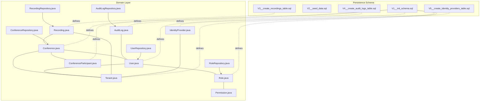
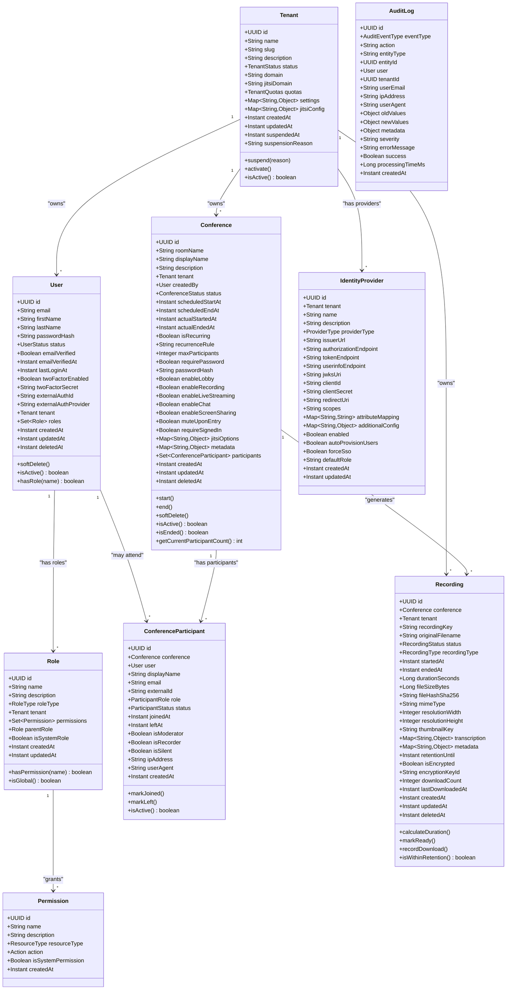
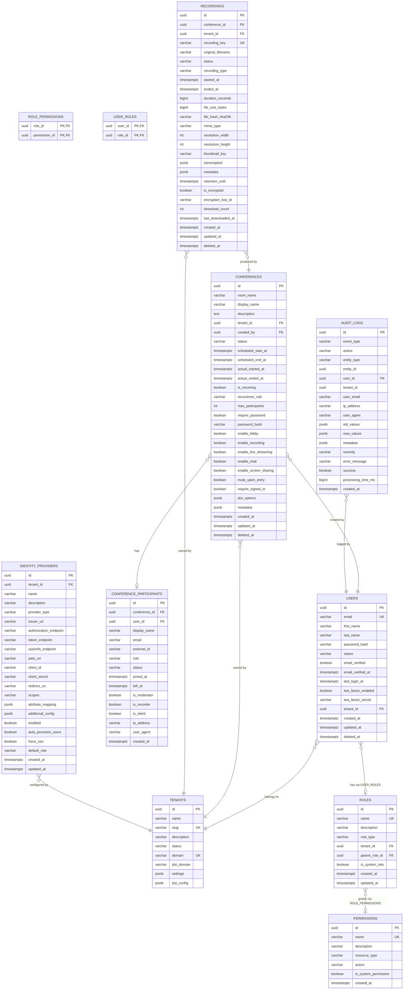

# Core Entities

<cite>
**Referenced Files in This Document**
- [User.java](file://jmp-domain/src/main/java/com/jmp/domain/entity/User.java)
- [Conference.java](file://jmp-domain/src/main/java/com/jmp/domain/entity/Conference.java)
- [Recording.java](file://jmp-domain/src/main/java/com/jmp/domain/entity/Recording.java)
- [AuditLog.java](file://jmp-domain/src/main/java/com/jmp/domain/entity/AuditLog.java)
- [Tenant.java](file://jmp-domain/src/main/java/com/jmp/domain/entity/Tenant.java)
- [Role.java](file://jmp-domain/src/main/java/com/jmp/domain/entity/Role.java)
- [Permission.java](file://jmp-domain/src/main/java/com/jmp/domain/entity/Permission.java)
- [IdentityProvider.java](file://jmp-domain/src/main/java/com/jmp/domain/entity/IdentityProvider.java)
- [ConferenceParticipant.java](file://jmp-domain/src/main/java/com/jmp/domain/entity/ConferenceParticipant.java)
- [UserRepository.java](file://jmp-domain/src/main/java/com/jmp/domain/repository/UserRepository.java)
- [ConferenceRepository.java](file://jmp-domain/src/main/java/com/jmp/domain/repository/ConferenceRepository.java)
- [RecordingRepository.java](file://jmp-domain/src/main/java/com/jmp/domain/repository/RecordingRepository.java)
- [AuditLogRepository.java](file://jmp-domain/src/main/java/com/jmp/domain/repository/AuditLogRepository.java)
- [RoleRepository.java](file://jmp-domain/src/main/java/com/jmp/domain/repository/RoleRepository.java)
- [V1__init_schema.sql](file://jmp-web/src/main/resources/db/migration/V1__init_schema.sql)
- [V2__seed_data.sql](file://jmp-web/src/main/resources/db/migration/V2__seed_data.sql)
- [V3__create_recordings_table.sql](file://jmp-web/src/main/resources/db/migration/V3__create_recordings_table.sql)
- [V4__create_audit_logs_table.sql](file://jmp-web/src/main/resources/db/migration/V4__create_audit_logs_table.sql)
- [V5__create_identity_providers_table.sql](file://jmp-web/src/main/resources/db/migration/V5__create_identity_providers_table.sql)
</cite>

## Table of Contents
1. [Introduction](#introduction)
2. [Project Structure](#project-structure)
3. [Core Components](#core-components)
4. [Architecture Overview](#architecture-overview)
5. [Detailed Component Analysis](#detailed-component-analysis)
6. [Dependency Analysis](#dependency-analysis)
7. [Performance Considerations](#performance-considerations)
8. [Troubleshooting Guide](#troubleshooting-guide)
9. [Conclusion](#conclusion)
10. [Appendices](#appendices)

## Introduction
This document describes the Core Entities of the Jitsi Management Platform domain layer. It focuses on the persistent JPA entities that model the platform’s business domain: User, Conference, Recording, AuditLog, Tenant, Role, Permission, IdentityProvider, and ConferenceParticipant. For each entity, we explain JPA annotations, field definitions, business significance, validation rules, lifecycle management, and relationships with foreign keys and cardinalities. We also document immutable-like value objects (Role and Permission) that encapsulate business logic, and show how entities enforce business rules and maintain data integrity.

## Project Structure
The domain layer is organized around entities, repositories, and value objects. Entities are annotated for JPA persistence and audited automatically. Repositories define typed queries and EntityGraph loading strategies to optimize access patterns.

**Diagram sources**
- [User.java:23-164](file://jmp-domain/src/main/java/com/jmp/domain/entity/User.java#L23-L164)
- [Conference.java:25-217](file://jmp-domain/src/main/java/com/jmp/domain/entity/Conference.java#L25-L217)
- [Recording.java:24-203](file://jmp-domain/src/main/java/com/jmp/domain/entity/Recording.java#L24-L203)
- [AuditLog.java:20-136](file://jmp-domain/src/main/java/com/jmp/domain/entity/AuditLog.java#L20-L136)
- [Tenant.java:24-174](file://jmp-domain/src/main/java/com/jmp/domain/entity/Tenant.java#L24-L174)
- [Role.java:22-131](file://jmp-domain/src/main/java/com/jmp/domain/entity/Role.java#L22-L131)
- [Permission.java:18-128](file://jmp-domain/src/main/java/com/jmp/domain/entity/Permission.java#L18-L128)
- [IdentityProvider.java:23-158](file://jmp-domain/src/main/java/com/jmp/domain/entity/IdentityProvider.java#L23-L158)
- [ConferenceParticipant.java:18-150](file://jmp-domain/src/main/java/com/jmp/domain/entity/ConferenceParticipant.java#L18-L150)
- [UserRepository.java:18-82](file://jmp-domain/src/main/java/com/jmp/domain/repository/UserRepository.java#L18-L82)
- [ConferenceRepository.java:20-110](file://jmp-domain/src/main/java/com/jmp/domain/repository/ConferenceRepository.java#L20-L110)
- [RecordingRepository.java:19-100](file://jmp-domain/src/main/java/com/jmp/domain/repository/RecordingRepository.java#L19-L100)
- [AuditLogRepository.java:18-85](file://jmp-domain/src/main/java/com/jmp/domain/repository/AuditLogRepository.java#L18-L85)
- [RoleRepository.java:13-20](file://jmp-domain/src/main/java/com/jmp/domain/repository/RoleRepository.java#L13-L20)
- [V1__init_schema.sql:10-172](file://jmp-web/src/main/resources/db/migration/V1__init_schema.sql#L10-L172)
- [V2__seed_data.sql:4-131](file://jmp-web/src/main/resources/db/migration/V2__seed_data.sql#L4-L131)
- [V3__create_recordings_table.sql:4-43](file://jmp-web/src/main/resources/db/migration/V3__create_recordings_table.sql#L4-L43)
- [V4__create_audit_logs_table.sql:4-36](file://jmp-web/src/main/resources/db/migration/V4__create_audit_logs_table.sql#L4-L36)
- [V5__create_identity_providers_table.sql:4-45](file://jmp-web/src/main/resources/db/migration/V5__create_identity_providers_table.sql#L4-L45)

**Section sources**
- [User.java:23-164](file://jmp-domain/src/main/java/com/jmp/domain/entity/User.java#L23-L164)
- [Conference.java:25-217](file://jmp-domain/src/main/java/com/jmp/domain/entity/Conference.java#L25-L217)
- [Recording.java:24-203](file://jmp-domain/src/main/java/com/jmp/domain/entity/Recording.java#L24-L203)
- [AuditLog.java:20-136](file://jmp-domain/src/main/java/com/jmp/domain/entity/AuditLog.java#L20-L136)
- [Tenant.java:24-174](file://jmp-domain/src/main/java/com/jmp/domain/entity/Tenant.java#L24-L174)
- [Role.java:22-131](file://jmp-domain/src/main/java/com/jmp/domain/entity/Role.java#L22-L131)
- [Permission.java:18-128](file://jmp-domain/src/main/java/com/jmp/domain/entity/Permission.java#L18-L128)
- [IdentityProvider.java:23-158](file://jmp-domain/src/main/java/com/jmp/domain/entity/IdentityProvider.java#L23-L158)
- [ConferenceParticipant.java:18-150](file://jmp-domain/src/main/java/com/jmp/domain/entity/ConferenceParticipant.java#L18-L150)
- [V1__init_schema.sql:10-172](file://jmp-web/src/main/resources/db/migration/V1__init_schema.sql#L10-L172)
- [V2__seed_data.sql:4-131](file://jmp-web/src/main/resources/db/migration/V2__seed_data.sql#L4-L131)
- [V3__create_recordings_table.sql:4-43](file://jmp-web/src/main/resources/db/migration/V3__create_recordings_table.sql#L4-L43)
- [V4__create_audit_logs_table.sql:4-36](file://jmp-web/src/main/resources/db/migration/V4__create_audit_logs_table.sql#L4-L36)
- [V5__create_identity_providers_table.sql:4-45](file://jmp-web/src/main/resources/db/migration/V5__create_identity_providers_table.sql#L4-L45)

## Core Components
This section summarizes each entity’s purpose, annotations, key fields, and business significance.

- User
  - Purpose: Represents a platform user scoped to a Tenant with RBAC via Roles. Supports soft-delete and status lifecycle.
  - Key fields: email (unique), firstName, lastName, passwordHash, status, tenant (many-to-one), roles (many-to-many), externalAuthId/provider, two-factor fields, timestamps.
  - Lifecycle: softDelete(), isActive(), hasRole().
  - Validation: @NotNull, @Email, @Size constraints; unique email enforced by schema.

- Conference
  - Purpose: Represents a Jitsi conference room with scheduling, options, and participant tracking.
  - Key fields: roomName, displayName, description, tenant (many-to-one), createdBy (many-to-one), status, scheduling timestamps, flags (password, lobby, recording, streaming), jitsiOptions/metadata, participants (one-to-many).
  - Lifecycle: start(), end(), softDelete(), isActive(), isEnded(), getCurrentParticipantCount().
  - Validation: @NotNull, @Size; unique roomName per tenant enforced by composite index.

- Recording
  - Purpose: Stores metadata and lifecycle for conference recordings.
  - Key fields: recordingKey (unique), originalFilename, status, recordingType, timestamps, duration, file metrics, encryption flags, thumbnails, transcription/metadata, retention, download stats.
  - Lifecycle: calculateDuration(), markReady(), recordDownload(), isWithinRetention().
  - Validation: @NotNull, @Size; unique recordingKey enforced by schema.

- AuditLog
  - Purpose: Captures system events with context (user, tenant, IP, agent, payload diffs).
  - Key fields: eventType, action, entityType/entityId, user (optional), tenantId, identifiers, ip/userAgent, old/new values, metadata, severity, error message, success, processing time, timestamps.
  - Validation: @NotNull, @Size; JSONB fields for structured data.

- Tenant
  - Purpose: Multi-tenant isolation with quotas and settings.
  - Key fields: name (unique), slug (unique), description, status, domain (unique), jitsiDomain, quotas (embedded), settings/jitsiConfig, suspension fields.
  - Lifecycle: suspend(reason), activate(), isActive().
  - Validation: @NotNull, @Size; embedded quotas with feature gating.

- Role
  - Purpose: RBAC role with hierarchy and permissions; supports global/system roles.
  - Key fields: name (unique), description, roleType, tenant (optional), permissions (many-to-many), parentRole, isSystemRole.
  - Business logic: hasPermission(), isGlobal().
  - Validation: @NotNull, @Size; unique name; parent role self-reference.

- Permission
  - Purpose: Fine-grained permission with resource/action semantics; supports ABAC-style attributes.
  - Key fields: name (unique), description, resourceType, action, isSystemPermission.
  - Constants: predefined permission names for common CRUD and management actions.
  - Validation: @NotNull, @Size; unique name.

- IdentityProvider
  - Purpose: SSO/OIDC provider configuration per tenant.
  - Key fields: tenant (many-to-one), name, description, providerType, endpoints, client credentials, scopes, attribute mapping, additional config, flags (enabled, auto-provision, force SSO), default role.
  - Validation: @NotNull, @Size; JSONB fields; unique tenant+name enforced by composite index.

- ConferenceParticipant
  - Purpose: Tracks who joins a conference, their role/status, and connection details.
  - Key fields: conference (many-to-one), user (optional), displayName, email, externalId, role, status, joined/left timestamps, flags, ip/userAgent.
  - Lifecycle: markJoined(), markLeft(), isActive().
  - Validation: @NotNull, @Size; optional user for guests.

**Section sources**
- [User.java:23-164](file://jmp-domain/src/main/java/com/jmp/domain/entity/User.java#L23-L164)
- [Conference.java:25-217](file://jmp-domain/src/main/java/com/jmp/domain/entity/Conference.java#L25-L217)
- [Recording.java:24-203](file://jmp-domain/src/main/java/com/jmp/domain/entity/Recording.java#L24-L203)
- [AuditLog.java:20-136](file://jmp-domain/src/main/java/com/jmp/domain/entity/AuditLog.java#L20-L136)
- [Tenant.java:24-174](file://jmp-domain/src/main/java/com/jmp/domain/entity/Tenant.java#L24-L174)
- [Role.java:22-131](file://jmp-domain/src/main/java/com/jmp/domain/entity/Role.java#L22-L131)
- [Permission.java:18-128](file://jmp-domain/src/main/java/com/jmp/domain/entity/Permission.java#L18-L128)
- [IdentityProvider.java:23-158](file://jmp-domain/src/main/java/com/jmp/domain/entity/IdentityProvider.java#L23-L158)
- [ConferenceParticipant.java:18-150](file://jmp-domain/src/main/java/com/jmp/domain/entity/ConferenceParticipant.java#L18-L150)

## Architecture Overview
The entities form a cohesive domain model with clear ownership and cascading behavior. Tenants own Users and Conferences. Conferences own Participants and Recordings. Users may be linked to Participants. Roles and Permissions underpin access control. Audit logs capture cross-cutting events.

**Diagram sources**
- [User.java:28-164](file://jmp-domain/src/main/java/com/jmp/domain/entity/User.java#L28-L164)
- [Conference.java:30-217](file://jmp-domain/src/main/java/com/jmp/domain/entity/Conference.java#L30-L217)
- [Recording.java:29-203](file://jmp-domain/src/main/java/com/jmp/domain/entity/Recording.java#L29-L203)
- [AuditLog.java:25-136](file://jmp-domain/src/main/java/com/jmp/domain/entity/AuditLog.java#L25-L136)
- [Tenant.java:29-174](file://jmp-domain/src/main/java/com/jmp/domain/entity/Tenant.java#L29-L174)
- [Role.java:27-131](file://jmp-domain/src/main/java/com/jmp/domain/entity/Role.java#L27-L131)
- [Permission.java:23-128](file://jmp-domain/src/main/java/com/jmp/domain/entity/Permission.java#L23-L128)
- [IdentityProvider.java:28-158](file://jmp-domain/src/main/java/com/jmp/domain/entity/IdentityProvider.java#L28-L158)
- [ConferenceParticipant.java:23-150](file://jmp-domain/src/main/java/com/jmp/domain/entity/ConferenceParticipant.java#L23-L150)

## Detailed Component Analysis

### User
- JPA annotations: @Entity, @Table(schema="jmp"), @EntityListeners(AuditingEntityListener), @Getter/@Setter, @NotNull/@Email/@Size, @CreationTimestamp/@LastModificationTimestamp.
- Fields: id (UUID), email (unique), personal info, passwordHash, status with defaults, verification flags/timestamps, 2FA fields, external auth identifiers, tenant (many-to-one), roles (many-to-many), createdAt/updatedAt/deletedAt.
- Relationships: belongs to Tenant; many-to-many with Role via user_roles junction; participates in ConferenceParticipant.
- Business rules: soft-delete sets deletedAt and status; isActive requires ACTIVE and not deleted; hasRole checks role name membership.
- Validation: email uniqueness enforced by schema; size limits; not-null constraints; tenant required.

**Section sources**
- [User.java:23-164](file://jmp-domain/src/main/java/com/jmp/domain/entity/User.java#L23-L164)
- [V1__init_schema.sql:63-87](file://jmp-web/src/main/resources/db/migration/V1__init_schema.sql#L63-L87)
- [UserRepository.java:18-82](file://jmp-domain/src/main/java/com/jmp/domain/repository/UserRepository.java#L18-L82)

### Conference
- JPA annotations: @Entity, @Table(schema="jmp"), @EntityListeners(AuditingEntityListener), @JdbcTypeCode(Json), @Enumerated.
- Fields: id, roomName (unique per tenant), displayName, description, tenant (many-to-one), createdBy (many-to-one), status with defaults, scheduling timestamps, flags for features, jitsiOptions/metadata, participants (one-to-many), createdAt/updatedAt/deletedAt.
- Relationships: owned by Tenant; owned by User (creator); owns ConferenceParticipant; produces Recording.
- Business rules: start()/end() set status and timestamps; softDelete cancels; isActive/isEnded compute state; participant counting filters by JOINED.
- Validation: not-null room/display name; size limits; composite unique index on roomName+tenant.

**Section sources**
- [Conference.java:25-217](file://jmp-domain/src/main/java/com/jmp/domain/entity/Conference.java#L25-L217)
- [V1__init_schema.sql:89-139](file://jmp-web/src/main/resources/db/migration/V1__init_schema.sql#L89-L139)
- [ConferenceRepository.java:20-110](file://jmp-domain/src/main/java/com/jmp/domain/repository/ConferenceRepository.java#L20-L110)

### Recording
- JPA annotations: @Entity, @Table(schema="jmp"), @EntityListeners(AuditingEntityListener), @JdbcTypeCode(Json).
- Fields: id, conference (many-to-one), tenant (many-to-one), recordingKey (unique), metadata (transcription/metadata), status/type, timestamps, duration/file metrics, encryption fields, thumbnail, retention, download counters.
- Relationships: belongs to Conference and Tenant; one Recording per conference session.
- Business rules: calculateDuration() computes seconds from start/end; markReady() transitions to READY and recalculates; recordDownload() increments counters; isWithinRetention() checks retention window.
- Validation: not-null status/type; unique recordingKey; JSONB fields; size limits.

**Section sources**
- [Recording.java:24-203](file://jmp-domain/src/main/java/com/jmp/domain/entity/Recording.java#L24-L203)
- [V3__create_recordings_table.sql:4-43](file://jmp-web/src/main/resources/db/migration/V3__create_recordings_table.sql#L4-L43)
- [RecordingRepository.java:19-100](file://jmp-domain/src/main/java/com/jmp/domain/repository/RecordingRepository.java#L19-L100)

### AuditLog
- JPA annotations: @Entity, @Table(schema="jmp"), @EntityListeners(AuditingEntityListener), @JdbcTypeCode(Json).
- Fields: id, eventType, action, entityType/entityId, user (optional), tenantId, identifiers, ip/userAgent, old/new values, metadata, severity, error message, success flag, processing time, createdAt.
- Relationships: optional user reference; aggregates system-wide events.
- Business rules: captures pre/post state diffs; severity and success flags; supports filtering by tenant, user, event type, and date ranges.
- Validation: not-null eventType/action; size limits; JSONB fields.

**Section sources**
- [AuditLog.java:20-136](file://jmp-domain/src/main/java/com/jmp/domain/entity/AuditLog.java#L20-L136)
- [V4__create_audit_logs_table.sql:4-36](file://jmp-web/src/main/resources/db/migration/V4__create_audit_logs_table.sql#L4-L36)
- [AuditLogRepository.java:18-85](file://jmp-domain/src/main/java/com/jmp/domain/repository/AuditLogRepository.java#L18-L85)

### Tenant
- JPA annotations: @Entity, @Table(schema="jmp"), @EntityListeners(AuditingEntityListener), @JdbcTypeCode(Json), @Embedded.
- Fields: id, name (unique), slug (unique), description, status, domain (unique), jitsiDomain, quotas (embedded), settings/jitsiConfig, suspension fields, createdAt/updatedAt/suspendedAt.
- Relationships: owns Users, Conferences, Recordings, IdentityProviders.
- Business rules: suspend()/activate() manage status and suspension metadata; isActive() checks status.
- Validation: not-null name/slug; unique constraints; embedded quotas with feature gating.

**Section sources**
- [Tenant.java:24-174](file://jmp-domain/src/main/java/com/jmp/domain/entity/Tenant.java#L24-L174)
- [V1__init_schema.sql:10-30](file://jmp-web/src/main/resources/db/migration/V1__init_schema.sql#L10-L30)

### Role
- JPA annotations: @Entity, @Table(schema="jmp"), @EntityListeners(AuditingEntityListener), @ManyToMany(fetch=EAGER).
- Fields: id, name (unique), description, roleType, tenant (optional), permissions (many-to-many), parentRole (self-referencing), isSystemRole, createdAt/updatedAt.
- Relationships: many-to-many with Permission; many-to-one with Tenant; hierarchical parent relationship.
- Business logic: hasPermission() checks permission membership; isGlobal() indicates tenant-less role.
- Validation: not-null name/type; unique name; parent role self-reference.

**Section sources**
- [Role.java:22-131](file://jmp-domain/src/main/java/com/jmp/domain/entity/Role.java#L22-L131)
- [V1__init_schema.sql:43-61](file://jmp-web/src/main/resources/db/migration/V1__init_schema.sql#L43-L61)
- [RoleRepository.java:13-20](file://jmp-domain/src/main/java/com/jmp/domain/repository/RoleRepository.java#L13-L20)

### Permission
- JPA annotations: @Entity, @Table(schema="jmp"), @EntityListeners(AuditingEntityListener).
- Fields: id, name (unique), description, resourceType, action, isSystemPermission, createdAt.
- Business logic: predefined constants for standard CRUD and management actions; supports ABAC via resource/action semantics.
- Validation: not-null name/resourceType/action; unique name.

**Section sources**
- [Permission.java:18-128](file://jmp-domain/src/main/java/com/jmp/domain/entity/Permission.java#L18-L128)
- [V2__seed_data.sql:13-40](file://jmp-web/src/main/resources/db/migration/V2__seed_data.sql#L13-L40)

### IdentityProvider
- JPA annotations: @Entity, @Table(schema="jmp"), @EntityListeners(AuditingEntityListener), @JdbcTypeCode(Json).
- Fields: id, tenant (many-to-one), name, description, providerType, endpoints, client credentials, redirect URI, scopes, attribute mapping, additional config, flags, default role, createdAt/updatedAt.
- Relationships: belongs to Tenant; enables SSO/OIDC per tenant.
- Validation: not-null provider fields; unique tenant+name; JSONB fields; size limits.

**Section sources**
- [IdentityProvider.java:23-158](file://jmp-domain/src/main/java/com/jmp/domain/entity/IdentityProvider.java#L23-L158)
- [V5__create_identity_providers_table.sql:4-45](file://jmp-web/src/main/resources/db/migration/V5__create_identity_providers_table.sql#L4-L45)

### ConferenceParticipant
- JPA annotations: @Entity, @Table(schema="jmp"), @EntityListeners(AuditingEntityListener).
- Fields: id, conference (many-to-one), user (optional), displayName/email, externalId, role, status, joined/left timestamps, flags, ip/userAgent, createdAt.
- Relationships: belongs to Conference; optionally belongs to User (guests supported).
- Business rules: markJoined()/markLeft() update status and timestamps; isActive() checks JOINED.
- Validation: not-null role/status; size limits.

**Section sources**
- [ConferenceParticipant.java:18-150](file://jmp-domain/src/main/java/com/jmp/domain/entity/ConferenceParticipant.java#L18-L150)
- [V1__init_schema.sql:121-139](file://jmp-web/src/main/resources/db/migration/V1__init_schema.sql#L121-L139)

## Dependency Analysis
This section maps entity dependencies and foreign keys defined in the schema migrations.

**Diagram sources**
- [V1__init_schema.sql:10-172](file://jmp-web/src/main/resources/db/migration/V1__init_schema.sql#L10-L172)
- [V3__create_recordings_table.sql:4-43](file://jmp-web/src/main/resources/db/migration/V3__create_recordings_table.sql#L4-L43)
- [V4__create_audit_logs_table.sql:4-36](file://jmp-web/src/main/resources/db/migration/V4__create_audit_logs_table.sql#L4-L36)
- [V5__create_identity_providers_table.sql:4-45](file://jmp-web/src/main/resources/db/migration/V5__create_identity_providers_table.sql#L4-L45)

**Section sources**
- [V1__init_schema.sql:10-172](file://jmp-web/src/main/resources/db/migration/V1__init_schema.sql#L10-L172)
- [V2__seed_data.sql:4-131](file://jmp-web/src/main/resources/db/migration/V2__seed_data.sql#L4-L131)
- [V3__create_recordings_table.sql:4-43](file://jmp-web/src/main/resources/db/migration/V3__create_recordings_table.sql#L4-L43)
- [V4__create_audit_logs_table.sql:4-36](file://jmp-web/src/main/resources/db/migration/V4__create_audit_logs_table.sql#L4-L36)
- [V5__create_identity_providers_table.sql:4-45](file://jmp-web/src/main/resources/db/migration/V5__create_identity_providers_table.sql#L4-L45)

## Performance Considerations
- Indexes and unique constraints are defined in schema migrations to optimize frequent queries:
  - Users: email, tenant, status, plus composite external auth index.
  - Tenants: slug, domain, status.
  - Conferences: tenant, status, created_by, scheduled range, room_name unique per tenant.
  - Participants: conference, user, status.
  - Recordings: conference, tenant, status, retention, created desc, tenant+status.
  - Audit logs: tenant, user, event_type, entity, created desc, tenant+created desc, success=false filter.
  - Identity providers: tenant, enabled, tenant+name unique.
- EntityGraph usage in repositories reduces N+1 selects for related entities during reads.

[No sources needed since this section provides general guidance]

## Troubleshooting Guide
- Soft-deleted records:
  - User and Conference include deletedAt and status transitions on softDelete(); queries commonly filter by deletedAt IS NULL to exclude soft-deleted rows.
- Status transitions:
  - Conference lifecycle: SCHEDULED → ACTIVE → ENDED/CANCELLED; use start()/end() helpers to maintain correctness.
  - Recording lifecycle: PENDING → PROCESSING → READY/FAILED/ARCHIVED/DELETED; use markReady() to finalize.
- Access control:
  - Role.hasPermission() and Permission constants help validate authorizations; ensure permissions are seeded and roles assigned.
- Audit trails:
  - Use AuditLogRepository search filters and security event queries to investigate failures and suspicious activity.

**Section sources**
- [User.java:112-122](file://jmp-domain/src/main/java/com/jmp/domain/entity/User.java#L112-L122)
- [Conference.java:140-159](file://jmp-domain/src/main/java/com/jmp/domain/entity/Conference.java#L140-L159)
- [Recording.java:140-151](file://jmp-domain/src/main/java/com/jmp/domain/entity/Recording.java#L140-L151)
- [AuditLogRepository.java:44-70](file://jmp-domain/src/main/java/com/jmp/domain/repository/AuditLogRepository.java#L44-L70)
- [V2__seed_data.sql:42-95](file://jmp-web/src/main/resources/db/migration/V2__seed_data.sql#L42-L95)

## Conclusion
The Core Entities form a robust, validated, and audited domain model for the Jitsi Management Platform. They enforce business rules through lifecycle methods, immutability-like value objects (Role and Permission), and schema-level constraints. Repositories complement entities with optimized queries and eager loading strategies. Together, they ensure data integrity, tenant isolation, and scalable access control.

[No sources needed since this section summarizes without analyzing specific files]

## Appendices

### Entity Creation, Modification, and Deletion Patterns
- User
  - Creation: set email, names, tenant, optional roles; persist; verify email and 2FA flags as needed.
  - Modification: update personal info, status, and flags; use isActive() for access checks.
  - Deletion: softDelete() to mark deletedAt and status; keep for auditability.
- Conference
  - Creation: set roomName, tenant, createdBy; schedule or start as needed; enable features via flags.
  - Modification: adjust scheduling, options, and participant policies; track participant counts.
  - Deletion: softDelete() to cancel; rely on status transitions for lifecycle.
- Recording
  - Creation: associate with Conference and Tenant; set recordingKey; process and markReady().
  - Modification: update metadata, retention, and download stats; calculateDuration() post-fact.
  - Deletion: softDelete() to archive; enforce retention policies via isWithinRetention().
- AuditLog
  - Creation: capture event context; include old/new values for diffs; set severity and success.
- Tenant
  - Creation: set quotas and settings; activate(); suspend() with reason for governance.
- Role and Permission
  - Creation: seed predefined roles and permissions; assign via role_permissions; check hasPermission() for runtime decisions.
- IdentityProvider
  - Creation: configure endpoints and credentials; enable/disable; map attributes; set default role.
- ConferenceParticipant
  - Creation: link to Conference and optional User; set role/status; markJoined()/markLeft() on events.

**Section sources**
- [User.java:112-130](file://jmp-domain/src/main/java/com/jmp/domain/entity/User.java#L112-L130)
- [Conference.java:140-184](file://jmp-domain/src/main/java/com/jmp/domain/entity/Conference.java#L140-L184)
- [Recording.java:131-161](file://jmp-domain/src/main/java/com/jmp/domain/entity/Recording.java#L131-L161)
- [AuditLog.java:25-136](file://jmp-domain/src/main/java/com/jmp/domain/entity/AuditLog.java#L25-L136)
- [Tenant.java:92-112](file://jmp-domain/src/main/java/com/jmp/domain/entity/Tenant.java#L92-L112)
- [Role.java:79-89](file://jmp-domain/src/main/java/com/jmp/domain/entity/Role.java#L79-L89)
- [Permission.java:100-127](file://jmp-domain/src/main/java/com/jmp/domain/entity/Permission.java#L100-L127)
- [IdentityProvider.java:28-158](file://jmp-domain/src/main/java/com/jmp/domain/entity/IdentityProvider.java#L28-L158)
- [ConferenceParticipant.java:91-109](file://jmp-domain/src/main/java/com/jmp/domain/entity/ConferenceParticipant.java#L91-L109)

### Validation Rules and Business Constraints
- Not-null constraints on critical fields (e.g., email, names, status, room/display names).
- Size limits for strings to prevent overflow.
- Unique constraints enforced by schema:
  - Users.email
  - Tenants.name, slug, domain
  - Conferences.roomName (per tenant)
  - Recordings.recordingKey
  - IdentityProviders.tenant+name
- Enumerations constrain allowable values for status, role types, actions, and resource types.
- Embedded TenantQuotas gate features and capacity.

**Section sources**
- [V1__init_schema.sql:140-163](file://jmp-web/src/main/resources/db/migration/V1__init_schema.sql#L140-L163)
- [V3__create_recordings_table.sql:8-30](file://jmp-web/src/main/resources/db/migration/V3__create_recordings_table.sql#L8-L30)
- [V5__create_identity_providers_table.sql:33-34](file://jmp-web/src/main/resources/db/migration/V5__create_identity_providers_table.sql#L33-L34)