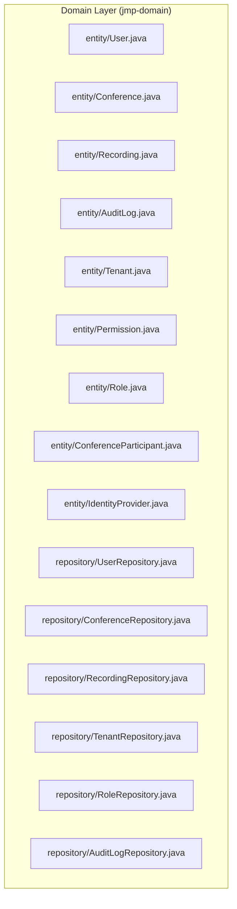
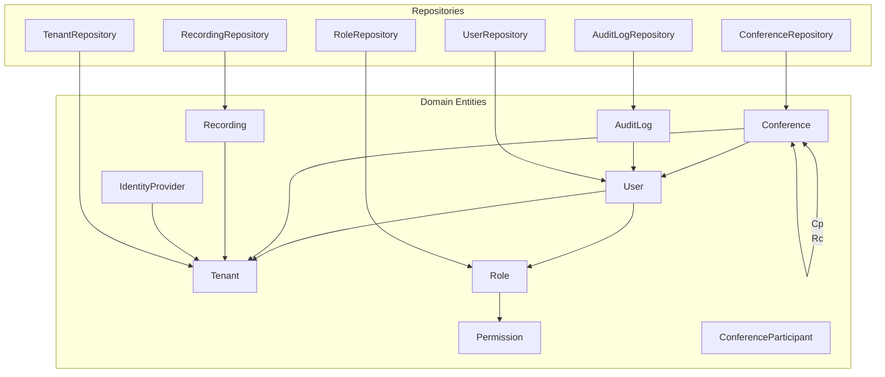
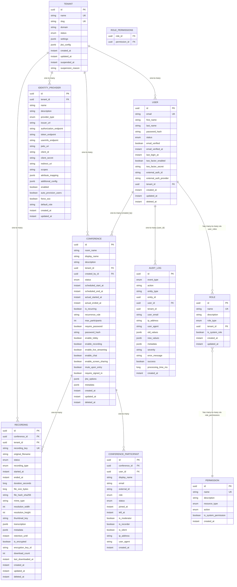
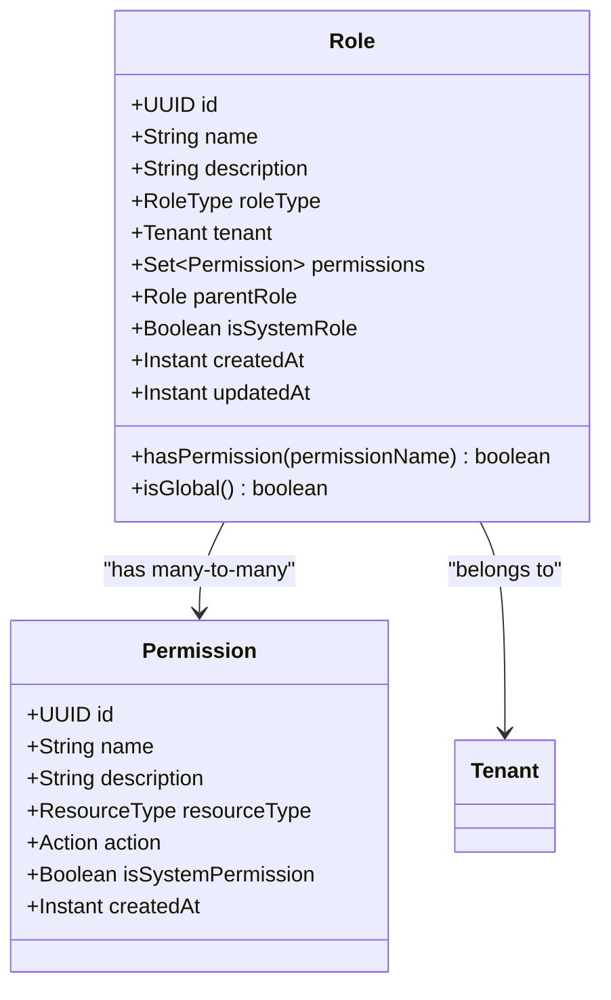
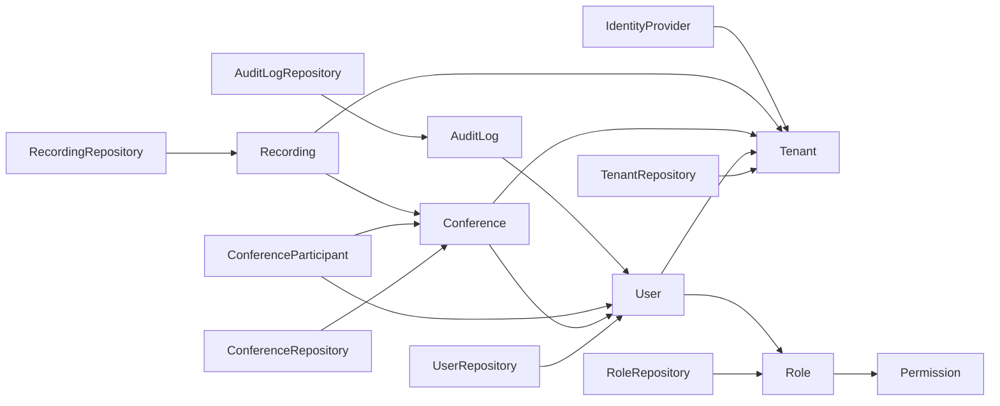

# Domain Layer

<cite>
**Referenced Files in This Document**
- [User.java](file://jmp-domain/src/main/java/com/jmp/domain/entity/User.java)
- [Conference.java](file://jmp-domain/src/main/java/com/jmp/domain/entity/Conference.java)
- [Recording.java](file://jmp-domain/src/main/java/com/jmp/domain/entity/Recording.java)
- [AuditLog.java](file://jmp-domain/src/main/java/com/jmp/domain/entity/AuditLog.java)
- [Tenant.java](file://jmp-domain/src/main/java/com/jmp/domain/entity/Tenant.java)
- [Permission.java](file://jmp-domain/src/main/java/com/jmp/domain/entity/Permission.java)
- [Role.java](file://jmp-domain/src/main/java/com/jmp/domain/entity/Role.java)
- [ConferenceParticipant.java](file://jmp-domain/src/main/java/com/jmp/domain/entity/ConferenceParticipant.java)
- [IdentityProvider.java](file://jmp-domain/src/main/java/com/jmp/domain/entity/IdentityProvider.java)
- [UserRepository.java](file://jmp-domain/src/main/java/com/jmp/domain/repository/UserRepository.java)
- [ConferenceRepository.java](file://jmp-domain/src/main/java/com/jmp/domain/repository/ConferenceRepository.java)
- [RecordingRepository.java](file://jmp-domain/src/main/java/com/jmp/domain/repository/RecordingRepository.java)
- [TenantRepository.java](file://jmp-domain/src/main/java/com/jmp/domain/repository/TenantRepository.java)
- [RoleRepository.java](file://jmp-domain/src/main/java/com/jmp/domain/repository/RoleRepository.java)
- [AuditLogRepository.java](file://jmp-domain/src/main/java/com/jmp/domain/repository/AuditLogRepository.java)
</cite>

## Table of Contents
1. [Introduction](#introduction)
2. [Project Structure](#project-structure)
3. [Core Components](#core-components)
4. [Architecture Overview](#architecture-overview)
5. [Detailed Component Analysis](#detailed-component-analysis)
6. [Dependency Analysis](#dependency-analysis)
7. [Performance Considerations](#performance-considerations)
8. [Troubleshooting Guide](#troubleshooting-guide)
9. [Conclusion](#conclusion)

## Introduction
This document describes the Domain Layer of the Jitsi Management Platform. It focuses on the core business entities (User, Conference, Recording, AuditLog, and Tenant), their JPA annotations and relationships, Spring Data JPA repositories, value objects (Permission and Role), validation rules, business constraints, immutability patterns, lifecycle management, and data integrity enforcement. It also presents an entity relationship diagram and practical examples of domain-specific operations and validation scenarios.

## Project Structure
The Domain Layer resides under jmp-domain/src/main/java/com/jmp/domain and is organized by packages:
- entity: Business entities and value objects
- repository: Spring Data JPA repositories for data access
- event: Domain events (not analyzed here)
- exception: Domain exceptions (not analyzed here)
- valueobject: Additional value objects (none present in the referenced files)

**Diagram sources**
- [User.java:1-164](file://jmp-domain/src/main/java/com/jmp/domain/entity/User.java#L1-L164)
- [Conference.java:1-217](file://jmp-domain/src/main/java/com/jmp/domain/entity/Conference.java#L1-L217)
- [Recording.java:1-203](file://jmp-domain/src/main/java/com/jmp/domain/entity/Recording.java#L1-L203)
- [AuditLog.java:1-136](file://jmp-domain/src/main/java/com/jmp/domain/entity/AuditLog.java#L1-L136)
- [Tenant.java:1-174](file://jmp-domain/src/main/java/com/jmp/domain/entity/Tenant.java#L1-L174)
- [Permission.java:1-128](file://jmp-domain/src/main/java/com/jmp/domain/entity/Permission.java#L1-L128)
- [Role.java:1-131](file://jmp-domain/src/main/java/com/jmp/domain/entity/Role.java#L1-L131)
- [ConferenceParticipant.java:1-150](file://jmp-domain/src/main/java/com/jmp/domain/entity/ConferenceParticipant.java#L1-L150)
- [IdentityProvider.java:1-158](file://jmp-domain/src/main/java/com/jmp/domain/entity/IdentityProvider.java#L1-L158)
- [UserRepository.java:1-82](file://jmp-domain/src/main/java/com/jmp/domain/repository/UserRepository.java#L1-L82)
- [ConferenceRepository.java:1-110](file://jmp-domain/src/main/java/com/jmp/domain/repository/ConferenceRepository.java#L1-L110)
- [RecordingRepository.java:1-100](file://jmp-domain/src/main/java/com/jmp/domain/repository/RecordingRepository.java#L1-L100)
- [TenantRepository.java:1-64](file://jmp-domain/src/main/java/com/jmp/domain/repository/TenantRepository.java#L1-L64)
- [RoleRepository.java:1-20](file://jmp-domain/src/main/java/com/jmp/domain/repository/RoleRepository.java#L1-L20)
- [AuditLogRepository.java:1-85](file://jmp-domain/src/main/java/com/jmp/domain/repository/AuditLogRepository.java#L1-L85)

**Section sources**
- [User.java:1-164](file://jmp-domain/src/main/java/com/jmp/domain/entity/User.java#L1-L164)
- [Conference.java:1-217](file://jmp-domain/src/main/java/com/jmp/domain/entity/Conference.java#L1-L217)
- [Recording.java:1-203](file://jmp-domain/src/main/java/com/jmp/domain/entity/Recording.java#L1-L203)
- [AuditLog.java:1-136](file://jmp-domain/src/main/java/com/jmp/domain/entity/AuditLog.java#L1-L136)
- [Tenant.java:1-174](file://jmp-domain/src/main/java/com/jmp/domain/entity/Tenant.java#L1-L174)
- [Permission.java:1-128](file://jmp-domain/src/main/java/com/jmp/domain/entity/Permission.java#L1-L128)
- [Role.java:1-131](file://jmp-domain/src/main/java/com/jmp/domain/entity/Role.java#L1-L131)
- [ConferenceParticipant.java:1-150](file://jmp-domain/src/main/java/com/jmp/domain/entity/ConferenceParticipant.java#L1-L150)
- [IdentityProvider.java:1-158](file://jmp-domain/src/main/java/com/jmp/domain/entity/IdentityProvider.java#L1-L158)
- [UserRepository.java:1-82](file://jmp-domain/src/main/java/com/jmp/domain/repository/UserRepository.java#L1-L82)
- [ConferenceRepository.java:1-110](file://jmp-domain/src/main/java/com/jmp/domain/repository/ConferenceRepository.java#L1-L110)
- [RecordingRepository.java:1-100](file://jmp-domain/src/main/java/com/jmp/domain/repository/RecordingRepository.java#L1-L100)
- [TenantRepository.java:1-64](file://jmp-domain/src/main/java/com/jmp/domain/repository/TenantRepository.java#L1-L64)
- [RoleRepository.java:1-20](file://jmp-domain/src/main/java/com/jmp/domain/repository/RoleRepository.java#L1-L20)
- [AuditLogRepository.java:1-85](file://jmp-domain/src/main/java/com/jmp/domain/repository/AuditLogRepository.java#L1-L85)

## Core Components
This section documents the core business entities, their JPA annotations, relationships, validation rules, and domain behaviors.

- User
  - JPA annotations: @Entity, @Table(schema="jmp"), @EntityListeners(AuditingEntityListener), @Id @GeneratedValue(UUID), @NotNull, @Email, @Size, @Enumerated, @ManyToOne(tenant), @ManyToMany(roles), @CreatedDate/@LastModifiedDate, soft-delete via deletedAt/status.
  - Validation: email uniqueness and not-null; name lengths constrained; status defaults; optional 2FA fields; external auth provider fields.
  - Business behaviors: softDelete(), isActive(), hasRole(String), enums for UserStatus.
  - Lifecycle: createdAt/updatedAt managed by Spring Data; deletedAt for soft-deletion; status transitions enforced in code.

- Conference
  - JPA annotations: @Entity, @Table(schema="jmp"), @EntityListeners(AuditingEntityListener), @Id @GeneratedValue(UUID), @NotNull, @Size, @ManyToOne(tenant, createdBy), @Enumerated, JSONB fields via @JdbcTypeCode(SqlTypes.JSON)/columnDefinition="jsonb", @OneToMany(participants) with cascade and orphanRemoval.
  - Validation: roomName/displayName length limits; status defaults; scheduling fields; flags for features; JSON metadata.
  - Business behaviors: start(), end(), softDelete(), isActive(), isEnded(), getCurrentParticipantCount().
  - Lifecycle: createdAt/updatedAt; deletedAt; status transitions; participant aggregation.

- Recording
  - JPA annotations: @Entity, @Table(schema="jmp"), @EntityListeners(AuditingEntityListener), @Id @GeneratedValue(UUID), @NotNull @ManyToOne(conference, tenant), @Size, @Enumerated, JSONB fields, @CreatedDate/@LastModifiedDate, soft-delete via deletedAt.
  - Validation: recordingKey unique; status/type enums; optional encryption fields; retentionUntil; counters.
  - Business behaviors: calculateDuration(), markReady(), recordDownload(), isWithinRetention().
  - Lifecycle: createdAt/updatedAt; deletedAt; status transitions; retention enforcement.

- AuditLog
  - JPA annotations: @Entity, @Table(schema="jmp"), @EntityListeners(AuditingEntityListener), @Id @GeneratedValue(UUID), @NotNull @Enumerated, @Size, JSONB fields, @ManyToOne(user).
  - Validation: action/eventType/entityType length limits; optional user/email/IP/user-agent; severity defaults; success flag; optional error message.
  - Business behaviors: none; records events for auditing.

- Tenant
  - JPA annotations: @Entity, @Table(schema="jmp"), @EntityListeners(AuditingEntityListener), @Id @GeneratedValue(UUID), @NotNull, @Size, @Enumerated, JSONB fields, @Embedded(TenantQuotas).
  - Validation: unique name/slug; optional domain; status defaults; quotas embedded.
  - Business behaviors: suspend(reason), activate(), isActive(); quotas.isFeatureAllowed(String).
  - Lifecycle: createdAt/updatedAt; suspendedAt/suspensionReason; status transitions.

- Permission
  - JPA annotations: @Entity, @Table(schema="jmp"), @EntityListeners(AuditingEntityListener), @Id @GeneratedValue(UUID), @NotNull, @Size, @Enumerated(resourceType/action), @CreatedDate.
  - Validation: unique name; resourceType and action enums; system permission flag.
  - Business behaviors: none; defines access control primitives.

- Role
  - JPA annotations: @Entity, @Table(schema="jmp"), @EntityListeners(AuditingEntityListener), @Id @GeneratedValue(UUID), @NotNull, @Size, @Enumerated(roleType), @ManyToOne(tenant), @ManyToMany(permissions), @ManyToOne(parentRole), @CreatedDate/@LastModifiedDate.
  - Validation: unique name; roleType enum; optional tenant (global vs tenant-specific); system role flag.
  - Business behaviors: hasPermission(String), isGlobal(), predefined role names constants.

- ConferenceParticipant
  - JPA annotations: @Entity, @Table(schema="jmp"), @EntityListeners(AuditingEntityListener), @Id @GeneratedValue(UUID), @NotNull @ManyToOne(conference, user), @Size, @Enumerated(role/status), @CreatedDate.
  - Validation: role/status enums; optional user association; IP/user agent; timestamps.
  - Business behaviors: markJoined(), markLeft(), isActive().

- IdentityProvider
  - JPA annotations: @Entity, @Table(schema="jmp"), @EntityListeners(AuditingEntityListener), @Id @GeneratedValue(UUID), @NotNull @ManyToOne(tenant), @Size, @Enumerated(providerType), JSONB fields, @CreatedDate/@LastModifiedDate.
  - Validation: provider endpoints; client credentials; scopes; attribute mapping; optional auto-provision and SSO enforcement.
  - Business behaviors: none; configuration entity.

**Section sources**
- [User.java:18-164](file://jmp-domain/src/main/java/com/jmp/domain/entity/User.java#L18-L164)
- [Conference.java:21-217](file://jmp-domain/src/main/java/com/jmp/domain/entity/Conference.java#L21-L217)
- [Recording.java:20-203](file://jmp-domain/src/main/java/com/jmp/domain/entity/Recording.java#L20-L203)
- [AuditLog.java:16-136](file://jmp-domain/src/main/java/com/jmp/domain/entity/AuditLog.java#L16-L136)
- [Tenant.java:19-174](file://jmp-domain/src/main/java/com/jmp/domain/entity/Tenant.java#L19-L174)
- [Permission.java:14-128](file://jmp-domain/src/main/java/com/jmp/domain/entity/Permission.java#L14-L128)
- [Role.java:17-131](file://jmp-domain/src/main/java/com/jmp/domain/entity/Role.java#L17-L131)
- [ConferenceParticipant.java:14-150](file://jmp-domain/src/main/java/com/jmp/domain/entity/ConferenceParticipant.java#L14-L150)
- [IdentityProvider.java:19-158](file://jmp-domain/src/main/java/com/jmp/domain/entity/IdentityProvider.java#L19-L158)

## Architecture Overview
The Domain Layer enforces business rules independently of external frameworks. Entities encapsulate state and behavior, while repositories provide type-safe data access patterns using Spring Data JPA. Validation is declared via Bean Validation annotations and enforced at the boundaries (e.g., REST controllers) and by the persistence layer. Soft deletes and status transitions are handled inside entities to maintain data integrity.

**Diagram sources**
- [User.java:84-96](file://jmp-domain/src/main/java/com/jmp/domain/entity/User.java#L84-L96)
- [Conference.java:52-59](file://jmp-domain/src/main/java/com/jmp/domain/entity/Conference.java#L52-L59)
- [Recording.java:37-44](file://jmp-domain/src/main/java/com/jmp/domain/entity/Recording.java#L37-L44)
- [AuditLog.java:48-50](file://jmp-domain/src/main/java/com/jmp/domain/entity/AuditLog.java#L48-L50)
- [Tenant.java:63-68](file://jmp-domain/src/main/java/com/jmp/domain/entity/Tenant.java#L63-L68)
- [Role.java:48-59](file://jmp-domain/src/main/java/com/jmp/domain/entity/Role.java#L48-L59)
- [ConferenceParticipant.java:30-37](file://jmp-domain/src/main/java/com/jmp/domain/entity/ConferenceParticipant.java#L30-L37)
- [IdentityProvider.java:35-38](file://jmp-domain/src/main/java/com/jmp/domain/entity/IdentityProvider.java#L35-L38)
- [UserRepository.java:18-82](file://jmp-domain/src/main/java/com/jmp/domain/repository/UserRepository.java#L18-L82)
- [ConferenceRepository.java:20-110](file://jmp-domain/src/main/java/com/jmp/domain/repository/ConferenceRepository.java#L20-L110)
- [RecordingRepository.java:19-100](file://jmp-domain/src/main/java/com/jmp/domain/repository/RecordingRepository.java#L19-L100)
- [TenantRepository.java:17-64](file://jmp-domain/src/main/java/com/jmp/domain/repository/TenantRepository.java#L17-L64)
- [RoleRepository.java:13-20](file://jmp-domain/src/main/java/com/jmp/domain/repository/RoleRepository.java#L13-L20)
- [AuditLogRepository.java:18-85](file://jmp-domain/src/main/java/com/jmp/domain/repository/AuditLogRepository.java#L18-L85)

## Detailed Component Analysis

### Entity Relationship Diagram
This diagram shows foreign keys, relationships, and cardinalities among core entities.

**Diagram sources**
- [User.java:84-96](file://jmp-domain/src/main/java/com/jmp/domain/entity/User.java#L84-L96)
- [Conference.java:52-59](file://jmp-domain/src/main/java/com/jmp/domain/entity/Conference.java#L52-L59)
- [Recording.java:37-44](file://jmp-domain/src/main/java/com/jmp/domain/entity/Recording.java#L37-L44)
- [AuditLog.java:48-50](file://jmp-domain/src/main/java/com/jmp/domain/entity/AuditLog.java#L48-L50)
- [Tenant.java:63-68](file://jmp-domain/src/main/java/com/jmp/domain/entity/Tenant.java#L63-L68)
- [Role.java:52-59](file://jmp-domain/src/main/java/com/jmp/domain/entity/Role.java#L52-L59)
- [ConferenceParticipant.java:30-37](file://jmp-domain/src/main/java/com/jmp/domain/entity/ConferenceParticipant.java#L30-L37)
- [IdentityProvider.java:35-38](file://jmp-domain/src/main/java/com/jmp/domain/entity/IdentityProvider.java#L35-L38)

### Repository Interfaces and Data Access Patterns
Spring Data JPA repositories define typed queries and fetch strategies to enforce domain access patterns and reduce boilerplate.

- UserRepository
  - Fetches with roles, permissions, and tenant using @EntityGraph.
  - Queries for active users, existence checks, paginated tenant users, search by name/email, counts by status, existence by tenant, email lookup per tenant, and external auth lookup.

- ConferenceRepository
  - Fetches with createdBy, tenant, and participants using @EntityGraph.
  - Queries for roomName+tenant, paginated tenant conferences, status filtering, active/upcoming schedules, search by name/room/description, creator filtering, counts by status, scheduled windows, auto-start/end detection.

- RecordingRepository
  - Queries by recordingKey, conferenceId, tenantId, status, ready recordings, search by conference name/filename, expired recordings, total storage calculation, counts by status, pending processing, and type filtering.

- TenantRepository
  - Slug/domain lookups, active tenant by slug, existence checks, paginated status filter, search by name/slug, and Jitsi domain lookup.

- RoleRepository
  - Name-based lookup and existence check.

- AuditLogRepository
  - Tenant/user/event-type filters, entity-based ordering, search with multiple filters, failed operations, security events, event counts by type, and retention-based deletion.

**Section sources**
- [UserRepository.java:18-82](file://jmp-domain/src/main/java/com/jmp/domain/repository/UserRepository.java#L18-L82)
- [ConferenceRepository.java:20-110](file://jmp-domain/src/main/java/com/jmp/domain/repository/ConferenceRepository.java#L20-L110)
- [RecordingRepository.java:19-100](file://jmp-domain/src/main/java/com/jmp/domain/repository/RecordingRepository.java#L19-L100)
- [TenantRepository.java:17-64](file://jmp-domain/src/main/java/com/jmp/domain/repository/TenantRepository.java#L17-L64)
- [RoleRepository.java:13-20](file://jmp-domain/src/main/java/com/jmp/domain/repository/RoleRepository.java#L13-L20)
- [AuditLogRepository.java:18-85](file://jmp-domain/src/main/java/com/jmp/domain/repository/AuditLogRepository.java#L18-L85)

### Value Objects: Permission and Role
- Permission
  - Defines resource types and actions for fine-grained access control.
  - Includes constants for common permission names (e.g., user:* , tenant:* , conference:* , recording:* , audit_log:* , system:admin).
  - Used by Role to build permission sets.

- Role
  - Role types include SUPER_ADMIN, TENANT_ADMIN, MODERATOR, PARTICIPANT, AUDITOR, SERVICE_ACCOUNT.
  - Supports tenant-scoped roles (null tenant for global) and hierarchical roles via parentRole.
  - Provides hasPermission(String) and isGlobal() helpers.

**Diagram sources**
- [Permission.java:18-99](file://jmp-domain/src/main/java/com/jmp/domain/entity/Permission.java#L18-L99)
- [Role.java:22-89](file://jmp-domain/src/main/java/com/jmp/domain/entity/Role.java#L22-L89)

**Section sources**
- [Permission.java:14-128](file://jmp-domain/src/main/java/com/jmp/domain/entity/Permission.java#L14-L128)
- [Role.java:17-131](file://jmp-domain/src/main/java/com/jmp/domain/entity/Role.java#L17-L131)

### Domain Behaviors and Validation Scenarios
- User
  - Validation: email uniqueness and format; name length limits; status default; optional 2FA fields; external auth fields.
  - Behavior: softDelete() sets deletedAt and status; isActive() checks active and not deleted; hasRole() checks role membership.

- Conference
  - Validation: roomName/displayName length limits; status defaults; scheduling fields; flags for features; JSON metadata.
  - Behavior: start()/end()/softDelete() manage lifecycle; isActive()/isEnded() derive state; getCurrentParticipantCount() aggregates participant status.

- Recording
  - Validation: recordingKey unique; status/type enums; optional encryption fields; retentionUntil; counters.
  - Behavior: calculateDuration() computes seconds; markReady() sets status and duration; recordDownload() increments counters; isWithinRetention() checks expiry.

- AuditLog
  - Validation: action/eventType/entityType length limits; optional user/email/IP/user-agent; severity defaults; success flag; optional error message.
  - Behavior: none; records events for auditing.

- Tenant
  - Validation: unique name/slug; optional domain; status defaults; quotas embedded.
  - Behavior: suspend(reason)/activate() manage lifecycle; isActive(); quotas.isFeatureAllowed(String).

- ConferenceParticipant
  - Validation: role/status enums; optional user association; IP/user agent; timestamps.
  - Behavior: markJoined()/markLeft()/isActive() manage participation lifecycle.

- IdentityProvider
  - Validation: provider endpoints; client credentials; scopes; attribute mapping; optional auto-provision and SSO enforcement.
  - Behavior: none; configuration entity.

**Section sources**
- [User.java:109-130](file://jmp-domain/src/main/java/com/jmp/domain/entity/User.java#L109-L130)
- [Conference.java:137-184](file://jmp-domain/src/main/java/com/jmp/domain/entity/Conference.java#L137-L184)
- [Recording.java:128-161](file://jmp-domain/src/main/java/com/jmp/domain/entity/Recording.java#L128-L161)
- [AuditLog.java:16-136](file://jmp-domain/src/main/java/com/jmp/domain/entity/AuditLog.java#L16-L136)
- [Tenant.java:89-112](file://jmp-domain/src/main/java/com/jmp/domain/entity/Tenant.java#L89-L112)
- [ConferenceParticipant.java:88-109](file://jmp-domain/src/main/java/com/jmp/domain/entity/ConferenceParticipant.java#L88-L109)
- [IdentityProvider.java:19-158](file://jmp-domain/src/main/java/com/jmp/domain/entity/IdentityProvider.java#L19-L158)

### Enforcing Business Rules Independently of External Frameworks
- Entities encapsulate business logic and state transitions (e.g., User.softDelete(), Conference.start()/end(), Recording.markReady(), Tenant.suspend()/activate()).
- Validation constraints are declared via Bean Validation annotations and enforced at boundaries; the domain ensures invariants via methods and enums.
- Soft deletes are centralized in entities to preserve referential integrity and audit trails.
- Status enums prevent invalid state transitions and provide explicit lifecycle states.

**Section sources**
- [User.java:112-122](file://jmp-domain/src/main/java/com/jmp/domain/entity/User.java#L112-L122)
- [Conference.java:140-151](file://jmp-domain/src/main/java/com/jmp/domain/entity/Conference.java#L140-L151)
- [Recording.java:140-143](file://jmp-domain/src/main/java/com/jmp/domain/entity/Recording.java#L140-L143)
- [Tenant.java:92-105](file://jmp-domain/src/main/java/com/jmp/domain/entity/Tenant.java#L92-L105)

### Immutability Patterns, Lifecycle Management, and Data Integrity
- Immutability patterns: Entities expose behavior rather than mutable fields; sensitive fields like password hash are stored hashed; immutable enums represent states.
- Lifecycle management: createdAt/updatedAt managed by @CreatedDate/@LastModifiedDate; deletedAt for soft-deletion; status fields reflect lifecycle stages.
- Data integrity: Unique constraints via @Column(unique=true); not-null constraints; foreign keys via @JoinColumn; cascading for owned relationships (e.g., Conference.participants).

**Section sources**
- [User.java:35-58](file://jmp-domain/src/main/java/com/jmp/domain/entity/User.java#L35-L58)
- [Conference.java:37-63](file://jmp-domain/src/main/java/com/jmp/domain/entity/Conference.java#L37-L63)
- [Recording.java:46-57](file://jmp-domain/src/main/java/com/jmp/domain/entity/Recording.java#L46-L57)
- [Tenant.java:36-53](file://jmp-domain/src/main/java/com/jmp/domain/entity/Tenant.java#L36-L53)

### Examples of Domain-Specific Operations and Validation Scenarios
- User
  - Operation: Check if user is active and can access the platform.
  - Validation scenario: Email uniqueness and format validation enforced by @Email and unique column; name length limits enforced by @Size.

- Conference
  - Operation: Start a conference and set actualStartedAt.
  - Validation scenario: Room name and display name length limits; scheduling fields validated; participant count computed from joined participants.

- Recording
  - Operation: Mark recording as ready and compute duration.
  - Validation scenario: recordingKey uniqueness; retentionUntil checked before serving downloads; encryption flags and metadata stored as JSONB.

- AuditLog
  - Operation: Record an event with metadata and severity.
  - Validation scenario: Action/eventType/entityType length limits; optional user/email/IP/user-agent captured.

- Tenant
  - Operation: Suspend tenant with a reason and clear suspension fields on activation.
  - Validation scenario: Unique name/slug; optional domain; quotas embedded with defaults.

- ConferenceParticipant
  - Operation: Mark participant as joined/left and track timestamps.
  - Validation scenario: Role/status enums; optional user association; IP/user agent; timestamps.

- IdentityProvider
  - Operation: Configure OIDC/SAML provider endpoints and scopes.
  - Validation scenario: Provider endpoints and client credentials; attribute mapping and additional config as JSONB.

**Section sources**
- [User.java:120-130](file://jmp-domain/src/main/java/com/jmp/domain/entity/User.java#L120-L130)
- [Conference.java:140-151](file://jmp-domain/src/main/java/com/jmp/domain/entity/Conference.java#L140-L151)
- [Recording.java:140-143](file://jmp-domain/src/main/java/com/jmp/domain/entity/Recording.java#L140-L143)
- [AuditLog.java:16-136](file://jmp-domain/src/main/java/com/jmp/domain/entity/AuditLog.java#L16-L136)
- [Tenant.java:92-105](file://jmp-domain/src/main/java/com/jmp/domain/entity/Tenant.java#L92-L105)
- [ConferenceParticipant.java:91-102](file://jmp-domain/src/main/java/com/jmp/domain/entity/ConferenceParticipant.java#L91-L102)
- [IdentityProvider.java:54-93](file://jmp-domain/src/main/java/com/jmp/domain/entity/IdentityProvider.java#L54-L93)

## Dependency Analysis
Repositories depend on entities and leverage Spring Data JPA to provide:
- Type-safe findById and save operations
- Derived queries from method names
- JPQL queries for complex filters
- @EntityGraph for eager loading of associations

**Diagram sources**
- [UserRepository.java:18-82](file://jmp-domain/src/main/java/com/jmp/domain/repository/UserRepository.java#L18-L82)
- [ConferenceRepository.java:20-110](file://jmp-domain/src/main/java/com/jmp/domain/repository/ConferenceRepository.java#L20-L110)
- [RecordingRepository.java:19-100](file://jmp-domain/src/main/java/com/jmp/domain/repository/RecordingRepository.java#L19-L100)
- [TenantRepository.java:17-64](file://jmp-domain/src/main/java/com/jmp/domain/repository/TenantRepository.java#L17-L64)
- [RoleRepository.java:13-20](file://jmp-domain/src/main/java/com/jmp/domain/repository/RoleRepository.java#L13-L20)
- [AuditLogRepository.java:18-85](file://jmp-domain/src/main/java/com/jmp/domain/repository/AuditLogRepository.java#L18-L85)
- [User.java:84-96](file://jmp-domain/src/main/java/com/jmp/domain/entity/User.java#L84-L96)
- [Conference.java:52-59](file://jmp-domain/src/main/java/com/jmp/domain/entity/Conference.java#L52-L59)
- [Recording.java:37-44](file://jmp-domain/src/main/java/com/jmp/domain/entity/Recording.java#L37-L44)
- [AuditLog.java:48-50](file://jmp-domain/src/main/java/com/jmp/domain/entity/AuditLog.java#L48-L50)
- [Tenant.java:63-68](file://jmp-domain/src/main/java/com/jmp/domain/entity/Tenant.java#L63-L68)
- [Role.java:52-59](file://jmp-domain/src/main/java/com/jmp/domain/entity/Role.java#L52-L59)
- [ConferenceParticipant.java:30-37](file://jmp-domain/src/main/java/com/jmp/domain/entity/ConferenceParticipant.java#L30-L37)
- [IdentityProvider.java:35-38](file://jmp-domain/src/main/java/com/jmp/domain/entity/IdentityProvider.java#L35-L38)

**Section sources**
- [UserRepository.java:18-82](file://jmp-domain/src/main/java/com/jmp/domain/repository/UserRepository.java#L18-L82)
- [ConferenceRepository.java:20-110](file://jmp-domain/src/main/java/com/jmp/domain/repository/ConferenceRepository.java#L20-L110)
- [RecordingRepository.java:19-100](file://jmp-domain/src/main/java/com/jmp/domain/repository/RecordingRepository.java#L19-L100)
- [TenantRepository.java:17-64](file://jmp-domain/src/main/java/com/jmp/domain/repository/TenantRepository.java#L17-L64)
- [RoleRepository.java:13-20](file://jmp-domain/src/main/java/com/jmp/domain/repository/RoleRepository.java#L13-L20)
- [AuditLogRepository.java:18-85](file://jmp-domain/src/main/java/com/jmp/domain/repository/AuditLogRepository.java#L18-L85)

## Performance Considerations
- Use @EntityGraph to eagerly load frequently accessed associations (e.g., roles/permissions/users in UserRepository, participants in ConferenceRepository) to avoid N+1 selects.
- Prefer paginated queries for large datasets (Pageable) to limit memory footprint.
- Leverage database indexes on frequently filtered columns (e.g., email, tenant_id, status, created_at) as configured by JPA/Hibernate.
- Avoid unnecessary JSONB operations in hot paths; consider denormalized fields if needed for reporting.
- Use derived queries and JPQL to push filtering to the database.

[No sources needed since this section provides general guidance]

## Troubleshooting Guide
Common issues and remedies:
- Duplicate email on User: Ensure email uniqueness constraint is respected; handle duplicate key exceptions at the boundary and return appropriate error messages.
- Soft-deleted entities appearing: Confirm deletedAt is considered in queries; use repository methods that filter deletedAt IS NULL.
- Conference participant counts incorrect: Verify participant status filtering and ensure orphan removal is configured for owned relationships.
- Recording retention violations: Implement periodic cleanup using RecordingRepository.findExpiredRecordings() and retention policies.
- Audit log retention: Use AuditLogRepository.deleteByCreatedAtBefore() to enforce retention policies.

**Section sources**
- [UserRepository.java:42-42](file://jmp-domain/src/main/java/com/jmp/domain/repository/UserRepository.java#L42-L42)
- [ConferenceRepository.java:48-50](file://jmp-domain/src/main/java/com/jmp/domain/repository/ConferenceRepository.java#L48-L50)
- [RecordingRepository.java:65-69](file://jmp-domain/src/main/java/com/jmp/domain/repository/RecordingRepository.java#L65-L69)
- [AuditLogRepository.java:83-83](file://jmp-domain/src/main/java/com/jmp/domain/repository/AuditLogRepository.java#L83-L83)

## Conclusion
The Domain Layer of the Jitsi Management Platform is centered around well-encapsulated entities that enforce business rules, maintain immutability via behavioral methods, and ensure data integrity through JPA constraints and soft-deletion patterns. Spring Data JPA repositories provide clean, type-safe access patterns with eager fetching strategies and complex queries. The layered design keeps business logic framework-independent, enabling robust, maintainable domain-driven development.