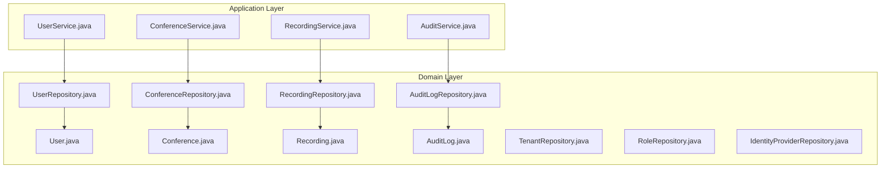
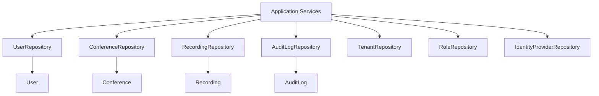
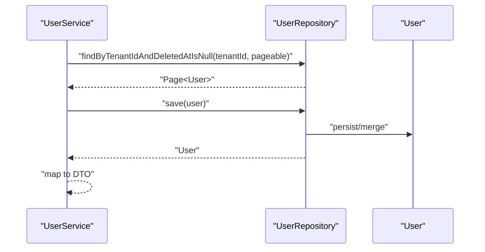
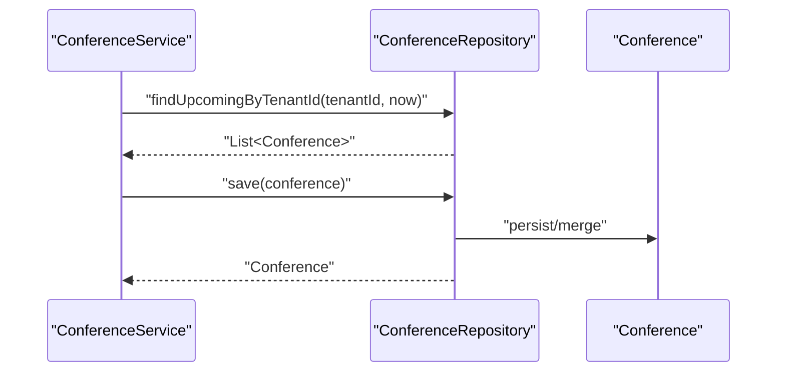
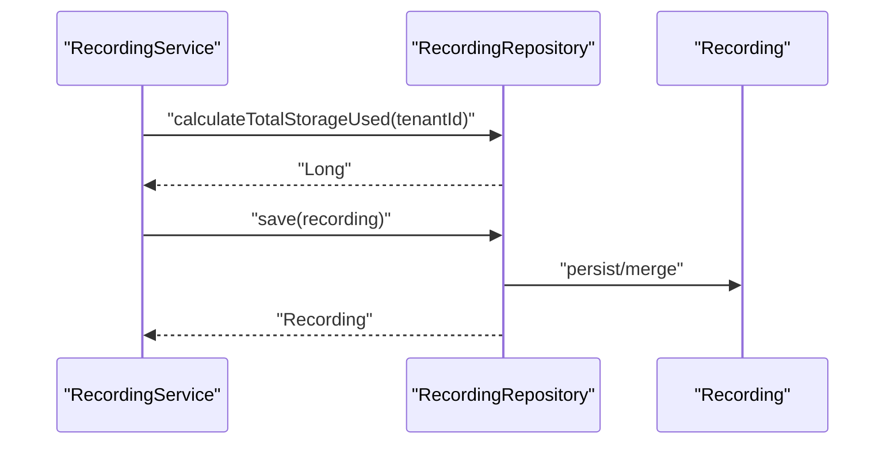
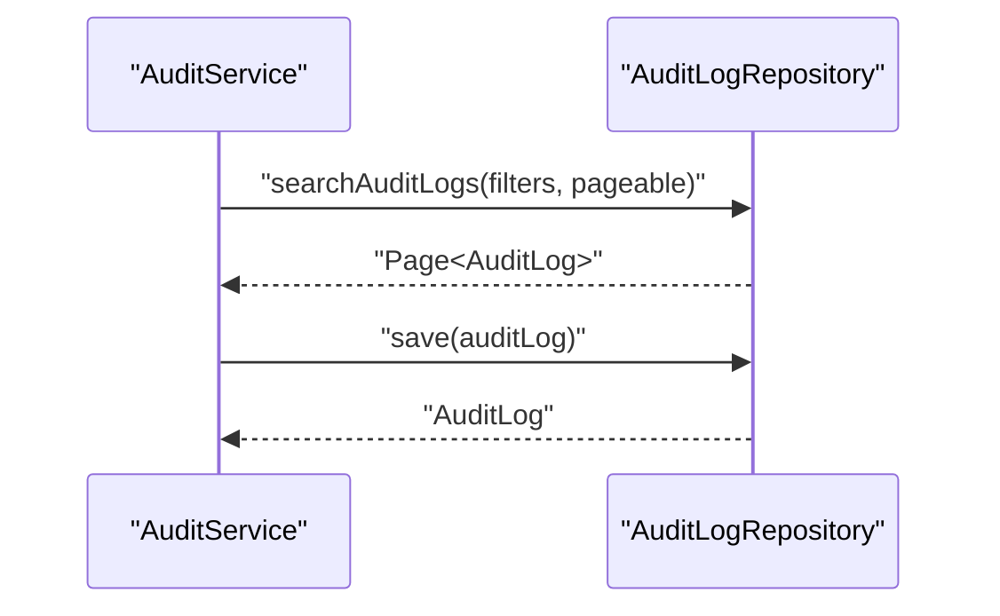
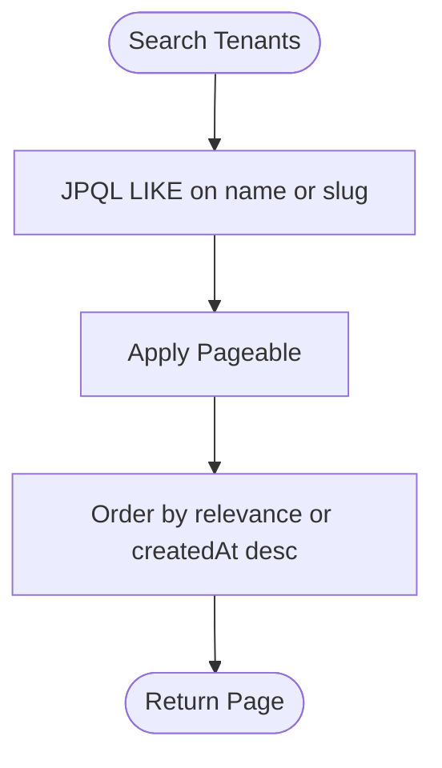
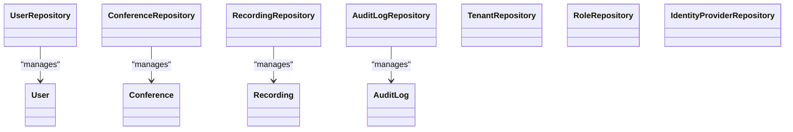

# Repository Pattern

<cite>
**Referenced Files in This Document**
- [UserRepository.java](file://jmp-domain/src/main/java/com/jmp/domain/repository/UserRepository.java)
- [ConferenceRepository.java](file://jmp-domain/src/main/java/com/jmp/domain/repository/ConferenceRepository.java)
- [RecordingRepository.java](file://jmp-domain/src/main/java/com/jmp/domain/repository/RecordingRepository.java)
- [AuditLogRepository.java](file://jmp-domain/src/main/java/com/jmp/domain/repository/AuditLogRepository.java)
- [TenantRepository.java](file://jmp-domain/src/main/java/com/jmp/domain/repository/TenantRepository.java)
- [RoleRepository.java](file://jmp-domain/src/main/java/com/jmp/domain/repository/RoleRepository.java)
- [IdentityProviderRepository.java](file://jmp-domain/src/main/java/com/jmp/domain/repository/IdentityProviderRepository.java)
- [User.java](file://jmp-domain/src/main/java/com/jmp/domain/entity/User.java)
- [Conference.java](file://jmp-domain/src/main/java/com/jmp/domain/entity/Conference.java)
- [Recording.java](file://jmp-domain/src/main/java/com/jmp/domain/entity/Recording.java)
- [AuditLog.java](file://jmp-domain/src/main/java/com/jmp/domain/entity/AuditLog.java)
- [UserService.java](file://jmp-application/src/main/java/com/jmp/application/service/UserService.java)
- [ConferenceService.java](file://jmp-application/src/main/java/com/jmp/application/service/ConferenceService.java)
- [RecordingService.java](file://jmp-application/src/main/java/com/jmp/application/service/RecordingService.java)
- [AuditService.java](file://jmp-application/src/main/java/com/jmp/application/service/AuditService.java)
</cite>

## Table of Contents
1. [Introduction](#introduction)
2. [Project Structure](#project-structure)
3. [Core Components](#core-components)
4. [Architecture Overview](#architecture-overview)
5. [Detailed Component Analysis](#detailed-component-analysis)
6. [Dependency Analysis](#dependency-analysis)
7. [Performance Considerations](#performance-considerations)
8. [Troubleshooting Guide](#troubleshooting-guide)
9. [Conclusion](#conclusion)

## Introduction
This document explains the Repository Pattern implementation in the Domain Layer of the system. It focuses on how Spring Data JPA repositories abstract data access via type-safe interfaces, and documents the repository interfaces for User, Conference, Recording, AuditLog, Tenant, Role, and IdentityProvider. It also covers custom query methods, method naming conventions, JPQL/HQL usage, pagination and sorting, complex query patterns, transaction management, and performance considerations such as lazy loading and query optimization.

## Project Structure
The Domain Layer defines entities and repositories. Application Services orchestrate use cases and manage transactions, delegating persistence to repositories. Infrastructure and API layers depend on the Domain and Application Layers.

**Diagram sources**
- [UserRepository.java:1-82](file://jmp-domain/src/main/java/com/jmp/domain/repository/UserRepository.java#L1-L82)
- [ConferenceRepository.java:1-110](file://jmp-domain/src/main/java/com/jmp/domain/repository/ConferenceRepository.java#L1-L110)
- [RecordingRepository.java:1-100](file://jmp-domain/src/main/java/com/jmp/domain/repository/RecordingRepository.java#L1-L100)
- [AuditLogRepository.java:1-85](file://jmp-domain/src/main/java/com/jmp/domain/repository/AuditLogRepository.java#L1-L85)
- [TenantRepository.java:1-64](file://jmp-domain/src/main/java/com/jmp/domain/repository/TenantRepository.java#L1-L64)
- [RoleRepository.java:1-20](file://jmp-domain/src/main/java/com/jmp/domain/repository/RoleRepository.java#L1-L20)
- [IdentityProviderRepository.java:1-37](file://jmp-domain/src/main/java/com/jmp/domain/repository/IdentityProviderRepository.java#L1-L37)
- [User.java:1-164](file://jmp-domain/src/main/java/com/jmp/domain/entity/User.java#L1-L164)
- [Conference.java:1-200](file://jmp-domain/src/main/java/com/jmp/domain/entity/Conference.java#L1-L200)
- [Recording.java:1-200](file://jmp-domain/src/main/java/com/jmp/domain/entity/Recording.java#L1-L200)
- [AuditLog.java:1-136](file://jmp-domain/src/main/java/com/jmp/domain/entity/AuditLog.java#L1-L136)
- [UserService.java:1-190](file://jmp-application/src/main/java/com/jmp/application/service/UserService.java#L1-L190)
- [ConferenceService.java:1-225](file://jmp-application/src/main/java/com/jmp/application/service/ConferenceService.java#L1-L225)
- [RecordingService.java:1-332](file://jmp-application/src/main/java/com/jmp/application/service/RecordingService.java#L1-L332)
- [AuditService.java:1-207](file://jmp-application/src/main/java/com/jmp/application/service/AuditService.java#L1-L207)

**Section sources**
- [UserRepository.java:1-82](file://jmp-domain/src/main/java/com/jmp/domain/repository/UserRepository.java#L1-L82)
- [ConferenceRepository.java:1-110](file://jmp-domain/src/main/java/com/jmp/domain/repository/ConferenceRepository.java#L1-L110)
- [RecordingRepository.java:1-100](file://jmp-domain/src/main/java/com/jmp/domain/repository/RecordingRepository.java#L1-L100)
- [AuditLogRepository.java:1-85](file://jmp-domain/src/main/java/com/jmp/domain/repository/AuditLogRepository.java#L1-L85)
- [TenantRepository.java:1-64](file://jmp-domain/src/main/java/com/jmp/domain/repository/TenantRepository.java#L1-L64)
- [RoleRepository.java:1-20](file://jmp-domain/src/main/java/com/jmp/domain/repository/RoleRepository.java#L1-L20)
- [IdentityProviderRepository.java:1-37](file://jmp-domain/src/main/java/com/jmp/domain/repository/IdentityProviderRepository.java#L1-L37)

## Core Components
- Type-safe repository interfaces extend Spring Data JPA’s JpaRepository to inherit generic CRUD and pagination capabilities.
- Custom queries are defined using method naming conventions and JPQL/HQL with @Query and @Param.
- EntityGraph is used to eagerly fetch associations when needed, balancing performance and separation of concerns.
- Pagination is supported via Pageable parameters; sorting is achieved through Pageable ordering and explicit ORDER BY clauses in JPQL.

Examples of repository usage appear in Application Services, which manage transactions and orchestrate domain operations.

**Section sources**
- [UserRepository.java:18-82](file://jmp-domain/src/main/java/com/jmp/domain/repository/UserRepository.java#L18-L82)
- [ConferenceRepository.java:20-110](file://jmp-domain/src/main/java/com/jmp/domain/repository/ConferenceRepository.java#L20-L110)
- [RecordingRepository.java:18-100](file://jmp-domain/src/main/java/com/jmp/domain/repository/RecordingRepository.java#L18-L100)
- [AuditLogRepository.java:18-85](file://jmp-domain/src/main/java/com/jmp/domain/repository/AuditLogRepository.java#L18-L85)
- [TenantRepository.java:16-64](file://jmp-domain/src/main/java/com/jmp/domain/repository/TenantRepository.java#L16-L64)
- [RoleRepository.java:12-20](file://jmp-domain/src/main/java/com/jmp/domain/repository/RoleRepository.java#L12-L20)
- [IdentityProviderRepository.java:13-37](file://jmp-domain/src/main/java/com/jmp/domain/repository/IdentityProviderRepository.java#L13-L37)
- [UserService.java:31-190](file://jmp-application/src/main/java/com/jmp/application/service/UserService.java#L31-L190)
- [ConferenceService.java:28-225](file://jmp-application/src/main/java/com/jmp/application/service/ConferenceService.java#L28-L225)
- [RecordingService.java:28-332](file://jmp-application/src/main/java/com/jmp/application/service/RecordingService.java#L28-L332)
- [AuditService.java:24-207](file://jmp-application/src/main/java/com/jmp/application/service/AuditService.java#L24-L207)

## Architecture Overview
Repositories form the boundary between the Domain and persistence layers. Application Services call repositories to access domain entities while maintaining transactional boundaries. EntityGraph ensures controlled eager loading for specific use cases, avoiding N+1 problems in targeted scenarios.

**Diagram sources**
- [UserService.java:31-190](file://jmp-application/src/main/java/com/jmp/application/service/UserService.java#L31-L190)
- [ConferenceService.java:28-225](file://jmp-application/src/main/java/com/jmp/application/service/ConferenceService.java#L28-L225)
- [RecordingService.java:28-332](file://jmp-application/src/main/java/com/jmp/application/service/RecordingService.java#L28-L332)
- [AuditService.java:24-207](file://jmp-application/src/main/java/com/jmp/application/service/AuditService.java#L24-L207)
- [UserRepository.java:18-82](file://jmp-domain/src/main/java/com/jmp/domain/repository/UserRepository.java#L18-L82)
- [ConferenceRepository.java:20-110](file://jmp-domain/src/main/java/com/jmp/domain/repository/ConferenceRepository.java#L20-L110)
- [RecordingRepository.java:18-100](file://jmp-domain/src/main/java/com/jmp/domain/repository/RecordingRepository.java#L18-L100)
- [AuditLogRepository.java:18-85](file://jmp-domain/src/main/java/com/jmp/domain/repository/AuditLogRepository.java#L18-L85)
- [TenantRepository.java:16-64](file://jmp-domain/src/main/java/com/jmp/domain/repository/TenantRepository.java#L16-L64)
- [RoleRepository.java:12-20](file://jmp-domain/src/main/java/com/jmp/domain/repository/RoleRepository.java#L12-L20)
- [IdentityProviderRepository.java:13-37](file://jmp-domain/src/main/java/com/jmp/domain/repository/IdentityProviderRepository.java#L13-L37)
- [User.java:23-164](file://jmp-domain/src/main/java/com/jmp/domain/entity/User.java#L23-L164)
- [Conference.java:25-200](file://jmp-domain/src/main/java/com/jmp/domain/entity/Conference.java#L25-L200)
- [Recording.java:24-200](file://jmp-domain/src/main/java/com/jmp/domain/entity/Recording.java#L24-L200)
- [AuditLog.java:20-136](file://jmp-domain/src/main/java/com/jmp/domain/entity/AuditLog.java#L20-L136)

## Detailed Component Analysis

### User Repository
- Purpose: Manage User lifecycle, including tenant scoping, role assignment, and soft-deleted filtering.
- Method naming conventions:
  - findByEmail(...) and findByEmailAndTenantId(...) for equality filters.
  - existsByEmailAndDeletedAtIsNull(...) for existence checks.
  - findByTenantIdAndDeletedAtIsNull(...) with Pageable for paginated tenant listings.
  - searchByTenantId(...) with Pageable for tenant-scoped search across name/email.
  - findWithRolesById(...) with @EntityGraph to load roles and permissions.
  - findActiveByEmail(...) with JPQL to restrict to ACTIVE users.
- Pagination and sorting: Pageable supports page index/slice and sort order; JPQL ORDER BY can refine sort direction.
- Transaction management: Application Service methods annotated with @Transactional wrap repository saves and updates.

**Diagram sources**
- [UserService.java:94-97](file://jmp-application/src/main/java/com/jmp/application/service/UserService.java#L94-L97)
- [UserRepository.java:47-48](file://jmp-domain/src/main/java/com/jmp/domain/repository/UserRepository.java#L47-L48)

**Section sources**
- [UserRepository.java:18-82](file://jmp-domain/src/main/java/com/jmp/domain/repository/UserRepository.java#L18-L82)
- [UserService.java:31-190](file://jmp-application/src/main/java/com/jmp/application/service/UserService.java#L31-L190)

### Conference Repository
- Purpose: Manage conference lifecycle, scheduling, and tenant scoping.
- Method naming conventions:
  - findByRoomNameAndTenantId(...) for uniqueness checks.
  - findByTenantIdAndDeletedAtIsNull(...) with Pageable for paginated lists.
  - findByTenantIdAndStatusAndDeletedAtIsNull(...) for filtered counts/status views.
  - findActiveByTenantId(...) and findUpcomingByTenantId(...) with JPQL and ORDER BY.
  - searchByTenantId(...) with Pageable for name/room/description search.
  - findScheduledBetween(...), findConferencesToStart(...), findConferencesToEnd(...) with JPQL temporal filters.
- Pagination and sorting: Pageable and JPQL ORDER BY clauses.

**Diagram sources**
- [ConferenceService.java:104-108](file://jmp-application/src/main/java/com/jmp/application/service/ConferenceService.java#L104-L108)
- [ConferenceRepository.java:54-60](file://jmp-domain/src/main/java/com/jmp/domain/repository/ConferenceRepository.java#L54-L60)

**Section sources**
- [ConferenceRepository.java:20-110](file://jmp-domain/src/main/java/com/jmp/domain/repository/ConferenceRepository.java#L20-L110)
- [ConferenceService.java:28-225](file://jmp-application/src/main/java/com/jmp/application/service/ConferenceService.java#L28-L225)

### Recording Repository
- Purpose: Manage recording entries, storage metadata, retention, and tenant aggregation.
- Method naming conventions:
  - findByRecordingKey(...), findByConferenceIdAndDeletedAtIsNull(...), findByStatusAndDeletedAtIsNull(...).
  - findReadyByTenantId(...) with Pageable and JPQL ORDER BY.
  - searchByTenantId(...) with Pageable for conference name/original filename search.
  - findExpiredRecordings(...) with JPQL temporal filter.
  - calculateTotalStorageUsed(...) with JPQL aggregate SUM.
  - countByTenantIdAndStatusAndDeletedAtIsNull(...), findByStatusInAndDeletedAtIsNull(...), findByConferenceIdAndRecordingTypeAndDeletedAtIsNull(...).
- Pagination and sorting: Pageable and JPQL ORDER BY.

**Diagram sources**
- [RecordingService.java:217-222](file://jmp-application/src/main/java/com/jmp/application/service/RecordingService.java#L217-L222)
- [RecordingRepository.java:73-78](file://jmp-domain/src/main/java/com/jmp/domain/repository/RecordingRepository.java#L73-L78)

**Section sources**
- [RecordingRepository.java:18-100](file://jmp-domain/src/main/java/com/jmp/domain/repository/RecordingRepository.java#L18-L100)
- [RecordingService.java:28-332](file://jmp-application/src/main/java/com/jmp/application/service/RecordingService.java#L28-L332)

### AuditLog Repository
- Purpose: Store and query audit events with tenant, user, and temporal filters.
- Method naming conventions:
  - findByTenantIdOrderByCreatedAtDesc(...), findByUserIdOrderByCreatedAtDesc(...), findByEventTypeOrderByCreatedAtDesc(...).
  - findByEntityTypeAndEntityIdOrderByCreatedAtDesc(...) for per-entity audit trails.
  - searchAuditLogs(...) with JPQL supporting optional filters (tenantId, eventType, userId, startDate, endDate).
  - findSecurityEvents(...) with JPQL IN filter and time window.
  - countEventsByType(...) with JPQL GROUP BY and COUNT.
  - deleteByCreatedAtBefore(...) for retention cleanup.
- Pagination and sorting: Pageable and ORDER BY DESC on createdAt.

**Diagram sources**
- [AuditService.java:181-189](file://jmp-application/src/main/java/com/jmp/application/service/AuditService.java#L181-L189)
- [AuditLogRepository.java:43-58](file://jmp-domain/src/main/java/com/jmp/domain/repository/AuditLogRepository.java#L43-L58)

**Section sources**
- [AuditLogRepository.java:18-85](file://jmp-domain/src/main/java/com/jmp/domain/repository/AuditLogRepository.java#L18-L85)
- [AuditService.java:24-207](file://jmp-application/src/main/java/com/jmp/application/service/AuditService.java#L24-L207)

### Tenant Repository
- Purpose: Manage tenant records with slug/domain scoping and active-state queries.
- Method naming conventions:
  - findBySlug(...), findByDomain(...), findActiveBySlug(...), existsBySlug(...), existsByDomain(...).
  - findByStatus(...) with Pageable for active tenant listing.
  - search(...) with JPQL for name/slug pattern matching.

**Diagram sources**
- [TenantRepository.java:52-58](file://jmp-domain/src/main/java/com/jmp/domain/repository/TenantRepository.java#L52-L58)

**Section sources**
- [TenantRepository.java:16-64](file://jmp-domain/src/main/java/com/jmp/domain/repository/TenantRepository.java#L16-L64)

### Role Repository
- Purpose: Manage role lookup by name and existence checks.
- Method naming conventions:
  - findByName(...), existsByName(...).

**Section sources**
- [RoleRepository.java:12-20](file://jmp-domain/src/main/java/com/jmp/domain/repository/RoleRepository.java#L12-L20)

### IdentityProvider Repository
- Purpose: Manage identity providers per tenant with enablement and uniqueness checks.
- Method naming conventions:
  - findByTenantId(...), findByTenantIdAndEnabledTrue(...), findByTenantIdAndName(...), existsByTenantIdAndName(...).

**Section sources**
- [IdentityProviderRepository.java:13-37](file://jmp-domain/src/main/java/com/jmp/domain/repository/IdentityProviderRepository.java#L13-L37)

## Dependency Analysis
Repositories depend on JPA/Hibernate for persistence and Spring Data JPA for query derivation and pagination. Entities define lazy loading via @ManyToOne/@ManyToMany; @EntityGraph is used selectively to avoid excessive fetching. Application Services coordinate transactions and orchestrate repository calls.

**Diagram sources**
- [UserRepository.java:18-82](file://jmp-domain/src/main/java/com/jmp/domain/repository/UserRepository.java#L18-L82)
- [ConferenceRepository.java:20-110](file://jmp-domain/src/main/java/com/jmp/domain/repository/ConferenceRepository.java#L20-L110)
- [RecordingRepository.java:18-100](file://jmp-domain/src/main/java/com/jmp/domain/repository/RecordingRepository.java#L18-L100)
- [AuditLogRepository.java:18-85](file://jmp-domain/src/main/java/com/jmp/domain/repository/AuditLogRepository.java#L18-L85)
- [TenantRepository.java:16-64](file://jmp-domain/src/main/java/com/jmp/domain/repository/TenantRepository.java#L16-L64)
- [RoleRepository.java:12-20](file://jmp-domain/src/main/java/com/jmp/domain/repository/RoleRepository.java#L12-L20)
- [IdentityProviderRepository.java:13-37](file://jmp-domain/src/main/java/com/jmp/domain/repository/IdentityProviderRepository.java#L13-L37)
- [User.java:23-164](file://jmp-domain/src/main/java/com/jmp/domain/entity/User.java#L23-L164)
- [Conference.java:25-200](file://jmp-domain/src/main/java/com/jmp/domain/entity/Conference.java#L25-L200)
- [Recording.java:24-200](file://jmp-domain/src/main/java/com/jmp/domain/entity/Recording.java#L24-L200)
- [AuditLog.java:20-136](file://jmp-domain/src/main/java/com/jmp/domain/entity/AuditLog.java#L20-L136)

**Section sources**
- [UserRepository.java:18-82](file://jmp-domain/src/main/java/com/jmp/domain/repository/UserRepository.java#L18-L82)
- [ConferenceRepository.java:20-110](file://jmp-domain/src/main/java/com/jmp/domain/repository/ConferenceRepository.java#L20-L110)
- [RecordingRepository.java:18-100](file://jmp-domain/src/main/java/com/jmp/domain/repository/RecordingRepository.java#L18-L100)
- [AuditLogRepository.java:18-85](file://jmp-domain/src/main/java/com/jmp/domain/repository/AuditLogRepository.java#L18-L85)
- [TenantRepository.java:16-64](file://jmp-domain/src/main/java/com/jmp/domain/repository/TenantRepository.java#L16-L64)
- [RoleRepository.java:12-20](file://jmp-domain/src/main/java/com/jmp/domain/repository/RoleRepository.java#L12-L20)
- [IdentityProviderRepository.java:13-37](file://jmp-domain/src/main/java/com/jmp/domain/repository/IdentityProviderRepository.java#L13-L37)

## Performance Considerations
- Lazy loading: Entities use FetchType.LAZY for associations (e.g., User.roles, Conference.createdBy). This prevents unnecessary joins and reduces payload sizes.
- Eager loading with EntityGraph: Used in targeted methods (e.g., findWithRolesById) to load roles and permissions in a single query when required by the use case.
- Pagination: Pageable enables efficient server-side pagination; ensure appropriate indexes on frequently filtered columns (e.g., tenantId, status, deletedAt).
- JPQL/HQL optimization:
  - Prefer selective projections and WHERE clauses with indexed columns.
  - Use ORDER BY only when necessary; leverage Pageable.sort for client-driven ordering.
  - Aggregate queries (SUM/COUNT/GROUP BY) are efficient for analytics and stats.
- Query hints and indexes: Add database indexes on tenantId, status, deletedAt, email, and timestamps to improve query performance.
- Transaction boundaries: Keep repository calls within service-layer transactions to minimize round trips and ensure consistency.

[No sources needed since this section provides general guidance]

## Troubleshooting Guide
- Missing associations: If roles or tenant are null when loading a user, verify the use of findWithRolesById or similar EntityGraph-enabled methods.
- Unexpected N+1 queries: Confirm that @EntityGraph is used for bulk reads or that DTO projections are applied to avoid lazy-loading in loops.
- Pagination anomalies: Ensure Pageable.pageNumber and size are within acceptable bounds; verify database indexes on filter columns.
- Soft-deleted records: Queries commonly filter by deletedAt IS NULL; confirm entities implement soft-delete semantics and repositories apply the condition.
- Temporal queries: For scheduled/auto-start/end logic, ensure Instant.now() is passed consistently and timezones are handled appropriately.

**Section sources**
- [UserRepository.java:24-37](file://jmp-domain/src/main/java/com/jmp/domain/repository/UserRepository.java#L24-L37)
- [ConferenceRepository.java:48-60](file://jmp-domain/src/main/java/com/jmp/domain/repository/ConferenceRepository.java#L48-L60)
- [RecordingRepository.java:65-69](file://jmp-domain/src/main/java/com/jmp/domain/repository/RecordingRepository.java#L65-L69)
- [AuditLogRepository.java:44-58](file://jmp-domain/src/main/java/com/jmp/domain/repository/AuditLogRepository.java#L44-L58)

## Conclusion
The Domain Layer’s Repository Pattern leverages Spring Data JPA to provide type-safe, extensible data access with clear method naming and JPQL/HQL support. Repositories encapsulate persistence logic, enforce domain boundaries, and integrate with Application Services under managed transactions. Careful use of EntityGraph, pagination, and JPQL ensures maintainable, performant domain operations aligned with separation of concerns.