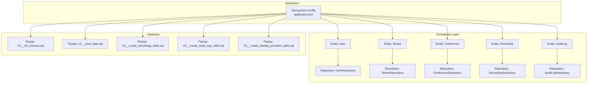
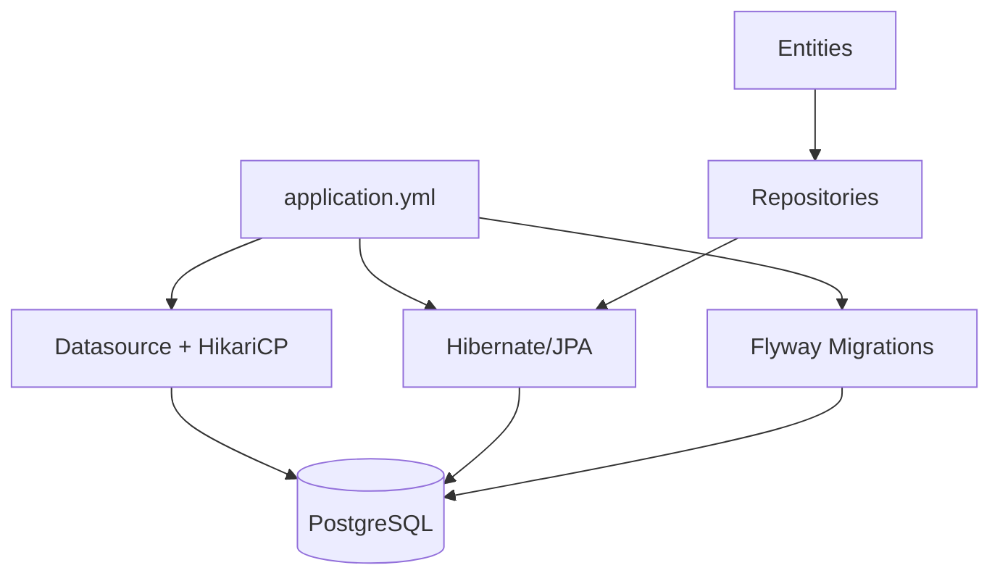
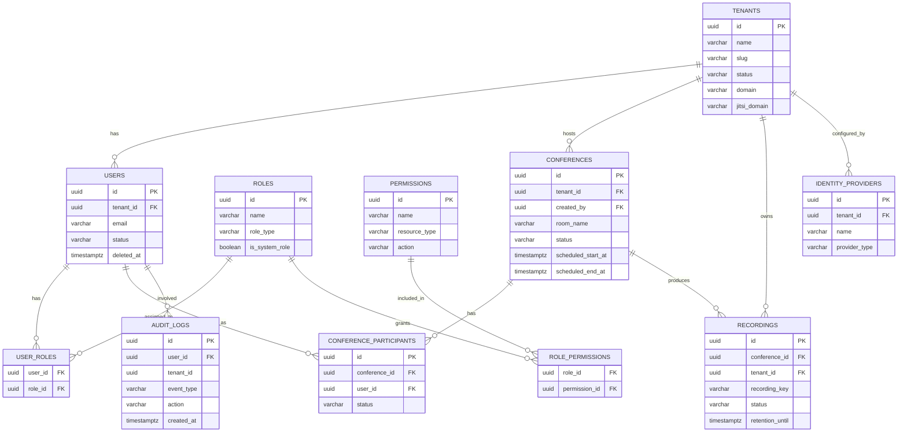
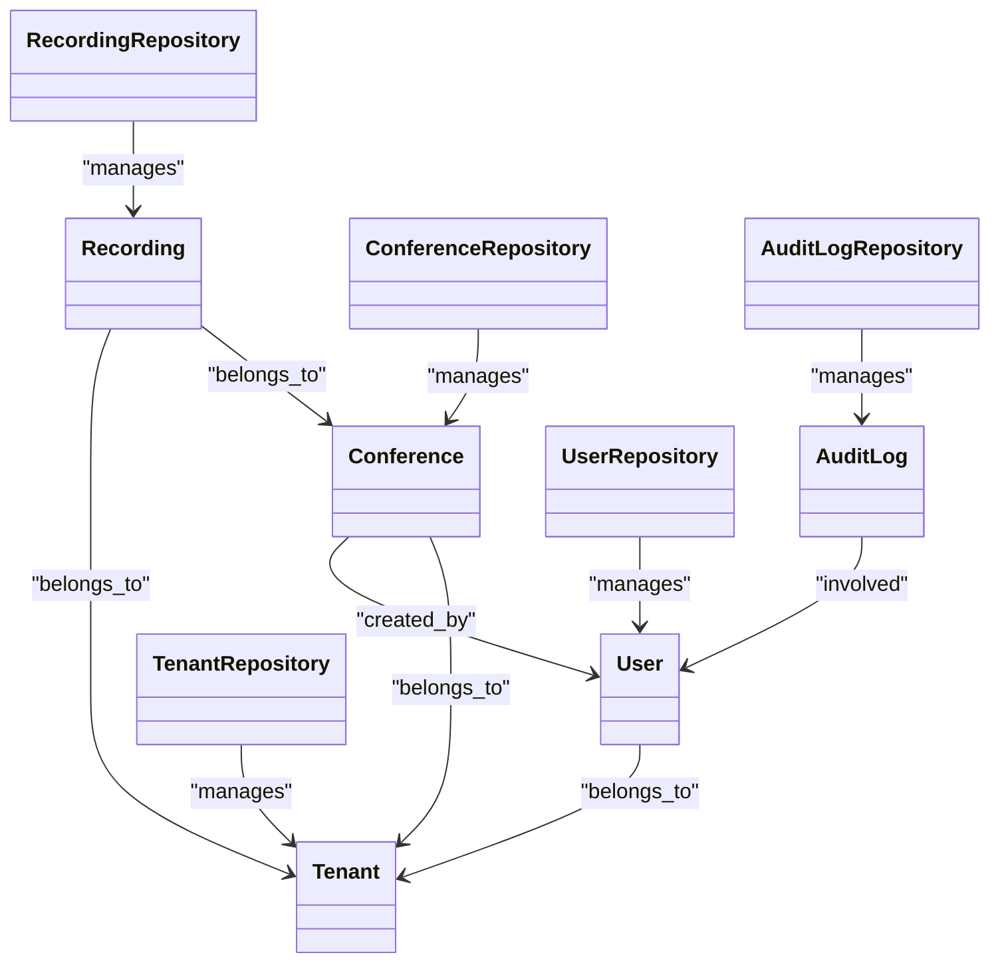
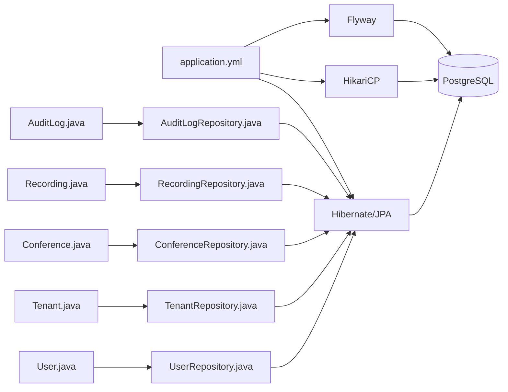

# Database Persistence

<cite>
**Referenced Files in This Document**
- [application.yml](file://jmp-web/src/main/resources/application.yml)
- [V1__init_schema.sql](file://jmp-web/src/main/resources/db/migration/V1__init_schema.sql)
- [V2__seed_data.sql](file://jmp-web/src/main/resources/db/migration/V2__seed_data.sql)
- [V3__create_recordings_table.sql](file://jmp-web/src/main/resources/db/migration/V3__create_recordings_table.sql)
- [V4__create_audit_logs_table.sql](file://jmp-web/src/main/resources/db/migration/V4__create_audit_logs_table.sql)
- [V5__create_identity_providers_table.sql](file://jmp-web/src/main/resources/db/migration/V5__create_identity_providers_table.sql)
- [User.java](file://jmp-domain/src/main/java/com/jmp/domain/entity/User.java)
- [Tenant.java](file://jmp-domain/src/main/java/com/jmp/domain/entity/Tenant.java)
- [Conference.java](file://jmp-domain/src/main/java/com/jmp/domain/entity/Conference.java)
- [Recording.java](file://jmp-domain/src/main/java/com/jmp/domain/entity/Recording.java)
- [AuditLog.java](file://jmp-domain/src/main/java/com/jmp/domain/entity/AuditLog.java)
- [UserRepository.java](file://jmp-domain/src/main/java/com/jmp/domain/repository/UserRepository.java)
- [TenantRepository.java](file://jmp-domain/src/main/java/com/jmp/domain/repository/TenantRepository.java)
- [ConferenceRepository.java](file://jmp-domain/src/main/java/com/jmp/domain/repository/ConferenceRepository.java)
- [RecordingRepository.java](file://jmp-domain/src/main/java/com/jmp/domain/repository/RecordingRepository.java)
- [AuditLogRepository.java](file://jmp-domain/src/main/java/com/jmp/domain/repository/AuditLogRepository.java)
</cite>

## Table of Contents
1. [Introduction](#introduction)
2. [Project Structure](#project-structure)
3. [Core Components](#core-components)
4. [Architecture Overview](#architecture-overview)
5. [Detailed Component Analysis](#detailed-component-analysis)
6. [Dependency Analysis](#dependency-analysis)
7. [Performance Considerations](#performance-considerations)
8. [Troubleshooting Guide](#troubleshooting-guide)
9. [Conclusion](#conclusion)
10. [Appendices](#appendices)

## Introduction
This document covers the Database Persistence section of the Infrastructure Layer. It explains database configuration (connection pooling, JPA/Hibernate settings, Flyway migrations), the persistence layer setup (entities, repositories, schema), transaction management and consistency guarantees, performance tuning and indexing, caching strategies, and practical repository usage patterns. The goal is to provide a clear understanding of how data is stored, accessed, and evolved in the system.

## Project Structure
The persistence configuration and schema are centralized under the web module’s resources, while entities and repositories live in the domain module. The configuration defines:
- Datasource and HikariCP connection pool settings
- JPA/Hibernate dialect, SQL formatting, batch sizing, and DDL strategy
- Flyway migration configuration and schema initialization
- Redis cache configuration (used alongside database persistence)

**Diagram sources**
- [application.yml:12-44](file://jmp-web/src/main/resources/application.yml#L12-L44)
- [V1__init_schema.sql:1-172](file://jmp-web/src/main/resources/db/migration/V1__init_schema.sql#L1-L172)
- [V2__seed_data.sql:1-131](file://jmp-web/src/main/resources/db/migration/V2__seed_data.sql#L1-L131)
- [V3__create_recordings_table.sql:1-43](file://jmp-web/src/main/resources/db/migration/V3__create_recordings_table.sql#L1-L43)
- [V4__create_audit_logs_table.sql:1-36](file://jmp-web/src/main/resources/db/migration/V4__create_audit_logs_table.sql#L1-L36)
- [V5__create_identity_providers_table.sql:1-45](file://jmp-web/src/main/resources/db/migration/V5__create_identity_providers_table.sql#L1-L45)

**Section sources**
- [application.yml:12-44](file://jmp-web/src/main/resources/application.yml#L12-L44)
- [V1__init_schema.sql:1-172](file://jmp-web/src/main/resources/db/migration/V1__init_schema.sql#L1-L172)

## Core Components
- Datasource and Connection Pooling
  - JDBC URL, credentials, and PostgreSQL driver configured via environment variables
  - HikariCP pool sizing, timeouts, and lifetimes tuned for moderate concurrency
- JPA/Hibernate Settings
  - PostgreSQL dialect, SQL formatting, batch sizing, ordered inserts/updates, and LOB configuration
  - Hibernate DDL strategy set to validate; SQL logging disabled
  - open-in-view disabled to avoid long-lived sessions
- Flyway Migrations
  - Enabled with explicit schema and migration locations
  - Baseline on migrate to support existing schema evolution
- Entities and Repositories
  - JPA entities mapped to schema “jmp” with UUID primary keys and JSONB fields
  - Spring Data JPA repositories with custom queries and entity graphs for eager loading

**Section sources**
- [application.yml:12-44](file://jmp-web/src/main/resources/application.yml#L12-L44)
- [User.java:24](file://jmp-domain/src/main/java/com/jmp/domain/entity/User.java#L24)
- [Tenant.java:25](file://jmp-domain/src/main/java/com/jmp/domain/entity/Tenant.java#L25)
- [Conference.java:26](file://jmp-domain/src/main/java/com/jmp/domain/entity/Conference.java#L26)
- [Recording.java:25](file://jmp-domain/src/main/java/com/jmp/domain/entity/Recording.java#L25)
- [AuditLog.java:21](file://jmp-domain/src/main/java/com/jmp/domain/entity/AuditLog.java#L21)
- [UserRepository.java:18](file://jmp-domain/src/main/java/com/jmp/domain/repository/UserRepository.java#L18)
- [ConferenceRepository.java:20](file://jmp-domain/src/main/java/com/jmp/domain/repository/ConferenceRepository.java#L20)
- [RecordingRepository.java:19](file://jmp-domain/src/main/java/com/jmp/domain/repository/RecordingRepository.java#L19)
- [AuditLogRepository.java:18](file://jmp-domain/src/main/java/com/jmp/domain/repository/AuditLogRepository.java#L18)

## Architecture Overview
The persistence architecture follows a layered approach:
- Configuration layer: application.yml defines datasource, JPA/Hibernate, Flyway, and Redis
- Domain layer: entities define the model and relationships; repositories expose typed data access
- Database layer: Flyway applies schema migrations; PostgreSQL stores data with JSONB and indexes

**Diagram sources**
- [application.yml:12-44](file://jmp-web/src/main/resources/application.yml#L12-L44)
- [V1__init_schema.sql:1-172](file://jmp-web/src/main/resources/db/migration/V1__init_schema.sql#L1-L172)

## Detailed Component Analysis

### Database Configuration
- Datasource
  - JDBC URL, username, password, and driver-class-name are environment-driven
- HikariCP Pool
  - Maximum pool size, minimum idle, connection timeout, idle timeout, and max lifetime configured
- JPA/Hibernate
  - PostgreSQL dialect, SQL formatting, batch size, ordered insert/update, non-contextual LOBs
  - DDL auto mode set to validate; SQL logging disabled; open-in-view disabled
- Flyway
  - Enabled, schema “jmp”, migration locations, baseline on migrate
- Redis
  - Separate Redis configuration present for caching (not part of JPA persistence)

**Section sources**
- [application.yml:12-44](file://jmp-web/src/main/resources/application.yml#L12-L44)

### Entity Model and Schema
- Schema “jmp”
  - All tables reside in schema “jmp”; UUID primary keys; JSONB fields for flexible attributes
- Core Entities
  - User: tenant-scoped identity with roles and soft-deleted lifecycle
  - Tenant: multi-tenant isolation with quotas and JSONB settings
  - Conference: scheduling, metadata, and participant relationships
  - Recording: conference recordings with retention and metadata
  - AuditLog: system event audit with JSONB payload
- Indexes and Constraints
  - Indexes on foreign keys, status, timestamps, and composite keys
  - Unique constraints on room_name per tenant and identity provider name per tenant
  - Comments on tables for documentation

**Diagram sources**
- [V1__init_schema.sql:10-172](file://jmp-web/src/main/resources/db/migration/V1__init_schema.sql#L10-L172)
- [V3__create_recordings_table.sql:4-43](file://jmp-web/src/main/resources/db/migration/V3__create_recordings_table.sql#L4-L43)
- [V4__create_audit_logs_table.sql:4-36](file://jmp-web/src/main/resources/db/migration/V4__create_audit_logs_table.sql#L4-L36)
- [V5__create_identity_providers_table.sql:4-45](file://jmp-web/src/main/resources/db/migration/V5__create_identity_providers_table.sql#L4-L45)

**Section sources**
- [V1__init_schema.sql:10-172](file://jmp-web/src/main/resources/db/migration/V1__init_schema.sql#L10-L172)
- [V3__create_recordings_table.sql:4-43](file://jmp-web/src/main/resources/db/migration/V3__create_recordings_table.sql#L4-L43)
- [V4__create_audit_logs_table.sql:4-36](file://jmp-web/src/main/resources/db/migration/V4__create_audit_logs_table.sql#L4-L36)
- [V5__create_identity_providers_table.sql:4-45](file://jmp-web/src/main/resources/db/migration/V5__create_identity_providers_table.sql#L4-L45)

### Repository Implementations and Usage Patterns
- UserRepository
  - Eager loading of roles, permissions, and tenant via entity graphs
  - Queries for active users, tenant-scoped search, existence checks, and external auth lookup
- TenantRepository
  - Slug/domain lookups, active tenant filtering, paginated lists, and search
- ConferenceRepository
  - Eager loading of participants and creators; tenant-scoped queries, upcoming, active, scheduled windows
- RecordingRepository
  - Tenant-scoped readiness, retention expiration, storage aggregation, and type filtering
- AuditLogRepository
  - Tenant/user/event-type filtering, security events, counts, and retention cleanup

**Diagram sources**
- [UserRepository.java:18](file://jmp-domain/src/main/java/com/jmp/domain/repository/UserRepository.java#L18)
- [TenantRepository.java:17](file://jmp-domain/src/main/java/com/jmp/domain/repository/TenantRepository.java#L17)
- [ConferenceRepository.java:20](file://jmp-domain/src/main/java/com/jmp/domain/repository/ConferenceRepository.java#L20)
- [RecordingRepository.java:19](file://jmp-domain/src/main/java/com/jmp/domain/repository/RecordingRepository.java#L19)
- [AuditLogRepository.java:18](file://jmp-domain/src/main/java/com/jmp/domain/repository/AuditLogRepository.java#L18)
- [User.java:28](file://jmp-domain/src/main/java/com/jmp/domain/entity/User.java#L28)
- [Tenant.java:29](file://jmp-domain/src/main/java/com/jmp/domain/entity/Tenant.java#L29)
- [Conference.java:30](file://jmp-domain/src/main/java/com/jmp/domain/entity/Conference.java#L30)
- [Recording.java:29](file://jmp-domain/src/main/java/com/jmp/domain/entity/Recording.java#L29)
- [AuditLog.java:25](file://jmp-domain/src/main/java/com/jmp/domain/entity/AuditLog.java#L25)

**Section sources**
- [UserRepository.java:18-82](file://jmp-domain/src/main/java/com/jmp/domain/repository/UserRepository.java#L18-L82)
- [TenantRepository.java:17-64](file://jmp-domain/src/main/java/com/jmp/domain/repository/TenantRepository.java#L17-L64)
- [ConferenceRepository.java:20-110](file://jmp-domain/src/main/java/com/jmp/domain/repository/ConferenceRepository.java#L20-L110)
- [RecordingRepository.java:19-100](file://jmp-domain/src/main/java/com/jmp/domain/repository/RecordingRepository.java#L19-L100)
- [AuditLogRepository.java:18-85](file://jmp-domain/src/main/java/com/jmp/domain/repository/AuditLogRepository.java#L18-L85)

### Transaction Boundaries and Consistency
- Transactionality
  - Spring Data JPA repositories expose read/write operations within declarative transactions managed by Spring
  - Use @Transactional at service boundaries to ensure atomicity across multiple repository calls
- Rollback Strategies
  - Default rollback on unchecked exceptions; configure specific exceptions if needed
  - For idempotent writes, prefer optimistic locking or retry with conflict handling
- Consistency Guarantees
  - Foreign keys enforced by schema; unique constraints prevent duplicates
  - Soft deletes via deleted_at fields preserve referential integrity
  - JSONB fields allow flexible auditing and metadata without schema churn

**Section sources**
- [application.yml:24-38](file://jmp-web/src/main/resources/application.yml#L24-L38)
- [V1__init_schema.sql:56-87](file://jmp-web/src/main/resources/db/migration/V1__init_schema.sql#L56-L87)

### Migration Management and Schema Evolution
- Flyway Configuration
  - Enabled with schema “jmp” and migration location classpath:db/migration
  - Baseline on migrate to integrate with existing schema
- Migration Files
  - V1: schema creation, UUID extension, base tables, indexes, comments
  - V2: seed data (tenants, permissions, roles, users)
  - V3: recordings table with indexes
  - V4: audit logs table with indexes
  - V5: identity providers table and user external auth columns with indexes
- Version Control
  - Follow semantic versioned filenames; keep destructive changes in separate migrations
  - Use placeholders and environment variables for configurable values

**Section sources**
- [application.yml:39-44](file://jmp-web/src/main/resources/application.yml#L39-L44)
- [V1__init_schema.sql:1-172](file://jmp-web/src/main/resources/db/migration/V1__init_schema.sql#L1-L172)
- [V2__seed_data.sql:1-131](file://jmp-web/src/main/resources/db/migration/V2__seed_data.sql#L1-L131)
- [V3__create_recordings_table.sql:1-43](file://jmp-web/src/main/resources/db/migration/V3__create_recordings_table.sql#L1-L43)
- [V4__create_audit_logs_table.sql:1-36](file://jmp-web/src/main/resources/db/migration/V4__create_audit_logs_table.sql#L1-L36)
- [V5__create_identity_providers_table.sql:1-45](file://jmp-web/src/main/resources/db/migration/V5__create_identity_providers_table.sql#L1-L45)

### Caching Strategies and Monitoring
- Second-Level Cache
  - No second-level cache configuration present in the provided configuration
  - Consider enabling Hibernate second-level cache and query cache for frequently accessed entities if needed
- Redis
  - Redis configured for application-level caching; not used for JPA second-level cache
- Metrics and Monitoring
  - Actuator endpoints enabled for health, info, and Prometheus metrics
  - Use metrics to monitor database pool utilization and query performance

**Section sources**
- [application.yml:45-56](file://jmp-web/src/main/resources/application.yml#L45-L56)
- [application.yml:93-112](file://jmp-web/src/main/resources/application.yml#L93-L112)

## Dependency Analysis
- Entities depend on JPA annotations and auditing listeners
- Repositories extend Spring Data JPA interfaces and define JPQL/custom queries
- Configuration depends on Flyway for schema initialization and HikariCP for connection pooling

**Diagram sources**
- [application.yml:12-44](file://jmp-web/src/main/resources/application.yml#L12-L44)
- [User.java:23-28](file://jmp-domain/src/main/java/com/jmp/domain/entity/User.java#L23-L28)
- [Tenant.java:24-29](file://jmp-domain/src/main/java/com/jmp/domain/entity/Tenant.java#L24-L29)
- [Conference.java:25-30](file://jmp-domain/src/main/java/com/jmp/domain/entity/Conference.java#L25-L30)
- [Recording.java:24-29](file://jmp-domain/src/main/java/com/jmp/domain/entity/Recording.java#L24-L29)
- [AuditLog.java:20-25](file://jmp-domain/src/main/java/com/jmp/domain/entity/AuditLog.java#L20-L25)

**Section sources**
- [application.yml:12-44](file://jmp-web/src/main/resources/application.yml#L12-L44)
- [User.java:23-28](file://jmp-domain/src/main/java/com/jmp/domain/entity/User.java#L23-L28)
- [Tenant.java:24-29](file://jmp-domain/src/main/java/com/jmp/domain/entity/Tenant.java#L24-L29)
- [Conference.java:25-30](file://jmp-domain/src/main/java/com/jmp/domain/entity/Conference.java#L25-L30)
- [Recording.java:24-29](file://jmp-domain/src/main/java/com/jmp/domain/entity/Recording.java#L24-L29)
- [AuditLog.java:20-25](file://jmp-domain/src/main/java/com/jmp/domain/entity/AuditLog.java#L20-L25)

## Performance Considerations
- Connection Pool Tuning
  - Adjust maximum-pool-size and connection-timeout based on workload and latency targets
  - Monitor pool utilization and timeouts via metrics
- Query Optimization
  - Use entity graphs sparingly; prefer targeted projections for read-heavy views
  - Leverage indexes on frequently filtered/sorted columns (e.g., status, timestamps, tenant_id)
- Batch Operations
  - Hibernate batch size and ordered inserts/updates reduce round-trips during bulk loads
- Indexing Strategy
  - Composite indexes for multi-column filters (e.g., tenant + status)
  - Partial indexes for soft-deleted rows to improve selectivity
- JSONB Fields
  - Use JSONB for flexible metadata; avoid heavy JSON processing in queries
- Auditing Overhead
  - AuditLogRepository supports paginated reads; consider partitioning or archival for large histories

**Section sources**
- [application.yml:17-36](file://jmp-web/src/main/resources/application.yml#L17-L36)
- [V1__init_schema.sql:141-164](file://jmp-web/src/main/resources/db/migration/V1__init_schema.sql#L141-L164)
- [V3__create_recordings_table.sql:33-40](file://jmp-web/src/main/resources/db/migration/V3__create_recordings_table.sql#L33-L40)
- [V4__create_audit_logs_table.sql:25-32](file://jmp-web/src/main/resources/db/migration/V4__create_audit_logs_table.sql#L25-L32)
- [V5__create_identity_providers_table.sql:29-45](file://jmp-web/src/main/resources/db/migration/V5__create_identity_providers_table.sql#L29-L45)

## Troubleshooting Guide
- Connection Issues
  - Verify JDBC URL, username, and password environment variables
  - Check HikariCP timeouts and pool sizes under load
- Migration Failures
  - Confirm Flyway schema “jmp” matches database ownership and privileges
  - Review migration checksums and baseline status
- Query Performance Problems
  - Inspect generated SQL and missing indexes
  - Use page sizes appropriate to workload; avoid N+1 selects
- Audit Log Growth
  - Implement retention policies and periodic cleanup using repository methods

**Section sources**
- [application.yml:12-44](file://jmp-web/src/main/resources/application.yml#L12-L44)
- [application.yml:39-44](file://jmp-web/src/main/resources/application.yml#L39-L44)
- [AuditLogRepository.java:82-83](file://jmp-domain/src/main/java/com/jmp/domain/repository/AuditLogRepository.java#L82-L83)

## Conclusion
The persistence layer is configured with a robust datasource and connection pool, validated schema via Flyway, and a well-structured entity-repository model. Transactions are managed by Spring, and the design supports tenant isolation, soft deletes, and extensible JSONB fields. Performance is aided by batching, ordered operations, and strategic indexing. For production, consider enabling second-level cache and implementing retention policies for audit logs and recordings.

## Appendices

### Example Repository Usage Patterns
- Load user with roles and tenant
  - Use entity graph to avoid lazy-loading overhead
  - Reference: [UserRepository.java:24](file://jmp-domain/src/main/java/com/jmp/domain/repository/UserRepository.java#L24)
- Tenant-scoped user search
  - Combine tenant filter with LIKE on name/email
  - Reference: [UserRepository.java:53-60](file://jmp-domain/src/main/java/com/jmp/domain/repository/UserRepository.java#L53-L60)
- Active conferences for a tenant
  - Filter by status and tenant with soft-delete guard
  - Reference: [ConferenceRepository.java:48-50](file://jmp-domain/src/main/java/com/jmp/domain/repository/ConferenceRepository.java#L48-L50)
- Ready recordings with pagination
  - Sort by creation time descending and filter by status
  - Reference: [RecordingRepository.java:45-48](file://jmp-domain/src/main/java/com/jmp/domain/repository/RecordingRepository.java#L45-L48)
- Audit log filtering
  - Filter by tenant, user, event type, and date range
  - Reference: [AuditLogRepository.java:44-58](file://jmp-domain/src/main/java/com/jmp/domain/repository/AuditLogRepository.java#L44-L58)