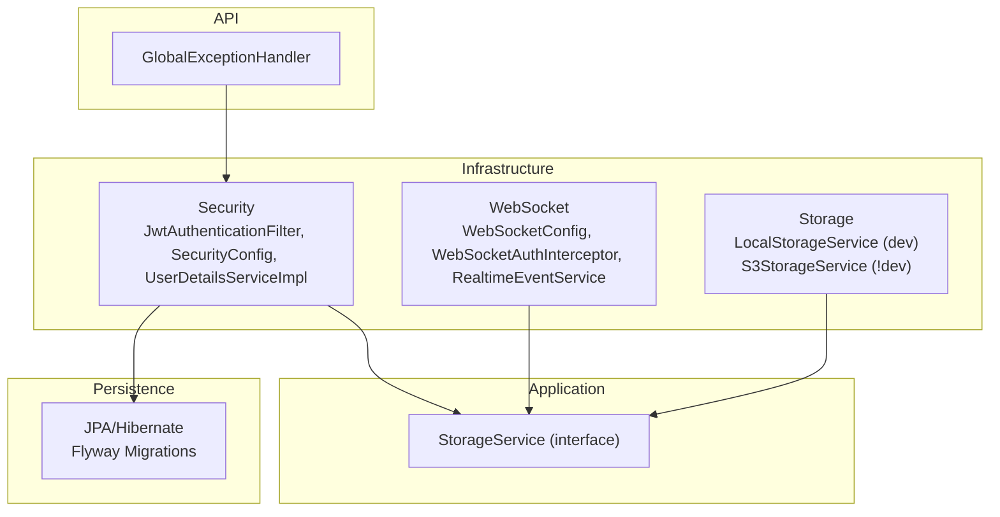
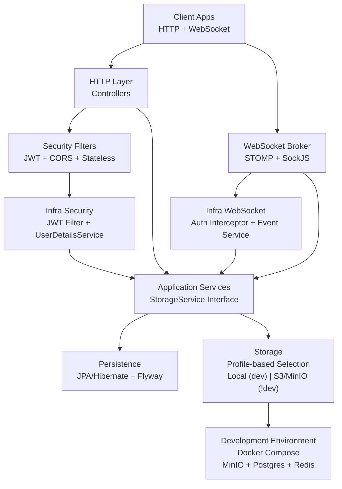
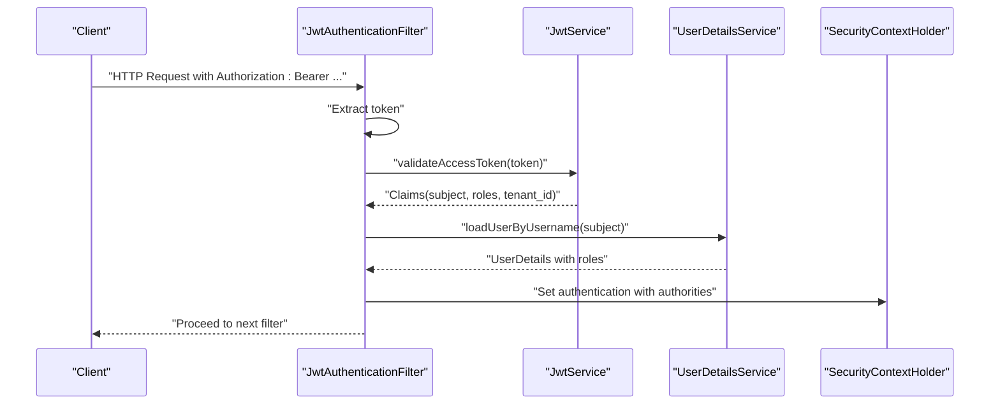
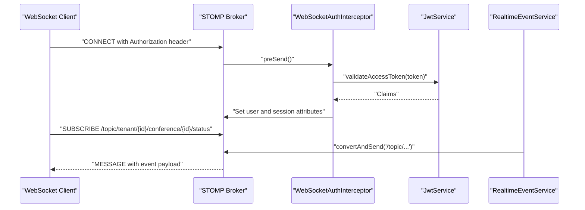
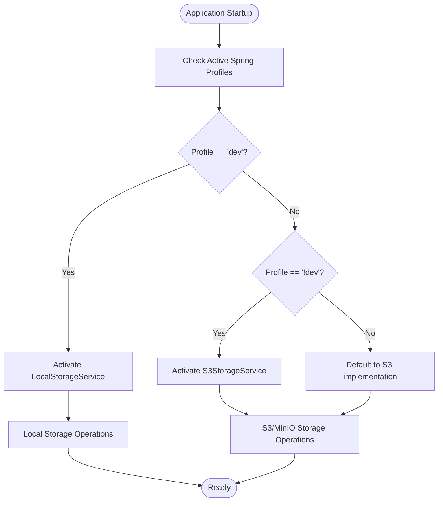
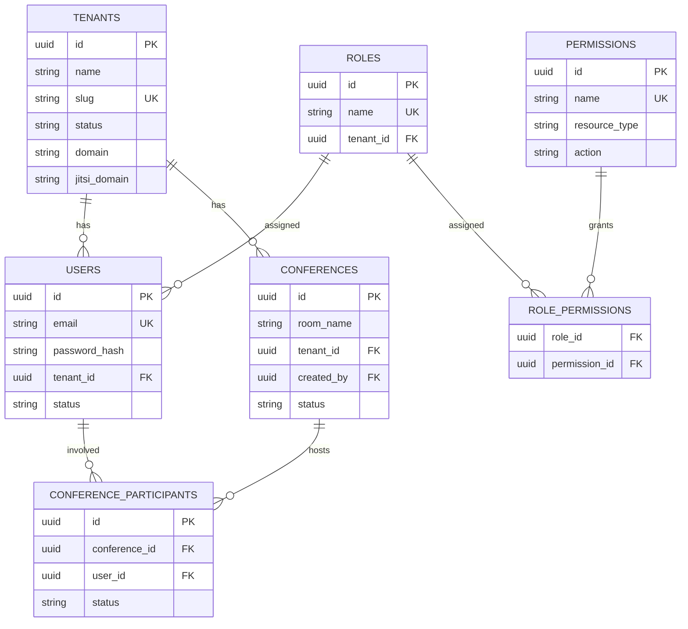
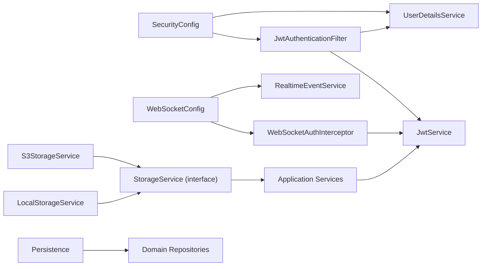

# Infrastructure Layer

<cite>
**Referenced Files in This Document**
- [JwtAuthenticationFilter.java](file://jmp-infrastructure/src/main/java/com/jmp/infrastructure/security/JwtAuthenticationFilter.java)
- [SecurityConfig.java](file://jmp-infrastructure/src/main/java/com/jmp/infrastructure/security/SecurityConfig.java)
- [UserDetailsServiceImpl.java](file://jmp-infrastructure/src/main/java/com/jmp/infrastructure/security/UserDetailsServiceImpl.java)
- [WebSocketConfig.java](file://jmp-infrastructure/src/main/java/com/jmp/infrastructure/websocket/WebSocketConfig.java)
- [WebSocketAuthInterceptor.java](file://jmp-infrastructure/src/main/java/com/jmp/infrastructure/websocket/WebSocketAuthInterceptor.java)
- [RealtimeEventService.java](file://jmp-infrastructure/src/main/java/com/jmp/infrastructure/websocket/RealtimeEventService.java)
- [S3StorageService.java](file://jmp-infrastructure/src/main/java/com/jmp/infrastructure/storage/S3StorageService.java)
- [LocalStorageService.java](file://jmp-infrastructure/src/main/java/com/jmp/infrastructure/storage/LocalStorageService.java)
- [StorageService.java](file://jmp-application/src/main/java/com/jmp/application/service/StorageService.java)
- [application.yml](file://jmp-web/src/main/resources/application.yml)
- [docker-compose.yml](file://docker-compose.yml)
- [V1__init_schema.sql](file://jmp-web/src/main/resources/db/migration/V1__init_schema.sql)
- [JwtService.java](file://jmp-application/src/main/java/com/jmp/application/service/JwtService.java)
- [GlobalExceptionHandler.java](file://jmp-api/src/main/java/com/jmp/api/advice/GlobalExceptionHandler.java)
- [JmpApplication.java](file://jmp-web/src/main/java/com/jmp/web/JmpApplication.java)
</cite>

## Update Summary
**Changes Made**
- Added comprehensive coverage of Spring Profile-based storage backend selection
- Documented MinIO service integration as S3-compatible storage backend
- Enhanced development environment configuration with Docker Compose services
- Updated storage service architecture to reflect dual implementation approach
- Added MinIO-specific configuration and deployment considerations

## Table of Contents
1. [Introduction](#introduction)
2. [Project Structure](#project-structure)
3. [Core Components](#core-components)
4. [Architecture Overview](#architecture-overview)
5. [Detailed Component Analysis](#detailed-component-analysis)
6. [Dependency Analysis](#dependency-analysis)
7. [Performance Considerations](#performance-considerations)
8. [Troubleshooting Guide](#troubleshooting-guide)
9. [Conclusion](#conclusion)
10. [Appendices](#appendices)

## Introduction
This document describes the Infrastructure Layer of the Jitsi Management Platform. It focuses on security configuration (JWT authentication filter, user details service, and Spring Security setup), WebSocket configuration for real-time communication and authentication interception, storage service implementation with Spring Profile-based backend selection, database configuration and persistence layer setup, and infrastructure-specific configurations such as CORS, rate limiting, and caching strategies. Cross-cutting concerns like logging, monitoring, and error handling are also addressed, along with how infrastructure services support the application layer while maintaining separation of concerns.

**Updated** Enhanced to include Spring Profile-based storage backend selection and MinIO service integration for S3-compatible object storage.

## Project Structure
The Infrastructure Layer spans several packages:
- Security: JWT filter, Spring Security configuration, and user details service
- WebSocket: STOMP broker configuration, authentication interceptor, and event broadcasting service
- Storage: Dual implementation approach with Spring Profile-based backend selection (Local for dev, S3/MinIO for production)
- Persistence: JPA/Hibernate configuration, Flyway migrations, and repository scanning
- Application services: Storage abstraction interface used by infrastructure components
- API: Global exception handling aligned with RFC 7807

**Diagram sources**
- [JwtAuthenticationFilter.java:1-122](file://jmp-infrastructure/src/main/java/com/jmp/infrastructure/security/JwtAuthenticationFilter.java#L1-L122)
- [SecurityConfig.java:1-90](file://jmp-infrastructure/src/main/java/com/jmp/infrastructure/security/SecurityConfig.java#L1-L90)
- [UserDetailsServiceImpl.java:1-48](file://jmp-infrastructure/src/main/java/com/jmp/infrastructure/security/UserDetailsServiceImpl.java#L1-L48)
- [WebSocketConfig.java:1-70](file://jmp-infrastructure/src/main/java/com/jmp/infrastructure/websocket/WebSocketConfig.java#L1-L70)
- [WebSocketAuthInterceptor.java:1-94](file://jmp-infrastructure/src/main/java/com/jmp/infrastructure/websocket/WebSocketAuthInterceptor.java#L1-L94)
- [RealtimeEventService.java:1-142](file://jmp-infrastructure/src/main/java/com/jmp/infrastructure/websocket/RealtimeEventService.java#L1-L142)
- [LocalStorageService.java:1-63](file://jmp-infrastructure/src/main/java/com/jmp/infrastructure/storage/LocalStorageService.java#L1-L63)
- [S3StorageService.java:1-131](file://jmp-infrastructure/src/main/java/com/jmp/infrastructure/storage/S3StorageService.java#L1-L131)
- [StorageService.java:1-56](file://jmp-application/src/main/java/com/jmp/application/service/StorageService.java#L1-L56)
- [application.yml:1-128](file://jmp-web/src/main/resources/application.yml#L1-L128)
- [V1__init_schema.sql:1-172](file://jmp-web/src/main/resources/db/migration/V1__init_schema.sql#L1-L172)
- [GlobalExceptionHandler.java:1-130](file://jmp-api/src/main/java/com/jmp/api/advice/GlobalExceptionHandler.java#L1-L130)

**Section sources**
- [JmpApplication.java:1-27](file://jmp-web/src/main/java/com/jmp/web/JmpApplication.java#L1-L27)
- [application.yml:1-128](file://jmp-web/src/main/resources/application.yml#L1-L128)
- [V1__init_schema.sql:1-172](file://jmp-web/src/main/resources/db/migration/V1__init_schema.sql#L1-L172)

## Core Components
- JWT Authentication Filter: Extracts Bearer tokens from HTTP Authorization headers, validates them, loads user details, and sets authentication in the security context. It excludes public endpoints and logs authentication outcomes.
- Spring Security Configuration: Disables CSRF, configures stateless sessions, applies CORS, permits public endpoints, and registers the JWT filter before the default form-based filter.
- User Details Service: Loads users by UUID (from JWT subject), checks activation status, and maps roles to granted authorities.
- WebSocket Configuration: Enables STOMP broker, registers endpoints with SockJS fallback, configures JSON message converters, and registers an authentication interceptor.
- WebSocket Authentication Interceptor: Validates JWT tokens from STOMP CONNECT headers or query parameters and attaches authentication to the session.
- Realtime Event Service: Sends tenant-scoped, user-scoped, and broadcast events via SimpMessagingTemplate with robust error logging.
- Storage Service Architecture: Dual implementation approach with Spring Profile-based backend selection - Local storage for development (`dev` profile) and S3/MinIO for production (`!dev` profile).
- Local Storage Service: In-memory implementation for development with token-based access control and local file simulation.
- S3/MinIO Storage Service: AWS SDK v2 implementation with S3Presigner for presigned URL generation, configurable region and endpoint for MinIO compatibility.
- Database and Persistence: JPA/Hibernate with PostgreSQL dialect, HikariCP connection pooling, Flyway migrations, and repository/entity scanning.
- Global Exception Handler: Standardizes error responses using RFC 7807 Problem Details.

**Updated** Added comprehensive coverage of Spring Profile-based storage backend selection and MinIO integration.

**Section sources**
- [JwtAuthenticationFilter.java:1-122](file://jmp-infrastructure/src/main/java/com/jmp/infrastructure/security/JwtAuthenticationFilter.java#L1-L122)
- [SecurityConfig.java:1-90](file://jmp-infrastructure/src/main/java/com/jmp/infrastructure/security/SecurityConfig.java#L1-L90)
- [UserDetailsServiceImpl.java:1-48](file://jmp-infrastructure/src/main/java/com/jmp/infrastructure/security/UserDetailsServiceImpl.java#L1-L48)
- [WebSocketConfig.java:1-70](file://jmp-infrastructure/src/main/java/com/jmp/infrastructure/websocket/WebSocketConfig.java#L1-L70)
- [WebSocketAuthInterceptor.java:1-94](file://jmp-infrastructure/src/main/java/com/jmp/infrastructure/websocket/WebSocketAuthInterceptor.java#L1-L94)
- [RealtimeEventService.java:1-142](file://jmp-infrastructure/src/main/java/com/jmp/infrastructure/websocket/RealtimeEventService.java#L1-L142)
- [LocalStorageService.java:1-63](file://jmp-infrastructure/src/main/java/com/jmp/infrastructure/storage/LocalStorageService.java#L1-L63)
- [S3StorageService.java:1-131](file://jmp-infrastructure/src/main/java/com/jmp/infrastructure/storage/S3StorageService.java#L1-L131)
- [StorageService.java:1-56](file://jmp-application/src/main/java/com/jmp/application/service/StorageService.java#L1-L56)
- [application.yml:1-128](file://jmp-web/src/main/resources/application.yml#L1-L128)
- [GlobalExceptionHandler.java:1-130](file://jmp-api/src/main/java/com/jmp/api/advice/GlobalExceptionHandler.java#L1-L130)

## Architecture Overview
The Infrastructure Layer integrates security, messaging, storage, and persistence to support the application layer. Security intercepts HTTP and WebSocket traffic, persistence manages relational data, and storage handles media lifecycles through a flexible backend selection mechanism. The API layer centralizes error handling.

**Updated** Enhanced to reflect Spring Profile-based storage backend selection and MinIO service integration.

**Diagram sources**
- [JwtAuthenticationFilter.java:1-122](file://jmp-infrastructure/src/main/java/com/jmp/infrastructure/security/JwtAuthenticationFilter.java#L1-L122)
- [SecurityConfig.java:1-90](file://jmp-infrastructure/src/main/java/com/jmp/infrastructure/security/SecurityConfig.java#L1-L90)
- [WebSocketConfig.java:1-70](file://jmp-infrastructure/src/main/java/com/jmp/infrastructure/websocket/WebSocketConfig.java#L1-L70)
- [WebSocketAuthInterceptor.java:1-94](file://jmp-infrastructure/src/main/java/com/jmp/infrastructure/websocket/WebSocketAuthInterceptor.java#L1-L94)
- [RealtimeEventService.java:1-142](file://jmp-infrastructure/src/main/java/com/jmp/infrastructure/websocket/RealtimeEventService.java#L1-L142)
- [LocalStorageService.java:18](file://jmp-infrastructure/src/main/java/com/jmp/infrastructure/storage/LocalStorageService.java#L18)
- [S3StorageService.java:26](file://jmp-infrastructure/src/main/java/com/jmp/infrastructure/storage/S3StorageService.java#L26)
- [docker-compose.yml:130-149](file://docker-compose.yml#L130-L149)
- [JwtService.java:1-236](file://jmp-application/src/main/java/com/jmp/application/service/JwtService.java#L1-L236)
- [StorageService.java:1-56](file://jmp-application/src/main/java/com/jmp/application/service/StorageService.java#L1-L56)
- [application.yml:1-128](file://jmp-web/src/main/resources/application.yml#L1-L128)

## Detailed Component Analysis

### Security Configuration
- JWT Authentication Filter
  - Extracts Bearer tokens from Authorization header
  - Validates access tokens via JwtService and loads user details via UserDetailsService
  - Sets authentication with authorities and stores tenant/user IDs in custom authentication details
  - Exempts public endpoints (auth, webhooks, actuator health, Swagger)
  - Logs outcomes and clears context on failure
- Spring Security Configuration
  - Stateless sessions, disabled CSRF, permissive CORS for local UI origins
  - Public endpoints permitted; others require authentication
  - Registers JwtAuthenticationFilter before UsernamePasswordAuthenticationFilter
  - Uses BCrypt encoder with configured strength and DAO provider
- User Details Service
  - Loads user by UUID (JWT subject), verifies active status, and maps roles to authorities

**Diagram sources**
- [JwtAuthenticationFilter.java:39-76](file://jmp-infrastructure/src/main/java/com/jmp/infrastructure/security/JwtAuthenticationFilter.java#L39-L76)
- [JwtService.java:165-171](file://jmp-application/src/main/java/com/jmp/application/service/JwtService.java#L165-L171)
- [UserDetailsServiceImpl.java:25-46](file://jmp-infrastructure/src/main/java/com/jmp/infrastructure/security/UserDetailsServiceImpl.java#L25-L46)

**Section sources**
- [JwtAuthenticationFilter.java:1-122](file://jmp-infrastructure/src/main/java/com/jmp/infrastructure/security/JwtAuthenticationFilter.java#L1-L122)
- [SecurityConfig.java:1-90](file://jmp-infrastructure/src/main/java/com/jmp/infrastructure/security/SecurityConfig.java#L1-L90)
- [UserDetailsServiceImpl.java:1-48](file://jmp-infrastructure/src/main/java/com/jmp/infrastructure/security/UserDetailsServiceImpl.java#L1-L48)
- [JwtService.java:1-236](file://jmp-application/src/main/java/com/jmp/application/service/JwtService.java#L1-L236)

### WebSocket Configuration and Real-Time Events
- WebSocket Configuration
  - Enables simple broker for topics and queues, app destinations, and user destinations
  - Registers /ws endpoint with SockJS fallback and native WebSocket
  - Configures JSON message converter with Jackson
  - Registers WebSocketAuthInterceptor for inbound channel
- WebSocket Authentication Interceptor
  - Validates JWT from STOMP CONNECT headers or login parameter
  - Attaches authentication and session attributes (tenantId)
- Realtime Event Service
  - Sends tenant-scoped, user-scoped, and broadcast events
  - Wraps payloads in a generic WebSocketEvent with timestamp
  - Logs and handles failures gracefully

**Diagram sources**
- [WebSocketConfig.java:32-55](file://jmp-infrastructure/src/main/java/com/jmp/infrastructure/websocket/WebSocketConfig.java#L32-L55)
- [WebSocketAuthInterceptor.java:33-73](file://jmp-infrastructure/src/main/java/com/jmp/infrastructure/websocket/WebSocketAuthInterceptor.java#L33-L73)
- [RealtimeEventService.java:88-101](file://jmp-infrastructure/src/main/java/com/jmp/infrastructure/websocket/RealtimeEventService.java#L88-L101)
- [JwtService.java:165-171](file://jmp-application/src/main/java/com/jmp/application/service/JwtService.java#L165-L171)

**Section sources**
- [WebSocketConfig.java:1-70](file://jmp-infrastructure/src/main/java/com/jmp/infrastructure/websocket/WebSocketConfig.java#L1-L70)
- [WebSocketAuthInterceptor.java:1-94](file://jmp-infrastructure/src/main/java/com/jmp/infrastructure/websocket/WebSocketAuthInterceptor.java#L1-L94)
- [RealtimeEventService.java:1-142](file://jmp-infrastructure/src/main/java/com/jmp/infrastructure/websocket/RealtimeEventService.java#L1-L142)

### Storage Service Implementation and Spring Profile-Based Backend Selection
- Storage Service Interface
  - Defines core storage operations: presigned URL generation, upload/download, deletion, scheduling, archiving, and restoration
  - Supports multiple providers: S3, Azure Blob, Google Cloud Storage, MinIO, and Local
- Local Storage Service (Dev Profile)
  - In-memory implementation for development environments
  - Uses Spring Profile annotation `@Profile("dev")` for automatic activation
  - Generates token-based URLs for simulated file access
  - Provides local file simulation with HashMap storage
- S3/MinIO Storage Service (Production Profile)
  - AWS SDK v2 implementation with S3Presigner for presigned URL generation
  - Uses Spring Profile annotation `@Profile("!dev")` for production environments
  - Configurable region, credentials, and endpoint for MinIO/S3-compatible storage
  - Supports endpoint override for MinIO service integration
  - Implements deletion, scheduling, archiving, and restoration operations
- Spring Profile Configuration
  - Development: `SPRING_PROFILES_ACTIVE: docker,dev` activates dev profile
  - Production: Default profile activates S3/MinIO implementation
  - Automatic backend selection based on active Spring profiles

**Updated** Comprehensive coverage of Spring Profile-based storage backend selection and MinIO integration.

**Diagram sources**
- [LocalStorageService.java:18](file://jmp-infrastructure/src/main/java/com/jmp/infrastructure/storage/LocalStorageService.java#L18)
- [S3StorageService.java:26](file://jmp-infrastructure/src/main/java/com/jmp/infrastructure/storage/S3StorageService.java#L26)
- [docker-compose.yml:50](file://docker-compose.yml#L50)

**Section sources**
- [LocalStorageService.java:1-63](file://jmp-infrastructure/src/main/java/com/jmp/infrastructure/storage/LocalStorageService.java#L1-L63)
- [S3StorageService.java:1-131](file://jmp-infrastructure/src/main/java/com/jmp/infrastructure/storage/S3StorageService.java#L1-L131)
- [StorageService.java:1-56](file://jmp-application/src/main/java/com/jmp/application/service/StorageService.java#L1-L56)
- [docker-compose.yml:50](file://docker-compose.yml#L50)

### Database Configuration and Persistence Layer
- JPA/Hibernate
  - PostgreSQL dialect, SQL formatting, batch sizing, and non-contextual LOBs
  - Open-in-view disabled, show-sql disabled
- Connection Pooling
  - HikariCP with tunable pool sizes, timeouts, and lifetime
- Flyway
  - Enabled with migration location and schema creation
- Repositories and Entities
  - Scanned across domain packages for repositories and entities
- Initial Schema
  - Multi-tenant schema with tenants, users, roles, permissions, conferences, and participants
  - Indexes optimized for common queries

**Diagram sources**
- [V1__init_schema.sql:10-172](file://jmp-web/src/main/resources/db/migration/V1__init_schema.sql#L10-L172)

**Section sources**
- [application.yml:12-56](file://jmp-web/src/main/resources/application.yml#L12-L56)
- [JmpApplication.java:15-21](file://jmp-web/src/main/java/com/jmp/web/JmpApplication.java#L15-L21)
- [V1__init_schema.sql:1-172](file://jmp-web/src/main/resources/db/migration/V1__init_schema.sql#L1-L172)

### Infrastructure-Specific Configurations
- CORS
  - Allowed origins for local UI development, methods, headers, and credentials enabled
- Rate Limiting
  - Dependencies present for resilience4j and bucket4j; configuration not shown here
- Caching Strategies
  - Redis configured for data access; caching not explicitly implemented in the analyzed files
- Compression
  - HTTP compression enabled for JSON/XML/text content types
- Development Environment Configuration
  - Docker Compose includes comprehensive service dependencies: PostgreSQL, Redis, MinIO, Jitsi services
  - Volume definitions for persistent data storage
  - Health checks for service readiness
  - MinIO integration with S3-compatible endpoint configuration

**Updated** Enhanced development environment configuration with comprehensive service dependencies and MinIO integration.

**Section sources**
- [SecurityConfig.java:77-88](file://jmp-infrastructure/src/main/java/com/jmp/infrastructure/security/SecurityConfig.java#L77-L88)
- [application.yml:63-70](file://jmp-web/src/main/resources/application.yml#L63-L70)
- [application.yml:45-56](file://jmp-web/src/main/resources/application.yml#L45-L56)
- [docker-compose.yml:1-342](file://docker-compose.yml#L1-L342)

### Cross-Cutting Concerns
- Logging
  - Structured JSON logging with trace correlation, debug levels for application packages
- Monitoring
  - Actuator endpoints exposed, Prometheus metrics enabled with application tags
- Error Handling
  - GlobalExceptionHandler returns RFC 7807 Problem Details for common HTTP errors

**Section sources**
- [application.yml:80-112](file://jmp-web/src/main/resources/application.yml#L80-L112)
- [GlobalExceptionHandler.java:1-130](file://jmp-api/src/main/java/com/jmp/api/advice/GlobalExceptionHandler.java#L1-L130)

## Dependency Analysis
The Infrastructure Layer components depend on application services and framework libraries. Security depends on JwtService and UserDetailsService; WebSocket depends on JwtService and SimpMessagingTemplate; Storage depends on AWS SDK v2 for S3/MinIO or local in-memory implementation; persistence depends on Hibernate, HikariCP, and Flyway.

**Updated** Enhanced dependency analysis to reflect Spring Profile-based storage backend selection.

**Diagram sources**
- [JwtAuthenticationFilter.java:31-37](file://jmp-infrastructure/src/main/java/com/jmp/infrastructure/security/JwtAuthenticationFilter.java#L31-L37)
- [SecurityConfig.java:33-40](file://jmp-infrastructure/src/main/java/com/jmp/infrastructure/security/SecurityConfig.java#L33-L40)
- [WebSocketConfig.java:27-31](file://jmp-infrastructure/src/main/java/com/jmp/infrastructure/websocket/WebSocketConfig.java#L27-L31)
- [WebSocketAuthInterceptor.java:31-32](file://jmp-infrastructure/src/main/java/com/jmp/infrastructure/websocket/WebSocketAuthInterceptor.java#L31-L32)
- [RealtimeEventService.java:22-23](file://jmp-infrastructure/src/main/java/com/jmp/infrastructure/websocket/RealtimeEventService.java#L22-L23)
- [LocalStorageService.java:20](file://jmp-infrastructure/src/main/java/com/jmp/infrastructure/storage/LocalStorageService.java#L20)
- [S3StorageService.java:28](file://jmp-infrastructure/src/main/java/com/jmp/infrastructure/storage/S3StorageService.java#L28)
- [StorageService.java:9-55](file://jmp-application/src/main/java/com/jmp/application/service/StorageService.java#L9-L55)

**Section sources**
- [JwtAuthenticationFilter.java:1-122](file://jmp-infrastructure/src/main/java/com/jmp/infrastructure/security/JwtAuthenticationFilter.java#L1-L122)
- [SecurityConfig.java:1-90](file://jmp-infrastructure/src/main/java/com/jmp/infrastructure/security/SecurityConfig.java#L1-L90)
- [WebSocketConfig.java:1-70](file://jmp-infrastructure/src/main/java/com/jmp/infrastructure/websocket/WebSocketConfig.java#L1-L70)
- [WebSocketAuthInterceptor.java:1-94](file://jmp-infrastructure/src/main/java/com/jmp/infrastructure/websocket/WebSocketAuthInterceptor.java#L1-L94)
- [RealtimeEventService.java:1-142](file://jmp-infrastructure/src/main/java/com/jmp/infrastructure/websocket/RealtimeEventService.java#L1-L142)
- [LocalStorageService.java:1-63](file://jmp-infrastructure/src/main/java/com/jmp/infrastructure/storage/LocalStorageService.java#L1-L63)
- [S3StorageService.java:1-131](file://jmp-infrastructure/src/main/java/com/jmp/infrastructure/storage/S3StorageService.java#L1-L131)
- [JwtService.java:1-236](file://jmp-application/src/main/java/com/jmp/application/service/JwtService.java#L1-L236)
- [StorageService.java:1-56](file://jmp-application/src/main/java/com/jmp/application/service/StorageService.java#L1-L56)

## Performance Considerations
- JWT Validation
  - Stateless processing reduces server-side session overhead; ensure token size remains minimal
- WebSocket Broker
  - In-memory broker suitable for development; consider external brokers (RabbitMQ/Redis) for production scaling
- Storage Backend Selection
  - Local storage for development provides low-latency access but limited scalability
  - S3/MinIO provides scalable, distributed storage with appropriate latency for production
  - Spring Profile-based selection ensures optimal backend for each environment
- Persistence
  - HikariCP tuning for pool sizes and timeouts; batch sizing and ordered inserts/updates reduce contention
- Compression
  - Enable compression for JSON responses to reduce bandwidth

**Updated** Added performance considerations for Spring Profile-based storage backend selection.

## Troubleshooting Guide
- Authentication Failures
  - Verify Authorization header format ("Bearer ..."), token validity, and excluded public endpoints
  - Check UserDetailsService activation status and role mapping
- WebSocket Connection Issues
  - Confirm Authorization header or login parameter presence; ensure broker endpoints are reachable
  - Review interceptor logs for invalid tokens and authentication attachment
- Storage Operations
  - **Local Storage (Dev)**: Verify token-based URLs and in-memory storage state
  - **S3/MinIO (Prod)**: Validate S3 credentials, region, and endpoint; confirm bucket existence and permissions
  - Check presigned URL expiration and signature correctness
  - **MinIO Integration**: Verify MinIO service health and endpoint configuration
- Database Connectivity
  - Review datasource configuration, HikariCP settings, and Flyway migration status
- Spring Profile Issues
  - Verify active profiles: `SPRING_PROFILES_ACTIVE: docker,dev` for development
  - Ensure correct storage backend is activated based on profile
- Error Responses
  - Inspect RFC 7807 Problem Details for structured error reporting

**Updated** Enhanced troubleshooting guide to include storage backend selection issues and MinIO-specific problems.

**Section sources**
- [JwtAuthenticationFilter.java:70-76](file://jmp-infrastructure/src/main/java/com/jmp/infrastructure/security/JwtAuthenticationFilter.java#L70-L76)
- [WebSocketAuthInterceptor.java:44-47](file://jmp-infrastructure/src/main/java/com/jmp/infrastructure/websocket/WebSocketAuthInterceptor.java#L44-L47)
- [LocalStorageService.java:25-40](file://jmp-infrastructure/src/main/java/com/jmp/infrastructure/storage/LocalStorageService.java#L25-L40)
- [S3StorageService.java:62-85](file://jmp-infrastructure/src/main/java/com/jmp/infrastructure/storage/S3StorageService.java#L62-L85)
- [docker-compose.yml:130-149](file://docker-compose.yml#L130-L149)
- [application.yml:12-23](file://jmp-web/src/main/resources/application.yml#L12-L23)
- [GlobalExceptionHandler.java:1-130](file://jmp-api/src/main/java/com/jmp/api/advice/GlobalExceptionHandler.java#L1-L130)

## Conclusion
The Infrastructure Layer establishes a secure, scalable foundation for the Jitsi Management Platform with enhanced flexibility through Spring Profile-based storage backend selection. JWT-based authentication and Spring Security protect HTTP endpoints, while WebSocket configuration enables real-time tenant-scoped events with robust authentication interception. The dual storage implementation approach provides optimal development experience with local storage and production-ready scalability with S3/MinIO integration. The persistence layer leverages JPA/Hibernate, HikariCP, and Flyway for reliable data management. Enhanced development environment configuration through Docker Compose provides comprehensive service dependencies including MinIO for S3-compatible object storage. Cross-cutting concerns such as logging, monitoring, and standardized error handling ensure operational excellence and maintain separation of concerns between infrastructure and application services.

**Updated** Enhanced conclusion to reflect Spring Profile-based storage backend selection and MinIO integration capabilities.

## Appendices
- Configuration Reference
  - Security: JWT secrets and expiration minutes/days
  - Database: JDBC URL, credentials, HikariCP pool settings
  - Storage: S3 bucket, region, access/secret keys, optional endpoint for MinIO
  - Spring Profiles: `dev` for local storage, `!dev` for S3/MinIO
  - Monitoring: Actuator endpoints and Prometheus metrics exposure
  - Development Environment: Docker Compose services and volume definitions
- Migration Notes
  - Initial schema includes multi-tenant entities, indexes, and comments for clarity
- MinIO Integration
  - S3-compatible object storage with configurable endpoint
  - Health checks and volume persistence for production deployments
  - Token-based access control for development environment

**Updated** Added configuration reference for Spring Profiles, storage backend selection, and MinIO integration.

**Section sources**
- [application.yml:71-128](file://jmp-web/src/main/resources/application.yml#L71-L128)
- [V1__init_schema.sql:1-172](file://jmp-web/src/main/resources/db/migration/V1__init_schema.sql#L1-L172)
- [docker-compose.yml:130-149](file://docker-compose.yml#L130-L149)
- [LocalStorageService.java:18](file://jmp-infrastructure/src/main/java/com/jmp/infrastructure/storage/LocalStorageService.java#L18)
- [S3StorageService.java:26](file://jmp-infrastructure/src/main/java/com/jmp/infrastructure/storage/S3StorageService.java#L26)