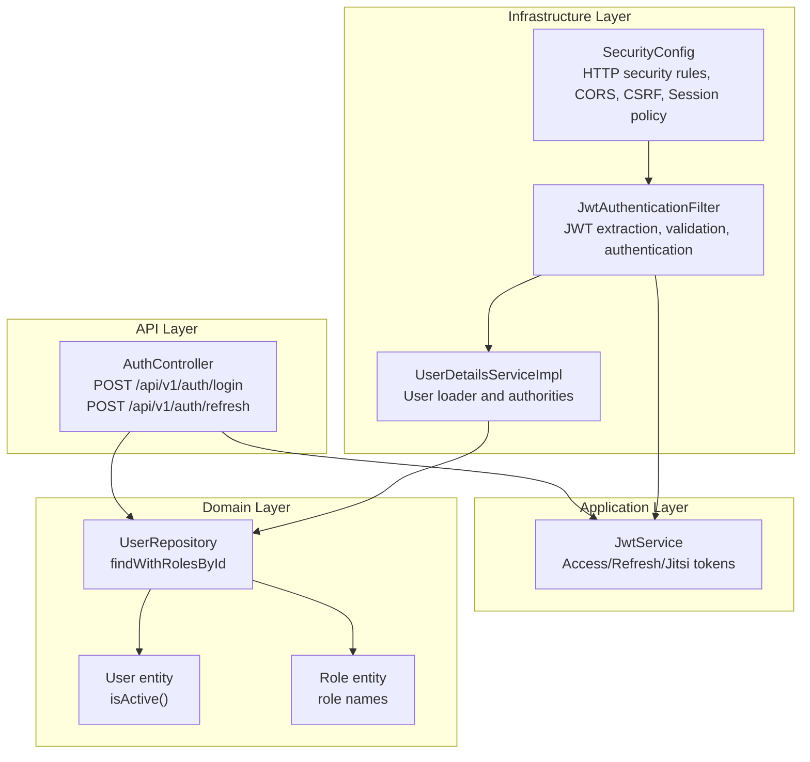
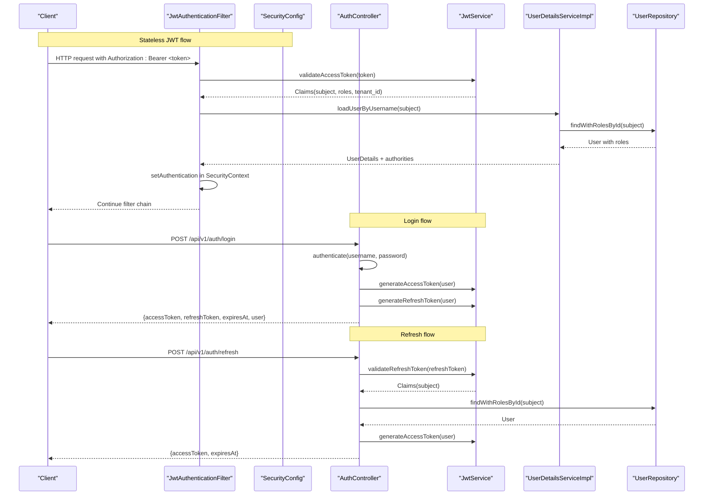
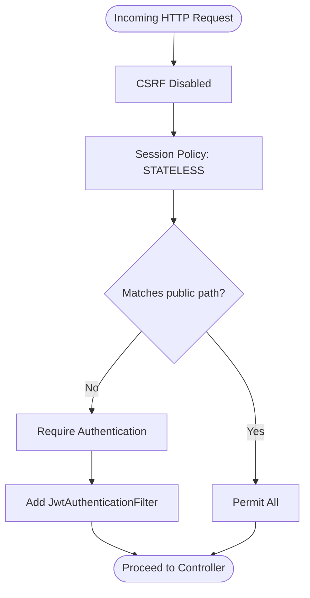
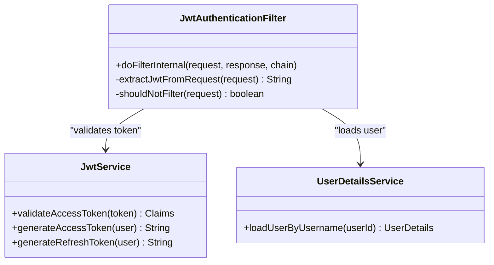
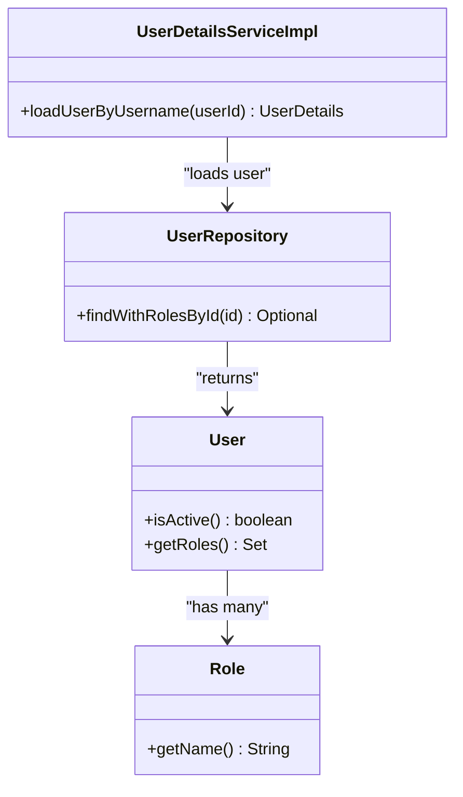
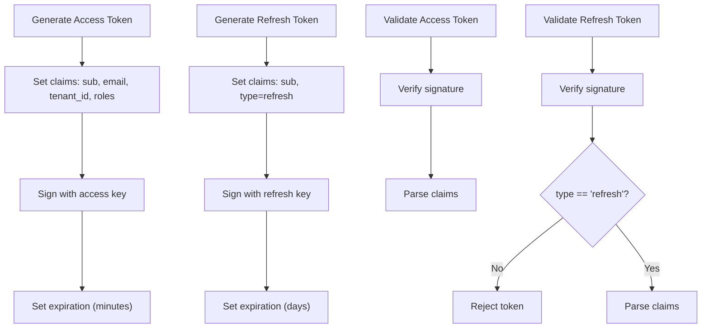
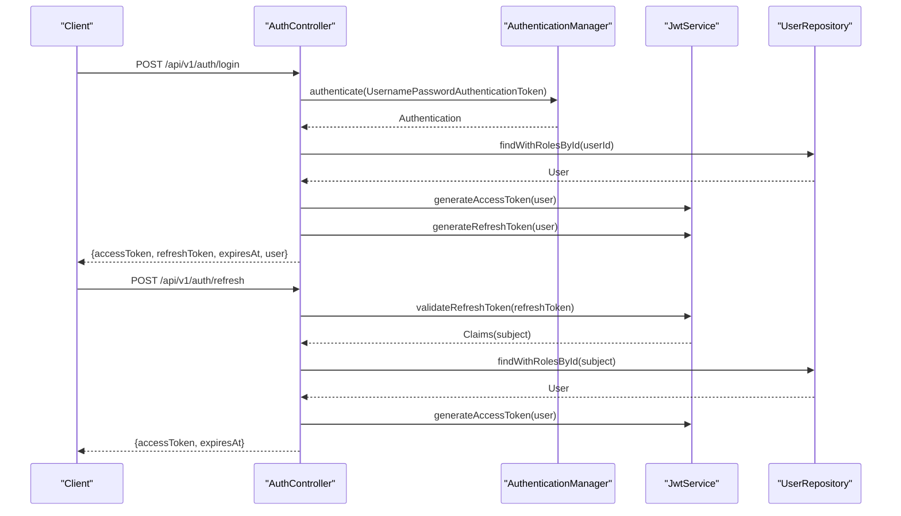
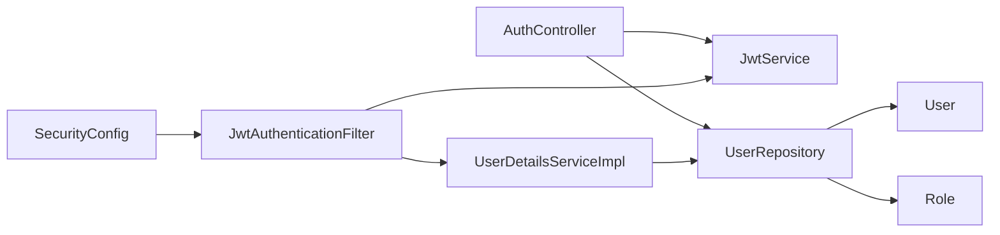

# Security Implementation

<cite>
**Referenced Files in This Document**
- [SecurityConfig.java](file://jmp-infrastructure/src/main/java/com/jmp/infrastructure/security/SecurityConfig.java)
- [JwtAuthenticationFilter.java](file://jmp-infrastructure/src/main/java/com/jmp/infrastructure/security/JwtAuthenticationFilter.java)
- [UserDetailsServiceImpl.java](file://jmp-infrastructure/src/main/java/com/jmp/infrastructure/security/UserDetailsServiceImpl.java)
- [JwtService.java](file://jmp-application/src/main/java/com/jmp/application/service/JwtService.java)
- [AuthController.java](file://jmp-api/src/main/java/com/jmp/api/controller/AuthController.java)
- [application.yml](file://jmp-web/src/main/resources/application.yml)
- [UserRepository.java](file://jmp-domain/src/main/java/com/jmp/domain/repository/UserRepository.java)
- [User.java](file://jmp-domain/src/main/java/com/jmp/domain/entity/User.java)
- [Role.java](file://jmp-domain/src/main/java/com/jmp/domain/entity/Role.java)
- [JmpApplication.java](file://jmp-web/src/main/java/com/jmp/web/JmpApplication.java)
</cite>

## Table of Contents
1. [Introduction](#introduction)
2. [Project Structure](#project-structure)
3. [Core Components](#core-components)
4. [Architecture Overview](#architecture-overview)
5. [Detailed Component Analysis](#detailed-component-analysis)
6. [Dependency Analysis](#dependency-analysis)
7. [Performance Considerations](#performance-considerations)
8. [Troubleshooting Guide](#troubleshooting-guide)
9. [Conclusion](#conclusion)

## Introduction
This document details the Security Implementation in the Infrastructure Layer of the platform. It covers HTTP security rules, CSRF protection, CORS configuration, security headers, JWT authentication filter, token lifecycle (generation, validation, refresh), UserDetailsService integration, password encoding, session management, method-level security annotations, and best practices to prevent common vulnerabilities. It also provides examples of secured endpoints and authentication flows.

## Project Structure
Security-related components are organized across three layers:
- Infrastructure: Spring Security configuration, JWT filter, and user details service
- Application: JWT service for token operations
- API: Authentication controller exposing login and token refresh endpoints

**Diagram sources**
- [SecurityConfig.java:42-61](file://jmp-infrastructure/src/main/java/com/jmp/infrastructure/security/SecurityConfig.java#L42-L61)
- [JwtAuthenticationFilter.java:39-76](file://jmp-infrastructure/src/main/java/com/jmp/infrastructure/security/JwtAuthenticationFilter.java#L39-L76)
- [UserDetailsServiceImpl.java:25-46](file://jmp-infrastructure/src/main/java/com/jmp/infrastructure/security/UserDetailsServiceImpl.java#L25-L46)
- [JwtService.java:49-87](file://jmp-application/src/main/java/com/jmp/application/service/JwtService.java#L49-L87)
- [AuthController.java:42-100](file://jmp-api/src/main/java/com/jmp/api/controller/AuthController.java#L42-L100)
- [UserRepository.java:36-37](file://jmp-domain/src/main/java/com/jmp/domain/repository/UserRepository.java#L36-L37)
- [User.java:120-122](file://jmp-domain/src/main/java/com/jmp/domain/entity/User.java#L120-L122)
- [Role.java:123-129](file://jmp-domain/src/main/java/com/jmp/domain/entity/Role.java#L123-L129)

**Section sources**
- [SecurityConfig.java:28-61](file://jmp-infrastructure/src/main/java/com/jmp/infrastructure/security/SecurityConfig.java#L28-L61)
- [JwtAuthenticationFilter.java:27-76](file://jmp-infrastructure/src/main/java/com/jmp/infrastructure/security/JwtAuthenticationFilter.java#L27-L76)
- [UserDetailsServiceImpl.java:19-46](file://jmp-infrastructure/src/main/java/com/jmp/infrastructure/security/UserDetailsServiceImpl.java#L19-L46)
- [JwtService.java:27-87](file://jmp-application/src/main/java/com/jmp/application/service/JwtService.java#L27-L87)
- [AuthController.java:30-100](file://jmp-api/src/main/java/com/jmp/api/controller/AuthController.java#L30-L100)
- [UserRepository.java:18-37](file://jmp-domain/src/main/java/com/jmp/domain/repository/UserRepository.java#L18-L37)
- [User.java:28-122](file://jmp-domain/src/main/java/com/jmp/domain/entity/User.java#L28-L122)
- [Role.java:27-129](file://jmp-domain/src/main/java/com/jmp/domain/entity/Role.java#L27-L129)

## Core Components
- HTTP Security Rules: Stateless session policy, CSRF disabled, public endpoints exposed, all other endpoints require authentication.
- CORS: Configured for local development origins with credentials allowed.
- Password Encoding: BCrypt encoder with a cost factor of 12.
- JWT Authentication Filter: Extracts Authorization Bearer token, validates access token via JwtService, loads user via UserDetailsService, sets authentication in SecurityContext.
- UserDetailsService: Loads user by ID (UUID string), checks active status, and maps roles to granted authorities.
- JWT Service: Generates access and refresh tokens, validates tokens, extracts claims, and computes expiration.
- Authentication Controller: Handles login and refresh token requests, integrates with AuthenticationManager and JwtService.

**Section sources**
- [SecurityConfig.java:42-88](file://jmp-infrastructure/src/main/java/com/jmp/infrastructure/security/SecurityConfig.java#L42-L88)
- [JwtAuthenticationFilter.java:39-94](file://jmp-infrastructure/src/main/java/com/jmp/infrastructure/security/JwtAuthenticationFilter.java#L39-L94)
- [UserDetailsServiceImpl.java:25-46](file://jmp-infrastructure/src/main/java/com/jmp/infrastructure/security/UserDetailsServiceImpl.java#L25-L46)
- [JwtService.java:49-87](file://jmp-application/src/main/java/com/jmp/application/service/JwtService.java#L49-L87)
- [AuthController.java:42-100](file://jmp-api/src/main/java/com/jmp/api/controller/AuthController.java#L42-L100)

## Architecture Overview
The security architecture enforces stateless authentication using JWT. Requests pass through the JwtAuthenticationFilter before reaching controllers. Authentication is performed by extracting and validating the JWT, loading user details, and setting an authenticated context. Access and refresh tokens are generated by JwtService and returned by AuthController.

**Diagram sources**
- [JwtAuthenticationFilter.java:39-76](file://jmp-infrastructure/src/main/java/com/jmp/infrastructure/security/JwtAuthenticationFilter.java#L39-L76)
- [SecurityConfig.java:42-61](file://jmp-infrastructure/src/main/java/com/jmp/infrastructure/security/SecurityConfig.java#L42-L61)
- [AuthController.java:42-100](file://jmp-api/src/main/java/com/jmp/api/controller/AuthController.java#L42-L100)
- [JwtService.java:165-188](file://jmp-application/src/main/java/com/jmp/application/service/JwtService.java#L165-L188)
- [UserDetailsServiceImpl.java:25-46](file://jmp-infrastructure/src/main/java/com/jmp/infrastructure/security/UserDetailsServiceImpl.java#L25-L46)
- [UserRepository.java:36-37](file://jmp-domain/src/main/java/com/jmp/domain/repository/UserRepository.java#L36-L37)

## Detailed Component Analysis

### HTTP Security Rules and CORS
- CSRF is disabled because the system uses stateless JWT tokens.
- Session management is stateless to support horizontal scaling.
- Public endpoints include authentication, webhooks, health, and Swagger UI.
- All other endpoints require authentication.
- CORS allows local development origins, credentials, and standard HTTP methods.

**Diagram sources**
- [SecurityConfig.java:42-61](file://jmp-infrastructure/src/main/java/com/jmp/infrastructure/security/SecurityConfig.java#L42-L61)

**Section sources**
- [SecurityConfig.java:42-88](file://jmp-infrastructure/src/main/java/com/jmp/infrastructure/security/SecurityConfig.java#L42-L88)

### JWT Authentication Filter
- Extracts Authorization header, expects Bearer token.
- Validates access token via JwtService and reads claims.
- Loads user by ID using UserDetailsService and maps roles to authorities.
- Sets authentication in SecurityContext with remote address and claims metadata.
- Skips filtering for public endpoints.

**Diagram sources**
- [JwtAuthenticationFilter.java:29-94](file://jmp-infrastructure/src/main/java/com/jmp/infrastructure/security/JwtAuthenticationFilter.java#L29-L94)
- [JwtService.java:165-188](file://jmp-application/src/main/java/com/jmp/application/service/JwtService.java#L165-L188)

**Section sources**
- [JwtAuthenticationFilter.java:39-94](file://jmp-infrastructure/src/main/java/com/jmp/infrastructure/security/JwtAuthenticationFilter.java#L39-L94)

### UserDetailsService Implementation
- Loads user by UUID string (JWT subject).
- Enforces active status; inactive users cause authentication failure.
- Maps roles to granted authorities for method security and access decisions.

**Diagram sources**
- [UserDetailsServiceImpl.java:25-46](file://jmp-infrastructure/src/main/java/com/jmp/infrastructure/security/UserDetailsServiceImpl.java#L25-L46)
- [UserRepository.java:36-37](file://jmp-domain/src/main/java/com/jmp/domain/repository/UserRepository.java#L36-L37)
- [User.java:120-122](file://jmp-domain/src/main/java/com/jmp/domain/entity/User.java#L120-L122)
- [Role.java:123-129](file://jmp-domain/src/main/java/com/jmp/domain/entity/Role.java#L123-L129)

**Section sources**
- [UserDetailsServiceImpl.java:25-46](file://jmp-infrastructure/src/main/java/com/jmp/infrastructure/security/UserDetailsServiceImpl.java#L25-L46)
- [UserRepository.java:36-37](file://jmp-domain/src/main/java/com/jmp/domain/repository/UserRepository.java#L36-L37)
- [User.java:120-122](file://jmp-domain/src/main/java/com/jmp/domain/entity/User.java#L120-L122)
- [Role.java:123-129](file://jmp-domain/src/main/java/com/jmp/domain/entity/Role.java#L123-L129)

### JWT Token Generation, Validation, and Refresh
- Access token: short-lived (default 15 minutes), includes user ID, email, tenant ID, and roles.
- Refresh token: longer-lived (default 7 days), includes a type claim to prevent misuse.
- Jitsi and guest tokens: specialized claims for conferencing scenarios.
- Validation ensures signatures match configured keys and rejects invalid token types.

**Diagram sources**
- [JwtService.java:49-87](file://jmp-application/src/main/java/com/jmp/application/service/JwtService.java#L49-L87)
- [JwtService.java:165-188](file://jmp-application/src/main/java/com/jmp/application/service/JwtService.java#L165-L188)

**Section sources**
- [JwtService.java:49-87](file://jmp-application/src/main/java/com/jmp/application/service/JwtService.java#L49-L87)
- [JwtService.java:165-188](file://jmp-application/src/main/java/com/jmp/application/service/JwtService.java#L165-L188)

### Authentication Controller Flow
- Login: authenticates credentials via AuthenticationManager, generates access and refresh tokens, records login.
- Refresh: validates refresh token, regenerates access token for the user.

**Diagram sources**
- [AuthController.java:42-100](file://jmp-api/src/main/java/com/jmp/api/controller/AuthController.java#L42-L100)
- [JwtService.java:165-188](file://jmp-application/src/main/java/com/jmp/application/service/JwtService.java#L165-L188)
- [UserRepository.java:36-37](file://jmp-domain/src/main/java/com/jmp/domain/repository/UserRepository.java#L36-L37)

**Section sources**
- [AuthController.java:42-100](file://jmp-api/src/main/java/com/jmp/api/controller/AuthController.java#L42-L100)

### Security Headers and Best Practices
- CSRF disabled due to stateless JWT usage.
- Session policy is stateless to avoid server-side session storage.
- CORS configured for local development origins with credentials.
- Password encoding uses BCrypt with a cost factor of 12.
- Method-level security is enabled to support @PreAuthorize and similar annotations.
- Tokens carry minimal necessary claims; sensitive data is not stored in JWT payloads.

**Section sources**
- [SecurityConfig.java:42-88](file://jmp-infrastructure/src/main/java/com/jmp/infrastructure/security/SecurityConfig.java#L42-L88)
- [application.yml:71-78](file://jmp-web/src/main/resources/application.yml#L71-L78)

### Secured Endpoints and Authentication Examples
- Public endpoints:
  - POST /api/v1/auth/login
  - POST /api/v1/auth/refresh
  - POST /api/v1/webhooks/**
  - GET /actuator/health
  - /swagger-ui/** and /v3/api-docs/**
- Protected endpoints:
  - All other routes under /api/v1/** require a valid access token in the Authorization header.

Example request/response patterns are defined in the controller records:
- LoginRequest, AuthResponse
- RefreshTokenRequest, TokenRefreshResponse

**Section sources**
- [SecurityConfig.java:49-56](file://jmp-infrastructure/src/main/java/com/jmp/infrastructure/security/SecurityConfig.java#L49-L56)
- [AuthController.java:103-122](file://jmp-api/src/main/java/com/jmp/api/controller/AuthController.java#L103-L122)

## Dependency Analysis
The security layer depends on JwtService for token operations and UserDetailsService for user resolution. AuthController orchestrates authentication and refresh flows. Domain repositories enforce user existence and roles.

**Diagram sources**
- [AuthController.java:37-40](file://jmp-api/src/main/java/com/jmp/api/controller/AuthController.java#L37-L40)
- [JwtService.java:27-43](file://jmp-application/src/main/java/com/jmp/application/service/JwtService.java#L27-L43)
- [SecurityConfig.java:33-39](file://jmp-infrastructure/src/main/java/com/jmp/infrastructure/security/SecurityConfig.java#L33-L39)
- [JwtAuthenticationFilter.java:31-36](file://jmp-infrastructure/src/main/java/com/jmp/infrastructure/security/JwtAuthenticationFilter.java#L31-L36)
- [UserDetailsServiceImpl.java:21-23](file://jmp-infrastructure/src/main/java/com/jmp/infrastructure/security/UserDetailsServiceImpl.java#L21-L23)
- [UserRepository.java:18-37](file://jmp-domain/src/main/java/com/jmp/domain/repository/UserRepository.java#L18-L37)
- [User.java:28-96](file://jmp-domain/src/main/java/com/jmp/domain/entity/User.java#L28-L96)
- [Role.java:27-59](file://jmp-domain/src/main/java/com/jmp/domain/entity/Role.java#L27-L59)

**Section sources**
- [AuthController.java:37-40](file://jmp-api/src/main/java/com/jmp/api/controller/AuthController.java#L37-L40)
- [JwtService.java:27-43](file://jmp-application/src/main/java/com/jmp/application/service/JwtService.java#L27-L43)
- [SecurityConfig.java:33-39](file://jmp-infrastructure/src/main/java/com/jmp/infrastructure/security/SecurityConfig.java#L33-L39)
- [JwtAuthenticationFilter.java:31-36](file://jmp-infrastructure/src/main/java/com/jmp/infrastructure/security/JwtAuthenticationFilter.java#L31-L36)
- [UserDetailsServiceImpl.java:21-23](file://jmp-infrastructure/src/main/java/com/jmp/infrastructure/security/UserDetailsServiceImpl.java#L21-L23)
- [UserRepository.java:18-37](file://jmp-domain/src/main/java/com/jmp/domain/repository/UserRepository.java#L18-L37)

## Performance Considerations
- Stateless sessions eliminate server-side session overhead.
- JWT validation is CPU-bound; keep token payload minimal.
- Use efficient password encoding cost factors; 12 is applied here.
- Ensure UserRepository queries are optimized with proper entity graphs to avoid N+1 selects.
- Consider caching frequently accessed user roles and permissions at the application level.

## Troubleshooting Guide
Common issues and resolutions:
- Invalid credentials during login:
  - AuthController throws bad credentials; verify email/password and user active status.
- Token validation failures:
  - JwtService.validateAccessToken throws on invalid/expired tokens; ensure correct signing keys and non-expired tokens.
- User not found or inactive:
  - UserDetailsServiceImpl throws UsernameNotFoundException for missing/inactive users.
- Public endpoints still blocked:
  - Confirm SecurityConfig authorizeHttpRequests paths and that the filter is added before UsernamePasswordAuthenticationFilter.

**Section sources**
- [AuthController.java:75-81](file://jmp-api/src/main/java/com/jmp/api/controller/AuthController.java#L75-L81)
- [JwtService.java:165-188](file://jmp-application/src/main/java/com/jmp/application/service/JwtService.java#L165-L188)
- [UserDetailsServiceImpl.java:27-33](file://jmp-infrastructure/src/main/java/com/jmp/infrastructure/security/UserDetailsServiceImpl.java#L27-L33)
- [SecurityConfig.java:49-58](file://jmp-infrastructure/src/main/java/com/jmp/infrastructure/security/SecurityConfig.java#L49-L58)

## Conclusion
The security implementation enforces stateless JWT-based authentication with clear separation of concerns across infrastructure, application, and API layers. It disables CSRF for stateless operation, configures CORS for development, and uses BCrypt for password hashing. The JwtAuthenticationFilter, JwtService, and UserDetailsService collaborate to authenticate users and authorize access to protected endpoints. Method-level security is enabled for fine-grained authorization controls. Adhering to these patterns and best practices helps mitigate common vulnerabilities and supports scalable, maintainable security.