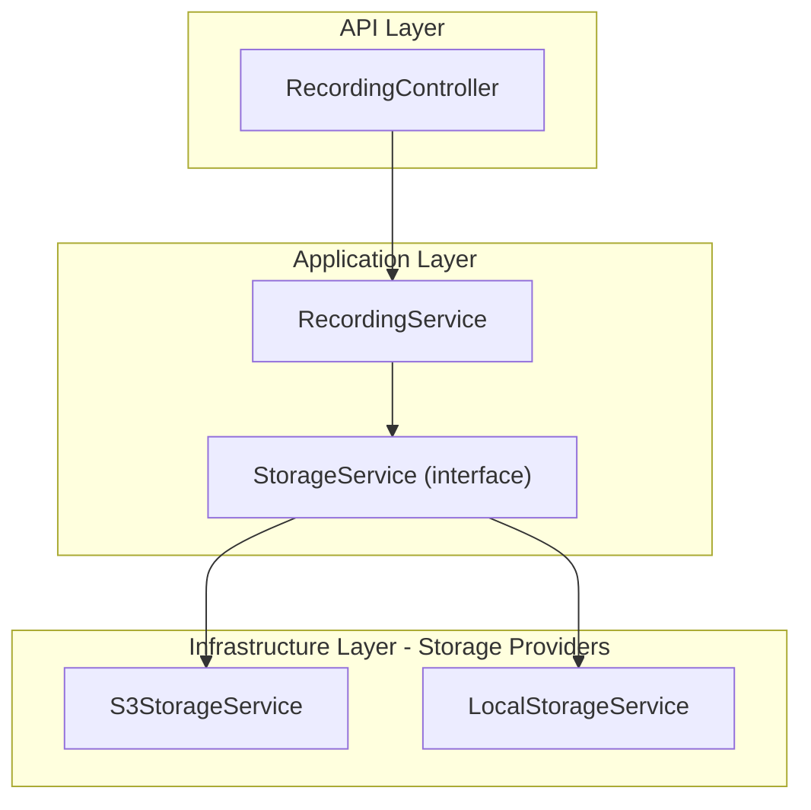
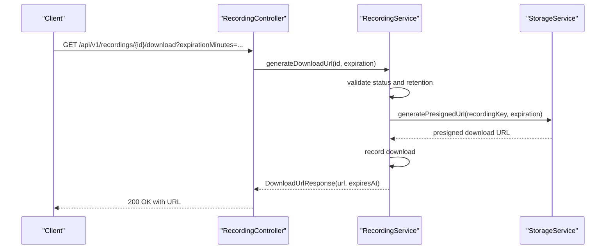
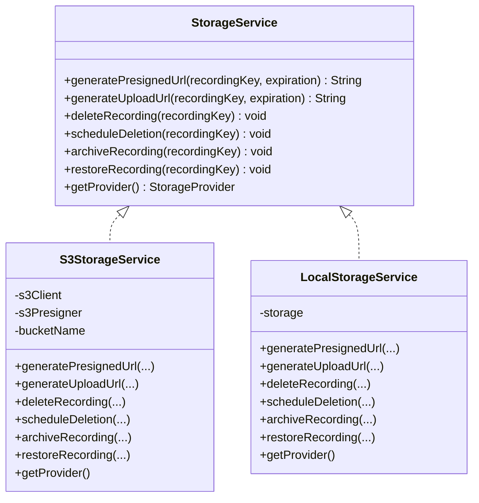
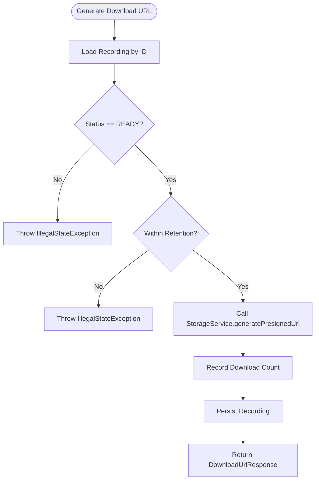
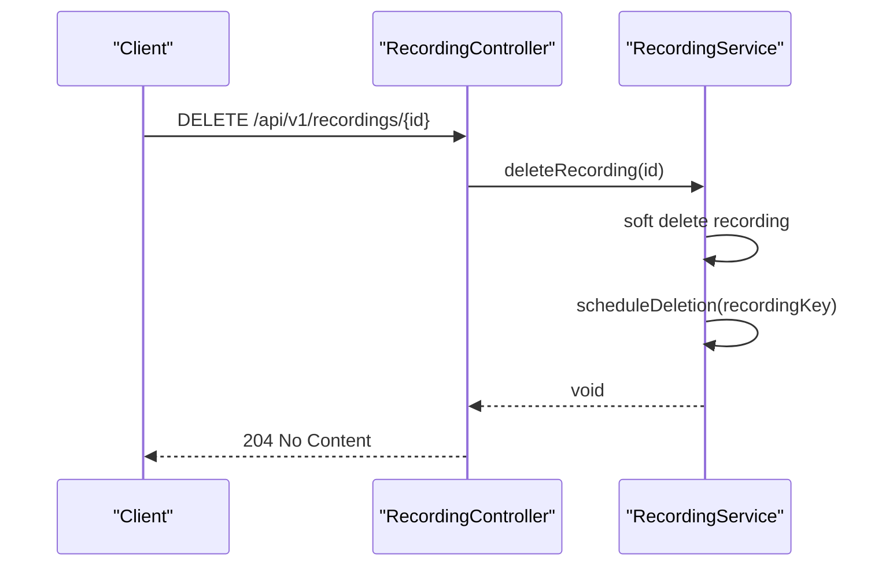
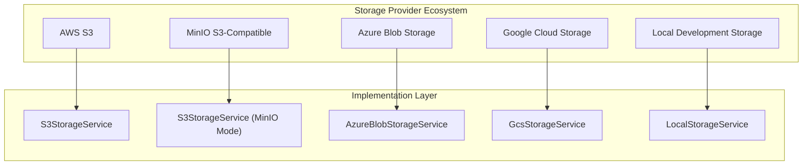
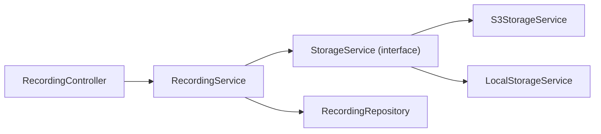
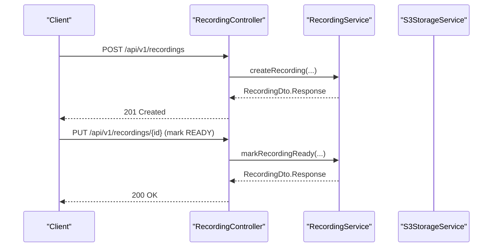
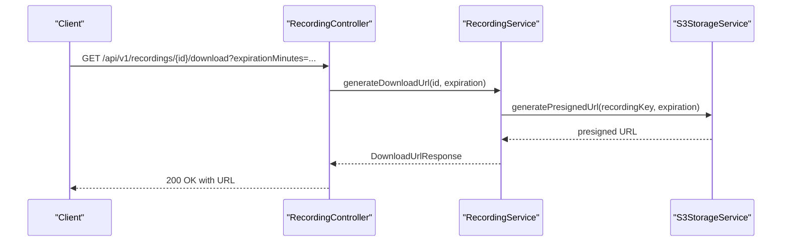

# Storage Integration

<cite>
**Referenced Files in This Document**
- [S3StorageService.java](file://jmp-infrastructure/src/main/java/com/jmp/infrastructure/storage/S3StorageService.java)
- [LocalStorageService.java](file://jmp-infrastructure/src/main/java/com/jmp/infrastructure/storage/LocalStorageService.java)
- [StorageService.java](file://jmp-application/src/main/java/com/jmp/application/service/StorageService.java)
- [RecordingService.java](file://jmp-application/src/main/java/com/jmp/application/service/RecordingService.java)
- [RecordingController.java](file://jmp-api/src/main/java/com/jmp/api/controller/RecordingController.java)
- [application.yml](file://jmp-web/src/main/resources/application.yml)
- [docker-compose.yml](file://docker-compose.yml)
</cite>

## Update Summary
**Changes Made**
- Added documentation for LocalStorageService implementation for development environment
- Enhanced MinIO S3-compatible storage integration documentation
- Updated storage provider ecosystem coverage to include LOCAL and MINIO providers
- Added configuration examples for local development and MinIO deployment
- Expanded troubleshooting guide with local storage considerations

## Table of Contents
1. [Introduction](#introduction)
2. [Project Structure](#project-structure)
3. [Core Components](#core-components)
4. [Architecture Overview](#architecture-overview)
5. [Detailed Component Analysis](#detailed-component-analysis)
6. [Storage Provider Ecosystem](#storage-provider-ecosystem)
7. [Dependency Analysis](#dependency-analysis)
8. [Performance Considerations](#performance-considerations)
9. [Troubleshooting Guide](#troubleshooting-guide)
10. [Conclusion](#conclusion)
11. [Appendices](#appendices)

## Introduction
This document describes the Storage Integration for the Infrastructure Layer with a comprehensive focus on AWS S3, MinIO S3-compatible storage, and local development storage. It covers bucket configuration, presigned URL generation for secure downloads/uploads, file lifecycle operations (delete, archive, restore), and credential management. The system now supports multiple storage providers including S3, MinIO, Azure Blob, GCP Storage, and Local storage implementations. Security considerations such as IAM policies, bucket policies, and encryption at rest are addressed conceptually, along with operational guidance for reliability and fallback options.

## Project Structure
The storage integration spans three layers with multiple provider implementations:
- Application layer defines the StorageService interface and domain logic for recordings.
- Infrastructure layer implements StorageService using AWS S3 SDK, MinIO-compatible services, and local in-memory storage.
- API layer exposes endpoints to manage recordings and generate download URLs.



**Diagram sources**
- [RecordingController.java:1-138](file://jmp-api/src/main/java/com/jmp/api/controller/RecordingController.java#L1-L138)
- [RecordingService.java:1-332](file://jmp-application/src/main/java/com/jmp/application/service/RecordingService.java#L1-L332)
- [StorageService.java:1-56](file://jmp-application/src/main/java/com/jmp/application/service/StorageService.java#L1-L56)
- [S3StorageService.java:1-131](file://jmp-infrastructure/src/main/java/com/jmp/infrastructure/storage/S3StorageService.java#L1-L131)
- [LocalStorageService.java:1-63](file://jmp-infrastructure/src/main/java/com/jmp/infrastructure/storage/LocalStorageService.java#L1-L63)

**Section sources**
- [RecordingController.java:1-138](file://jmp-api/src/main/java/com/jmp/api/controller/RecordingController.java#L1-L138)
- [RecordingService.java:1-332](file://jmp-application/src/main/java/com/jmp/application/service/RecordingService.java#L1-L332)
- [StorageService.java:1-56](file://jmp-application/src/main/java/com/jmp/application/service/StorageService.java#L1-L56)
- [S3StorageService.java:1-131](file://jmp-infrastructure/src/main/java/com/jmp/infrastructure/storage/S3StorageService.java#L1-L131)
- [LocalStorageService.java:1-63](file://jmp-infrastructure/src/main/java/com/jmp/infrastructure/storage/LocalStorageService.java#L1-L63)

## Core Components
- StorageService interface: Defines the contract for storage operations including presigned URL generation for downloads and uploads, deletion, scheduled deletion, archiving, restoration, and provider identification.
- S3StorageService: Implements StorageService using AWS S3 SDK and S3 Presigner to generate time-limited URLs for secure access, with built-in MinIO compatibility.
- LocalStorageService: Implements StorageService using in-memory storage for development environments with profile-based activation.
- RecordingService: Orchestrates recording lifecycle, validates readiness and retention, records downloads, and delegates storage operations.
- RecordingController: Exposes REST endpoints to manage recordings and generate download URLs.

Key capabilities:
- Presigned download and upload URLs with configurable expiration.
- Multiple storage provider support (S3, MinIO, Azure Blob, GCP Storage, Local).
- Deletion and scheduled deletion hooks for asynchronous cleanup.
- Archival and restore placeholders for cold storage transitions.
- Profile-based service selection for development and production environments.

**Section sources**
- [StorageService.java:1-56](file://jmp-application/src/main/java/com/jmp/application/service/StorageService.java#L1-L56)
- [S3StorageService.java:1-131](file://jmp-infrastructure/src/main/java/com/jmp/infrastructure/storage/S3StorageService.java#L1-L131)
- [LocalStorageService.java:1-63](file://jmp-infrastructure/src/main/java/com/jmp/infrastructure/storage/LocalStorageService.java#L1-L63)
- [RecordingService.java:137-170](file://jmp-application/src/main/java/com/jmp/application/service/RecordingService.java#L137-L170)
- [RecordingController.java:91-103](file://jmp-api/src/main/java/com/jmp/api/controller/RecordingController.java#L91-L103)

## Architecture Overview
The storage integration follows a layered architecture with multiple provider implementations:
- API layer handles HTTP requests and delegates to application services.
- Application service enforces business rules (status checks, retention, download counts) and coordinates with storage.
- Infrastructure services encapsulate different storage backends, exposing a unified interface to the application.



**Diagram sources**
- [RecordingController.java:91-103](file://jmp-api/src/main/java/com/jmp/api/controller/RecordingController.java#L91-L103)
- [RecordingService.java:141-170](file://jmp-application/src/main/java/com/jmp/application/service/RecordingService.java#L141-L170)
- [S3StorageService.java:61-72](file://jmp-infrastructure/src/main/java/com/jmp/infrastructure/storage/S3StorageService.java#L61-L72)
- [LocalStorageService.java:24-28](file://jmp-infrastructure/src/main/java/com/jmp/infrastructure/storage/LocalStorageService.java#L24-L28)

## Detailed Component Analysis

### StorageService Interface
Defines the contract for storage operations:
- Presigned download URL generation with expiration.
- Presigned upload URL generation with expiration.
- Delete and schedule deletion of a recording by key.
- Archive and restore operations for cold storage transitions.
- Provider enumeration for extensibility supporting S3, MinIO, Azure Blob, GCP Storage, and Local.

Operational notes:
- Expiration is modeled as java.time.Duration to allow flexible TTL configuration.
- The provider enum supports multiple backends, enabling future migration or hybrid setups.

**Section sources**
- [StorageService.java:9-56](file://jmp-application/src/main/java/com/jmp/application/service/StorageService.java#L9-L56)

### S3StorageService Implementation
Implements StorageService using AWS S3 SDK with enhanced MinIO compatibility:
- S3Client and S3Presigner configured with region, static credentials, and optional endpoint override for MinIO/S3-compatible services.
- Presigned download URL generation via GetObjectPresignRequest.
- Presigned upload URL generation via PutObjectPresignRequest.
- Deletion via DeleteObjectRequest.
- Scheduled deletion currently delegates to immediate deletion; designed for extension with delayed queues.
- Archive and restore are placeholders for lifecycle policies or archive storage classes.
- Profile-based activation (@Profile("!dev")) ensures production environment usage.



**Diagram sources**
- [StorageService.java:9-56](file://jmp-application/src/main/java/com/jmp/application/service/StorageService.java#L9-L56)
- [S3StorageService.java:26-131](file://jmp-infrastructure/src/main/java/com/jmp/infrastructure/storage/S3StorageService.java#L26-L131)
- [LocalStorageService.java:20-63](file://jmp-infrastructure/src/main/java/com/jmp/infrastructure/storage/LocalStorageService.java#L20-L63)

**Section sources**
- [S3StorageService.java:32-59](file://jmp-infrastructure/src/main/java/com/jmp/infrastructure/storage/S3StorageService.java#L32-L59)
- [S3StorageService.java:61-85](file://jmp-infrastructure/src/main/java/com/jmp/infrastructure/storage/S3StorageService.java#L61-L85)
- [S3StorageService.java:87-97](file://jmp-infrastructure/src/main/java/com/jmp/infrastructure/storage/S3StorageService.java#L87-L97)
- [S3StorageService.java:99-122](file://jmp-infrastructure/src/main/java/com/jmp/infrastructure/storage/S3StorageService.java#L99-L122)
- [S3StorageService.java:124-128](file://jmp-infrastructure/src/main/java/com/jmp/infrastructure/storage/S3StorageService.java#L124-L128)

### LocalStorageService Implementation
Implements StorageService using in-memory storage for development environments:
- In-memory HashMap storage for temporary file storage during development.
- Profile-based activation (@Profile("dev")) ensures local development usage.
- Generates localhost URLs with random tokens for development testing.
- Supports all StorageService operations with local storage semantics.
- Logs all operations for debugging and development purposes.
- Provider identification returns LOCAL for development scenarios.

**Section sources**
- [LocalStorageService.java:13-63](file://jmp-infrastructure/src/main/java/com/jmp/infrastructure/storage/LocalStorageService.java#L13-L63)

### RecordingService Integration
Coordinates recording lifecycle and storage operations:
- Validates recording readiness and retention before generating download URLs.
- Records download events and persists updates.
- Delegates deletion scheduling to storage service.
- Supports metadata updates and retention adjustments.
- Provides storage statistics and scheduled archival orchestration.



**Diagram sources**
- [RecordingService.java:141-170](file://jmp-application/src/main/java/com/jmp/application/service/RecordingService.java#L141-L170)

**Section sources**
- [RecordingService.java:141-170](file://jmp-application/src/main/java/com/jmp/application/service/RecordingService.java#L141-L170)
- [RecordingService.java:197-212](file://jmp-application/src/main/java/com/jmp/application/service/RecordingService.java#L197-L212)
- [RecordingService.java:239-258](file://jmp-application/src/main/java/com/jmp/application/service/RecordingService.java#L239-L258)

### RecordingController API
Exposes endpoints for recording management:
- Create recording entries.
- Retrieve recording metadata.
- List and search recordings per tenant.
- Generate download URLs with configurable expiration.
- Update recording metadata.
- Delete recordings (soft delete) and trigger storage deletion scheduling.
- Fetch storage statistics.



**Diagram sources**
- [RecordingController.java:115-121](file://jmp-api/src/main/java/com/jmp/api/controller/RecordingController.java#L115-L121)
- [RecordingService.java:197-212](file://jmp-application/src/main/java/com/jmp/application/service/RecordingService.java#L197-L212)

**Section sources**
- [RecordingController.java:45-53](file://jmp-api/src/main/java/com/jmp/api/controller/RecordingController.java#L45-L53)
- [RecordingController.java:91-103](file://jmp-api/src/main/java/com/jmp/api/controller/RecordingController.java#L91-L103)
- [RecordingController.java:115-121](file://jmp-api/src/main/java/com/jmp/api/controller/RecordingController.java#L115-L121)

## Storage Provider Ecosystem

### Provider Architecture
The storage system supports multiple providers through a unified interface:



**Diagram sources**
- [StorageService.java:48-55](file://jmp-application/src/main/java/com/jmp/application/service/StorageService.java#L48-L55)
- [S3StorageService.java:25-28](file://jmp-infrastructure/src/main/java/com/jmp/infrastructure/storage/S3StorageService.java#L25-L28)
- [LocalStorageService.java:17-20](file://jmp-infrastructure/src/main/java/com/jmp/infrastructure/storage/LocalStorageService.java#L17-L20)

### Provider Configuration and Selection

#### Development Environment (Local Storage)
- Profile: `dev`
- Service: LocalStorageService
- Storage Type: In-memory HashMap
- Endpoint: localhost URLs with random tokens
- Use Case: Development, testing, and local deployment

#### Production Environment (S3/MinIO)
- Profile: `!dev` (production)
- Service: S3StorageService
- Storage Type: AWS S3 or MinIO-compatible storage
- Endpoint: Configurable via `jmp.storage.s3.endpoint`
- Use Case: Production deployments with external storage

#### MinIO Integration
- Built-in S3-compatible support
- Automatic endpoint configuration
- Same API surface as AWS S3
- Ideal for local development and testing

**Section sources**
- [LocalStorageService.java:17-18](file://jmp-infrastructure/src/main/java/com/jmp/infrastructure/storage/LocalStorageService.java#L17-L18)
- [S3StorageService.java:25-26](file://jmp-infrastructure/src/main/java/com/jmp/infrastructure/storage/S3StorageService.java#L25-L26)
- [S3StorageService.java:53-57](file://jmp-infrastructure/src/main/java/com/jmp/infrastructure/storage/S3StorageService.java#L53-L57)

## Dependency Analysis
- RecordingController depends on RecordingService for business operations.
- RecordingService depends on StorageService for storage operations and RecordingRepository for persistence.
- S3StorageService depends on AWS SDK S3Client and S3Presigner and is injected with configuration values for bucket, region, credentials, and optional endpoint.
- LocalStorageService depends on in-memory storage and generates localhost URLs for development.



**Diagram sources**
- [RecordingController.java:41-44](file://jmp-api/src/main/java/com/jmp/api/controller/RecordingController.java#L41-L44)
- [RecordingService.java:33-36](file://jmp-application/src/main/java/com/jmp/application/service/RecordingService.java#L33-L36)
- [StorageService.java](file://jmp-application/src/main/java/com/jmp/application/service/StorageService.java#L3)
- [S3StorageService.java](file://jmp-infrastructure/src/main/java/com/jmp/infrastructure/storage/S3StorageService.java#L26)
- [LocalStorageService.java](file://jmp-infrastructure/src/main/java/com/jmp/infrastructure/storage/LocalStorageService.java#L20)

**Section sources**
- [RecordingController.java:41-44](file://jmp-api/src/main/java/com/jmp/api/controller/RecordingController.java#L41-L44)
- [RecordingService.java:33-36](file://jmp-application/src/main/java/com/jmp/application/service/RecordingService.java#L33-L36)
- [S3StorageService.java:26-59](file://jmp-infrastructure/src/main/java/com/jmp/infrastructure/storage/S3StorageService.java#L26-L59)
- [LocalStorageService.java:20-22](file://jmp-infrastructure/src/main/java/com/jmp/infrastructure/storage/LocalStorageService.java#L20-L22)

## Performance Considerations
- Presigned URLs eliminate server-side proxying for large files, reducing bandwidth and CPU overhead on the application server.
- Batch operations: Group multiple small files into multipart uploads when supported by the client to reduce overhead.
- Connection pooling: Ensure AWS SDK clients reuse connections efficiently; configure timeouts and retries at the SDK level.
- Caching: Cache frequently accessed metadata and short-lived presigned URLs where appropriate to reduce latency.
- Monitoring: Track S3 API latency, error rates, and throughput; integrate with CloudWatch or Prometheus for observability.
- Local storage performance: In-memory storage provides fast access but loses data on restart; suitable for development only.

## Troubleshooting Guide
Common issues and resolutions:

### Development Environment Issues
- **Local storage not working**:
  - Verify Spring profile is set to `dev`
  - Check that LocalStorageService is active (@Profile("dev"))
  - Local storage uses in-memory HashMap; data is lost on application restart
- **Development URLs not accessible**:
  - Local URLs point to localhost:8080; ensure API server is running
  - Verify token-based URLs are properly formatted

### Production Environment Issues
- **Invalid credentials or missing configuration**:
  - Verify bucket name, region, access key, and secret key are set correctly.
  - For MinIO or S3-compatible services, confirm endpoint override is configured.
- **Bucket permissions**:
  - Ensure the IAM principal has s3:GetObject and s3:PutObject permissions for the target bucket/key.
  - Confirm bucket policy allows the principal to perform required actions.
- **MinIO connectivity issues**:
  - Verify MinIO service is running on the configured endpoint
  - Check MinIO credentials and bucket existence
  - Ensure network connectivity between application and MinIO service

### General Issues
- **Expiration and URL validity**:
  - Validate expiration duration is reasonable and within accepted limits.
  - Regenerate URLs if expired; avoid reusing URLs across clients.
- **Retention and readiness**:
  - Ensure recordings are READY and within retention before generating download URLs.
  - Investigate failed transitions to READY and verify post-processing steps.
- **Scheduled deletion**:
  - Confirm storage service receives scheduleDeletion calls and that asynchronous cleanup is implemented in production.
- **Archival/restore**:
  - Implement lifecycle policies or archive storage classes; monitor restore completion for archive retrieval.

**Section sources**
- [S3StorageService.java:32-59](file://jmp-infrastructure/src/main/java/com/jmp/infrastructure/storage/S3StorageService.java#L32-L59)
- [RecordingService.java:141-170](file://jmp-application/src/main/java/com/jmp/application/service/RecordingService.java#L141-L170)
- [LocalStorageService.java:17-18](file://jmp-infrastructure/src/main/java/com/jmp/infrastructure/storage/LocalStorageService.java#L17-L18)

## Conclusion
The storage integration leverages a flexible provider-based architecture supporting AWS S3, MinIO-compatible storage, and local development storage. The clean separation between the StorageService interface and its implementations enables seamless switching between providers and future extensibility. RecordingService enforces business rules and integrates seamlessly with the API layer. The system now supports multiple deployment scenarios: development with local storage, production with AWS S3, and testing with MinIO-compatible services. To operate reliably in production, complement the current implementation with robust IAM policies, bucket policies, encryption at rest, lifecycle management, and monitoring.

## Appendices

### Configuration Reference
Environment variables and configuration keys used by the storage service:

#### S3/MinIO Configuration
- `jmp.storage.s3.bucket`: Target S3 bucket name.
- `jmp.storage.s3.region`: AWS region (defaults to us-east-1 if not provided).
- `jmp.storage.s3.access-key`: Access key for S3 credentials.
- `jmp.storage.s3.secret-key`: Secret key for S3 credentials.
- `jmp.storage.s3.endpoint`: Optional endpoint for MinIO or S3-compatible services.

#### Spring Profiles
- `dev`: Activates LocalStorageService for development
- `prod` or default: Activates S3StorageService for production

**Section sources**
- [S3StorageService.java:32-59](file://jmp-infrastructure/src/main/java/com/jmp/infrastructure/storage/S3StorageService.java#L32-L59)
- [LocalStorageService.java:17-18](file://jmp-infrastructure/src/main/java/com/jmp/infrastructure/storage/LocalStorageService.java#L17-L18)

### Example Workflows

#### Storing a Conference Recording
- Create a recording entry with metadata and initial status PENDING.
- After processing, mark the recording READY with file size, hash, and MIME type.
- Clients can then request a download URL with a specified expiration.



**Diagram sources**
- [RecordingController.java:45-53](file://jmp-api/src/main/java/com/jmp/api/controller/RecordingController.java#L45-L53)
- [RecordingService.java:42-72](file://jmp-application/src/main/java/com/jmp/application/service/RecordingService.java#L42-L72)
- [RecordingService.java:77-101](file://jmp-application/src/main/java/com/jmp/application/service/RecordingService.java#L77-L101)

#### Retrieving a Recording for Playback
- Generate a presigned download URL with a limited lifetime.
- Use the URL to stream the recording directly from S3.



**Diagram sources**
- [RecordingController.java:91-103](file://jmp-api/src/main/java/com/jmp/api/controller/RecordingController.java#L91-L103)
- [RecordingService.java:141-170](file://jmp-application/src/main/java/com/jmp/application/service/RecordingService.java#L141-L170)
- [S3StorageService.java:61-72](file://jmp-infrastructure/src/main/java/com/jmp/infrastructure/storage/S3StorageService.java#L61-L72)

### MinIO Deployment Configuration

#### Docker Compose Setup
The project includes a complete MinIO deployment configuration:

```yaml
minio:
  image: minio/minio:latest
  container_name: jmp-minio
  environment:
    MINIO_ROOT_USER: test-access-key
    MINIO_ROOT_PASSWORD: test-secret-key
  command: server /data --console-address ":9001"
  volumes:
    - minio_data:/data
  ports:
    - "9000:9000"
    - "9001:9001"
  healthcheck:
    test: ["CMD", "curl", "-f", "http://localhost:9000/minio/health/live"]
    interval: 10s
    timeout: 5s
    retries: 5
```

#### MinIO Client Configuration
```bash
# Install mc client
# Configure MinIO endpoint
mc alias set myminio http://localhost:9000 test-access-key test-secret-key

# Create bucket
mc mb myminio/jmp-recordings

# Set CORS if needed
mc cors set myminio '{"CORSConfiguration":[{"AllowedOrigins":["*"],"AllowedMethods":["GET","POST","PUT"],"AllowedHeaders":["*"],"ExposeHeaders":["ETag"],"MaxAge":3000}]}'
```

**Section sources**
- [docker-compose.yml:130-149](file://docker-compose.yml#L130-L149)

### Security Considerations
- **IAM policies**:
  - Grant least privilege: s3:GetObject for downloads, s3:PutObject for uploads, s3:DeleteObject for deletions.
  - Scope policies to specific buckets and prefixes.
- **Bucket policies**:
  - Restrict access to trusted principals and VPC endpoints where applicable.
  - Enforce HTTPS-only access.
- **Encryption at rest**:
  - Enable S3-managed keys (SSE-S3) or customer-managed keys (SSE-KMS).
  - Consider client-side encryption for sensitive content.
- **Network controls**:
  - Use VPC endpoints for S3 to keep traffic within AWS network.
  - Limit public access and rely on presigned URLs for controlled access.
- **Secrets management**:
  - Rotate access keys regularly; avoid embedding secrets in code.
  - Prefer IAM roles in EC2/ECS or service accounts in Kubernetes where possible.
- **Local development security**:
  - Local storage is for development only; never use in production.
  - Token-based URLs in development are for testing purposes only.

[No sources needed since this section provides general guidance]