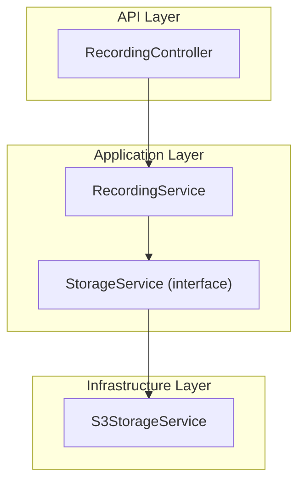
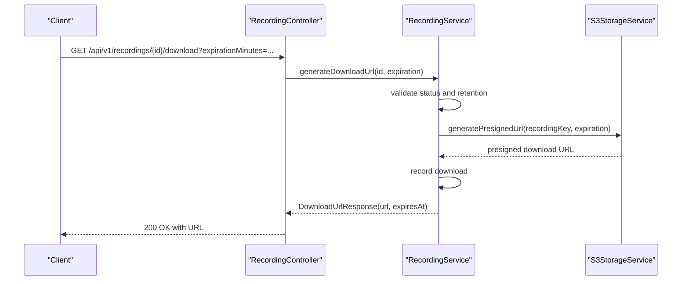
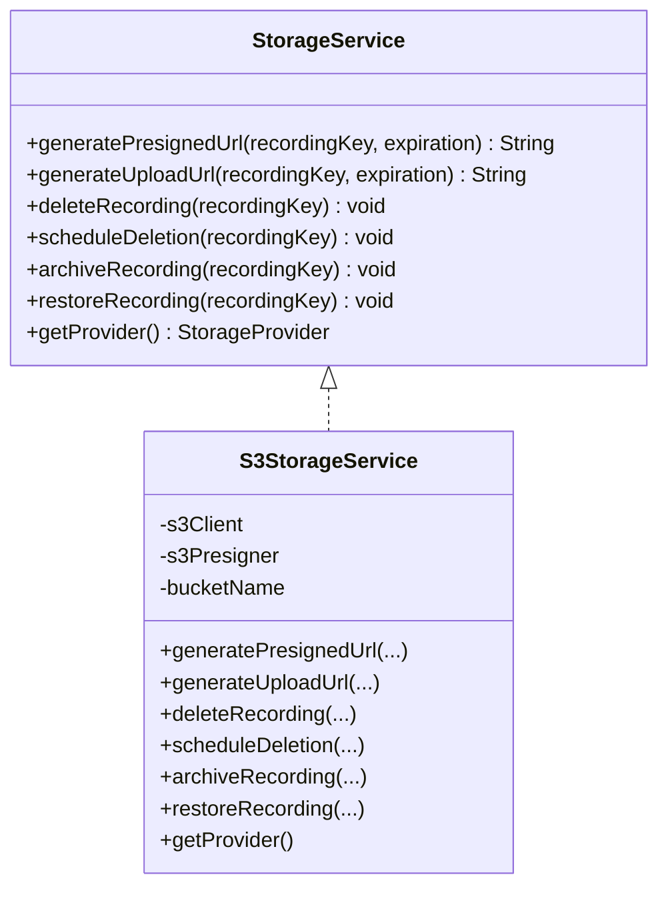
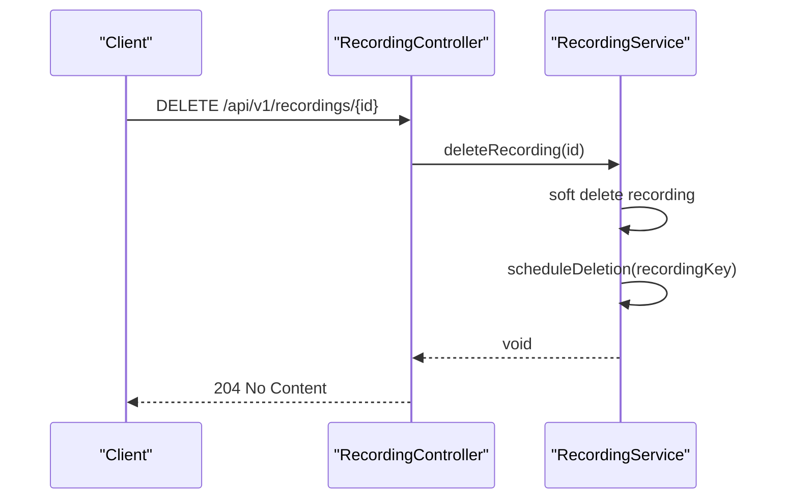
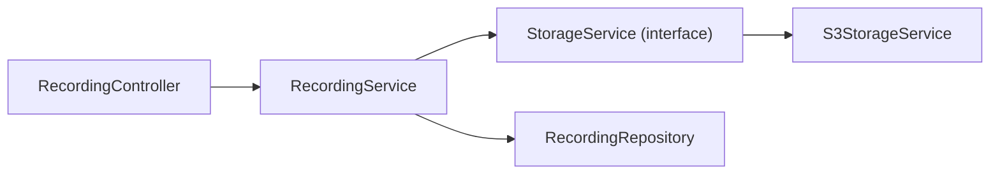
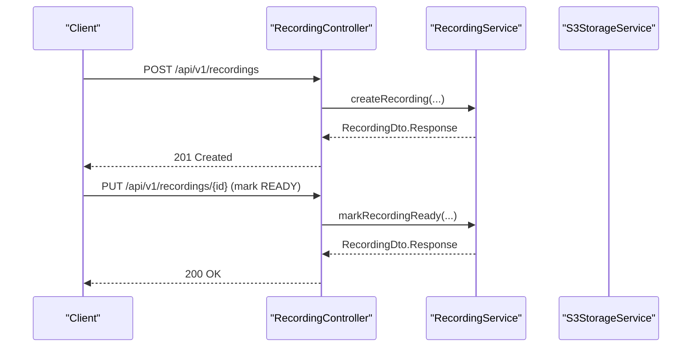
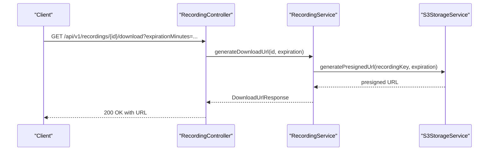

# Storage Integration

<cite>
**Referenced Files in This Document**
- [S3StorageService.java](file://jmp-infrastructure/src/main/java/com/jmp/infrastructure/storage/S3StorageService.java)
- [StorageService.java](file://jmp-application/src/main/java/com/jmp/application/service/StorageService.java)
- [RecordingService.java](file://jmp-application/src/main/java/com/jmp/application/service/RecordingService.java)
- [RecordingController.java](file://jmp-api/src/main/java/com/jmp/api/controller/RecordingController.java)
- [application.yml](file://jmp-web/src/main/resources/application.yml)
</cite>

## Table of Contents
1. [Introduction](#introduction)
2. [Project Structure](#project-structure)
3. [Core Components](#core-components)
4. [Architecture Overview](#architecture-overview)
5. [Detailed Component Analysis](#detailed-component-analysis)
6. [Dependency Analysis](#dependency-analysis)
7. [Performance Considerations](#performance-considerations)
8. [Troubleshooting Guide](#troubleshooting-guide)
9. [Conclusion](#conclusion)
10. [Appendices](#appendices)

## Introduction
This document describes the Storage Integration for the Infrastructure Layer with a focus on AWS S3 and S3-compatible storage. It covers bucket configuration, presigned URL generation for secure downloads/uploads, file lifecycle operations (delete, archive, restore), and credential management. It also documents how the system integrates with the application layer to support conference recordings, including metadata management, retention enforcement, and scheduled archival. Security considerations such as IAM policies, bucket policies, and encryption at rest are addressed conceptually, along with operational guidance for reliability and fallback options.

## Project Structure
The storage integration spans three layers:
- Application layer defines the StorageService interface and domain logic for recordings.
- Infrastructure layer implements StorageService using AWS S3 SDK and presigned URLs.
- API layer exposes endpoints to manage recordings and generate download URLs.

**Diagram sources**
- [RecordingController.java:1-138](file://jmp-api/src/main/java/com/jmp/api/controller/RecordingController.java#L1-L138)
- [RecordingService.java:1-332](file://jmp-application/src/main/java/com/jmp/application/service/RecordingService.java#L1-L332)
- [StorageService.java:1-56](file://jmp-application/src/main/java/com/jmp/application/service/StorageService.java#L1-L56)
- [S3StorageService.java:1-129](file://jmp-infrastructure/src/main/java/com/jmp/infrastructure/storage/S3StorageService.java#L1-L129)

**Section sources**
- [RecordingController.java:1-138](file://jmp-api/src/main/java/com/jmp/api/controller/RecordingController.java#L1-L138)
- [RecordingService.java:1-332](file://jmp-application/src/main/java/com/jmp/application/service/RecordingService.java#L1-L332)
- [StorageService.java:1-56](file://jmp-application/src/main/java/com/jmp/application/service/StorageService.java#L1-L56)
- [S3StorageService.java:1-129](file://jmp-infrastructure/src/main/java/com/jmp/infrastructure/storage/S3StorageService.java#L1-L129)

## Core Components
- StorageService interface: Defines the contract for storage operations including presigned URL generation for downloads and uploads, deletion, scheduled deletion, archiving, restoration, and provider identification.
- S3StorageService: Implements StorageService using AWS S3 SDK and S3 Presigner to generate time-limited URLs for secure access.
- RecordingService: Orchestrates recording lifecycle, validates readiness and retention, records downloads, and delegates storage operations.
- RecordingController: Exposes REST endpoints to create recordings, list/search, fetch metadata, generate download URLs, update metadata, and delete recordings.

Key capabilities:
- Presigned download and upload URLs with configurable expiration.
- Deletion and scheduled deletion hooks for asynchronous cleanup.
- Archival and restore placeholders for cold storage transitions.
- Provider enumeration supporting S3, MinIO, Azure Blob, GCP Storage, and Local.

**Section sources**
- [StorageService.java:1-56](file://jmp-application/src/main/java/com/jmp/application/service/StorageService.java#L1-L56)
- [S3StorageService.java:1-129](file://jmp-infrastructure/src/main/java/com/jmp/infrastructure/storage/S3StorageService.java#L1-L129)
- [RecordingService.java:137-170](file://jmp-application/src/main/java/com/jmp/application/service/RecordingService.java#L137-L170)
- [RecordingController.java:91-103](file://jmp-api/src/main/java/com/jmp/api/controller/RecordingController.java#L91-L103)

## Architecture Overview
The storage integration follows a layered architecture:
- API layer handles HTTP requests and delegates to application services.
- Application service enforces business rules (status checks, retention, download counts) and coordinates with storage.
- Infrastructure service encapsulates AWS S3 client and presigner, exposing a simple interface to the application.

**Diagram sources**
- [RecordingController.java:91-103](file://jmp-api/src/main/java/com/jmp/api/controller/RecordingController.java#L91-L103)
- [RecordingService.java:141-170](file://jmp-application/src/main/java/com/jmp/application/service/RecordingService.java#L141-L170)
- [S3StorageService.java:61-72](file://jmp-infrastructure/src/main/java/com/jmp/infrastructure/storage/S3StorageService.java#L61-L72)

## Detailed Component Analysis

### StorageService Interface
Defines the contract for storage operations:
- Presigned download URL generation with expiration.
- Presigned upload URL generation with expiration.
- Delete and schedule deletion of a recording by key.
- Archive and restore operations for cold storage transitions.
- Provider enumeration for extensibility.

Operational notes:
- Expiration is modeled as java.time.Duration to allow flexible TTL configuration.
- The provider enum supports multiple backends, enabling future migration or hybrid setups.

**Section sources**
- [StorageService.java:9-56](file://jmp-application/src/main/java/com/jmp/application/service/StorageService.java#L9-L56)

### S3StorageService Implementation
Implements StorageService using AWS S3 SDK:
- S3Client and S3Presigner configured with region, static credentials, and optional endpoint override for MinIO/S3-compatible services.
- Presigned download URL generation via GetObjectPresignRequest.
- Presigned upload URL generation via PutObjectPresignRequest.
- Deletion via DeleteObjectRequest.
- Scheduled deletion currently delegates to immediate deletion; designed for extension with delayed queues.
- Archive and restore are placeholders for lifecycle policies or archive storage classes.

**Diagram sources**
- [StorageService.java:9-56](file://jmp-application/src/main/java/com/jmp/application/service/StorageService.java#L9-L56)
- [S3StorageService.java:26-129](file://jmp-infrastructure/src/main/java/com/jmp/infrastructure/storage/S3StorageService.java#L26-L129)

**Section sources**
- [S3StorageService.java:32-59](file://jmp-infrastructure/src/main/java/com/jmp/infrastructure/storage/S3StorageService.java#L32-L59)
- [S3StorageService.java:61-85](file://jmp-infrastructure/src/main/java/com/jmp/infrastructure/storage/S3StorageService.java#L61-L85)
- [S3StorageService.java:87-97](file://jmp-infrastructure/src/main/java/com/jmp/infrastructure/storage/S3StorageService.java#L87-L97)
- [S3StorageService.java:99-122](file://jmp-infrastructure/src/main/java/com/jmp/infrastructure/storage/S3StorageService.java#L99-L122)
- [S3StorageService.java:124-128](file://jmp-infrastructure/src/main/java/com/jmp/infrastructure/storage/S3StorageService.java#L124-L128)

### RecordingService Integration
Coordinates recording lifecycle and storage operations:
- Validates recording readiness and retention before generating download URLs.
- Records download events and persists updates.
- Delegates deletion scheduling to storage service.
- Supports metadata updates and retention adjustments.
- Provides storage statistics and scheduled archival orchestration.

**Diagram sources**
- [RecordingService.java:141-170](file://jmp-application/src/main/java/com/jmp/application/service/RecordingService.java#L141-L170)

**Section sources**
- [RecordingService.java:141-170](file://jmp-application/src/main/java/com/jmp/application/service/RecordingService.java#L141-L170)
- [RecordingService.java:197-212](file://jmp-application/src/main/java/com/jmp/application/service/RecordingService.java#L197-L212)
- [RecordingService.java:239-258](file://jmp-application/src/main/java/com/jmp/application/service/RecordingService.java#L239-L258)

### RecordingController API
Exposes endpoints for recording management:
- Create recording entries.
- Retrieve recording metadata.
- List and search recordings per tenant.
- Generate download URLs with configurable expiration.
- Update recording metadata.
- Delete recordings (soft delete) and trigger storage deletion scheduling.
- Fetch storage statistics.

**Diagram sources**
- [RecordingController.java:115-121](file://jmp-api/src/main/java/com/jmp/api/controller/RecordingController.java#L115-L121)
- [RecordingService.java:197-212](file://jmp-application/src/main/java/com/jmp/application/service/RecordingService.java#L197-L212)

**Section sources**
- [RecordingController.java:45-53](file://jmp-api/src/main/java/com/jmp/api/controller/RecordingController.java#L45-L53)
- [RecordingController.java:91-103](file://jmp-api/src/main/java/com/jmp/api/controller/RecordingController.java#L91-L103)
- [RecordingController.java:115-121](file://jmp-api/src/main/java/com/jmp/api/controller/RecordingController.java#L115-L121)

## Dependency Analysis
- RecordingController depends on RecordingService for business operations.
- RecordingService depends on StorageService for storage operations and RecordingRepository for persistence.
- S3StorageService depends on AWS SDK S3Client and S3Presigner and is injected with configuration values for bucket, region, credentials, and optional endpoint.

**Diagram sources**
- [RecordingController.java:41-44](file://jmp-api/src/main/java/com/jmp/api/controller/RecordingController.java#L41-L44)
- [RecordingService.java:33-36](file://jmp-application/src/main/java/com/jmp/application/service/RecordingService.java#L33-L36)
- [StorageService.java](file://jmp-application/src/main/java/com/jmp/application/service/StorageService.java#L3)
- [S3StorageService.java](file://jmp-infrastructure/src/main/java/com/jmp/infrastructure/storage/S3StorageService.java#L26)

**Section sources**
- [RecordingController.java:41-44](file://jmp-api/src/main/java/com/jmp/api/controller/RecordingController.java#L41-L44)
- [RecordingService.java:33-36](file://jmp-application/src/main/java/com/jmp/application/service/RecordingService.java#L33-L36)
- [S3StorageService.java:26-59](file://jmp-infrastructure/src/main/java/com/jmp/infrastructure/storage/S3StorageService.java#L26-L59)

## Performance Considerations
- Presigned URLs eliminate server-side proxying for large files, reducing bandwidth and CPU overhead on the application server.
- Batch operations: Group multiple small files into multipart uploads when supported by the client to reduce overhead.
- Connection pooling: Ensure AWS SDK clients reuse connections efficiently; configure timeouts and retries at the SDK level.
- Caching: Cache frequently accessed metadata and short-lived presigned URLs where appropriate to reduce latency.
- Monitoring: Track S3 API latency, error rates, and throughput; integrate with CloudWatch or Prometheus for observability.

## Troubleshooting Guide
Common issues and resolutions:
- Invalid credentials or missing configuration:
  - Verify bucket name, region, access key, and secret key are set correctly.
  - For MinIO or S3-compatible services, confirm endpoint override is configured.
- Bucket permissions:
  - Ensure the IAM principal has s3:GetObject and s3:PutObject permissions for the target bucket/key.
  - Confirm bucket policy allows the principal to perform required actions.
- Expiration and URL validity:
  - Validate expiration duration is reasonable and within accepted limits.
  - Regenerate URLs if expired; avoid reusing URLs across clients.
- Retention and readiness:
  - Ensure recordings are READY and within retention before generating download URLs.
  - Investigate failed transitions to READY and verify post-processing steps.
- Scheduled deletion:
  - Confirm storage service receives scheduleDeletion calls and that asynchronous cleanup is implemented in production.
- Archival/restore:
  - Implement lifecycle policies or archive storage classes; monitor restore completion for archive retrieval.

**Section sources**
- [S3StorageService.java:32-59](file://jmp-infrastructure/src/main/java/com/jmp/infrastructure/storage/S3StorageService.java#L32-L59)
- [RecordingService.java:141-170](file://jmp-application/src/main/java/com/jmp/application/service/RecordingService.java#L141-L170)

## Conclusion
The storage integration leverages AWS S3 with presigned URLs to provide secure, scalable access to conference recordings. The clean separation between the StorageService interface and its S3 implementation enables future portability and extensibility. RecordingService enforces business rules and integrates seamlessly with the API layer. To operate reliably in production, complement the current implementation with robust IAM policies, bucket policies, encryption at rest, lifecycle management, and monitoring.

## Appendices

### Configuration Reference
Environment variables and configuration keys used by the storage service:
- jmp.storage.s3.bucket: Target S3 bucket name.
- jmp.storage.s3.region: AWS region (defaults to us-east-1 if not provided).
- jmp.storage.s3.access-key: Access key for S3 credentials.
- jmp.storage.s3.secret-key: Secret key for S3 credentials.
- jmp.storage.s3.endpoint: Optional endpoint for MinIO or S3-compatible services.

These values are bound to the S3StorageService constructor and used to configure S3Client and S3Presigner.

**Section sources**
- [S3StorageService.java:32-59](file://jmp-infrastructure/src/main/java/com/jmp/infrastructure/storage/S3StorageService.java#L32-L59)

### Example Workflows

#### Storing a Conference Recording
- Create a recording entry with metadata and initial status PENDING.
- After processing, mark the recording READY with file size, hash, and MIME type.
- Clients can then request a download URL with a specified expiration.

**Diagram sources**
- [RecordingController.java:45-53](file://jmp-api/src/main/java/com/jmp/api/controller/RecordingController.java#L45-L53)
- [RecordingService.java:42-72](file://jmp-application/src/main/java/com/jmp/application/service/RecordingService.java#L42-L72)
- [RecordingService.java:77-101](file://jmp-application/src/main/java/com/jmp/application/service/RecordingService.java#L77-L101)

#### Retrieving a Recording for Playback
- Generate a presigned download URL with a limited lifetime.
- Use the URL to stream the recording directly from S3.

**Diagram sources**
- [RecordingController.java:91-103](file://jmp-api/src/main/java/com/jmp/api/controller/RecordingController.java#L91-L103)
- [RecordingService.java:141-170](file://jmp-application/src/main/java/com/jmp/application/service/RecordingService.java#L141-L170)
- [S3StorageService.java:61-72](file://jmp-infrastructure/src/main/java/com/jmp/infrastructure/storage/S3StorageService.java#L61-L72)

### Security Considerations
- IAM policies:
  - Grant least privilege: s3:GetObject for downloads, s3:PutObject for uploads, s3:DeleteObject for deletions.
  - Scope policies to specific buckets and prefixes.
- Bucket policies:
  - Restrict access to trusted principals and VPC endpoints where applicable.
  - Enforce HTTPS-only access.
- Encryption at rest:
  - Enable S3-managed keys (SSE-S3) or customer-managed keys (SSE-KMS).
  - Consider client-side encryption for sensitive content.
- Network controls:
  - Use VPC endpoints for S3 to keep traffic within AWS network.
  - Limit public access and rely on presigned URLs for controlled access.
- Secrets management:
  - Rotate access keys regularly; avoid embedding secrets in code.
  - Prefer IAM roles in EC2/ECS or service accounts in Kubernetes where possible.

[No sources needed since this section provides general guidance]