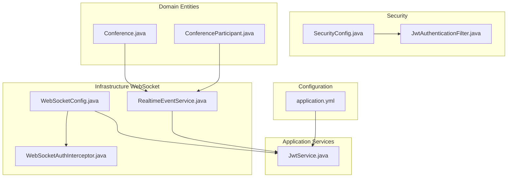
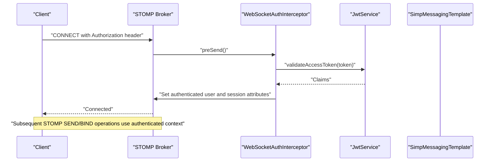
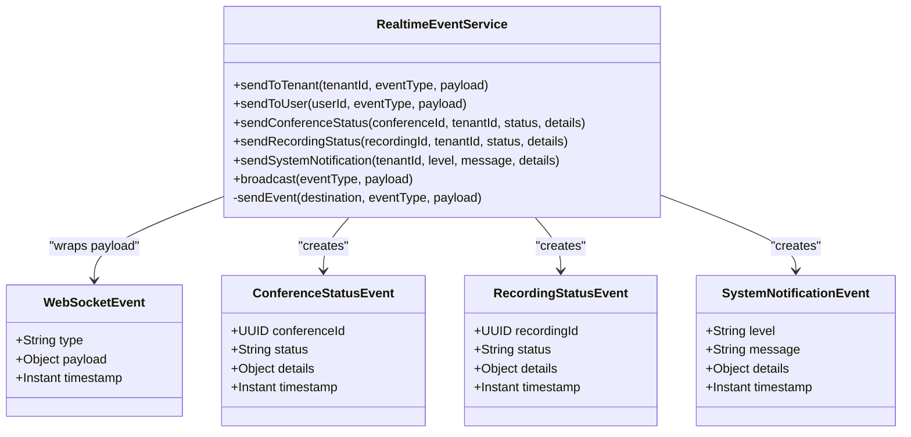
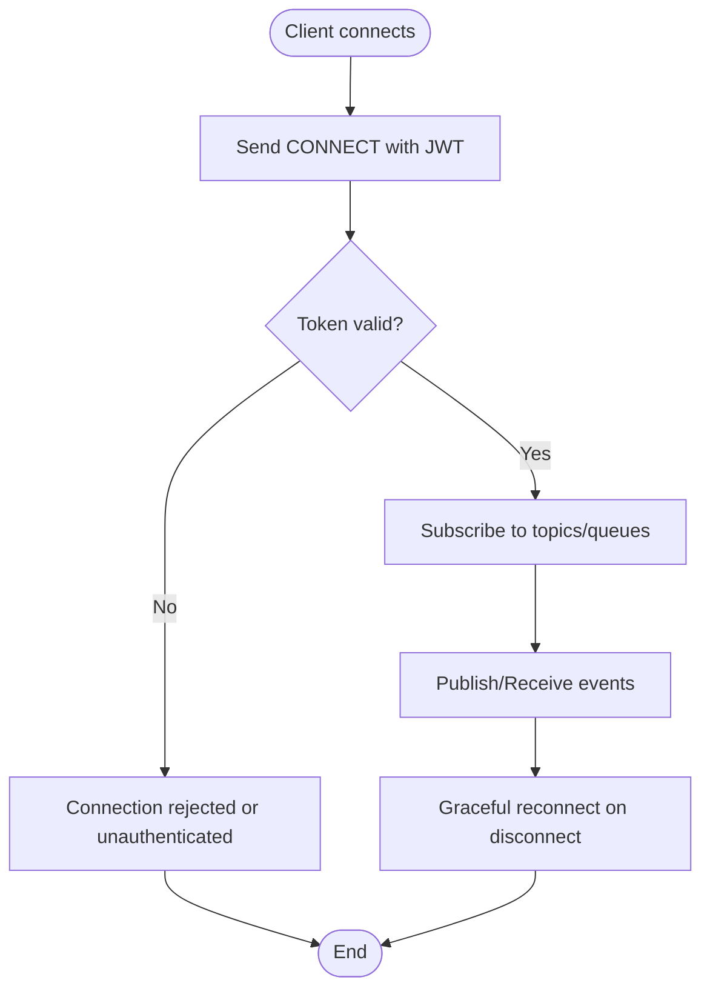
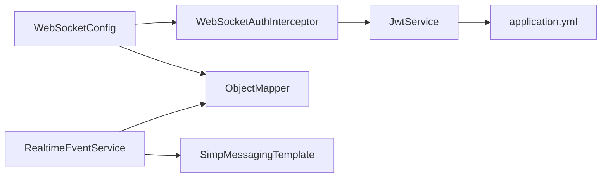

# WebSocket Communication

<cite>
**Referenced Files in This Document**
- [WebSocketConfig.java](file://jmp-infrastructure/src/main/java/com/jmp/infrastructure/websocket/WebSocketConfig.java)
- [WebSocketAuthInterceptor.java](file://jmp-infrastructure/src/main/java/com/jmp/infrastructure/websocket/WebSocketAuthInterceptor.java)
- [RealtimeEventService.java](file://jmp-infrastructure/src/main/java/com/jmp/infrastructure/websocket/RealtimeEventService.java)
- [JwtService.java](file://jmp-application/src/main/java/com/jmp/application/service/JwtService.java)
- [application.yml](file://jmp-web/src/main/resources/application.yml)
- [SecurityConfig.java](file://jmp-infrastructure/src/main/java/com/jmp/infrastructure/security/SecurityConfig.java)
- [JwtAuthenticationFilter.java](file://jmp-infrastructure/src/main/java/com/jmp/infrastructure/security/JwtAuthenticationFilter.java)
- [Conference.java](file://jmp-domain/src/main/java/com/jmp/domain/entity/Conference.java)
- [ConferenceParticipant.java](file://jmp-domain/src/main/java/com/jmp/domain/entity/ConferenceParticipant.java)
</cite>

## Table of Contents
1. [Introduction](#introduction)
2. [Project Structure](#project-structure)
3. [Core Components](#core-components)
4. [Architecture Overview](#architecture-overview)
5. [Detailed Component Analysis](#detailed-component-analysis)
6. [Dependency Analysis](#dependency-analysis)
7. [Performance Considerations](#performance-considerations)
8. [Troubleshooting Guide](#troubleshooting-guide)
9. [Conclusion](#conclusion)
10. [Appendices](#appendices)

## Introduction
This document describes the WebSocket Communication layer in the Infrastructure Layer. It covers configuration of the WebSocket message broker, STOMP endpoints, authentication during the WebSocket handshake, and the real-time event broadcasting service. It also documents message formats, event types, client-server communication patterns, connection lifecycle management, error handling, reconnection strategies, scalability considerations, and performance optimization. Practical examples include participant updates and conference status notifications.

## Project Structure
The WebSocket-related components reside in the infrastructure module under the websocket package. Supporting JWT validation and security configuration are located in the application and security packages respectively. Configuration for JWT secrets and expiration is defined in the application YAML.

**Diagram sources**
- [WebSocketConfig.java:27-68](file://jmp-infrastructure/src/main/java/com/jmp/infrastructure/websocket/WebSocketConfig.java#L27-L68)
- [WebSocketAuthInterceptor.java:29-92](file://jmp-infrastructure/src/main/java/com/jmp/infrastructure/websocket/WebSocketAuthInterceptor.java#L29-L92)
- [RealtimeEventService.java:20-141](file://jmp-infrastructure/src/main/java/com/jmp/infrastructure/websocket/RealtimeEventService.java#L20-L141)
- [JwtService.java:27-235](file://jmp-application/src/main/java/com/jmp/application/service/JwtService.java#L27-L235)
- [SecurityConfig.java:31-89](file://jmp-infrastructure/src/main/java/com/jmp/infrastructure/security/SecurityConfig.java#L31-L89)
- [JwtAuthenticationFilter.java:29-121](file://jmp-infrastructure/src/main/java/com/jmp/infrastructure/security/JwtAuthenticationFilter.java#L29-L121)
- [application.yml:71-78](file://jmp-web/src/main/resources/application.yml#L71-L78)
- [Conference.java:30-216](file://jmp-domain/src/main/java/com/jmp/domain/entity/Conference.java#L30-L216)
- [ConferenceParticipant.java:23-149](file://jmp-domain/src/main/java/com/jmp/domain/entity/ConferenceParticipant.java#L23-L149)

**Section sources**
- [WebSocketConfig.java:27-68](file://jmp-infrastructure/src/main/java/com/jmp/infrastructure/websocket/WebSocketConfig.java#L27-L68)
- [application.yml:71-78](file://jmp-web/src/main/resources/application.yml#L71-L78)

## Core Components
- WebSocket configuration: Defines the STOMP broker, endpoint registration, inbound channel interceptors, and JSON message conversion.
- Authentication interceptor: Validates JWT tokens from the STOMP CONNECT frame and sets the authenticated user in the session.
- Realtime event service: Provides typed event broadcasting to tenants, users, and system-wide audiences with standardized event wrappers.

Key responsibilities:
- Broker setup: In-memory broker for topics and queues; user-specific destinations.
- Endpoint exposure: Dual endpoints for native WebSocket and SockJS fallback.
- Authentication: Extracts Authorization header or login parameter, validates JWT, and populates session attributes.
- Eventing: Wraps payloads with a common event envelope and sends to STOMP destinations.

**Section sources**
- [WebSocketConfig.java:32-68](file://jmp-infrastructure/src/main/java/com/jmp/infrastructure/websocket/WebSocketConfig.java#L32-L68)
- [WebSocketAuthInterceptor.java:33-73](file://jmp-infrastructure/src/main/java/com/jmp/infrastructure/websocket/WebSocketAuthInterceptor.java#L33-L73)
- [RealtimeEventService.java:25-101](file://jmp-infrastructure/src/main/java/com/jmp/infrastructure/websocket/RealtimeEventService.java#L25-L101)

## Architecture Overview
The WebSocket stack integrates Spring WebSocket/SIMP with STOMP over SockJS. The configuration enables a simple in-memory broker for topics and queues, registers STOMP endpoints, and injects an authentication interceptor to validate JWTs during the handshake. Real-time events are published via a dedicated service that converts and sends messages to appropriate destinations.

**Diagram sources**
- [WebSocketConfig.java:42-55](file://jmp-infrastructure/src/main/java/com/jmp/infrastructure/websocket/WebSocketConfig.java#L42-L55)
- [WebSocketAuthInterceptor.java:33-73](file://jmp-infrastructure/src/main/java/com/jmp/infrastructure/websocket/WebSocketAuthInterceptor.java#L33-L73)
- [JwtService.java:164-171](file://jmp-application/src/main/java/com/jmp/application/service/JwtService.java#L164-L171)

## Detailed Component Analysis

### WebSocket Configuration
- Message broker: Enables a simple in-memory broker for destinations prefixed with /topic and /queue. The configuration sets application destination prefixes (/app) and user destination prefix (/user).
- STOMP endpoints: Registers two endpoints at /ws:
  - One with SockJS enabled for broad browser compatibility.
  - One native WebSocket endpoint for modern clients.
- Inbound channel interceptor: Adds the authentication interceptor to validate JWTs on CONNECT.
- Message converters: Configures JSON conversion with Jackson and sets default content type.

Operational notes:
- The in-memory broker is suitable for development and single-instance deployments. For production, replace with RabbitMQ or Redis as indicated in the comments.

**Section sources**
- [WebSocketConfig.java:32-68](file://jmp-infrastructure/src/main/java/com/jmp/infrastructure/websocket/WebSocketConfig.java#L32-L68)

### WebSocket Authentication Interceptor
- Purpose: Intercept CONNECT frames, extract JWT from Authorization header or login parameter, validate it, and populate the session with authenticated user and tenant attributes.
- Token extraction:
  - Header: Bearer token from Authorization header.
  - Fallback: login parameter for SockJS scenarios.
- Validation: Delegates to JwtService to validate and parse claims.
- Session attributes: Stores tenantId in session attributes for downstream routing decisions.

Behavioral outcomes:
- Successful CONNECT: Sets accessor user and session attributes.
- Invalid or missing token: Logs a warning and allows the message to pass (connection may still succeed depending on upstream logic).

**Section sources**
- [WebSocketAuthInterceptor.java:33-92](file://jmp-infrastructure/src/main/java/com/jmp/infrastructure/websocket/WebSocketAuthInterceptor.java#L33-L92)
- [JwtService.java:164-214](file://jmp-application/src/main/java/com/jmp/application/service/JwtService.java#L164-L214)

### RealtimeEventService
Responsibilities:
- Broadcast to tenant: Sends events to a tenant-scoped topic path.
- Direct user delivery: Routes events to a user-specific queue for point-to-point delivery.
- Conference status updates: Emits typed events for conference lifecycle changes.
- Recording status updates: Emits typed events for recording lifecycle changes.
- System notifications: Sends tenant-wide system notifications.
- Broadcast: Sends events to a global broadcast topic.

Message format:
- Envelope: Each event is wrapped with a common envelope containing type, payload, and timestamp.
- Payloads: Typed records for conference status, recording status, and system notifications.

Destination naming:
- Tenant-scoped topics: /topic/tenant/{tenantId}/{eventType}
- User-specific queues: /user/{userId}/queue/events
- Broadcast: /topic/broadcast/{eventType}

Error handling:
- Attempts to convert and send events; logs failures but does not propagate exceptions.

**Diagram sources**
- [RealtimeEventService.java:20-141](file://jmp-infrastructure/src/main/java/com/jmp/infrastructure/websocket/RealtimeEventService.java#L20-L141)

**Section sources**
- [RealtimeEventService.java:25-101](file://jmp-infrastructure/src/main/java/com/jmp/infrastructure/websocket/RealtimeEventService.java#L25-L101)

### JWT Configuration and Validation
- Secrets and expiration: JWT access and refresh secrets, and access token expiration minutes are configured in application YAML.
- Access token validation: JwtService exposes methods to validate access tokens and extract claims such as subject (user ID), tenant ID, and roles.
- Token extraction: The interceptor extracts user ID, tenant ID, and roles from validated tokens to build the authentication context.

Operational implications:
- Token expiration influences connection longevity; clients should refresh tokens proactively.
- Roles and tenant context are available for authorization and scoping.

**Section sources**
- [application.yml:71-78](file://jmp-web/src/main/resources/application.yml#L71-L78)
- [JwtService.java:164-214](file://jmp-application/src/main/java/com/jmp/application/service/JwtService.java#L164-L214)
- [WebSocketAuthInterceptor.java:41-64](file://jmp-infrastructure/src/main/java/com/jmp/infrastructure/websocket/WebSocketAuthInterceptor.java#L41-L64)

### Client-Server Communication Patterns
- Connection establishment:
  - Native WebSocket: Connect to /ws.
  - SockJS fallback: Connect to /ws with SockJS enabled.
  - Authentication: Include Authorization: Bearer <token> header or use login parameter for SockJS.
- Subscriptions:
  - Subscribe to tenant-scoped topics: /topic/tenant/{tenantId}/{eventType}.
  - Subscribe to personal queue: /user/queue/events.
  - Subscribe to broadcast topics: /topic/broadcast/{eventType}.
- Publishing:
  - Send to application destinations with prefix /app (configured in WebSocketConfig).
- Event envelopes:
  - All events carry type, payload, and timestamp.

[No sources needed since this diagram shows conceptual workflow, not actual code structure]

## Dependency Analysis
- WebSocketConfig depends on:
  - ObjectMapper for JSON conversion.
  - WebSocketAuthInterceptor for authentication.
- WebSocketAuthInterceptor depends on:
  - JwtService for token validation and claim extraction.
- RealtimeEventService depends on:
  - SimpMessagingTemplate for sending messages.
  - ObjectMapper for event wrapping.
- JwtService is configured by application YAML values.

**Diagram sources**
- [WebSocketConfig.java:29-30](file://jmp-infrastructure/src/main/java/com/jmp/infrastructure/websocket/WebSocketConfig.java#L29-L30)
- [WebSocketAuthInterceptor.java](file://jmp-infrastructure/src/main/java/com/jmp/infrastructure/websocket/WebSocketAuthInterceptor.java#L31)
- [RealtimeEventService.java:22-23](file://jmp-infrastructure/src/main/java/com/jmp/infrastructure/websocket/RealtimeEventService.java#L22-L23)
- [JwtService.java:34-43](file://jmp-application/src/main/java/com/jmp/application/service/JwtService.java#L34-L43)
- [application.yml:71-78](file://jmp-web/src/main/resources/application.yml#L71-L78)

**Section sources**
- [WebSocketConfig.java:29-30](file://jmp-infrastructure/src/main/java/com/jmp/infrastructure/websocket/WebSocketConfig.java#L29-L30)
- [WebSocketAuthInterceptor.java](file://jmp-infrastructure/src/main/java/com/jmp/infrastructure/websocket/WebSocketAuthInterceptor.java#L31)
- [RealtimeEventService.java:22-23](file://jmp-infrastructure/src/main/java/com/jmp/infrastructure/websocket/RealtimeEventService.java#L22-L23)
- [JwtService.java:34-43](file://jmp-application/src/main/java/com/jmp/application/service/JwtService.java#L34-L43)

## Performance Considerations
- Broker choice:
  - Current configuration uses an in-memory broker suitable for development. For production, switch to RabbitMQ or Redis to support clustering and persistence.
- Message conversion:
  - JSON conversion is configured centrally; ensure payloads remain compact to reduce bandwidth and CPU overhead.
- Destination naming:
  - Use hierarchical topic names to minimize fan-out and enable efficient routing.
- Connection scaling:
  - Prefer SockJS for environments with restrictive proxies; native WebSocket for modern clients to reduce overhead.
- Memory management:
  - Monitor broker memory usage and tune retention policies for topics/queues.
- Throughput:
  - Batch frequent updates (e.g., participant counts) and coalesce events where appropriate.

[No sources needed since this section provides general guidance]

## Troubleshooting Guide
Common issues and resolutions:
- Invalid or missing JWT:
  - Symptom: Connection fails or remains unauthenticated.
  - Cause: Missing Authorization header or invalid token.
  - Resolution: Ensure Bearer token is present and valid; verify token expiration and secrets.
- Token validation errors:
  - Symptom: Exceptions during token parsing.
  - Cause: Incorrect secret configuration or tampered tokens.
  - Resolution: Confirm JWT secrets match between server and client; check token signing algorithm and expiration.
- Destination delivery failures:
  - Symptom: Events not received by clients.
  - Cause: Incorrect subscription paths or broker misconfiguration.
  - Resolution: Verify topic/queue names and subscriptions; confirm broker is enabled and reachable.
- SockJS compatibility:
  - Symptom: Connection issues in older browsers.
  - Cause: Proxy or CORS restrictions.
  - Resolution: Ensure allowed origins and proper SockJS fallback configuration.

**Section sources**
- [WebSocketAuthInterceptor.java:41-70](file://jmp-infrastructure/src/main/java/com/jmp/infrastructure/websocket/WebSocketAuthInterceptor.java#L41-L70)
- [RealtimeEventService.java:88-101](file://jmp-infrastructure/src/main/java/com/jmp/infrastructure/websocket/RealtimeEventService.java#L88-L101)
- [WebSocketConfig.java:42-55](file://jmp-infrastructure/src/main/java/com/jmp/infrastructure/websocket/WebSocketConfig.java#L42-L55)

## Conclusion
The WebSocket Communication layer provides a robust foundation for real-time updates using STOMP over SockJS with JWT-based authentication. The configuration supports tenant-scoped and user-specific messaging, while the event service offers a consistent envelope for typed events. Production readiness requires replacing the in-memory broker with a scalable message broker and implementing resilient reconnection strategies on the client.

[No sources needed since this section summarizes without analyzing specific files]

## Appendices

### Message Formats and Event Types
- Common envelope:
  - type: String identifying the event category.
  - payload: Object containing event-specific data.
  - timestamp: Instant indicating when the event was generated.
- Event types:
  - Conference status: conference/{id}/status
  - Recording status: recording/{id}/status
  - System notifications: notifications/system
  - Broadcast: broadcast/{eventType}

Destination examples:
- Tenant-scoped: /topic/tenant/{tenantId}/conference/{id}/status
- User-specific: /user/{userId}/queue/events
- Broadcast: /topic/broadcast/{eventType}

**Section sources**
- [RealtimeEventService.java:106-140](file://jmp-infrastructure/src/main/java/com/jmp/infrastructure/websocket/RealtimeEventService.java#L106-L140)
- [RealtimeEventService.java:28-86](file://jmp-infrastructure/src/main/java/com/jmp/infrastructure/websocket/RealtimeEventService.java#L28-L86)

### Example Scenarios
- Conference status notifications:
  - Emit a conference status event when a conference starts or ends.
  - Clients subscribe to the tenant-scoped topic for their tenant.
- Recording status updates:
  - Emit recording status events upon completion or failure.
  - Distribute to the tenant-scoped topic for administrators.
- Participant updates:
  - Track participant joins/leaves via domain entities and publish summary updates to subscribed clients.
  - Use tenant-scoped topics to limit visibility to authorized users.

**Section sources**
- [RealtimeEventService.java:44-65](file://jmp-infrastructure/src/main/java/com/jmp/infrastructure/websocket/RealtimeEventService.java#L44-L65)
- [Conference.java:140-159](file://jmp-domain/src/main/java/com/jmp/domain/entity/Conference.java#L140-L159)
- [ConferenceParticipant.java:91-102](file://jmp-domain/src/main/java/com/jmp/domain/entity/ConferenceParticipant.java#L91-L102)