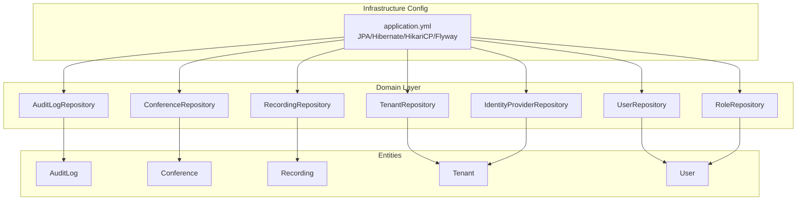
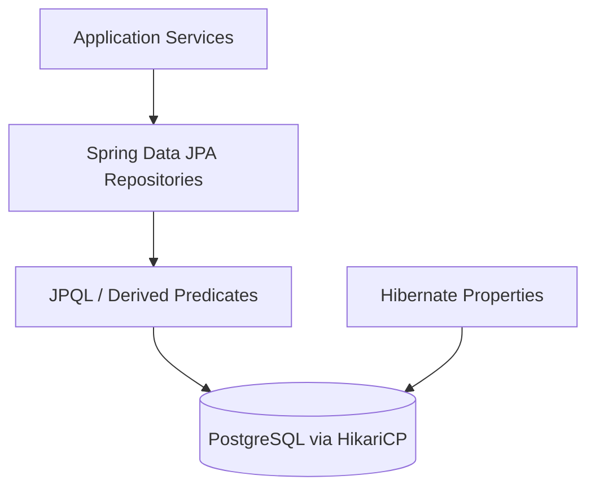
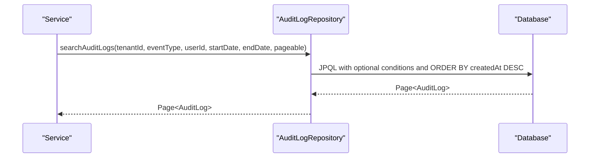
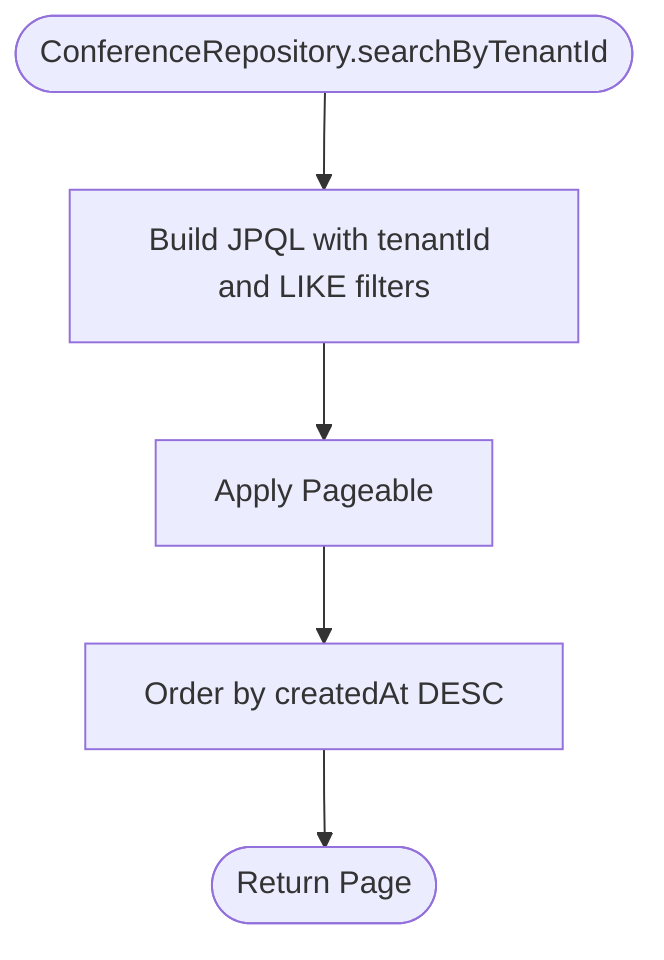
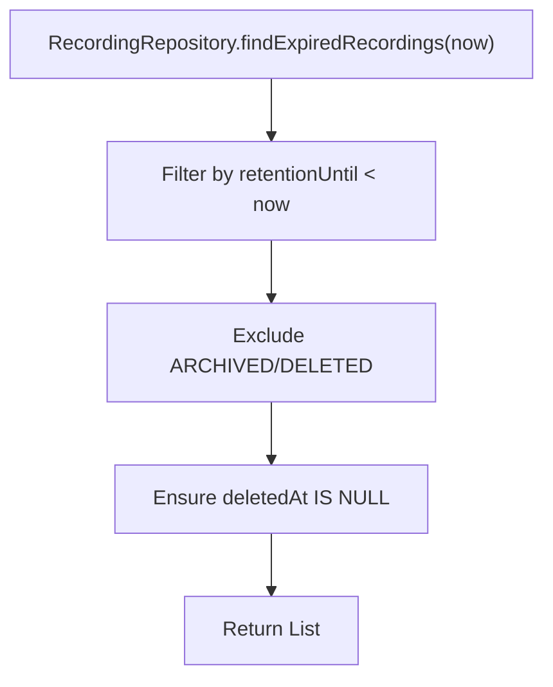
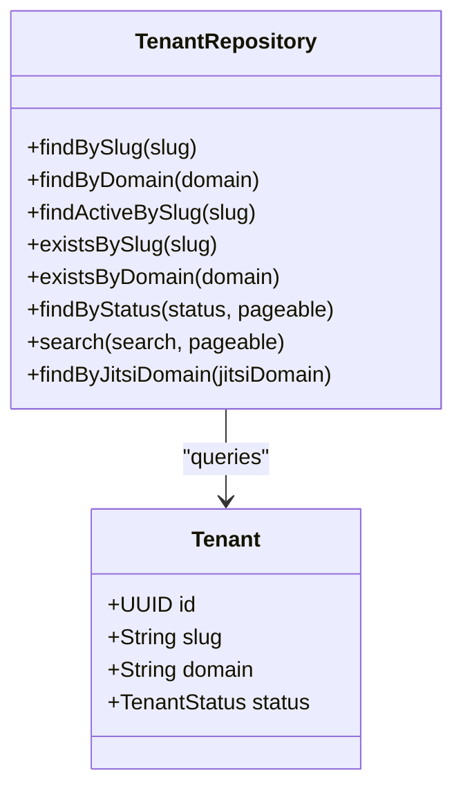
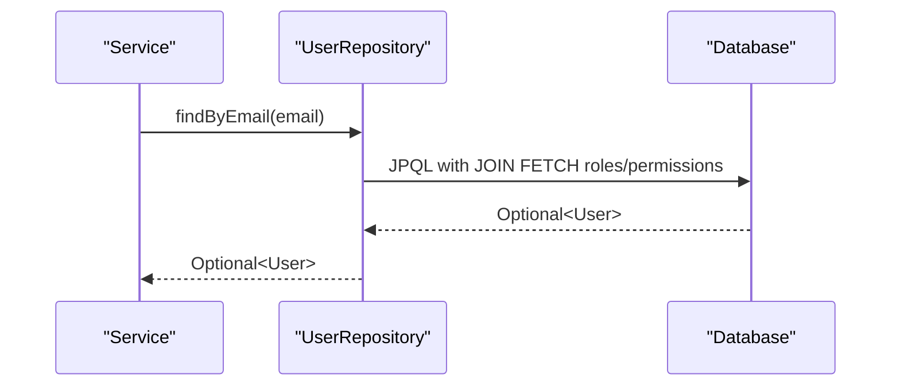
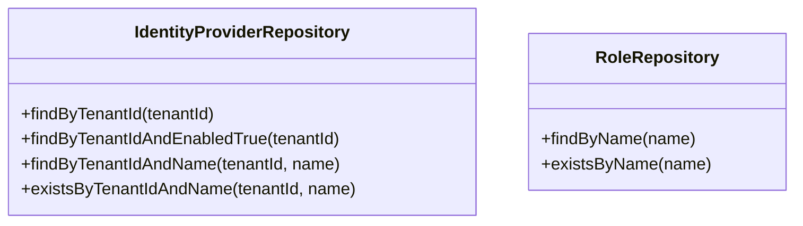
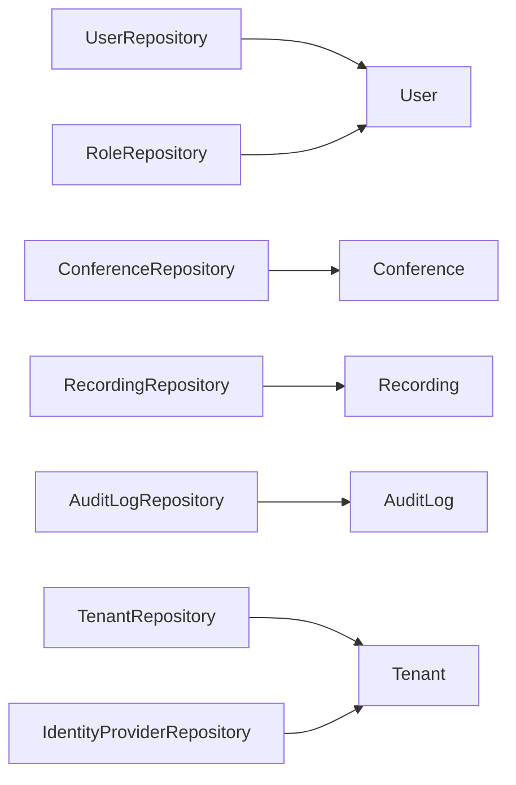

# Data Access Patterns

<cite>
**Referenced Files in This Document**
- [application.yml](file://jmp-web/src/main/resources/application.yml)
- [AuditLogRepository.java](file://jmp-domain/src/main/java/com/jmp/domain/repository/AuditLogRepository.java)
- [ConferenceRepository.java](file://jmp-domain/src/main/java/com/jmp/domain/repository/ConferenceRepository.java)
- [RecordingRepository.java](file://jmp-domain/src/main/java/com/jmp/domain/repository/RecordingRepository.java)
- [TenantRepository.java](file://jmp-domain/src/main/java/com/jmp/domain/repository/TenantRepository.java)
- [UserRepository.java](file://jmp-domain/src/main/java/com/jmp/domain/repository/UserRepository.java)
- [IdentityProviderRepository.java](file://jmp-domain/src/main/java/com/jmp/domain/repository/IdentityProviderRepository.java)
- [RoleRepository.java](file://jmp-domain/src/main/java/com/jmp/domain/repository/RoleRepository.java)
- [AuditLog.java](file://jmp-domain/src/main/java/com/jmp/domain/entity/AuditLog.java)
- [Conference.java](file://jmp-domain/src/main/java/com/jmp/domain/entity/Conference.java)
- [Recording.java](file://jmp-domain/src/main/java/com/jmp/domain/entity/Recording.java)
- [Tenant.java](file://jmp-domain/src/main/java/com/jmp/domain/entity/Tenant.java)
- [User.java](file://jmp-domain/src/main/java/com/jmp/domain/entity/User.java)
</cite>

## Table of Contents
1. [Introduction](#introduction)
2. [Project Structure](#project-structure)
3. [Core Components](#core-components)
4. [Architecture Overview](#architecture-overview)
5. [Detailed Component Analysis](#detailed-component-analysis)
6. [Dependency Analysis](#dependency-analysis)
7. [Performance Considerations](#performance-considerations)
8. [Troubleshooting Guide](#troubleshooting-guide)
9. [Conclusion](#conclusion)
10. [Appendices](#appendices)

## Introduction
This document describes the Spring Data JPA repository layer patterns used across the application. It covers repository interface conventions, method naming and query derivation, custom JPQL/Native SQL usage, pagination and sorting, tenant scoping, soft delete handling, archived data management, performance optimizations (eager loading, batching), transaction and connection pooling configuration, caching strategies, and integration with Spring Security for tenant isolation. It also provides guidelines for extending the repository layer and implementing custom data access patterns.

## Project Structure
The repository interfaces live in the domain module under the repository package. They extend Spring Data JPA’s JpaRepository and define method signatures that leverage Spring Data’s query derivation and explicit JPQL via @Query. Entities in the domain module carry tenant scoping fields and soft-delete markers. Application-wide JPA/Hibernate/HikariCP settings are configured in the web module’s application YAML.

**Diagram sources**
- [AuditLogRepository.java:1-85](file://jmp-domain/src/main/java/com/jmp/domain/repository/AuditLogRepository.java#L1-L85)
- [ConferenceRepository.java:1-110](file://jmp-domain/src/main/java/com/jmp/domain/repository/ConferenceRepository.java#L1-L110)
- [RecordingRepository.java:1-100](file://jmp-domain/src/main/java/com/jmp/domain/repository/RecordingRepository.java#L1-L100)
- [TenantRepository.java:1-64](file://jmp-domain/src/main/java/com/jmp/domain/repository/TenantRepository.java#L1-L64)
- [UserRepository.java:1-82](file://jmp-domain/src/main/java/com/jmp/domain/repository/UserRepository.java#L1-L82)
- [IdentityProviderRepository.java:1-37](file://jmp-domain/src/main/java/com/jmp/domain/repository/IdentityProviderRepository.java#L1-L37)
- [RoleRepository.java:1-20](file://jmp-domain/src/main/java/com/jmp/domain/repository/RoleRepository.java#L1-L20)
- [AuditLog.java:1-136](file://jmp-domain/src/main/java/com/jmp/domain/entity/AuditLog.java#L1-L136)
- [Conference.java:1-200](file://jmp-domain/src/main/java/com/jmp/domain/entity/Conference.java#L1-L200)
- [Recording.java:1-200](file://jmp-domain/src/main/java/com/jmp/domain/entity/Recording.java#L1-L200)
- [Tenant.java:1-174](file://jmp-domain/src/main/java/com/jmp/domain/entity/Tenant.java#L1-L174)
- [User.java:1-164](file://jmp-domain/src/main/java/com/jmp/domain/entity/User.java#L1-L164)
- [application.yml:12-37](file://jmp-web/src/main/resources/application.yml#L12-L37)

**Section sources**
- [AuditLogRepository.java:1-85](file://jmp-domain/src/main/java/com/jmp/domain/repository/AuditLogRepository.java#L1-L85)
- [ConferenceRepository.java:1-110](file://jmp-domain/src/main/java/com/jmp/domain/repository/ConferenceRepository.java#L1-L110)
- [RecordingRepository.java:1-100](file://jmp-domain/src/main/java/com/jmp/domain/repository/RecordingRepository.java#L1-L100)
- [TenantRepository.java:1-64](file://jmp-domain/src/main/java/com/jmp/domain/repository/TenantRepository.java#L1-L64)
- [UserRepository.java:1-82](file://jmp-domain/src/main/java/com/jmp/domain/repository/UserRepository.java#L1-L82)
- [IdentityProviderRepository.java:1-37](file://jmp-domain/src/main/java/com/jmp/domain/repository/IdentityProviderRepository.java#L1-L37)
- [RoleRepository.java:1-20](file://jmp-domain/src/main/java/com/jmp/domain/repository/RoleRepository.java#L1-L20)
- [application.yml:12-37](file://jmp-web/src/main/resources/application.yml#L12-L37)

## Core Components
- Repository interfaces define typed finders, paginated queries, aggregations, and custom JPQL. They consistently use Pageable for pagination and ordering, and leverage @EntityGraph for eager loading of associations.
- Entities implement tenant scoping via foreign keys and soft deletes via deletedAt timestamps. Some entities expose convenience methods for soft deletion and status checks.
- Application configuration sets Hibernate dialect, SQL formatting, batch size, insert/update ordering, and HikariCP pool sizes.

Key repository patterns observed:
- Method naming conventions: findByXxx, findByXxxAndYyy, existsByXxx, countByXxx, findWithXxxById, searchByXxx.
- Pagination: Pageable parameters with orderBy clauses for deterministic sorting.
- Custom JPQL: @Query with named parameters and conditional expressions for flexible filtering.
- Eager loading: @EntityGraph attributePaths to avoid N+1 selects for frequently accessed relations.
- Soft delete: queries filter by deletedAt IS NULL; entities expose softDelete() and status helpers.

**Section sources**
- [AuditLogRepository.java:21-84](file://jmp-domain/src/main/java/com/jmp/domain/repository/AuditLogRepository.java#L21-L84)
- [ConferenceRepository.java:23-109](file://jmp-domain/src/main/java/com/jmp/domain/repository/ConferenceRepository.java#L23-L109)
- [RecordingRepository.java:22-99](file://jmp-domain/src/main/java/com/jmp/domain/repository/RecordingRepository.java#L22-L99)
- [TenantRepository.java:20-57](file://jmp-domain/src/main/java/com/jmp/domain/repository/TenantRepository.java#L20-L57)
- [UserRepository.java:21-81](file://jmp-domain/src/main/java/com/jmp/domain/repository/UserRepository.java#L21-L81)
- [application.yml:24-37](file://jmp-web/src/main/resources/application.yml#L24-L37)
- [User.java:106-122](file://jmp-domain/src/main/java/com/jmp/domain/entity/User.java#L106-L122)
- [Conference.java:134-159](file://jmp-domain/src/main/java/com/jmp/domain/entity/Conference.java#L134-L159)
- [Recording.java:125-161](file://jmp-domain/src/main/java/com/jmp/domain/entity/Recording.java#L125-L161)

## Architecture Overview
The repository layer sits between application services and the persistence layer. Repositories encapsulate data access patterns, enforce tenant scoping, and apply soft-delete semantics. Queries are constructed using Spring Data’s derived predicates and explicit JPQL. Connection pooling and JPA/Hibernate tuning are centralized in application configuration.

**Diagram sources**
- [application.yml:12-37](file://jmp-web/src/main/resources/application.yml#L12-L37)
- [AuditLogRepository.java:44-58](file://jmp-domain/src/main/java/com/jmp/domain/repository/AuditLogRepository.java#L44-L58)
- [ConferenceRepository.java:48-72](file://jmp-domain/src/main/java/com/jmp/domain/repository/ConferenceRepository.java#L48-L72)

## Detailed Component Analysis

### AuditLogRepository
- Pagination: findByTenantIdOrderByCreatedAtDesc, findByUserIdOrderByCreatedAtDesc, findByEventTypeOrderByCreatedAtDesc, findBySuccessFalseOrderByCreatedAtDesc.
- Filtering: searchAuditLogs supports tenant, event type, user, and date range filters with optional parameters.
- Aggregation: countEventsByType groups by event type within a date window.
- Security events: findSecurityEvents selects specific event types with temporal bounds.
- Cleanup: deleteByCreatedAtBefore enforces retention policies.

**Diagram sources**
- [AuditLogRepository.java:44-58](file://jmp-domain/src/main/java/com/jmp/domain/repository/AuditLogRepository.java#L44-L58)

**Section sources**
- [AuditLogRepository.java:21-84](file://jmp-domain/src/main/java/com/jmp/domain/repository/AuditLogRepository.java#L21-L84)
- [AuditLog.java:32-88](file://jmp-domain/src/main/java/com/jmp/domain/entity/AuditLog.java#L32-L88)

### ConferenceRepository
- Eager loading: findWithDetailsById loads createdBy, tenant, and participants.
- Tenant scoping: findByTenantIdAndDeletedAtIsNull, findActiveByTenantId, findUpcomingByTenantId, searchByTenantId.
- Status filtering: findByTenantIdAndStatusAndDeletedAtIsNull, countByTenantIdAndStatusAndDeletedAtIsNull.
- Scheduling: findScheduledBetween, findConferencesToStart, findConferencesToEnd.
- Ordering: ascending by scheduledStartAt for upcoming conferences.

**Diagram sources**
- [ConferenceRepository.java:65-72](file://jmp-domain/src/main/java/com/jmp/domain/repository/ConferenceRepository.java#L65-L72)

**Section sources**
- [ConferenceRepository.java:23-109](file://jmp-domain/src/main/java/com/jmp/domain/repository/ConferenceRepository.java#L23-L109)
- [Conference.java:52-59](file://jmp-domain/src/main/java/com/jmp/domain/entity/Conference.java#L52-L59)

### RecordingRepository
- Tenant scoping: findByTenantIdAndDeletedAtIsNull, findReadyByTenantId.
- Status filtering: findByStatusAndDeletedAtIsNull, findByStatusInAndDeletedAtIsNull, countByTenantIdAndStatusAndDeletedAtIsNull.
- Search: searchByTenantId with LIKE on conference display name and filename.
- Retention: findExpiredRecordings compares retentionUntil to current time.
- Metrics: calculateTotalStorageUsed sums file sizes for READY records.

**Diagram sources**
- [RecordingRepository.java:65-69](file://jmp-domain/src/main/java/com/jmp/domain/repository/RecordingRepository.java#L65-L69)

**Section sources**
- [RecordingRepository.java:22-99](file://jmp-domain/src/main/java/com/jmp/domain/repository/RecordingRepository.java#L22-L99)
- [Recording.java:101-161](file://jmp-domain/src/main/java/com/jmp/domain/entity/Recording.java#L101-L161)

### TenantRepository
- Lookup: findBySlug, findByDomain, findActiveBySlug.
- Existence: existsBySlug, existsByDomain.
- Listing: findByStatus(Pageable), search by name or slug.

**Diagram sources**
- [TenantRepository.java:20-62](file://jmp-domain/src/main/java/com/jmp/domain/repository/TenantRepository.java#L20-L62)
- [Tenant.java:31-57](file://jmp-domain/src/main/java/com/jmp/domain/entity/Tenant.java#L31-L57)

**Section sources**
- [TenantRepository.java:20-62](file://jmp-domain/src/main/java/com/jmp/domain/repository/TenantRepository.java#L20-L62)
- [Tenant.java:137-141](file://jmp-domain/src/main/java/com/jmp/domain/entity/Tenant.java#L137-L141)

### UserRepository
- Eager loading: findByEmail and findWithRolesById load roles and permissions.
- Tenant scoping: findByTenantIdAndDeletedAtIsNull, searchByTenantId.
- Existence: existsByEmailAndDeletedAtIsNull, existsByIdAndTenantIdAndDeletedAtIsNull.
- External auth: findByExternalAuthIdAndExternalAuthProvider.
- Status filtering: findActiveByEmail, countByTenantIdAndStatusAndDeletedAtIsNull.

**Diagram sources**
- [UserRepository.java:24-37](file://jmp-domain/src/main/java/com/jmp/domain/repository/UserRepository.java#L24-L37)

**Section sources**
- [UserRepository.java:21-81](file://jmp-domain/src/main/java/com/jmp/domain/repository/UserRepository.java#L21-L81)
- [User.java:84-96](file://jmp-domain/src/main/java/com/jmp/domain/entity/User.java#L84-L96)

### IdentityProviderRepository and RoleRepository
- IdentityProviderRepository: tenant-scoped lookup and existence checks.
- RoleRepository: name-based lookup and existence.

**Diagram sources**
- [IdentityProviderRepository.java:17-35](file://jmp-domain/src/main/java/com/jmp/domain/repository/IdentityProviderRepository.java#L17-L35)
- [RoleRepository.java:16-18](file://jmp-domain/src/main/java/com/jmp/domain/repository/RoleRepository.java#L16-L18)

**Section sources**
- [IdentityProviderRepository.java:17-35](file://jmp-domain/src/main/java/com/jmp/domain/repository/IdentityProviderRepository.java#L17-L35)
- [RoleRepository.java:16-18](file://jmp-domain/src/main/java/com/jmp/domain/repository/RoleRepository.java#L16-L18)

## Dependency Analysis
Repositories depend on entities and inherit shared behavior from JpaRepository. Soft-delete and tenant scoping are enforced at the query level across repositories. Eager loading is applied selectively via @EntityGraph to balance performance and memory footprint.

**Diagram sources**
- [UserRepository.java](file://jmp-domain/src/main/java/com/jmp/domain/repository/UserRepository.java#L19)
- [ConferenceRepository.java](file://jmp-domain/src/main/java/com/jmp/domain/repository/ConferenceRepository.java#L21)
- [RecordingRepository.java](file://jmp-domain/src/main/java/com/jmp/domain/repository/RecordingRepository.java#L20)
- [AuditLogRepository.java](file://jmp-domain/src/main/java/com/jmp/domain/repository/AuditLogRepository.java#L19)
- [TenantRepository.java](file://jmp-domain/src/main/java/com/jmp/domain/repository/TenantRepository.java#L18)
- [IdentityProviderRepository.java](file://jmp-domain/src/main/java/com/jmp/domain/repository/IdentityProviderRepository.java#L15)
- [RoleRepository.java](file://jmp-domain/src/main/java/com/jmp/domain/repository/RoleRepository.java#L14)

**Section sources**
- [UserRepository.java](file://jmp-domain/src/main/java/com/jmp/domain/repository/UserRepository.java#L19)
- [ConferenceRepository.java](file://jmp-domain/src/main/java/com/jmp/domain/repository/ConferenceRepository.java#L21)
- [RecordingRepository.java](file://jmp-domain/src/main/java/com/jmp/domain/repository/RecordingRepository.java#L20)
- [AuditLogRepository.java](file://jmp-domain/src/main/java/com/jmp/domain/repository/AuditLogRepository.java#L19)
- [TenantRepository.java](file://jmp-domain/src/main/java/com/jmp/domain/repository/TenantRepository.java#L18)
- [IdentityProviderRepository.java](file://jmp-domain/src/main/java/com/jmp/domain/repository/IdentityProviderRepository.java#L15)
- [RoleRepository.java](file://jmp-domain/src/main/java/com/jmp/domain/repository/RoleRepository.java#L14)

## Performance Considerations
- Batch operations: Hibernate JDBC batch_size is set to improve bulk insert/update throughput.
- Statement ordering: order_inserts and order_updates reduce lock contention.
- Connection pooling: HikariCP tuned via maximum-pool-size, minimum-idle, connection-timeout, idle-timeout, max-lifetime.
- Eager loading: @EntityGraph reduces N+1 selects for frequently accessed relations; use judiciously to avoid oversized payloads.
- Pagination: Always supply Pageable to limit result sets; sort by indexed columns where possible.
- Indexing strategy: Ensure tenantId, deletedAt, status, and timestamp columns are indexed in the database for optimal query performance.
- Query hints: Consider adding @QueryHints for large scans; monitor slow queries with SQL logging.
- Caching: Redis is configured; consider @Cacheable on read-mostly repository methods and cache invalidation on mutations.

**Section sources**
- [application.yml:17-22](file://jmp-web/src/main/resources/application.yml#L17-L22)
- [application.yml:32-34](file://jmp-web/src/main/resources/application.yml#L32-L34)
- [UserRepository.java:24-37](file://jmp-domain/src/main/java/com/jmp/domain/repository/UserRepository.java#L24-L37)
- [ConferenceRepository.java:26-38](file://jmp-domain/src/main/java/com/jmp/domain/repository/ConferenceRepository.java#L26-L38)

## Troubleshooting Guide
- Unexpected empty results: Verify deletedAt IS NULL filters and tenant scoping parameters.
- N+1 select warnings: Confirm @EntityGraph usage for the affected entity relationships.
- Slow paginated queries: Ensure Pageable sorts by indexed columns; consider composite indexes on tenantId + sort column.
- Connection exhaustion: Review HikariCP settings; increase maximum-pool-size if appropriate for workload.
- SQL formatting: Enable show-sql temporarily for debugging; remember to disable in production.
- Flyway migrations: Validate schema presence and migration status for the jmp schema.

**Section sources**
- [application.yml:24-37](file://jmp-web/src/main/resources/application.yml#L24-L37)
- [application.yml:39-43](file://jmp-web/src/main/resources/application.yml#L39-L43)
- [UserRepository.java:47-48](file://jmp-domain/src/main/java/com/jmp/domain/repository/UserRepository.java#L47-L48)
- [ConferenceRepository.java:37-38](file://jmp-domain/src/main/java/com/jmp/domain/repository/ConferenceRepository.java#L37-L38)

## Conclusion
The repository layer follows consistent patterns: tenant scoping via explicit filters, soft-delete enforcement, eager loading via @EntityGraph, and robust pagination/sorting. JPQL enables complex filtering and aggregation, while application configuration optimizes batching, connection pooling, and SQL formatting. Extending the layer involves adding new repository interfaces with derived or JPQL-backed methods, ensuring tenant scoping and soft-delete semantics, and applying @EntityGraph where necessary.

## Appendices

### Method Naming Conventions and Query Derivation
- findByXxx, findByXxxAndYyy, findByXxxOrYyy: equality and logical combinations.
- existsByXxx: boolean existence checks.
- countByXxx: aggregation counts.
- findWithXxxById: @EntityGraph eager loading variants.
- searchByXxx: JPQL LIKE-based search patterns.

Examples by repository:
- [AuditLogRepository.java:21-58](file://jmp-domain/src/main/java/com/jmp/domain/repository/AuditLogRepository.java#L21-L58)
- [ConferenceRepository.java:23-72](file://jmp-domain/src/main/java/com/jmp/domain/repository/ConferenceRepository.java#L23-L72)
- [RecordingRepository.java:22-60](file://jmp-domain/src/main/java/com/jmp/domain/repository/RecordingRepository.java#L22-L60)
- [TenantRepository.java:20-57](file://jmp-domain/src/main/java/com/jmp/domain/repository/TenantRepository.java#L20-L57)
- [UserRepository.java:21-81](file://jmp-domain/src/main/java/com/jmp/domain/repository/UserRepository.java#L21-L81)

### Custom JPQL and Conditional Filters
- Optional parameter support: use conditional expressions in @Query to include/exclude filters.
- Date range filtering: leverage BETWEEN and comparison operators.
- Aggregation: GROUP BY with COUNT for reporting.

References:
- [AuditLogRepository.java:44-78](file://jmp-domain/src/main/java/com/jmp/domain/repository/AuditLogRepository.java#L44-L78)
- [RecordingRepository.java:65-78](file://jmp-domain/src/main/java/com/jmp/domain/repository/RecordingRepository.java#L65-L78)

### Pagination and Sorting Mechanisms
- Pageable: standard pagination and sorting across repositories.
- Ordering: descending by createdAt for recent-first views; ascending for scheduled items.

References:
- [AuditLogRepository.java:24-29](file://jmp-domain/src/main/java/com/jmp/domain/repository/AuditLogRepository.java#L24-L29)
- [ConferenceRepository.java:55-60](file://jmp-domain/src/main/java/com/jmp/domain/repository/ConferenceRepository.java#L55-L60)

### Tenant Scoping and Soft Delete Handling
- Tenant scoping: WHERE tenant.id = :tenantId or tenantId = :tenantId.
- Soft delete: deletedAt IS NULL predicate; entities expose softDelete() and status helpers.

References:
- [ConferenceRepository.java:48-50](file://jmp-domain/src/main/java/com/jmp/domain/repository/ConferenceRepository.java#L48-L50)
- [RecordingRepository.java:45-48](file://jmp-domain/src/main/java/com/jmp/domain/repository/RecordingRepository.java#L45-L48)
- [UserRepository.java:47-48](file://jmp-domain/src/main/java/com/jmp/domain/repository/UserRepository.java#L47-L48)
- [User.java:106-122](file://jmp-domain/src/main/java/com/jmp/domain/entity/User.java#L106-L122)
- [Conference.java:134-159](file://jmp-domain/src/main/java/com/jmp/domain/entity/Conference.java#L134-L159)
- [Recording.java:125-161](file://jmp-domain/src/main/java/com/jmp/domain/entity/Recording.java#L125-L161)

### Archived Data Management
- Archival: RecordingStatus includes ARCHIVED; queries exclude archived records unless explicitly requested.
- Retention: retentionUntil controls lifecycle; expired recordings identified via findExpiredRecordings.

References:
- [RecordingRepository.java:65-69](file://jmp-domain/src/main/java/com/jmp/domain/repository/RecordingRepository.java#L65-L69)
- [Recording.java:186-193](file://jmp-domain/src/main/java/com/jmp/domain/entity/Recording.java#L186-L193)

### Transaction Management, Connection Pooling, and Caching
- Transactions: managed by Spring declarative transactions around service methods; repositories participate automatically.
- Connection pooling: HikariCP settings configured centrally.
- Caching: Redis configured; integrate @Cacheable/@CacheEvict on repository methods for read-heavy workloads.

References:
- [application.yml:17-22](file://jmp-web/src/main/resources/application.yml#L17-L22)
- [application.yml:45-56](file://jmp-web/src/main/resources/application.yml#L45-L56)

### Guidelines for Extending the Repository Layer
- Add a new repository interface under the domain repository package, extending JpaRepository<Entity, IdType>.
- Define derived methods for common filters and joins; use @Query for complex conditions and aggregations.
- Apply @EntityGraph for eager loading of frequently accessed associations.
- Enforce tenant scoping and soft-delete semantics in all queries.
- Use Pageable for pagination and ensure proper indexing for sort columns.
- Consider batching and statement ordering for bulk operations.
- Integrate caching for read-mostly endpoints; invalidate caches on writes.