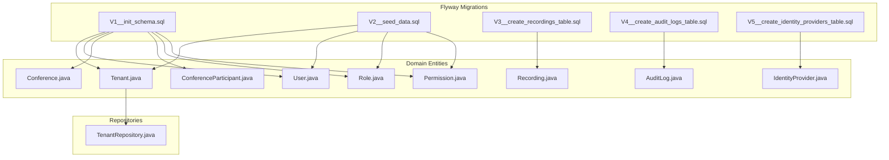
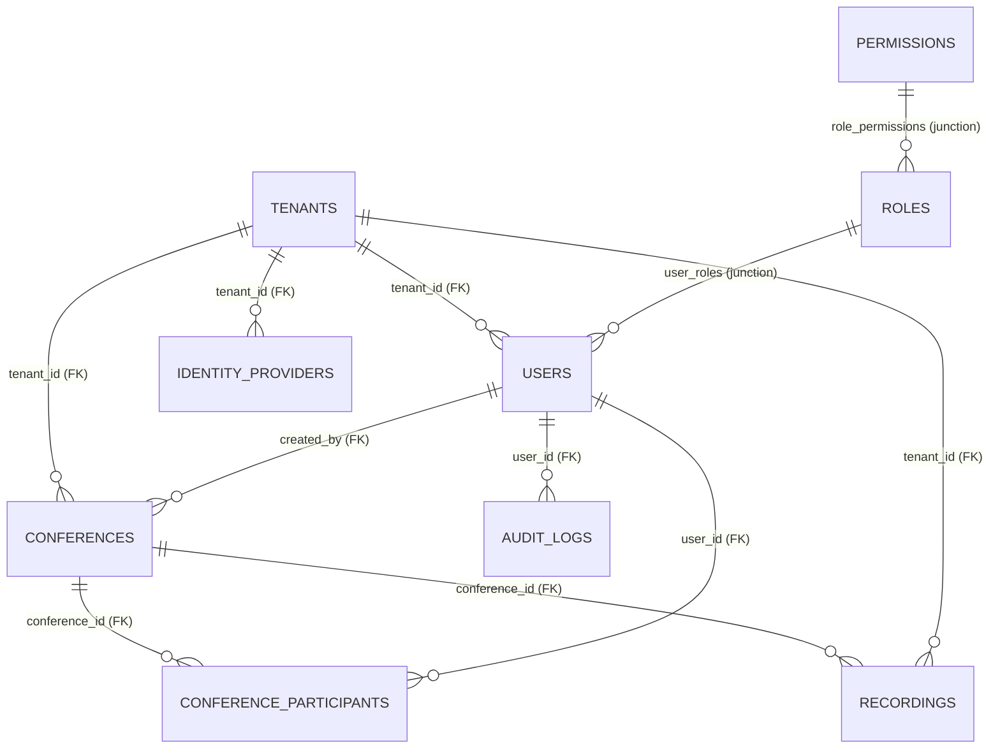
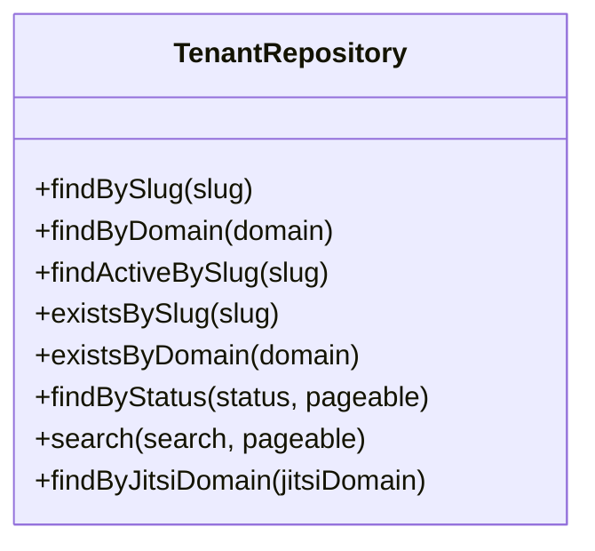
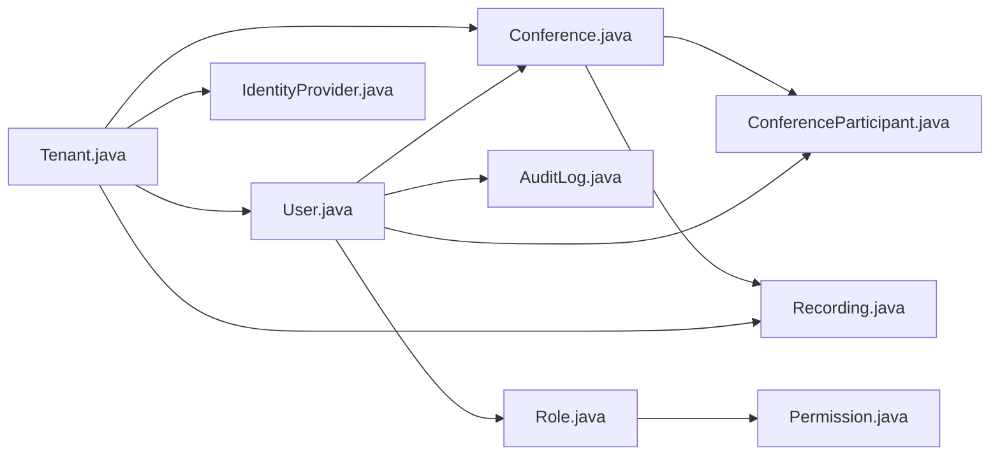
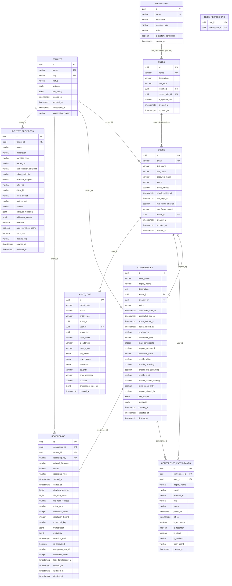

# Database Design

<cite>
**Referenced Files in This Document**
- [V1__init_schema.sql](file://jmp-web/src/main/resources/db/migration/V1__init_schema.sql)
- [V2__seed_data.sql](file://jmp-web/src/main/resources/db/migration/V2__seed_data.sql)
- [V3__create_recordings_table.sql](file://jmp-web/src/main/resources/db/migration/V3__create_recordings_table.sql)
- [V4__create_audit_logs_table.sql](file://jmp-web/src/main/resources/db/migration/V4__create_audit_logs_table.sql)
- [V5__create_identity_providers_table.sql](file://jmp-web/src/main/resources/db/migration/V5__create_identity_providers_table.sql)
- [Tenant.java](file://jmp-domain/src/main/java/com/jmp/domain/entity/Tenant.java)
- [User.java](file://jmp-domain/src/main/java/com/jmp/domain/entity/User.java)
- [Conference.java](file://jmp-domain/src/main/java/com/jmp/domain/entity/Conference.java)
- [Recording.java](file://jmp-domain/src/main/java/com/jmp/domain/entity/Recording.java)
- [AuditLog.java](file://jmp-domain/src/main/java/com/jmp/domain/entity/AuditLog.java)
- [ConferenceParticipant.java](file://jmp-domain/src/main/java/com/jmp/domain/entity/ConferenceParticipant.java)
- [IdentityProvider.java](file://jmp-domain/src/main/java/com/jmp/domain/entity/IdentityProvider.java)
- [Role.java](file://jmp-domain/src/main/java/com/jmp/domain/entity/Role.java)
- [Permission.java](file://jmp-domain/src/main/java/com/jmp/domain/entity/Permission.java)
- [TenantRepository.java](file://jmp-domain/src/main/java/com/jmp/domain/repository/TenantRepository.java)
</cite>

## Table of Contents
1. [Introduction](#introduction)
2. [Project Structure](#project-structure)
3. [Core Components](#core-components)
4. [Architecture Overview](#architecture-overview)
5. [Detailed Component Analysis](#detailed-component-analysis)
6. [Dependency Analysis](#dependency-analysis)
7. [Performance Considerations](#performance-considerations)
8. [Troubleshooting Guide](#troubleshooting-guide)
9. [Conclusion](#conclusion)
10. [Appendices](#appendices)

## Introduction
This document describes the database design of the Jitsi Management Platform (JMP). It covers the relational schema defined by Flyway migrations, the JPA entity model, constraints and indexes, data access patterns via Spring Data JPA, and operational aspects such as data lifecycle, retention, seeding, and security considerations. The goal is to provide a clear understanding of how data is modeled, stored, and accessed across the platform’s core entities.

## Project Structure
The database schema is managed by Flyway migrations under the web module resources. Entities are defined in the domain module and mapped to the database via JPA. Repositories define typed data access patterns.

**Diagram sources**
- [V1__init_schema.sql:1-172](file://jmp-web/src/main/resources/db/migration/V1__init_schema.sql#L1-L172)
- [V2__seed_data.sql:1-131](file://jmp-web/src/main/resources/db/migration/V2__seed_data.sql#L1-L131)
- [V3__create_recordings_table.sql:1-43](file://jmp-web/src/main/resources/db/migration/V3__create_recordings_table.sql#L1-L43)
- [V4__create_audit_logs_table.sql:1-36](file://jmp-web/src/main/resources/db/migration/V4__create_audit_logs_table.sql#L1-L36)
- [V5__create_identity_providers_table.sql:1-45](file://jmp-web/src/main/resources/db/migration/V5__create_identity_providers_table.sql#L1-L45)
- [Tenant.java:1-174](file://jmp-domain/src/main/java/com/jmp/domain/entity/Tenant.java#L1-L174)
- [User.java:1-164](file://jmp-domain/src/main/java/com/jmp/domain/entity/User.java#L1-L164)
- [Conference.java:1-217](file://jmp-domain/src/main/java/com/jmp/domain/entity/Conference.java#L1-L217)
- [ConferenceParticipant.java:1-150](file://jmp-domain/src/main/java/com/jmp/domain/entity/ConferenceParticipant.java#L1-L150)
- [Recording.java:1-203](file://jmp-domain/src/main/java/com/jmp/domain/entity/Recording.java#L1-L203)
- [AuditLog.java:1-136](file://jmp-domain/src/main/java/com/jmp/domain/entity/AuditLog.java#L1-L136)
- [IdentityProvider.java:1-158](file://jmp-domain/src/main/java/com/jmp/domain/entity/IdentityProvider.java#L1-L158)
- [Role.java:1-131](file://jmp-domain/src/main/java/com/jmp/domain/entity/Role.java#L1-L131)
- [Permission.java:1-128](file://jmp-domain/src/main/java/com/jmp/domain/entity/Permission.java#L1-L128)
- [TenantRepository.java:1-64](file://jmp-domain/src/main/java/com/jmp/domain/repository/TenantRepository.java#L1-L64)

**Section sources**
- [V1__init_schema.sql:1-172](file://jmp-web/src/main/resources/db/migration/V1__init_schema.sql#L1-L172)
- [V2__seed_data.sql:1-131](file://jmp-web/src/main/resources/db/migration/V2__seed_data.sql#L1-L131)
- [V3__create_recordings_table.sql:1-43](file://jmp-web/src/main/resources/db/migration/V3__create_recordings_table.sql#L1-L43)
- [V4__create_audit_logs_table.sql:1-36](file://jmp-web/src/main/resources/db/migration/V4__create_audit_logs_table.sql#L1-L36)
- [V5__create_identity_providers_table.sql:1-45](file://jmp-web/src/main/resources/db/migration/V5__create_identity_providers_table.sql#L1-L45)
- [Tenant.java:1-174](file://jmp-domain/src/main/java/com/jmp/domain/entity/Tenant.java#L1-L174)
- [User.java:1-164](file://jmp-domain/src/main/java/com/jmp/domain/entity/User.java#L1-L164)
- [Conference.java:1-217](file://jmp-domain/src/main/java/com/jmp/domain/entity/Conference.java#L1-L217)
- [ConferenceParticipant.java:1-150](file://jmp-domain/src/main/java/com/jmp/domain/entity/ConferenceParticipant.java#L1-L150)
- [Recording.java:1-203](file://jmp-domain/src/main/java/com/jmp/domain/entity/Recording.java#L1-L203)
- [AuditLog.java:1-136](file://jmp-domain/src/main/java/com/jmp/domain/entity/AuditLog.java#L1-L136)
- [IdentityProvider.java:1-158](file://jmp-domain/src/main/java/com/jmp/domain/entity/IdentityProvider.java#L1-L158)
- [Role.java:1-131](file://jmp-domain/src/main/java/com/jmp/domain/entity/Role.java#L1-L131)
- [Permission.java:1-128](file://jmp-domain/src/main/java/com/jmp/domain/entity/Permission.java#L1-L128)
- [TenantRepository.java:1-64](file://jmp-domain/src/main/java/com/jmp/domain/repository/TenantRepository.java#L1-L64)

## Core Components
This section documents the core entities, their fields, data types, constraints, and relationships.

- Tenants
  - Purpose: Multi-tenant organization container with quotas and settings.
  - Key fields: id (UUID PK), name (unique), slug (unique), status, quotas (embedded), settings (JSONB), jitsi_config (JSONB), timestamps, suspension fields.
  - Constraints: Unique constraints on name and slug; embedded quotas define allowed features and limits.
  - Indexes: slug, domain, status.
  - Lifecycle: Status transitions include ACTIVE, SUSPENDED, DELETED; suspension fields capture reason and timestamp.

- Users
  - Purpose: Platform users scoped to a tenant; supports RBAC and optional external auth identifiers.
  - Key fields: id (UUID PK), email (unique), name fields, password_hash, status, verification flags/timestamps, 2FA fields, tenant_id (FK), roles (M:N), timestamps, soft-delete deleted_at.
  - Constraints: Unique constraint on email; tenant_id FK; soft-deleted rows filtered by deleted_at in indexes.
  - Indexes: email, tenant_id, status (filtered by deleted_at).
  - Lifecycle: Status includes PENDING_VERIFICATION, ACTIVE, SUSPENDED, DELETED; soft-delete sets deleted_at and status.

- Roles and Permissions
  - Roles: id (UUID PK), name (unique), description, role_type, tenant_id (optional), parent_role_id (self-FK), permissions (M:N), flags (system/global), timestamps.
  - Permissions: id (UUID PK), name (unique), description, resource_type, action, flags, timestamps.
  - Junction: role_permissions (role_id, permission_id) with ON DELETE CASCADE.
  - Indexes: composite role-permission PK; cascading deletes maintain referential integrity.

- Conferences
  - Purpose: Jitsi conference rooms with scheduling, features, and metadata.
  - Key fields: id (UUID PK), room_name, display_name, description, tenant_id (FK), created_by (FK), status, scheduling timestamps, actual timestamps, recurring flags, password hash, feature toggles, jitsi_options/metadata (JSONB), timestamps, soft-delete deleted_at.
  - Constraints: Unique constraint on room_name+tenant_id (filtered by deleted_at); FKs to tenants and users.
  - Indexes: tenant_id, status, created_by, scheduled range, room_name+tenant_id (filtered).
  - Lifecycle: Status includes SCHEDULED, ACTIVE, ENDED, CANCELLED; soft-delete sets deleted_at and status.

- Conference Participants
  - Purpose: Tracks who joins/leaves conferences, roles, and session attributes.
  - Key fields: id (UUID PK), conference_id (FK), user_id (FK), display_name, email, external_id, role, status, joined/left timestamps, flags, IP/user agent, timestamps.
  - Constraints: FKs to conferences and users; timestamps.
  - Indexes: conference_id, user_id, status.

- Recordings
  - Purpose: Conference recordings with storage metadata, retention, and encryption.
  - Key fields: id (UUID PK), conference_id (FK), tenant_id (FK), recording_key (unique), original_filename, status, recording_type, timing fields, file metadata, thumbnail_key, transcription/metadata (JSONB), retention_until, encryption flags, counters, timestamps, soft-delete deleted_at.
  - Constraints: Unique constraint on recording_key; FKs to conferences and tenants; retention_until optional.
  - Indexes: conference_id, tenant_id, status, retention_until, created_at desc, tenant+status (filtered).
  - Lifecycle: Status includes PENDING, PROCESSING, READY, FAILED, ARCHIVED, DELETED; retention check determines archival eligibility.

- Audit Logs
  - Purpose: System-wide audit trail for events, actors, and outcomes.
  - Key fields: id (UUID PK), event_type, action, entity_type/entity_id, user_id (FK), tenant_id, user_email, IP, user_agent, old/new values/metadata (JSONB), severity, error_message, success flag, processing_time_ms, timestamps.
  - Constraints: Optional FK to users; timestamps.
  - Indexes: tenant_id, user_id, event_type, entity, created_at desc, tenant+created_at desc, success=false (filtered).

- Identity Providers
  - Purpose: SSO/OIDC provider configuration per tenant.
  - Key fields: id (UUID PK), tenant_id (FK), name, description, provider_type, endpoints, client credentials, redirect URI, scopes, attribute_mapping/additional_config (JSONB), flags (enabled/auto-provision/force SSO/default role), timestamps.
  - Constraints: Unique constraint on tenant+name; FK to tenants; optional user external auth columns added to users.
  - Indexes: tenant_id, tenant+enabled (composite), users external auth index (filtered).
  - Lifecycle: Enabled/disabled; supports auto-provisioning and default role assignment.

**Section sources**
- [V1__init_schema.sql:11-172](file://jmp-web/src/main/resources/db/migration/V1__init_schema.sql#L11-L172)
- [V2__seed_data.sql:4-131](file://jmp-web/src/main/resources/db/migration/V2__seed_data.sql#L4-L131)
- [V3__create_recordings_table.sql:4-43](file://jmp-web/src/main/resources/db/migration/V3__create_recordings_table.sql#L4-L43)
- [V4__create_audit_logs_table.sql:4-36](file://jmp-web/src/main/resources/db/migration/V4__create_audit_logs_table.sql#L4-L36)
- [V5__create_identity_providers_table.sql:4-45](file://jmp-web/src/main/resources/db/migration/V5__create_identity_providers_table.sql#L4-L45)
- [Tenant.java:24-174](file://jmp-domain/src/main/java/com/jmp/domain/entity/Tenant.java#L24-L174)
- [User.java:23-164](file://jmp-domain/src/main/java/com/jmp/domain/entity/User.java#L23-L164)
- [Role.java:22-131](file://jmp-domain/src/main/java/com/jmp/domain/entity/Role.java#L22-L131)
- [Permission.java:18-128](file://jmp-domain/src/main/java/com/jmp/domain/entity/Permission.java#L18-L128)
- [Conference.java:25-217](file://jmp-domain/src/main/java/com/jmp/domain/entity/Conference.java#L25-L217)
- [ConferenceParticipant.java:18-150](file://jmp-domain/src/main/java/com/jmp/domain/entity/ConferenceParticipant.java#L18-L150)
- [Recording.java:24-203](file://jmp-domain/src/main/java/com/jmp/domain/entity/Recording.java#L24-L203)
- [AuditLog.java:20-136](file://jmp-domain/src/main/java/com/jmp/domain/entity/AuditLog.java#L20-L136)
- [IdentityProvider.java:23-158](file://jmp-domain/src/main/java/com/jmp/domain/entity/IdentityProvider.java#L23-L158)

## Architecture Overview
The database architecture follows a multi-tenant design with explicit tenant isolation and soft-deleted row filtering via indexes. Core entities are connected via foreign keys, and specialized tables handle recordings, audit trails, and identity providers. JPA entities mirror the schema with embedded values and JSONB fields for flexible configuration.

**Diagram sources**
- [V1__init_schema.sql:11-172](file://jmp-web/src/main/resources/db/migration/V1__init_schema.sql#L11-L172)
- [V3__create_recordings_table.sql:4-43](file://jmp-web/src/main/resources/db/migration/V3__create_recordings_table.sql#L4-L43)
- [V4__create_audit_logs_table.sql:4-36](file://jmp-web/src/main/resources/db/migration/V4__create_audit_logs_table.sql#L4-L36)
- [V5__create_identity_providers_table.sql:4-45](file://jmp-web/src/main/resources/db/migration/V5__create_identity_providers_table.sql#L4-L45)
- [Role.java:22-131](file://jmp-domain/src/main/java/com/jmp/domain/entity/Role.java#L22-L131)
- [Permission.java:18-128](file://jmp-domain/src/main/java/com/jmp/domain/entity/Permission.java#L18-L128)

## Detailed Component Analysis

### Entity Model and Field Definitions
- Tenants
  - Embedded quotas: maxConcurrentConferences, maxParticipantsPerConference, maxRecordingStorageMb, maxConferenceDurationMinutes, allowedFeatures.
  - JSONB settings and jitsi_config for extensibility.
  - Status enum with ACTIVE/SUSPENDED/DELETED; suspension fields track reason and timestamp.
- Users
  - Enum status with PENDING_VERIFICATION/ACTIVE/SUSPENDED/DELETED.
  - Soft delete via deleted_at; external auth fields for SSO.
  - Many-to-many roles via user_roles junction.
- Roles and Permissions
  - Role hierarchy via parent_role_id; system vs tenant-scoped roles.
  - Resource/action taxonomy supports ABAC alongside RBAC.
- Conferences
  - Scheduling and recurring rules; feature flags; JSONB jitsi_options/metadata.
  - Participants relationship enables attendance tracking.
- Conference Participants
  - Role and status enums; timestamps for join/leave; optional user linkage for registered participants.
- Recordings
  - Status lifecycle and type taxonomy; retention_until for policy-driven archival.
  - JSONB transcription/metadata; counters for analytics.
- Audit Logs
  - Event taxonomy and severity levels; JSONB payloads for change tracking.
- Identity Providers
  - Provider endpoints, credentials, scopes, and attribute mapping; default role and provisioning flags.

**Section sources**
- [Tenant.java:24-174](file://jmp-domain/src/main/java/com/jmp/domain/entity/Tenant.java#L24-L174)
- [User.java:23-164](file://jmp-domain/src/main/java/com/jmp/domain/entity/User.java#L23-L164)
- [Role.java:22-131](file://jmp-domain/src/main/java/com/jmp/domain/entity/Role.java#L22-L131)
- [Permission.java:18-128](file://jmp-domain/src/main/java/com/jmp/domain/entity/Permission.java#L18-L128)
- [Conference.java:25-217](file://jmp-domain/src/main/java/com/jmp/domain/entity/Conference.java#L25-L217)
- [ConferenceParticipant.java:18-150](file://jmp-domain/src/main/java/com/jmp/domain/entity/ConferenceParticipant.java#L18-L150)
- [Recording.java:24-203](file://jmp-domain/src/main/java/com/jmp/domain/entity/Recording.java#L24-L203)
- [AuditLog.java:20-136](file://jmp-domain/src/main/java/com/jmp/domain/entity/AuditLog.java#L20-L136)
- [IdentityProvider.java:23-158](file://jmp-domain/src/main/java/com/jmp/domain/entity/IdentityProvider.java#L23-L158)

### Constraints, Indexes, and Referential Integrity
- Primary Keys: All entities use UUID primary keys generated by the database.
- Foreign Keys:
  - users.tenant_id → tenants.id
  - conferences.tenant_id → tenants.id
  - conferences.created_by → users.id
  - conference_participants.conference_id → conferences.id
  - conference_participants.user_id → users.id
  - recordings.conference_id → conferences.id
  - recordings.tenant_id → tenants.id
  - audit_logs.user_id → users.id
  - identity_providers.tenant_id → tenants.id
  - roles.parent_role_id → roles.id
  - role_permissions: role_id → roles.id, permission_id → permissions.id (ON DELETE CASCADE)
  - user_roles: user_id → users.id, role_id → roles.id (ON DELETE CASCADE)
- Unique Constraints:
  - tenants.name, tenants.slug
  - users.email
  - conferences.room_name + tenant_id (filtered by deleted_at)
  - recordings.recording_key
  - identity_providers.tenant_id + name
- Indexes (filtered where applicable):
  - Users: email, tenant_id, status (filtered by deleted_at)
  - Tenants: slug, domain, status
  - Conferences: tenant_id, status, created_by, scheduled_start/scheduled_end, room_name+tenant_id (filtered)
  - Conference Participants: conference_id, user_id, status
  - Recordings: conference_id, tenant_id, status, retention_until, created_at desc, tenant+status (filtered)
  - Audit Logs: tenant_id, user_id, event_type, entity_type+entity_id, created_at desc, tenant+created_at desc, success=false (filtered)
  - Identity Providers: tenant_id, tenant+enabled (composite)
  - Users external auth: external_auth_provider + external_auth_id (filtered)

**Section sources**
- [V1__init_schema.sql:141-172](file://jmp-web/src/main/resources/db/migration/V1__init_schema.sql#L141-L172)
- [V3__create_recordings_table.sql:33-43](file://jmp-web/src/main/resources/db/migration/V3__create_recordings_table.sql#L33-L43)
- [V4__create_audit_logs_table.sql:25-36](file://jmp-web/src/main/resources/db/migration/V4__create_audit_logs_table.sql#L25-L36)
- [V5__create_identity_providers_table.sql:29-45](file://jmp-web/src/main/resources/db/migration/V5__create_identity_providers_table.sql#L29-L45)

### Data Validation Rules and Business Rules
- Validation:
  - Non-null constraints on required fields (e.g., name, slug, email, room_name, display_name).
  - Size limits enforced via annotations and schema (e.g., VARCHAR lengths).
  - Enumerations constrain status and role/type fields.
- Business Rules:
  - Tenant quotas enforce concurrency, participant counts, storage, and duration limits; allowed_features gate capabilities.
  - User soft-delete and status transitions; participant join/leave lifecycle.
  - Conference status transitions and participant counting logic.
  - Recording lifecycle with duration calculation and retention checks.
  - Audit logging captures events, severity, and outcomes; filtered indexes optimize failure queries.
  - Identity provider configuration controls SSO behavior and default role assignment.

**Section sources**
- [Tenant.java:146-172](file://jmp-domain/src/main/java/com/jmp/domain/entity/Tenant.java#L146-L172)
- [Conference.java:137-184](file://jmp-domain/src/main/java/com/jmp/domain/entity/Conference.java#L137-L184)
- [Recording.java:128-161](file://jmp-domain/src/main/java/com/jmp/domain/entity/Recording.java#L128-L161)
- [AuditLog.java:122-134](file://jmp-domain/src/main/java/com/jmp/domain/entity/AuditLog.java#L122-L134)
- [IdentityProvider.java:148-156](file://jmp-domain/src/main/java/com/jmp/domain/entity/IdentityProvider.java#L148-L156)

### Data Access Patterns Through Spring Data JPA
- Typed Repositories:
  - TenantRepository extends JpaRepository with custom queries for slug/domain existence, active tenant lookup, paginated status filtering, and search by name/slug.
- Fetch Strategies:
  - Lazy fetch for associations (e.g., User.tenant, Conference.createdBy) to avoid N+1 selects.
  - Eager fetch for Role.permissions to load permission sets efficiently during authorization checks.
- Projection and Filtering:
  - Queries filter out soft-deleted rows using deleted_at IS NULL in predicates.
  - Composite indexes support efficient filtering by tenant, status, and date ranges.

**Diagram sources**
- [TenantRepository.java:17-64](file://jmp-domain/src/main/java/com/jmp/domain/repository/TenantRepository.java#L17-L64)

**Section sources**
- [TenantRepository.java:17-64](file://jmp-domain/src/main/java/com/jmp/domain/repository/TenantRepository.java#L17-L64)

### Data Lifecycle, Retention Policies, and Archival Rules
- Soft Deletion:
  - Users, Conferences, and Recordings set deleted_at and adjust status upon deletion.
- Retention:
  - Recordings include retention_until; isWithinRetention() evaluates archival eligibility.
  - Audit logs include success=false index for quick identification of failures.
- Archival:
  - Recording status includes ARCHIVED for moved content; retention-based cleanup recommended.

**Section sources**
- [User.java:110-115](file://jmp-domain/src/main/java/com/jmp/domain/entity/User.java#L110-L115)
- [Conference.java:153-159](file://jmp-domain/src/main/java/com/jmp/domain/entity/Conference.java#L153-L159)
- [Recording.java:153-161](file://jmp-domain/src/main/java/com/jmp/domain/entity/Recording.java#L153-L161)
- [V3__create_recordings_table.sql:23-30](file://jmp-web/src/main/resources/db/migration/V3__create_recordings_table.sql#L23-L30)
- [V4__create_audit_logs_table.sql:32-32](file://jmp-web/src/main/resources/db/migration/V4__create_audit_logs_table.sql#L32-L32)

### Data Seeding, Migration Management, and Version Control
- Initial Schema:
  - V1 initializes schema, UUID extension, tables, constraints, indexes, and comments.
- Seed Data:
  - V2 inserts default tenant, system permissions, system roles, role-permission assignments, default users, and role assignments.
- Additional Tables:
  - V3 adds recordings table with indexes.
  - V4 adds audit logs table with indexes.
  - V5 adds identity_providers table, indexes, and users external auth columns.
- Version Control:
  - Flyway naming convention V{version}__{description}.sql ensures deterministic ordering and idempotency.

**Section sources**
- [V1__init_schema.sql:1-172](file://jmp-web/src/main/resources/db/migration/V1__init_schema.sql#L1-L172)
- [V2__seed_data.sql:1-131](file://jmp-web/src/main/resources/db/migration/V2__seed_data.sql#L1-L131)
- [V3__create_recordings_table.sql:1-43](file://jmp-web/src/main/resources/db/migration/V3__create_recordings_table.sql#L1-L43)
- [V4__create_audit_logs_table.sql:1-36](file://jmp-web/src/main/resources/db/migration/V4__create_audit_logs_table.sql#L1-L36)
- [V5__create_identity_providers_table.sql:1-45](file://jmp-web/src/main/resources/db/migration/V5__create_identity_providers_table.sql#L1-L45)

### Security, Privacy, and Access Control
- Authentication and Authorization:
  - Users support local credentials and optional external auth identifiers for SSO.
  - IdentityProviders configure OIDC endpoints and attribute mapping; supports auto-provisioning and default roles.
- Data Protection:
  - Recording encryption flags and encryption key identifiers; retention-based archival reduces exposure.
  - Audit logs capture sensitive actions, IP/user-agent, and success/failure for compliance.
- Access Control:
  - RBAC with hierarchical roles and system/global permissions; role_permissions junction enforces granular access.

**Section sources**
- [User.java:76-82](file://jmp-domain/src/main/java/com/jmp/domain/entity/User.java#L76-L82)
- [IdentityProvider.java:148-156](file://jmp-domain/src/main/java/com/jmp/domain/entity/IdentityProvider.java#L148-L156)
- [Role.java:76-89](file://jmp-domain/src/main/java/com/jmp/domain/entity/Role.java#L76-L89)
- [Permission.java:79-98](file://jmp-domain/src/main/java/com/jmp/domain/entity/Permission.java#L79-L98)
- [AuditLog.java:122-134](file://jmp-domain/src/main/java/com/jmp/domain/entity/AuditLog.java#L122-L134)

## Dependency Analysis
This section maps dependencies among entities and repositories.

**Diagram sources**
- [Tenant.java:84-87](file://jmp-domain/src/main/java/com/jmp/domain/entity/Tenant.java#L84-L87)
- [User.java:84-96](file://jmp-domain/src/main/java/com/jmp/domain/entity/User.java#L84-L96)
- [Conference.java:51-59](file://jmp-domain/src/main/java/com/jmp/domain/entity/Conference.java#L51-L59)
- [ConferenceParticipant.java:30-37](file://jmp-domain/src/main/java/com/jmp/domain/entity/ConferenceParticipant.java#L30-L37)
- [Recording.java:36-44](file://jmp-domain/src/main/java/com/jmp/domain/entity/Recording.java#L36-L44)
- [AuditLog.java:48-50](file://jmp-domain/src/main/java/com/jmp/domain/entity/AuditLog.java#L48-L50)
- [IdentityProvider.java:35-38](file://jmp-domain/src/main/java/com/jmp/domain/entity/IdentityProvider.java#L35-L38)
- [Role.java:48-59](file://jmp-domain/src/main/java/com/jmp/domain/entity/Role.java#L48-L59)
- [Permission.java:25-33](file://jmp-domain/src/main/java/com/jmp/domain/entity/Permission.java#L25-L33)

**Section sources**
- [Tenant.java:84-87](file://jmp-domain/src/main/java/com/jmp/domain/entity/Tenant.java#L84-L87)
- [User.java:84-96](file://jmp-domain/src/main/java/com/jmp/domain/entity/User.java#L84-L96)
- [Conference.java:51-59](file://jmp-domain/src/main/java/com/jmp/domain/entity/Conference.java#L51-L59)
- [ConferenceParticipant.java:30-37](file://jmp-domain/src/main/java/com/jmp/domain/entity/ConferenceParticipant.java#L30-L37)
- [Recording.java:36-44](file://jmp-domain/src/main/java/com/jmp/domain/entity/Recording.java#L36-L44)
- [AuditLog.java:48-50](file://jmp-domain/src/main/java/com/jmp/domain/entity/AuditLog.java#L48-L50)
- [IdentityProvider.java:35-38](file://jmp-domain/src/main/java/com/jmp/domain/entity/IdentityProvider.java#L35-L38)
- [Role.java:48-59](file://jmp-domain/src/main/java/com/jmp/domain/entity/Role.java#L48-L59)
- [Permission.java:25-33](file://jmp-domain/src/main/java/com/jmp/domain/entity/Permission.java#L25-L33)

## Performance Considerations
- Indexes:
  - Use tenant_id/status/date-range indexes for filtering active records and reducing scans.
  - Composite indexes (e.g., tenant+status, room_name+tenant_id) improve query selectivity.
- Soft Delete Filtering:
  - Index expressions filter deleted_at IS NULL to exclude soft-deleted rows efficiently.
- JSONB Fields:
  - Use targeted queries and avoid SELECT *; leverage projections to minimize payload.
- Fetch Strategies:
  - Lazy loading prevents unnecessary joins; eager loading of permissions for role evaluation avoids N+1.
- Audit Log Queries:
  - Success=false index accelerates failure analysis; created_at DESC indexes support time-series queries.

[No sources needed since this section provides general guidance]

## Troubleshooting Guide
- Common Issues:
  - Duplicate tenant slug/name: Check unique indexes and seed data.
  - Conference uniqueness: room_name+tenant_id must be unique; verify soft-deleted rows are excluded.
  - Recording retention: Ensure retention_until is set appropriately; monitor archival jobs.
  - Audit failures: Use success=false index to locate failed operations quickly.
- Diagnostics:
  - Verify FK existence and referential integrity after schema changes.
  - Confirm index usage with EXPLAIN/EXPLAIN ANALYZE on slow queries.

**Section sources**
- [V1__init_schema.sql:160-164](file://jmp-web/src/main/resources/db/migration/V1__init_schema.sql#L160-L164)
- [V3__create_recordings_table.sql:33-40](file://jmp-web/src/main/resources/db/migration/V3__create_recordings_table.sql#L33-L40)
- [V4__create_audit_logs_table.sql:25-32](file://jmp-web/src/main/resources/db/migration/V4__create_audit_logs_table.sql#L25-L32)

## Conclusion
The JMP database design emphasizes multi-tenancy, soft-deleted row isolation, and flexible configuration via JSONB fields. The schema, constraints, and indexes support efficient querying and strong referential integrity. JPA entities align closely with the schema, enabling clean data access patterns and robust auditing. Migration scripts provide a clear, versioned evolution path for schema changes.

[No sources needed since this section summarizes without analyzing specific files]

## Appendices

### Appendix A: Entity Relationship Diagram

**Diagram sources**
- [V1__init_schema.sql:11-172](file://jmp-web/src/main/resources/db/migration/V1__init_schema.sql#L11-L172)
- [V3__create_recordings_table.sql:4-43](file://jmp-web/src/main/resources/db/migration/V3__create_recordings_table.sql#L4-L43)
- [V4__create_audit_logs_table.sql:4-36](file://jmp-web/src/main/resources/db/migration/V4__create_audit_logs_table.sql#L4-L36)
- [V5__create_identity_providers_table.sql:4-45](file://jmp-web/src/main/resources/db/migration/V5__create_identity_providers_table.sql#L4-L45)
- [Role.java:52-59](file://jmp-domain/src/main/java/com/jmp/domain/entity/Role.java#L52-L59)
- [Permission.java:49-50](file://jmp-domain/src/main/java/com/jmp/domain/entity/Permission.java#L49-L50)