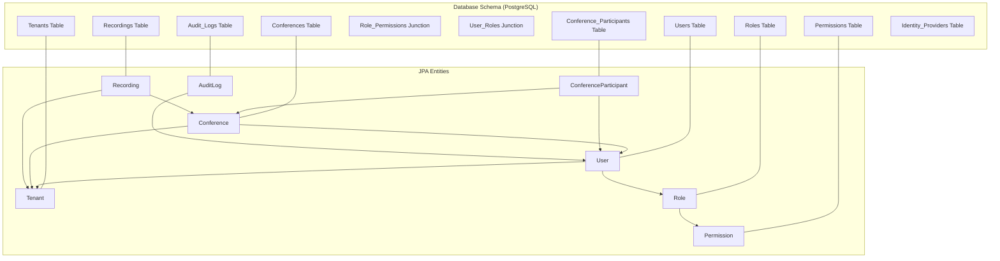
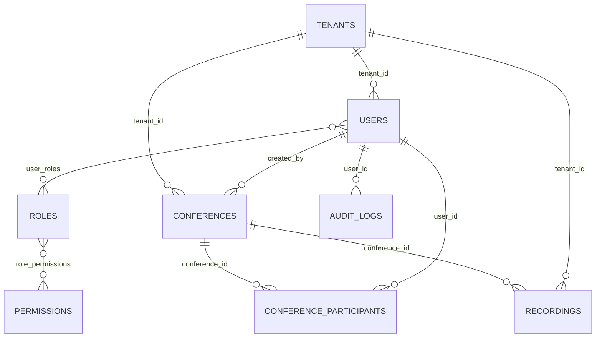
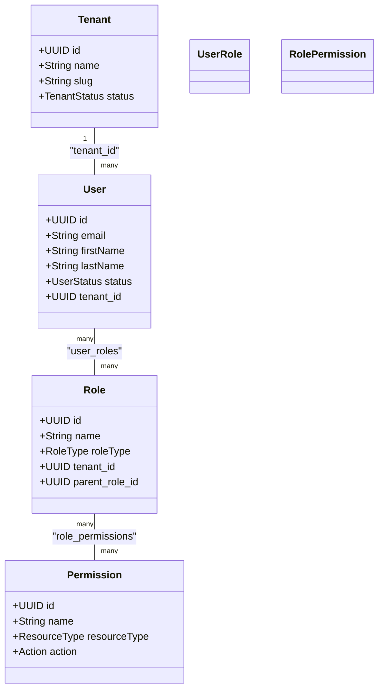
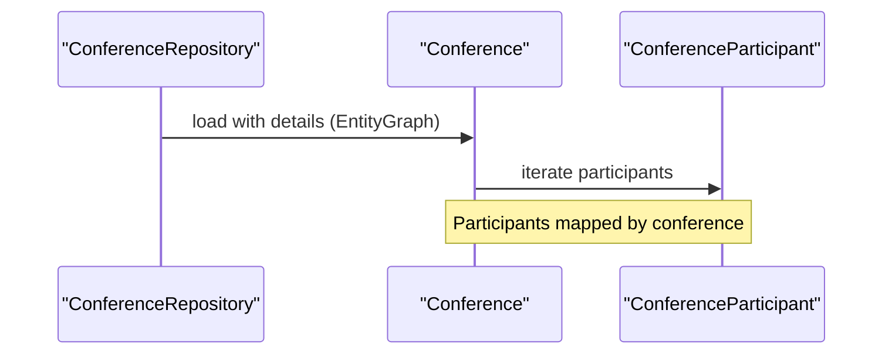
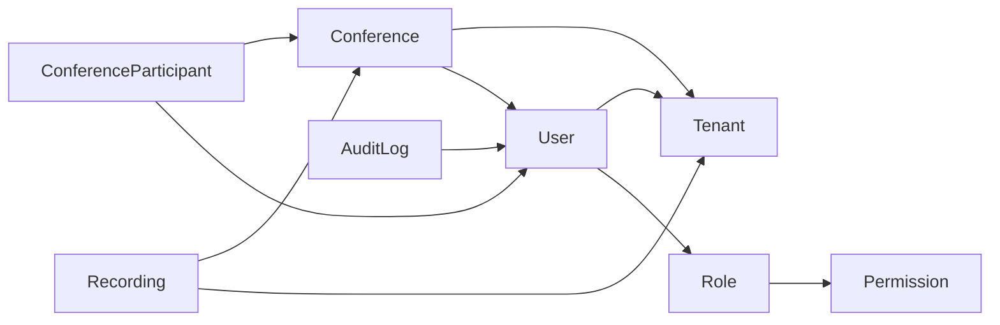

# Entity Relationships

<cite>
**Referenced Files in This Document**
- [V1__init_schema.sql](file://jmp-web/src/main/resources/db/migration/V1__init_schema.sql)
- [V2__seed_data.sql](file://jmp-web/src/main/resources/db/migration/V2__seed_data.sql)
- [V3__create_recordings_table.sql](file://jmp-web/src/main/resources/db/migration/V3__create_recordings_table.sql)
- [V4__create_audit_logs_table.sql](file://jmp-web/src/main/resources/db/migration/V4__create_audit_logs_table.sql)
- [V5__create_identity_providers_table.sql](file://jmp-web/src/main/resources/db/migration/V5__create_identity_providers_table.sql)
- [User.java](file://jmp-domain/src/main/java/com/jmp/domain/entity/User.java)
- [Tenant.java](file://jmp-domain/src/main/java/com/jmp/domain/entity/Tenant.java)
- [Role.java](file://jmp-domain/src/main/java/com/jmp/domain/entity/Role.java)
- [Permission.java](file://jmp-domain/src/main/java/com/jmp/domain/entity/Permission.java)
- [Conference.java](file://jmp-domain/src/main/java/com/jmp/domain/entity/Conference.java)
- [ConferenceParticipant.java](file://jmp-domain/src/main/java/com/jmp/domain/entity/ConferenceParticipant.java)
- [Recording.java](file://jmp-domain/src/main/java/com/jmp/domain/entity/Recording.java)
- [AuditLog.java](file://jmp-domain/src/main/java/com/jmp/domain/entity/AuditLog.java)
- [UserRepository.java](file://jmp-domain/src/main/java/com/jmp/domain/repository/UserRepository.java)
- [ConferenceRepository.java](file://jmp-domain/src/main/java/com/jmp/domain/repository/ConferenceRepository.java)
- [RecordingRepository.java](file://jmp-domain/src/main/java/com/jmp/domain/repository/RecordingRepository.java)
- [AuditLogRepository.java](file://jmp-domain/src/main/java/com/jmp/domain/repository/AuditLogRepository.java)
</cite>

## Table of Contents
1. [Introduction](#introduction)
2. [Project Structure](#project-structure)
3. [Core Components](#core-components)
4. [Architecture Overview](#architecture-overview)
5. [Detailed Component Analysis](#detailed-component-analysis)
6. [Dependency Analysis](#dependency-analysis)
7. [Performance Considerations](#performance-considerations)
8. [Troubleshooting Guide](#troubleshooting-guide)
9. [Conclusion](#conclusion)

## Introduction
This document provides a comprehensive entity relationship specification for the Jitsi Management Platform (JMP). It documents the core database entities and their relationships, including primary keys, foreign keys, referential integrity constraints, cascade behaviors, and many-to-many associations. It also explains the tenant-scoped user model, hierarchical role structure, conference participant tracking, recording associations, and audit trail relationships. Business rule enforcement via foreign keys and indexes is highlighted, along with cardinalities and optional/mandatory attributes.

## Project Structure
The entity model is defined by:
- Database schema migrations that create tables, indexes, and comments
- JPA entity classes that define relationships and constraints
- Repository interfaces that expose queries and graph loading strategies

**Diagram sources**
- [V1__init_schema.sql:11-172](file://jmp-web/src/main/resources/db/migration/V1__init_schema.sql#L11-L172)
- [V3__create_recordings_table.sql:4-43](file://jmp-web/src/main/resources/db/migration/V3__create_recordings_table.sql#L4-L43)
- [V4__create_audit_logs_table.sql:4-36](file://jmp-web/src/main/resources/db/migration/V4__create_audit_logs_table.sql#L4-L36)
- [V5__create_identity_providers_table.sql:4-45](file://jmp-web/src/main/resources/db/migration/V5__create_identity_providers_table.sql#L4-L45)
- [User.java:84-96](file://jmp-domain/src/main/java/com/jmp/domain/entity/User.java#L84-L96)
- [Role.java:48-59](file://jmp-domain/src/main/java/com/jmp/domain/entity/Role.java#L48-L59)
- [Conference.java:52-59](file://jmp-domain/src/main/java/com/jmp/domain/entity/Conference.java#L52-L59)
- [ConferenceParticipant.java:30-37](file://jmp-domain/src/main/java/com/jmp/domain/entity/ConferenceParticipant.java#L30-L37)
- [Recording.java:36-44](file://jmp-domain/src/main/java/com/jmp/domain/entity/Recording.java#L36-L44)
- [AuditLog.java:48-53](file://jmp-domain/src/main/java/com/jmp/domain/entity/AuditLog.java#L48-L53)

**Section sources**
- [V1__init_schema.sql:1-172](file://jmp-web/src/main/resources/db/migration/V1__init_schema.sql#L1-L172)
- [V2__seed_data.sql:1-131](file://jmp-web/src/main/resources/db/migration/V2__seed_data.sql#L1-L131)
- [V3__create_recordings_table.sql:1-43](file://jmp-web/src/main/resources/db/migration/V3__create_recordings_table.sql#L1-L43)
- [V4__create_audit_logs_table.sql:1-36](file://jmp-web/src/main/resources/db/migration/V4__create_audit_logs_table.sql#L1-L36)
- [V5__create_identity_providers_table.sql:1-45](file://jmp-web/src/main/resources/db/migration/V5__create_identity_providers_table.sql#L1-L45)

## Core Components
This section summarizes the core entities and their primary characteristics.

- Tenant
  - Purpose: Multi-tenant isolation and quota management
  - Key attributes: id, name, slug, status, quotas, settings, jitsi_config
  - Constraints: unique slug, status enum, quotas embeddable

- User
  - Purpose: Tenant-scoped identity with role membership
  - Key attributes: id, email, name, password_hash, status, tenant_id, roles
  - Constraints: unique email, tenant foreign key, soft-delete flag

- Role
  - Purpose: RBAC role with hierarchy and permissions
  - Key attributes: id, name, description, role_type, tenant_id, parent_role_id, permissions
  - Constraints: unique name, optional tenant (global roles), self-referencing parent

- Permission
  - Purpose: Fine-grained permissions for ABAC
  - Key attributes: id, name, description, resource_type, action, is_system_permission
  - Constraints: unique name, enums for resource_type and action

- Conference
  - Purpose: Jitsi conference room with scheduling and features
  - Key attributes: id, room_name, display_name, tenant_id, created_by, status, scheduling, features, metadata
  - Constraints: unique room_name per tenant, soft-delete flag, participants collection

- ConferenceParticipant
  - Purpose: Tracks who joins/leaves conferences and their roles/status
  - Key attributes: id, conference_id, user_id, role, status, timestamps, device info
  - Constraints: optional user_id (guests), enums for role and status

- Recording
  - Purpose: Conference recordings with lifecycle and storage metadata
  - Key attributes: id, conference_id, tenant_id, recording_key, status, type, media metadata, retention
  - Constraints: unique recording_key, soft-delete flag

- AuditLog
  - Purpose: System-wide audit trail
  - Key attributes: id, event_type, action, entity_type/entity_id, user_id/tenant_id, device info, payload, severity, timestamps
  - Constraints: optional user_id (non-user actions), enums for event_type

**Section sources**
- [Tenant.java:29-88](file://jmp-domain/src/main/java/com/jmp/domain/entity/Tenant.java#L29-L88)
- [User.java:28-107](file://jmp-domain/src/main/java/com/jmp/domain/entity/User.java#L28-L107)
- [Role.java:27-66](file://jmp-domain/src/main/java/com/jmp/domain/entity/Role.java#L27-L66)
- [Permission.java:23-54](file://jmp-domain/src/main/java/com/jmp/domain/entity/Permission.java#L23-L54)
- [Conference.java:30-135](file://jmp-domain/src/main/java/com/jmp/domain/entity/Conference.java#L30-L135)
- [ConferenceParticipant.java:23-87](file://jmp-domain/src/main/java/com/jmp/domain/entity/ConferenceParticipant.java#L23-L87)
- [Recording.java:29-126](file://jmp-domain/src/main/java/com/jmp/domain/entity/Recording.java#L29-L126)
- [AuditLog.java:25-95](file://jmp-domain/src/main/java/com/jmp/domain/entity/AuditLog.java#L25-L95)

## Architecture Overview
The JMP entity model enforces tenant scoping and RBAC with hierarchical roles and permission inheritance. Many-to-many relationships connect Users to Roles and Roles to Permissions via junction tables. Conferences are owned by Tenants and CreatedBy Users, with Participants tracked separately. Recordings belong to Conferences and Tenants. Audit logs optionally reference Users and capture system events.

**Diagram sources**
- [V1__init_schema.sql:11-172](file://jmp-web/src/main/resources/db/migration/V1__init_schema.sql#L11-L172)
- [V3__create_recordings_table.sql:4-43](file://jmp-web/src/main/resources/db/migration/V3__create_recordings_table.sql#L4-L43)
- [V4__create_audit_logs_table.sql:4-36](file://jmp-web/src/main/resources/db/migration/V4__create_audit_logs_table.sql#L4-L36)
- [User.java:84-96](file://jmp-domain/src/main/java/com/jmp/domain/entity/User.java#L84-L96)
- [Role.java:48-59](file://jmp-domain/src/main/java/com/jmp/domain/entity/Role.java#L48-L59)
- [Conference.java:52-59](file://jmp-domain/src/main/java/com/jmp/domain/entity/Conference.java#L52-L59)
- [ConferenceParticipant.java:30-37](file://jmp-domain/src/main/java/com/jmp/domain/entity/ConferenceParticipant.java#L30-L37)
- [Recording.java:36-44](file://jmp-domain/src/main/java/com/jmp/domain/entity/Recording.java#L36-L44)
- [AuditLog.java:48-53](file://jmp-domain/src/main/java/com/jmp/domain/entity/AuditLog.java#L48-L53)

## Detailed Component Analysis

### Tenant
- Cardinality
  - One Tenant to many Users
  - One Tenant to many Conferences
  - One Tenant to many Recordings
- Business rules
  - Slug uniqueness ensures multi-tenant isolation
  - Status controls activation/suspension
  - Quotas embeddable governs feature limits
- Cascade behavior
  - No explicit cascades on Tenant; deletions require prior cleanup

**Section sources**
- [Tenant.java:29-88](file://jmp-domain/src/main/java/com/jmp/domain/entity/Tenant.java#L29-L88)
- [V1__init_schema.sql:11-30](file://jmp-web/src/main/resources/db/migration/V1__init_schema.sql#L11-L30)

### User
- Cardinality
  - Many Users to one Tenant (tenant_id)
  - Many Users to many Roles (user_roles)
- Business rules
  - Email uniqueness per tenant via repository queries
  - Status and soft-delete flags manage lifecycle
  - Roles loaded via EntityGraph for authorization
- Cascade behavior
  - User roles cascade on delete (ON DELETE CASCADE)

**Diagram sources**
- [User.java:84-96](file://jmp-domain/src/main/java/com/jmp/domain/entity/User.java#L84-L96)
- [Role.java:48-59](file://jmp-domain/src/main/java/com/jmp/domain/entity/Role.java#L48-L59)
- [V1__init_schema.sql:83-87](file://jmp-web/src/main/resources/db/migration/V1__init_schema.sql#L83-L87)
- [V57-L61:56-61](file://jmp-web/src/main/resources/db/migration/V1__init_schema.sql#L56-L61)

**Section sources**
- [User.java:28-107](file://jmp-domain/src/main/java/com/jmp/domain/entity/User.java#L28-L107)
- [UserRepository.java:24-37](file://jmp-domain/src/main/java/com/jmp/domain/repository/UserRepository.java#L24-L37)

### Role and Permission (Hierarchical and Many-to-Many)
- Cardinality
  - Many Roles to many Permissions (role_permissions)
  - Self-referencing parent_role_id enables hierarchy
- Business rules
  - Hierarchical roles inherit permissions from ancestors
  - System roles and permissions are marked for platform-level access
- Cascade behavior
  - role_permissions cascade on role or permission deletion

**Section sources**
- [Role.java:27-66](file://jmp-domain/src/main/java/com/jmp/domain/entity/Role.java#L27-L66)
- [Permission.java:23-54](file://jmp-domain/src/main/java/com/jmp/domain/entity/Permission.java#L23-L54)
- [V1__init_schema.sql:43-61](file://jmp-web/src/main/resources/db/migration/V1__init_schema.sql#L43-L61)
- [V2__seed_data.sql:42-95](file://jmp-web/src/main/resources/db/migration/V2__seed_data.sql#L42-L95)

### Conference and ConferenceParticipant
- Cardinality
  - One Conference to many ConferenceParticipants
  - Optional User participation (guests)
- Business rules
  - Unique room_name per tenant enforced by composite unique index
  - Status lifecycle (SCHEDULED → ACTIVE → ENDED/CANCELLED)
  - Participants tracked with roles and status
- Cascade behavior
  - Participants cascade on conference delete (ON DELETE CASCADE)

**Diagram sources**
- [Conference.java:123-124](file://jmp-domain/src/main/java/com/jmp/domain/entity/Conference.java#L123-L124)
- [ConferenceParticipant.java:30-37](file://jmp-domain/src/main/java/com/jmp/domain/entity/ConferenceParticipant.java#L30-L37)
- [ConferenceRepository.java:26-27](file://jmp-domain/src/main/java/com/jmp/domain/repository/ConferenceRepository.java#L26-L27)

**Section sources**
- [Conference.java:30-135](file://jmp-domain/src/main/java/com/jmp/domain/entity/Conference.java#L30-L135)
- [ConferenceParticipant.java:23-87](file://jmp-domain/src/main/java/com/jmp/domain/entity/ConferenceParticipant.java#L23-L87)
- [V1__init_schema.sql:89-139](file://jmp-web/src/main/resources/db/migration/V1__init_schema.sql#L89-L139)
- [ConferenceRepository.java:26-27](file://jmp-domain/src/main/java/com/jmp/domain/repository/ConferenceRepository.java#L26-L27)

### Recording
- Cardinality
  - One Conference to many Recordings
  - One Tenant to many Recordings
- Business rules
  - Unique recording_key per tenant
  - Status lifecycle and retention management
  - Media metadata and encryption flags
- Cascade behavior
  - No explicit cascades; soft-delete supported

**Section sources**
- [Recording.java:29-126](file://jmp-domain/src/main/java/com/jmp/domain/entity/Recording.java#L29-L126)
- [V3__create_recordings_table.sql:4-43](file://jmp-web/src/main/resources/db/migration/V3__create_recordings_table.sql#L4-L43)

### AuditLog
- Cardinality
  - Optional User reference
  - Optional Tenant filter
- Business rules
  - Event categorization via event_type
  - JSONB payloads for old/new values and metadata
  - Severity and success flags
- Cascade behavior
  - No cascades; historical records retained

**Section sources**
- [AuditLog.java:25-95](file://jmp-domain/src/main/java/com/jmp/domain/entity/AuditLog.java#L25-L95)
- [V4__create_audit_logs_table.sql:4-36](file://jmp-web/src/main/resources/db/migration/V4__create_audit_logs_table.sql#L4-L36)

### Identity Provider (Optional Extension)
- Cardinality
  - One Tenant to many Identity Providers
- Business rules
  - OIDC configuration and attribute mapping
  - Optional auto-provisioning and default role assignment
- Cascade behavior
  - No cascades; configuration managed independently

**Section sources**
- [V5__create_identity_providers_table.sql:4-45](file://jmp-web/src/main/resources/db/migration/V5__create_identity_providers_table.sql#L4-L45)
- [User.java:76-82](file://jmp-domain/src/main/java/com/jmp/domain/entity/User.java#L76-L82)

## Dependency Analysis
This section maps the dependencies among entities and highlights how repositories load related data.

**Diagram sources**
- [User.java:84-96](file://jmp-domain/src/main/java/com/jmp/domain/entity/User.java#L84-L96)
- [Role.java:48-59](file://jmp-domain/src/main/java/com/jmp/domain/entity/Role.java#L48-L59)
- [Conference.java:52-59](file://jmp-domain/src/main/java/com/jmp/domain/entity/Conference.java#L52-L59)
- [ConferenceParticipant.java:30-37](file://jmp-domain/src/main/java/com/jmp/domain/entity/ConferenceParticipant.java#L30-L37)
- [Recording.java:36-44](file://jmp-domain/src/main/java/com/jmp/domain/entity/Recording.java#L36-L44)
- [AuditLog.java:48-53](file://jmp-domain/src/main/java/com/jmp/domain/entity/AuditLog.java#L48-L53)

**Section sources**
- [UserRepository.java:24-37](file://jmp-domain/src/main/java/com/jmp/domain/repository/UserRepository.java#L24-L37)
- [ConferenceRepository.java:26-27](file://jmp-domain/src/main/java/com/jmp/domain/repository/ConferenceRepository.java#L26-L27)
- [RecordingRepository.java:25-35](file://jmp-domain/src/main/java/com/jmp/domain/repository/RecordingRepository.java#L25-L35)
- [AuditLogRepository.java:24-29](file://jmp-domain/src/main/java/com/jmp/domain/repository/AuditLogRepository.java#L24-L29)

## Performance Considerations
- Indexes
  - Users: email, tenant, status (with deleted_at filter)
  - Tenants: slug, domain, status
  - Conferences: tenant, status, created_by, room_name, schedule
  - Participants: conference, user, status
  - Recordings: conference, tenant, status, retention, created
  - Audit logs: tenant, user, event_type, entity, created, success
- EntityGraph usage
  - Repositories load associated entities efficiently to avoid N+1 queries during authorization and reporting
- Soft deletes
  - Deleted-at filters in indexes and queries prevent scanning inactive rows

**Section sources**
- [V1__init_schema.sql:141-163](file://jmp-web/src/main/resources/db/migration/V1__init_schema.sql#L141-L163)
- [V3__create_recordings_table.sql:33-39](file://jmp-web/src/main/resources/db/migration/V3__create_recordings_table.sql#L33-L39)
- [V4__create_audit_logs_table.sql:25-32](file://jmp-web/src/main/resources/db/migration/V4__create_audit_logs_table.sql#L25-L32)
- [UserRepository.java:24-37](file://jmp-domain/src/main/java/com/jmp/domain/repository/UserRepository.java#L24-L37)
- [ConferenceRepository.java:26-27](file://jmp-domain/src/main/java/com/jmp/domain/repository/ConferenceRepository.java#L26-L27)

## Troubleshooting Guide
- Foreign key violations
  - Ensure tenant_id exists before inserting Users
  - Ensure role_id and permission_id exist before inserting role_permissions
  - Ensure conference_id and tenant_id exist before inserting Recordings
- Unique constraint conflicts
  - Duplicate room_name per tenant: verify unique index on room_name + tenant_id
  - Duplicate recording_key per tenant: ensure uniqueness constraint
  - Duplicate user email per tenant: check repository existence queries
- Cascade expectations
  - Deleting a Role removes its role_permissions entries automatically
  - Deleting a Conference removes its participants automatically
- Audit logging
  - Verify user_id is set for user-triggered events
  - Use repository search filters to diagnose security or authorization issues

**Section sources**
- [V1__init_schema.sql:160-163](file://jmp-web/src/main/resources/db/migration/V1__init_schema.sql#L160-L163)
- [V3__create_recordings_table.sql:8-8](file://jmp-web/src/main/resources/db/migration/V3__create_recordings_table.sql#L8-L8)
- [UserRepository.java:42-48](file://jmp-domain/src/main/java/com/jmp/domain/repository/UserRepository.java#L42-L48)
- [ConferenceRepository.java:37-40](file://jmp-domain/src/main/java/com/jmp/domain/repository/ConferenceRepository.java#L37-L40)
- [RecordingRepository.java:35-35](file://jmp-domain/src/main/java/com/jmp/domain/repository/RecordingRepository.java#L35-L35)
- [AuditLogRepository.java:44-58](file://jmp-domain/src/main/java/com/jmp/domain/repository/AuditLogRepository.java#L44-L58)

## Conclusion
The JMP entity model establishes a robust, tenant-scoped, and permission-driven architecture. It leverages PostgreSQL constraints and JPA relationships to enforce referential integrity and cascade behaviors where appropriate. The many-to-many junction tables for roles and permissions, combined with hierarchical role support, enable flexible access control. Conference participant tracking, recording lifecycle management, and comprehensive audit logging provide operational visibility and compliance support.