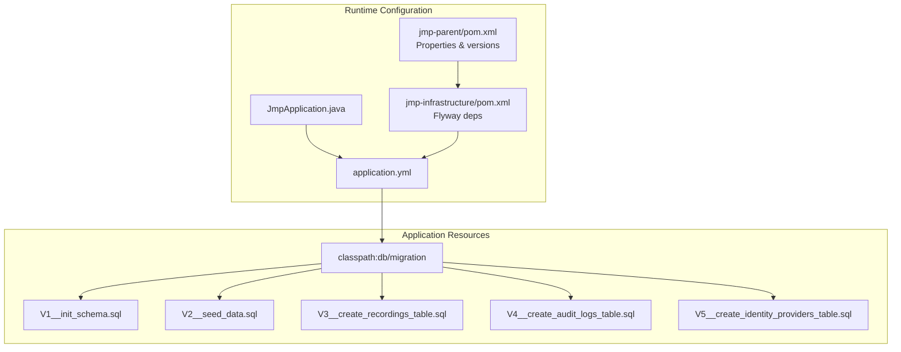
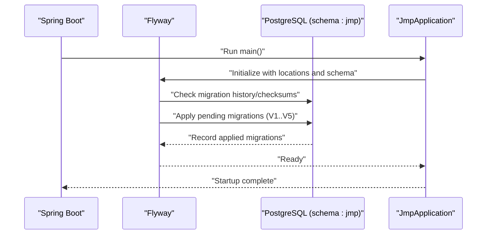
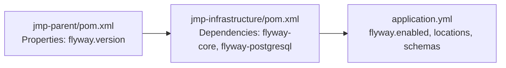
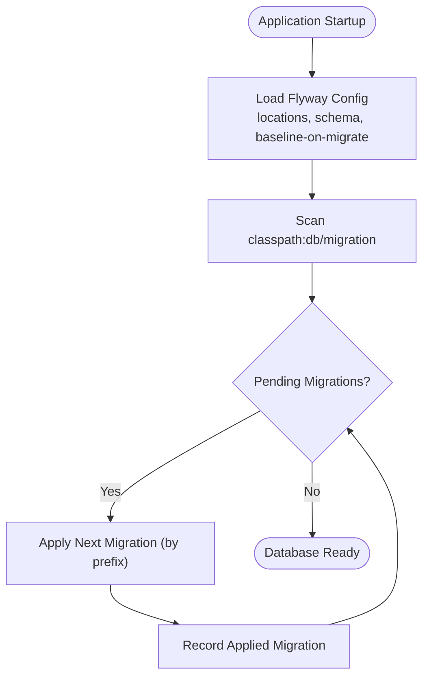

# Migration Management

<cite>
**Referenced Files in This Document**
- [V1__init_schema.sql](file://jmp-web/src/main/resources/db/migration/V1__init_schema.sql)
- [V2__seed_data.sql](file://jmp-web/src/main/resources/db/migration/V2__seed_data.sql)
- [V3__create_recordings_table.sql](file://jmp-web/src/main/resources/db/migration/V3__create_recordings_table.sql)
- [V4__create_audit_logs_table.sql](file://jmp-web/src/main/resources/db/migration/V4__create_audit_logs_table.sql)
- [V5__create_identity_providers_table.sql](file://jmp-web/src/main/resources/db/migration/V5__create_identity_providers_table.sql)
- [application.yml](file://jmp-web/src/main/resources/application.yml)
- [JmpApplication.java](file://jmp-web/src/main/java/com/jmp/web/JmpApplication.java)
- [pom.xml (jmp-infrastructure)](file://jmp-infrastructure/pom.xml)
- [pom.xml (jmp-parent)](file://pom.xml)
</cite>

## Table of Contents
1. [Introduction](#introduction)
2. [Project Structure](#project-structure)
3. [Core Components](#core-components)
4. [Architecture Overview](#architecture-overview)
5. [Detailed Component Analysis](#detailed-component-analysis)
6. [Dependency Analysis](#dependency-analysis)
7. [Performance Considerations](#performance-considerations)
8. [Troubleshooting Guide](#troubleshooting-guide)
9. [Conclusion](#conclusion)
10. [Appendices](#appendices)

## Introduction
This document provides comprehensive migration management guidance for the Flyway-based database versioning system used by the Jitsi Management Platform (JMP). It explains migration file structure, naming conventions, execution order, and lifecycle from development to production. It documents the initial schema and seed data migrations, subsequent feature migrations, and outlines rollback strategies, conflict resolution, and operational best practices. It also covers database initialization, seed data management, and permission/role setup, along with guidelines for extending the migration system safely.

## Project Structure
Flyway migrations are stored under the Spring Boot resources path and loaded via classpath. The application is configured to scan for migrations in the designated location and target a specific schema. The main application class enables JPA repositories and auditing, while the infrastructure module includes Flyway dependencies.

**Diagram sources**
- [application.yml:39-44](file://jmp-web/src/main/resources/application.yml#L39-L44)
- [JmpApplication.java:15-21](file://jmp-web/src/main/java/com/jmp/web/JmpApplication.java#L15-L21)
- [pom.xml (jmp-infrastructure):63-72](file://jmp-infrastructure/pom.xml#L63-L72)
- [pom.xml (jmp-parent):58-67](file://pom.xml#L58-L67)

**Section sources**
- [application.yml:39-44](file://jmp-web/src/main/resources/application.yml#L39-L44)
- [JmpApplication.java:15-21](file://jmp-web/src/main/java/com/jmp/web/JmpApplication.java#L15-L21)
- [pom.xml (jmp-infrastructure):63-72](file://jmp-infrastructure/pom.xml#L63-L72)
- [pom.xml (jmp-parent):58-67](file://pom.xml#L58-L67)

## Core Components
- Flyway configuration: enabled, classpath location, target schema, and baseline-on-migrate behavior.
- Migration files: ordered SQL scripts implementing schema, data, and feature changes.
- Application bootstrap: Spring Boot application class enabling JPA repositories and auditing.

Key behaviors:
- Flyway scans classpath:db/migration for migration files.
- Target schema is jmp.
- Baseline-on-migrate ensures clean startup on uninitialized databases.
- Hibernate DDL is set to validate mode, complementing Flyway-managed schema.

**Section sources**
- [application.yml:39-44](file://jmp-web/src/main/resources/application.yml#L39-L44)
- [JmpApplication.java:15-21](file://jmp-web/src/main/java/com/jmp/web/JmpApplication.java#L15-L21)

## Architecture Overview
Flyway orchestrates database migrations during application startup. The runtime configuration loads migrations from the classpath, applies them against the jmp schema, and ensures the database is aligned with the expected structure and seed data.

**Diagram sources**
- [application.yml:39-44](file://jmp-web/src/main/resources/application.yml#L39-L44)
- [JmpApplication.java:23-25](file://jmp-web/src/main/java/com/jmp/web/JmpApplication.java#L23-L25)

## Detailed Component Analysis

### Migration File Naming and Execution Order
Flyway enforces strict naming and ordering:
- Each migration file is named with a prefix indicating its sequence number followed by a descriptive summary.
- Execution order is determined by the numeric prefix; files are applied in ascending order.
- The current sequence includes five migrations:
  - V1__init_schema.sql
  - V2__seed_data.sql
  - V3__create_recordings_table.sql
  - V4__create_audit_logs_table.sql
  - V5__create_identity_providers_table.sql

Operational implications:
- To add a new migration, choose the next sequential number (e.g., V6__) and ensure it is self-contained and idempotent where applicable.
- Avoid renaming existing files after deployment; create a new migration to adjust structure or data.

**Section sources**
- [V1__init_schema.sql:1-2](file://jmp-web/src/main/resources/db/migration/V1__init_schema.sql#L1-L2)
- [V2__seed_data.sql:1-2](file://jmp-web/src/main/resources/db/migration/V2__seed_data.sql#L1-L2)
- [V3__create_recordings_table.sql:1-2](file://jmp-web/src/main/resources/db/migration/V3__create_recordings_table.sql#L1-L2)
- [V4__create_audit_logs_table.sql:1-2](file://jmp-web/src/main/resources/db/migration/V4__create_audit_logs_table.sql#L1-L2)
- [V5__create_identity_providers_table.sql:1-2](file://jmp-web/src/main/resources/db/migration/V5__create_identity_providers_table.sql#L1-L2)

### V1__init_schema.sql: Initial Schema Creation
Scope:
- Creates the jmp schema and enables UUID generation.
- Defines core entities: tenants, permissions, roles, users, conferences, and conference participants.
- Establishes indexes and comments for clarity and performance.

Key elements:
- Schema creation and UUID extension enable globally unique identifiers.
- Multi-tenant design with tenant-scoped entities.
- RBAC model with permissions and hierarchical roles.
- Conference lifecycle and participant tracking.
- Indexes optimized for common queries and uniqueness constraints.

Best practices derived from structure:
- Use UUID primary keys for global uniqueness.
- Apply tenant scoping via foreign keys to tenants.
- Add indexes on frequently filtered or joined columns.
- Use JSONB for flexible configuration and metadata.

**Section sources**
- [V1__init_schema.sql:4-30](file://jmp-web/src/main/resources/db/migration/V1__init_schema.sql#L4-L30)
- [V1__init_schema.sql:32-54](file://jmp-web/src/main/resources/db/migration/V1__init_schema.sql#L32-L54)
- [V1__init_schema.sql:63-87](file://jmp-web/src/main/resources/db/migration/V1__init_schema.sql#L63-L87)
- [V1__init_schema.sql:89-119](file://jmp-web/src/main/resources/db/migration/V1__init_schema.sql#L89-L119)
- [V1__init_schema.sql:121-139](file://jmp-web/src/main/resources/db/migration/V1__init_schema.sql#L121-L139)
- [V1__init_schema.sql:141-172](file://jmp-web/src/main/resources/db/migration/V1__init_schema.sql#L141-L172)

### V2__seed_data.sql: System Data Initialization
Scope:
- Seeds default tenant, system permissions, system roles, and default users.
- Assigns role-permission mappings for different administrative tiers.
- Provides default admin and tenant admin accounts with hashed passwords.

Operational notes:
- Uses predefined UUIDs for system entities to ensure deterministic behavior.
- Role-permission assignments reflect a layered access model (super admin, tenant admin, moderator, participant, auditor).
- Default users are created with verified status and hashed passwords.

Security and maintenance:
- Keep seed data minimal and deterministic.
- Avoid embedding secrets in migrations; use environment variables or secure secret stores in production.

**Section sources**
- [V2__seed_data.sql:4-11](file://jmp-web/src/main/resources/db/migration/V2__seed_data.sql#L4-L11)
- [V2__seed_data.sql:13-40](file://jmp-web/src/main/resources/db/migration/V2__seed_data.sql#L13-L40)
- [V2__seed_data.sql:42-95](file://jmp-web/src/main/resources/db/migration/V2__seed_data.sql#L42-L95)
- [V2__seed_data.sql:97-131](file://jmp-web/src/main/resources/db/migration/V2__seed_data.sql#L97-L131)

### V3__create_recordings_table.sql: Recordings Feature
Scope:
- Adds a dedicated table for conference recordings with metadata, retention, encryption, and indexing.
- Includes tenant scoping and foreign key relationships to conferences and tenants.

Indexing strategy:
- Optimized indexes for filtering by status, tenant, and creation time.
- Composite indexes for common analytical queries.

**Section sources**
- [V3__create_recordings_table.sql:4-31](file://jmp-web/src/main/resources/db/migration/V3__create_recordings_table.sql#L4-L31)
- [V3__create_recordings_table.sql:33-42](file://jmp-web/src/main/resources/db/migration/V3__create_recordings_table.sql#L33-L42)

### V4__create_audit_logs_table.sql: Audit Trail
Scope:
- Introduces audit logging for system events with fields for user, tenant, IP, user agent, and severity.
- Includes indexes for efficient querying by tenant, user, event type, and failure tracking.

**Section sources**
- [V4__create_audit_logs_table.sql:4-23](file://jmp-web/src/main/resources/db/migration/V4__create_audit_logs_table.sql#L4-L23)
- [V4__create_audit_logs_table.sql:25-35](file://jmp-web/src/main/resources/db/migration/V4__create_audit_logs_table.sql#L25-L35)

### V5__create_identity_providers_table.sql: Identity Providers
Scope:
- Adds identity providers table for SSO/OIDC configuration per tenant.
- Extends users table with columns for external authentication identifiers.
- Includes indexes and a unique constraint for tenant+name.

**Section sources**
- [V5__create_identity_providers_table.sql:4-27](file://jmp-web/src/main/resources/db/migration/V5__create_identity_providers_table.sql#L4-L27)
- [V5__create_identity_providers_table.sql:29-37](file://jmp-web/src/main/resources/db/migration/V5__create_identity_providers_table.sql#L29-L37)
- [V5__create_identity_providers_table.sql:39-44](file://jmp-web/src/main/resources/db/migration/V5__create_identity_providers_table.sql#L39-L44)

### Migration Lifecycle: Development to Production
- Development: Create new migration files with the next sequential prefix. Keep changes small, reversible where possible, and fully self-contained.
- Testing: Run migrations locally and in staging environments using Flyway’s validation and dry-run capabilities. Verify schema alignment and data integrity.
- Production: Coordinate rollouts during maintenance windows. Prefer zero-downtime changes; if downtime is required, schedule carefully and communicate impact.
- Rollback: Use Flyway repair or rollback-to-specific-version strategies. Maintain backward compatibility where feasible and document rollback procedures.

[No sources needed since this section provides general guidance]

### Rollback Strategies and Conflict Resolution
- Rollback to a previous version: Use Flyway’s rollback commands to revert to a known good version, then re-apply corrected migrations.
- Conflicts: If checksum mismatches occur, use repair to reconcile differences caused by accidental local changes. Ensure team discipline around migration immutability.
- Manual intervention: For complex scenarios, pause Flyway, apply manual fixes, and then mark the migration as resolved using repair or create a compensating migration.

[No sources needed since this section provides general guidance]

### Database Initialization, Seed Data, and Permissions
- Initialization: Flyway creates the jmp schema and applies V1, ensuring the base structure exists.
- Seed data: V2 seeds default tenant, permissions, roles, and users, establishing baseline access control.
- Permissions and roles: Role-permission mappings define access tiers; maintain these mappings carefully and avoid hardcoding UUIDs outside of controlled seed files.

**Section sources**
- [application.yml:39-44](file://jmp-web/src/main/resources/application.yml#L39-L44)
- [V1__init_schema.sql:4-8](file://jmp-web/src/main/resources/db/migration/V1__init_schema.sql#L4-L8)
- [V2__seed_data.sql:4-11](file://jmp-web/src/main/resources/db/migration/V2__seed_data.sql#L4-L11)
- [V2__seed_data.sql:42-95](file://jmp-web/src/main/resources/db/migration/V2__seed_data.sql#L42-L95)

### Best Practices for Writing New Migrations
- Idempotency: Use “IF NOT EXISTS” checks for schema objects and defensive inserts/upserts.
- Atomicity: Group related changes in a single migration; avoid partial changes across multiple files.
- Names and comments: Use clear prefixes and descriptive summaries; add comments to explain intent and constraints.
- Indexes: Add indexes early for performance-sensitive columns; review query patterns regularly.
- Validation: Test migrations on clean databases and verify with both unit and integration tests.

[No sources needed since this section provides general guidance]

### Testing Migration Scripts
- Local testing: Apply migrations to a local Postgres instance and verify schema and data.
- Staging validation: Use Flyway’s validation mode to compare expected vs. actual schema.
- Regression checks: Include automated tests that verify critical queries and constraints after applying migrations.

[No sources needed since this section provides general guidance]

### Production Deployment Guidance
- Environment parity: Ensure dev/stage/prod share the same Flyway configuration and schema.
- Zero-downtime: Prefer additive-only changes; if destructive changes are necessary, plan carefully and coordinate with stakeholders.
- Monitoring: Monitor migration execution logs and database performance post-deploy.

[No sources needed since this section provides general guidance]

## Dependency Analysis
Flyway is included via the infrastructure module’s dependency management and is enabled in the application configuration. The parent POM defines Flyway version and other dependency versions.

**Diagram sources**
- [pom.xml (jmp-parent):58-67](file://pom.xml#L58-L67)
- [pom.xml (jmp-infrastructure):63-72](file://jmp-infrastructure/pom.xml#L63-L72)
- [application.yml:39-44](file://jmp-web/src/main/resources/application.yml#L39-L44)

**Section sources**
- [pom.xml (jmp-parent):58-67](file://pom.xml#L58-L67)
- [pom.xml (jmp-infrastructure):63-72](file://jmp-infrastructure/pom.xml#L63-L72)
- [application.yml:39-44](file://jmp-web/src/main/resources/application.yml#L39-L44)

## Performance Considerations
- Indexes: The schema includes numerous indexes tailored to common filters and joins. Ensure new migrations add indexes for performance-sensitive columns.
- JSONB fields: Use JSONB for flexible configuration; consider normalization if queries become complex.
- UUIDs: UUID primary keys are supported by the schema; ensure appropriate indexing and consider partitioning for very large tables.

[No sources needed since this section provides general guidance]

## Troubleshooting Guide
Common issues and resolutions:
- Migration fails due to checksum mismatch: Use repair to reconcile differences; avoid editing applied migrations.
- Schema errors on startup: Validate the jmp schema exists and is accessible; confirm Flyway locations and schema configuration.
- Data seeding conflicts: Ensure seed migrations are idempotent and deterministic; avoid changing predefined UUIDs.

[No sources needed since this section provides general guidance]

## Conclusion
The JMP project uses Flyway to manage database evolution through a clear, ordered set of migrations. By adhering to naming conventions, maintaining idempotent and atomic migrations, and following disciplined testing and deployment practices, teams can safely evolve the schema and data over time. The current migration set establishes a robust foundation for tenants, users, conferences, recordings, audit logs, and identity providers, with clear pathways for future enhancements.

[No sources needed since this section summarizes without analyzing specific files]

## Appendices

### Appendix A: Migration Execution Flow

**Diagram sources**
- [application.yml:39-44](file://jmp-web/src/main/resources/application.yml#L39-L44)