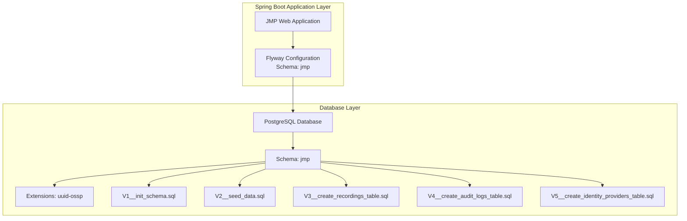
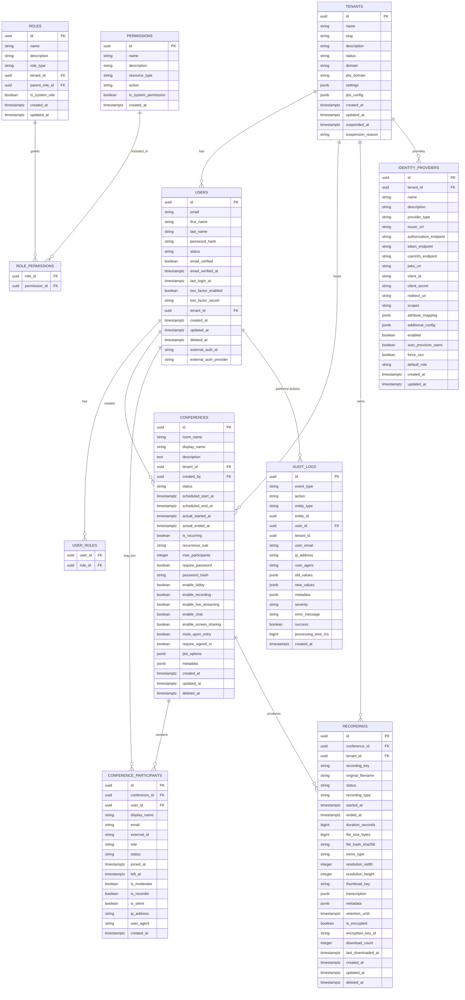
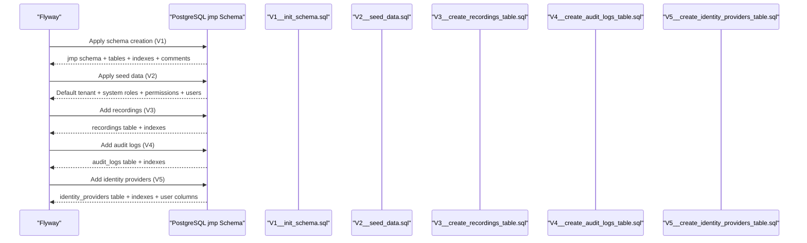
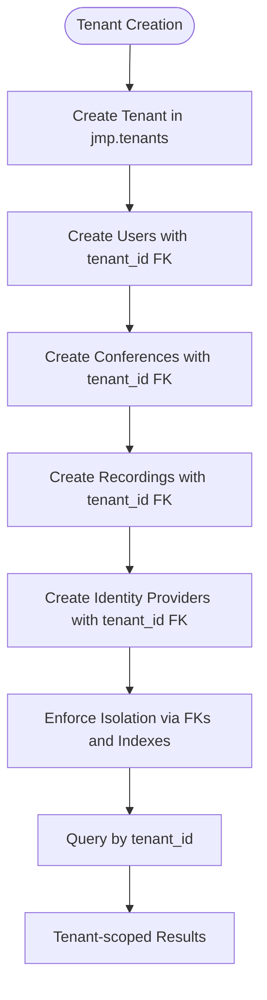
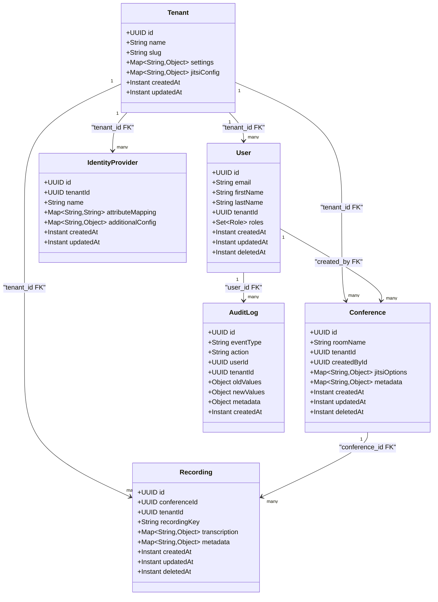
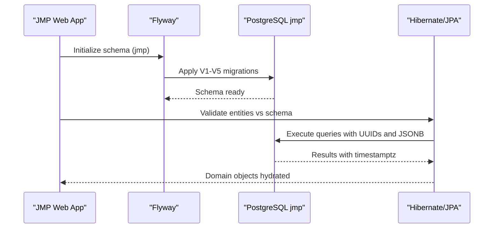
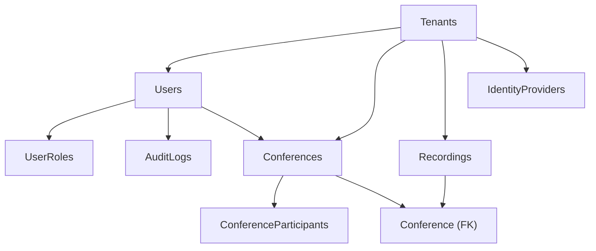

# Schema Overview

<cite>
**Referenced Files in This Document**
- [V1__init_schema.sql](file://jmp-web/src/main/resources/db/migration/V1__init_schema.sql)
- [V2__seed_data.sql](file://jmp-web/src/main/resources/db/migration/V2__seed_data.sql)
- [V3__create_recordings_table.sql](file://jmp-web/src/main/resources/db/migration/V3__create_recordings_table.sql)
- [V4__create_audit_logs_table.sql](file://jmp-web/src/main/resources/db/migration/V4__create_audit_logs_table.sql)
- [V5__create_identity_providers_table.sql](file://jmp-web/src/main/resources/db/migration/V5__create_identity_providers_table.sql)
- [application.yml](file://jmp-web/src/main/resources/application.yml)
- [Tenant.java](file://jmp-domain/src/main/java/com/jmp/domain/entity/Tenant.java)
- [User.java](file://jmp-domain/src/main/java/com/jmp/domain/entity/User.java)
- [Conference.java](file://jmp-domain/src/main/java/com/jmp/domain/entity/Conference.java)
- [ConferenceParticipant.java](file://jmp-domain/src/main/java/com/jmp/domain/entity/ConferenceParticipant.java)
- [Role.java](file://jmp-domain/src/main/java/com/jmp/domain/entity/Role.java)
- [Permission.java](file://jmp-domain/src/main/java/com/jmp/domain/entity/Permission.java)
- [Recording.java](file://jmp-domain/src/main/java/com/jmp/domain/entity/Recording.java)
- [AuditLog.java](file://jmp-domain/src/main/java/com/jmp/domain/entity/AuditLog.java)
- [IdentityProvider.java](file://jmp-domain/src/main/java/com/jmp/domain/entity/IdentityProvider.java)
</cite>

## Table of Contents
1. [Introduction](#introduction)
2. [Project Structure](#project-structure)
3. [Core Components](#core-components)
4. [Architecture Overview](#architecture-overview)
5. [Detailed Component Analysis](#detailed-component-analysis)
6. [Dependency Analysis](#dependency-analysis)
7. [Performance Considerations](#performance-considerations)
8. [Troubleshooting Guide](#troubleshooting-guide)
9. [Conclusion](#conclusion)

## Introduction
This document provides a comprehensive schema overview for the Jitsi Management Platform (JMP) database. It explains the jmp schema namespace, the UUID-based primary key strategy, PostgreSQL-specific features such as the uuid-ossp extension, and the multi-tenant architecture with tenant isolation patterns. It also documents the core entity relationships, database initialization process, schema creation order, and the rationale behind using UUIDs instead of auto-incrementing integers. The document outlines data model design principles, constraint enforcement, indexing strategy, JSONB usage for flexible configuration storage, and the timestamp with timezone approach for global consistency. Finally, it presents a high-level view of the database topology and its relationship to the Spring Boot application layer.

## Project Structure
The database schema is managed via Flyway migrations under the jmp-web module. The schema namespace is jmp, and migrations are applied in versioned order. The Spring Boot application is configured to use this schema and applies Hibernate DDL validation against the schema.

**Diagram sources**
- [application.yml:39-44](file://jmp-web/src/main/resources/application.yml#L39-L44)
- [V1__init_schema.sql:4-8](file://jmp-web/src/main/resources/db/migration/V1__init_schema.sql#L4-L8)
- [V2__seed_data.sql:1-131](file://jmp-web/src/main/resources/db/migration/V2__seed_data.sql#L1-L131)
- [V3__create_recordings_table.sql:1-43](file://jmp-web/src/main/resources/db/migration/V3__create_recordings_table.sql#L1-L43)
- [V4__create_audit_logs_table.sql:1-36](file://jmp-web/src/main/resources/db/migration/V4__create_audit_logs_table.sql#L1-L36)
- [V5__create_identity_providers_table.sql:1-45](file://jmp-web/src/main/resources/db/migration/V5__create_identity_providers_table.sql#L1-L45)

**Section sources**
- [application.yml:39-44](file://jmp-web/src/main/resources/application.yml#L39-L44)
- [V1__init_schema.sql:4-8](file://jmp-web/src/main/resources/db/migration/V1__init_schema.sql#L4-L8)

## Core Components
This section summarizes the core entities and their roles in the jmp schema, highlighting tenant isolation, UUID primary keys, JSONB columns, and timestamps with time zone.

- Tenants: Organization/tenant container with quotas and settings. UUID primary key, tenant-scoped isolation enforced by foreign keys and indexes.
- Users: Tenant-scoped identities with role memberships and optional external auth identifiers. UUID primary key, soft-deleted via deleted_at.
- Roles and Permissions: RBAC with hierarchical roles and system/global permissions. Junction table role_permissions links roles to permissions.
- Conferences: Jitsi conference rooms with scheduling, participant controls, and JSONB metadata. UUID primary key, tenant-scoped.
- Conference Participants: Tracks participant joins, roles, and metadata. UUID primary key, optional association to users.
- Recordings: Conference recordings with storage metadata, encryption flags, and retention policies. UUID primary key, tenant-scoped.
- Audit Logs: Event logging with JSONB payloads for old/new values and metadata. UUID primary key, tenant-scoped.
- Identity Providers: SSO/OIDC configurations per tenant with JSONB attribute mapping and additional config. UUID primary key, tenant-scoped.

**Section sources**
- [Tenant.java:24-174](file://jmp-domain/src/main/java/com/jmp/domain/entity/Tenant.java#L24-L174)
- [User.java:23-164](file://jmp-domain/src/main/java/com/jmp/domain/entity/User.java#L23-L164)
- [Role.java:22-131](file://jmp-domain/src/main/java/com/jmp/domain/entity/Role.java#L22-L131)
- [Permission.java:18-128](file://jmp-domain/src/main/java/com/jmp/domain/entity/Permission.java#L18-L128)
- [Conference.java:25-217](file://jmp-domain/src/main/java/com/jmp/domain/entity/Conference.java#L25-L217)
- [ConferenceParticipant.java:18-150](file://jmp-domain/src/main/java/com/jmp/domain/entity/ConferenceParticipant.java#L18-L150)
- [Recording.java:24-203](file://jmp-domain/src/main/java/com/jmp/domain/entity/Recording.java#L24-L203)
- [AuditLog.java:20-136](file://jmp-domain/src/main/java/com/jmp/domain/entity/AuditLog.java#L20-L136)
- [IdentityProvider.java:23-158](file://jmp-domain/src/main/java/com/jmp/domain/entity/IdentityProvider.java#L23-L158)

## Architecture Overview
The database architecture follows a multi-tenant design with strict tenant isolation enforced by foreign keys and indexes. All primary keys are UUIDs to support distributed generation and secure sharing. PostgreSQL-specific features include the uuid-ossp extension for UUID generation defaults and JSONB columns for flexible configuration storage. Timestamps use time zone-aware types for global consistency.

**Diagram sources**
- [V1__init_schema.sql:10-172](file://jmp-web/src/main/resources/db/migration/V1__init_schema.sql#L10-L172)
- [V3__create_recordings_table.sql:4-43](file://jmp-web/src/main/resources/db/migration/V3__create_recordings_table.sql#L4-L43)
- [V4__create_audit_logs_table.sql:4-36](file://jmp-web/src/main/resources/db/migration/V4__create_audit_logs_table.sql#L4-L36)
- [V5__create_identity_providers_table.sql:4-45](file://jmp-web/src/main/resources/db/migration/V5__create_identity_providers_table.sql#L4-L45)
- [Tenant.java:24-174](file://jmp-domain/src/main/java/com/jmp/domain/entity/Tenant.java#L24-L174)
- [User.java:23-164](file://jmp-domain/src/main/java/com/jmp/domain/entity/User.java#L23-L164)
- [Role.java:22-131](file://jmp-domain/src/main/java/com/jmp/domain/entity/Role.java#L22-L131)
- [Permission.java:18-128](file://jmp-domain/src/main/java/com/jmp/domain/entity/Permission.java#L18-L128)
- [Conference.java:25-217](file://jmp-domain/src/main/java/com/jmp/domain/entity/Conference.java#L25-L217)
- [ConferenceParticipant.java:18-150](file://jmp-domain/src/main/java/com/jmp/domain/entity/ConferenceParticipant.java#L18-L150)
- [Recording.java:24-203](file://jmp-domain/src/main/java/com/jmp/domain/entity/Recording.java#L24-L203)
- [AuditLog.java:20-136](file://jmp-domain/src/main/java/com/jmp/domain/entity/AuditLog.java#L20-L136)
- [IdentityProvider.java:23-158](file://jmp-domain/src/main/java/com/jmp/domain/entity/IdentityProvider.java#L23-L158)

## Detailed Component Analysis

### Schema Initialization and Migration Order
The schema is initialized and evolved through ordered Flyway migrations under the jmp schema. The sequence ensures proper creation of tables, indexes, comments, and seed data.

**Diagram sources**
- [application.yml:39-44](file://jmp-web/src/main/resources/application.yml#L39-L44)
- [V1__init_schema.sql:4-172](file://jmp-web/src/main/resources/db/migration/V1__init_schema.sql#L4-L172)
- [V2__seed_data.sql:1-131](file://jmp-web/src/main/resources/db/migration/V2__seed_data.sql#L1-L131)
- [V3__create_recordings_table.sql:1-43](file://jmp-web/src/main/resources/db/migration/V3__create_recordings_table.sql#L1-L43)
- [V4__create_audit_logs_table.sql:1-36](file://jmp-web/src/main/resources/db/migration/V4__create_audit_logs_table.sql#L1-L36)
- [V5__create_identity_providers_table.sql:1-45](file://jmp-web/src/main/resources/db/migration/V5__create_identity_providers_table.sql#L1-L45)

**Section sources**
- [application.yml:39-44](file://jmp-web/src/main/resources/application.yml#L39-L44)
- [V1__init_schema.sql:4-172](file://jmp-web/src/main/resources/db/migration/V1__init_schema.sql#L4-L172)
- [V2__seed_data.sql:1-131](file://jmp-web/src/main/resources/db/migration/V2__seed_data.sql#L1-L131)
- [V3__create_recordings_table.sql:1-43](file://jmp-web/src/main/resources/db/migration/V3__create_recordings_table.sql#L1-L43)
- [V4__create_audit_logs_table.sql:1-36](file://jmp-web/src/main/resources/db/migration/V4__create_audit_logs_table.sql#L1-L36)
- [V5__create_identity_providers_table.sql:1-45](file://jmp-web/src/main/resources/db/migration/V5__create_identity_providers_table.sql#L1-L45)

### Multi-Tenant Architecture and Tenant Isolation
Tenant isolation is achieved through:
- Foreign key constraints linking users, conferences, recordings, identity providers, and roles to tenants.
- Indexes on tenant-scoped columns to optimize queries.
- Soft-deletion patterns using deleted_at timestamps to maintain referential integrity while allowing logical deletion.
- Unique constraints scoped to tenant (e.g., unique room_name per tenant).

**Diagram sources**
- [V1__init_schema.sql:10-172](file://jmp-web/src/main/resources/db/migration/V1__init_schema.sql#L10-L172)
- [V3__create_recordings_table.sql:4-43](file://jmp-web/src/main/resources/db/migration/V3__create_recordings_table.sql#L4-L43)
- [V5__create_identity_providers_table.sql:4-45](file://jmp-web/src/main/resources/db/migration/V5__create_identity_providers_table.sql#L4-L45)
- [Tenant.java:24-174](file://jmp-domain/src/main/java/com/jmp/domain/entity/Tenant.java#L24-L174)
- [User.java:23-164](file://jmp-domain/src/main/java/com/jmp/domain/entity/User.java#L23-L164)
- [Conference.java:25-217](file://jmp-domain/src/main/java/com/jmp/domain/entity/Conference.java#L25-L217)
- [Recording.java:24-203](file://jmp-domain/src/main/java/com/jmp/domain/entity/Recording.java#L24-L203)
- [IdentityProvider.java:23-158](file://jmp-domain/src/main/java/com/jmp/domain/entity/IdentityProvider.java#L23-L158)

**Section sources**
- [V1__init_schema.sql:141-164](file://jmp-web/src/main/resources/db/migration/V1__init_schema.sql#L141-L164)
- [V3__create_recordings_table.sql:33-40](file://jmp-web/src/main/resources/db/migration/V3__create_recordings_table.sql#L33-L40)
- [V4__create_audit_logs_table.sql:25-32](file://jmp-web/src/main/resources/db/migration/V4__create_audit_logs_table.sql#L25-L32)
- [V5__create_identity_providers_table.sql:29-34](file://jmp-web/src/main/resources/db/migration/V5__create_identity_providers_table.sql#L29-L34)

### UUID Strategy and Rationale
UUIDs are used as primary keys across all entities:
- Generation defaults in SQL leverage PostgreSQL extensions for deterministic defaults.
- UUIDs enable secure sharing of identifiers, distributed generation, and simplified cross-service joins.
- The Spring Data JPA configuration uses UUID generation strategies aligned with the database defaults.

**Diagram sources**
- [V1__init_schema.sql:11-30](file://jmp-web/src/main/resources/db/migration/V1__init_schema.sql#L11-L30)
- [V3__create_recordings_table.sql:5-31](file://jmp-web/src/main/resources/db/migration/V3__create_recordings_table.sql#L5-L31)
- [V4__create_audit_logs_table.sql:5-23](file://jmp-web/src/main/resources/db/migration/V4__create_audit_logs_table.sql#L5-L23)
- [V5__create_identity_providers_table.sql:5-27](file://jmp-web/src/main/resources/db/migration/V5__create_identity_providers_table.sql#L5-L27)
- [Tenant.java:31-34](file://jmp-domain/src/main/java/com/jmp/domain/entity/Tenant.java#L31-L34)
- [User.java:30-33](file://jmp-domain/src/main/java/com/jmp/domain/entity/User.java#L30-L33)
- [Conference.java:32-35](file://jmp-domain/src/main/java/com/jmp/domain/entity/Conference.java#L32-L35)
- [Recording.java:31-34](file://jmp-domain/src/main/java/com/jmp/domain/entity/Recording.java#L31-L34)
- [AuditLog.java:27-30](file://jmp-domain/src/main/java/com/jmp/domain/entity/AuditLog.java#L27-L30)
- [IdentityProvider.java:30-33](file://jmp-domain/src/main/java/com/jmp/domain/entity/IdentityProvider.java#L30-L33)

**Section sources**
- [V1__init_schema.sql:7-8](file://jmp-web/src/main/resources/db/migration/V1__init_schema.sql#L7-L8)
- [V1__init_schema.sql:11-30](file://jmp-web/src/main/resources/db/migration/V1__init_schema.sql#L11-L30)
- [V3__create_recordings_table.sql:5](file://jmp-web/src/main/resources/db/migration/V3__create_recordings_table.sql#L5)
- [V4__create_audit_logs_table.sql:5](file://jmp-web/src/main/resources/db/migration/V4__create_audit_logs_table.sql#L5)
- [V5__create_identity_providers_table.sql:5](file://jmp-web/src/main/resources/db/migration/V5__create_identity_providers_table.sql#L5)
- [Tenant.java:31-34](file://jmp-domain/src/main/java/com/jmp/domain/entity/Tenant.java#L31-L34)
- [User.java:30-33](file://jmp-domain/src/main/java/com/jmp/domain/entity/User.java#L30-L33)
- [Conference.java:32-35](file://jmp-domain/src/main/java/com/jmp/domain/entity/Conference.java#L32-L35)
- [Recording.java:31-34](file://jmp-domain/src/main/java/com/jmp/domain/entity/Recording.java#L31-L34)
- [AuditLog.java:27-30](file://jmp-domain/src/main/java/com/jmp/domain/entity/AuditLog.java#L27-L30)
- [IdentityProvider.java:30-33](file://jmp-domain/src/main/java/com/jmp/domain/entity/IdentityProvider.java#L30-L33)

### Data Model Design Principles and Constraints
- Primary Keys: All entities use UUIDs for global uniqueness and distributed generation.
- Foreign Keys: Strict tenant and entity relationships enforce referential integrity.
- Unique Constraints: Unique indexes on tenant-scoped fields (e.g., room_name + tenant_id).
- Soft Deletion: deleted_at timestamps allow logical deletion without breaking FKs.
- JSONB Columns: Flexible configuration storage for settings, metadata, and dynamic attributes.
- Timestamps with Time Zone: Consistent global timekeeping across deployments.

**Section sources**
- [V1__init_schema.sql:160-164](file://jmp-web/src/main/resources/db/migration/V1__init_schema.sql#L160-L164)
- [V1__init_schema.sql:24-25](file://jmp-web/src/main/resources/db/migration/V1__init_schema.sql#L24-L25)
- [V3__create_recordings_table.sql:21-22](file://jmp-web/src/main/resources/db/migration/V3__create_recordings_table.sql#L21-L22)
- [V4__create_audit_logs_table.sql:15-17](file://jmp-web/src/main/resources/db/migration/V4__create_audit_logs_table.sql#L15-L17)
- [V5__create_identity_providers_table.sql:19-20](file://jmp-web/src/main/resources/db/migration/V5__create_identity_providers_table.sql#L19-L20)

### Index Strategy
Indexes are strategically placed to optimize tenant-scoped queries and common filters:
- Users: email, tenant_id, status (with deleted_at filter), plus soft-delete index.
- Tenants: slug, domain, status.
- Conferences: tenant_id, status, created_by, scheduled range, room_name+tenant_id (unique when not deleted).
- Conference Participants: conference_id, user_id, status.
- Recordings: conference_id, tenant_id, status, retention_until, created_at desc, tenant+status.
- Audit Logs: tenant_id, user_id, event_type, entity_type+entity_id, created_at desc, tenant+created_at, success=false.
- Identity Providers: tenant_id, enabled, tenant+name unique.

**Section sources**
- [V1__init_schema.sql:141-159](file://jmp-web/src/main/resources/db/migration/V1__init_schema.sql#L141-L159)
- [V3__create_recordings_table.sql:33-40](file://jmp-web/src/main/resources/db/migration/V3__create_recordings_table.sql#L33-L40)
- [V4__create_audit_logs_table.sql:25-32](file://jmp-web/src/main/resources/db/migration/V4__create_audit_logs_table.sql#L25-L32)
- [V5__create_identity_providers_table.sql:29-34](file://jmp-web/src/main/resources/db/migration/V5__create_identity_providers_table.sql#L29-L34)

### JSONB Usage for Flexible Configuration
JSONB columns are used for:
- Tenant settings and Jitsi-specific configuration.
- Conference jitsi_options and metadata.
- Recording transcription and metadata.
- Audit log old_values, new_values, and metadata.
- Identity provider attribute_mapping and additional_config.

This enables dynamic configuration without altering schema migrations and supports evolving feature sets.

**Section sources**
- [V1__init_schema.sql:24-25](file://jmp-web/src/main/resources/db/migration/V1__init_schema.sql#L24-L25)
- [V1__init_schema.sql:114-115](file://jmp-web/src/main/resources/db/migration/V1__init_schema.sql#L114-L115)
- [V3__create_recordings_table.sql:21-22](file://jmp-web/src/main/resources/db/migration/V3__create_recordings_table.sql#L21-L22)
- [V4__create_audit_logs_table.sql:15-17](file://jmp-web/src/main/resources/db/migration/V4__create_audit_logs_table.sql#L15-L17)
- [V5__create_identity_providers_table.sql:19-20](file://jmp-web/src/main/resources/db/migration/V5__create_identity_providers_table.sql#L19-L20)

### Timestamp with Time Zone Approach
All temporal fields use time zone-aware timestamps to ensure consistent ordering and comparisons across deployments in different time zones. Defaults leverage CURRENT_TIMESTAMP and NOW() to capture accurate creation/update times.

**Section sources**
- [V1__init_schema.sql:26-29](file://jmp-web/src/main/resources/db/migration/V1__init_schema.sql#L26-L29)
- [V1__init_schema.sql:98-118](file://jmp-web/src/main/resources/db/migration/V1__init_schema.sql#L98-L118)
- [V3__create_recordings_table.sql:12-29](file://jmp-web/src/main/resources/db/migration/V3__create_recordings_table.sql#L12-L29)
- [V4__create_audit_logs_table.sql:22](file://jmp-web/src/main/resources/db/migration/V4__create_audit_logs_table.sql#L22)
- [V5__create_identity_providers_table.sql:25-26](file://jmp-web/src/main/resources/db/migration/V5__create_identity_providers_table.sql#L25-L26)

### Spring Boot Application Integration
The Spring Boot application integrates with the database via:
- JDBC connection to PostgreSQL.
- Flyway migration management targeting the jmp schema.
- Hibernate JPA with PostgreSQL dialect and DDL validation.
- Jackson configuration for date serialization and time zone handling.

**Diagram sources**
- [application.yml:12-44](file://jmp-web/src/main/resources/application.yml#L12-L44)
- [application.yml:57-62](file://jmp-web/src/main/resources/application.yml#L57-L62)
- [V1__init_schema.sql:4-8](file://jmp-web/src/main/resources/db/migration/V1__init_schema.sql#L4-L8)

**Section sources**
- [application.yml:12-44](file://jmp-web/src/main/resources/application.yml#L12-L44)
- [application.yml:57-62](file://jmp-web/src/main/resources/application.yml#L57-L62)

## Dependency Analysis
This section maps the dependencies among core entities and how they relate to the schema design.

**Diagram sources**
- [V1__init_schema.sql:10-172](file://jmp-web/src/main/resources/db/migration/V1__init_schema.sql#L10-L172)
- [V3__create_recordings_table.sql:4-43](file://jmp-web/src/main/resources/db/migration/V3__create_recordings_table.sql#L4-L43)
- [V4__create_audit_logs_table.sql:4-36](file://jmp-web/src/main/resources/db/migration/V4__create_audit_logs_table.sql#L4-L36)
- [V5__create_identity_providers_table.sql:4-45](file://jmp-web/src/main/resources/db/migration/V5__create_identity_providers_table.sql#L4-L45)

**Section sources**
- [V1__init_schema.sql:43-87](file://jmp-web/src/main/resources/db/migration/V1__init_schema.sql#L43-L87)
- [V3__create_recordings_table.sql:5-6](file://jmp-web/src/main/resources/db/migration/V3__create_recordings_table.sql#L5-L6)
- [V4__create_audit_logs_table.sql:10](file://jmp-web/src/main/resources/db/migration/V4__create_audit_logs_table.sql#L10)
- [V5__create_identity_providers_table.sql:6](file://jmp-web/src/main/resources/db/migration/V5__create_identity_providers_table.sql#L6)

## Performance Considerations
- UUID primary keys: Ensure appropriate indexing and consider partitioning strategies for very large datasets.
- JSONB queries: Use GIN indexes judiciously for frequent filtering on nested fields; avoid over-indexing.
- Soft-deleted rows: Filter by deleted_at in queries to prevent scanning tombstoned records.
- Time zone timestamps: Prefer indexed ranges on scheduled_start_at/scheduled_end_at and retention_until for efficient reporting.
- Batch operations: Leverage Hibernate batch settings to reduce round trips during bulk inserts/updates.

## Troubleshooting Guide
Common issues and resolutions:
- Migration failures: Verify jmp schema exists and uuid-ossp extension is available; check Flyway locations and baseline settings.
- UUID generation mismatches: Confirm database defaults align with JPA strategies; ensure consistent generation across environments.
- JSONB parsing errors: Validate JSONB payloads and ensure proper encoding; avoid storing malformed JSON.
- Time zone inconsistencies: Ensure application and database time zone settings are aligned; use timestamptz consistently.
- Index performance: Monitor slow queries and add missing indexes on tenant-scoped filters; remove unused indexes.

**Section sources**
- [application.yml:39-44](file://jmp-web/src/main/resources/application.yml#L39-L44)
- [V1__init_schema.sql:7-8](file://jmp-web/src/main/resources/db/migration/V1__init_schema.sql#L7-L8)
- [V1__init_schema.sql:141-159](file://jmp-web/src/main/resources/db/migration/V1__init_schema.sql#L141-L159)

## Conclusion
The Jitsi Management Platform employs a robust, multi-tenant database schema built on PostgreSQL with the jmp namespace. UUID primary keys, JSONB flexibility, and time zone-aware timestamps form the backbone of a scalable and globally consistent design. Tenant isolation is enforced through foreign keys and indexes, while Flyway migrations ensure controlled evolution. The Spring Boot application integrates seamlessly with the schema via Flyway and Hibernate, supporting the platform’s administrative, conferencing, and auditing needs.