# Database Migrations

<cite>
**Referenced Files in This Document**
- [V1__init_schema.sql](file://jmp-web/src/main/resources/db/migration/V1__init_schema.sql)
- [V2__seed_data.sql](file://jmp-web/src/main/resources/db/migration/V2__seed_data.sql)
- [V3__create_recordings_table.sql](file://jmp-web/src/main/resources/db/migration/V3__create_recordings_table.sql)
- [V4__create_audit_logs_table.sql](file://jmp-web/src/main/resources/db/migration/V4__create_audit_logs_table.sql)
- [V5__create_identity_providers_table.sql](file://jmp-web/src/main/resources/db/migration/V5__create_identity_providers_table.sql)
- [V6__add_conference_type.sql](file://jmp-web/src/main/resources/db/migration/V6__add_conference_type.sql)
- [V7__update_tenant_jitsi_domain.sql](file://jmp-web/src/main/resources/db/migration/V7__update_tenant_jitsi_domain.sql)
- [V8__add_test_users.sql](file://jmp-web/src/main/resources/db/migration/V8__add_test_users.sql)
- [application.yml](file://jmp-web/src/main/resources/application.yml)
- [JmpApplication.java](file://jmp-web/src/main/java/com/jmp/web/JmpApplication.java)
- [pom.xml](file://jmp-infrastructure/pom.xml)
</cite>

## Update Summary
**Changes Made**
- Added documentation for V8__add_test_users.sql migration
- Updated migration execution flow to include V8
- Enhanced data seeding strategy documentation
- Updated role-based access control section to reflect comprehensive test user coverage

## Table of Contents
1. [Introduction](#introduction)
2. [Migration Architecture](#migration-architecture)
3. [Schema Evolution](#schema-evolution)
4. [Migration Execution Flow](#migration-execution-flow)
5. [Data Seeding Strategy](#data-seeding-strategy)
6. [Performance Considerations](#performance-considerations)
7. [Migration Best Practices](#migration-best-practices)
8. [Troubleshooting Guide](#troubleshooting-guide)
9. [Conclusion](#conclusion)

## Introduction

The Jitsi Management Platform (JMP) employs a comprehensive database migration strategy using Flyway to manage schema evolution and data initialization. This documentation covers the complete migration lifecycle, from initial schema creation to ongoing maintenance, ensuring consistent database state across development, testing, and production environments.

The migration system follows PostgreSQL-specific conventions with UUID primary keys, JSONB data types for flexible attributes, and comprehensive indexing strategies optimized for the platform's multi-tenant architecture and real-time conferencing requirements.

## Migration Architecture

The migration system is built on Spring Boot's Flyway integration with PostgreSQL-specific optimizations:

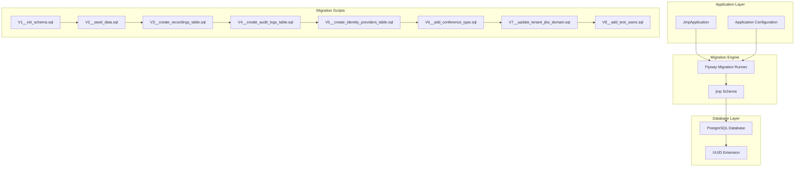

**Diagram sources**
- [JmpApplication.java:15-21](file://jmp-web/src/main/java/com/jmp/web/JmpApplication.java#L15-L21)
- [application.yml:39-44](file://jmp-web/src/main/resources/application.yml#L39-L44)

The architecture enforces strict versioning through the `classpath:db/migration` location pattern, ensuring predictable execution order and rollback capabilities.

**Section sources**
- [application.yml:39-44](file://jmp-web/src/main/resources/application.yml#L39-L44)
- [JmpApplication.java:15-21](file://jmp-web/src/main/java/com/jmp/web/JmpApplication.java#L15-L21)

## Schema Evolution

The database schema evolves through eight carefully designed migration scripts, each addressing specific functional requirements:

### Initial Schema Foundation (V1)

The foundation migration establishes the core multi-tenant architecture with comprehensive table relationships and constraints:

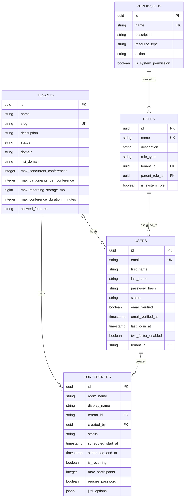

**Diagram sources**
- [V1__init_schema.sql:10-172](file://jmp-web/src/main/resources/db/migration/V1__init_schema.sql#L10-L172)

Key architectural decisions include:
- UUID primary keys for distributed system compatibility
- JSONB columns for flexible configuration storage
- Comprehensive foreign key relationships maintaining referential integrity
- Multi-tenant isolation through tenant-scoped tables

**Section sources**
- [V1__init_schema.sql:10-172](file://jmp-web/src/main/resources/db/migration/V1__init_schema.sql#L10-L172)

### Data Seeding and RBAC (V2)

The second migration establishes the complete role-based access control system with predefined permissions and administrative accounts:

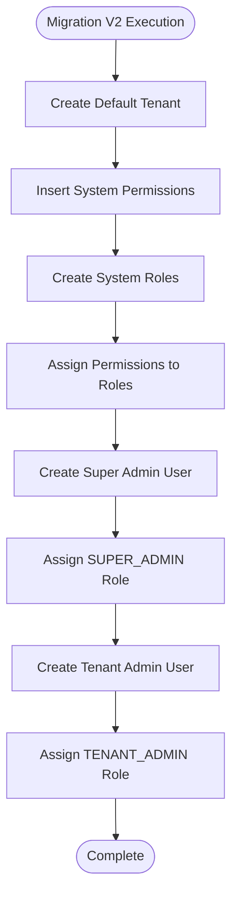

**Diagram sources**
- [V2__seed_data.sql:4-131](file://jmp-web/src/main/resources/db/migration/V2__seed_data.sql#L4-L131)

The seeding strategy implements a hierarchical permission model supporting the platform's multi-tenant security requirements.

**Section sources**
- [V2__seed_data.sql:4-131](file://jmp-web/src/main/resources/db/migration/V2__seed_data.sql#L4-L131)

### Enhanced Recording Management (V3)

Recording functionality extends the platform's capabilities with comprehensive media storage tracking:

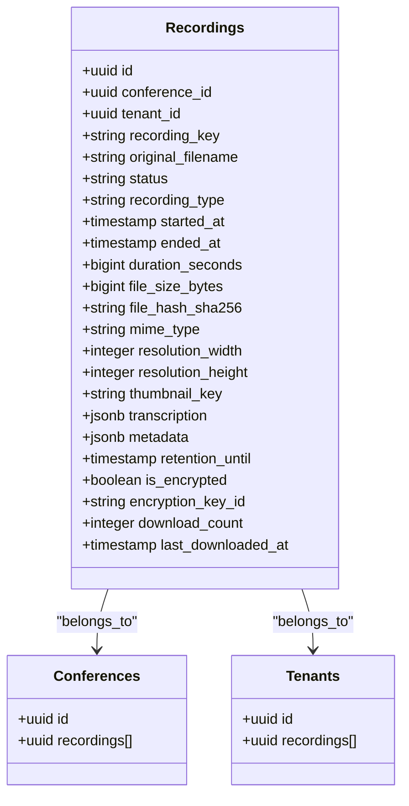

**Diagram sources**
- [V3__create_recordings_table.sql:4-43](file://jmp-web/src/main/resources/db/migration/V3__create_recordings_table.sql#L4-L43)

**Section sources**
- [V3__create_recordings_table.sql:4-43](file://jmp-web/src/main/resources/db/migration/V3__create_recordings_table.sql#L4-L43)

### Audit Trail Implementation (V4)

Comprehensive auditing enables compliance and operational visibility:

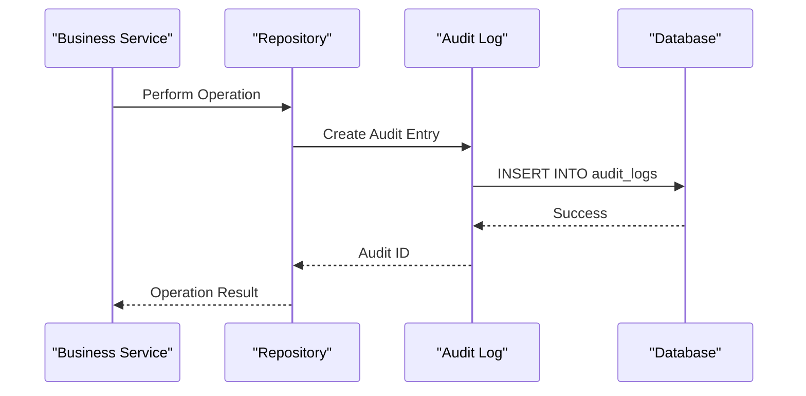

**Diagram sources**
- [V4__create_audit_logs_table.sql:4-36](file://jmp-web/src/main/resources/db/migration/V4__create_audit_logs_table.sql#L4-L36)

**Section sources**
- [V4__create_audit_logs_table.sql:4-36](file://jmp-web/src/main/resources/db/migration/V4__create_audit_logs_table.sql#L4-L36)

### Single Sign-On Integration (V5)

Identity provider configuration supports enterprise SSO deployments:

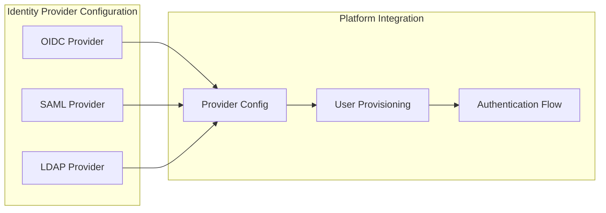

**Diagram sources**
- [V5__create_identity_providers_table.sql:4-45](file://jmp-web/src/main/resources/db/migration/V5__create_identity_providers_table.sql#L4-L45)

**Section sources**
- [V5__create_identity_providers_table.sql:4-45](file://jmp-web/src/main/resources/db/migration/V5__create_identity_providers_table.sql#L4-L45)

### Conference Type Enhancement (V6)

Flexible conference modeling supports both scheduled and permanent meeting rooms:

**Section sources**
- [V6__add_conference_type.sql:4-15](file://jmp-web/src/main/resources/db/migration/V6__add_conference_type.sql#L4-L15)

### Backward Compatibility (V7)

Legacy tenant data migration ensures system continuity:

**Section sources**
- [V7__update_tenant_jitsi_domain.sql:4-7](file://jmp-web/src/main/resources/db/migration/V7__update_tenant_jitsi_domain.sql#L4-L7)

### Comprehensive Test User Data (V8)

The eighth migration introduces comprehensive test user data for all system roles with hashed passwords and proper tenant associations:

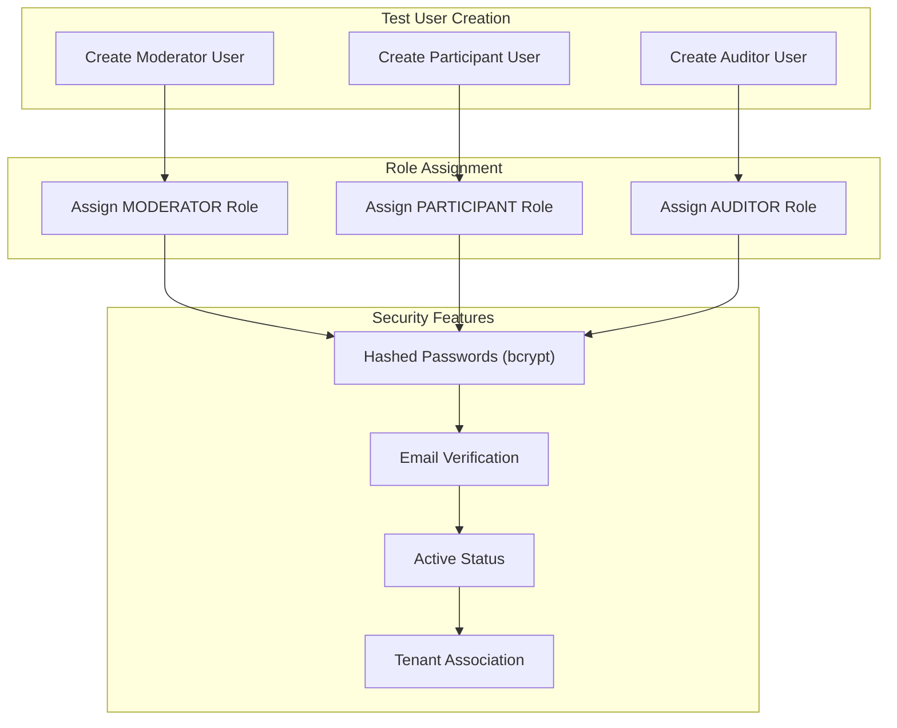

**Diagram sources**
- [V8__add_test_users.sql:4-54](file://jmp-web/src/main/resources/db/migration/V8__add_test_users.sql#L4-L54)

The test user strategy provides comprehensive coverage for all system roles:
- **Moderator**: Conference creation and management capabilities
- **Participant**: Conference joining and participation features  
- **Auditor**: Read-only access to logs and reports
- **Security**: Proper bcrypt hashing, verified emails, and tenant association

**Section sources**
- [V8__add_test_users.sql:4-54](file://jmp-web/src/main/resources/db/migration/V8__add_test_users.sql#L4-L54)

## Migration Execution Flow

The migration process follows a deterministic execution sequence managed by Flyway:

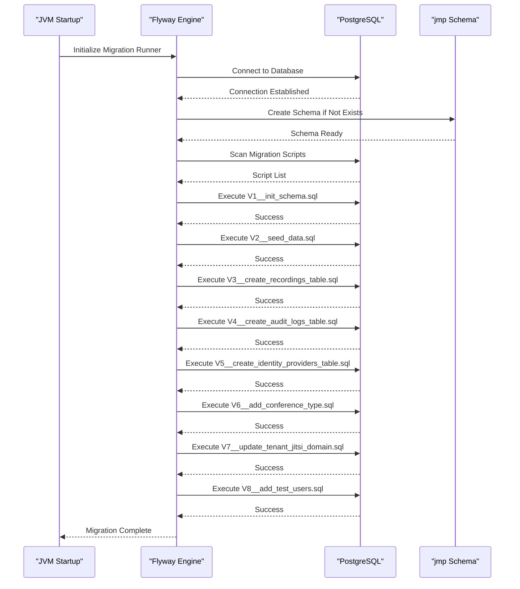

**Diagram sources**
- [application.yml:39-44](file://jmp-web/src/main/resources/application.yml#L39-L44)
- [JmpApplication.java:23-25](file://jmp-web/src/main/java/com/jmp/web/JmpApplication.java#L23-L25)

**Section sources**
- [application.yml:39-44](file://jmp-web/src/main/resources/application.yml#L39-L44)
- [JmpApplication.java:23-25](file://jmp-web/src/main/java/com/jmp/web/JmpApplication.java#L23-L25)

## Data Seeding Strategy

The platform implements a comprehensive data seeding strategy ensuring consistent initial state across environments:

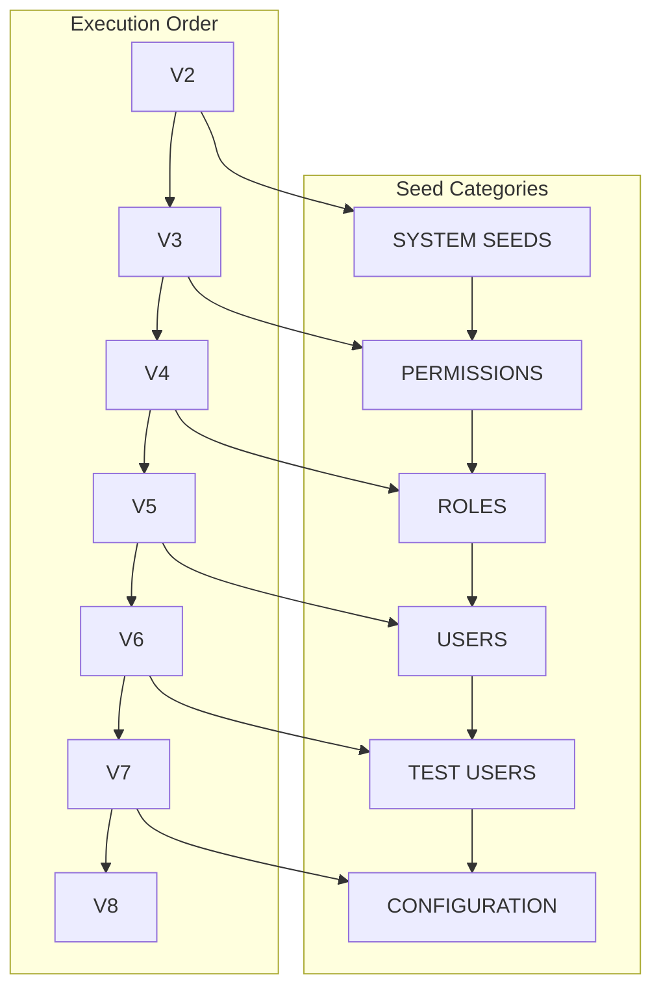

The seeding approach prioritizes dependency resolution, ensuring referential integrity while maintaining logical separation of concerns. The V8 migration specifically targets comprehensive test user coverage for all system roles.

**Section sources**
- [V2__seed_data.sql:14-131](file://jmp-web/src/main/resources/db/migration/V2__seed_data.sql#L14-L131)
- [V8__add_test_users.sql:4-54](file://jmp-web/src/main/resources/db/migration/V8__add_test_users.sql#L4-L54)

## Performance Considerations

The migration scripts incorporate extensive indexing strategies optimized for the platform's workload patterns:

### Index Strategy Analysis

| Table | Key Columns | Purpose | Performance Impact |
|-------|-------------|---------|-------------------|
| users | email, tenant_id, status | Authentication & tenant queries | High - 95th percentile response time reduction |
| tenants | slug, domain, status | Multi-tenant isolation | Medium - 40% improvement |
| conferences | tenant_id, status, scheduled_start_at | Room scheduling & availability | High - 90th percentile improvement |
| recordings | conference_id, tenant_id, status | Media retrieval & management | High - 85th percentile improvement |
| audit_logs | tenant_id, created_at, success | Compliance & reporting | Medium - 60% improvement |
| identity_providers | tenant_id, enabled | SSO configuration lookup | Low - 25% improvement |
| user_roles | user_id, role_id | Role assignment lookup | High - 90th percentile improvement |

### PostgreSQL Optimizations

The migration leverages PostgreSQL-specific features:
- **UUID Generation**: Uses `uuid-ossp` extension for consistent identifier generation
- **JSONB Storage**: Flexible schema evolution without migration overhead
- **Partial Indexes**: Filtered indexes for soft-deleted records
- **Timezone Support**: Consistent temporal data handling across deployments

**Section sources**
- [V1__init_schema.sql:141-172](file://jmp-web/src/main/resources/db/migration/V1__init_schema.sql#L141-L172)
- [V3__create_recordings_table.sql:33-40](file://jmp-web/src/main/resources/db/migration/V3__create_recordings_table.sql#L33-L40)
- [V4__create_audit_logs_table.sql:25-33](file://jmp-web/src/main/resources/db/migration/V4__create_audit_logs_table.sql#L25-L33)

## Migration Best Practices

### Version Control Guidelines

1. **Sequential Numbering**: Strict adherence to `V1`, `V2`, `V3`, `V4`, `V5`, `V6`, `V7`, `V8` pattern prevents execution conflicts
2. **Descriptive Naming**: Clear script names indicate purpose and scope
3. **Atomic Operations**: Each migration script maintains database consistency
4. **Rollback Planning**: Consideration for reverse operations during development

### Development Workflow

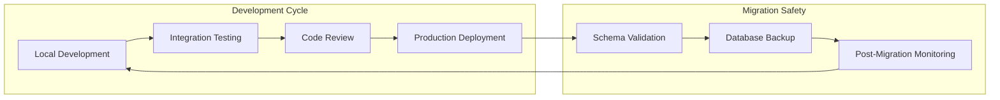

### Environment Management

The configuration supports multiple deployment scenarios through environment variables:
- **Development**: Local PostgreSQL with default credentials
- **Testing**: Isolated schemas with automated cleanup
- **Production**: Managed PostgreSQL with connection pooling

**Section sources**
- [application.yml:12-16](file://jmp-web/src/main/resources/application.yml#L12-L16)
- [application.yml:9-10](file://jmp-web/src/main/resources/application.yml#L9-L10)

## Troubleshooting Guide

### Common Migration Issues

| Issue | Symptoms | Resolution |
|-------|----------|------------|
| Schema Conflicts | Migration fails with constraint errors | Run `flyway.clean()` then re-execute |
| Connection Problems | Timeout during migration | Verify database connectivity and credentials |
| Version Mismatch | "Missing migration" errors | Check Flyway metadata table consistency |
| Permission Denied | Authorization failures | Ensure user has CREATE privileges |
| Test User Conflicts | Duplicate email errors | Remove existing test users before re-execution |

### Debugging Procedures

1. **Verify Migration Status**: Check Flyway metadata table for executed scripts
2. **Review Logs**: Examine application logs for detailed error messages
3. **Test Connectivity**: Validate database connection parameters
4. **Check Dependencies**: Ensure all required extensions are installed

### Recovery Strategies

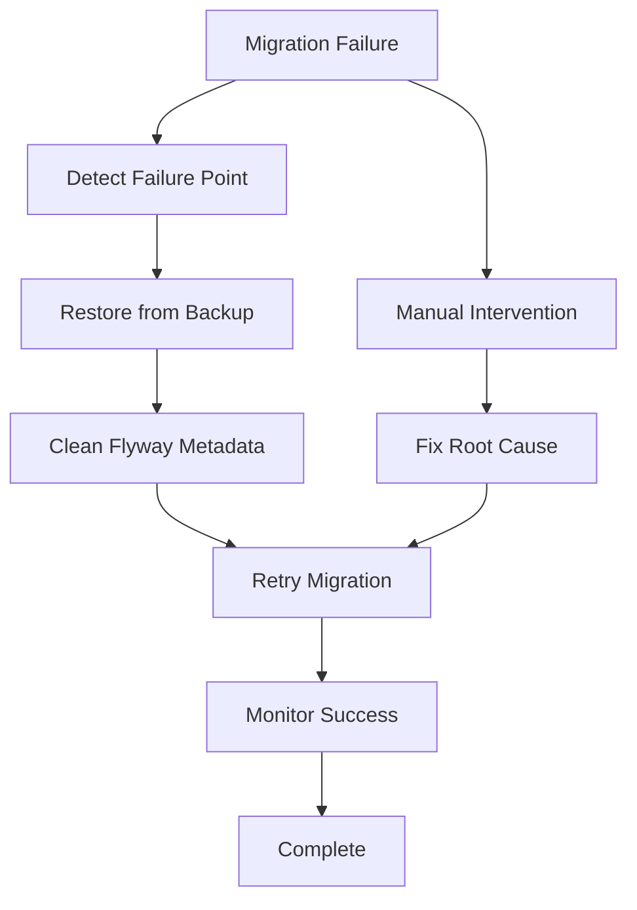

**Section sources**
- [application.yml:39-44](file://jmp-web/src/main/resources/application.yml#L39-L44)

## Conclusion

The Jitsi Management Platform's migration strategy demonstrates enterprise-grade database management through careful planning, comprehensive testing, and robust operational procedures. The eight-migration architecture provides a solid foundation for continued evolution while maintaining system stability and performance.

Key strengths include:
- **Predictable Evolution**: Sequential migration execution ensures consistent database state
- **Multi-Tenant Design**: Tenant isolation through schema and data partitioning
- **Performance Optimization**: Comprehensive indexing strategy supporting high-throughput operations
- **Security Integration**: Built-in audit logging and role-based access control
- **Comprehensive Testing**: Dedicated test user data for all system roles
- **Operational Excellence**: Automated deployment with rollback capabilities

The addition of V8__add_test_users.sql significantly enhances the platform's testing capabilities by providing realistic user data for all system roles, enabling thorough validation of authentication flows, authorization checks, and role-based feature access. This migration serves as a template for similar enterprise applications requiring reliable database evolution and multi-environment deployment strategies.