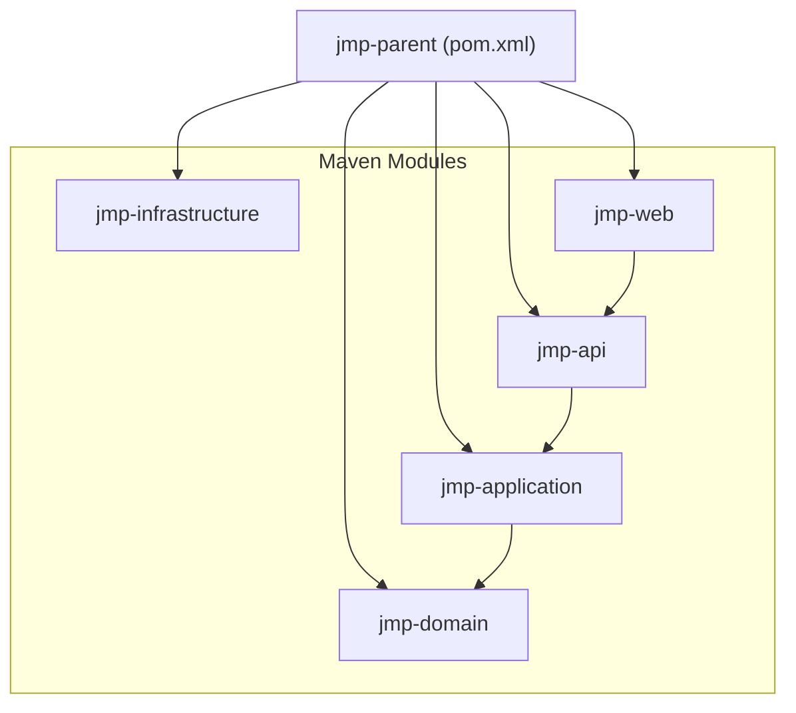
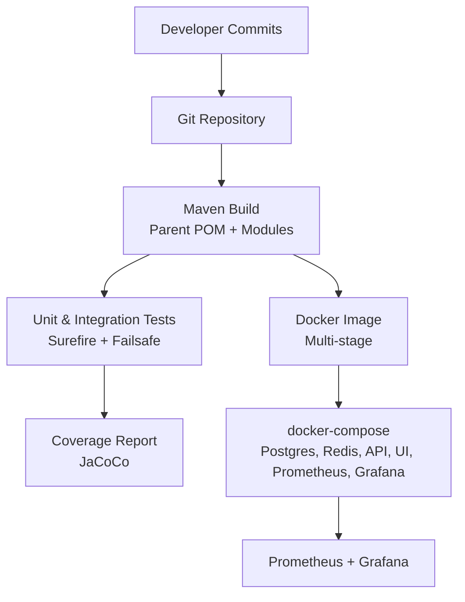
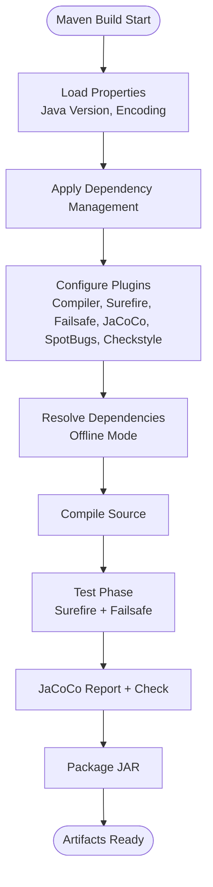
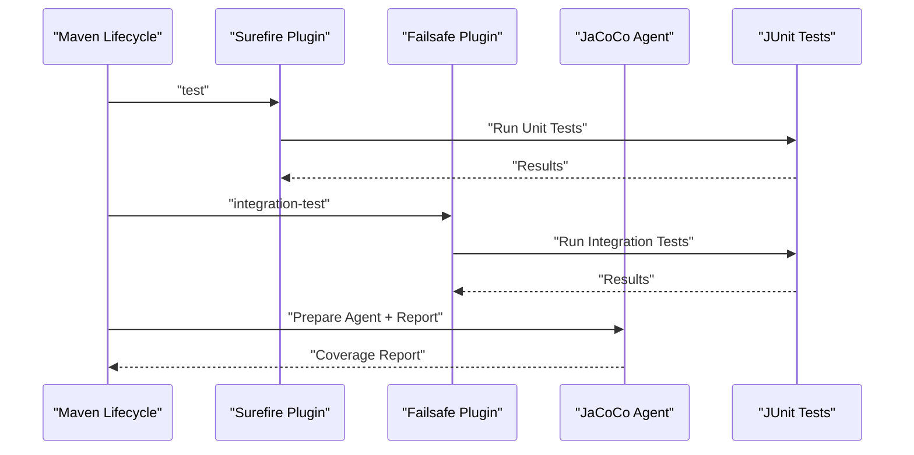
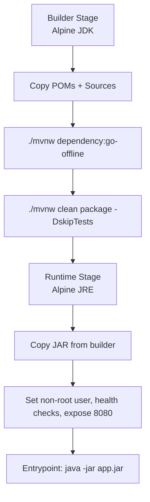
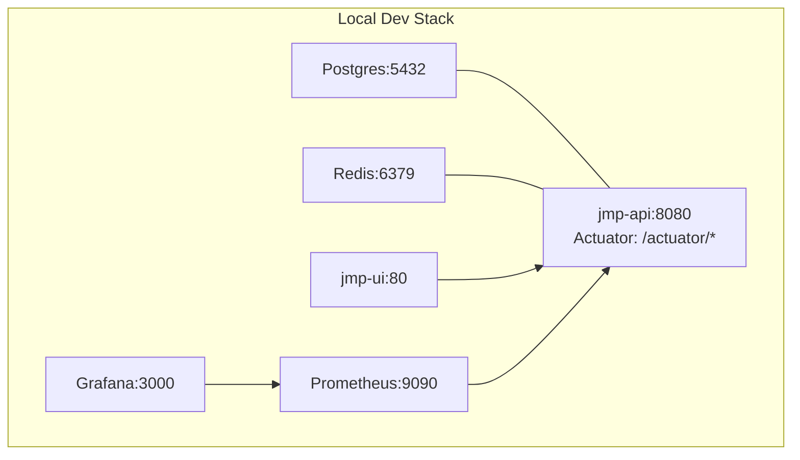
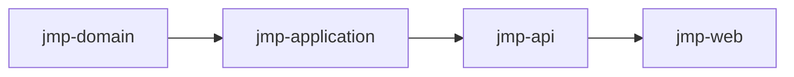

# CI/CD Pipeline

<cite>
**Referenced Files in This Document**
- [pom.xml](file://pom.xml)
- [Dockerfile](file://Dockerfile)
- [docker-compose.yml](file://docker-compose.yml)
- [monitoring/prometheus.yml](file://monitoring/prometheus.yml)
- [monitoring/grafana/datasources/datasources.yml](file://monitoring/grafana/datasources/datasources.yml)
- [jmp-web/src/main/resources/application.yml](file://jmp-web/src/main/resources/application.yml)
- [jmp-api/pom.xml](file://jmp-api/pom.xml)
- [jmp-application/pom.xml](file://jmp-application/pom.xml)
- [jmp-ui/package.json](file://jmp-ui/package.json)
- [jmp-ui/vite.config.ts](file://jmp-ui/vite.config.ts)
</cite>

## Table of Contents
1. [Introduction](#introduction)
2. [Project Structure](#project-structure)
3. [Core Components](#core-components)
4. [Architecture Overview](#architecture-overview)
5. [Detailed Component Analysis](#detailed-component-analysis)
6. [Dependency Analysis](#dependency-analysis)
7. [Performance Considerations](#performance-considerations)
8. [Troubleshooting Guide](#troubleshooting-guide)
9. [Conclusion](#conclusion)
10. [Appendices](#appendices)

## Introduction
This document describes the CI/CD pipeline for the Jitsi Management Platform (JMP). It covers Maven multi-module build configuration, dependency management, artifact generation, automated testing workflows, deployment automation, environment promotion, release management, code quality and security checks, branch protection and merge strategies, artifact storage and versioning, rollback procedures, monitoring and notifications, and maintenance practices. The repository provides a multi-module Maven build, Docker-based containerization, and local orchestration via Docker Compose, along with observability tooling for metrics and dashboards.

## Project Structure
The project is a Maven multi-module build with a parent POM orchestrating five modules:
- jmp-domain: domain entities, repositories, and events
- jmp-application: services, use cases, DTOs, mappers, validators
- jmp-infrastructure: persistence, security, messaging, storage, websocket
- jmp-api: REST controllers, exception handling, OpenAPI
- jmp-web: Spring Boot application entrypoint and resources

The build leverages a multi-stage Dockerfile to produce a minimal runtime image and a docker-compose stack for local development and testing. Monitoring is configured with Prometheus scraping application actuator endpoints and Grafana for dashboards.

**Diagram sources**
- [pom.xml:40-46](file://pom.xml#L40-L46)
- [jmp-api/pom.xml:17-28](file://jmp-api/pom.xml#L17-L28)
- [jmp-application/pom.xml:17-22](file://jmp-application/pom.xml#L17-L22)

**Section sources**
- [pom.xml:40-46](file://pom.xml#L40-L46)
- [pom.xml:79-167](file://pom.xml#L79-L167)
- [Dockerfile:1-54](file://Dockerfile#L1-L54)
- [docker-compose.yml:6-129](file://docker-compose.yml#L6-L129)

## Core Components
- Maven Parent POM
  - Defines Java 21 toolchain, UTF-8 encoding, and centralized property/version management for dependencies and plugins.
  - Declares modules and includes Surefire/Failsafe for unit/integration tests, JaCoCo for coverage, SpotBugs for static analysis, and Checkstyle for style enforcement.
  - Provides dev/prod Maven profiles to set active Spring profile.
- Maven Modules
  - jmp-api: Web, security, validation, OpenAPI, and WebSocket dependencies.
  - jmp-application: Domain dependency, MapStruct, JWT, validation, logging, and web client.
- Containerization
  - Multi-stage Docker build: offline dependency download, build with tests skipped, runtime stage with non-root user and health checks.
- Local Orchestration
  - docker-compose defines services for Postgres, Redis, API, UI, Prometheus, and Grafana, with health checks and inter-service dependencies.
- Observability
  - Prometheus scrapes application actuator metrics endpoint.
  - Grafana connects to Prometheus and exposes dashboards.

**Section sources**
- [pom.xml:48-77](file://pom.xml#L48-L77)
- [pom.xml:201-330](file://pom.xml#L201-L330)
- [jmp-api/pom.xml:17-59](file://jmp-api/pom.xml#L17-L59)
- [jmp-application/pom.xml:17-71](file://jmp-application/pom.xml#L17-L71)
- [Dockerfile:4-54](file://Dockerfile#L4-L54)
- [docker-compose.yml:6-129](file://docker-compose.yml#L6-L129)
- [monitoring/prometheus.yml:13-23](file://monitoring/prometheus.yml#L13-L23)
- [monitoring/grafana/datasources/datasources.yml:4-11](file://monitoring/grafana/datasources/datasources.yml#L4-L11)

## Architecture Overview
The pipeline stages are:
- Build: Maven multi-module build with offline dependency caching and packaging into a Spring Boot fat JAR.
- Test: Unit tests via Surefire and integration tests via Failsafe; coverage enforced by JaCoCo thresholds.
- Package: Docker image built from the packaged JAR with health checks.
- Deploy: docker-compose runs Postgres, Redis, API, UI, Prometheus, and Grafana; environment-specific configuration via application.yml and Docker environment variables.
- Observe: Prometheus scrapes /actuator/prometheus; Grafana visualizes metrics.

**Diagram sources**
- [pom.xml:201-330](file://pom.xml#L201-L330)
- [Dockerfile:4-54](file://Dockerfile#L4-L54)
- [docker-compose.yml:6-129](file://docker-compose.yml#L6-L129)
- [monitoring/prometheus.yml:13-23](file://monitoring/prometheus.yml#L13-L23)

## Detailed Component Analysis

### Maven Build Configuration and Dependency Management
- Toolchain and Encoding
  - Java 21 source/target and UTF-8 build encoding are set centrally.
- Dependency Management
  - Uses a BOM-like dependencyManagement block to align versions across modules and centralize third-party libraries (e.g., JWT, MapStruct, Testcontainers, SpringDoc).
- Plugins
  - Compiler plugin configures annotation processors and MapStruct options.
  - Surefire and Failsafe configured for unit and integration tests.
  - JaCoCo prepares agent, generates reports, and enforces coverage thresholds.
  - SpotBugs and Checkstyle configured for static analysis and style checks.
- Profiles
  - dev and prod profiles set Spring active profile.

**Diagram sources**
- [pom.xml:48-77](file://pom.xml#L48-L77)
- [pom.xml:79-167](file://pom.xml#L79-L167)
- [pom.xml:201-330](file://pom.xml#L201-L330)

**Section sources**
- [pom.xml:48-77](file://pom.xml#L48-L77)
- [pom.xml:79-167](file://pom.xml#L79-L167)
- [pom.xml:201-330](file://pom.xml#L201-L330)

### Automated Testing Workflows
- Unit Tests
  - Executed by the Maven Surefire Plugin during the test phase.
- Integration Tests
  - Executed by the Maven Failsafe Plugin during the integration-test and verify phases.
- Coverage
  - JaCoCo prepares the JVM agent, generates reports, and enforces minimum thresholds for lines and branches.
- Static Analysis
  - SpotBugs and Checkstyle plugins are configured for spotbugs and checkstyle goals.

**Diagram sources**
- [pom.xml:235-245](file://pom.xml#L235-L245)
- [pom.xml:267-310](file://pom.xml#L267-L310)

**Section sources**
- [pom.xml:235-245](file://pom.xml#L235-L245)
- [pom.xml:267-310](file://pom.xml#L267-L310)

### Artifact Generation and Packaging
- Maven Packaging
  - Each module produces artifacts according to its packaging type; jmp-web packages the final executable JAR.
- Docker Image
  - Multi-stage build:
    - Builder stage downloads dependencies using offline mode, compiles, and packages the JAR (tests skipped).
    - Runtime stage copies the JAR into a small Alpine JRE image, sets non-root user, exposes port 8080, defines health checks, and sets the entrypoint.

**Diagram sources**
- [Dockerfile:4-54](file://Dockerfile#L4-L54)

**Section sources**
- [Dockerfile:4-54](file://Dockerfile#L4-L54)

### Deployment Automation and Environment Promotion
- Local Development
  - docker-compose orchestrates services:
    - Postgres and Redis for persistence and caching.
    - jmp-api built from the Dockerfile, configured via environment variables for database, Redis, and JWT secrets.
    - jmp-ui built from its Dockerfile and configured to target the API.
    - Prometheus and Grafana for metrics and dashboards.
- Environment Promotion
  - The parent POM defines dev and prod Maven profiles; set the active Spring profile accordingly for environment-specific behavior.
- Release Management
  - The parent POM version is 1.0.0-SNAPSHOT; SCM tag points to HEAD. Releases can be cut by bumping the version and tagging per standard semantic versioning.

**Diagram sources**
- [docker-compose.yml:6-129](file://docker-compose.yml#L6-L129)
- [pom.xml:33-38](file://pom.xml#L33-L38)
- [pom.xml:314-330](file://pom.xml#L314-L330)

**Section sources**
- [docker-compose.yml:6-129](file://docker-compose.yml#L6-L129)
- [pom.xml:33-38](file://pom.xml#L33-L38)
- [pom.xml:314-330](file://pom.xml#L314-L330)

### Code Quality Checks, Security Scanning, and Vulnerability Assessment
- Code Quality
  - SpotBugs and Checkstyle plugins are configured in the parent POM; run them via their respective Maven goals.
- Security Scanning
  - No explicit Maven plugin for security scanning (OWASP Dependency-Check or similar) is present in the current configuration. Consider adding a security plugin in CI to scan dependencies for vulnerabilities.
- Vulnerability Assessment
  - Combine dependency lock files (if applicable) with a security scanner in CI to assess and gate releases.

**Section sources**
- [pom.xml:253-263](file://pom.xml#L253-L263)

### Branch Protection Rules, Pull Request Automation, and Merge Strategies
- Branch Protection
  - Protect main/trunk branch; require at least one approving review and status checks (build, tests, coverage, static analysis).
- Pull Requests
  - Require successful CI pipeline before allowing PR merges; enable auto-rebase or squash-and-merge to keep history linear.
- Merge Strategies
  - Prefer rebase or squash to maintain a clean commit history; avoid merge commits on protected branches.

[No sources needed since this section provides general guidance]

### Artifact Storage, Version Tagging, and Rollback Procedures
- Artifact Storage
  - Store Docker images in a container registry (e.g., repository under organization namespace) with versioned tags.
- Version Tagging
  - Tag releases with semantic versioning (e.g., v1.2.3); keep SNAPSHOT builds for ongoing development.
- Rollback
  - Rollback to previous image tag; redeploy with docker-compose or Kubernetes manifests; verify health checks and metrics.

[No sources needed since this section provides general guidance]

### Pipeline Monitoring, Failure Notifications, and Maintenance
- Monitoring
  - Prometheus scrapes /actuator/prometheus from the API; Grafana visualizes metrics; configure alerts for critical endpoints and resource usage.
- Failure Notifications
  - Integrate CI failure notifications to Slack/Teams via webhook steps after job failures.
- Maintenance
  - Periodically update dependency versions, rebuild images, and rotate secrets.

**Section sources**
- [monitoring/prometheus.yml:13-23](file://monitoring/prometheus.yml#L13-L23)
- [monitoring/grafana/datasources/datasources.yml:4-11](file://monitoring/grafana/datasources/datasources.yml#L4-L11)

## Dependency Analysis
The module dependencies form a layered architecture: jmp-web depends on jmp-api; jmp-api depends on jmp-application; jmp-application depends on jmp-domain. The parent POM coordinates versions and plugin configuration across modules.

**Diagram sources**
- [pom.xml:40-46](file://pom.xml#L40-L46)
- [jmp-api/pom.xml:17-28](file://jmp-api/pom.xml#L17-L28)
- [jmp-application/pom.xml:17-22](file://jmp-application/pom.xml#L17-L22)

**Section sources**
- [pom.xml:40-46](file://pom.xml#L40-L46)
- [jmp-api/pom.xml:17-28](file://jmp-api/pom.xml#L17-L28)
- [jmp-application/pom.xml:17-22](file://jmp-application/pom.xml#L17-L22)

## Performance Considerations
- Build Performance
  - Use offline dependency resolution to speed up CI builds.
  - Enable incremental compilation and reuse of dependency caches.
- Runtime Performance
  - Tune JVM options and container resource limits in production deployments.
  - Monitor database connection pool sizing and Redis throughput.

[No sources needed since this section provides general guidance]

## Troubleshooting Guide
- Build Failures
  - Verify Java version matches the toolchain and that dependency:go-offline succeeds in the builder stage.
  - Ensure module dependencies resolve correctly via the parent’s dependencyManagement.
- Test Failures
  - Confirm Surefire/Failsafe are configured and that tests run in the correct lifecycle phases.
  - Review JaCoCo thresholds if the build fails coverage checks.
- Container Health
  - Check health checks for Postgres, Redis, API, and UI; confirm network connectivity and exposed ports.
- Observability
  - Validate Prometheus scrape configuration and Grafana data source settings.

**Section sources**
- [Dockerfile:18-29](file://Dockerfile#L18-L29)
- [pom.xml:235-310](file://pom.xml#L235-L310)
- [docker-compose.yml:19-71](file://docker-compose.yml#L19-L71)
- [monitoring/prometheus.yml:13-23](file://monitoring/prometheus.yml#L13-L23)
- [monitoring/grafana/datasources/datasources.yml:4-11](file://monitoring/grafana/datasources/datasources.yml#L4-L11)

## Conclusion
The JMP repository provides a robust foundation for CI/CD: a Maven multi-module build with centralized dependency and plugin management, a multi-stage Docker build, and a docker-compose orchestrated environment. The pipeline supports unit and integration testing, coverage reporting, and observability. To complete the CI/CD system, integrate a security scanner, establish branch protection and PR automation, implement artifact storage and versioning, and formalize rollback and notification procedures.

[No sources needed since this section summarizes without analyzing specific files]

## Appendices
- Frontend Build Configuration
  - The UI uses Vite with React; scripts include dev, build, lint, and preview. These are useful for local development and can be integrated into CI for linting and building the frontend artifact.

**Section sources**
- [jmp-ui/package.json:6-11](file://jmp-ui/package.json#L6-L11)
- [jmp-ui/vite.config.ts:1-8](file://jmp-ui/vite.config.ts#L1-L8)