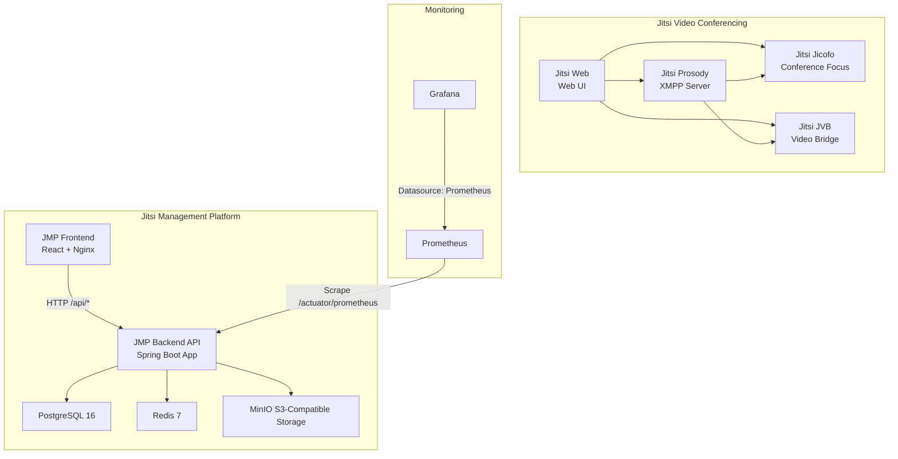
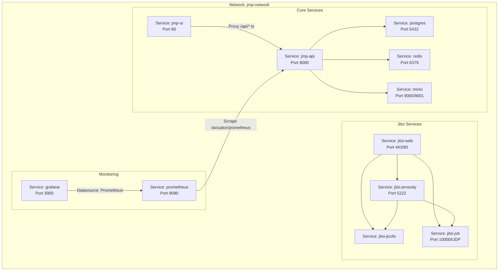
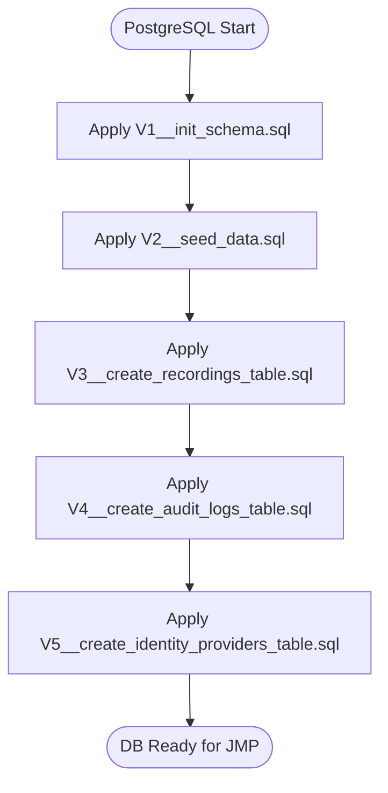
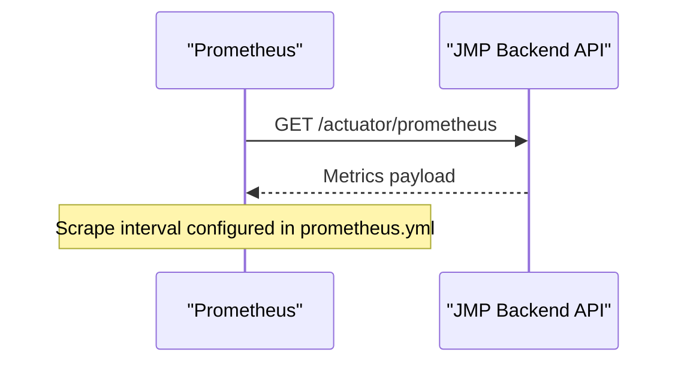
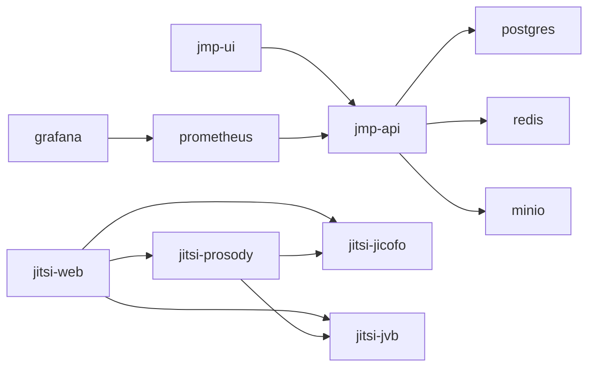

# Deployment and DevOps

<cite>
**Referenced Files in This Document**
- [docker-compose.yml](file://docker-compose.yml)
- [Dockerfile](file://Dockerfile)
- [jmp-ui/Dockerfile](file://jmp-ui/Dockerfile)
- [application.yml](file://jmp-web/src/main/resources/application.yml)
- [prometheus.yml](file://monitoring/prometheus.yml)
- [datasources.yml](file://monitoring/grafana/datasources/datasources.yml)
- [nginx.conf](file://jmp-ui/nginx.conf)
- [package.json](file://jmp-ui/package.json)
- [HELP.md](file://HELP.md)
- [V1__init_schema.sql](file://jmp-web/src/main/resources/db/migration/V1__init_schema.sql)
- [V2__seed_data.sql](file://jmp-web/src/main/resources/db/migration/V2__seed_data.sql)
- [V3__create_recordings_table.sql](file://jmp-web/src/main/resources/db/migration/V3__create_recordings_table.sql)
- [V4__create_audit_logs_table.sql](file://jmp-web/src/main/resources/db/migration/V4__create_audit_logs_table.sql)
- [V5__create_identity_providers_table.sql](file://jmp-web/src/main/resources/db/migration/V5__create_identity_providers_table.sql)
</cite>

## Update Summary
**Changes Made**
- Added comprehensive Jitsi integration with web, prosody, jicofo, and jvb services
- Enhanced monitoring stack with Prometheus and Grafana configuration
- Integrated S3-compatible storage using MinIO for conference recordings
- Updated service dependencies and environment configurations
- Expanded database schema with recordings, audit logs, and identity providers tables
- Added extensive Jitsi configuration parameters for authentication and XMPP settings

## Table of Contents
1. [Introduction](#introduction)
2. [Project Structure](#project-structure)
3. [Core Components](#core-components)
4. [Architecture Overview](#architecture-overview)
5. [Detailed Component Analysis](#detailed-component-analysis)
6. [Jitsi Integration](#jitsi-integration)
7. [Monitoring Stack](#monitoring-stack)
8. [Storage Configuration](#storage-configuration)
9. [Database Schema](#database-schema)
10. [Dependency Analysis](#dependency-analysis)
11. [Performance Considerations](#performance-considerations)
12. [Troubleshooting Guide](#troubleshooting-guide)
13. [Conclusion](#conclusion)
14. [Appendices](#appendices)

## Introduction
This document provides comprehensive deployment and DevOps guidance for the Jitsi Management Platform (JMP). The platform now includes comprehensive Jitsi video conferencing integration with web, prosody, jicofo, and jvb services, along with a complete monitoring stack featuring Prometheus and Grafana, and S3-compatible storage through MinIO. It covers containerization strategies, multi-stage builds, Docker Compose orchestration, environment configuration, secrets management, infrastructure provisioning, CI/CD pipeline setup, automated testing, production deployment considerations, scaling and high availability, backup and disaster recovery, monitoring, operational procedures, security, network configuration, blue-green deployments, rolling updates, and rollback procedures. It also includes troubleshooting guidance for common deployment issues.

## Project Structure
The repository follows a multi-module Maven layout with a Spring Boot web application, supporting infrastructure services (PostgreSQL, Redis), a React-based UI, monitoring stacks (Prometheus, Grafana), and a complete Jitsi video conferencing ecosystem with S3-compatible storage. Docker images are built for the backend and frontend, orchestrated via Docker Compose with comprehensive service dependencies.

**Diagram sources**
- [docker-compose.yml:6-353](file://docker-compose.yml#L6-L353)
- [application.yml:12-128](file://jmp-web/src/main/resources/application.yml#L12-L128)
- [prometheus.yml:18-22](file://monitoring/prometheus.yml#L18-L22)
- [datasources.yml:1-11](file://monitoring/grafana/datasources/datasources.yml#L1-L11)

**Section sources**
- [docker-compose.yml:6-353](file://docker-compose.yml#L6-L353)
- [Dockerfile:1-54](file://Dockerfile#L1-L54)
- [jmp-ui/Dockerfile:1-33](file://jmp-ui/Dockerfile#L1-L33)

## Core Components
- **Backend API**: Multi-module Spring Boot application packaged as a single JAR, exposed on port 8080, with health checks and Prometheus metrics.
- **Frontend**: React SPA built with Vite and served via Nginx, exposing port 80 inside the container and proxied to the backend API.
- **Database**: PostgreSQL 16 with Flyway migrations and seed data, supporting conference management, recordings, audit logs, and identity providers.
- **Cache**: Redis 7 for session and rate-limiting state.
- **Storage**: MinIO S3-compatible object storage for conference recordings and media files.
- **Jitsi Services**: Complete video conferencing stack including web UI, XMPP server, conference focus, and video bridge.
- **Monitoring**: Prometheus scraping backend metrics and Grafana for dashboards.

**Section sources**
- [Dockerfile:1-54](file://Dockerfile#L1-L54)
- [docker-compose.yml:45-353](file://docker-compose.yml#L45-L353)
- [application.yml:12-128](file://jmp-web/src/main/resources/application.yml#L12-L128)
- [prometheus.yml:18-22](file://monitoring/prometheus.yml#L18-L22)
- [datasources.yml:4-10](file://monitoring/grafana/datasources/datasources.yml#L4-L10)

## Architecture Overview
The deployment architecture uses Docker Compose to run the backend, frontend, database, cache, monitoring stack, Jitsi video conferencing services, and S3-compatible storage in isolated containers connected via a shared bridge network. The frontend proxies API calls to the backend, while Prometheus scrapes metrics from the backend's Actuator endpoints. The Jitsi services form a complete video conferencing ecosystem with proper authentication and XMPP communication.

**Diagram sources**
- [docker-compose.yml:6-353](file://docker-compose.yml#L6-L353)
- [nginx.conf:24-35](file://jmp-ui/nginx.conf#L24-L35)
- [prometheus.yml:18-22](file://monitoring/prometheus.yml#L18-L22)
- [datasources.yml:4-10](file://monitoring/grafana/datasources/datasources.yml#L4-L10)

## Detailed Component Analysis

### Backend API Containerization
- **Multi-stage build**: JDK for building, JRE for runtime; non-root user; health check; exposed port 8080; entrypoint runs the packaged JAR.
- **Environment configuration**: Externalized via Spring profiles and environment variables for database URL, credentials, Redis URL, JWT secrets, S3 storage configuration, and Jitsi integration settings.
- **Health checks**: Rely on Spring Boot Actuator endpoints with proper startup delays.

**Diagram sources**
- [Dockerfile:4-53](file://Dockerfile#L4-L53)

**Section sources**
- [Dockerfile:1-54](file://Dockerfile#L1-L54)
- [application.yml:9-128](file://jmp-web/src/main/resources/application.yml#L9-L128)

### Frontend Containerization
- **Multi-stage build**: Node Alpine for build, Nginx Alpine for serving; copies built assets and custom Nginx config; exposes port 80.
- **Nginx proxy configuration**: Forwards API requests to the backend and serves static assets with caching and client-side routing support.

**Diagram sources**
- [jmp-ui/Dockerfile:4-32](file://jmp-ui/Dockerfile#L4-L32)
- [nginx.conf:1-37](file://jmp-ui/nginx.conf#L1-L37)

**Section sources**
- [jmp-ui/Dockerfile:1-33](file://jmp-ui/Dockerfile#L1-L33)
- [nginx.conf:1-37](file://jmp-ui/nginx.conf#L1-L37)
- [package.json:1-39](file://jmp-ui/package.json#L1-L39)

### Database and Migration Strategy
- **PostgreSQL 16**: Configured via environment variables in Compose with comprehensive schema management.
- **Flyway migrations**: Enabled and point to SQL scripts under resources/db/migration with expanded functionality.
- **Enhanced schema**: Includes conference management, recordings, audit logs, and identity providers tables.

**Diagram sources**
- [V1__init_schema.sql:1-172](file://jmp-web/src/main/resources/db/migration/V1__init_schema.sql#L1-L172)
- [V2__seed_data.sql:1-131](file://jmp-web/src/main/resources/db/migration/V2__seed_data.sql#L1-L131)
- [V3__create_recordings_table.sql:1-43](file://jmp-web/src/main/resources/db/migration/V3__create_recordings_table.sql#L1-L43)
- [V4__create_audit_logs_table.sql:1-36](file://jmp-web/src/main/resources/db/migration/V4__create_audit_logs_table.sql#L1-L36)
- [V5__create_identity_providers_table.sql:1-45](file://jmp-web/src/main/resources/db/migration/V5__create_identity_providers_table.sql#L1-L45)

**Section sources**
- [docker-compose.yml:8-26](file://docker-compose.yml#L8-L26)
- [application.yml:39-44](file://jmp-web/src/main/resources/application.yml#L39-L44)
- [V1__init_schema.sql:1-172](file://jmp-web/src/main/resources/db/migration/V1__init_schema.sql#L1-L172)
- [V2__seed_data.sql:1-131](file://jmp-web/src/main/resources/db/migration/V2__seed_data.sql#L1-L131)
- [V3__create_recordings_table.sql:1-43](file://jmp-web/src/main/resources/db/migration/V3__create_recordings_table.sql#L1-L43)
- [V4__create_audit_logs_table.sql:1-36](file://jmp-web/src/main/resources/db/migration/V4__create_audit_logs_table.sql#L1-L36)
- [V5__create_identity_providers_table.sql:1-45](file://jmp-web/src/main/resources/db/migration/V5__create_identity_providers_table.sql#L1-L45)

## Jitsi Integration

### Jitsi Web Service
The Jitsi web service provides the user interface for video conferencing with comprehensive authentication and configuration options.

- **Image**: jitsi/web:stable
- **Ports**: 443 (HTTPS), 80 (HTTP)
- **Volumes**: Configuration, certificates, and transcript storage
- **Environment**: JWT authentication, XMPP configuration, lobby settings, and recording capabilities

### Jitsi Prosody XMPP Server
The XMPP server handles real-time communication and authentication for the Jitsi ecosystem.

- **Image**: jitsi/prosody:stable
- **Exposed Port**: 5222
- **Volumes**: Configuration and plugin storage
- **Environment**: Authentication credentials for Jicofo and JVB services

### Jitsi Jicofo Conference Focus
Manages conference creation and participant management.

- **Image**: jitsi/jicofo:stable
- **Volumes**: Configuration storage
- **Environment**: JWT configuration and JVB credentials

### Jitsi JVB Video Bridge
Handles media streaming and participant connections.

- **Image**: jitsi/jvb:stable
- **Port**: 10000/UDP
- **Environment**: STUN server configuration and JVB-specific settings
- **Volumes**: Configuration storage

**Section sources**
- [docker-compose.yml:158-334](file://docker-compose.yml#L158-L334)

## Monitoring Stack
- **Prometheus**: Scrapes backend metrics at 5-second intervals from the Actuator endpoint.
- **Grafana**: Provisioned with Prometheus datasource and dashboard configurations.
- **Configuration**: Persistent volumes for data retention and dashboard provisioning.

**Diagram sources**
- [prometheus.yml:18-22](file://monitoring/prometheus.yml#L18-L22)
- [application.yml:92-112](file://jmp-web/src/main/resources/application.yml#L92-L112)

**Section sources**
- [prometheus.yml:1-23](file://monitoring/prometheus.yml#L1-L23)
- [datasources.yml:1-11](file://monitoring/grafana/datasources/datasources.yml#L1-L11)
- [application.yml:92-112](file://jmp-web/src/main/resources/application.yml#L92-L112)

## Storage Configuration

### MinIO S3-Compatible Storage
Provides object storage for conference recordings and media files.

- **Image**: minio/minio:latest
- **Ports**: 9000 (API), 9001 (Console)
- **Environment**: Root user credentials for administrative access
- **Command**: Server mode with console address configuration
- **Volumes**: Persistent data storage
- **Health Checks**: Live endpoint monitoring

**Section sources**
- [docker-compose.yml:136-156](file://docker-compose.yml#L136-L156)

## Database Schema

### Enhanced Schema Design
The database now supports comprehensive video conferencing and management capabilities.

#### Recordings Table
- **Purpose**: Store conference recordings with S3 integration
- **Key Fields**: Conference reference, tenant association, recording metadata, file storage details
- **Indexes**: Optimized for status queries, retention management, and tenant filtering

#### Audit Logs Table
- **Purpose**: Track all system events and user actions
- **Key Fields**: Event type, user information, IP addresses, user agents, and success indicators
- **Indexes**: Efficient querying by tenant, user, and timestamp

#### Identity Providers Table
- **Purpose**: Support SSO/OIDC authentication
- **Key Fields**: Provider configuration, OAuth endpoints, client credentials, and attribute mapping
- **Integration**: Extends user table with external authentication fields

**Section sources**
- [V3__create_recordings_table.sql:1-43](file://jmp-web/src/main/resources/db/migration/V3__create_recordings_table.sql#L1-L43)
- [V4__create_audit_logs_table.sql:1-36](file://jmp-web/src/main/resources/db/migration/V4__create_audit_logs_table.sql#L1-L36)
- [V5__create_identity_providers_table.sql:1-45](file://jmp-web/src/main/resources/db/migration/V5__create_identity_providers_table.sql#L1-L45)

## Dependency Analysis
- **Backend dependencies**: PostgreSQL, Redis, and MinIO services with health checks.
- **Frontend dependencies**: Backend API for API access with proper proxy configuration.
- **Jitsi dependencies**: Web service depends on prosody, jicofo, and jvb services.
- **Monitoring dependencies**: Backend metrics exposure for Prometheus scraping.

**Diagram sources**
- [docker-compose.yml:45-353](file://docker-compose.yml#L45-L353)

**Section sources**
- [docker-compose.yml:70-77](file://docker-compose.yml#L70-L77)
- [docker-compose.yml:198-201](file://docker-compose.yml#L198-L201)
- [nginx.conf:24-35](file://jmp-ui/nginx.conf#L24-L35)

## Performance Considerations
- **Backend connection pooling**: Tuned for concurrency and responsiveness with PostgreSQL and Redis.
- **Compression and caching**: Enabled for frontend assets with proper expiration headers.
- **Metrics and health checks**: Configured to detect degraded performance early.
- **Jitsi service optimization**: Proper resource allocation and UDP port handling for video streaming.

**Section sources**
- [application.yml:17-56](file://jmp-web/src/main/resources/application.yml#L17-L56)
- [nginx.conf:7-17](file://jmp-ui/nginx.conf#L7-L17)
- [docker-compose.yml:324-326](file://docker-compose.yml#L324-L326)

## Troubleshooting Guide
Common deployment issues and resolutions:

### Backend and Service Issues
- **Backend fails to start due to database unavailability**:
  - Verify database health check passes and credentials match Compose environment.
  - Confirm Flyway migrations ran successfully.
- **MinIO storage not accessible**:
  - Check MinIO health checks and credential configuration.
  - Verify S3 bucket creation and endpoint accessibility.
- **Jitsi services failing to start**:
  - Ensure prosody service starts before jicofo and jvb.
  - Verify JWT configuration and XMPP domain settings.
  - Check port conflicts for JVB UDP port 10000.

### Frontend and API Issues
- **Frontend cannot reach API**:
  - Ensure Nginx proxy configuration routes /api/* to the backend service name and port.
  - Check network connectivity between services using the shared Compose network.
- **JWT authentication failures**:
  - Verify JWT secrets match between backend and Jitsi services.
  - Check accepted issuers and audiences configuration.

### Monitoring Issues
- **Metrics not visible in Grafana**:
  - Confirm Prometheus scrape configuration targets the backend service and port.
  - Validate Actuator metrics exposure and endpoint accessibility.
- **Health checks failing**:
  - Review container health check commands and intervals.
  - Inspect backend logs for initialization errors.

**Section sources**
- [docker-compose.yml:19-23](file://docker-compose.yml#L19-L23)
- [docker-compose.yml:66-71](file://docker-compose.yml#L66-L71)
- [docker-compose.yml:150-154](file://docker-compose.yml#L150-L154)
- [docker-compose.yml:330-333](file://docker-compose.yml#L330-L333)
- [application.yml:92-112](file://jmp-web/src/main/resources/application.yml#L92-L112)
- [prometheus.yml:18-22](file://monitoring/prometheus.yml#L18-L22)
- [nginx.conf:24-35](file://jmp-ui/nginx.conf#L24-L35)

## Conclusion
The Jitsi Management Platform now provides a comprehensive, container-native foundation for development and production with integrated video conferencing capabilities. The enhanced Docker Compose configuration includes complete Jitsi integration, monitoring stack, and S3-compatible storage, enabling robust deployments. The multi-stage Docker builds, comprehensive orchestration, externalized configuration, and integrated monitoring strengthen reliability and security for production environments.

## Appendices

### Environment Configuration and Secrets Management
- **Externalized configuration**:
  - Spring profiles and environment variables control database URL, credentials, Redis URL, JWT secrets, S3 storage configuration, and Jitsi integration settings.
  - Compose sets environment variables for all services with proper dependency ordering.
- **Secrets management**:
  - Current configuration embeds secrets in Compose; for production, integrate with a secrets manager (e.g., HashiCorp Vault) and inject via environment variables or mounted files.
  - Jitsi JWT secrets and MinIO credentials should be managed separately.
- **Configuration validation**:
  - Use Spring's validation for configuration properties and fail-fast startup on missing values.

**Section sources**
- [application.yml:9-128](file://jmp-web/src/main/resources/application.yml#L9-L128)
- [docker-compose.yml:52-67](file://docker-compose.yml#L52-L67)
- [docker-compose.yml:141-143](file://docker-compose.yml#L141-L143)
- [HELP.md](file://HELP.md#L18.1-L18.5)

### CI/CD Pipeline Setup
- **Recommended stages**:
  - Lint, Build, Test, Security scan, Docker build, push, deploy to staging, E2E tests, deploy to production.
- **Artifact management**:
  - Immutable container images with SBOM generation.
- **Rollbacks**:
  - Automatic rollback on failed health checks; canary deployments and feature flags for controlled rollouts.

**Section sources**
- [HELP.md:153-163](file://HELP.md#L153-L163)
- [Dockerfile:1-54](file://Dockerfile#L1-L54)
- [docker-compose.yml:1-353](file://docker-compose.yml#L1-L353)

### Production Deployment Considerations
- **Scaling**:
  - Stateless backend nodes behind a load balancer; autoscaling groups for horizontal growth.
  - Redis clustering for cache redundancy and throughput.
  - Jitsi services can be scaled independently based on conference demand.
- **High availability**:
  - Multi-AZ deployment; active-passive for critical components; heartbeat monitoring.
  - Jitsi services should be deployed across multiple instances for conference resilience.
- **Backup and disaster recovery**:
  - PostgreSQL logical backups and point-in-time recovery; regular restore drills; retention policies for backups.
  - MinIO supports distributed storage for object data redundancy.
- **Security**:
  - Network segmentation, firewall rules, TLS termination at ingress; least privilege access; secrets rotation; audit logging.
  - Jitsi services require proper certificate management and secure JWT configuration.

**Section sources**
- [HELP.md:17-18](file://HELP.md#L17-L18)
- [HELP.md:201-211](file://HELP.md#L201-L211)
- [HELP.md:93-103](file://HELP.md#L93-L103)

### Blue-Green Deployments and Rolling Updates
- **Blue-green**:
  - Maintain two identical environments; switch traffic after validation.
  - Particularly important for Jitsi services to avoid disrupting active conferences.
- **Rolling updates**:
  - Gradual replacement with health checks and rollback on failure.
  - Jitsi services may require careful coordination to prevent conference disruption.
- **Rollback procedures**:
  - Restore previous image tag; revert configuration changes; validate metrics and logs.

**Section sources**
- [HELP.md:159-163](file://HELP.md#L159-L163)

### Monitoring and Operational Procedures
- **Metrics**:
  - Enable Prometheus metrics and configure Grafana dashboards for business and infrastructure metrics.
  - Monitor Jitsi service health, conference statistics, and storage utilization.
- **Alerting**:
  - Threshold-based rules with routing to notification channels; suppression windows during maintenance.
  - Monitor database connections, Redis availability, and storage capacity.
- **Operational runbooks**:
  - Document deployment tracking, correlation with error rates, and automatic alert suppression during rollouts.

**Section sources**
- [prometheus.yml:1-23](file://monitoring/prometheus.yml#L1-L23)
- [datasources.yml:1-11](file://monitoring/grafana/datasources/datasources.yml#L1-L11)
- [HELP.md:129-140](file://HELP.md#L129-L140)
- [HELP.md](file://HELP.md#L13.9-L13.10)

### Network Configuration and Firewall Rules
- **Ingress**:
  - Nginx/Traefik reverse proxy with TLS termination and rate limiting.
  - Jitsi web service requires HTTPS access on port 443.
- **Internal**:
  - Services communicate over a dedicated Compose network; restrict external exposure to necessary ports.
  - Jitsi JVB requires UDP port 10000 for media streaming.
- **Firewalls**:
  - Allow inbound HTTPS/TLS to the proxy; restrict database and cache ports to internal network.
  - Permit Prometheus scraping and Jitsi service communication.
  - Open JVB UDP port 10000 for video streaming.

**Section sources**
- [HELP.md:34-36](file://HELP.md#L34-L36)
- [docker-compose.yml:195-197](file://docker-compose.yml#L195-L197)
- [docker-compose.yml:329-330](file://docker-compose.yml#L329-L330)
- [docker-compose.yml:126-129](file://docker-compose.yml#L126-L129)