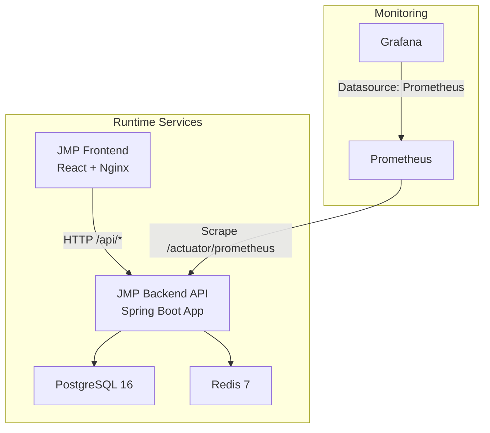
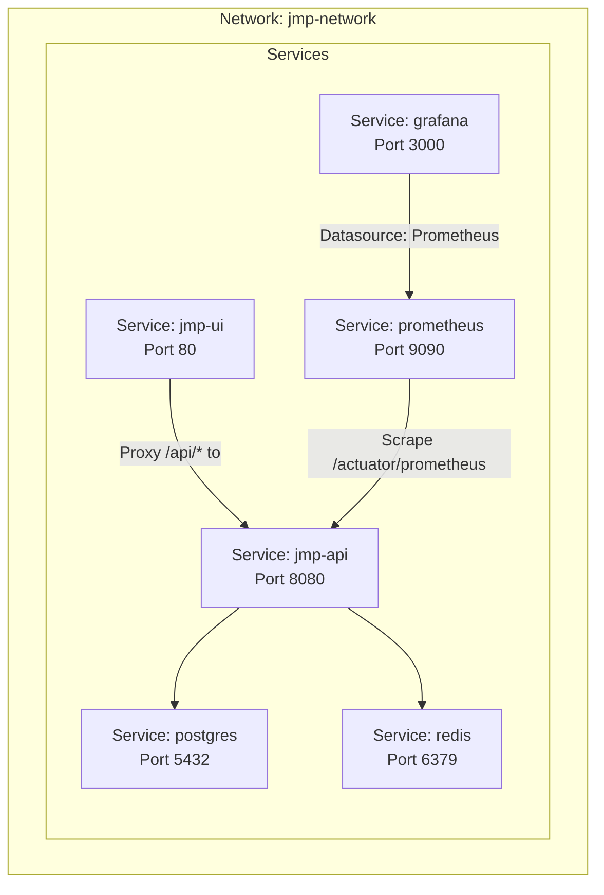
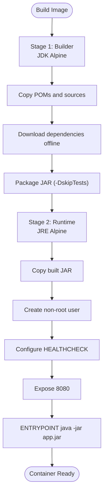
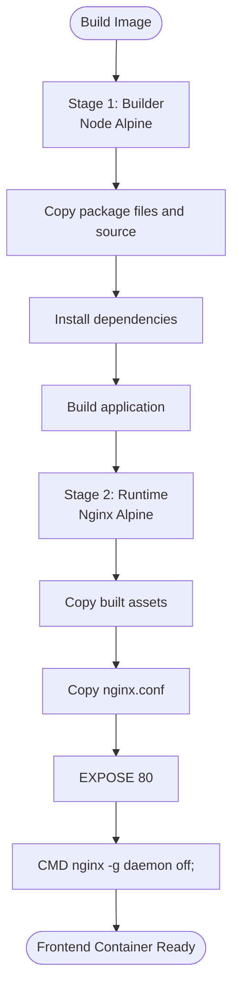
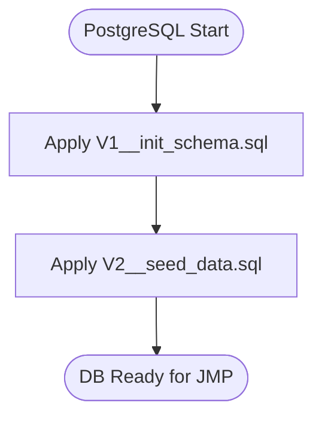
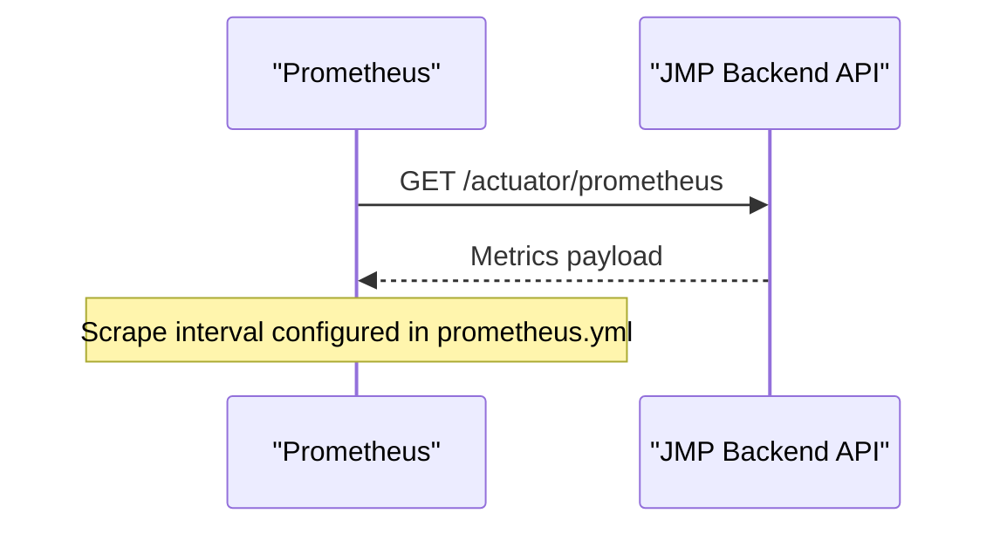
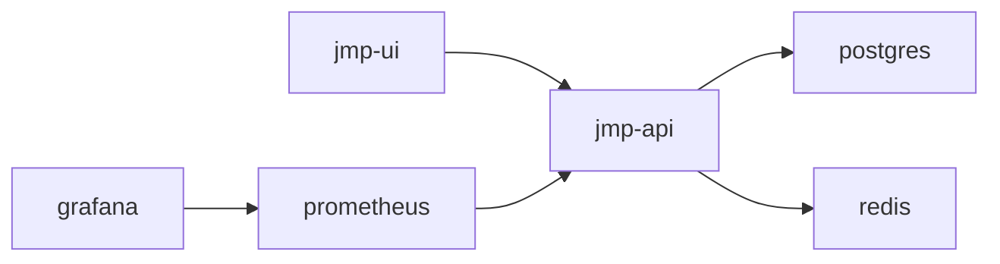

# Deployment and DevOps

<cite>
**Referenced Files in This Document**
- [Dockerfile](file://Dockerfile)
- [docker-compose.yml](file://docker-compose.yml)
- [application.yml](file://jmp-web/src/main/resources/application.yml)
- [prometheus.yml](file://monitoring/prometheus.yml)
- [datasources.yml](file://monitoring/grafana/datasources/datasources.yml)
- [jmp-ui/Dockerfile](file://jmp-ui/Dockerfile)
- [nginx.conf](file://jmp-ui/nginx.conf)
- [package.json](file://jmp-ui/package.json)
- [HELP.md](file://HELP.md)
- [V1__init_schema.sql](file://jmp-web/src/main/resources/db/migration/V1__init_schema.sql)
- [V2__seed_data.sql](file://jmp-web/src/main/resources/db/migration/V2__seed_data.sql)
</cite>

## Table of Contents
1. [Introduction](#introduction)
2. [Project Structure](#project-structure)
3. [Core Components](#core-components)
4. [Architecture Overview](#architecture-overview)
5. [Detailed Component Analysis](#detailed-component-analysis)
6. [Dependency Analysis](#dependency-analysis)
7. [Performance Considerations](#performance-considerations)
8. [Troubleshooting Guide](#troubleshooting-guide)
9. [Conclusion](#conclusion)
10. [Appendices](#appendices)

## Introduction
This document provides comprehensive deployment and DevOps guidance for the Jitsi Management Platform (JMP). It covers containerization strategies, multi-stage builds, Docker Compose orchestration, environment configuration, secrets management, infrastructure provisioning, CI/CD pipeline setup, automated testing, production deployment considerations, scaling and high availability, backup and disaster recovery, monitoring, operational procedures, security, network configuration, blue-green deployments, rolling updates, and rollback procedures. It also includes troubleshooting guidance for common deployment issues.

## Project Structure
The repository follows a multi-module Maven layout with a Spring Boot web application, supporting infrastructure services (PostgreSQL, Redis), a React-based UI, and monitoring stacks (Prometheus, Grafana). Docker images are built for the backend and frontend, orchestrated via Docker Compose.

**Diagram sources**
- [docker-compose.yml:1-129](file://docker-compose.yml#L1-L129)
- [application.yml:1-128](file://jmp-web/src/main/resources/application.yml#L1-L128)
- [prometheus.yml:1-23](file://monitoring/prometheus.yml#L1-L23)
- [datasources.yml:1-11](file://monitoring/grafana/datasources/datasources.yml#L1-L11)

**Section sources**
- [docker-compose.yml:1-129](file://docker-compose.yml#L1-L129)
- [Dockerfile:1-54](file://Dockerfile#L1-L54)
- [jmp-ui/Dockerfile:1-33](file://jmp-ui/Dockerfile#L1-L33)

## Core Components
- Backend API: Multi-module Spring Boot application packaged as a single JAR, exposed on port 8080, with health checks and Prometheus metrics.
- Frontend: React SPA built with Vite and served via Nginx, exposing port 80 inside the container and proxied to the backend API.
- Database: PostgreSQL 16 with Flyway migrations and seed data.
- Cache: Redis 7 for session and rate-limiting state.
- Monitoring: Prometheus scraping backend metrics and Grafana for dashboards.

**Section sources**
- [Dockerfile:1-54](file://Dockerfile#L1-L54)
- [docker-compose.yml:44-86](file://docker-compose.yml#L44-L86)
- [application.yml:12-128](file://jmp-web/src/main/resources/application.yml#L12-L128)
- [prometheus.yml:18-22](file://monitoring/prometheus.yml#L18-L22)
- [datasources.yml:4-10](file://monitoring/grafana/datasources/datasources.yml#L4-L10)

## Architecture Overview
The deployment architecture uses Docker Compose to run the backend, frontend, database, cache, and monitoring stack in isolated containers connected via a shared bridge network. The frontend proxies API calls to the backend, while Prometheus scrapes metrics from the backend’s Actuator endpoints.

**Diagram sources**
- [docker-compose.yml:6-129](file://docker-compose.yml#L6-L129)
- [nginx.conf:24-35](file://jmp-ui/nginx.conf#L24-L35)
- [prometheus.yml:18-22](file://monitoring/prometheus.yml#L18-L22)
- [datasources.yml:4-10](file://monitoring/grafana/datasources/datasources.yml#L4-L10)

## Detailed Component Analysis

### Backend API Containerization
- Multi-stage build: JDK for building, JRE for runtime; non-root user; health check; exposed port 8080; entrypoint runs the packaged JAR.
- Environment configuration is externalized via Spring profiles and environment variables for database URL, credentials, Redis URL, and JWT secrets.
- Health checks rely on Spring Boot Actuator endpoints.

**Diagram sources**
- [Dockerfile:4-53](file://Dockerfile#L4-L53)

**Section sources**
- [Dockerfile:1-54](file://Dockerfile#L1-L54)
- [application.yml:9-128](file://jmp-web/src/main/resources/application.yml#L9-L128)

### Frontend Containerization
- Multi-stage build: Node Alpine for build, Nginx Alpine for serving; copies built assets and custom Nginx config; exposes port 80.
- Nginx proxy configuration forwards API requests to the backend and serves static assets with caching and client-side routing support.

**Diagram sources**
- [jmp-ui/Dockerfile:4-32](file://jmp-ui/Dockerfile#L4-L32)
- [nginx.conf:1-37](file://jmp-ui/nginx.conf#L1-L37)

**Section sources**
- [jmp-ui/Dockerfile:1-33](file://jmp-ui/Dockerfile#L1-L33)
- [nginx.conf:1-37](file://jmp-ui/nginx.conf#L1-L37)
- [package.json:1-39](file://jmp-ui/package.json#L1-L39)

### Database and Migration Strategy
- PostgreSQL 16 configured via environment variables in Compose.
- Flyway migrations are enabled and point to SQL scripts under resources/db/migration.
- Initial schema and seed data are included to bootstrap the platform.

**Diagram sources**
- [V1__init_schema.sql:1-172](file://jmp-web/src/main/resources/db/migration/V1__init_schema.sql#L1-L172)
- [V2__seed_data.sql:1-131](file://jmp-web/src/main/resources/db/migration/V2__seed_data.sql#L1-L131)

**Section sources**
- [docker-compose.yml:8-26](file://docker-compose.yml#L8-L26)
- [application.yml:39-44](file://jmp-web/src/main/resources/application.yml#L39-L44)
- [V1__init_schema.sql:1-172](file://jmp-web/src/main/resources/db/migration/V1__init_schema.sql#L1-L172)
- [V2__seed_data.sql:1-131](file://jmp-web/src/main/resources/db/migration/V2__seed_data.sql#L1-L131)

### Monitoring Stack
- Prometheus scrapes the backend’s Actuator metrics endpoint at a 5-second interval.
- Grafana is provisioned with a Prometheus datasource pointing to the Prometheus service.

**Diagram sources**
- [prometheus.yml:18-22](file://monitoring/prometheus.yml#L18-L22)
- [application.yml:92-112](file://jmp-web/src/main/resources/application.yml#L92-L112)

**Section sources**
- [prometheus.yml:1-23](file://monitoring/prometheus.yml#L1-L23)
- [datasources.yml:1-11](file://monitoring/grafana/datasources/datasources.yml#L1-L11)
- [application.yml:92-112](file://jmp-web/src/main/resources/application.yml#L92-L112)

## Dependency Analysis
- Backend depends on PostgreSQL and Redis; Compose ensures health checks pass before starting dependent services.
- Frontend depends on backend for API access; Nginx proxy configuration defines the routing.
- Monitoring depends on backend metrics exposure.

**Diagram sources**
- [docker-compose.yml:44-118](file://docker-compose.yml#L44-L118)

**Section sources**
- [docker-compose.yml:59-71](file://docker-compose.yml#L59-L71)
- [nginx.conf:24-35](file://jmp-ui/nginx.conf#L24-L35)

## Performance Considerations
- Backend connection pooling and Redis client configuration are tuned for concurrency and responsiveness.
- Compression and caching are enabled for frontend assets.
- Metrics and health checks are configured to detect degraded performance early.

**Section sources**
- [application.yml:17-56](file://jmp-web/src/main/resources/application.yml#L17-L56)
- [nginx.conf:7-17](file://jmp-ui/nginx.conf#L7-L17)

## Troubleshooting Guide
Common deployment issues and resolutions:
- Backend fails to start due to database unavailability:
  - Verify database health check passes and credentials match Compose environment.
  - Confirm Flyway migrations ran successfully.
- Frontend cannot reach API:
  - Ensure Nginx proxy configuration routes /api/* to the backend service name and port.
  - Check network connectivity between services using the shared Compose network.
- Metrics not visible in Grafana:
  - Confirm Prometheus scrape configuration targets the backend service and port.
  - Validate Actuator metrics exposure and endpoint accessibility.
- Health checks failing:
  - Review container health check commands and intervals.
  - Inspect backend logs for initialization errors.

**Section sources**
- [docker-compose.yml:19-23](file://docker-compose.yml#L19-L23)
- [docker-compose.yml:66-71](file://docker-compose.yml#L66-L71)
- [application.yml:92-112](file://jmp-web/src/main/resources/application.yml#L92-L112)
- [prometheus.yml:18-22](file://monitoring/prometheus.yml#L18-L22)
- [nginx.conf:24-35](file://jmp-ui/nginx.conf#L24-L35)

## Conclusion
The Jitsi Management Platform provides a robust, container-native foundation for development and production. The multi-stage Docker builds, Compose orchestration, externalized configuration, and integrated monitoring enable reliable deployments. Production hardening, CI/CD automation, and operational playbooks further strengthen reliability and security.

## Appendices

### Environment Configuration and Secrets Management
- Externalized configuration:
  - Spring profiles and environment variables control database URL, credentials, Redis URL, JWT secrets, and server port.
  - Compose sets environment variables for the backend service.
- Secrets management:
  - Current configuration embeds secrets in Compose; for production, integrate with a secrets manager (e.g., HashiCorp Vault) and inject via environment variables or mounted files.
- Configuration validation:
  - Use Spring’s validation for configuration properties and fail-fast startup on missing values.

**Section sources**
- [application.yml:9-128](file://jmp-web/src/main/resources/application.yml#L9-L128)
- [docker-compose.yml:49-56](file://docker-compose.yml#L49-L56)
- [HELP.md](file://HELP.md#L18.1-L18.5)

### CI/CD Pipeline Setup
- Recommended stages:
  - Lint, Build, Test, Security scan, Docker build, push, deploy to staging, E2E tests, deploy to production.
- Artifact management:
  - Immutable container images with SBOM generation.
- Rollbacks:
  - Automatic rollback on failed health checks; canary deployments and feature flags for controlled rollouts.

**Section sources**
- [HELP.md:153-163](file://HELP.md#L153-L163)
- [Dockerfile:1-54](file://Dockerfile#L1-L54)
- [docker-compose.yml:1-129](file://docker-compose.yml#L1-L129)

### Production Deployment Considerations
- Scaling:
  - Stateless backend nodes behind a load balancer; autoscaling groups for horizontal growth.
  - Redis clustering for cache redundancy and throughput.
- High availability:
  - Multi-AZ deployment; active-passive for critical components; heartbeat monitoring.
- Backup and disaster recovery:
  - PostgreSQL logical backups and point-in-time recovery; regular restore drills; retention policies for backups.
- Security:
  - Network segmentation, firewall rules, TLS termination at ingress; least privilege access; secrets rotation; audit logging.

**Section sources**
- [HELP.md:17-18](file://HELP.md#L17-L18)
- [HELP.md:201-211](file://HELP.md#L201-L211)
- [HELP.md:93-103](file://HELP.md#L93-L103)

### Blue-Green Deployments and Rolling Updates
- Blue-green:
  - Maintain two identical environments; switch traffic after validation.
- Rolling updates:
  - Gradual replacement with health checks and rollback on failure.
- Rollback procedures:
  - Restore previous image tag; revert configuration changes; validate metrics and logs.

**Section sources**
- [HELP.md:159-163](file://HELP.md#L159-L163)

### Monitoring and Operational Procedures
- Metrics:
  - Enable Prometheus metrics and configure Grafana dashboards for business and infrastructure metrics.
- Alerting:
  - Threshold-based rules with routing to notification channels; suppression windows during maintenance.
- Operational runbooks:
  - Document deployment tracking, correlation with error rates, and automatic alert suppression during rollouts.

**Section sources**
- [prometheus.yml:1-23](file://monitoring/prometheus.yml#L1-L23)
- [datasources.yml:1-11](file://monitoring/grafana/datasources/datasources.yml#L1-L11)
- [HELP.md:129-140](file://HELP.md#L129-L140)
- [HELP.md](file://HELP.md#L13.9-L13.10)

### Network Configuration and Firewall Rules
- Ingress:
  - Nginx/Traefik reverse proxy with TLS termination and rate limiting.
- Internal:
  - Services communicate over a dedicated Compose network; restrict external exposure to necessary ports.
- Firewalls:
  - Allow inbound HTTPS/TLS to the proxy; restrict database and cache ports to internal network; permit Prometheus scraping.

**Section sources**
- [HELP.md:34-36](file://HELP.md#L34-L36)
- [docker-compose.yml:126-129](file://docker-compose.yml#L126-L129)