# Docker Configuration

<cite>
**Referenced Files in This Document**
- [Dockerfile](file://Dockerfile)
- [docker-compose.yml](file://docker-compose.yml)
- [application.yml](file://jmp-web/src/main/resources/application.yml)
- [nginx.conf](file://jmp-ui/nginx.conf)
- [Dockerfile](file://jmp-ui/Dockerfile)
- [package.json](file://jmp-ui/package.json)
- [prometheus.yml](file://monitoring/prometheus.yml)
- [datasources.yml](file://monitoring/grafana/datasources/datasources.yml)
- [pom.xml](file://pom.xml)
</cite>

## Update Summary
**Changes Made**
- Added comprehensive documentation for Jitsi Meet services (jitsi-web, jitsi-prosody, jitsi-jicofo, jitsi-jvb)
- Documented MinIO object storage integration with S3-compatible API
- Expanded environment variable configuration for Jitsi services
- Added health checks for all new services
- Updated service dependencies and inter-service communication
- Enhanced monitoring configuration for Jitsi components
- Updated architecture diagrams to reflect the expanded stack

## Table of Contents
1. [Introduction](#introduction)
2. [Project Structure](#project-structure)
3. [Core Components](#core-components)
4. [Architecture Overview](#architecture-overview)
5. [Detailed Component Analysis](#detailed-component-analysis)
6. [Dependency Analysis](#dependency-analysis)
7. [Performance Considerations](#performance-considerations)
8. [Troubleshooting Guide](#troubleshooting-guide)
9. [Conclusion](#conclusion)
10. [Appendices](#appendices)

## Introduction
This document provides comprehensive Docker configuration guidance for the Jitsi Management Platform (JMP). The platform now includes a complete Jitsi Meet stack with web interface, XMPP server, conference focus, video bridge, and MinIO object storage, alongside the existing backend and frontend services. It covers multi-stage builds for both backend and frontend, Docker Compose orchestration, environment variable configuration, secrets management, external service integration, health checks, resource limits, logging, best practices, and deployment automation.

## Project Structure
The repository organizes the platform into a multi-module Maven build with dedicated backend and frontend components, plus monitoring infrastructure and the complete Jitsi Meet stack. Docker artifacts are provided at the root for the backend and within the frontend module for the UI.

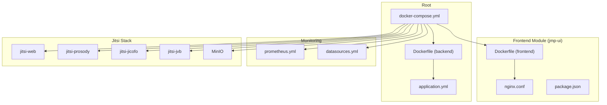

**Diagram sources**
- [Dockerfile:1-54](file://Dockerfile#L1-L54)
- [docker-compose.yml:1-342](file://docker-compose.yml#L1-L342)
- [application.yml:1-128](file://jmp-web/src/main/resources/application.yml#L1-L128)
- [Dockerfile:1-33](file://jmp-ui/Dockerfile#L1-L33)
- [nginx.conf:1-37](file://jmp-ui/nginx.conf#L1-L37)
- [package.json:1-39](file://jmp-ui/package.json#L1-L39)
- [prometheus.yml:1-23](file://monitoring/prometheus.yml#L1-L23)
- [datasources.yml:1-11](file://monitoring/grafana/datasources/datasources.yml#L1-L11)

**Section sources**
- [Dockerfile:1-54](file://Dockerfile#L1-L54)
- [docker-compose.yml:1-342](file://docker-compose.yml#L1-L342)
- [application.yml:1-128](file://jmp-web/src/main/resources/application.yml#L1-L128)
- [Dockerfile:1-33](file://jmp-ui/Dockerfile#L1-L33)
- [nginx.conf:1-37](file://jmp-ui/nginx.conf#L1-L37)
- [package.json:1-39](file://jmp-ui/package.json#L1-L39)
- [prometheus.yml:1-23](file://monitoring/prometheus.yml#L1-L23)
- [datasources.yml:1-11](file://monitoring/grafana/datasources/datasources.yml#L1-L11)

## Core Components
- **Backend service (Spring Boot)**: Multi-stage Docker build with JDK for building and JRE for runtime, non-root user, health checks, and exposed port.
- **Frontend service (React + nginx)**: Multi-stage build with Node for building and nginx for serving static assets and proxying API requests.
- **Jitsi Web Interface**: Official Jitsi web container with JWT authentication, XMPP configuration, and recording support.
- **Jitsi Prosody XMPP Server**: Core XMPP server with JWT authentication, MUC domains, and BOSH endpoint configuration.
- **Jitsi Jicofo Conference Focus**: Conference management service coordinating participants and bridges.
- **Jitsi JVB Video Bridge**: Media processing and forwarding service with STUN server configuration.
- **MinIO Object Storage**: S3-compatible object storage for recordings and transcripts.
- **Supporting services**: PostgreSQL database, Redis cache, Prometheus metrics, and Grafana dashboards.
- **Orchestration**: Single docker-compose file defining services, networks, volumes, and inter-service dependencies.

Key configuration touchpoints:
- Environment variables for database, Redis, JWT secrets, API base URL, and Jitsi service configuration.
- Health checks for database, cache, backend services, and Jitsi components.
- Persistent volumes for databases, caches, and Jitsi configuration/data.
- Monitoring stack integrated with Spring Boot Actuator and Jitsi services.

**Section sources**
- [Dockerfile:1-54](file://Dockerfile#L1-L54)
- [docker-compose.yml:1-342](file://docker-compose.yml#L1-L342)
- [application.yml:1-128](file://jmp-web/src/main/resources/application.yml#L1-L128)
- [Dockerfile:1-33](file://jmp-ui/Dockerfile#L1-L33)
- [nginx.conf:1-37](file://jmp-ui/nginx.conf#L1-L37)
- [prometheus.yml:1-23](file://monitoring/prometheus.yml#L1-L23)
- [datasources.yml:1-11](file://monitoring/grafana/datasources/datasources.yml#L1-L11)

## Architecture Overview
The platform runs as a comprehensive multi-container application orchestrated by Docker Compose. The frontend proxies API requests to the backend, which connects to PostgreSQL and Redis. The Jitsi stack provides complete video conferencing capabilities with JWT authentication and S3-compatible storage for recordings. Monitoring integrates Prometheus and Grafana to collect and visualize metrics from all services.

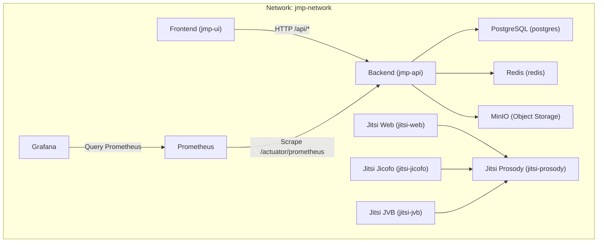

**Diagram sources**
- [docker-compose.yml:6-342](file://docker-compose.yml#L6-L342)
- [nginx.conf:24-35](file://jmp-ui/nginx.conf#L24-L35)
- [prometheus.yml:18-22](file://monitoring/prometheus.yml#L18-L22)
- [datasources.yml:4-10](file://monitoring/grafana/datasources/datasources.yml#L4-L10)

## Detailed Component Analysis

### Backend Service (Multi-stage Build)
- **Build stage**: Uses Eclipse Temurin 21 JDK Alpine to download Maven offline dependencies and compile the Spring Boot application across all modules.
- **Runtime stage**: Uses Eclipse Temurin 21 JRE Alpine, creates a non-root user, copies the built JAR, sets ownership, exposes port 8080, defines health checks, and starts with java -jar.
- **Environment variables configured in compose**: Spring profile, database URL/user/password, Redis URL, JWT secrets, S3 storage configuration, and Jitsi JWT configuration.

**Diagram sources**
- [Dockerfile:4-49](file://Dockerfile#L4-L49)

**Section sources**
- [Dockerfile:1-54](file://Dockerfile#L1-L54)
- [docker-compose.yml:44-82](file://docker-compose.yml#L44-L82)
- [application.yml:12-128](file://jmp-web/src/main/resources/application.yml#L12-L128)

### Frontend Service (React + nginx)
- **Build stage**: Node 20 Alpine installs dependencies and builds the React application.
- **Runtime stage**: nginx Alpine serves the built assets, enables gzip, sets long cache headers for static assets, handles client-side routing, and proxies API requests to the backend service.
- **Environment variable configures**: The API base URL for development.

**Diagram sources**
- [Dockerfile:4-32](file://jmp-ui/Dockerfile#L4-L32)
- [nginx.conf:1-37](file://jmp-ui/nginx.conf#L1-L37)

**Section sources**
- [Dockerfile:1-33](file://jmp-ui/Dockerfile#L1-L33)
- [nginx.conf:1-37](file://jmp-ui/nginx.conf#L1-L37)
- [docker-compose.yml:84-96](file://docker-compose.yml#L84-L96)
- [package.json:1-39](file://jmp-ui/package.json#L1-L39)

### Jitsi Web Interface Service
- **Base Image**: Official jitsi/web:stable container
- **Configuration**: Comprehensive environment variables for timezone, public URL, authentication, JWT settings, XMPP domains, and web-specific features
- **Volumes**: Config directory, certificates, and transcripts storage
- **Ports**: 8443 for HTTPS web interface, 80 for HTTP redirect
- **Dependencies**: Depends on jitsi-prosody XMPP server
- **Features**: Lobby system, prejoin page, welcome page, and recording support

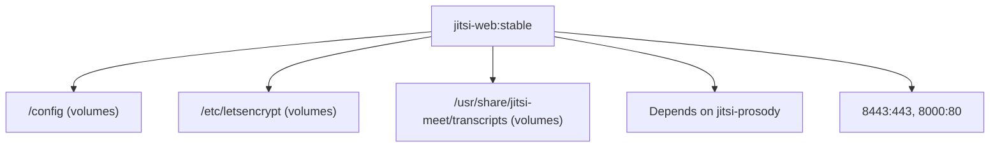

**Diagram sources**
- [docker-compose.yml:151-193](file://docker-compose.yml#L151-L193)

**Section sources**
- [docker-compose.yml:151-193](file://docker-compose.yml#L151-L193)

### Jitsi Prosody XMPP Server
- **Base Image**: Official jitsi/prosody:stable container
- **Configuration**: Complete XMPP server setup with JWT authentication, MUC domains, BOSH endpoint, and service credentials
- **Volumes**: Config directory and custom plugins
- **Exposure**: Port 5222 for XMPP connections
- **Dependencies**: No explicit dependencies, serves as foundation for other Jitsi services

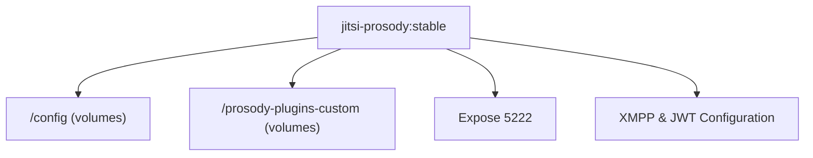

**Diagram sources**
- [docker-compose.yml:195-235](file://docker-compose.yml#L195-L235)

**Section sources**
- [docker-compose.yml:195-235](file://docker-compose.yml#L195-L235)

### Jitsi Jicofo Conference Focus
- **Base Image**: Official jitsi/jicofo:stable container
- **Configuration**: Conference management with JWT authentication, MUC domains, and service credentials
- **Volumes**: Config directory for persistent settings
- **Dependencies**: Depends on jitsi-prosody XMPP server
- **Function**: Coordinates participants and manages conference lifecycle

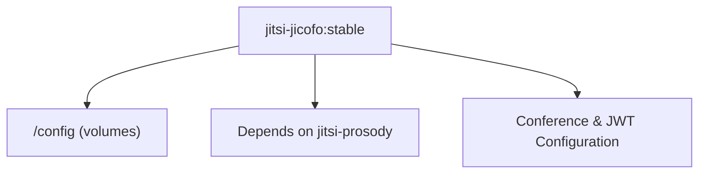

**Diagram sources**
- [docker-compose.yml:237-276](file://docker-compose.yml#L237-L276)

**Section sources**
- [docker-compose.yml:237-276](file://docker-compose.yml#L237-L276)

### Jitsi JVB Video Bridge
- **Base Image**: Official jitsi/jvb:stable container
- **Configuration**: Media processing with STUN server, UDP port configuration, and service credentials
- **Volumes**: Config directory for bridge settings
- **Ports**: 10000/udp for media streams
- **Dependencies**: Depends on jitsi-prosody XMPP server
- **Features**: STUN server integration, TCP harvester configuration

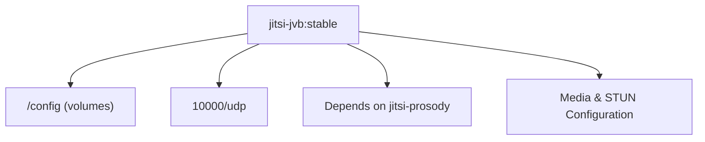

**Diagram sources**
- [docker-compose.yml:278-323](file://docker-compose.yml#L278-L323)

**Section sources**
- [docker-compose.yml:278-323](file://docker-compose.yml#L278-L323)

### MinIO Object Storage Service
- **Base Image**: Official minio/minio:latest container
- **Configuration**: Root user/password authentication, console address, and S3-compatible API
- **Volumes**: Data directory for persistent storage
- **Ports**: 9000 for S3 API, 9001 for console
- **Health Check**: Live endpoint monitoring
- **Integration**: Used for Jitsi recordings and general object storage

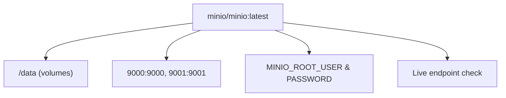

**Diagram sources**
- [docker-compose.yml:130-149](file://docker-compose.yml#L130-L149)

**Section sources**
- [docker-compose.yml:130-149](file://docker-compose.yml#L130-L149)

### Supporting Services
- **PostgreSQL**: Named container with persistent volume, health check using pg_isready, and mapped port 5432.
- **Redis**: Named container with persistent volume, health check using redis-cli ping, and mapped port 6379.
- **Prometheus**: Scrape jobs for itself and the backend service, mounted configuration and TSDB data volume.
- **Grafana**: Admin password set via environment variable, provisioned dashboards and datasources, depends on Prometheus.

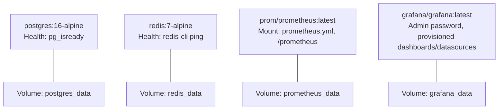

**Diagram sources**
- [docker-compose.yml:8-41](file://docker-compose.yml#L8-L41)
- [docker-compose.yml:98-128](file://docker-compose.yml#L98-L128)
- [prometheus.yml:1-23](file://monitoring/prometheus.yml#L1-L23)
- [datasources.yml:4-10](file://monitoring/grafana/datasources/datasources.yml#L4-L10)

**Section sources**
- [docker-compose.yml:1-342](file://docker-compose.yml#L1-L342)
- [prometheus.yml:1-23](file://monitoring/prometheus.yml#L1-L23)
- [datasources.yml:1-11](file://monitoring/grafana/datasources/datasources.yml#L1-L11)

### Inter-service Communication and Load Balancing
- **Frontend to Backend**: Frontend communicates with the backend via HTTP proxy to the backend service name on port 8080.
- **Backend to Jitsi**: Backend resolves Jitsi services via service names within the Docker network for conference management.
- **Jitsi Internal Communication**: Jitsi services communicate internally through prosody XMPP server.
- **Backend to Storage**: Backend uses MinIO S3-compatible API for recording storage.
- **Database and Cache**: Backend resolves database and Redis via service names within the Docker network.
- **No explicit load balancer**: Scaling is achieved by running multiple replicas of services (compose supports replica counts).

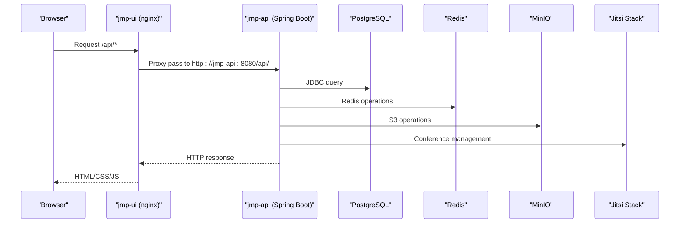

**Diagram sources**
- [nginx.conf:24-35](file://jmp-ui/nginx.conf#L24-L35)
- [docker-compose.yml:44-82](file://docker-compose.yml#L44-L82)

**Section sources**
- [nginx.conf:1-37](file://jmp-ui/nginx.conf#L1-L37)
- [docker-compose.yml:84-96](file://docker-compose.yml#L84-L96)

### Environment Variables and Secrets Management
- **Backend environment variables**: Spring profile, database URL/user/password, Redis URL, JWT access/refresh secrets, S3 storage configuration, and Jitsi JWT configuration.
- **Frontend environment variable**: Configures the API base URL for development.
- **Jitsi environment variables**: Comprehensive configuration for timezone, public URL, authentication, JWT settings, XMPP domains, and service credentials.
- **MinIO environment variables**: Root user/password for S3-compatible API.
- **Monitoring services**: Use environment variables for admin credentials and provisioning.
- **Recommendations**:
  - Replace hardcoded secrets with Docker secrets or external secret managers.
  - Use environment files or CI/CD variable injection for production deployments.
  - Restrict permissions on secret files and mount them read-only.

**Section sources**
- [docker-compose.yml:49-82](file://docker-compose.yml#L49-L82)
- [docker-compose.yml:155-182](file://docker-compose.yml#L155-L182)
- [docker-compose.yml:199-227](file://docker-compose.yml#L199-L227)
- [docker-compose.yml:241-270](file://docker-compose.yml#L241-L270)
- [docker-compose.yml:282-315](file://docker-compose.yml#L282-L315)
- [docker-compose.yml:134-136](file://docker-compose.yml#L134-L136)
- [application.yml:12-128](file://jmp-web/src/main/resources/application.yml#L12-L128)

### Health Checks and Observability
- **Backend**: HTTP health probe against /actuator/health.
- **Database**: pg_isready health check.
- **Cache**: redis-cli ping health check.
- **MinIO**: Live endpoint health check.
- **Jitsi Services**: Each service has appropriate health checks and dependencies.
- **Metrics**: Prometheus scraping backend /actuator/prometheus.
- **Logging**: Structured JSON console logging with trace ID correlation.

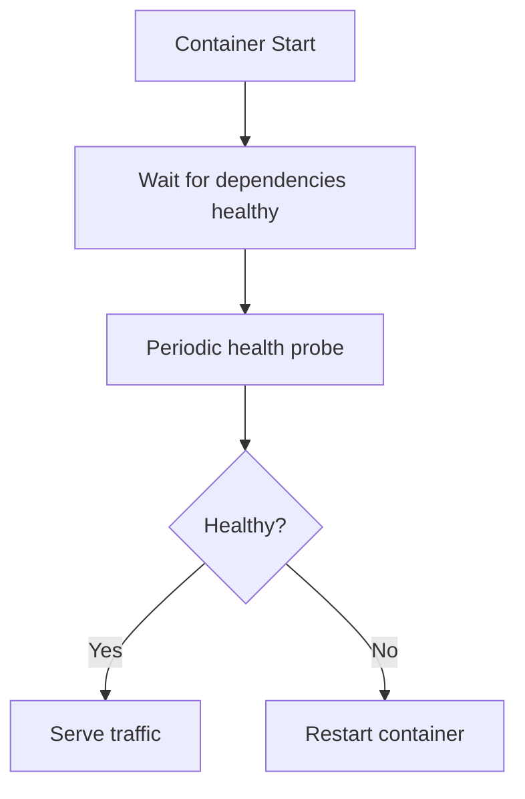

**Diagram sources**
- [Dockerfile:47-49](file://Dockerfile#L47-L49)
- [docker-compose.yml:19-23](file://docker-compose.yml#L19-L23)
- [docker-compose.yml:35-39](file://docker-compose.yml#L35-L39)
- [docker-compose.yml:143-147](file://docker-compose.yml#L143-L147)
- [docker-compose.yml:76-81](file://docker-compose.yml#L76-L81)
- [prometheus.yml:18-22](file://monitoring/prometheus.yml#L18-L22)
- [application.yml:92-112](file://jmp-web/src/main/resources/application.yml#L92-L112)

**Section sources**
- [Dockerfile:47-49](file://Dockerfile#L47-L49)
- [docker-compose.yml:19-23](file://docker-compose.yml#L19-L23)
- [docker-compose.yml:35-39](file://docker-compose.yml#L35-L39)
- [docker-compose.yml:143-147](file://docker-compose.yml#L143-L147)
- [docker-compose.yml:76-81](file://docker-compose.yml#L76-L81)
- [prometheus.yml:18-22](file://monitoring/prometheus.yml#L18-L22)
- [application.yml:92-112](file://jmp-web/src/main/resources/application.yml#L92-L112)

### Resource Limits and Security Considerations
- **Runtime images**: Use minimal Alpine base and JRE for smaller footprint.
- **Non-root user**: Created and used for the backend runtime.
- **Health checks**: Reduce downtime by detecting unhealthy states early.
- **Jitsi Security**: JWT authentication for all Jitsi services, proper credential management.
- **MinIO Security**: Root credentials for S3-compatible API, consider production hardening.
- **Recommendations**:
  - Add CPU/memory limits and restart policies in production.
  - Enable read-only root filesystem and drop unnecessary capabilities.
  - Use network policies to restrict inter-service access.
  - Scan images for vulnerabilities regularly.
  - Implement proper SSL/TLS for production deployments.

**Section sources**
- [Dockerfile:32-49](file://Dockerfile#L32-L49)
- [Dockerfile:21-32](file://jmp-ui/Dockerfile#L21-L32)
- [docker-compose.yml:155-167](file://docker-compose.yml#L155-L167)
- [docker-compose.yml:134-136](file://docker-compose.yml#L134-L136)

### Container Registry Integration and Image Versioning
- **Current compose**: Builds images locally; integrate with registries by specifying image names or build contexts.
- **Jitsi Images**: Official images from jitsi/docker-jitsi-meet repository.
- **Recommendations**:
  - Tag images with semantic versions or commit hashes.
  - Push images to a private registry for CI/CD pipelines.
  - Pin base image versions and use digest pinning for reproducibility.
  - Consider using specific stable tags for Jitsi components.

### Deployment Automation
- **CI/CD Integration**: Use CI/CD pipelines to build images, push to registry, and deploy via compose or Kubernetes.
- **Automated Health Checks**: Monitor all services including Jitsi components and storage.
- **Rollback Strategy**: Implement rollback on failures with proper health monitoring.
- **Environment Overrides**: Manage environment-specific overrides using compose override files.
- **Production Considerations**: Add proper SSL termination, load balancing, and scaling strategies.

## Dependency Analysis
The backend depends on PostgreSQL, Redis, and MinIO, while the frontend depends on the backend. The Jitsi stack has complex dependencies with prosody as the central XMPP server, and all Jitsi services depend on it. Monitoring depends on the backend for metrics and on Prometheus for scraping.

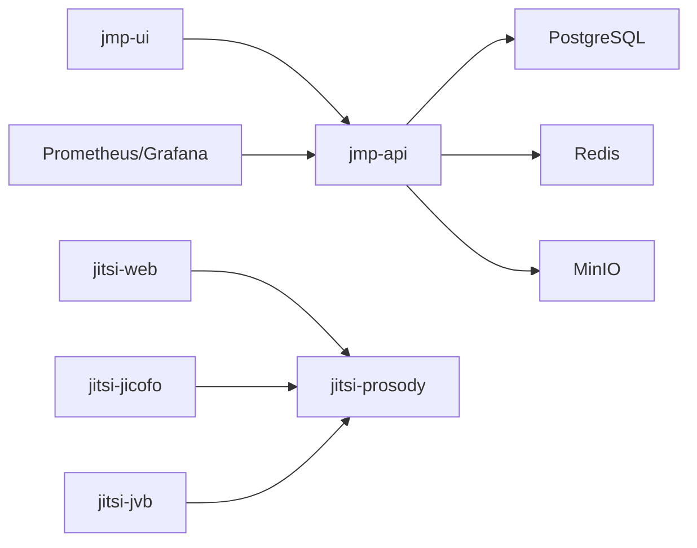

**Diagram sources**
- [docker-compose.yml:44-323](file://docker-compose.yml#L44-L323)

**Section sources**
- [docker-compose.yml:1-342](file://docker-compose.yml#L1-L342)

## Performance Considerations
- **Multi-stage builds**: Minimize final image size and attack surface across all services.
- **Nginx caching and gzip**: Improve frontend performance with compression and caching.
- **Database and Redis connection pooling**: Configured in application.yml for optimal performance.
- **Jitsi Optimization**: Proper STUN server configuration, UDP port exposure, and media processing optimization.
- **MinIO Performance**: S3-compatible API for scalable object storage.
- **Recommendations**:
  - Tune JVM heap and GC settings for backend.
  - Scale Redis and PostgreSQL based on workload.
  - Use CDN for static assets if serving externally.
  - Configure proper resource limits for Jitsi services.
  - Optimize database connection pools and Redis configuration.

## Troubleshooting Guide
Common issues and resolutions:
- **Health check failures**:
  - Verify database connectivity and credentials.
  - Confirm Redis is reachable and responding to ping.
  - Check backend logs for startup errors.
  - Validate Jitsi service dependencies and JWT configuration.
  - Ensure MinIO is accessible and credentials are correct.
- **Network connectivity**:
  - Ensure services are on the same Docker network.
  - Validate service names and ports in proxy configuration.
  - Check Jitsi service dependencies and XMPP connectivity.
- **Secrets and environment variables**:
  - Confirm environment variables are correctly passed in compose.
  - Rotate JWT secrets and update all deployments consistently.
  - Verify Jitsi JWT secrets match between services.
- **Jitsi-specific issues**:
  - Check prosody logs for XMPP connection problems.
  - Verify STUN server accessibility for JVB.
  - Ensure proper certificate configuration for web interface.
- **MinIO issues**:
  - Verify S3 endpoint accessibility and credentials.
  - Check bucket creation and permissions.
- **Monitoring**:
  - Verify Prometheus scrape configuration and target availability.
  - Check Grafana datasource configuration and dashboard provisioning.

**Section sources**
- [docker-compose.yml:49-82](file://docker-compose.yml#L49-L82)
- [docker-compose.yml:155-182](file://docker-compose.yml#L155-L182)
- [docker-compose.yml:199-227](file://docker-compose.yml#L199-L227)
- [docker-compose.yml:241-270](file://docker-compose.yml#L241-L270)
- [docker-compose.yml:282-315](file://docker-compose.yml#L282-L315)
- [docker-compose.yml:134-136](file://docker-compose.yml#L134-L136)
- [nginx.conf:24-35](file://jmp-ui/nginx.conf#L24-L35)
- [prometheus.yml:18-22](file://monitoring/prometheus.yml#L18-L22)
- [datasources.yml:4-10](file://monitoring/grafana/datasources/datasources.yml#L4-L10)

## Conclusion
The Jitsi Management Platform provides a comprehensive, multi-stage Docker configuration for both backend and frontend, complemented by a complete Jitsi Meet stack including web interface, XMPP server, conference focus, video bridge, and MinIO object storage. The platform integrates PostgreSQL, Redis, Prometheus, and Grafana for a fully observability-enabled environment. By following the outlined best practices for secrets, health checks, logging, and deployment automation, teams can achieve secure, observable, and scalable containerized deployments of a complete video conferencing platform.

## Appendices

### Backend Environment Variables Reference
- **SPRING_PROFILES_ACTIVE**: Active Spring profile (e.g., docker,dev).
- **DB_URL**: JDBC URL for PostgreSQL.
- **DB_USER**: Database user.
- **DB_PASS**: Database password.
- **REDIS_URL**: Redis host.
- **JWT_ACCESS_SECRET**: JWT access token secret.
- **JWT_REFRESH_SECRET**: JWT refresh token secret.
- **JMP_STORAGE_S3_BUCKET**: S3 bucket for recordings.
- **JMP_STORAGE_S3_REGION**: S3 region.
- **JMP_STORAGE_S3_ACCESS_KEY**: S3 access key.
- **JMP_STORAGE_S3_SECRET_KEY**: S3 secret key.
- **JMP_STORAGE_S3_ENDPOINT**: S3 endpoint URL.
- **JITSI_JWT_APP_ID**: Jitsi JWT application ID.
- **JITSI_JWT_APP_SECRET**: Jitsi JWT application secret.
- **JITSI_DOMAIN**: Jitsi domain configuration.

**Section sources**
- [docker-compose.yml:49-64](file://docker-compose.yml#L49-L64)
- [application.yml:12-128](file://jmp-web/src/main/resources/application.yml#L12-L128)

### Frontend Environment Variables Reference
- **VITE_API_URL**: Base URL for API requests during development.

**Section sources**
- [docker-compose.yml:89-90](file://docker-compose.yml#L89-L90)

### Jitsi Environment Variables Reference
- **General Settings**: Timezone, public URL, authentication, and guest configuration.
- **JWT Configuration**: Application ID, secret, accepted issuers, audiences, and validation settings.
- **XMPP Configuration**: Domain settings, BOSH URL, MUC domains, and service credentials.
- **Service Credentials**: Jicofo and JVB authentication settings.
- **JVB Specific**: Port configuration and STUN server settings.

**Section sources**
- [docker-compose.yml:155-182](file://docker-compose.yml#L155-L182)
- [docker-compose.yml:199-227](file://docker-compose.yml#L199-L227)
- [docker-compose.yml:241-270](file://docker-compose.yml#L241-L270)
- [docker-compose.yml:282-315](file://docker-compose.yml#L282-L315)

### MinIO Environment Variables Reference
- **MINIO_ROOT_USER**: Root user for S3-compatible API.
- **MINIO_ROOT_PASSWORD**: Root password for S3-compatible API.

**Section sources**
- [docker-compose.yml:134-136](file://docker-compose.yml#L134-L136)

### Monitoring Configuration Reference
- **Prometheus scrape jobs**: For itself and the backend service.
- **Grafana datasource**: Pointing to Prometheus.

**Section sources**
- [prometheus.yml:13-22](file://monitoring/prometheus.yml#L13-L22)
- [datasources.yml:4-10](file://monitoring/grafana/datasources/datasources.yml#L4-L10)

### Volume Configuration Reference
- **Persistent Volumes**: PostgreSQL, Redis, Prometheus, Grafana, MinIO, and Jitsi configuration/data volumes.
- **Volume Mounts**: For each service requiring persistent storage.

**Section sources**
- [docker-compose.yml:325-337](file://docker-compose.yml#L325-L337)