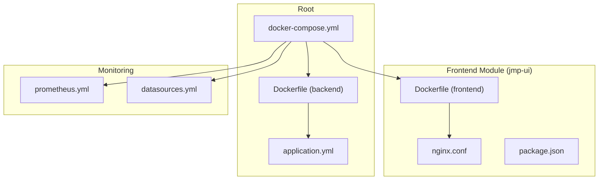
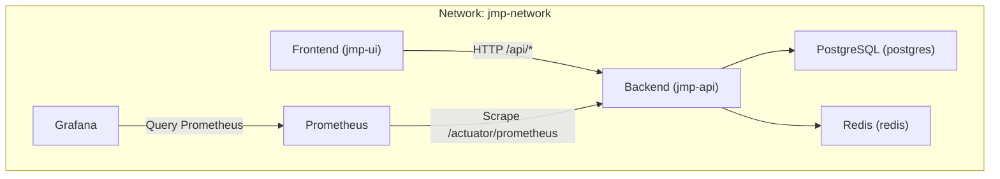
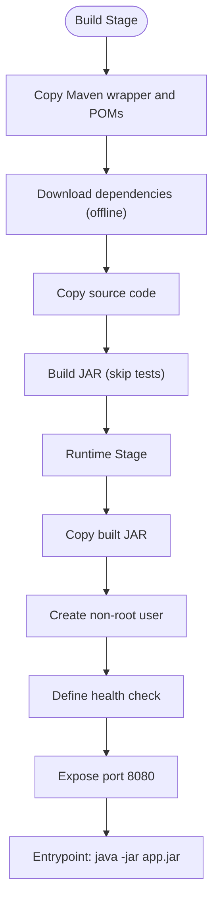
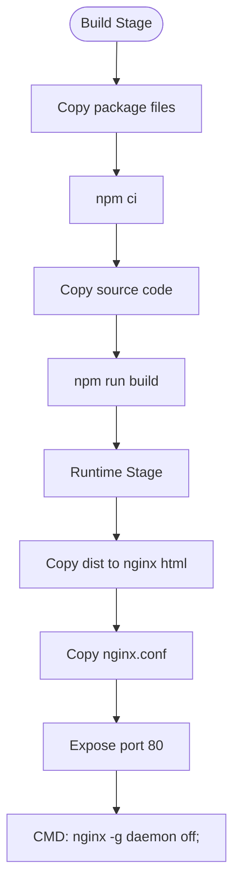
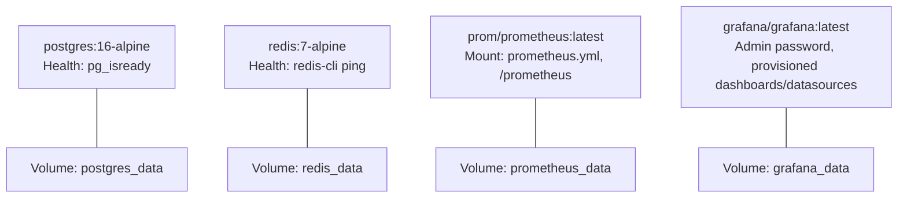
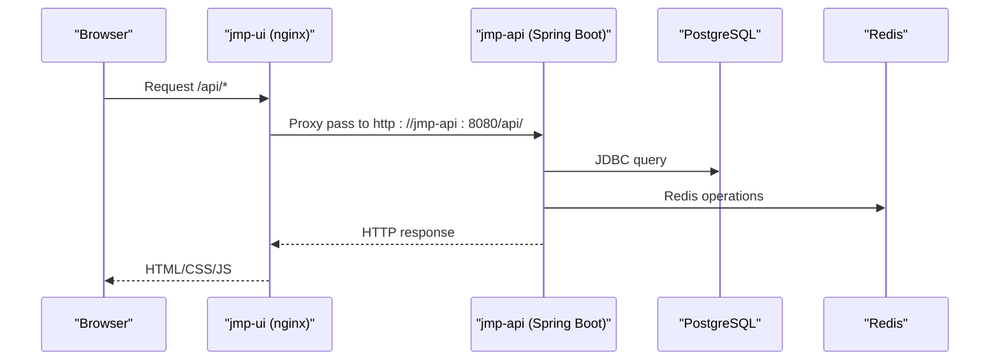
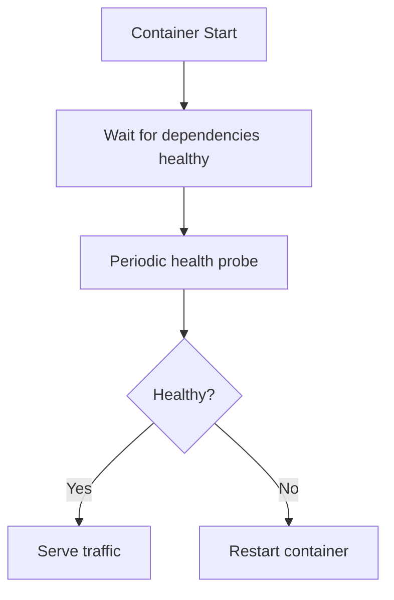
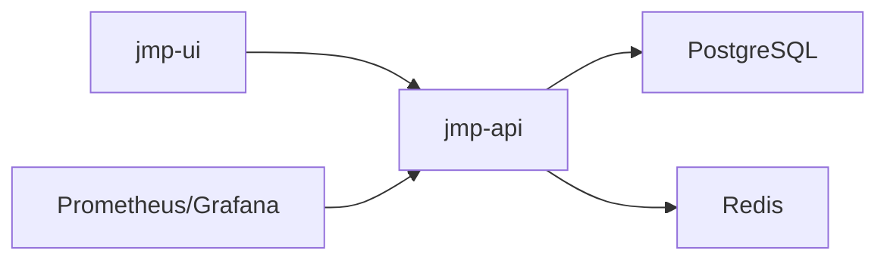

# Docker Configuration

<cite>
**Referenced Files in This Document**
- [Dockerfile](file://Dockerfile)
- [docker-compose.yml](file://docker-compose.yml)
- [application.yml](file://jmp-web/src/main/resources/application.yml)
- [nginx.conf](file://jmp-ui/nginx.conf)
- [Dockerfile](file://jmp-ui/Dockerfile)
- [package.json](file://jmp-ui/package.json)
- [prometheus.yml](file://monitoring/prometheus.yml)
- [datasources.yml](file://monitoring/grafana/datasources/datasources.yml)
- [pom.xml](file://pom.xml)
</cite>

## Table of Contents
1. [Introduction](#introduction)
2. [Project Structure](#project-structure)
3. [Core Components](#core-components)
4. [Architecture Overview](#architecture-overview)
5. [Detailed Component Analysis](#detailed-component-analysis)
6. [Dependency Analysis](#dependency-analysis)
7. [Performance Considerations](#performance-considerations)
8. [Troubleshooting Guide](#troubleshooting-guide)
9. [Conclusion](#conclusion)
10. [Appendices](#appendices)

## Introduction
This document provides comprehensive Docker configuration guidance for the Jitsi Management Platform (JMP). It covers multi-stage builds for both backend and frontend, Docker Compose orchestration, environment variable configuration, secrets management, external service integration, health checks, resource limits, logging, best practices, and deployment automation. The goal is to enable reliable, secure, and scalable containerized deployments of the platform.

## Project Structure
The repository organizes the platform into a multi-module Maven build with dedicated backend and frontend components, plus monitoring infrastructure. Docker artifacts are provided at the root for the backend and within the frontend module for the UI.

**Diagram sources**
- [Dockerfile:1-54](file://Dockerfile#L1-L54)
- [docker-compose.yml:1-129](file://docker-compose.yml#L1-L129)
- [application.yml:1-128](file://jmp-web/src/main/resources/application.yml#L1-L128)
- [Dockerfile:1-33](file://jmp-ui/Dockerfile#L1-L33)
- [nginx.conf:1-37](file://jmp-ui/nginx.conf#L1-L37)
- [package.json:1-39](file://jmp-ui/package.json#L1-L39)
- [prometheus.yml:1-23](file://monitoring/prometheus.yml#L1-L23)
- [datasources.yml:1-11](file://monitoring/grafana/datasources/datasources.yml#L1-L11)

**Section sources**
- [Dockerfile:1-54](file://Dockerfile#L1-L54)
- [docker-compose.yml:1-129](file://docker-compose.yml#L1-L129)
- [application.yml:1-128](file://jmp-web/src/main/resources/application.yml#L1-L128)
- [Dockerfile:1-33](file://jmp-ui/Dockerfile#L1-L33)
- [nginx.conf:1-37](file://jmp-ui/nginx.conf#L1-L37)
- [package.json:1-39](file://jmp-ui/package.json#L1-L39)
- [prometheus.yml:1-23](file://monitoring/prometheus.yml#L1-L23)
- [datasources.yml:1-11](file://monitoring/grafana/datasources/datasources.yml#L1-L11)

## Core Components
- Backend service (Spring Boot): Multi-stage Docker build with JDK for building and JRE for runtime, non-root user, health checks, and exposed port.
- Frontend service (React + nginx): Multi-stage build with Node for building and nginx for serving static assets and proxying API requests.
- Supporting services: PostgreSQL database, Redis cache, Prometheus metrics, and Grafana dashboards.
- Orchestration: Single docker-compose file defining services, networks, volumes, and inter-service dependencies.

Key configuration touchpoints:
- Environment variables for database, Redis, JWT secrets, and API base URL.
- Health checks for database, cache, and backend services.
- Persistent volumes for databases and caches.
- Monitoring stack integrated with Spring Boot Actuator.

**Section sources**
- [Dockerfile:1-54](file://Dockerfile#L1-L54)
- [docker-compose.yml:1-129](file://docker-compose.yml#L1-L129)
- [application.yml:1-128](file://jmp-web/src/main/resources/application.yml#L1-L128)
- [Dockerfile:1-33](file://jmp-ui/Dockerfile#L1-L33)
- [nginx.conf:1-37](file://jmp-ui/nginx.conf#L1-L37)
- [prometheus.yml:1-23](file://monitoring/prometheus.yml#L1-L23)
- [datasources.yml:1-11](file://monitoring/grafana/datasources/datasources.yml#L1-L11)

## Architecture Overview
The platform runs as a multi-container application orchestrated by Docker Compose. The frontend proxies API requests to the backend, which connects to PostgreSQL and Redis. Monitoring integrates Prometheus and Grafana to collect and visualize metrics from the backend.

**Diagram sources**
- [docker-compose.yml:6-129](file://docker-compose.yml#L6-L129)
- [nginx.conf:24-35](file://jmp-ui/nginx.conf#L24-L35)
- [prometheus.yml:18-22](file://monitoring/prometheus.yml#L18-L22)
- [datasources.yml:4-10](file://monitoring/grafana/datasources/datasources.yml#L4-L10)

## Detailed Component Analysis

### Backend Service (Multi-stage Build)
- Build stage: Uses Eclipse Temurin 21 JDK Alpine to download Maven offline dependencies and compile the Spring Boot application.
- Runtime stage: Uses Eclipse Temurin 21 JRE Alpine, creates a non-root user, copies the built JAR, sets ownership, exposes port 8080, defines health checks, and starts with java -jar.
- Environment variables configured in compose include Spring profile, database URL/user/password, Redis URL, and JWT secrets.

**Diagram sources**
- [Dockerfile:4-49](file://Dockerfile#L4-L49)

**Section sources**
- [Dockerfile:1-54](file://Dockerfile#L1-L54)
- [docker-compose.yml:44-72](file://docker-compose.yml#L44-L72)
- [application.yml:12-78](file://jmp-web/src/main/resources/application.yml#L12-L78)

### Frontend Service (React + nginx)
- Build stage: Node 20 Alpine installs dependencies and builds the React application.
- Runtime stage: nginx Alpine serves the built assets, enables gzip, sets long cache headers for static assets, handles client-side routing, and proxies API requests to the backend service.
- Environment variable configures the API base URL for development.

**Diagram sources**
- [Dockerfile:4-32](file://jmp-ui/Dockerfile#L4-L32)
- [nginx.conf:1-37](file://jmp-ui/nginx.conf#L1-L37)

**Section sources**
- [Dockerfile:1-33](file://jmp-ui/Dockerfile#L1-L33)
- [nginx.conf:1-37](file://jmp-ui/nginx.conf#L1-L37)
- [docker-compose.yml:74-86](file://docker-compose.yml#L74-L86)
- [package.json:1-39](file://jmp-ui/package.json#L1-L39)

### Supporting Services
- PostgreSQL: Named container with persistent volume, health check using pg_isready, and mapped port 5432.
- Redis: Named container with persistent volume, health check using redis-cli ping, and mapped port 6379.
- Prometheus: Scrape jobs for itself and the backend service, mounted configuration and TSDB data volume.
- Grafana: Admin password set via environment variable, provisioned dashboards and datasources, depends on Prometheus.

**Diagram sources**
- [docker-compose.yml:8-41](file://docker-compose.yml#L8-L41)
- [docker-compose.yml:89-118](file://docker-compose.yml#L89-L118)
- [prometheus.yml:1-23](file://monitoring/prometheus.yml#L1-L23)
- [datasources.yml:4-10](file://monitoring/grafana/datasources/datasources.yml#L4-L10)

**Section sources**
- [docker-compose.yml:1-129](file://docker-compose.yml#L1-L129)
- [prometheus.yml:1-23](file://monitoring/prometheus.yml#L1-L23)
- [datasources.yml:1-11](file://monitoring/grafana/datasources/datasources.yml#L1-L11)

### Inter-service Communication and Load Balancing
- Frontend communicates with the backend via HTTP proxy to the backend service name on port 8080.
- Backend resolves database and Redis via service names within the Docker network.
- No explicit load balancer is defined; scaling is achieved by running multiple replicas of services (compose supports replica counts).

**Diagram sources**
- [nginx.conf:24-35](file://jmp-ui/nginx.conf#L24-L35)
- [docker-compose.yml:44-72](file://docker-compose.yml#L44-L72)

**Section sources**
- [nginx.conf:1-37](file://jmp-ui/nginx.conf#L1-L37)
- [docker-compose.yml:74-86](file://docker-compose.yml#L74-L86)

### Environment Variables and Secrets Management
- Backend environment variables include Spring profile, database URL/user/password, Redis URL, JWT access/refresh secrets, and server port.
- Frontend environment variable configures the API base URL for development.
- Monitoring services use environment variables for admin credentials and provisioning.
- Recommendations:
  - Replace hardcoded secrets with Docker secrets or external secret managers.
  - Use environment files or CI/CD variable injection for production deployments.
  - Restrict permissions on secret files and mount them read-only.

**Section sources**
- [docker-compose.yml:49-86](file://docker-compose.yml#L49-L86)
- [application.yml:12-78](file://jmp-web/src/main/resources/application.yml#L12-L78)

### Health Checks and Observability
- Backend: HTTP health probe against /actuator/health.
- Database: pg_isready health check.
- Cache: redis-cli ping health check.
- Metrics: Prometheus scraping backend /actuator/prometheus.
- Logging: Structured JSON console logging with trace ID correlation.

**Diagram sources**
- [Dockerfile:47-49](file://Dockerfile#L47-L49)
- [docker-compose.yml:19-23](file://docker-compose.yml#L19-L23)
- [docker-compose.yml:35-39](file://docker-compose.yml#L35-L39)
- [docker-compose.yml:66-71](file://docker-compose.yml#L66-L71)
- [prometheus.yml:18-22](file://monitoring/prometheus.yml#L18-L22)
- [application.yml:92-112](file://jmp-web/src/main/resources/application.yml#L92-L112)

**Section sources**
- [Dockerfile:47-49](file://Dockerfile#L47-L49)
- [docker-compose.yml:19-23](file://docker-compose.yml#L19-L23)
- [docker-compose.yml:35-39](file://docker-compose.yml#L35-L39)
- [docker-compose.yml:66-71](file://docker-compose.yml#L66-L71)
- [prometheus.yml:18-22](file://monitoring/prometheus.yml#L18-L22)
- [application.yml:92-112](file://jmp-web/src/main/resources/application.yml#L92-L112)

### Resource Limits and Security Considerations
- Runtime images use minimal Alpine base and JRE for smaller footprint.
- Non-root user is created and used for the backend runtime.
- Health checks reduce downtime by detecting unhealthy states early.
- Recommendations:
  - Add CPU/memory limits and restart policies in production.
  - Enable read-only root filesystem and drop unnecessary capabilities.
  - Use network policies to restrict inter-service access.
  - Scan images for vulnerabilities regularly.

**Section sources**
- [Dockerfile:32-49](file://Dockerfile#L32-L49)
- [Dockerfile:21-32](file://jmp-ui/Dockerfile#L21-L32)

### Container Registry Integration and Image Versioning
- Current compose builds images locally; integrate with registries by specifying image names or build contexts.
- Recommendations:
  - Tag images with semantic versions or commit hashes.
  - Push images to a private registry for CI/CD pipelines.
  - Pin base image versions and use digest pinning for reproducibility.

[No sources needed since this section provides general guidance]

### Deployment Automation
- Use CI/CD pipelines to build images, push to registry, and deploy via compose or Kubernetes.
- Automate health checks and rollback on failures.
- Manage environment-specific overrides using compose override files.

[No sources needed since this section provides general guidance]

## Dependency Analysis
The backend depends on PostgreSQL and Redis, while the frontend depends on the backend. Monitoring depends on the backend for metrics and on Prometheus for scraping.

**Diagram sources**
- [docker-compose.yml:44-118](file://docker-compose.yml#L44-L118)

**Section sources**
- [docker-compose.yml:1-129](file://docker-compose.yml#L1-L129)

## Performance Considerations
- Multi-stage builds minimize final image size and attack surface.
- Nginx caching and gzip compression improve frontend performance.
- Database and Redis connection pooling configured in application.yml.
- Recommendations:
  - Tune JVM heap and GC settings for backend.
  - Scale Redis and PostgreSQL based on workload.
  - Use CDN for static assets if serving externally.

[No sources needed since this section provides general guidance]

## Troubleshooting Guide
Common issues and resolutions:
- Health check failures:
  - Verify database connectivity and credentials.
  - Confirm Redis is reachable and responding to ping.
  - Check backend logs for startup errors.
- Network connectivity:
  - Ensure services are on the same Docker network.
  - Validate service names and ports in proxy configuration.
- Secrets and environment variables:
  - Confirm environment variables are correctly passed in compose.
  - Rotate JWT secrets and update all deployments consistently.
- Monitoring:
  - Verify Prometheus scrape configuration and target availability.
  - Check Grafana datasource configuration and dashboard provisioning.

**Section sources**
- [docker-compose.yml:49-86](file://docker-compose.yml#L49-L86)
- [nginx.conf:24-35](file://jmp-ui/nginx.conf#L24-L35)
- [prometheus.yml:18-22](file://monitoring/prometheus.yml#L18-L22)
- [datasources.yml:4-10](file://monitoring/grafana/datasources/datasources.yml#L4-L10)

## Conclusion
The Jitsi Management Platform provides a robust, multi-stage Docker configuration for both backend and frontend, complemented by a Docker Compose orchestration that integrates PostgreSQL, Redis, Prometheus, and Grafana. By following the outlined best practices for secrets, health checks, logging, and deployment automation, teams can achieve secure, observable, and scalable containerized deployments.

## Appendices

### Backend Environment Variables Reference
- SPRING_PROFILES_ACTIVE: Active Spring profile (e.g., docker).
- DB_URL: JDBC URL for PostgreSQL.
- DB_USER: Database user.
- DB_PASS: Database password.
- REDIS_URL: Redis host.
- JWT_ACCESS_SECRET: JWT access token secret.
- JWT_REFRESH_SECRET: JWT refresh token secret.
- SERVER_PORT: HTTP server port (default 8080).

**Section sources**
- [docker-compose.yml:49-56](file://docker-compose.yml#L49-L56)
- [application.yml:12-78](file://jmp-web/src/main/resources/application.yml#L12-L78)

### Frontend Environment Variables Reference
- VITE_API_URL: Base URL for API requests during development.

**Section sources**
- [docker-compose.yml:79-80](file://docker-compose.yml#L79-L80)

### Monitoring Configuration Reference
- Prometheus scrape jobs for itself and the backend service.
- Grafana datasource pointing to Prometheus.

**Section sources**
- [prometheus.yml:13-22](file://monitoring/prometheus.yml#L13-L22)
- [datasources.yml:4-10](file://monitoring/grafana/datasources/datasources.yml#L4-L10)