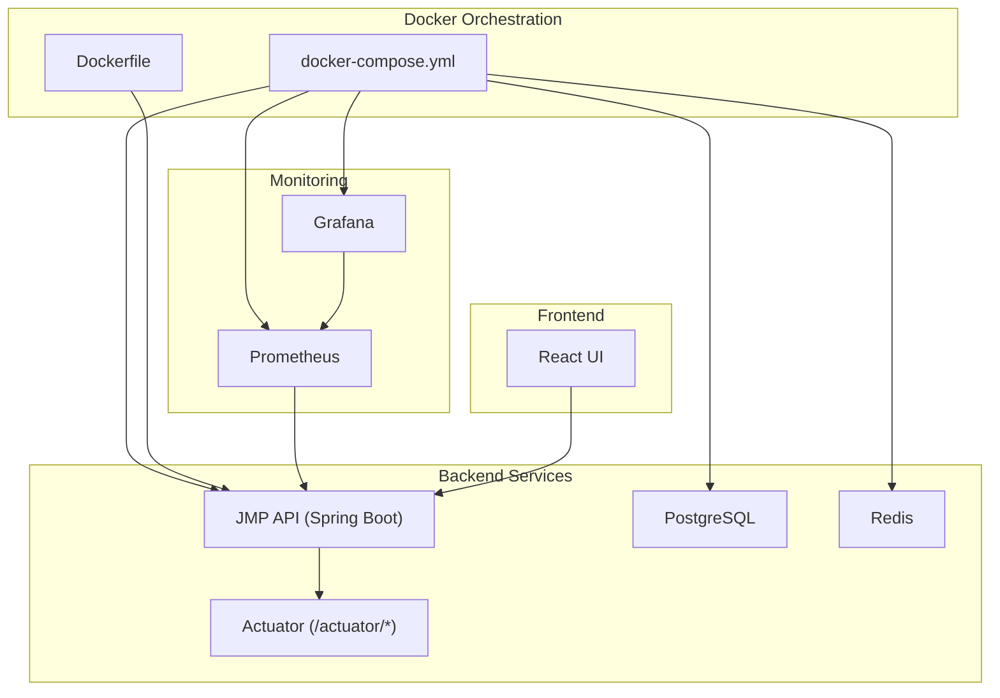
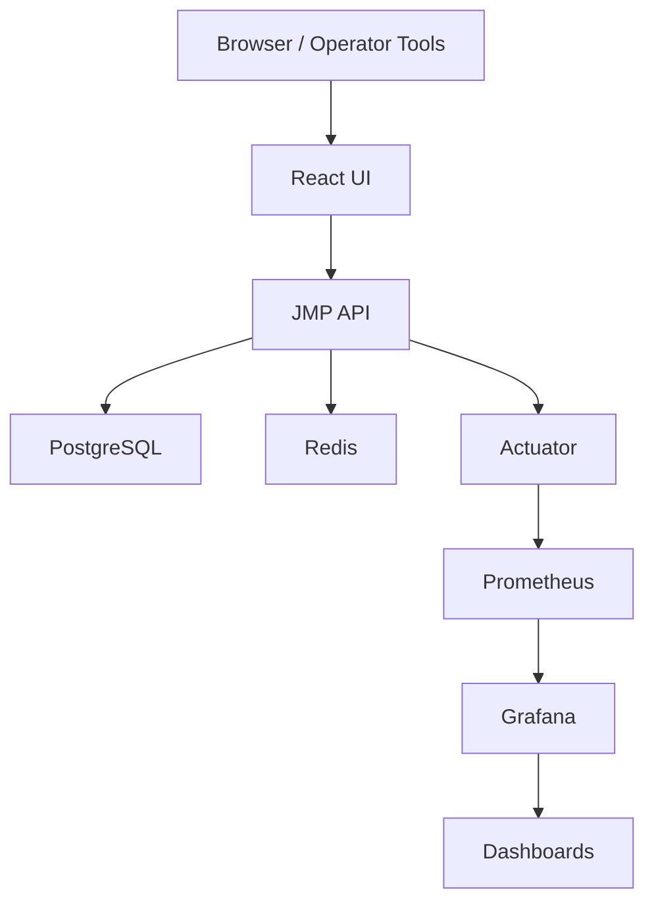
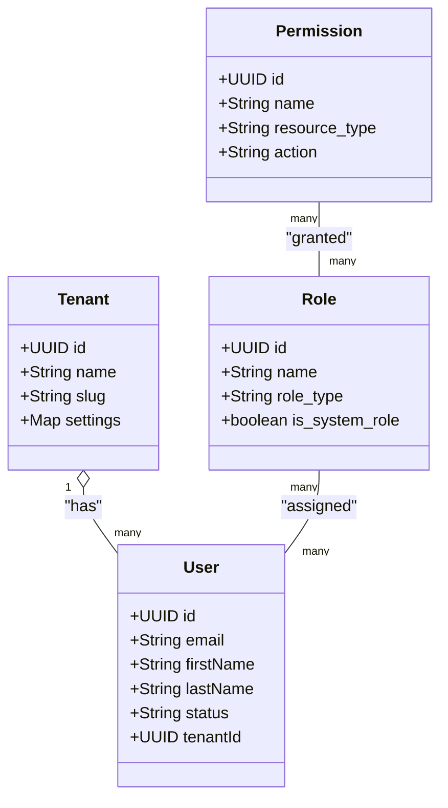
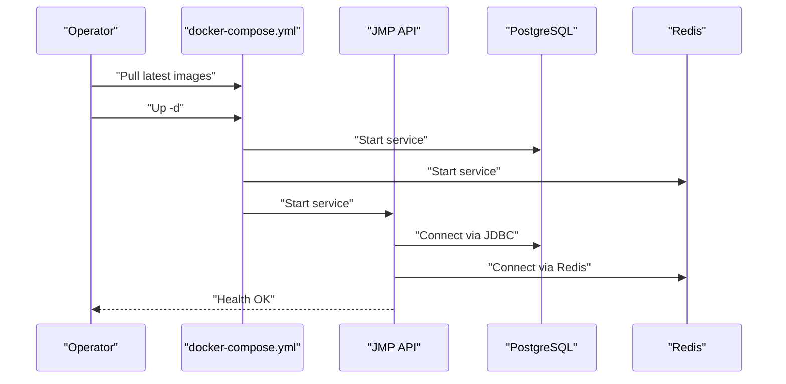
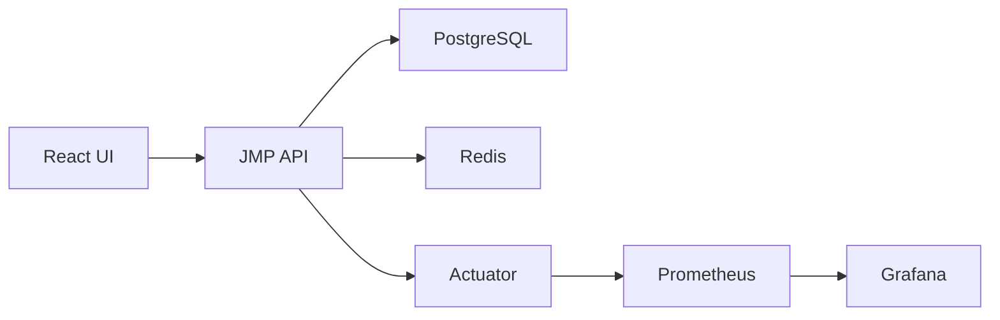

# Operational Procedures

<cite>
**Referenced Files in This Document**
- [docker-compose.yml](file://docker-compose.yml)
- [Dockerfile](file://Dockerfile)
- [application.yml](file://jmp-web/src/main/resources/application.yml)
- [prometheus.yml](file://monitoring/prometheus.yml)
- [datasources.yml](file://monitoring/grafana/datasources/datasources.yml)
- [SecurityConfig.java](file://jmp-infrastructure/src/main/java/com/jmp/infrastructure/security/SecurityConfig.java)
- [JwtAuthenticationFilter.java](file://jmp-infrastructure/src/main/java/com/jmp/infrastructure/security/JwtAuthenticationFilter.java)
- [JmpApplication.java](file://jmp-web/src/main/java/com/jmp/web/JmpApplication.java)
- [V1__init_schema.sql](file://jmp-web/src/main/resources/db/migration/V1__init_schema.sql)
- [UserService.java](file://jmp-application/src/main/java/com/jmp/application/service/UserService.java)
- [AuditService.java](file://jmp-application/src/main/java/com/jmp/application/service/AuditService.java)
- [AnalyticsService.java](file://jmp-application/src/main/java/com/jmp/application/service/AnalyticsService.java)
- [package.json](file://jmp-ui/package.json)
</cite>

## Table of Contents
1. [Introduction](#introduction)
2. [Project Structure](#project-structure)
3. [Core Components](#core-components)
4. [Architecture Overview](#architecture-overview)
5. [Detailed Component Analysis](#detailed-component-analysis)
6. [Dependency Analysis](#dependency-analysis)
7. [Performance Considerations](#performance-considerations)
8. [Troubleshooting Guide](#troubleshooting-guide)
9. [Conclusion](#conclusion)
10. [Appendices](#appendices)

## Introduction
This document defines comprehensive operational procedures for the Jitsi Management Platform (JMP). It covers day-to-day operations, monitoring and alerting, logging and troubleshooting, database maintenance and performance, user and tenant administration, access control, updates and upgrades, incident response, change management, capacity planning, and disaster recovery. The content is grounded in the repository’s configuration and implementation to ensure accuracy and practical applicability.

## Project Structure
JMP is a multi-module Spring Boot application packaged with Docker and orchestrated via Docker Compose. Monitoring is integrated with Prometheus and Grafana. The backend exposes Spring Boot Actuator metrics and health endpoints, while the frontend is a React application.

**Diagram sources**
- [docker-compose.yml:6-118](file://docker-compose.yml#L6-L118)
- [Dockerfile:1-54](file://Dockerfile#L1-L54)
- [application.yml:93-112](file://jmp-web/src/main/resources/application.yml#L93-L112)

**Section sources**
- [docker-compose.yml:1-129](file://docker-compose.yml#L1-L129)
- [Dockerfile:1-54](file://Dockerfile#L1-L54)
- [application.yml:1-128](file://jmp-web/src/main/resources/application.yml#L1-L128)

## Core Components
- Container orchestration: PostgreSQL, Redis, JMP API, Prometheus, Grafana, and React UI.
- Security: JWT-based stateless authentication with BCrypt password hashing and CORS configuration.
- Observability: Spring Boot Actuator exposing health and Prometheus metrics; Prometheus scraping API metrics; Grafana dashboards provisioned.
- Data: PostgreSQL schema with tenants, users, roles, permissions, conferences, and audit logs; Flyway migrations enabled.
- Operations: Non-root runtime container, health checks, and structured logging with trace correlation.

**Section sources**
- [docker-compose.yml:8-118](file://docker-compose.yml#L8-L118)
- [application.yml:12-112](file://jmp-web/src/main/resources/application.yml#L12-L112)
- [SecurityConfig.java:42-88](file://jmp-infrastructure/src/main/java/com/jmp/infrastructure/security/SecurityConfig.java#L42-L88)
- [JwtAuthenticationFilter.java:27-95](file://jmp-infrastructure/src/main/java/com/jmp/infrastructure/security/JwtAuthenticationFilter.java#L27-L95)
- [V1__init_schema.sql:10-172](file://jmp-web/src/main/resources/db/migration/V1__init_schema.sql#L10-L172)

## Architecture Overview
The system runs as a containerized stack with clear separation of concerns:
- API service exposes REST endpoints and metrics.
- PostgreSQL persists core entities and audit logs.
- Redis supports caching and session-less operations.
- Prometheus scrapes Actuator metrics; Grafana visualizes dashboards.
- React UI consumes the API and renders dashboards and administrative views.

**Diagram sources**
- [docker-compose.yml:44-118](file://docker-compose.yml#L44-L118)
- [application.yml:93-112](file://jmp-web/src/main/resources/application.yml#L93-L112)
- [prometheus.yml:18-22](file://monitoring/prometheus.yml#L18-L22)
- [datasources.yml:4-11](file://monitoring/grafana/datasources/datasources.yml#L4-L11)

## Detailed Component Analysis

### System Monitoring Setup, Metrics Collection, and Alerting
- Metrics exposure: Actuator endpoints include health, info, and Prometheus metrics; configured to expose Prometheus metrics.
- Scraping: Prometheus configured to scrape the API’s Actuator Prometheus endpoint at a 5-second interval.
- Dashboards: Grafana is provisioned with a Prometheus datasource pointing to the Prometheus service.

Operational procedures:
- Verify API health endpoint availability at the configured Actuator base path.
- Confirm Prometheus scrape job for the API is healthy and collecting samples.
- Validate Grafana datasource connectivity and dashboard provisioning.
- Define alerting rules in Prometheus for critical thresholds (e.g., degraded health, high error rates, low free disk/memory).

**Section sources**
- [application.yml:93-112](file://jmp-web/src/main/resources/application.yml#L93-L112)
- [prometheus.yml:18-22](file://monitoring/prometheus.yml#L18-L22)
- [datasources.yml:4-11](file://monitoring/grafana/datasources/datasources.yml#L4-L11)

### Log Management and Centralized Logging
- Logging level and format are configured in application YAML with structured JSON output and trace correlation via MDC keys.
- Console pattern includes a trace identifier for correlating logs across services.

Operational procedures:
- Rotate and archive logs per site retention policies.
- Ship logs to a centralized logging solution (e.g., ELK, Loki, Splunk) using the JSON structured format.
- Correlate incidents using the trace identifiers present in log entries.

**Section sources**
- [application.yml:80-91](file://jmp-web/src/main/resources/application.yml#L80-L91)

### Database Maintenance, Backup Verification, and Performance Monitoring
- Database: PostgreSQL 16 with dedicated volume for data persistence.
- Schema: Initial migration defines tenants, users, roles, permissions, conferences, participants, and audit logs with supporting indexes.
- Migrations: Flyway enabled with explicit migration locations and schema configuration.

Operational procedures:
- Schedule regular logical backups of the PostgreSQL database and verify restore procedures periodically.
- Monitor database performance using Grafana dashboards and Postgres-specific metrics exposed by the application.
- Review and maintain indexes defined in the initial migration to support query patterns.
- Use migration baseline-on-migrate behavior to manage schema evolution safely.

**Section sources**
- [docker-compose.yml:8-26](file://docker-compose.yml#L8-L26)
- [V1__init_schema.sql:10-172](file://jmp-web/src/main/resources/db/migration/V1__init_schema.sql#L10-L172)
- [application.yml:39-44](file://jmp-web/src/main/resources/application.yml#L39-L44)

### User Account Management, Tenant Administration, and Access Control
- Tenant model: Tenants encapsulate multi-tenancy with limits and settings.
- RBAC and ABAC: Roles and permissions are modeled with hierarchical roles and fine-grained permissions.
- User lifecycle: Creation, retrieval, listing, searching, updating, soft deletion, and permission checks are supported.
- Access control: JWT-based stateless authentication with BCrypt password hashing and CORS configuration for trusted origins.

Operational procedures:
- Provision users under appropriate tenants and assign roles aligned to least privilege.
- Enforce tenant scoping in all user-related operations.
- Regularly review and revoke unnecessary permissions.
- Monitor authentication and authorization events via audit logs.

**Diagram sources**
- [V1__init_schema.sql:10-87](file://jmp-web/src/main/resources/db/migration/V1__init_schema.sql#L10-L87)
- [UserService.java:44-145](file://jmp-application/src/main/java/com/jmp/application/service/UserService.java#L44-L145)

**Section sources**
- [V1__init_schema.sql:10-87](file://jmp-web/src/main/resources/db/migration/V1__init_schema.sql#L10-L87)
- [UserService.java:44-145](file://jmp-application/src/main/java/com/jmp/application/service/UserService.java#L44-L145)
- [SecurityConfig.java:42-88](file://jmp-infrastructure/src/main/java/com/jmp/infrastructure/security/SecurityConfig.java#L42-L88)
- [JwtAuthenticationFilter.java:27-95](file://jmp-infrastructure/src/main/java/com/jmp/infrastructure/security/JwtAuthenticationFilter.java#L27-L95)

### System Updates, Patch Management, and Upgrade Procedures
- Build pipeline: Multi-stage Docker build with a non-root runtime user and health checks.
- Runtime health: Health checks for API, PostgreSQL, and Redis via Docker Compose.
- Configuration: Environment variables for secrets and runtime configuration.

Operational procedures:
- Test updates in a staging environment mirroring production configuration.
- Perform rolling updates or recreate containers after verifying health checks.
- Maintain immutable images and track versions via container registry tags.
- Apply database migrations during deployments using Flyway-managed migrations.

**Diagram sources**
- [docker-compose.yml:44-71](file://docker-compose.yml#L44-L71)
- [Dockerfile:31-54](file://Dockerfile#L31-L54)
- [application.yml:12-50](file://jmp-web/src/main/resources/application.yml#L12-L50)

**Section sources**
- [Dockerfile:1-54](file://Dockerfile#L1-L54)
- [docker-compose.yml:44-71](file://docker-compose.yml#L44-L71)
- [application.yml:12-50](file://jmp-web/src/main/resources/application.yml#L12-L50)

### Incident Response Protocols, Change Management Processes, and Runbooks
- Health monitoring: API exposes health probes; Redis and PostgreSQL health checks are defined in Compose.
- Logging and tracing: Structured logs with trace identifiers enable quick incident triage.
- Audit logging: Comprehensive audit service records authentication, user management, conference, recording, and security events.

Operational procedures:
- Define escalation criteria for failing health checks and sustained error rates.
- Use audit logs to reconstruct timelines of incidents and identify responsible actors.
- Document runbooks for common incidents (e.g., database outages, API degradation, authentication failures).
- Enforce change management: require approvals, pre/post validations, and rollback plans for all changes.

**Section sources**
- [docker-compose.yml:19-23](file://docker-compose.yml#L19-L23)
- [application.yml:100-103](file://jmp-web/src/main/resources/application.yml#L100-L103)
- [AuditService.java:29-72](file://jmp-application/src/main/java/com/jmp/application/service/AuditService.java#L29-L72)

### Capacity Planning, Resource Optimization, and Cost Management
- Database pooling: HikariCP settings define connection pool sizing and timeouts.
- Redis pooling: Connection pool sizing configured for throughput.
- Metrics-driven planning: Use Prometheus and Grafana to monitor CPU, memory, connections, and query performance.

Operational procedures:
- Baseline resource usage and correlate with business metrics.
- Right-size database and cache pools based on observed concurrency and latency.
- Optimize queries and indexes to reduce database load.
- Monitor container resource consumption and adjust limits accordingly.

**Section sources**
- [application.yml:17-22](file://jmp-web/src/main/resources/application.yml#L17-L22)
- [application.yml:52-56](file://jmp-web/src/main/resources/application.yml#L52-L56)

### Disaster Recovery, Business Continuity, and Emergency Response
- Backup strategy: Regular logical backups of PostgreSQL with periodic restore tests.
- Network isolation: Dedicated Docker network for services.
- Health checks: Automated detection of unhealthy services.

Operational procedures:
- Maintain offsite backups and test restoration regularly.
- Document RTO/RPO targets and validate against DR procedures.
- Establish emergency contacts and communication channels.
- Automate remediation steps where possible (e.g., restart unhealthy containers).

**Section sources**
- [docker-compose.yml:120-129](file://docker-compose.yml#L120-L129)
- [application.yml:12-22](file://jmp-web/src/main/resources/application.yml#L12-L22)

## Dependency Analysis
Key dependencies and relationships:
- API depends on PostgreSQL for persistence and Redis for caching.
- Prometheus scrapes Actuator metrics from the API.
- Grafana consumes Prometheus metrics for visualization.
- UI communicates with the API over HTTP.

**Diagram sources**
- [docker-compose.yml:44-118](file://docker-compose.yml#L44-L118)
- [application.yml:93-112](file://jmp-web/src/main/resources/application.yml#L93-L112)

**Section sources**
- [docker-compose.yml:44-118](file://docker-compose.yml#L44-L118)
- [application.yml:93-112](file://jmp-web/src/main/resources/application.yml#L93-L112)

## Performance Considerations
- Database tuning: Adjust HikariCP pool sizes and timeouts based on workload.
- Index utilization: Leverage existing indexes on tenants, users, conferences, and participants to optimize queries.
- Caching: Use Redis for hot data and rate-limiting to reduce database load.
- Metrics and alerts: Track latency, error rates, and saturation indicators to preempt performance issues.

[No sources needed since this section provides general guidance]

## Troubleshooting Guide
Common scenarios and actions:
- API fails health checks: Inspect container logs, verify database and Redis connectivity, and confirm environment variables.
- Slow queries: Review database indexes and query patterns; use Grafana dashboards to identify bottlenecks.
- Authentication failures: Validate JWT secrets, CORS configuration, and user credentials; check audit logs for failed attempts.
- Metrics missing: Confirm Actuator exposure, Prometheus scrape configuration, and Grafana datasource.

**Section sources**
- [docker-compose.yml:66-71](file://docker-compose.yml#L66-L71)
- [application.yml:93-112](file://jmp-web/src/main/resources/application.yml#L93-L112)
- [prometheus.yml:18-22](file://monitoring/prometheus.yml#L18-L22)
- [datasources.yml:4-11](file://monitoring/grafana/datasources/datasources.yml#L4-L11)

## Conclusion
This operational guide consolidates monitoring, logging, database maintenance, access control, updates, incident response, capacity planning, and disaster recovery for the Jitsi Management Platform. By following the documented procedures and leveraging the provided configurations, operators can maintain a reliable, secure, and observable system.

[No sources needed since this section summarizes without analyzing specific files]

## Appendices
- Frontend dependencies and build scripts are defined in the React UI package manifest.

**Section sources**
- [package.json:1-39](file://jmp-ui/package.json#L1-L39)